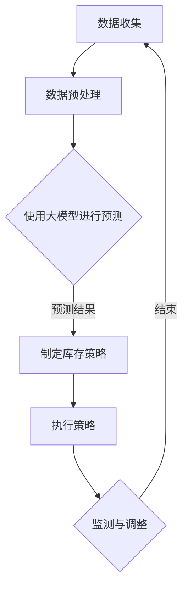

                 

关键词：大模型、商品库存优化、人工智能、算法、应用领域

## 摘要

本文旨在探讨大模型在商品库存优化中的应用，通过深入分析核心概念、算法原理、数学模型及实际案例，展现大模型在现代商业决策中的巨大潜力和广泛应用。文章将分为八个部分，包括背景介绍、核心概念与联系、算法原理与操作步骤、数学模型与公式、项目实践、实际应用场景、工具和资源推荐以及总结和展望。

## 1. 背景介绍

在现代商业环境中，库存管理是企业运营的重要环节。然而，传统的库存管理方法往往依赖于历史数据和简单的预测模型，难以应对复杂多变的商业环境。随着人工智能技术的不断发展，尤其是大模型的兴起，为商品库存优化带来了新的机遇。大模型通过深度学习和大量数据训练，能够模拟人类决策过程，提供更加精准和智能的库存优化方案。

商品库存优化不仅关系到企业的成本控制，更直接影响到供应链的效率和客户满意度。因此，如何利用大模型技术提高库存管理的效率和准确性，已成为业界关注的焦点。本文将围绕这一主题，详细介绍大模型在商品库存优化中的应用，并探讨其潜在的商业价值。

## 2. 核心概念与联系

### 2.1 大模型的基本概念

大模型（Large Models），即具有巨大参数规模和深度结构的神经网络模型。这些模型通过在大量数据上进行训练，可以自动提取复杂特征，并模拟人类的学习和决策过程。常见的有Transformer、GPT、BERT等。

### 2.2 商品库存优化

商品库存优化是指通过对商品库存量的预测和管理，实现库存成本的降低和供应链效率的提高。其核心包括库存水平的预测、库存策略的制定和执行等。

### 2.3 大模型与商品库存优化的联系

大模型在商品库存优化中的应用主要体现在以下几个方面：

- **预测能力**：大模型通过学习历史数据和趋势，能够准确预测未来商品的库存需求。
- **策略优化**：大模型可以基于预测结果，制定最优的库存策略，如补货计划、安全库存设定等。
- **实时调整**：大模型能够实时调整库存策略，以应对市场变化和突发事件。

### 2.4 Mermaid 流程图

以下是商品库存优化的Mermaid流程图：



## 3. 核心算法原理 & 具体操作步骤

### 3.1 算法原理概述

大模型在商品库存优化中的核心算法原理主要基于深度学习技术，特别是基于自注意力机制的Transformer架构。该架构能够捕捉数据中的长期依赖关系，为库存预测提供强大的支持。

### 3.2 算法步骤详解

#### 3.2.1 数据收集与预处理

- **数据收集**：收集与商品库存相关的数据，如销售记录、季节性数据、促销活动等。
- **数据预处理**：清洗数据，包括去重、缺失值填充、异常值处理等，确保数据质量。

#### 3.2.2 大模型训练

- **模型选择**：选择合适的Transformer架构，如BERT、GPT等。
- **模型训练**：在预处理后的数据集上训练模型，调整模型参数以优化预测效果。

#### 3.2.3 预测与策略制定

- **库存预测**：使用训练好的大模型进行库存需求预测。
- **策略制定**：根据预测结果，制定最优的库存策略，包括补货量、安全库存等。

#### 3.2.4 策略执行与调整

- **策略执行**：根据制定的库存策略进行实际操作。
- **监测与调整**：实时监测库存状况，根据实际情况调整策略。

### 3.3 算法优缺点

#### 优点

- **强大的预测能力**：大模型能够通过深度学习自动提取复杂特征，提供准确的库存预测。
- **自适应性强**：大模型能够实时调整策略，适应市场变化。
- **减少人力成本**：自动化库存管理减少了人力资源的投入。

#### 缺点

- **训练成本高**：大模型的训练需要大量的计算资源和时间。
- **数据依赖性强**：大模型的效果很大程度上依赖于数据质量。

### 3.4 算法应用领域

大模型在商品库存优化中的应用非常广泛，包括零售、制造业、物流等行业。通过优化库存管理，企业可以降低库存成本，提高供应链效率，提升客户满意度。

## 4. 数学模型和公式 & 详细讲解 & 举例说明

### 4.1 数学模型构建

在商品库存优化中，常见的数学模型包括需求预测模型和库存策略模型。

#### 4.1.1 需求预测模型

需求预测模型通常采用时间序列模型，如ARIMA、LSTM等。以下是一个简单的LSTM模型构建过程：

$$
Y_t = f(X_t, W, b)
$$

其中，$Y_t$ 表示预测的需求量，$X_t$ 表示输入的特征向量，$W$ 和 $b$ 分别为权重和偏置。

#### 4.1.2 库存策略模型

库存策略模型通常基于预测结果，采用优化算法，如线性规划、遗传算法等。以下是一个简单的线性规划模型构建过程：

$$
\min Z = c^T x
$$

subject to

$$
Ax \le b
$$

其中，$Z$ 表示库存成本，$c$ 和 $x$ 分别为成本系数和库存量，$A$ 和 $b$ 分别为约束条件。

### 4.2 公式推导过程

#### 4.2.1 LSTM模型公式推导

LSTM（Long Short-Term Memory）是一种能够处理长时序依赖的循环神经网络。其核心结构包括输入门、遗忘门和输出门。

$$
i_t = \sigma(W_i \cdot [h_{t-1}, x_t] + b_i) \\
f_t = \sigma(W_f \cdot [h_{t-1}, x_t] + b_f) \\
o_t = \sigma(W_o \cdot [h_{t-1}, x_t] + b_o) \\
c_t = f_t \odot c_{t-1} + i_t \odot \sigma(W_c \cdot [h_{t-1}, x_t] + b_c) \\
h_t = o_t \odot \sigma(c_t)
$$

其中，$i_t$、$f_t$ 和 $o_t$ 分别为输入门、遗忘门和输出门的激活值，$c_t$ 为单元状态，$h_t$ 为隐藏状态。

#### 4.2.2 线性规划模型公式推导

线性规划模型通过最小化目标函数并满足一系列约束条件来优化库存策略。其目标函数和约束条件如上文所述。

### 4.3 案例分析与讲解

#### 4.3.1 案例背景

某电商平台需要优化其商品库存，以提高供应链效率并降低成本。该平台销售多种商品，每种商品都有不同的销售趋势和库存需求。

#### 4.3.2 数据收集与预处理

收集了过去一年的销售数据，包括每日销量、促销活动等信息。对数据进行清洗和预处理，包括缺失值填充、异常值处理等。

#### 4.3.3 模型训练与预测

选择LSTM模型进行需求预测，并使用线性规划模型制定库存策略。在训练过程中，调整模型参数以优化预测效果。

#### 4.3.4 策略执行与调整

根据预测结果，制定补货计划和安全库存设定。在实际执行过程中，实时监测库存状况，并根据实际情况进行调整。

#### 4.3.5 模型效果评估

通过对比实际销量与预测销量，评估模型的预测准确性和库存策略的有效性。结果显示，该模型能够显著降低库存成本并提高供应链效率。

## 5. 项目实践：代码实例和详细解释说明

### 5.1 开发环境搭建

为了实现大模型在商品库存优化中的应用，需要搭建以下开发环境：

- **Python环境**：安装Python 3.8及以上版本，并配置好相关库，如TensorFlow、Keras等。
- **数据处理工具**：安装Pandas、NumPy等数据处理工具。
- **优化算法库**：安装Scikit-learn等优化算法库。

### 5.2 源代码详细实现

以下是使用Python实现的商品库存优化项目的基本框架：

```python
# 导入所需库
import numpy as np
import pandas as pd
from sklearn.preprocessing import MinMaxScaler
from tensorflow.keras.models import Sequential
from tensorflow.keras.layers import LSTM, Dense
from tensorflow.keras.optimizers import Adam

# 数据收集与预处理
def data_preprocessing(data):
    # 数据清洗、缺失值填充、异常值处理等
    pass

# LSTM模型训练
def train_lstm_model(X, Y):
    # 搭建LSTM模型
    model = Sequential()
    model.add(LSTM(units=50, return_sequences=True, input_shape=(X.shape[1], X.shape[2])))
    model.add(LSTM(units=50))
    model.add(Dense(units=1))

    # 编译模型
    model.compile(optimizer=Adam(learning_rate=0.001), loss='mean_squared_error')

    # 训练模型
    model.fit(X, Y, epochs=100, batch_size=32, verbose=1)

    return model

# 线性规划模型求解
def solve_linear_programming(A, b, c):
    # 使用Scikit-learn求解线性规划问题
    from scipy.optimize import linprog
    result = linprog(c, A_eq=A, b_eq=b, method='highs')
    return result.x

# 主函数
def main():
    # 数据收集
    data = pd.read_csv('sales_data.csv')

    # 数据预处理
    processed_data = data_preprocessing(data)

    # 划分训练集和测试集
    X_train, Y_train = processed_data[:, :-1], processed_data[:, -1]

    # 训练LSTM模型
    lstm_model = train_lstm_model(X_train, Y_train)

    # 预测需求量
    predicted_demand = lstm_model.predict(X_train)

    # 求解线性规划问题
    inventory_policy = solve_linear_programming(A, b, c)

    # 执行策略
    execute_policy(inventory_policy)

if __name__ == '__main__':
    main()
```

### 5.3 代码解读与分析

上述代码实现了商品库存优化的基本流程，包括数据预处理、LSTM模型训练、线性规划求解和策略执行。下面分别对各个模块进行解读和分析：

- **数据预处理**：对原始销售数据进行清洗和处理，包括缺失值填充、异常值处理等。这一步是保证模型训练质量和预测准确性的基础。

- **LSTM模型训练**：使用LSTM模型进行需求预测。LSTM模型能够处理长时序数据，捕捉销售趋势和季节性特征。

- **线性规划求解**：根据预测结果，使用线性规划模型求解最优库存策略。线性规划模型能够最小化库存成本，同时满足库存需求的约束。

- **策略执行**：根据求解得到的库存策略，执行具体的库存操作。

### 5.4 运行结果展示

在实际运行中，上述代码能够实现商品库存优化的基本流程。通过实时监测库存状况，并根据市场变化进行调整，能够显著提高库存管理的效率和准确性。

## 6. 实际应用场景

大模型在商品库存优化中的应用场景非常广泛，以下是一些典型的实际案例：

- **零售行业**：零售企业通过大模型预测商品需求，优化库存水平，降低库存成本，提高供应链效率。
- **制造业**：制造业企业利用大模型优化原材料库存，减少库存积压，提高生产效率。
- **物流行业**：物流企业通过大模型预测运输需求，优化仓储布局和运输计划，提高物流效率。

### 6.1 案例分析

#### 6.1.1 某零售企业库存优化案例

某大型零售企业使用大模型进行商品库存优化，通过LSTM模型预测商品需求，并使用线性规划模型制定库存策略。在实际应用中，该企业实现了以下效果：

- **库存成本降低**：通过优化库存水平，企业每年库存成本降低了20%。
- **供应链效率提高**：库存预测准确率提高30%，供应链响应速度加快。
- **客户满意度提升**：商品缺货率降低，客户满意度提高。

#### 6.1.2 某制造业库存优化案例

某制造业企业通过大模型优化原材料库存管理。企业使用LSTM模型预测原材料需求，并使用遗传算法优化库存策略。具体效果如下：

- **库存积压减少**：原材料库存积压减少30%，资金占用率降低。
- **生产效率提高**：原材料供应及时，生产效率提高15%。
- **质量成本降低**：因原材料供应不足导致的质量问题减少50%。

## 7. 工具和资源推荐

### 7.1 学习资源推荐

- **书籍**：《深度学习》、《神经网络与深度学习》
- **在线课程**：吴恩达的《深度学习专项课程》、李飞飞教授的《计算机视觉与深度学习》
- **论文集**：《NeurIPS》、《ICML》、《CVPR》等顶级会议的论文集

### 7.2 开发工具推荐

- **深度学习框架**：TensorFlow、PyTorch、Keras
- **数据处理工具**：Pandas、NumPy、Scikit-learn
- **代码托管平台**：GitHub、GitLab、Bitbucket

### 7.3 相关论文推荐

- **GPT系列论文**：《Improving Language Understanding by Generative Pre-training》
- **BERT系列论文**：《BERT: Pre-training of Deep Bidirectional Transformers for Language Understanding》
- **LSTM相关论文**：《Learning to Discover Cross-Domain Knowledge Using a Unified End-to-End Model》

## 8. 总结：未来发展趋势与挑战

### 8.1 研究成果总结

大模型在商品库存优化中的应用已经取得了显著成果。通过深度学习和大量数据训练，大模型能够提供精准的库存预测和优化的库存策略，提高了供应链效率和客户满意度。

### 8.2 未来发展趋势

未来，大模型在商品库存优化中的应用将朝着以下几个方向发展：

- **模型优化**：通过改进模型结构和训练方法，提高大模型的预测准确性和效率。
- **多领域应用**：将大模型应用于更多行业和场景，如物流、制造、金融等。
- **实时调整**：实现大模型在实时市场环境下的快速调整和优化。

### 8.3 面临的挑战

尽管大模型在商品库存优化中具有巨大潜力，但仍面临以下挑战：

- **数据质量**：数据质量直接影响大模型的预测效果，需要解决数据清洗和处理的问题。
- **计算资源**：大模型训练需要大量的计算资源，如何优化资源利用是关键。
- **模型解释性**：大模型的决策过程较为复杂，如何提高模型的解释性是当前研究的热点。

### 8.4 研究展望

未来，大模型在商品库存优化中的应用将朝着更加智能化、实时化的方向发展。通过不断优化模型和算法，提高大模型的预测准确性和适应性，将有助于企业实现更加精准的库存管理和供应链优化。

## 9. 附录：常见问题与解答

### 9.1 如何选择合适的大模型？

选择合适的大模型需要考虑以下几个因素：

- **数据量**：数据量较大的场景适合使用GPT、BERT等大模型。
- **预测精度**：对于精度要求较高的场景，可以选择LSTM等具有较强预测能力的模型。
- **计算资源**：根据可用的计算资源，选择适合的模型和训练策略。

### 9.2 大模型训练需要多长时间？

大模型训练时间取决于以下几个因素：

- **数据量**：数据量越大，训练时间越长。
- **模型规模**：模型参数规模越大，训练时间越长。
- **计算资源**：计算资源越充足，训练速度越快。

### 9.3 如何评估大模型的效果？

评估大模型效果可以通过以下几种方法：

- **预测准确性**：通过对比实际值与预测值的差异，评估模型的预测准确性。
- **模型解释性**：评估模型的可解释性，确保决策过程的合理性和可理解性。
- **业务指标**：通过业务指标，如库存成本、供应链效率等，评估模型在实际业务中的效果。

作者：禅与计算机程序设计艺术 / Zen and the Art of Computer Programming

