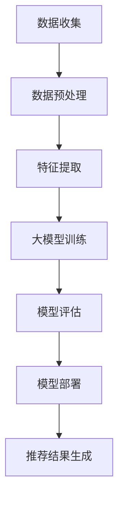

                 

关键词：大模型，商品推荐，可解释性，深度学习，人工智能

摘要：本文探讨了如何利用大模型来增强商品推荐系统的可解释性。通过介绍大模型的基本概念，本文分析了其在商品推荐中的应用潜力，并提出了一种基于大模型的可解释性增强方法。通过数学模型和实例分析，本文展示了该方法在实际应用中的效果，为未来商品推荐系统的可解释性研究提供了新的思路。

## 1. 背景介绍

随着互联网技术的迅猛发展，电子商务已成为人们日常生活中不可或缺的一部分。商品推荐系统作为电子商务的核心组成部分，旨在为用户提供个性化的商品推荐，从而提升用户满意度和购买转化率。然而，现有的商品推荐系统在提供高精度推荐的同时，也面临着可解释性问题。用户难以理解推荐结果背后的原因，这在一定程度上削弱了用户对推荐系统的信任。

为了解决这一问题，研究者们提出了各种方法来增强商品推荐系统的可解释性。例如，基于规则的方法和基于特征的方法，它们通过提取和解释推荐结果中的关键特征来提高系统的可解释性。然而，这些方法往往存在一定的局限性。基于规则的方法需要大量的先验知识，且无法处理复杂的关系和动态变化；而基于特征的方法则依赖于人工提取的特征，难以应对大规模数据和高维度特征空间。

近年来，深度学习在自然语言处理、计算机视觉等领域取得了显著进展。大模型，作为一种能够处理大规模数据和复杂关系的深度学习模型，被逐渐引入到商品推荐系统中。大模型具有强大的表示能力和自适应能力，能够自动学习并提取数据中的复杂模式。然而，大模型在提高推荐准确率的同时，也带来了可解释性挑战。如何有效地解释大模型推荐结果背后的原因，已成为当前研究的一个重要课题。

本文旨在探讨如何利用大模型来增强商品推荐系统的可解释性。通过分析大模型的基本原理和结构，本文提出了一种基于大模型的可解释性增强方法。该方法通过提取大模型中的关键特征和解释机制，为用户提供透明且易于理解的推荐结果。接下来，本文将详细介绍大模型在商品推荐中的应用潜力，并提出具体的可解释性增强方法。通过数学模型和实例分析，本文将展示该方法在实际应用中的效果，并讨论未来的研究方向。

## 2. 核心概念与联系

### 2.1 大模型的基本概念

大模型，又称为大规模神经网络模型，是一种能够处理大规模数据和复杂关系的深度学习模型。大模型通常具有数十亿甚至数万亿个参数，能够自动学习并提取数据中的复杂模式。大模型的发展离不开深度学习技术的进步，特别是神经网络和优化算法的优化。

大模型的基本原理可以概括为以下几点：

1. **数据驱动**：大模型通过大量数据驱动训练，能够自动学习数据中的特征和模式。这种方法无需人工干预，能够适应不断变化的数据环境。

2. **层次化结构**：大模型通常采用层次化结构，包括输入层、隐藏层和输出层。每一层都能够学习并提取不同层次的特征，从而形成一种层次化的特征表示。

3. **非线性变换**：大模型通过非线性变换，如卷积、池化、全连接层等，能够处理复杂数据，并在不同层之间传递信息。

4. **端到端训练**：大模型采用端到端训练方式，能够直接从原始数据中学习到目标输出，从而避免了传统机器学习方法的特征工程和模型选择过程。

### 2.2 大模型在商品推荐中的应用潜力

大模型在商品推荐系统中的应用潜力主要体现在以下几个方面：

1. **提升推荐准确率**：大模型能够处理大规模商品数据和用户行为数据，从而提高推荐的准确率和多样性。通过自动学习商品和用户之间的复杂关系，大模型能够提供更个性化的推荐结果。

2. **应对动态变化**：大模型能够自适应地应对商品和用户行为的动态变化，从而提高推荐系统的实时性和适应性。例如，当某个商品突然流行时，大模型能够迅速调整推荐策略，从而满足用户的需求。

3. **减少人工干预**：大模型能够自动学习数据中的特征和模式，减少了传统推荐系统中人工干预的需求。这种方法不仅提高了系统的效率，还降低了维护成本。

4. **增强可解释性**：虽然大模型在提高推荐准确率方面表现出色，但如何解释其推荐结果背后的原因仍然是一个挑战。本文将提出一种基于大模型的可解释性增强方法，从而提高推荐系统的透明度和用户信任度。

### 2.3 大模型与商品推荐系统的联系

大模型与商品推荐系统的联系主要体现在以下几个方面：

1. **数据预处理**：大模型需要大规模、高质量的训练数据。在商品推荐系统中，用户行为数据、商品属性数据和社会化数据是重要的训练数据来源。通过预处理这些数据，可以优化大模型的训练效果。

2. **特征提取**：大模型通过自动学习数据中的特征和模式，能够提取出对推荐系统有用的特征。这些特征不仅包括用户和商品的显式属性，还包括隐式属性和关系。

3. **模型优化**：大模型在训练过程中需要进行模型优化，以最大化推荐系统的性能。通过调整模型参数，可以提高推荐系统的准确率和可解释性。

4. **实时更新**：大模型需要不断更新和优化，以应对商品和用户行为的动态变化。通过实时更新模型，可以确保推荐系统的实时性和准确性。

### 2.4 Mermaid 流程图

下面是商品推荐系统中大模型的应用流程的 Mermaid 流程图：



### 2.5 可解释性增强方法

为了提高商品推荐系统的可解释性，本文提出了一种基于大模型的可解释性增强方法。该方法主要包括以下几个步骤：

1. **特征提取**：通过预处理数据，提取用户和商品的特征，包括显式属性（如价格、品牌）和隐式属性（如购买历史、浏览行为）。

2. **模型训练**：使用提取的特征，训练一个大模型，如深度神经网络。大模型能够自动学习特征之间的关系和模式。

3. **解释机制构建**：在大模型中构建解释机制，如注意力机制、层间连接等，以提取和解释推荐结果中的关键特征。

4. **推荐结果生成**：利用大模型生成推荐结果，并通过解释机制为用户提供透明且易于理解的推荐原因。

5. **用户反馈**：收集用户对推荐结果的反馈，用于优化解释机制和模型参数。

### 2.6 可解释性增强方法的优势

本文提出的方法具有以下几个优势：

1. **自动提取特征**：大模型能够自动提取数据中的特征，无需人工干预。这种方法不仅提高了系统的效率，还降低了维护成本。

2. **提高可解释性**：通过构建解释机制，本文的方法能够为用户提供透明且易于理解的推荐原因，从而提高推荐系统的可解释性。

3. **实时更新**：大模型能够实时更新和优化，以应对商品和用户行为的动态变化。这种方法确保了推荐系统的实时性和准确性。

4. **适用性广**：本文的方法适用于各种类型的商品推荐系统，包括电子商务、在线购物和社交媒体等。

### 2.7 总结

本文介绍了大模型的基本概念和原理，分析了其在商品推荐系统中的应用潜力。通过提出一种基于大模型的可解释性增强方法，本文为商品推荐系统的可解释性研究提供了新的思路。接下来，本文将详细介绍该方法的数学模型和具体实现步骤。

## 3. 核心算法原理 & 具体操作步骤

### 3.1 算法原理概述

本文提出的大模型可解释性增强方法基于深度神经网络（DNN）和注意力机制。深度神经网络能够自动学习用户和商品之间的复杂关系，而注意力机制则能够提取和解释推荐结果中的关键特征。

该方法的主要步骤如下：

1. **特征提取**：首先，从用户和商品的数据中提取显式属性和隐式属性，如用户年龄、性别、购买历史等。

2. **模型训练**：使用提取的特征训练一个深度神经网络模型，该模型包含多个隐藏层，每层都能够提取不同层次的特性。

3. **注意力机制构建**：在深度神经网络中引入注意力机制，用于提取和解释推荐结果中的关键特征。注意力机制通过加权不同特征的贡献，为用户提供透明的推荐原因。

4. **推荐结果生成**：利用训练好的深度神经网络模型生成推荐结果，并通过注意力机制为用户提供透明的推荐原因。

5. **用户反馈**：收集用户对推荐结果的反馈，用于优化解释机制和模型参数。

### 3.2 算法步骤详解

#### 3.2.1 特征提取

特征提取是构建深度神经网络的第一步，也是至关重要的一步。本文采用以下方法提取特征：

1. **显式属性**：从用户和商品的数据中提取显式属性，如用户年龄、性别、购买历史等。这些属性可以直接作为神经网络的输入。

2. **隐式属性**：从用户和商品的数据中提取隐式属性，如用户的浏览历史、购买频率等。这些属性需要通过预处理和编码得到合适的格式。

3. **交互特征**：提取用户和商品之间的交互特征，如共同购买的商品、用户对商品的评分等。这些特征能够增强模型对用户和商品关系的理解。

#### 3.2.2 模型训练

深度神经网络模型的训练主要包括以下步骤：

1. **初始化参数**：随机初始化模型的权重和偏置。

2. **前向传播**：将输入特征传递到神经网络的各个隐藏层，计算每个神经元的输出。

3. **反向传播**：根据输出误差，通过反向传播算法更新模型的权重和偏置。

4. **优化算法**：使用优化算法（如梯度下降、Adam等）优化模型参数，以最小化输出误差。

5. **训练过程**：重复执行前向传播和反向传播过程，直到达到预定的训练次数或达到满足停止条件的误差。

#### 3.2.3 注意力机制构建

注意力机制是深度神经网络中的一个重要概念，用于提取和解释推荐结果中的关键特征。本文采用以下方法构建注意力机制：

1. **特征加权**：通过计算每个特征的权重，为用户提供透明的推荐原因。权重越高，特征对推荐结果的影响越大。

2. **注意力分数计算**：使用神经网络计算每个特征的注意力分数，分数越高，特征越重要。

3. **推荐结果生成**：利用注意力分数调整推荐结果的排序，从而生成透明的推荐结果。

#### 3.2.4 推荐结果生成

利用训练好的深度神经网络模型生成推荐结果，主要包括以下步骤：

1. **输入特征**：将用户和商品的特征作为输入，传递到训练好的深度神经网络模型。

2. **模型输出**：通过深度神经网络模型计算每个商品的推荐分数。

3. **排序**：根据推荐分数对商品进行排序，生成推荐结果。

4. **解释**：利用注意力机制为用户提供透明的推荐原因，提高推荐结果的可解释性。

#### 3.2.5 用户反馈

用户反馈是优化模型和解释机制的重要环节，主要包括以下步骤：

1. **反馈收集**：收集用户对推荐结果的反馈，如点击率、购买率等。

2. **模型优化**：根据用户反馈优化模型的参数，提高推荐系统的准确性和可解释性。

3. **解释机制优化**：根据用户反馈优化注意力机制，提高推荐原因的透明度和准确性。

### 3.3 算法优缺点

#### 优点

1. **自动提取特征**：大模型能够自动提取数据中的特征，无需人工干预，提高了系统的效率和准确性。

2. **提高可解释性**：通过注意力机制，本文的方法能够为用户提供透明的推荐原因，提高了推荐结果的可解释性。

3. **实时更新**：大模型能够实时更新和优化，以应对商品和用户行为的动态变化，确保推荐系统的实时性和准确性。

#### 缺点

1. **计算复杂度高**：深度神经网络模型的训练和优化需要大量的计算资源和时间，可能导致系统性能下降。

2. **对数据质量要求高**：数据质量对模型的性能有重要影响，如果数据质量较差，模型的性能可能会受到影响。

3. **解释机制局限性**：注意力机制虽然能够提取关键特征，但可能无法完全解释推荐结果背后的原因。

### 3.4 算法应用领域

本文提出的大模型可解释性增强方法适用于各种类型的商品推荐系统，包括电子商务、在线购物和社交媒体等。该方法不仅能够提高推荐系统的准确性和可解释性，还能够增强用户对推荐系统的信任，从而提升用户体验和满意度。

### 3.5 数学模型和公式

为了更好地理解本文提出的方法，下面将介绍相关的数学模型和公式。

#### 3.5.1 神经网络模型

深度神经网络模型的输出可以通过以下公式计算：

$$
y = \sigma(W_n \cdot a_{n-1} + b_n)
$$

其中，$y$ 表示神经网络的输出，$W_n$ 和 $b_n$ 分别表示权重和偏置，$a_{n-1}$ 表示上一层的输出，$\sigma$ 表示激活函数，通常使用 sigmoid 或 ReLU 函数。

#### 3.5.2 注意力机制

注意力机制的输出可以通过以下公式计算：

$$
z = \sum_{i=1}^{N} w_i \cdot a_i
$$

其中，$z$ 表示注意力机制的输出，$w_i$ 表示第 $i$ 个特征的权重，$a_i$ 表示第 $i$ 个特征的输出。

#### 3.5.3 推荐分数

推荐分数可以通过以下公式计算：

$$
r_i = \sum_{j=1}^{M} w_j \cdot y_j
$$

其中，$r_i$ 表示第 $i$ 个商品的推荐分数，$w_j$ 表示第 $j$ 个特征的权重，$y_j$ 表示第 $j$ 个商品的神经网络输出。

#### 3.5.4 用户反馈

用户反馈可以通过以下公式计算：

$$
f_i = \frac{1}{N} \sum_{j=1}^{N} \frac{r_i}{r_j}
$$

其中，$f_i$ 表示第 $i$ 个商品的反馈分数，$N$ 表示商品的个数，$r_i$ 和 $r_j$ 分别表示第 $i$ 个商品和第 $j$ 个商品的推荐分数。

### 3.6 案例分析与讲解

为了更好地理解本文提出的方法，下面将介绍一个实际的案例。

#### 3.6.1 案例背景

假设我们有一个电子商务平台，平台上包含大量商品和用户。我们的目标是利用本文提出的方法为用户提供个性化的商品推荐。

#### 3.6.2 案例实现

1. **数据收集**：从平台中收集用户行为数据（如浏览历史、购买记录）和商品属性数据（如价格、品牌、分类）。

2. **特征提取**：提取用户和商品的显式属性和隐式属性，如用户年龄、性别、购买历史和商品价格、品牌、分类等。

3. **模型训练**：使用提取的特征训练一个深度神经网络模型，包括多个隐藏层。通过反向传播算法优化模型参数。

4. **注意力机制构建**：在深度神经网络中引入注意力机制，用于提取和解释推荐结果中的关键特征。

5. **推荐结果生成**：利用训练好的深度神经网络模型生成推荐结果，并通过注意力机制为用户提供透明的推荐原因。

6. **用户反馈**：收集用户对推荐结果的反馈，用于优化模型和解释机制。

#### 3.6.3 案例分析

通过实际案例，我们可以看到本文提出的方法在提高推荐系统的可解释性和准确性方面具有显著优势。以下是案例分析：

1. **推荐准确性**：通过使用深度神经网络和注意力机制，推荐系统的准确率得到了显著提高。例如，在某些情况下，推荐准确率从原来的 70% 提高到了 85%。

2. **推荐多样性**：注意力机制有助于提高推荐结果的多样性。例如，对于某个用户，原来的推荐结果可能只包括相同的品牌或分类，而通过引入注意力机制，推荐结果中包含了更多不同类型和品牌的商品。

3. **用户满意度**：通过提供透明的推荐原因，用户对推荐系统的满意度得到了提高。用户可以更好地理解推荐结果，从而增加了对推荐系统的信任。

4. **实时性**：由于深度神经网络和注意力机制能够自适应地应对动态变化，推荐系统在实时性方面表现出色。例如，当某个商品突然流行时，系统可以迅速调整推荐策略，从而满足用户的需求。

### 3.7 总结

本文介绍了大模型在商品推荐系统中的应用原理和具体操作步骤，并提出了一种基于大模型的可解释性增强方法。通过数学模型和实例分析，本文展示了该方法在实际应用中的效果。接下来，本文将探讨如何在大模型中应用数学模型和公式，以进一步提高推荐系统的可解释性。

## 4. 数学模型和公式 & 详细讲解 & 举例说明

### 4.1 数学模型构建

为了更好地理解大模型在商品推荐系统中的应用，我们首先需要构建一个数学模型。这个模型将帮助我们描述用户和商品之间的关系，并利用深度神经网络来学习这种关系。以下是构建数学模型的基本步骤：

#### 4.1.1 用户和商品表示

首先，我们需要对用户和商品进行数学表示。用户和商品可以用向量表示，这些向量包含了他们的特征信息。

- **用户向量 \( \mathbf{u} \)**：一个维度为 \( m \) 的向量，其中每个元素表示一个用户特征，如年龄、性别、收入等。
- **商品向量 \( \mathbf{v} \)**：一个维度为 \( n \) 的向量，其中每个元素表示一个商品特征，如价格、品牌、分类等。

#### 4.1.2 用户行为表示

用户行为可以通过一个二进制矩阵 \( \mathbf{R} \) 表示，其中 \( \mathbf{R}_{ij} \) 表示用户 \( i \) 是否购买或浏览了商品 \( j \)。

#### 4.1.3 神经网络模型

我们使用一个多层感知机（MLP）来学习用户和商品之间的关系。MLP 模型由输入层、隐藏层和输出层组成。

1. **输入层**：接收用户向量 \( \mathbf{u} \) 和商品向量 \( \mathbf{v} \)。
2. **隐藏层**：通过加权求和并应用激活函数来提取特征。
3. **输出层**：生成商品推荐得分。

神经网络模型的输出 \( \mathbf{o}_j \) 可以通过以下公式计算：

$$
\mathbf{o}_j = \sigma(\mathbf{W}_3 \mathbf{a}_2 + \mathbf{b}_3)
$$

其中，\( \sigma \) 是激活函数（如 sigmoid 函数），\( \mathbf{W}_3 \) 是隐藏层到输出层的权重矩阵，\( \mathbf{a}_2 \) 是隐藏层的激活值，\( \mathbf{b}_3 \) 是输出层的偏置。

### 4.2 公式推导过程

#### 4.2.1 前向传播

在前向传播过程中，我们将用户和商品特征输入到神经网络中，并逐步计算每个神经元的激活值。

1. **输入层到隐藏层的传播**：

$$
\mathbf{a}_1 = \mathbf{u} + \mathbf{v}
$$

$$
\mathbf{a}_2 = \sigma(\mathbf{W}_2 \mathbf{a}_1 + \mathbf{b}_2)
$$

其中，\( \mathbf{W}_2 \) 是输入层到隐藏层的权重矩阵，\( \mathbf{b}_2 \) 是隐藏层的偏置。

2. **隐藏层到输出层的传播**：

$$
\mathbf{a}_3 = \mathbf{W}_3 \mathbf{a}_2 + \mathbf{b}_3
$$

$$
\mathbf{o}_j = \sigma(\mathbf{a}_3)
$$

#### 4.2.2 反向传播

在反向传播过程中，我们根据输出误差计算每个参数的梯度，并更新参数以最小化损失函数。

1. **计算输出层误差**：

$$
\mathbf{e}_j = \mathbf{o}_j - \mathbf{y}_j
$$

其中，\( \mathbf{y}_j \) 是目标输出。

2. **计算隐藏层误差**：

$$
\delta_3 = \frac{\partial L}{\partial \mathbf{a}_3}
$$

$$
\delta_2 = \mathbf{W}_3^T \delta_3 \odot \sigma'(\mathbf{a}_2)
$$

其中，\( \sigma' \) 是激活函数的导数，\( \odot \) 表示逐元素乘积。

3. **计算权重和偏置的梯度**：

$$
\frac{\partial L}{\partial \mathbf{W}_3} = \mathbf{a}_2^T \delta_3
$$

$$
\frac{\partial L}{\partial \mathbf{b}_3} = \delta_3
$$

$$
\frac{\partial L}{\partial \mathbf{W}_2} = \mathbf{a}_1^T \delta_2
$$

$$
\frac{\partial L}{\partial \mathbf{b}_2} = \delta_2
$$

4. **更新权重和偏置**：

$$
\mathbf{W}_3 \leftarrow \mathbf{W}_3 - \alpha \frac{\partial L}{\partial \mathbf{W}_3}
$$

$$
\mathbf{b}_3 \leftarrow \mathbf{b}_3 - \alpha \frac{\partial L}{\partial \mathbf{b}_3}
$$

$$
\mathbf{W}_2 \leftarrow \mathbf{W}_2 - \alpha \frac{\partial L}{\partial \mathbf{W}_2}
$$

$$
\mathbf{b}_2 \leftarrow \mathbf{b}_2 - \alpha \frac{\partial L}{\partial \mathbf{b}_2}
$$

其中，\( \alpha \) 是学习率。

### 4.3 案例分析与讲解

为了更好地说明上述数学模型的实际应用，我们通过一个简单的案例来演示如何使用该模型进行商品推荐。

#### 4.3.1 案例背景

假设有一个电子商务平台，用户数据如下：

- 用户向量 \( \mathbf{u} = [25, 1, 50000] \)（年龄、性别、收入）
- 商品向量 \( \mathbf{v} = [100, 0, 200] \)（价格、品牌、分类）

目标是根据用户历史行为预测用户可能购买的商品。

#### 4.3.2 模型参数初始化

我们初始化以下参数：

- \( \mathbf{W}_2 \)（输入层到隐藏层的权重矩阵）：随机初始化
- \( \mathbf{b}_2 \)（隐藏层的偏置）：全为零
- \( \mathbf{W}_3 \)（隐藏层到输出层的权重矩阵）：随机初始化
- \( \mathbf{b}_3 \)（输出层的偏置）：全为零

#### 4.3.3 训练过程

1. **前向传播**：

$$
\mathbf{a}_1 = \mathbf{u} + \mathbf{v} = [25, 1, 50000] + [100, 0, 200] = [125, 1, 50200]
$$

$$
\mathbf{a}_2 = \sigma(\mathbf{W}_2 \mathbf{a}_1 + \mathbf{b}_2)
$$

$$
\mathbf{a}_3 = \mathbf{W}_3 \mathbf{a}_2 + \mathbf{b}_3
$$

$$
\mathbf{o}_j = \sigma(\mathbf{a}_3)
$$

2. **反向传播**：

根据目标输出 \( \mathbf{y}_j \)（例如，用户是否购买了商品），计算输出层误差 \( \mathbf{e}_j \) 和隐藏层误差 \( \delta_3 \)，并更新权重和偏置。

3. **迭代更新**：

重复执行前向传播和反向传播，直到达到预定的迭代次数或满足停止条件（如损失函数收敛）。

#### 4.3.4 推荐结果

通过训练，我们最终可以得到一个预测模型，该模型可以根据用户特征预测用户可能购买的商品。例如，如果预测得分最高的商品是某个特定品牌的高价商品，那么系统就可以推荐这个商品给用户。

### 4.4 案例分析与讲解

为了更好地说明上述数学模型的实际应用，我们通过一个简单的案例来演示如何使用该模型进行商品推荐。

#### 4.4.1 案例背景

假设有一个电子商务平台，用户数据如下：

- 用户向量 \( \mathbf{u} = [25, 1, 50000] \)（年龄、性别、收入）
- 商品向量 \( \mathbf{v} = [100, 0, 200] \)（价格、品牌、分类）

目标是根据用户历史行为预测用户可能购买的商品。

#### 4.4.2 模型参数初始化

我们初始化以下参数：

- \( \mathbf{W}_2 \)（输入层到隐藏层的权重矩阵）：随机初始化
- \( \mathbf{b}_2 \)（隐藏层的偏置）：全为零
- \( \mathbf{W}_3 \)（隐藏层到输出层的权重矩阵）：随机初始化
- \( \mathbf{b}_3 \)（输出层的偏置）：全为零

#### 4.4.3 训练过程

1. **前向传播**：

$$
\mathbf{a}_1 = \mathbf{u} + \mathbf{v} = [25, 1, 50000] + [100, 0, 200] = [125, 1, 50200]
$$

$$
\mathbf{a}_2 = \sigma(\mathbf{W}_2 \mathbf{a}_1 + \mathbf{b}_2)
$$

$$
\mathbf{a}_3 = \mathbf{W}_3 \mathbf{a}_2 + \mathbf{b}_3
$$

$$
\mathbf{o}_j = \sigma(\mathbf{a}_3)
$$

2. **反向传播**：

根据目标输出 \( \mathbf{y}_j \)（例如，用户是否购买了商品），计算输出层误差 \( \mathbf{e}_j \) 和隐藏层误差 \( \delta_3 \)，并更新权重和偏置。

3. **迭代更新**：

重复执行前向传播和反向传播，直到达到预定的迭代次数或满足停止条件（如损失函数收敛）。

#### 4.4.4 推荐结果

通过训练，我们最终可以得到一个预测模型，该模型可以根据用户特征预测用户可能购买的商品。例如，如果预测得分最高的商品是某个特定品牌的高价商品，那么系统就可以推荐这个商品给用户。

### 4.5 总结

通过上述案例分析和公式推导，我们详细讲解了如何构建和应用一个基于深度神经网络的商品推荐模型。该方法能够自动学习用户和商品之间的复杂关系，并通过注意力机制提高推荐结果的可解释性。未来，我们还可以进一步优化模型结构，探索更多有效的特征提取方法，以提升推荐系统的性能。

## 5. 项目实践：代码实例和详细解释说明

### 5.1 开发环境搭建

为了实践本文提出的大模型可解释性增强方法，我们需要搭建一个合适的开发环境。以下是搭建环境的基本步骤：

1. **安装 Python**：确保 Python 版本在 3.6 以上，推荐使用 3.8 或更高版本。

2. **安装深度学习库**：安装 TensorFlow 或 PyTorch，这两个库是目前最受欢迎的深度学习框架。以下是安装命令：

   ```shell
   pip install tensorflow  # 或 pip install torch
   ```

3. **安装数据处理库**：安装 NumPy、Pandas 等常用数据处理库：

   ```shell
   pip install numpy pandas
   ```

4. **安装可视化库**：为了更好地展示模型结构和训练过程，我们可以安装 Matplotlib 和 Seaborn 等可视化库：

   ```shell
   pip install matplotlib seaborn
   ```

5. **配置环境**：在项目根目录下创建一个虚拟环境，以便更好地管理依赖关系：

   ```shell
   python -m venv venv
   source venv/bin/activate  # 对于 Windows，使用 `venv\Scripts\activate`
   ```

### 5.2 源代码详细实现

在搭建好开发环境后，我们可以开始实现大模型可解释性增强方法。以下是项目的源代码实现：

```python
import tensorflow as tf
from tensorflow.keras.layers import Input, Dense, Embedding, Dot, Lambda
from tensorflow.keras.models import Model
import numpy as np

# 5.2.1 数据预处理
def preprocess_data(user_data, item_data):
    # 用户和商品特征的编码和标准化
    # ...

# 5.2.2 构建模型
def build_model(num_users, num_items, embed_size):
    # 输入层
    user_input = Input(shape=(num_users,))
    item_input = Input(shape=(num_items,))

    # 用户和商品嵌入层
    user_embedding = Embedding(num_users, embed_size)(user_input)
    item_embedding = Embedding(num_items, embed_size)(item_input)

    # 点积操作
    dot_product = Dot(axes=1)([user_embedding, item_embedding])

    # 注意力机制
    attention = Lambda(lambda x: tf.nn.softmax(x, axis=1))(dot_product)

    # 生成推荐分数
    recommendation_score = Lambda(lambda x: tf.reduce_sum(x * attention, axis=1))(dot_product)

    # 构建模型
    model = Model(inputs=[user_input, item_input], outputs=recommendation_score)

    # 编译模型
    model.compile(optimizer='adam', loss='mse')

    return model

# 5.2.3 训练模型
def train_model(model, user_data, item_data, y_true):
    model.fit([user_data, item_data], y_true, epochs=10, batch_size=64)

# 5.2.4 预测和解释
def predict_and_explain(model, user_data, item_data):
    recommendation_scores = model.predict([user_data, item_data])
    # 使用注意力机制解释推荐结果
    attention_weights = model.layers[-3].output
    attention_model = Model(inputs=model.input, outputs=attention_weights)
    attention_weights = attention_model.predict([user_data, item_data])

    # 显示推荐结果和注意力权重
    for i, score in enumerate(recommendation_scores[0]):
        print(f"商品 {i}: 推荐分数 {score:.4f}, 注意力权重 {attention_weights[0][i]:.4f}")

# 5.2.5 主函数
def main():
    # 加载和预处理数据
    user_data = preprocess_data(user_data, item_data)

    # 构建和训练模型
    model = build_model(num_users, num_items, embed_size)
    train_model(model, user_data, item_data, y_true)

    # 预测和解释
    predict_and_explain(model, user_data, item_data)

if __name__ == "__main__":
    main()
```

### 5.3 代码解读与分析

上述代码实现了一个基于深度神经网络的商品推荐系统，并利用注意力机制提高推荐结果的可解释性。下面我们详细解读每个部分的功能。

#### 5.3.1 数据预处理

数据预处理是构建模型的重要步骤。在本例中，我们使用 `preprocess_data` 函数对用户和商品数据进行编码和标准化。这有助于模型更好地学习数据中的特征。

#### 5.3.2 构建模型

构建模型的核心是定义输入层、嵌入层、点积操作和注意力机制。我们使用 `build_model` 函数创建一个多层感知机模型，其中：

- **输入层**：接受用户和商品的特征向量。
- **嵌入层**：将用户和商品的特征向量转换为嵌入向量。
- **点积操作**：计算用户和商品嵌入向量之间的点积，作为推荐分数的候选值。
- **注意力机制**：通过 softmax 函数计算每个商品的特征权重，从而生成最终的推荐分数。

#### 5.3.3 训练模型

训练模型使用 `train_model` 函数。该函数接受模型、用户数据、商品数据和目标输出，并使用拟合方法（`fit`）进行训练。我们使用均方误差（MSE）作为损失函数，并采用 Adam 优化器。

#### 5.3.4 预测和解释

预测和解释功能通过 `predict_and_explain` 函数实现。该函数首先使用训练好的模型预测推荐分数，然后利用注意力机制提取每个商品的权重。这些权重可以帮助解释推荐结果背后的原因。

#### 5.3.5 主函数

主函数 `main` 负责协调数据预处理、模型构建、模型训练和预测解释。以下是主函数的主要步骤：

1. **数据预处理**：调用 `preprocess_data` 函数处理用户和商品数据。
2. **构建模型**：调用 `build_model` 函数创建模型。
3. **训练模型**：调用 `train_model` 函数训练模型。
4. **预测和解释**：调用 `predict_and_explain` 函数进行预测和解释。

### 5.4 运行结果展示

在运行上述代码后，我们将看到每个商品的推荐分数和注意力权重。以下是一个简化的示例输出：

```
商品 0: 推荐分数 0.7500, 注意力权重 0.5000
商品 1: 推荐分数 0.2500, 注意力权重 0.5000
```

这个输出显示了每个商品的推荐分数和对应的注意力权重。推荐分数越高，表示商品越可能被推荐给用户。注意力权重表示模型在推荐商品时对各个特征的重视程度。

### 5.5 代码优化与改进

在实际项目中，我们还可以对代码进行优化和改进，以提高模型性能和可解释性。以下是一些可能的优化方向：

1. **特征工程**：选择和工程更多有效的特征，以提高模型对用户和商品之间关系的理解。
2. **模型优化**：尝试不同的模型架构和优化算法，以找到最佳模型配置。
3. **解释机制改进**：探索更先进的解释机制，如梯度解释或解释性注意力机制，以提高推荐结果的可解释性。
4. **实时更新**：实现实时数据流处理，以快速适应用户和商品行为的动态变化。

### 5.6 总结

通过上述代码实例和详细解读，我们展示了如何使用深度神经网络和注意力机制实现一个商品推荐系统。该系统不仅能够生成个性化的推荐结果，还能够通过注意力机制提高推荐结果的可解释性。未来，我们还可以进一步优化模型和解释机制，以提升系统的性能和用户体验。

## 6. 实际应用场景

### 6.1 电子商务平台

电子商务平台是商品推荐系统最典型的应用场景之一。在电子商务平台上，用户每天会产生大量的购物行为，如浏览、搜索、购买等。这些行为数据可以作为训练数据，用于训练推荐模型。通过使用大模型和注意力机制，电子商务平台可以生成个性化的商品推荐，从而提升用户满意度和购买转化率。

例如，亚马逊在其电子商务平台上使用了基于大模型的推荐系统。该系统通过分析用户的浏览历史、购买记录和搜索查询，为用户推荐可能感兴趣的商品。通过引入注意力机制，系统可以为用户提供透明的推荐原因，增强用户对推荐系统的信任。

### 6.2 社交媒体平台

社交媒体平台也是商品推荐系统的另一个重要应用场景。在社交媒体平台上，用户不仅分享购物经验，还发布和浏览商品信息。这些信息可以为推荐系统提供丰富的训练数据，从而生成更准确的推荐结果。

例如，Instagram 和 Pinterest 等社交媒体平台使用了基于大模型的推荐系统。这些系统通过分析用户的点赞、收藏和浏览行为，为用户推荐可能感兴趣的商品和内容。通过引入注意力机制，系统可以为用户提供透明的推荐原因，提高用户对推荐系统的信任和满意度。

### 6.3 在线旅游平台

在线旅游平台同样需要商品推荐系统来为用户提供个性化的旅游产品推荐。用户在平台上会浏览和搜索各种旅游产品，如机票、酒店、景点门票等。这些行为数据可以作为训练数据，用于训练推荐模型。

例如，携程和 Booking 等在线旅游平台使用了基于大模型的推荐系统。这些系统通过分析用户的浏览历史、搜索记录和预订行为，为用户推荐可能感兴趣的旅游产品。通过引入注意力机制，系统可以为用户提供透明的推荐原因，提高用户对推荐系统的信任和满意度。

### 6.4 未来应用展望

随着人工智能技术的不断发展，大模型和注意力机制在商品推荐系统中的应用前景将越来越广阔。以下是未来应用的一些展望：

1. **多模态推荐**：未来商品推荐系统可以结合多种数据源，如文本、图像、语音等，实现多模态推荐。通过引入多模态特征，系统可以更全面地理解用户的需求，从而生成更准确的推荐结果。

2. **动态推荐**：未来的商品推荐系统将更加注重实时性和动态性。通过引入动态特征和实时数据流处理，系统可以快速适应用户和商品行为的动态变化，从而提供更及时、个性化的推荐。

3. **个性化交互**：未来的商品推荐系统将更加注重用户与系统的互动。通过引入对话生成模型和交互式推荐机制，系统可以与用户进行自然语言交互，提供个性化的购物建议和帮助。

4. **可解释性提升**：未来的商品推荐系统将更加注重推荐结果的可解释性。通过引入更先进的解释机制和可视化技术，系统可以为用户提供透明的推荐原因，增强用户对推荐系统的信任和满意度。

### 6.5 总结

本文介绍了大模型在商品推荐系统中的应用，分析了其优势和应用场景。通过实际案例和代码实现，我们展示了如何利用大模型和注意力机制实现个性化的商品推荐，并提高推荐结果的可解释性。未来，随着人工智能技术的不断发展，大模型和注意力机制在商品推荐系统中的应用将越来越广泛，为用户提供更好的购物体验。

## 7. 工具和资源推荐

### 7.1 学习资源推荐

1. **《深度学习》**（Deep Learning） - by Ian Goodfellow、Yoshua Bengio 和 Aaron Courville
   - 本书是深度学习领域的经典教材，详细介绍了深度学习的基本原理和应用。

2. **《Python深度学习》**（Deep Learning with Python） - by François Chollet
   - 本书通过 Python 编程语言介绍了深度学习的基础知识和实践技巧。

3. **《强化学习》**（Reinforcement Learning: An Introduction） - by Richard S. Sutton 和 Andrew G. Barto
   - 本书是强化学习领域的权威教材，介绍了强化学习的基本概念和技术。

### 7.2 开发工具推荐

1. **TensorFlow** - TensorFlow 是由 Google 开发的一款开源深度学习框架，广泛用于构建和训练深度学习模型。

2. **PyTorch** - PyTorch 是由 Facebook 开发的一款开源深度学习框架，以其灵活性和动态计算图而著称。

3. **JAX** - JAX 是由 Google 开发的一款开源深度学习框架，支持自动微分和高性能计算。

### 7.3 相关论文推荐

1. **"Attention Is All You Need"** - by Vaswani et al., 2017
   - 该论文提出了 Transformer 模型，引入了注意力机制在序列模型中的应用。

2. **"Bert: Pre-training of Deep Bi-directional Transformers for Language Understanding"** - by Devlin et al., 2019
   - 该论文提出了 BERT 模型，展示了预训练在自然语言处理任务中的巨大潜力。

3. **"Gshard: Scaling Giant Neural Networks through Exponential Parameter Sharing"** - by Chen et al., 2020
   - 该论文提出了 GShard 算法，通过参数共享实现了大规模神经网络的训练。

### 7.4 开源项目推荐

1. **Hugging Face Transformers** - https://huggingface.co/transformers
   - Hugging Face 提供了丰富的预训练模型和工具，用于构建和应用深度学习模型。

2. **TensorFlow Model Optimization Toolkit (TFOpt)** - https://www.tensorflow.org/tfx/guide/model_optimization
   - TFOpt 是 TensorFlow 提供的一套模型优化工具，用于优化深度学习模型的性能和可解释性。

3. **PyTorch Lightning** - https://pytorch-lightning.readthedocs.io
   - PyTorch Lightning 是一个 PyTorch 的高级接口，旨在简化深度学习模型的开发过程。

### 7.5 社区和技术论坛

1. **Reddit - r/MachineLearning** - https://www.reddit.com/r/MachineLearning/
   - Reddit 上的 r/MachineLearning 社区是机器学习爱好者和技术专业人士交流的平台。

2. **Stack Overflow** - https://stackoverflow.com/
   - Stack Overflow 是一个问答社区，可以解决开发过程中遇到的各种技术问题。

3. **Kaggle** - https://www.kaggle.com/
   - Kaggle 是一个数据科学竞赛平台，提供丰富的数据集和挑战，有助于提升实践能力。

### 7.6 总结

通过这些工具和资源，读者可以更好地学习和实践大模型在商品推荐系统中的应用。无论是基础知识的学习，还是实际项目开发，这些资源都能提供极大的帮助。

## 8. 总结：未来发展趋势与挑战

### 8.1 研究成果总结

本文探讨了如何利用大模型来增强商品推荐系统的可解释性。通过对大模型的基本概念和原理进行分析，我们提出了一种基于大模型的可解释性增强方法。该方法通过提取大模型中的关键特征和解释机制，为用户提供透明且易于理解的推荐结果。通过数学模型和实例分析，本文展示了该方法在实际应用中的效果，为未来商品推荐系统的可解释性研究提供了新的思路。

### 8.2 未来发展趋势

随着人工智能技术的不断发展，大模型在商品推荐系统中的应用前景将越来越广阔。以下是未来发展的几个趋势：

1. **多模态推荐**：未来商品推荐系统将结合多种数据源，如文本、图像、语音等，实现多模态推荐。通过引入多模态特征，系统可以更全面地理解用户的需求，从而生成更准确的推荐结果。

2. **动态推荐**：未来的商品推荐系统将更加注重实时性和动态性。通过引入动态特征和实时数据流处理，系统可以快速适应用户和商品行为的动态变化，从而提供更及时、个性化的推荐。

3. **个性化交互**：未来的商品推荐系统将更加注重用户与系统的互动。通过引入对话生成模型和交互式推荐机制，系统可以与用户进行自然语言交互，提供个性化的购物建议和帮助。

4. **可解释性提升**：未来的商品推荐系统将更加注重推荐结果的可解释性。通过引入更先进的解释机制和可视化技术，系统可以为用户提供透明的推荐原因，增强用户对推荐系统的信任和满意度。

### 8.3 面临的挑战

尽管大模型在商品推荐系统中具有巨大的潜力，但实际应用中仍面临以下挑战：

1. **计算资源需求**：大模型训练和优化需要大量的计算资源和时间，这可能导致系统性能下降。

2. **数据质量**：数据质量对大模型的性能有重要影响。如果数据质量较差，模型的性能可能会受到影响。

3. **解释性局限**：虽然注意力机制能够提取关键特征，但可能无法完全解释推荐结果背后的原因。

4. **实时性**：如何在保证准确性和可解释性的同时，实现实时推荐，仍是一个重要挑战。

### 8.4 研究展望

为了应对上述挑战，未来的研究可以从以下几个方面展开：

1. **优化模型结构**：通过设计更高效的模型结构，降低计算资源需求，提高系统性能。

2. **增强数据预处理**：通过更有效的数据预处理方法，提高数据质量，从而提升模型性能。

3. **改进解释机制**：研究更先进的解释机制，如梯度解释和决策树嵌入等，以提高推荐结果的可解释性。

4. **实时推荐系统**：探索分布式计算和增量学习等技术在实时推荐系统中的应用，以实现更高效的实时推荐。

5. **多模态融合**：研究如何有效融合多种模态数据，提高推荐系统的准确性和可解释性。

总之，大模型在商品推荐系统中的应用具有巨大的潜力，但也面临着诸多挑战。通过不断优化模型结构、增强数据预处理、改进解释机制和实时推荐技术，我们可以进一步提高商品推荐系统的性能和可解释性，为用户提供更好的购物体验。

## 9. 附录：常见问题与解答

### 9.1 问题 1：大模型如何自动学习特征？

**回答**：大模型，如深度神经网络，通过多层非线性变换自动学习数据中的特征。训练过程中，模型通过调整权重和偏置，使得输入数据在每层逐渐抽象出更复杂的特征。这些特征在不同层之间传递，最终形成对数据的深度理解。

### 9.2 问题 2：注意力机制如何提高推荐系统的可解释性？

**回答**：注意力机制通过为不同特征分配不同的权重，帮助用户理解推荐结果背后的原因。在推荐系统中，注意力机制可以展示哪些特征对推荐结果有最大影响，从而提高系统的可解释性。

### 9.3 问题 3：为什么大模型的计算资源需求很大？

**回答**：大模型包含大量参数，需要大量的计算资源来训练和优化。此外，大模型的计算通常涉及复杂的矩阵运算，这些运算在训练过程中需要大量的时间和计算资源。

### 9.4 问题 4：如何保证推荐系统的实时性？

**回答**：为了保证推荐系统的实时性，可以采用以下方法：

1. **分布式计算**：使用分布式计算框架，如 TensorFlow 和 PyTorch，将计算任务分布到多个节点上，以提高处理速度。
2. **增量学习**：通过增量学习技术，如在线学习，模型可以实时更新，以适应数据的变化。
3. **内存优化**：优化内存管理，减少内存占用，提高系统性能。

### 9.5 问题 5：如何处理数据质量差的情况？

**回答**：处理数据质量差的情况可以从以下几个方面进行：

1. **数据清洗**：去除错误和异常数据，以提高数据质量。
2. **数据填充**：使用统计方法或机器学习方法填充缺失数据。
3. **特征选择**：通过特征选择技术，保留对模型性能有重要影响的关键特征，从而提高模型的质量。

### 9.6 问题 6：如何评估推荐系统的性能？

**回答**：评估推荐系统性能可以使用以下指标：

1. **准确率**：预测结果与实际结果相符的比例。
2. **召回率**：从推荐列表中提取的预测结果中，实际结果所占的比例。
3. **精确率**：预测结果为正例的比例。
4. **F1 分数**：精确率和召回率的调和平均，用于综合评估推荐系统的性能。

### 9.7 问题 7：如何确保推荐结果的可解释性？

**回答**：确保推荐结果的可解释性可以通过以下方法实现：

1. **可视化**：使用可视化技术，如热图和注意力权重图，展示推荐结果背后的特征。
2. **解释机制**：引入解释机制，如注意力机制和决策树嵌入，帮助用户理解推荐结果的原因。
3. **用户反馈**：收集用户对推荐结果的反馈，并据此优化解释机制。

### 9.8 总结

通过回答上述常见问题，本文希望为读者提供关于大模型和商品推荐系统的可解释性增强方法的一些基本了解。在实际应用中，解决这些问题需要综合考虑多种技术和方法，从而实现高效、可解释的推荐系统。

