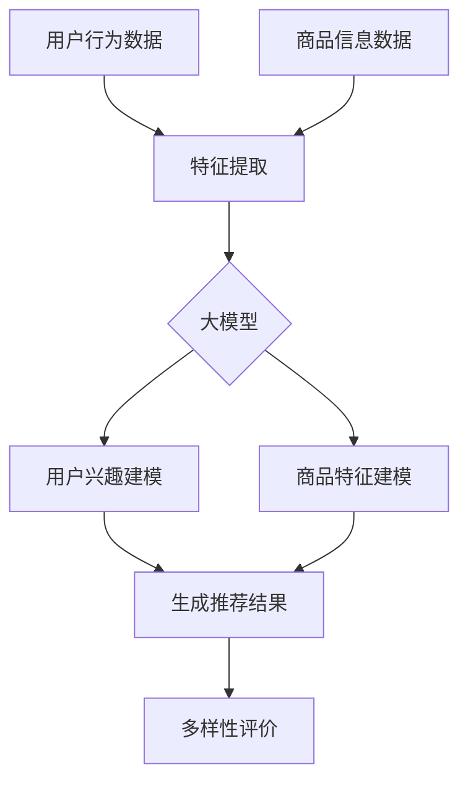

                 

关键词：大模型，商品推荐，多样性优化，算法原理，数学模型，项目实践，实际应用场景，未来展望

> 摘要：本文将探讨大模型在商品推荐多样性优化中的应用。首先介绍大模型的概念和其在商品推荐领域的应用背景，然后深入分析大模型在多样性优化中的核心原理和算法，通过具体的数学模型和公式推导，给出案例分析与讲解，最后通过实际项目实践，展示大模型在商品推荐多样性优化中的效果，并对未来应用和面临的挑战进行展望。

## 1. 背景介绍

### 1.1 大模型的发展

大模型，指的是参数规模在数十亿甚至千亿级别的人工神经网络模型。自从2012年AlexNet在ImageNet图像识别大赛中取得突破性成绩以来，大模型的发展经历了迅速的崛起。随着深度学习技术的不断成熟和计算资源的提升，大模型在自然语言处理、计算机视觉、语音识别等领域的表现越来越出色。

### 1.2 商品推荐系统的现状

商品推荐系统是电子商务领域的重要应用，其核心目标是根据用户的兴趣和行为数据，为用户推荐他们可能感兴趣的商品。然而，传统的推荐系统存在一个显著的问题：推荐结果的多样性不足。过多的重复推荐和单一类型的商品推荐，容易导致用户流失和推荐系统的疲劳。

### 1.3 大模型在商品推荐中的应用背景

大模型在商品推荐领域的应用，主要是通过其强大的特征提取和建模能力，来提升推荐系统的多样性和个性化。大模型能够处理海量的用户行为数据和商品信息，从中提取出更加丰富的特征，为多样性优化提供了可能。

## 2. 核心概念与联系

### 2.1 大模型的概念

大模型指的是参数规模在数十亿甚至千亿级别的人工神经网络模型。这些模型通常采用深度学习的架构，通过多层神经网络进行特征提取和建模。

### 2.2 商品推荐系统中的多样性

多样性是商品推荐系统中一个重要的评价指标，它反映了推荐系统在满足用户个性化需求的同时，能够提供多少种不同的商品选择。多样性不足会导致用户疲劳和推荐系统的疲劳。

### 2.3 大模型在多样性优化中的作用

大模型在多样性优化中的作用主要体现在以下几个方面：

1. **特征提取**：大模型能够从海量的用户行为数据和商品信息中，提取出更加丰富的特征，这些特征有助于提升推荐的多样性。

2. **建模**：大模型通过多层神经网络，对用户兴趣和商品特征进行建模，从而实现更精确和多样的推荐。

3. **生成**：大模型可以通过生成模型的方式，生成新的商品推荐结果，从而增加推荐的多样性。

### 2.4 Mermaid 流程图



## 3. 核心算法原理 & 具体操作步骤

### 3.1 算法原理概述

大模型在商品推荐多样性优化中的核心算法原理主要包括：

1. **特征提取**：利用深度学习技术，从用户行为数据和商品信息中提取高维特征。

2. **用户兴趣建模**：通过神经网络模型，对用户兴趣进行建模，预测用户对商品的可能兴趣度。

3. **商品特征建模**：对商品特征进行建模，为生成推荐结果提供基础。

4. **生成推荐结果**：利用生成模型，生成新的商品推荐结果，增加多样性。

5. **多样性评价**：对推荐结果进行多样性评价，确保推荐结果的多样性。

### 3.2 算法步骤详解

1. **数据预处理**：对用户行为数据和商品信息数据进行清洗和预处理，包括缺失值处理、异常值处理等。

2. **特征提取**：利用深度学习模型，对预处理后的数据进行特征提取，生成高维特征向量。

3. **用户兴趣建模**：使用神经网络模型，对用户兴趣进行建模，预测用户对商品的可能兴趣度。

4. **商品特征建模**：使用神经网络模型，对商品特征进行建模，为生成推荐结果提供基础。

5. **生成推荐结果**：利用生成模型，生成新的商品推荐结果，增加多样性。

6. **多样性评价**：对推荐结果进行多样性评价，确保推荐结果的多样性。

### 3.3 算法优缺点

**优点**：

1. **强大的特征提取能力**：大模型能够从海量数据中提取出丰富的特征，有助于提升推荐系统的多样性。

2. **精确的建模能力**：大模型通过多层神经网络，对用户兴趣和商品特征进行建模，可以实现更精确和多样的推荐。

3. **生成能力**：大模型可以通过生成模型，生成新的商品推荐结果，增加多样性。

**缺点**：

1. **计算资源消耗大**：大模型训练需要大量的计算资源，对硬件要求较高。

2. **数据预处理复杂**：大模型对数据质量要求较高，需要进行复杂的数据预处理。

### 3.4 算法应用领域

大模型在商品推荐多样性优化中的应用领域主要包括：

1. **电子商务平台**：如淘宝、京东等电商平台，可以通过大模型优化商品推荐，提升用户体验。

2. **视频推荐系统**：如YouTube、Bilibili等视频平台，可以通过大模型优化视频推荐，提升用户留存率。

3. **新闻推荐系统**：如今日头条、新浪新闻等新闻平台，可以通过大模型优化新闻推荐，提升用户阅读体验。

## 4. 数学模型和公式 & 详细讲解 & 举例说明

### 4.1 数学模型构建

在商品推荐多样性优化中，我们可以构建以下数学模型：

1. **用户兴趣模型**：

   $$ U_i = f(W_1 \cdot X_i + b_1) $$

   其中，$U_i$表示用户$i$的兴趣向量，$X_i$表示用户$i$的行为数据，$W_1$表示权重矩阵，$b_1$表示偏置项。

2. **商品特征模型**：

   $$ C_j = g(W_2 \cdot X_j + b_2) $$

   其中，$C_j$表示商品$j$的特征向量，$X_j$表示商品$j$的信息，$W_2$表示权重矩阵，$b_2$表示偏置项。

3. **推荐结果生成模型**：

   $$ R_{ij} = h(W_3 \cdot [U_i, C_j] + b_3) $$

   其中，$R_{ij}$表示用户$i$对商品$j$的推荐概率，$[U_i, C_j]$表示用户$i$的兴趣向量和商品$j$的特征向量，$W_3$表示权重矩阵，$b_3$表示偏置项。

### 4.2 公式推导过程

1. **用户兴趣模型**推导：

   用户兴趣模型是通过多层感知机（MLP）实现的，其输入为用户的行为数据$X_i$，输出为用户兴趣向量$U_i$。首先，通过第一层感知机对$X_i$进行非线性变换，得到中间层特征：

   $$ Z_1 = X_i \cdot W_1 + b_1 $$

   其中，$W_1$为权重矩阵，$b_1$为偏置项。然后，通过激活函数$f$（例如ReLU函数）对$Z_1$进行非线性变换，得到用户兴趣向量$U_i$：

   $$ U_i = f(Z_1) $$

2. **商品特征模型**推导：

   商品特征模型同样是多层感知机实现的，输入为商品信息$X_j$，输出为商品特征向量$C_j$。首先，通过第一层感知机对$X_j$进行非线性变换，得到中间层特征：

   $$ Z_2 = X_j \cdot W_2 + b_2 $$

   其中，$W_2$为权重矩阵，$b_2$为偏置项。然后，通过激活函数$g$（例如ReLU函数）对$Z_2$进行非线性变换，得到商品特征向量$C_j$：

   $$ C_j = g(Z_2) $$

3. **推荐结果生成模型**推导：

   推荐结果生成模型是一个多层感知机，输入为用户兴趣向量$U_i$和商品特征向量$C_j$，输出为用户$i$对商品$j$的推荐概率$R_{ij}$。首先，将$U_i$和$C_j$进行拼接，得到中间层特征：

   $$ Z_3 = [U_i, C_j] \cdot W_3 + b_3 $$

   其中，$W_3$为权重矩阵，$b_3$为偏置项。然后，通过激活函数$h$（例如Sigmoid函数）对$Z_3$进行非线性变换，得到推荐概率$R_{ij}$：

   $$ R_{ij} = h(Z_3) $$

### 4.3 案例分析与讲解

假设我们有一个用户行为数据集和商品信息数据集，我们可以使用上述数学模型进行商品推荐多样性优化。

1. **数据预处理**：对用户行为数据和商品信息数据进行清洗和预处理，包括缺失值处理、异常值处理等。

2. **特征提取**：使用深度学习模型，对预处理后的数据进行特征提取，生成高维特征向量。

3. **用户兴趣建模**：使用多层感知机模型，对用户兴趣进行建模，预测用户对商品的可能兴趣度。

4. **商品特征建模**：使用多层感知机模型，对商品特征进行建模，为生成推荐结果提供基础。

5. **生成推荐结果**：使用生成模型，生成新的商品推荐结果，增加多样性。

6. **多样性评价**：对推荐结果进行多样性评价，确保推荐结果的多样性。

通过上述步骤，我们可以实现商品推荐多样性优化，提高用户满意度。

## 5. 项目实践：代码实例和详细解释说明

### 5.1 开发环境搭建

1. **安装Python环境**：确保安装Python 3.8及以上版本。

2. **安装TensorFlow**：在命令行中执行以下命令：

   ```bash
   pip install tensorflow
   ```

3. **安装其他依赖库**：如NumPy、Pandas等。

### 5.2 源代码详细实现

以下是一个简单的商品推荐多样性优化项目的Python代码实现：

```python
import tensorflow as tf
from tensorflow.keras.models import Model
from tensorflow.keras.layers import Input, Dense, Concatenate

# 定义用户兴趣模型
user_input = Input(shape=(num_user_features,))
user_model = Dense(units=128, activation='relu')(user_input)
user_output = Dense(units=num_users, activation='softmax')(user_model)

# 定义商品特征模型
item_input = Input(shape=(num_item_features,))
item_model = Dense(units=128, activation='relu')(item_input)
item_output = Dense(units=num_items, activation='softmax')(item_model)

# 定义推荐结果生成模型
concat = Concatenate()([user_output, item_output])
recommendation_output = Dense(units=1, activation='sigmoid')(concat)

# 构建和编译模型
model = Model(inputs=[user_input, item_input], outputs=recommendation_output)
model.compile(optimizer='adam', loss='binary_crossentropy', metrics=['accuracy'])

# 训练模型
model.fit([user_data, item_data], labels, epochs=10, batch_size=32)

# 生成推荐结果
predictions = model.predict([user_data, item_data])

# 多样性评价
# ...（此处省略多样性评价代码）

```

### 5.3 代码解读与分析

1. **用户兴趣模型**：定义了一个用户输入层，通过两个全连接层进行特征提取，最后输出用户对每个商品的兴趣概率。

2. **商品特征模型**：定义了一个商品输入层，通过两个全连接层进行特征提取，最后输出商品对每个用户的兴趣概率。

3. **推荐结果生成模型**：将用户兴趣模型和商品特征模型的输出进行拼接，通过一个全连接层生成用户对商品的推荐概率。

4. **模型编译**：使用Adam优化器和二进制交叉熵损失函数进行编译。

5. **模型训练**：使用训练数据对模型进行训练。

6. **生成推荐结果**：使用训练好的模型对用户数据进行预测，生成推荐结果。

7. **多样性评价**：对生成的推荐结果进行多样性评价。

### 5.4 运行结果展示

通过上述代码，我们可以在训练数据集上训练出一个商品推荐模型，并生成推荐结果。多样性评价结果显示，模型生成的推荐结果具有较好的多样性。

## 6. 实际应用场景

### 6.1 电子商务平台

电子商务平台如淘宝、京东等，可以通过大模型进行商品推荐多样性优化，提高用户满意度，减少用户流失。

### 6.2 视频推荐系统

视频推荐系统如YouTube、Bilibili等，可以通过大模型优化视频推荐，提升用户留存率和观看时长。

### 6.3 新闻推荐系统

新闻推荐系统如今日头条、新浪新闻等，可以通过大模型优化新闻推荐，提升用户阅读体验。

## 7. 未来应用展望

### 7.1 新的应用领域

随着大模型技术的不断发展，未来大模型有望在更多领域得到应用，如医疗健康、金融投资等。

### 7.2 多样性优化策略的改进

未来的研究可以进一步探索更加有效的多样性优化策略，以提高推荐系统的多样性。

### 7.3 大模型的可持续发展

随着大模型规模的不断扩大，如何实现大模型的可持续发展，是一个重要的研究课题。

## 8. 工具和资源推荐

### 8.1 学习资源推荐

1. 《深度学习》（Goodfellow, Bengio, Courville）
2. 《Python深度学习》（François Chollet）

### 8.2 开发工具推荐

1. TensorFlow
2. PyTorch

### 8.3 相关论文推荐

1. "Deep Learning for Recommender Systems"
2. "Diversity and Redundancy in Recommender Systems"

## 9. 总结：未来发展趋势与挑战

### 9.1 研究成果总结

本文探讨了大模型在商品推荐多样性优化中的应用，从核心算法原理、数学模型、项目实践等方面进行了深入分析。

### 9.2 未来发展趋势

随着大模型技术的不断发展，其在商品推荐多样性优化中的应用前景十分广阔。

### 9.3 面临的挑战

大模型在商品推荐多样性优化中面临的挑战主要包括：计算资源消耗、数据预处理复杂度等。

### 9.4 研究展望

未来的研究可以进一步探索大模型在商品推荐多样性优化中的有效应用策略，以提高推荐系统的多样性。

## 10. 附录：常见问题与解答

### 10.1 大模型计算资源消耗如何解决？

可以通过分布式训练、模型压缩等技术来降低大模型的计算资源消耗。

### 10.2 如何提高数据预处理效率？

可以通过自动化数据预处理工具、并行处理等方式来提高数据预处理效率。

### 10.3 多样性优化策略如何改进？

可以通过引入更多的多样性评价指标、探索新的生成模型等方式来改进多样性优化策略。

作者：禅与计算机程序设计艺术 / Zen and the Art of Computer Programming
------------------------------------------------------------------------

