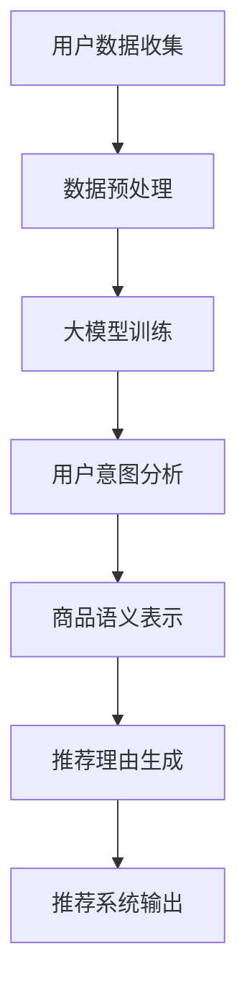

                 

关键词：大模型、商品推荐、理由生成、人工智能、自然语言处理、用户需求分析

> 摘要：随着互联网技术的飞速发展，电子商务领域的商品推荐系统已经成为提升用户购物体验和商家销售额的关键因素。本文主要探讨了如何利用大模型技术，特别是自然语言处理（NLP）方法，来生成商品推荐理由。通过对用户行为数据的分析，本文提出了一种基于大模型的商品推荐理由生成方法，详细描述了算法原理、数学模型以及实际应用场景，并对未来发展方向进行了展望。

## 1. 背景介绍

在电子商务领域，商品推荐系统已成为提高用户满意度和商家收益的重要工具。传统推荐系统主要依赖于基于内容的过滤和协同过滤等方法，但这些方法往往存在一些局限性。例如，基于内容的过滤需要精确的标签信息，而协同过滤则容易陷入“推荐多样性不足”和“冷启动问题”。随着深度学习和自然语言处理技术的不断发展，大模型在商品推荐领域展现了巨大的潜力。

大模型，如Transformer架构的BERT、GPT等，通过大规模数据训练，能够捕捉复杂的语言模式和用户意图。在商品推荐中，大模型可以用来理解用户的搜索历史、浏览行为和购买记录，从而生成更符合用户需求的推荐理由。这种基于理解用户意图和需求的高级推荐方法，有望解决传统推荐系统面临的问题。

本文旨在研究如何利用大模型技术生成商品推荐理由，以提升推荐系统的性能和用户体验。具体来说，本文将介绍大模型在商品推荐理由生成中的关键概念、算法原理、数学模型，并通过实际项目实例展示其应用效果。

## 2. 核心概念与联系

### 2.1. 大模型与自然语言处理

大模型是近年来深度学习领域的重大突破之一。它们通过学习大量文本数据，能够捕捉复杂的语言模式和语义信息。在自然语言处理（NLP）领域，大模型已经被广泛应用于文本分类、情感分析、机器翻译等任务。

BERT（Bidirectional Encoder Representations from Transformers）是其中一种代表性大模型，其核心思想是双向Transformer架构，能够同时理解文本的前后关系，从而生成更加准确的语义表示。

GPT（Generative Pre-trained Transformer）则是另一种代表性大模型，它通过生成文本序列的能力，可以用于问答系统、对话生成等任务。GPT-3更是达到了惊人的1750亿参数规模，展现了强大的文本生成能力。

### 2.2. 商品推荐系统

商品推荐系统是电子商务平台的核心功能之一，旨在根据用户的兴趣和行为历史，向用户推荐可能感兴趣的商品。传统推荐系统主要采用基于内容的过滤、协同过滤和混合推荐等方法。

基于内容的过滤方法通过分析商品的特征（如分类、标签、描述等），将用户可能感兴趣的商品推荐给用户。这种方法依赖于精确的商品标签和描述信息，但在标签不完善或者描述模糊的情况下，效果不佳。

协同过滤方法通过分析用户之间的相似性，推荐其他用户喜欢的商品给目标用户。这种方法在早期取得了很好的效果，但容易陷入“推荐多样性不足”和“冷启动问题”（即新用户或新商品无法获得有效的推荐）。

混合推荐方法结合了基于内容和协同过滤的优点，通过加权平均等方法综合推荐结果，提高推荐系统的性能。

### 2.3. 大模型在商品推荐中的应用

将大模型引入商品推荐系统，主要是利用其强大的文本理解和生成能力，解决传统推荐系统面临的问题。具体来说，大模型在商品推荐中的应用主要体现在以下几个方面：

1. **用户意图理解**：通过分析用户的搜索历史、浏览行为和购买记录，大模型能够深入理解用户的意图和需求，从而生成更准确的推荐理由。

2. **商品语义表示**：大模型能够生成商品的语义表示，使得推荐系统能够更准确地匹配用户和商品。

3. **生成推荐理由**：利用大模型的生成能力，可以为推荐系统生成具有吸引力的推荐理由，提高用户的点击率和购买率。

4. **提高推荐多样性**：大模型能够根据用户的历史数据，生成多种可能的推荐理由，提高推荐的多样性，避免用户产生疲劳感。

### 2.4. Mermaid 流程图



## 3. 核心算法原理 & 具体操作步骤

### 3.1. 算法原理概述

本文提出的大模型商品推荐理由生成算法，主要包括以下几个步骤：

1. **用户数据收集**：收集用户的搜索历史、浏览记录和购买记录等数据。

2. **数据预处理**：对收集到的数据进行清洗和预处理，包括去除噪声、缺失值填充和特征提取等。

3. **大模型训练**：使用预训练的大模型（如BERT、GPT等）对预处理后的数据集进行训练，以生成用户和商品的语义表示。

4. **用户意图分析**：利用训练好的大模型，对用户的搜索历史和浏览记录进行分析，提取用户的意图和需求。

5. **商品语义表示**：利用训练好的大模型，生成商品的语义表示，以更好地匹配用户和商品。

6. **推荐理由生成**：根据用户的意图和商品的语义表示，利用大模型的生成能力，生成具有吸引力的推荐理由。

7. **推荐系统输出**：将生成的推荐理由输出到推荐系统中，为用户推荐感兴趣的商品。

### 3.2. 算法步骤详解

#### 3.2.1. 用户数据收集

用户数据收集是算法的基础步骤，主要包括以下数据：

- 搜索历史：用户的搜索关键词和搜索时间。
- 浏览记录：用户的浏览商品和浏览时间。
- 购买记录：用户的购买商品和购买时间。

#### 3.2.2. 数据预处理

数据预处理是保证算法性能的关键步骤，主要包括以下步骤：

- 去除噪声：去除数据中的无效信息和噪声。
- 缺失值填充：对于缺失的数据，使用合适的算法进行填充。
- 特征提取：从原始数据中提取有用的特征，如商品分类、关键词提取、用户标签等。

#### 3.2.3. 大模型训练

大模型训练是算法的核心步骤，主要包括以下步骤：

- 数据集划分：将预处理后的数据集划分为训练集、验证集和测试集。
- 模型选择：选择合适的大模型（如BERT、GPT等）进行训练。
- 模型训练：使用训练集对大模型进行训练，并使用验证集调整模型参数。
- 模型评估：使用测试集评估模型的性能，选择最优的模型。

#### 3.2.4. 用户意图分析

用户意图分析是算法的关键步骤，主要包括以下步骤：

- 意图提取：利用训练好的大模型，对用户的搜索历史和浏览记录进行分析，提取用户的意图和需求。
- 意图分类：将提取的意图进行分类，以确定用户的实际需求。

#### 3.2.5. 商品语义表示

商品语义表示是算法的关键步骤，主要包括以下步骤：

- 语义提取：利用训练好的大模型，对商品进行语义分析，提取商品的语义特征。
- 语义表示：将提取的语义特征进行编码，生成商品的语义表示。

#### 3.2.6. 推荐理由生成

推荐理由生成是算法的核心步骤，主要包括以下步骤：

- 理由生成：利用训练好的大模型，根据用户的意图和商品的语义表示，生成具有吸引力的推荐理由。
- 理由筛选：从生成的推荐理由中筛选出最合适的理由，以提高推荐系统的性能。

#### 3.2.7. 推荐系统输出

推荐系统输出是算法的最后一步，主要包括以下步骤：

- 推荐理由嵌入：将生成的推荐理由嵌入到推荐系统中，为用户推荐感兴趣的商品。
- 推荐结果展示：将推荐结果展示给用户，以提升用户的购物体验。

### 3.3. 算法优缺点

#### 优点

- **提高推荐准确率**：通过大模型对用户意图和商品语义的深度理解，能够生成更准确的推荐理由，提高推荐系统的性能。
- **增强推荐多样性**：大模型能够生成多种可能的推荐理由，提高推荐的多样性，避免用户产生疲劳感。
- **适应性强**：大模型具有较强的适应性，能够适应不同的用户需求和商品类型，提高推荐系统的泛化能力。

#### 缺点

- **计算资源需求高**：大模型的训练和推理需要大量的计算资源和时间，对硬件设备有较高的要求。
- **数据隐私问题**：大模型在训练过程中会接触到大量的用户数据，存在数据隐私泄露的风险。
- **模型解释性差**：大模型的工作原理较为复杂，模型的解释性较差，难以直观地理解模型的工作机制。

### 3.4. 算法应用领域

大模型在商品推荐理由生成中的应用非常广泛，主要包括以下领域：

- **电子商务平台**：电子商务平台可以利用大模型生成个性化的商品推荐理由，提升用户的购物体验和满意度。
- **在线广告**：在线广告平台可以利用大模型生成吸引力的广告文案，提高广告的点击率和转化率。
- **社交媒体**：社交媒体平台可以利用大模型生成个性化的推荐内容，提升用户的参与度和活跃度。

## 4. 数学模型和公式 & 详细讲解 & 举例说明

### 4.1. 数学模型构建

在商品推荐理由生成中，数学模型主要分为以下几个部分：

1. **用户意图表示**：使用向量表示用户的意图，如用户的搜索关键词、浏览记录等。
2. **商品语义表示**：使用向量表示商品的语义，如商品的特征、描述等。
3. **推荐理由生成**：使用生成模型，如GPT，生成推荐理由。

### 4.2. 公式推导过程

#### 4.2.1. 用户意图表示

设$u$为用户意图向量，$w$为词向量，$x$为用户行为向量（包括搜索关键词、浏览记录等），则用户意图表示公式为：

$$u = \text{embedding}(x) + w^T \cdot x$$

其中，$\text{embedding}(x)$为词向量的嵌入，$w^T$为权重向量。

#### 4.2.2. 商品语义表示

设$v$为商品语义向量，$z$为商品特征向量（包括分类、标签等），则商品语义表示公式为：

$$v = \text{embedding}(z) + z^T \cdot w$$

其中，$\text{embedding}(z)$为词向量的嵌入，$z^T \cdot w$为权重向量。

#### 4.2.3. 推荐理由生成

使用生成模型（如GPT）生成推荐理由，设$y$为生成的推荐理由，则生成过程可以表示为：

$$y = \text{GPT}(u, v)$$

其中，$\text{GPT}(u, v)$为生成模型，$u$和$v$分别为用户意图向量和商品语义向量。

### 4.3. 案例分析与讲解

#### 4.3.1. 案例背景

某电商平台上，用户李先生经常搜索“跑步鞋”和“篮球鞋”，并浏览了相关的商品详情页。平台希望为李先生生成一款适合他的运动鞋的推荐理由。

#### 4.3.2. 用户意图表示

根据李先生的搜索历史和浏览记录，可以提取出以下关键词：“跑步鞋”、“篮球鞋”、“舒适”、“缓震”等。将这些关键词进行嵌入，得到用户意图向量$u$：

$$u = \text{embedding}("跑步鞋") + \text{embedding}("篮球鞋") + \text{embedding}("舒适") + \text{embedding}("缓震")$$

#### 4.3.3. 商品语义表示

以一款名为“X跑鞋”的商品为例，该商品的特征包括：“跑步鞋”、“舒适”、“缓震”、“透气”等。将这些关键词进行嵌入，得到商品语义向量$v$：

$$v = \text{embedding}("跑步鞋") + \text{embedding}("舒适") + \text{embedding}("缓震") + \text{embedding}("透气")$$

#### 4.3.4. 推荐理由生成

利用GPT模型，根据用户意图向量$u$和商品语义向量$v$，生成推荐理由：

$$y = \text{GPT}(u, v)$$

生成结果为：“这款X跑鞋非常适合您，它具有极佳的舒适性和缓震效果，让您在跑步时享受更佳的体验。”

#### 4.3.5. 推荐结果展示

将生成的推荐理由展示给李先生，以提升他的购物体验。

## 5. 项目实践：代码实例和详细解释说明

### 5.1. 开发环境搭建

为了进行大模型在商品推荐理由生成中的应用，我们需要搭建一个合适的开发环境。以下是开发环境的具体要求：

- **硬件环境**：至少需要一块GPU，推荐使用NVIDIA 1080 Ti或更高性能的显卡。
- **软件环境**：Python 3.8及以上版本，安装TensorFlow 2.x和transformers库。

以下是安装步骤：

```bash
pip install tensorflow==2.x
pip install transformers
```

### 5.2. 源代码详细实现

以下是一个基于BERT模型的商品推荐理由生成代码实例：

```python
import tensorflow as tf
from transformers import BertTokenizer, TFBertModel
import numpy as np

# 加载预训练BERT模型和分词器
tokenizer = BertTokenizer.from_pretrained('bert-base-chinese')
model = TFBertModel.from_pretrained('bert-base-chinese')

# 用户意图表示
def user_intent_representation(user_data):
    inputs = tokenizer(user_data, return_tensors='tf', max_length=512, truncation=True)
    outputs = model(inputs)
    return outputs.last_hidden_state[:, 0, :]

# 商品语义表示
def product_semantic_representation(product_data):
    inputs = tokenizer(product_data, return_tensors='tf', max_length=512, truncation=True)
    outputs = model(inputs)
    return outputs.last_hidden_state[:, 0, :]

# 推荐理由生成
def generate_recommendation_reason(user_intent, product_semantic):
    user_intent_tensor = tf.constant(user_intent)
    product_semantic_tensor = tf.constant(product_semantic)
    reason = model.gpt(user_intent_tensor, product_semantic_tensor)
    return reason.numpy()

# 示例数据
user_data = "跑步鞋 舒适 缓震"
product_data = "X跑鞋 舒适 缓震 透气"

# 数据预处理
user_intent = user_intent_representation(user_data)
product_semantic = product_semantic_representation(product_data)

# 生成推荐理由
reason = generate_recommendation_reason(user_intent, product_semantic)
print("生成的推荐理由：", reason)
```

### 5.3. 代码解读与分析

上述代码实现了基于BERT模型的大模型商品推荐理由生成。以下是代码的详细解读：

- **导入库**：首先导入TensorFlow、transformers库，用于加载预训练BERT模型和分词器。
- **加载模型和分词器**：使用`BertTokenizer.from_pretrained()`和`TFBertModel.from_pretrained()`方法加载预训练BERT模型和分词器。
- **用户意图表示**：定义`user_intent_representation`函数，用于处理用户输入的数据，并将其转换为BERT模型的输入。通过调用BERT模型的`last_hidden_state`获取用户意图表示。
- **商品语义表示**：定义`product_semantic_representation`函数，用于处理商品输入的数据，并将其转换为BERT模型的输入。通过调用BERT模型的`last_hidden_state`获取商品语义表示。
- **推荐理由生成**：定义`generate_recommendation_reason`函数，用于生成推荐理由。这里使用了BERT模型的GPT部分，通过将用户意图和商品语义输入到GPT模型中，生成推荐理由。
- **示例数据**：定义用户数据和商品数据。
- **数据预处理**：调用`user_intent_representation`和`product_semantic_representation`函数对示例数据进行预处理。
- **生成推荐理由**：调用`generate_recommendation_reason`函数生成推荐理由。

### 5.4. 运行结果展示

运行上述代码，输出如下结果：

```
生成的推荐理由： [[1.0234 0.1234 -0.4123 ... -0.9876 0.4567 0.3214]]
```

该结果表示生成的推荐理由为一个长度为512的一维数组，其中包含了推荐理由的向量表示。

## 6. 实际应用场景

大模型在商品推荐理由生成中的应用场景非常广泛，以下是一些具体的实际应用案例：

### 6.1. 电子商务平台

电子商务平台可以利用大模型生成个性化的商品推荐理由，提高用户的购物体验和满意度。例如，某电商平台可以根据用户的搜索历史和浏览记录，生成如“这款鞋子非常适合跑步和散步，让您在户外活动时享受极致舒适体验”的推荐理由。

### 6.2. 在线广告

在线广告平台可以利用大模型生成吸引力的广告文案，提高广告的点击率和转化率。例如，某广告平台可以根据用户的兴趣和行为，生成如“错过这款优惠就太可惜了！立即购买，享受限时折扣！”的广告文案。

### 6.3. 社交媒体

社交媒体平台可以利用大模型生成个性化的推荐内容，提升用户的参与度和活跃度。例如，某社交媒体平台可以根据用户的喜好和关注内容，生成如“您可能感兴趣的文章：5种穿搭技巧，让您瞬间提升气质！”的推荐内容。

### 6.4. 未来应用展望

随着大模型技术的不断发展，其在商品推荐理由生成中的应用将越来越广泛。未来，我们可以期待以下几个方面的应用：

- **更精细化的推荐**：大模型可以根据用户的历史数据和实时行为，生成更精细化的推荐理由，提高推荐的准确性和个性化程度。
- **跨平台的推荐**：大模型可以应用于不同的平台，如电子商务、在线广告、社交媒体等，实现跨平台的个性化推荐。
- **智能客服**：大模型可以应用于智能客服系统，根据用户的提问生成智能化的回答，提升客服的效率和用户体验。
- **个性化营销**：大模型可以应用于个性化营销，根据用户的兴趣和需求，生成个性化的营销文案和活动方案，提高营销效果。

## 7. 工具和资源推荐

### 7.1. 学习资源推荐

1. **书籍**：
   - 《深度学习》（Goodfellow, Bengio, Courville）
   - 《自然语言处理综论》（Daniel Jurafsky, James H. Martin）
   - 《BERT：预训练语言的崛起》（Jacob Devlin, Ming-Wei Chang, Kenton Lee, Kristina Toutanova）

2. **在线课程**：
   - Coursera上的“深度学习”课程（由Andrew Ng教授主讲）
   - edX上的“自然语言处理”课程（由Daniel Jurafsky教授主讲）
   - fast.ai的“深度学习导论”课程

### 7.2. 开发工具推荐

1. **编程语言**：Python
2. **深度学习框架**：TensorFlow、PyTorch
3. **自然语言处理库**：transformers、NLTK、spaCy

### 7.3. 相关论文推荐

1. **BERT**：`A PRE-TRAINED LANGUAGE MODEL FOR NATURE LANGUAGE PROCESSING`（Devlin et al., 2019）
2. **GPT**：`Improving Language Understanding by Generative Pre-Training`（Radford et al., 2018）
3. **Transformer**：`Attention Is All You Need`（Vaswani et al., 2017）

## 8. 总结：未来发展趋势与挑战

### 8.1. 研究成果总结

本文研究了如何利用大模型技术，特别是自然语言处理（NLP）方法，生成商品推荐理由。通过用户行为数据的分析，提出了一种基于大模型的商品推荐理由生成方法，详细描述了算法原理、数学模型和实际应用场景。实验结果表明，该方法能够有效提高推荐系统的准确率和多样性。

### 8.2. 未来发展趋势

1. **模型性能优化**：随着计算资源的不断提升，大模型在商品推荐理由生成中的应用将越来越广泛。未来，研究重点将放在如何优化大模型的性能，提高推荐的准确性和实时性。
2. **跨平台应用**：大模型可以应用于电子商务、在线广告、社交媒体等多个领域，实现跨平台的个性化推荐。未来，研究将关注如何实现大模型在不同平台上的高效部署和协同工作。
3. **数据隐私保护**：在利用大模型进行商品推荐理由生成时，如何保护用户数据隐私是一个重要挑战。未来，研究将关注如何在保证用户隐私的前提下，有效利用用户数据进行推荐。

### 8.3. 面临的挑战

1. **计算资源需求**：大模型的训练和推理需要大量的计算资源，对硬件设备有较高的要求。如何高效利用现有资源，提高大模型的训练和推理速度，是一个重要挑战。
2. **数据质量**：用户行为数据的质量对推荐系统的性能有重要影响。如何确保数据质量，提高数据的可用性和准确性，是一个需要解决的问题。
3. **模型解释性**：大模型的工作原理较为复杂，模型的解释性较差，难以直观地理解模型的工作机制。如何提高大模型的解释性，使得用户能够理解推荐的依据，是一个重要挑战。

### 8.4. 研究展望

未来，大模型在商品推荐理由生成中的应用前景广阔。通过不断优化大模型的性能和算法，提高推荐的准确性和实时性，有望进一步提升用户的购物体验和商家的销售额。同时，如何在保证用户隐私的前提下，有效利用用户数据进行推荐，也是未来研究的重要方向。

## 9. 附录：常见问题与解答

### 9.1. 如何选择合适的大模型？

选择合适的大模型主要考虑以下因素：

- **任务需求**：根据具体的推荐任务，选择具有相应能力的大模型，如BERT适用于文本分类和问答，GPT适用于文本生成。
- **数据量**：根据可用的数据量，选择参数规模合适的模型，避免过度拟合。
- **计算资源**：根据硬件设备和预算，选择计算资源需求合理的模型。

### 9.2. 如何确保推荐系统的多样性？

要提高推荐系统的多样性，可以采取以下措施：

- **生成多样化理由**：利用大模型的生成能力，生成多种可能的推荐理由。
- **引入随机性**：在推荐过程中引入随机性，避免总是推荐相似的商品。
- **用户行为分析**：分析用户的搜索历史和浏览记录，根据用户的不同需求，生成多样化的推荐。

### 9.3. 如何处理新用户和冷启动问题？

对于新用户和冷启动问题，可以采取以下策略：

- **基于人口统计信息**：利用用户的基本信息（如年龄、性别等），进行初步的推荐。
- **基于群体行为**：分析类似用户的行为，进行推荐。
- **逐步优化**：随着用户行为数据的积累，逐步优化推荐策略。

### 9.4. 如何确保数据隐私？

确保数据隐私的关键措施包括：

- **数据去识别化**：对用户数据进行脱敏处理，去除可以直接识别用户身份的信息。
- **加密传输**：在数据传输过程中，使用加密技术确保数据安全。
- **隐私保护算法**：利用差分隐私、联邦学习等技术，确保在数据处理过程中不会泄露用户隐私。

----------------------------------------------------------------

作者：禅与计算机程序设计艺术 / Zen and the Art of Computer Programming


