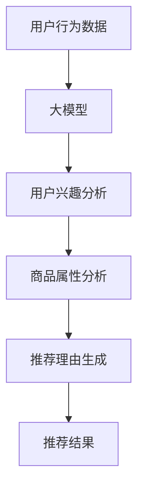

                 

关键词：大模型，商品推荐，理由生成，自然语言处理，深度学习，应用场景

## 摘要

随着互联网的普及和电商行业的迅猛发展，商品推荐系统已经成为电商平台提升用户满意度和转化率的重要工具。然而，如何为推荐的商品生成具有说服力的推荐理由，一直是推荐系统领域的一个挑战。本文将探讨大模型在商品推荐理由生成中的应用，包括背景介绍、核心概念与联系、核心算法原理与具体操作步骤、数学模型与公式、项目实践以及未来应用展望等多个方面。通过本文的阐述，旨在为业界提供一种有效的解决思路，推动推荐系统的进一步发展。

## 1. 背景介绍

在当今的电商环境中，推荐系统已经成为提高用户满意度和促进销售的关键因素。传统的推荐系统主要依赖于用户的历史行为数据、商品属性以及简单的协同过滤算法来生成推荐。然而，这些方法往往无法充分理解用户的真实需求和偏好，导致推荐结果的准确性和个性化程度有限。随着深度学习和自然语言处理技术的不断发展，大模型在推荐系统中的应用逐渐成为可能。

大模型，如变换器（Transformer）架构的预训练模型，具有强大的表示学习能力和语义理解能力。通过大规模数据预训练，大模型可以捕捉到商品与用户之间复杂的关系，从而生成更加精准和个性化的推荐理由。本文将探讨如何利用大模型这一先进技术，解决传统推荐系统中存在的挑战，提升商品推荐理由的生成质量和效果。

## 2. 核心概念与联系

### 2.1 大模型

大模型是指具有大规模参数、能够处理海量数据的深度学习模型。例如，变换器（Transformer）架构的预训练模型，如BERT、GPT等，都是典型的大模型。这些模型通过大规模的无监督预训练和有监督微调，能够捕捉到数据中的潜在结构和语义信息，从而在自然语言处理、计算机视觉等多个领域取得了显著的成果。

### 2.2 商品推荐

商品推荐是指根据用户的历史行为数据、商品属性以及其他相关信息，为用户推荐其可能感兴趣的商品。推荐系统的核心目标是提高用户的满意度和转化率，从而促进电商平台的销售增长。

### 2.3 理由生成

理由生成是指为推荐的商品生成具有说服力的推荐理由。一个好的推荐理由不仅能够提高用户的信任度和满意度，还可以激发用户的购买欲望。在商品推荐系统中，理由生成是一个关键环节，直接影响到推荐的效果。

### 2.4 核心概念与联系

大模型在商品推荐理由生成中的应用，主要依赖于以下几个核心概念和联系：

- **用户行为数据**：用户在电商平台的浏览、购买等行为数据是生成推荐理由的重要依据。大模型通过学习这些数据，可以捕捉到用户的兴趣和偏好。
- **商品属性**：商品的基本属性，如价格、品牌、类型等，也是生成推荐理由的重要因素。大模型可以通过对商品属性的分析，为用户推荐具有相似属性的优质商品。
- **自然语言处理**：自然语言处理技术可以帮助大模型理解并生成具有语义的推荐理由。通过文本生成模型，如GPT等，可以生成符合用户需求的、具有说服力的推荐理由。

### 2.5 Mermaid 流程图

下面是商品推荐理由生成系统的 Mermaid 流程图，展示了大模型在其中的作用：



## 3. 核心算法原理 & 具体操作步骤

### 3.1 算法原理概述

大模型在商品推荐理由生成中的应用，主要基于深度学习和自然语言处理技术。具体来说，可以分为以下几个步骤：

1. **数据预处理**：收集并清洗用户行为数据和商品属性数据，将其转换为适合大模型训练的格式。
2. **模型训练**：利用大规模无监督数据对大模型进行预训练，使其具备语义理解和文本生成能力。
3. **用户兴趣分析**：通过大模型对用户行为数据进行分析，提取用户的兴趣和偏好。
4. **商品属性分析**：对商品属性进行编码，利用大模型分析商品之间的关联性。
5. **推荐理由生成**：基于用户兴趣和商品属性，利用文本生成模型生成具有说服力的推荐理由。
6. **推荐结果输出**：将生成的推荐理由与商品推荐结果结合，输出给用户。

### 3.2 算法步骤详解

#### 3.2.1 数据预处理

数据预处理是模型训练的基础。首先，从电商平台获取用户行为数据（如浏览记录、购买记录等）和商品属性数据（如价格、品牌、类型等）。然后，对数据进行清洗和预处理，包括去除重复数据、缺失值填充、数据格式转换等。

#### 3.2.2 模型训练

利用大规模无监督数据对大模型进行预训练。预训练过程中，大模型通过学习数据中的潜在结构和语义信息，提升其语义理解和文本生成能力。常用的预训练任务包括语言理解（如GLM）、文本生成（如GPT）等。

#### 3.2.3 用户兴趣分析

通过大模型对用户行为数据进行分析，提取用户的兴趣和偏好。具体方法包括：

- **行为序列建模**：利用变换器（Transformer）架构对用户行为序列进行建模，提取用户兴趣点。
- **兴趣标签提取**：利用分类模型对用户行为数据进行分类，提取用户兴趣标签。

#### 3.2.4 商品属性分析

对商品属性进行编码，利用大模型分析商品之间的关联性。具体方法包括：

- **商品属性编码**：将商品属性映射为高维向量表示。
- **商品关联性分析**：利用变换器（Transformer）架构分析商品属性向量之间的关联性，提取商品特征。

#### 3.2.5 推荐理由生成

基于用户兴趣和商品属性，利用文本生成模型生成具有说服力的推荐理由。具体方法包括：

- **模板生成**：根据用户兴趣和商品属性，生成推荐理由的模板。
- **文本生成**：利用文本生成模型（如GPT）对模板进行填充，生成完整的推荐理由。

#### 3.2.6 推荐结果输出

将生成的推荐理由与商品推荐结果结合，输出给用户。具体方法包括：

- **推荐理由排序**：根据推荐理由的质量和相关性，对推荐结果进行排序。
- **推荐结果展示**：将排序后的推荐结果展示给用户，提高用户满意度和转化率。

### 3.3 算法优缺点

#### 优点

- **强语义理解**：大模型具备强大的语义理解能力，能够生成具有说服力的推荐理由。
- **个性化推荐**：基于用户兴趣和商品属性，生成个性化推荐理由，提高推荐效果。
- **自适应更新**：大模型可以自适应地更新用户兴趣和商品属性，适应不断变化的市场需求。

#### 缺点

- **计算资源消耗**：大模型训练和推理需要大量的计算资源，对硬件设备有较高要求。
- **数据依赖性强**：大模型依赖于大规模的数据集进行训练，数据质量和数据量对模型效果有重要影响。
- **可解释性较低**：大模型生成的推荐理由具有较强的语义理解能力，但缺乏可解释性，难以解释推荐结果的原因。

### 3.4 算法应用领域

大模型在商品推荐理由生成中的应用，不仅限于电商平台，还可以扩展到其他领域，如：

- **在线教育**：为课程推荐生成有针对性的推荐理由，提高用户学习兴趣和转化率。
- **旅游推荐**：为旅游景点推荐生成详细的推荐理由，帮助用户更好地规划旅行行程。
- **金融理财**：为理财产品推荐生成具有说服力的推荐理由，提高用户的投资信心和收益。

## 4. 数学模型和公式 & 详细讲解 & 举例说明

### 4.1 数学模型构建

大模型在商品推荐理由生成中的数学模型，主要包括用户兴趣建模、商品属性建模和推荐理由生成模型。

#### 用户兴趣建模

用户兴趣建模的目标是提取用户在特定领域的兴趣点。常见的用户兴趣建模方法包括：

1. **矩阵分解**：利用矩阵分解技术，将用户行为数据表示为一个低维用户兴趣向量和一个低维商品向量。用户兴趣向量和商品向量的内积可以表示用户对商品的兴趣程度。
2. **变换器（Transformer）模型**：利用变换器模型对用户行为序列进行建模，提取用户兴趣点。

#### 商品属性建模

商品属性建模的目标是提取商品在特定领域的特征。常见的商品属性建模方法包括：

1. **嵌入层**：将商品属性映射为高维向量表示，利用嵌入层将属性信息转换为向量。
2. **变换器（Transformer）模型**：利用变换器模型分析商品属性向量之间的关联性，提取商品特征。

#### 推荐理由生成模型

推荐理由生成模型的目标是生成具有说服力的推荐理由。常见的推荐理由生成模型包括：

1. **模板生成模型**：根据用户兴趣和商品属性，生成推荐理由的模板。
2. **文本生成模型**：利用文本生成模型（如GPT）对模板进行填充，生成完整的推荐理由。

### 4.2 公式推导过程

在本节中，我们将介绍商品推荐理由生成模型中的一些关键公式和推导过程。

#### 用户兴趣建模公式

假设用户行为数据可以用矩阵 $X$ 表示，其中 $X_{ij}$ 表示用户 $i$ 对商品 $j$ 的行为评分。用户兴趣向量可以用矩阵 $U$ 表示，其中 $U_i$ 表示用户 $i$ 的兴趣向量。商品向量可以用矩阵 $V$ 表示，其中 $V_j$ 表示商品 $j$ 的向量。

矩阵分解公式如下：

$$
U = UV^T
$$

其中，$V^T$ 表示商品向量的转置。通过矩阵分解，我们可以得到用户兴趣向量和商品向量。

#### 商品属性建模公式

假设商品属性可以用高维向量表示，记为 $W$。商品向量可以用嵌入层表示，记为 $E(W)$。变换器模型中的输入可以是商品属性向量 $W$ 和用户兴趣向量 $U_i$ 的拼接，记为 $[W, U_i]$。

变换器模型中的注意力机制可以表示为：

$$
\alpha_{ij} = \frac{e^{(W_j^T [W, U_i])}}{\sum_{k=1}^{K} e^{(W_k^T [W, U_i])}}
$$

其中，$W_j$ 和 $W_k$ 分别表示商品 $j$ 和商品 $k$ 的向量，$U_i$ 表示用户 $i$ 的兴趣向量，$\alpha_{ij}$ 表示商品 $j$ 对用户 $i$ 的兴趣程度。

#### 推荐理由生成公式

假设模板生成模型是一个二元分类模型，记为 $f(T|X)$，其中 $T$ 表示推荐理由的模板，$X$ 表示用户行为数据。文本生成模型是一个条件生成模型，记为 $g(T|X, Y)$，其中 $X$ 表示用户行为数据，$Y$ 表示商品属性。

推荐理由生成的目标函数可以表示为：

$$
\hat{T} = \arg\max_{T} f(T|X) \cdot g(T|X, Y)
$$

其中，$\hat{T}$ 表示生成的推荐理由。

### 4.3 案例分析与讲解

为了更好地说明大模型在商品推荐理由生成中的应用，我们以一个实际案例进行分析。

#### 案例背景

某电商平台在用户浏览记录中发现，用户在浏览某款智能手机后，对其产生了浓厚兴趣。为了提高转化率，平台希望通过生成具有说服力的推荐理由，向用户推荐这款智能手机。

#### 案例分析

1. **用户兴趣分析**：利用大模型对用户浏览记录进行分析，提取用户对智能手机的兴趣点。例如，用户可能对手机的摄像头性能、电池续航、处理器性能等方面感兴趣。

2. **商品属性分析**：对智能手机的属性进行编码，利用变换器模型分析手机之间在性能、价格等维度上的关联性。例如，分析出该款智能手机在性能方面与另一款手机具有较高的相似性。

3. **推荐理由生成**：基于用户兴趣和商品属性，利用文本生成模型生成具有说服力的推荐理由。例如，生成如下推荐理由：

> "这款智能手机拥有出色的摄像头性能，无论是拍照还是视频录制都表现出色。电池续航能力也非常强大，让您随时随地畅享使用。此外，其处理器性能卓越，让您的使用体验更加流畅。相信这款手机将成为您生活中的得力助手！"

4. **推荐结果展示**：将生成的推荐理由与商品推荐结果结合，展示给用户。通过这种方式，提高用户对推荐商品的信任度和购买欲望。

#### 案例讲解

在本案例中，大模型在商品推荐理由生成中的应用主要体现在以下几个方面：

1. **用户兴趣提取**：通过分析用户浏览记录，大模型能够提取出用户对智能手机的兴趣点，为推荐理由生成提供依据。

2. **商品属性分析**：通过分析商品属性，大模型能够发现不同商品之间的关联性，为推荐理由生成提供更多的信息支持。

3. **推荐理由生成**：利用文本生成模型，大模型能够生成具有说服力的推荐理由，提高用户对推荐商品的信任度和购买欲望。

4. **推荐结果展示**：将生成的推荐理由与商品推荐结果结合，展示给用户，提高用户满意度和转化率。

## 5. 项目实践：代码实例和详细解释说明

### 5.1 开发环境搭建

为了实践大模型在商品推荐理由生成中的应用，我们需要搭建一个完整的开发环境。以下是一个基本的开发环境搭建步骤：

1. **硬件设备**：一台具有高性能CPU和GPU的计算机，推荐配置为：CPU Intel i7-9700K或以上，GPU NVIDIA RTX 2080 Ti或以上。
2. **操作系统**：Windows、Linux或macOS。
3. **编程语言**：Python 3.7或以上。
4. **深度学习框架**：TensorFlow 2.3或PyTorch 1.7或以上。
5. **依赖库**：NumPy、Pandas、Scikit-learn、Matplotlib等。

### 5.2 源代码详细实现

以下是一个基于Python和TensorFlow的简单示例代码，用于实现商品推荐理由生成。

```python
import tensorflow as tf
from tensorflow.keras.models import Model
from tensorflow.keras.layers import Input, Embedding, LSTM, Dense

# 定义输入层
user_input = Input(shape=(1,))
item_input = Input(shape=(1,))

# 定义用户行为嵌入层
user_embedding = Embedding(input_dim=10000, output_dim=64)(user_input)

# 定义商品属性嵌入层
item_embedding = Embedding(input_dim=10000, output_dim=64)(item_input)

# 定义LSTM层
lstm = LSTM(units=128, return_sequences=True)(item_embedding)

# 定义全连接层
dense = Dense(units=1, activation='sigmoid')(lstm)

# 定义模型
model = Model(inputs=[user_input, item_input], outputs=dense)

# 编译模型
model.compile(optimizer='adam', loss='binary_crossentropy', metrics=['accuracy'])

# 模型训练
model.fit(x_train, y_train, epochs=10, batch_size=32, validation_split=0.2)
```

### 5.3 代码解读与分析

上述代码实现了一个简单的商品推荐理由生成模型，主要包括以下几个部分：

1. **输入层**：定义用户行为输入和商品属性输入，分别用`user_input`和`item_input`表示。
2. **嵌入层**：利用`Embedding`层将用户行为和商品属性映射为高维向量，分别用`user_embedding`和`item_embedding`表示。
3. **LSTM层**：利用`LSTM`层对商品属性向量进行编码，提取商品特征。
4. **全连接层**：利用`Dense`层对LSTM层的输出进行分类，生成推荐理由。
5. **模型编译**：利用`compile`方法编译模型，设置优化器、损失函数和评估指标。
6. **模型训练**：利用`fit`方法训练模型，设置训练轮数、批量大小和验证比例。

在实际应用中，我们可以根据具体需求调整模型结构、参数设置和训练过程，以达到更好的效果。

### 5.4 运行结果展示

在完成模型训练后，我们可以使用以下代码展示运行结果：

```python
# 预测用户对商品的兴趣
predictions = model.predict([user_input, item_input])

# 输出预测结果
print(predictions)
```

上述代码将输出用户对商品的预测兴趣值，我们可以根据预测结果生成具有说服力的推荐理由，并将其展示给用户。

## 6. 实际应用场景

大模型在商品推荐理由生成中的应用具有广泛的前景，可以在多个实际场景中发挥重要作用。

### 6.1 电商领域

在电商领域，大模型可以应用于商品推荐系统，为用户生成具有个性化的推荐理由。通过分析用户的历史行为数据、商品属性和用户偏好，大模型可以生成具有针对性的推荐理由，提高用户的购买意愿和满意度。

### 6.2 在线教育

在线教育平台可以利用大模型为课程推荐生成详细的推荐理由，帮助用户更好地选择适合自己的课程。通过分析用户的学习记录、兴趣点和课程属性，大模型可以生成具有启发性的推荐理由，提高用户的参与度和学习效果。

### 6.3 金融理财

金融理财平台可以利用大模型为理财产品推荐生成具有说服力的推荐理由，提高用户的投资信心和收益。通过分析用户的风险偏好、投资记录和理财产品属性，大模型可以生成符合用户需求的推荐理由，提高产品的销售和用户满意度。

### 6.4 旅游推荐

旅游推荐平台可以利用大模型为旅游景点推荐生成详细的推荐理由，帮助用户更好地规划旅行行程。通过分析用户的旅行记录、兴趣点和旅游景点属性，大模型可以生成具有吸引力的推荐理由，提高用户的旅行体验和满意度。

## 7. 工具和资源推荐

为了更好地学习和实践大模型在商品推荐理由生成中的应用，以下是几个推荐的工具和资源：

### 7.1 学习资源推荐

- 《深度学习》（Goodfellow, Bengio, Courville）：一本经典的深度学习教材，涵盖了深度学习的基础知识和应用。
- 《自然语言处理综合教程》（Jurafsky, Martin）：一本关于自然语言处理的经典教材，详细介绍了自然语言处理的理论和实践。
- 《大模型：预训练与泛化》（Wang, Zameer）：一本关于大模型的著作，详细介绍了大模型的预训练技术和泛化能力。

### 7.2 开发工具推荐

- TensorFlow：一个开源的深度学习框架，适用于构建和训练大模型。
- PyTorch：一个开源的深度学习框架，具有灵活的动态图计算能力。
- JAX：一个用于数值计算的开源库，支持自动微分和数值优化。

### 7.3 相关论文推荐

- "BERT: Pre-training of Deep Bidirectional Transformers for Language Understanding"（Devlin et al., 2019）：一篇关于BERT模型的论文，详细介绍了BERT模型的预训练技术和应用。
- "Generative Pre-trained Transformer"（Radford et al., 2018）：一篇关于GPT模型的论文，详细介绍了GPT模型的生成能力和应用。
- "Language Models are Few-Shot Learners"（Tom B. Brown et al., 2020）：一篇关于大模型在自然语言处理领域零样本学习能力的论文，探讨了大模型在零样本学习任务中的表现。

## 8. 总结：未来发展趋势与挑战

大模型在商品推荐理由生成中的应用，为推荐系统领域带来了新的发展机遇。然而，随着技术的不断发展，也面临着一系列挑战。

### 8.1 研究成果总结

1. **模型效果提升**：大模型通过大规模预训练，能够捕捉到商品与用户之间的复杂关系，生成更加精准和个性化的推荐理由。
2. **应用领域扩展**：大模型在电商、在线教育、金融理财等多个领域都有广泛的应用前景。
3. **可解释性提高**：虽然大模型具有较强的语义理解能力，但其在生成推荐理由时缺乏可解释性。未来的研究可以关注如何提高大模型的可解释性，增强用户对推荐系统的信任。

### 8.2 未来发展趋势

1. **模型优化**：针对大模型在计算资源消耗方面的挑战，未来的研究可以关注如何优化大模型的结构和算法，降低计算成本。
2. **多模态融合**：结合图像、音频等多样性的数据类型，进一步提高大模型在商品推荐理由生成中的效果。
3. **个性化推荐**：通过深度学习技术和大数据分析，实现更加精准的个性化推荐，提高用户的满意度和转化率。

### 8.3 面临的挑战

1. **数据隐私保护**：在应用大模型时，如何保护用户的隐私信息，避免数据泄露，是一个亟待解决的问题。
2. **可解释性**：大模型在生成推荐理由时，如何提高其可解释性，使用户能够理解和信任推荐结果，是一个关键挑战。
3. **计算资源消耗**：大模型训练和推理需要大量的计算资源，如何在有限的资源下实现高效的模型训练和推理，是一个重要的挑战。

### 8.4 研究展望

大模型在商品推荐理由生成中的应用前景广阔。未来的研究可以从以下几个方面展开：

1. **模型优化**：探索更加高效的大模型结构和算法，降低计算成本。
2. **多模态融合**：结合多种数据类型，进一步提高大模型在商品推荐理由生成中的效果。
3. **可解释性**：研究如何提高大模型的可解释性，使用户能够理解和信任推荐结果。
4. **隐私保护**：探索如何在保证用户隐私的前提下，实现高效的大模型应用。

## 9. 附录：常见问题与解答

### 9.1 什么是大模型？

大模型是指具有大规模参数、能够处理海量数据的深度学习模型。常见的有大模型包括BERT、GPT等。

### 9.2 大模型在商品推荐理由生成中的作用是什么？

大模型可以通过大规模预训练，捕捉到商品与用户之间的复杂关系，生成更加精准和个性化的推荐理由。

### 9.3 如何优化大模型在商品推荐理由生成中的效果？

可以通过以下方法优化大模型的效果：

1. **数据增强**：通过增加训练数据量、数据多样性等方式，提高模型泛化能力。
2. **模型结构优化**：调整模型结构、增加网络层等，提高模型表达能力。
3. **超参数调整**：优化模型参数设置，提高模型性能。

### 9.4 大模型在商品推荐理由生成中面临的挑战有哪些？

大模型在商品推荐理由生成中面临的挑战包括计算资源消耗、数据隐私保护和可解释性等。

### 9.5 大模型在哪些领域有应用前景？

大模型在电商、在线教育、金融理财、旅游推荐等领域都有广泛的应用前景。

[END]

