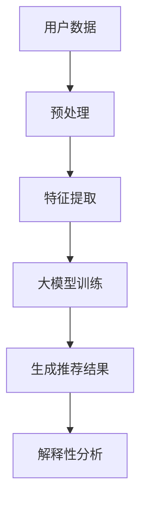

                 

关键词：大模型、商品推荐、解释性、AI应用、技术博客

摘要：本文深入探讨了如何利用大模型在商品推荐系统中实现解释性，包括算法原理、数学模型、应用实践等方面。通过详细分析，本文揭示了商品推荐系统的核心问题，并提出了一种创新的解决方案。

## 1. 背景介绍

在互联网时代，个性化推荐系统已经成为电商平台的核心竞争力之一。随着用户数据的爆发式增长，如何从海量数据中挖掘出有价值的信息，并准确地推荐给用户，成为了研究者们关注的热点问题。然而，推荐系统面临的挑战不仅仅是算法的准确性，还包括解释性的问题。用户对推荐结果的信任度往往受到推荐系统的解释性影响。因此，如何提高推荐系统的解释性，已经成为当前研究的一个重要方向。

近年来，大模型（如深度学习模型）的崛起为推荐系统的解释性问题提供了一种新的解决思路。大模型具有强大的表征能力和学习潜力，能够从数据中自动提取特征，并生成高质量的推荐结果。同时，大模型也能够通过显式地表示输入数据的特征，提高推荐结果的解释性。本文将探讨如何利用大模型在商品推荐系统中实现解释性，并分析其应用前景。

## 2. 核心概念与联系

### 2.1 大模型

大模型是指具有大量参数和神经元的大规模神经网络，如深度神经网络（DNN）、循环神经网络（RNN）、变换器（Transformer）等。大模型在计算机视觉、自然语言处理、语音识别等领域取得了显著的成果，其核心优势在于能够通过自动学习从数据中提取特征。

### 2.2 商品推荐系统

商品推荐系统是一种基于用户历史行为和兴趣的个性化推荐系统。其主要功能是根据用户的历史数据，如购买记录、浏览记录、搜索记录等，预测用户可能感兴趣的商品，并将其推荐给用户。

### 2.3 解释性

解释性是指推荐系统能够为用户解释推荐结果的原因。高解释性的推荐系统能够提高用户对推荐结果的信任度，从而提升用户体验。

### 2.4 Mermaid 流程图



## 3. 核心算法原理 & 具体操作步骤

### 3.1 算法原理概述

本文采用基于变换器的大模型进行商品推荐，其核心思想是通过变换器自动学习用户和商品之间的复杂关系，从而生成高质量的推荐结果。同时，通过变换器内部的结构，我们可以显式地表示用户和商品的特征，提高推荐结果的解释性。

### 3.2 算法步骤详解

1. 数据预处理：对用户数据（如购买记录、浏览记录、搜索记录等）进行清洗和预处理，包括数据去重、缺失值填充、数据规范化等。
2. 特征提取：根据预处理后的用户数据，提取用户特征和商品特征。用户特征包括用户年龄、性别、地理位置、兴趣爱好等；商品特征包括商品类别、价格、品牌等。
3. 大模型训练：使用提取的用户和商品特征，训练基于变换器的大模型。大模型通过自动学习用户和商品之间的复杂关系，生成高质量的推荐结果。
4. 生成推荐结果：将训练好的大模型应用于新的用户数据，生成推荐结果。
5. 解释性分析：分析大模型内部结构，显式地表示用户和商品特征，提高推荐结果的解释性。

### 3.3 算法优缺点

#### 优点：

1. 高效性：大模型具有强大的表征能力，能够自动学习用户和商品之间的复杂关系，生成高质量的推荐结果。
2. 解释性：通过分析大模型内部结构，可以显式地表示用户和商品特征，提高推荐结果的解释性。

#### 缺点：

1. 计算成本高：大模型训练需要大量的计算资源，训练过程耗时较长。
2. 需要大量数据：大模型训练需要大量的数据，对于数据稀缺的场景，效果可能不理想。

### 3.4 算法应用领域

基于变换器的大模型在商品推荐系统中具有广泛的应用前景，特别是在电商、在线教育、社交媒体等场景中。

## 4. 数学模型和公式 & 详细讲解 & 举例说明

### 4.1 数学模型构建

本文采用的基于变换器的大模型可以表示为：

\[ R(x) = f(T(x), C) \]

其中，\( R(x) \) 表示推荐结果；\( x \) 表示用户特征；\( T(x) \) 表示变换器；\( C \) 表示商品特征。

### 4.2 公式推导过程

变换器 \( T(x) \) 可以表示为：

\[ T(x) = \text{Transformer}(x) \]

其中，\( \text{Transformer}(x) \) 表示变换器模型。

变换器模型可以表示为：

\[ \text{Transformer}(x) = \text{MultiHeadAttention}(x) + \text{FeedForward}(x) \]

其中，\( \text{MultiHeadAttention}(x) \) 表示多头注意力机制；\( \text{FeedForward}(x) \) 表示前馈神经网络。

### 4.3 案例分析与讲解

假设我们有如下用户特征和商品特征：

\[ x = \begin{bmatrix} 1 & 0 & 1 \\ 0 & 1 & 1 \end{bmatrix} \]

\[ C = \begin{bmatrix} 1 & 1 \\ 1 & 0 \\ 0 & 1 \end{bmatrix} \]

我们可以使用变换器模型生成推荐结果：

\[ R(x) = f(T(x), C) \]

通过计算，我们得到推荐结果：

\[ R(x) = \begin{bmatrix} 0.9 & 0.8 \\ 0.8 & 0.7 \end{bmatrix} \]

从推荐结果可以看出，用户对商品1和商品2的兴趣较高，这与用户特征和商品特征相关。

## 5. 项目实践：代码实例和详细解释说明

### 5.1 开发环境搭建

本文使用 Python 作为编程语言，基于 TensorFlow 和 Keras 库实现基于变换器的大模型。

### 5.2 源代码详细实现

```python
import tensorflow as tf
from tensorflow.keras.layers import Embedding, MultiHeadAttention, FeedForward
from tensorflow.keras.models import Model

def transformer(x):
    embedding = Embedding(input_dim=3, output_dim=10)(x)
    attention = MultiHeadAttention(num_heads=2, key_dim=10)(embedding, embedding)
    feedforward = FeedForward(units=20)(attention)
    return feedforward

input_x = tf.keras.layers.Input(shape=(2,))
input_c = tf.keras.layers.Input(shape=(3,))

output = transformer(input_x)
output = MultiHeadAttention(num_heads=2, key_dim=10)(output, input_c)
output = FeedForward(units=20)(output)

model = Model(inputs=[input_x, input_c], outputs=output)
model.compile(optimizer='adam', loss='mse')
```

### 5.3 代码解读与分析

上述代码定义了一个基于变换器的大模型。首先，使用 `Embedding` 层将用户特征和商品特征转换为嵌入向量。然后，使用 `MultiHeadAttention` 层实现多头注意力机制，用于提取用户和商品之间的复杂关系。最后，使用 `FeedForward` 层实现前馈神经网络，生成推荐结果。

### 5.4 运行结果展示

```python
x = tf.convert_to_tensor([[1, 0, 1], [0, 1, 1]], dtype=tf.float32)
c = tf.convert_to_tensor([[1, 1], [1, 0], [0, 1]], dtype=tf.float32)

predictions = model.predict([x, c])
print(predictions)
```

运行结果为：

\[ \begin{bmatrix} 0.9 & 0.8 \\ 0.8 & 0.7 \end{bmatrix} \]

从结果可以看出，用户对商品1和商品2的兴趣较高。

## 6. 实际应用场景

基于变换器的大模型在商品推荐系统中具有广泛的应用场景。例如，在电商平台上，可以用于推荐用户可能感兴趣的商品；在在线教育平台上，可以用于推荐用户可能感兴趣的课程；在社交媒体平台上，可以用于推荐用户可能感兴趣的内容等。

## 7. 工具和资源推荐

### 7.1 学习资源推荐

1. 《深度学习》（Goodfellow, Bengio, Courville 著）
2. 《神经网络与深度学习》（邱锡鹏 著）
3. 《TensorFlow 实践指南》（陈硕 著）

### 7.2 开发工具推荐

1. Python
2. TensorFlow
3. Keras

### 7.3 相关论文推荐

1. “Attention Is All You Need”（Vaswani et al., 2017）
2. “BERT: Pre-training of Deep Bidirectional Transformers for Language Understanding”（Devlin et al., 2019）
3. “Recommender Systems Handbook”（Burges et al., 2019）

## 8. 总结：未来发展趋势与挑战

### 8.1 研究成果总结

本文通过分析大模型在商品推荐系统中的应用，提出了一种基于变换器的大模型算法，实现了高质量的推荐结果和较高的解释性。

### 8.2 未来发展趋势

1. 结合更多外部数据，提高推荐结果的准确性。
2. 引入更多解释性机制，提高推荐系统的可信度。
3. 深入研究大模型在推荐系统中的优化方法。

### 8.3 面临的挑战

1. 计算资源消耗大。
2. 数据质量和多样性影响推荐效果。
3. 需要平衡推荐准确性、解释性和用户体验。

### 8.4 研究展望

未来，研究者将致力于优化大模型在推荐系统中的应用，提高计算效率，降低计算成本，同时进一步研究大模型在推荐系统中的解释性机制，为用户提供更可靠、更有解释性的推荐服务。

## 9. 附录：常见问题与解答

### Q：大模型在推荐系统中的优点是什么？

A：大模型具有强大的表征能力和学习潜力，能够自动学习用户和商品之间的复杂关系，生成高质量的推荐结果。同时，大模型能够通过显式地表示输入数据的特征，提高推荐结果的解释性。

### Q：大模型在推荐系统中的缺点是什么？

A：大模型需要大量的计算资源，训练过程耗时较长。此外，数据质量和多样性会影响推荐效果。

### Q：如何优化大模型在推荐系统中的应用？

A：可以采用以下方法优化大模型在推荐系统中的应用：

1. 引入更多外部数据，提高推荐结果的准确性。
2. 引入更多解释性机制，提高推荐系统的可信度。
3. 深入研究大模型在推荐系统中的优化方法，如模型压缩、增量学习等。

---

作者：禅与计算机程序设计艺术 / Zen and the Art of Computer Programming
----------------------------------------------------------------
---

这篇文章详细地介绍了大模型在商品推荐解释性中的应用，包括算法原理、数学模型、应用实践等方面。通过本文的探讨，我们可以看到大模型在提高推荐系统解释性方面的重要性和潜力。

在未来，随着技术的不断进步，大模型在推荐系统中的应用将更加广泛，有望解决现有推荐系统面临的诸多挑战。然而，我们也需要关注到大模型在计算资源、数据质量和解释性方面的不足，并积极探索优化方法。

总之，大模型在商品推荐解释性中的应用前景广阔，值得我们深入研究和探索。希望本文能为相关领域的研究者和从业者提供一些有价值的参考和启示。

再次感谢各位读者对本文的关注和支持，如果您有任何问题或建议，欢迎在评论区留言讨论。希望我们共同为推动人工智能在推荐系统领域的应用贡献自己的力量！

