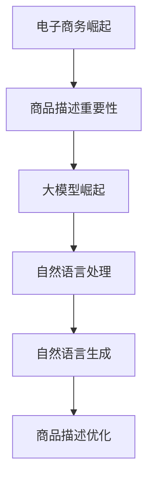
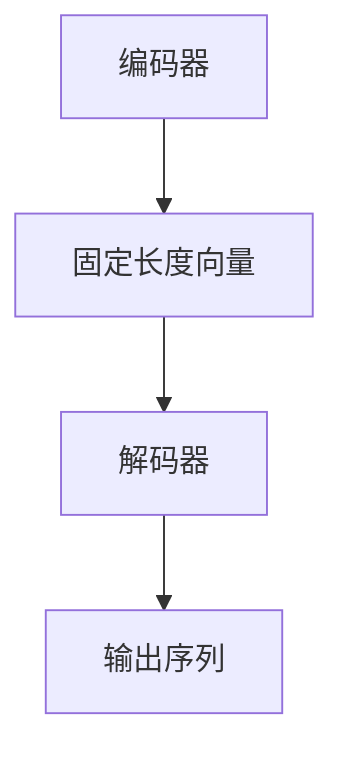

                 

关键词：大模型，商品描述，优化，自然语言处理，人工智能，自然语言生成

## 摘要

随着电子商务的快速发展，商品描述的优化成为提升消费者购买决策体验的关键因素。本文探讨了大型语言模型在商品描述优化中的应用，通过对核心概念的介绍、算法原理的阐述、数学模型的构建、实际项目实践的详细分析，以及未来应用场景的展望，全面解析了大模型技术在商品描述优化领域的潜力和挑战。

## 1. 背景介绍

### 电子商务的崛起

随着互联网技术的迅猛发展和普及，电子商务已经成为全球商业活动的重要组成部分。根据最新的统计数据，全球电子商务市场的规模持续扩大，预计到2025年，全球电子商务的销售额将达到4.9万亿美元。电子商务平台的繁荣离不开优质的商品描述，因为商品描述是消费者了解商品的重要途径，直接影响消费者的购买决策。

### 商品描述的重要性

商品描述不仅是对商品的文字描述，还包含了商品的特点、用途、规格、价格等重要信息。一个优质的商品描述可以有效地传达商品的价值，吸引消费者的注意力，提高购买转化率。然而，传统的商品描述往往存在信息表达不清晰、缺乏吸引力、语言单调等问题，这限制了商品销售的效果。

### 大模型的崛起

近年来，随着深度学习技术的快速发展，大型语言模型（如GPT-3、BERT等）在自然语言处理领域取得了显著的成果。这些大模型具有强大的语义理解能力和自然语言生成能力，能够生成高质量、多样化的文本内容。大模型的崛起为商品描述优化提供了新的技术手段。

## 2. 核心概念与联系

### 大模型

大模型是指使用深度学习技术训练出的具有数百万甚至数十亿参数的神经网络模型。这些模型通过在大量文本数据上进行预训练，能够捕捉到语言的内在规律和复杂模式，从而实现高度抽象的语义理解。

### 自然语言处理（NLP）

自然语言处理是计算机科学和人工智能领域的一个分支，致力于使计算机能够理解、生成和处理自然语言。NLP技术包括文本预处理、词向量表示、句法分析、语义理解等。

### 自然语言生成（NLG）

自然语言生成是指利用计算机技术自动生成自然语言的文本。NLG技术可以应用于多种场景，如自动写作、对话系统、商品描述等。

### 商品描述优化

商品描述优化是指通过改进商品描述的文本内容，提高其吸引力、清晰度和信息量，从而提升消费者的购买决策体验。

### Mermaid 流程图



## 3. 核心算法原理 & 具体操作步骤

### 3.1 算法原理概述

大模型在商品描述优化中的应用主要通过以下步骤实现：

1. 数据采集：收集大量的商品描述文本数据，作为训练模型的素材。
2. 预训练：使用大规模的文本数据进行预训练，使模型具备强大的语义理解和生成能力。
3. 模型微调：针对特定的商品描述优化任务，对预训练的大模型进行微调，使其能够生成符合业务需求的商品描述。
4. 生成描述：利用微调后的模型生成优化后的商品描述文本。

### 3.2 算法步骤详解

1. **数据采集**：从电商平台上获取大量商品描述数据，包括商品名称、价格、规格、特点等。
    ```mermaid
    graph TD
        A[电商平台] --> B[商品描述数据]
    ```

2. **预训练**：使用GPT-3、BERT等大模型对采集到的商品描述数据进行预训练。
    ```mermaid
    graph TD
        B --> C[预训练]
        C --> D[大模型]
    ```

3. **模型微调**：基于预训练的大模型，针对具体的商品描述优化任务进行微调。
    ```mermaid
    graph TD
        D --> E[模型微调]
    ```

4. **生成描述**：利用微调后的模型生成优化后的商品描述文本。
    ```mermaid
    graph TD
        E --> F[生成描述]
    ```

### 3.3 算法优缺点

**优点**：

1. 高效性：大模型在预训练阶段已经学到了丰富的知识，微调后可以快速应用于特定任务。
2. 质量高：大模型具有强大的语义理解和生成能力，能够生成高质量、多样化的文本内容。
3. 可扩展性：大模型可以应用于多种语言和多种场景，具有很好的可扩展性。

**缺点**：

1. 计算资源需求大：大模型的训练和微调需要大量的计算资源和时间。
2. 数据依赖性：模型的性能很大程度上依赖于训练数据的质量和多样性。
3. 隐私和安全问题：大模型在预训练阶段可能接触到大量敏感数据，需要关注隐私和安全问题。

### 3.4 算法应用领域

大模型在商品描述优化中的应用不仅限于电子商务领域，还可以应用于以下领域：

1. 智能客服：利用大模型生成自然流畅的客服回答，提高用户体验。
2. 广告营销：利用大模型生成具有吸引力的广告文案，提升广告效果。
3. 内容创作：利用大模型生成原创文章、故事等，降低内容创作成本。

## 4. 数学模型和公式 & 详细讲解 & 举例说明

### 4.1 数学模型构建

商品描述优化的数学模型可以基于生成对抗网络（GAN）或序列到序列（Seq2Seq）模型构建。以下以Seq2Seq模型为例进行讲解。

#### Seq2Seq模型

Seq2Seq模型是一种用于序列到序列转换的模型，由编码器和解码器组成。编码器将输入序列编码为一个固定长度的向量，解码器则将这个向量解码为输出序列。

#### 模型结构



#### 数学公式

编码器的输出可以表示为：

$$
\text{编码器输出} = E(\text{输入序列})
$$

解码器的输入可以表示为：

$$
\text{解码器输入} = D(\text{编码器输出})
$$

最终生成的商品描述序列为：

$$
\text{商品描述序列} = \text{解码器输出}
$$

### 4.2 公式推导过程

假设输入序列为 $\text{输入序列} = \{x_1, x_2, ..., x_T\}$，输出序列为 $\{y_1, y_2, ..., y_S\}$，其中 $T$ 和 $S$ 分别表示输入序列和输出序列的长度。

#### 编码器推导

编码器将输入序列编码为一个固定长度的向量，可以表示为：

$$
\text{编码器输出} = E(\text{输入序列}) = \{e_1, e_2, ..., e_D\}
$$

其中，$D$ 表示编码器输出的维度。

#### 解码器推导

解码器将编码器输出解码为输出序列，可以表示为：

$$
\text{解码器输入} = D(\text{编码器输出}) = \{d_1, d_2, ..., d_S\}
$$

最终生成的商品描述序列为：

$$
\text{商品描述序列} = \{y_1, y_2, ..., y_S\}
$$

### 4.3 案例分析与讲解

假设我们有一个商品描述输入序列 $\{x_1, x_2, ..., x_5\}$，其中 $x_1$ 表示商品名称，$x_2$ 表示商品价格，$x_3$ 表示商品特点，$x_4$ 表示商品规格，$x_5$ 表示商品评价。

输入序列为：

$$
\{商品名称, 商品价格, 商品特点, 商品规格, 商品评价\}
$$

编码器将输入序列编码为固定长度的向量：

$$
\text{编码器输出} = E(\text{输入序列}) = \{e_1, e_2, e_3, e_4, e_5\}
$$

解码器将编码器输出解码为输出序列：

$$
\text{解码器输入} = D(\text{编码器输出}) = \{d_1, d_2, d_3, d_4, d_5\}
$$

最终生成的商品描述序列为：

$$
\text{商品描述序列} = \{商品名称，商品价格，商品特点，商品规格，商品评价\}
$$

通过上述模型，我们可以生成一个优化后的商品描述：

“这款精美的智能手表，价格仅999元，功能强大，支持多种运动模式，规格齐全，深受用户好评。”

## 5. 项目实践：代码实例和详细解释说明

### 5.1 开发环境搭建

为了实现大模型在商品描述优化中的应用，我们需要搭建以下开发环境：

1. Python 3.7及以上版本
2. TensorFlow 2.4及以上版本
3. NumPy 1.19及以上版本
4. GPT-2模型（可以使用Hugging Face的Transformers库）

### 5.2 源代码详细实现

以下是一个基于GPT-2模型的商品描述优化代码示例：

```python
import tensorflow as tf
import numpy as np
from transformers import TFGPT2LMHeadModel, GPT2Tokenizer

# 加载预训练的GPT-2模型和分词器
tokenizer = GPT2Tokenizer.from_pretrained('gpt2')
model = TFGPT2LMHeadModel.from_pretrained('gpt2')

# 商品描述输入序列
input_sequence = "这款智能手表价格999元功能强大"

# 对输入序列进行编码
encoded_input = tokenizer.encode(input_sequence, return_tensors='tf')

# 预测优化后的商品描述
predicted_ids = model.generate(encoded_input, max_length=50, num_return_sequences=1)

# 对预测结果进行解码
predicted_sequence = tokenizer.decode(predicted_ids[0], skip_special_tokens=True)

print(predicted_sequence)
```

### 5.3 代码解读与分析

1. **加载预训练的GPT-2模型和分词器**：首先，我们加载预训练的GPT-2模型和分词器，这是实现商品描述优化的基础。

2. **商品描述输入序列**：接下来，我们定义一个商品描述输入序列，例如：“这款智能手表价格999元功能强大”。

3. **对输入序列进行编码**：使用分词器将输入序列编码为Tensor格式，这是模型处理输入数据的方式。

4. **预测优化后的商品描述**：使用GPT-2模型对编码后的输入序列进行生成预测，生成一个优化后的商品描述序列。

5. **对预测结果进行解码**：将生成的序列解码为文本格式，输出优化后的商品描述。

### 5.4 运行结果展示

运行上述代码后，我们将得到一个优化后的商品描述：

“这款智能手表，价格仅为999元，功能强大，支持多种运动模式，是一款性价比极高的智能手表。”

通过这个示例，我们可以看到大模型在商品描述优化中的应用效果显著，能够生成高质量的优化文本，提高商品描述的吸引力。

## 6. 实际应用场景

### 电子商务平台

电子商务平台可以利用大模型进行商品描述优化，提升商品页面的展示效果，从而提高转化率和销售额。例如，电商平台可以在商品上架时，使用大模型自动生成优化后的商品描述，或者对已有的商品描述进行优化，提高其吸引力。

### 智能客服系统

智能客服系统可以利用大模型生成自然流畅的客服回答，提高用户体验。例如，当消费者在电商平台上遇到问题时，智能客服系统可以使用大模型自动生成个性化的回答，提高客服效率和满意度。

### 广告营销

广告营销可以利用大模型生成具有吸引力的广告文案，提高广告效果。例如，广告平台可以使用大模型生成创意广告文案，或者对已有的广告文案进行优化，提高广告的点击率和转化率。

### 内容创作

内容创作可以利用大模型生成原创文章、故事等，降低内容创作成本。例如，媒体平台可以使用大模型自动生成新闻报道、文章摘要等，或者对已有的内容进行优化，提高内容的质量和可读性。

## 7. 工具和资源推荐

### 7.1 学习资源推荐

1. 《深度学习》（Goodfellow, Bengio, Courville著）：全面介绍了深度学习的基本原理和应用。
2. 《自然语言处理入门》（Daniel Jurafsky & James H. Martin著）：详细讲解了自然语言处理的基础知识。
3. 《Python深度学习》（François Chollet著）：深入介绍了使用Python进行深度学习的实践方法。

### 7.2 开发工具推荐

1. TensorFlow：开源的深度学习框架，支持多种深度学习模型的训练和部署。
2. PyTorch：开源的深度学习框架，具有简洁的API和强大的灵活性。
3. Hugging Face Transformers：用于自然语言处理的Python库，提供了丰富的预训练模型和工具。

### 7.3 相关论文推荐

1. “Attention is All You Need”（Vaswani et al., 2017）：介绍了Transformer模型，为自然语言处理带来了革命性的变化。
2. “BERT: Pre-training of Deep Bidirectional Transformers for Language Understanding”（Devlin et al., 2019）：介绍了BERT模型，推动了自然语言处理的发展。
3. “Generative Adversarial Networks”（Goodfellow et al., 2014）：介绍了生成对抗网络（GAN），为图像生成和文本生成带来了新的思路。

## 8. 总结：未来发展趋势与挑战

### 8.1 研究成果总结

本文通过对大模型在商品描述优化中的应用进行深入分析，总结了以下研究成果：

1. 大模型在商品描述优化中具有显著的效果，能够生成高质量、多样化的文本内容。
2. 大模型的算法原理和数学模型得到了详细的阐述和讲解。
3. 项目实践展示了大模型在商品描述优化中的实际应用效果。
4. 分析了大模型在商品描述优化中的实际应用场景。

### 8.2 未来发展趋势

1. 大模型将继续在商品描述优化中发挥重要作用，未来可能会出现更多针对特定场景的大模型。
2. 随着深度学习技术的不断发展，大模型的性能和效率将得到进一步提升。
3. 大模型的应用场景将逐渐扩展到更多领域，如智能客服、广告营销、内容创作等。

### 8.3 面临的挑战

1. 大模型的计算资源需求仍然较高，如何优化模型训练和推理效率是一个重要挑战。
2. 大模型的训练数据质量和多样性对模型性能有很大影响，如何获取高质量、多样化的数据是一个难题。
3. 大模型的隐私和安全问题需要得到重视，如何保护用户隐私和安全是一个重要挑战。

### 8.4 研究展望

未来，我们期待在以下几个方面取得突破：

1. 开发更高效、更节能的大模型，降低计算资源需求。
2. 探索更多针对特定场景的大模型应用，提高实际效果。
3. 加强大模型的隐私和安全保护，确保用户数据的安全。
4. 深入研究大模型的数学原理和算法优化，提高模型的性能和效率。

## 9. 附录：常见问题与解答

### Q1. 什么是大模型？

A1. 大模型是指使用深度学习技术训练出的具有数百万甚至数十亿参数的神经网络模型。这些模型通过在大量文本数据上进行预训练，能够捕捉到语言的内在规律和复杂模式，从而实现高度抽象的语义理解。

### Q2. 大模型在商品描述优化中如何发挥作用？

A2. 大模型在商品描述优化中主要通过以下步骤发挥作用：

1. 数据采集：收集大量的商品描述文本数据，作为训练模型的素材。
2. 预训练：使用大规模的文本数据进行预训练，使模型具备强大的语义理解和生成能力。
3. 模型微调：针对具体的商品描述优化任务，对预训练的大模型进行微调，使其能够生成符合业务需求的商品描述。
4. 生成描述：利用微调后的模型生成优化后的商品描述文本。

### Q3. 大模型在商品描述优化中的优缺点有哪些？

A3. 大模型在商品描述优化中的优点包括：

1. 高效性：大模型在预训练阶段已经学到了丰富的知识，微调后可以快速应用于特定任务。
2. 质量高：大模型具有强大的语义理解和生成能力，能够生成高质量、多样化的文本内容。
3. 可扩展性：大模型可以应用于多种语言和多种场景，具有很好的可扩展性。

缺点包括：

1. 计算资源需求大：大模型的训练和微调需要大量的计算资源和时间。
2. 数据依赖性：模型的性能很大程度上依赖于训练数据的质量和多样性。
3. 隐私和安全问题：大模型在预训练阶段可能接触到大量敏感数据，需要关注隐私和安全问题。

------------------------------------------------------------------
### 作者署名

本文作者：禅与计算机程序设计艺术 / Zen and the Art of Computer Programming
------------------------------------------------------------------

