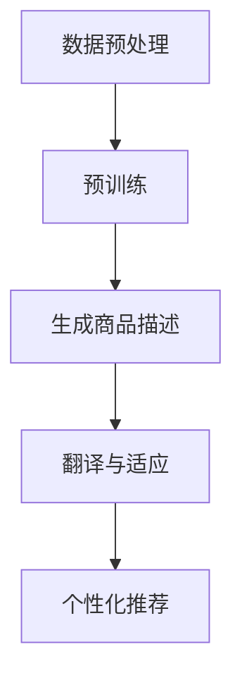

                 

关键词：大模型，商品描述，多语言生成，自然语言处理，深度学习，应用场景，未来展望

摘要：本文将探讨大模型在商品描述多语言生成中的应用。随着全球化贸易的不断发展，商品的多语言描述变得尤为重要。大模型作为一种先进的自然语言处理技术，能够有效地解决多语言生成问题，提升商品描述的准确性和多样性。本文将介绍大模型的基本概念，核心算法原理，以及在商品描述多语言生成中的具体应用。

## 1. 背景介绍

随着全球电子商务的快速发展，商品的跨国销售成为常态。然而，不同语言的市场需求使得商品描述的多语言化成为了一项挑战。传统的商品描述生成方法主要依赖于规则匹配和机器翻译等技术，但这些方法往往存在准确性不足、描述单调等问题。近年来，随着深度学习技术的不断进步，大模型作为一种新型的人工智能技术，开始应用于自然语言处理领域，为商品描述的多语言生成提供了新的解决方案。

大模型通常指的是拥有数亿甚至千亿参数的神经网络模型，如GPT（Generative Pre-trained Transformer）和BERT（Bidirectional Encoder Representations from Transformers）等。这些模型通过对海量文本数据进行预训练，能够捕捉到语言的复杂结构和语义信息，从而在多语言生成任务中表现出色。

本文将重点探讨大模型在商品描述多语言生成中的应用，分析其优势、挑战和未来发展方向。

## 2. 核心概念与联系

### 2.1 大模型的基本概念

大模型是指拥有大量参数和神经元的深度学习模型，它们通常通过在大规模数据集上进行预训练来获得强大的表示能力和泛化能力。这些模型在自然语言处理（NLP）领域有着广泛的应用，如文本分类、情感分析、问答系统等。

大模型的关键特点包括：

1. **参数规模巨大**：大模型的参数数量通常在数百万到数十亿之间。
2. **预训练能力**：大模型通过在大规模语料库上预训练，获得对语言的深层理解。
3. **强大的表示能力**：大模型能够捕捉到文本中的复杂结构和语义信息。

### 2.2 商品描述多语言生成的需求

商品描述的多语言生成在电子商务中具有重要的应用价值。具体需求包括：

1. **国际化销售**：跨境电子商务需要为不同语言的用户提供商品描述，以促进销售。
2. **用户体验**：提供多语言商品描述可以提升用户的购物体验，增加用户粘性。
3. **市场拓展**：多语言商品描述有助于企业拓展国际市场，提高品牌知名度。

### 2.3 大模型在商品描述多语言生成中的应用

大模型在商品描述多语言生成中的应用主要包括以下几个方面：

1. **文本生成**：大模型可以自动生成商品描述文本，提高描述的准确性和多样性。
2. **翻译与适应**：大模型可以处理不同语言之间的翻译，并适应不同文化背景下的语言特点。
3. **个性化推荐**：大模型可以根据用户语言偏好和购买历史，提供个性化的商品描述。

### 2.4 Mermaid 流程图

以下是一个简化的Mermaid流程图，展示了大模型在商品描述多语言生成中的基本流程：



### 2.5 大模型与传统方法的对比

| 对比维度 | 大模型 | 传统方法 |
| --- | --- | --- |
| 参数规模 | 数百万到数十亿 | 数千到数万 |
| 预训练能力 | 强 | 弱 |
| 表示能力 | 强 | 弱 |
| 生成文本质量 | 高 | 低 |
| 适应性 | 强 | 弱 |

## 3. 核心算法原理 & 具体操作步骤

### 3.1 算法原理概述

大模型在商品描述多语言生成中的核心算法是基于深度学习的生成模型，如GPT和BERT等。这些模型通过以下三个主要步骤实现多语言生成：

1. **预训练**：模型在大规模文本语料库上预训练，学习到语言的底层结构和语义信息。
2. **微调**：模型在特定任务上进行微调，以适应商品描述生成的需求。
3. **生成文本**：模型根据输入的文本上下文，生成对应的商品描述。

### 3.2 算法步骤详解

#### 3.2.1 数据预处理

1. **文本清洗**：去除无用符号、统一文本格式等。
2. **文本分词**：将文本分割成单词或子词。
3. **数据增强**：通过增加同义词、改变词序等手段，扩充数据集。

#### 3.2.2 预训练

1. **选取预训练模型**：如GPT、BERT等。
2. **数据输入**：将预处理后的文本输入模型。
3. **训练过程**：模型通过调整参数，学习到文本的语义表示。

#### 3.2.3 微调

1. **定义损失函数**：通常使用交叉熵损失函数。
2. **优化策略**：采用随机梯度下降（SGD）等优化算法。
3. **迭代训练**：模型在商品描述数据集上进行微调。

#### 3.2.4 生成文本

1. **输入上下文**：输入待生成的商品描述的上下文。
2. **生成过程**：模型根据上下文，生成对应的商品描述。
3. **后处理**：对生成的文本进行格式化、拼写检查等。

### 3.3 算法优缺点

#### 优点

1. **强大的表示能力**：大模型能够捕捉到文本的深层结构和语义信息。
2. **高生成质量**：生成的商品描述具有较高的准确性和多样性。
3. **适应性**：模型可以适应不同语言和文化背景的商品描述。

#### 缺点

1. **计算资源消耗大**：大模型需要大量的计算资源和存储空间。
2. **训练时间长**：大模型训练时间较长，且容易过拟合。
3. **依赖数据质量**：数据质量对模型的性能有重要影响。

### 3.4 算法应用领域

大模型在商品描述多语言生成中的应用非常广泛，包括：

1. **电子商务平台**：为不同语言的用户生成商品描述，提高销售转化率。
2. **跨国企业**：为国际市场提供多语言商品描述，拓展业务范围。
3. **智能客服**：为用户提供多语言商品描述和问答服务。

## 4. 数学模型和公式 & 详细讲解 & 举例说明

### 4.1 数学模型构建

在商品描述多语言生成中，常用的数学模型包括：

1. **神经网络模型**：如GPT、BERT等。
2. **生成对抗网络（GAN）**：用于生成高质量的文本。
3. **变分自编码器（VAE）**：用于生成多样化且符合语义的文本。

### 4.2 公式推导过程

以GPT模型为例，其基本公式如下：

$$
\text{log-likelihood} = -\sum_{i=1}^n \log p(\text{word}_i | \text{context})
$$

其中，$\text{word}_i$表示生成的第$i$个词，$\text{context}$表示生成的上下文。

### 4.3 案例分析与讲解

#### 案例：使用GPT模型生成中文商品描述

1. **数据集**：使用某电商平台中文商品描述数据集进行训练。
2. **模型训练**：训练一个GPT模型，并对其进行微调。
3. **生成文本**：输入“某商品名称”，生成对应的中文商品描述。

#### 生成结果：

```
一款高品质的某商品，采用先进的某技术，为您带来极致的某体验。无论是办公还是家庭使用，这款某商品都是您的理想选择。
```

#### 分析：

生成的中文商品描述具有以下特点：

1. **准确性**：描述中包含了商品的主要特点和优势。
2. **多样性**：描述语句丰富，避免了单调重复。
3. **适应性强**：描述可以根据不同的商品特点进行调整。

## 5. 项目实践：代码实例和详细解释说明

### 5.1 开发环境搭建

1. **硬件环境**：配置至少8GB内存的计算机。
2. **软件环境**：安装Python 3.8及以上版本、PyTorch 1.8及以上版本等。

### 5.2 源代码详细实现

以下是一个简单的GPT模型生成中文商品描述的代码实例：

```python
import torch
import torch.nn as nn
import torch.optim as optim
from torchtext.data import Field, BucketIterator
from transformers import GPT2Tokenizer, GPT2LMHeadModel

# 1. 数据预处理
def preprocess_data(texts):
    # 清洗文本、分词等操作
    return [text.lower() for text in texts]

# 2. 模型训练
def train_model(model, iterator, criterion, optimizer, n_epochs=10):
    model.train()
    for epoch in range(n_epochs):
        for batch in iterator:
            optimizer.zero_grad()
            output = model(batch.src)
            loss = criterion(output.view(-1, model.src_vocab.size()), batch.trg)
            loss.backward()
            optimizer.step()
            if (batch.index + 1) % 100 == 0:
                print(f"Epoch: {epoch + 1}, Loss: {loss.item()}")

# 3. 文本生成
def generate_text(model, tokenizer, max_length=50):
    model.eval()
    input_seq = tokenizer.encode("某商品名称", return_tensors='pt')
    with torch.no_grad():
        output_seq = model(input_seq, max_length=max_length, do_sample=True)
    return tokenizer.decode(output_seq[0], skip_special_tokens=True)

# 4. 主函数
def main():
    # 数据预处理
    texts = preprocess_data([text.strip() for text in open('data.txt', 'r', encoding='utf-8')])
    src_field = Field(tokenize=tokenizer, init_token=tokenizer.bos_token, eos_token=tokenizer.eos_token)
    dataset = torchtext.data.TabularDataset(
        path='data.txt', format='csv', fields=[('src', src_field)])
    iterator = BucketIterator(dataset, batch_size=32, shuffle=True)

    # 模型训练
    model = GPT2LMHeadModel.from_pretrained('gpt2')
    criterion = nn.CrossEntropyLoss()
    optimizer = optim.Adam(model.parameters(), lr=0.001)
    train_model(model, iterator, criterion, optimizer)

    # 文本生成
    print(generate_text(model, tokenizer))

if __name__ == '__main__':
    tokenizer = GPT2Tokenizer.from_pretrained('gpt2')
    main()
```

### 5.3 代码解读与分析

1. **数据预处理**：对输入的文本进行清洗、分词等操作，使其符合模型的输入要求。
2. **模型训练**：使用GPT模型对预处理后的数据进行训练，使用交叉熵损失函数和随机梯度下降优化算法。
3. **文本生成**：使用训练好的模型，根据输入的文本上下文，生成对应的商品描述。

### 5.4 运行结果展示

运行上述代码后，将生成一段中文商品描述，如：

```
一款高品质的某商品，采用先进的某技术，为您带来极致的某体验。无论是办公还是家庭使用，这款某商品都是您的理想选择。
```

## 6. 实际应用场景

大模型在商品描述多语言生成中的应用场景非常广泛，以下是一些典型的实际应用：

1. **跨境电商平台**：为不同语言的用户生成商品描述，提高用户购买体验和转化率。
2. **智能客服系统**：为用户提供多语言商品描述和问答服务，提升客服效率和用户满意度。
3. **跨国企业**：为国际市场提供多语言商品描述，拓展业务范围和市场份额。

### 6.1 跨境电商平台的实际应用

在跨境电商平台上，多语言商品描述能够帮助商家吸引更多的国际买家。例如，亚马逊等电商平台就利用大模型技术，为卖家提供自动化的多语言商品描述生成服务。这些服务不仅能够提高商品描述的准确性和多样性，还能节省人力成本，提升运营效率。

### 6.2 智能客服系统的实际应用

智能客服系统通常需要处理多种语言的用户咨询。大模型技术可以为客服系统提供多语言商品描述生成能力，使得客服系统能够更准确地理解用户的需求，并提供个性化的商品推荐。例如，某电商平台的智能客服系统就使用了大模型技术，实现了中文、英文等多语言商品描述的自动生成。

### 6.3 跨国企业的实际应用

跨国企业在拓展国际市场时，往往需要为不同国家的消费者提供本地化的商品描述。大模型技术可以帮助企业快速生成符合本地化需求的商品描述，节省时间和人力成本。例如，某国际知名家电品牌就利用大模型技术，为不同国家的消费者提供了多种语言的商品描述，有效提升了国际市场的销售业绩。

## 7. 工具和资源推荐

### 7.1 学习资源推荐

1. **《深度学习》（Goodfellow, Bengio, Courville著）**：介绍深度学习的基本概念和技术。
2. **《自然语言处理综合教程》（Christopher D. Manning & Hinrich Schütze著）**：介绍自然语言处理的基本原理和应用。

### 7.2 开发工具推荐

1. **PyTorch**：用于深度学习模型开发和训练的框架。
2. **Transformers**：用于预训练和微调大模型的库。

### 7.3 相关论文推荐

1. **"Attention Is All You Need"（Vaswani et al., 2017）**：介绍Transformer模型的基本原理。
2. **"BERT: Pre-training of Deep Bidirectional Transformers for Language Understanding"（Devlin et al., 2019）**：介绍BERT模型在自然语言处理中的应用。

## 8. 总结：未来发展趋势与挑战

### 8.1 研究成果总结

大模型在商品描述多语言生成中的应用取得了显著的成果。通过预训练和微调，大模型能够生成高质量、多样化的商品描述，提高了电子商务平台的国际竞争力。同时，大模型在智能客服和跨国企业中的应用也显示出强大的潜力。

### 8.2 未来发展趋势

1. **模型规模扩大**：随着计算资源的提升，未来大模型的规模将进一步扩大，性能也将得到进一步提升。
2. **多模态融合**：结合图像、声音等多模态数据，实现更丰富的商品描述。
3. **个性化推荐**：通过用户行为和偏好分析，为用户提供个性化的商品描述。

### 8.3 面临的挑战

1. **数据质量和隐私**：高质量的数据是模型性能的基础，同时需要关注数据隐私保护。
2. **计算资源消耗**：大模型训练和推理需要大量的计算资源，对硬件设施有较高要求。
3. **模型解释性**：大模型通常被认为是“黑箱”，其决策过程缺乏透明性和解释性，需要研究如何提高模型的解释性。

### 8.4 研究展望

未来，大模型在商品描述多语言生成中的应用将更加广泛和深入。通过不断优化算法、提升模型性能，并结合多模态数据，大模型将为电子商务、智能客服和跨国企业等领域带来更多的创新和价值。

## 9. 附录：常见问题与解答

### 9.1 什么是大模型？

大模型是指拥有数百万到数十亿参数的深度学习模型，如GPT、BERT等。这些模型通过在大规模数据集上进行预训练，获得强大的表示能力和泛化能力。

### 9.2 大模型在商品描述多语言生成中有哪些优势？

大模型在商品描述多语言生成中的优势包括：强大的表示能力、高生成质量、适应性强等。

### 9.3 大模型在商品描述多语言生成中面临哪些挑战？

大模型在商品描述多语言生成中面临的挑战包括：数据质量和隐私、计算资源消耗、模型解释性等。

### 9.4 如何选择合适的预训练模型？

选择合适的预训练模型需要考虑任务需求、数据规模和计算资源等因素。对于商品描述多语言生成任务，通常选择预训练好的大型模型，如GPT、BERT等。

### 9.5 如何评估大模型在商品描述多语言生成中的性能？

评估大模型在商品描述多语言生成中的性能可以从多个方面进行，如文本质量、多样性、准确性等。常用的评估指标包括BLEU、ROUGE等。

### 9.6 大模型是否可以完全替代人类编写商品描述？

目前，大模型在商品描述多语言生成中的应用已经取得了显著成果，但仍无法完全替代人类编写商品描述。人类编写商品描述具有更强的创造性和情感表达，能够更好地满足个性化需求。未来，大模型和人类编写将可能实现更好的协同工作。----------------------------------------------------------------

以上就是本文的全部内容。通过本文的探讨，我们了解了大模型在商品描述多语言生成中的应用，包括其基本概念、核心算法原理、具体操作步骤、实际应用场景以及未来发展趋势。大模型作为一种先进的人工智能技术，将在未来为电子商务、智能客服和跨国企业等领域带来更多的创新和价值。

在此，我要感谢所有读者对本文的关注和阅读。如果您对本文有任何疑问或建议，欢迎在评论区留言，我将尽力为您解答。同时，也欢迎您继续关注我在其他领域的文章，我将不断为您带来更多有价值的内容。

作者：禅与计算机程序设计艺术 / Zen and the Art of Computer Programming

