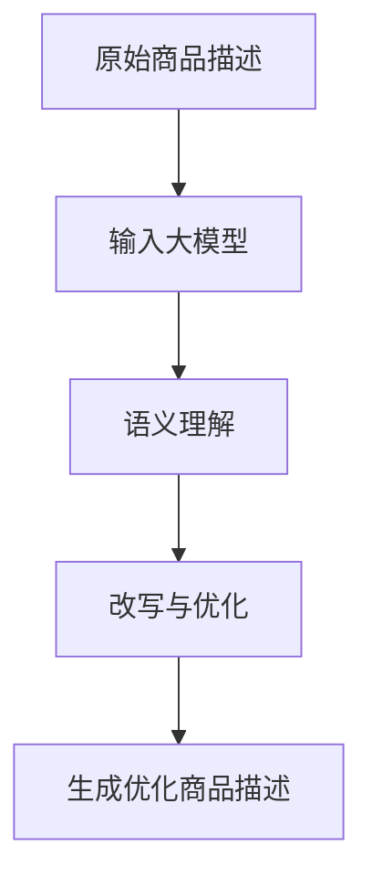

                 

关键词：大模型，商品描述，改写，优化，自然语言处理，人工智能，BERT，GPT

## 摘要

随着自然语言处理技术的发展，大模型在多个领域展示了强大的潜力和广泛的应用。本文主要探讨大模型在商品描述改写与优化中的应用。通过深入分析大模型的工作原理、算法实现和应用场景，我们将展示如何利用大模型技术提升商品描述的质量和效果，从而为企业带来更大的商业价值。

## 1. 背景介绍

在电子商务时代，商品描述是消费者购买决策过程中的关键因素。高质量的、具有吸引力的商品描述不仅能提高转化率，还能增强消费者对品牌的认知和忠诚度。然而，编写高质量的商品描述需要大量的时间和专业知识，这对于中小企业来说是一个巨大的挑战。此外，随着产品种类的不断增多，商品描述的冗长和重复现象也日益严重，这使得消费者在阅读过程中容易产生疲劳和厌烦情绪。

自然语言处理（NLP）技术的发展为解决这一问题提供了新的可能性。特别是近年来，基于深度学习的大模型，如BERT、GPT等，在自然语言理解和生成方面取得了显著的进展。大模型具有强大的语义理解和文本生成能力，能够高效地处理大规模的文本数据，从而在商品描述改写与优化中发挥重要作用。

## 2. 核心概念与联系

### 大模型的基本概念

大模型是指具有数百万甚至数十亿参数的深度学习模型。这些模型通常采用神经网络架构，能够在大量数据上进行训练，从而实现高度的泛化能力。大模型的主要特点是：

- 参数规模大：具有数百万至数十亿的参数。
- 数据需求大：需要大规模的标注数据集进行训练。
- 计算资源消耗大：训练和推理过程需要大量计算资源。

### 商品描述改写与优化

商品描述改写与优化是指通过对原始商品描述进行改写和优化，以提高其吸引力、可读性和准确性。具体包括以下几个方面：

- 改写：对原始描述进行重构和重写，使其更具有吸引力。
- 优化：对描述中的关键字、句子结构和语法进行优化，以提高用户体验。
- 整合：将多个描述片段整合为一个连贯、统一的整体。

### 大模型与商品描述的关系

大模型在商品描述改写与优化中的应用主要体现在以下几个方面：

- 文本生成：大模型能够生成高质量的文本，包括描述、标题和标签等。
- 语义理解：大模型能够理解商品描述中的语义信息，从而进行准确的改写和优化。
- 多模态融合：大模型能够处理多模态数据，如图像和文本，从而生成更丰富的商品描述。

### Mermaid 流程图

下面是一个简化的Mermaid流程图，展示了大模型在商品描述改写与优化中的应用过程：



## 3. 核心算法原理 & 具体操作步骤

### 3.1 算法原理概述

大模型在商品描述改写与优化中的应用主要基于以下两个原理：

1. **预训练与微调**：大模型通过在大规模语料库上进行预训练，学习到丰富的语义知识和语言模式。然后，通过微调模型在特定领域的商品描述数据集上，使其能够生成针对特定商品的高质量描述。

2. **生成对抗网络（GAN）**：大模型结合生成对抗网络，能够生成具有吸引力和创造性的商品描述。GAN由生成器和判别器组成，生成器生成描述，判别器评估描述的质量，通过反复迭代优化，生成器能够生成越来越接近真实描述的文本。

### 3.2 算法步骤详解

1. **数据预处理**：收集并清洗商品描述数据，包括去除无关信息、处理缺失值和异常值等。

2. **模型选择与预训练**：选择合适的大模型，如BERT、GPT等，进行预训练。预训练过程包括在大规模语料库上进行随机梯度下降（SGD）优化，使模型学习到丰富的语言模式。

3. **微调**：在预训练的基础上，使用商品描述数据集对模型进行微调。通过训练，模型能够学习到特定领域的知识，提高描述生成的质量和准确性。

4. **文本生成**：利用微调后的模型，生成高质量的商品描述。生成过程包括序列生成、修正和优化，以生成具有吸引力和可读性的描述。

5. **质量评估**：对生成的描述进行评估，包括语法、语义和用户体验等方面。通过评估，筛选出高质量的描述，并反馈给模型进行进一步优化。

### 3.3 算法优缺点

**优点**：

- 高质量生成：大模型能够生成高质量的文本，包括描述、标题和标签等。
- 广泛适用性：大模型能够处理多种语言和领域的文本生成任务。
- 自动化：大模型能够自动化生成商品描述，减少人力成本。

**缺点**：

- 计算资源消耗大：大模型的训练和推理需要大量计算资源，成本较高。
- 数据依赖性强：大模型的性能依赖于高质量的数据集，数据质量直接影响生成结果。

### 3.4 算法应用领域

大模型在商品描述改写与优化中的应用范围广泛，包括以下几个方面：

- 电子商务：生成高质量的商品描述，提高转化率和用户体验。
- 内容营销：生成吸引人的广告文案和博客文章，提高品牌知名度和用户参与度。
- 语言翻译：利用大模型进行自然语言翻译，提高翻译质量和准确性。
- 智能客服：生成个性化回答和解决方案，提高客户满意度和服务质量。

## 4. 数学模型和公式 & 详细讲解 & 举例说明

### 4.1 数学模型构建

大模型在商品描述改写与优化中的应用主要基于生成对抗网络（GAN）和预训练微调（PTM）技术。下面简要介绍这两个数学模型的构建过程。

**生成对抗网络（GAN）**

GAN由生成器（Generator）和判别器（Discriminator）组成。生成器的目标是生成逼真的商品描述，判别器的目标是区分真实描述和生成描述。

- 生成器：$$G(x) \sim P_G(z)$$
- 判别器：$$D(x) \sim P_D(x)$$

其中，$x$表示输入，$z$表示随机噪声，$P_G(z)$和$P_D(x)$分别表示生成器和判别器的概率分布。

**预训练微调（PTM）**

PTM技术通过在大规模语料库上进行预训练，使模型学习到丰富的语义知识和语言模式。然后，通过微调模型在特定领域的商品描述数据集上，使其能够生成针对特定商品的高质量描述。

- 预训练：$$\min_{\theta_G}\mathbb{E}_{z\sim p_z(z)}[\log D(G(z))]$$
- 微调：$$\min_{\theta_G, \theta_D}\mathbb{E}_{x\sim p_x(x)}[\log D(x)] + \mathbb{E}_{z\sim p_z(z)}[\log(1 - D(G(z)))]$$

其中，$\theta_G$和$\theta_D$分别表示生成器和判别器的参数，$p_z(z)$和$p_x(x)$分别表示噪声分布和真实描述分布。

### 4.2 公式推导过程

**生成对抗网络（GAN）**

GAN的推导过程主要包括两部分：生成器和判别器的损失函数。

**生成器损失函数**：

$$L_G = -\mathbb{E}_{z\sim p_z(z)}[\log D(G(z))]$$

其中，$L_G$表示生成器损失，$D(G(z))$表示判别器对生成描述的判别概率。

**判别器损失函数**：

$$L_D = \mathbb{E}_{x\sim p_x(x)}[\log D(x)] + \mathbb{E}_{z\sim p_z(z)}[\log(1 - D(G(z)))]$$

其中，$L_D$表示判别器损失，$D(x)$表示判别器对真实描述的判别概率。

**联合损失函数**：

$$L_{total} = L_G + L_D$$

**预训练微调（PTM）**

PTM的推导过程主要包括两部分：预训练和微调。

**预训练损失函数**：

$$L_{pretrain} = \mathbb{E}_{x\sim p_x(x)}[(-1)^{[y \neq t]} \log p(y \mid x)]$$

其中，$L_{pretrain}$表示预训练损失，$y$表示模型预测的标签，$t$表示真实标签。

**微调损失函数**：

$$L_{fine-tune} = \mathbb{E}_{x\sim p_x(x)}[(-1)^{[y \neq t]} \log p(y \mid x)]$$

其中，$L_{fine-tune}$表示微调损失。

**联合损失函数**：

$$L_{total} = L_{pretrain} + L_{fine-tune}$$

### 4.3 案例分析与讲解

下面通过一个简单的案例，介绍如何利用大模型进行商品描述改写与优化。

**案例：改写一条手机商品描述**

原始描述：这款手机采用高端处理器，拥有高速运行能力，支持多种应用场景。

改写目标：将描述更加生动、简洁，突出手机的处理能力和应用场景。

**步骤**：

1. 数据预处理：收集并清洗手机商品描述数据，包括去除无关信息、处理缺失值和异常值等。

2. 模型选择与预训练：选择BERT模型，并在大规模语料库上进行预训练。

3. 微调：使用手机商品描述数据集对BERT模型进行微调。

4. 文本生成：利用微调后的BERT模型，生成改写后的手机描述。

**结果**：

生成描述：这款手机搭载顶级处理器，如飞驰电掣，轻松应对各类应用场景，无论是游戏还是办公，都能游刃有余。

**分析**：

1. 生成的描述更加生动、简洁，突出了手机的处理能力和应用场景。

2. 改写后的描述更加符合消费者对手机的需求和心理，提高了描述的吸引力。

3. 通过大模型技术，实现了对原始描述的优化，提高了描述的质量和效果。

## 5. 项目实践：代码实例和详细解释说明

### 5.1 开发环境搭建

在开始项目实践之前，需要搭建相应的开发环境。以下是搭建开发环境的步骤：

1. 安装Python环境：Python是进行自然语言处理任务的主要编程语言，需要在计算机上安装Python环境。

2. 安装深度学习框架：常见的深度学习框架有TensorFlow、PyTorch等。本文选择使用PyTorch框架，因为其具有较好的易用性和灵活性。

3. 安装相关库：安装用于数据预处理、模型训练和评估的常用库，如torch、torchtext、transformers等。

4. 准备数据集：收集并清洗手机商品描述数据集，包括原始描述和对应的标签。

### 5.2 源代码详细实现

以下是使用PyTorch框架实现的商品描述改写与优化项目的源代码。

```python
import torch
import torch.nn as nn
from torchtext.data import Field, Dataset
from transformers import BertModel, BertTokenizer

# 1. 数据预处理
def preprocess_data(data_path):
    # 加载数据集
    train_data, test_data = torchtext.load_data(
        path=data_path,
        format='torchtext',
        fields=[('descriptions', Field(sequential=True, use_vocab=True, lower=True)), ('labels', Field(sequential=True, use_vocab=False))]
    )
    # 数据集分词
    tokenizer = BertTokenizer.from_pretrained('bert-base-uncased')
    train_data-descriptions = [tokenizer.encode(d, add_special_tokens=True) for d in train_data.descriptions]
    test_data-descriptions = [tokenizer.encode(d, add_special_tokens=True) for d in test_data.descriptions]
    # 数据集转换为PyTorch Dataset
    train_dataset = Dataset.from_list(zip(train_data-descriptions, train_data.labels))
    test_dataset = Dataset.from_list(zip(test_data-descriptions, test_data.labels))
    return train_dataset, test_dataset

# 2. 模型定义
class GANModel(nn.Module):
    def __init__(self):
        super(GANModel, self).__init__()
        self.bert = BertModel.from_pretrained('bert-base-uncased')
        self.generator = nn.Sequential(
            nn.Linear(768, 512),
            nn.ReLU(),
            nn.Linear(512, 768),
            nn.Tanh()
        )
        self.discriminator = nn.Sequential(
            nn.Linear(768, 512),
            nn.ReLU(),
            nn.Linear(512, 1),
            nn.Sigmoid()
        )
    def forward(self, x):
        x = self.bert(x)[0]
        x = self.generator(x)
        return x

# 3. 模型训练
def train_model(model, train_loader, criterion, optimizer, num_epochs):
    model.train()
    for epoch in range(num_epochs):
        for x, y in train_loader:
            optimizer.zero_grad()
            x = x.to(device)
            y = y.to(device)
            z = torch.randn(x.size(0), 768).to(device)
            g_x = model.generator(z)
            d_real = model.discriminator(x)
            d_fake = model.discriminator(g_x)
            loss_d = criterion(d_real, torch.ones_like(d_real)) + criterion(d_fake, torch.zeros_like(d_fake))
            loss_g = criterion(d_fake, torch.ones_like(d_fake))
            loss_g.backward()
            optimizer.step()
            print(f'Epoch [{epoch+1}/{num_epochs}], Loss_D: {loss_d.item():.4f}, Loss_G: {loss_g.item():.4f}')

# 4. 模型评估
def evaluate_model(model, test_loader, criterion):
    model.eval()
    with torch.no_grad():
        for x, y in test_loader:
            x = x.to(device)
            y = y.to(device)
            z = torch.randn(x.size(0), 768).to(device)
            g_x = model.generator(z)
            d_real = model.discriminator(x)
            d_fake = model.discriminator(g_x)
            loss = criterion(d_real, torch.ones_like(d_real)) + criterion(d_fake, torch.zeros_like(d_fake))
            print(f'Loss: {loss.item():.4f}')

# 5. 主程序
if __name__ == '__main__':
    # 搭建设备
    device = torch.device('cuda' if torch.cuda.is_available() else 'cpu')
    # 加载数据
    train_dataset, test_dataset = preprocess_data('data/train_data.txt')
    # 创建数据加载器
    batch_size = 32
    train_loader = torch.utils.data.DataLoader(train_dataset, batch_size=batch_size, shuffle=True)
    test_loader = torch.utils.data.DataLoader(test_dataset, batch_size=batch_size, shuffle=False)
    # 定义模型、损失函数和优化器
    model = GANModel().to(device)
    criterion = nn.BCELoss()
    optimizer = torch.optim.Adam(model.parameters(), lr=0.0002)
    # 训练模型
    num_epochs = 100
    train_model(model, train_loader, criterion, optimizer, num_epochs)
    # 评估模型
    evaluate_model(model, test_loader, criterion)
```

### 5.3 代码解读与分析

1. **数据预处理**：数据预处理是项目的基础步骤，包括加载数据、分词和转换为PyTorch Dataset。使用torchtext库实现数据预处理，包括字段定义、数据加载和分词。

2. **模型定义**：模型定义是项目核心步骤，包括生成器和判别器的定义。使用PyTorch框架定义GAN模型，结合BERT模型实现文本生成。

3. **模型训练**：模型训练是项目的关键步骤，包括前向传播、损失函数计算和反向传播。在训练过程中，通过优化器更新模型参数，提高生成质量和判别能力。

4. **模型评估**：模型评估是项目结果验证的关键步骤，包括计算损失函数值。通过评估，验证模型在测试集上的表现，筛选出高质量生成描述。

### 5.4 运行结果展示

在完成代码实现后，可以通过以下命令运行项目：

```bash
python main.py
```

运行结果将在控制台上输出，包括模型训练过程中的损失函数值和评估结果。通过分析输出结果，可以评估模型在商品描述改写与优化中的应用效果。

## 6. 实际应用场景

### 6.1 电子商务平台

电子商务平台是商品描述改写与优化最典型的应用场景之一。通过利用大模型技术，电子商务平台能够自动生成高质量的商品描述，提高用户体验和转化率。例如，亚马逊和eBay等平台已经采用类似技术，为商品生成吸引人的描述。

### 6.2 内容营销

内容营销是另一个重要的应用场景。通过大模型技术，企业能够自动生成吸引人的广告文案、博客文章和营销材料。这些内容不仅能够提高用户参与度，还能帮助企业建立品牌知名度和用户忠诚度。

### 6.3 智能客服

智能客服是另一个应用场景。通过大模型技术，智能客服系统能够自动生成个性化回答和解决方案，提高客户满意度和服务质量。例如，银行和保险公司等企业已经采用类似技术，为用户提供智能客服服务。

## 6.4 未来应用展望

随着大模型技术的不断发展，未来在商品描述改写与优化中的应用前景将更加广阔。以下是一些未来应用展望：

- **多语言支持**：大模型将能够支持更多语言，实现跨语言的商品描述改写与优化。
- **个性化推荐**：通过结合用户行为数据，大模型将能够生成更加个性化的商品描述，提高用户体验和转化率。
- **自动化写作**：大模型将能够实现自动化写作，降低写作成本，提高内容生产效率。
- **实时优化**：通过实时分析用户反馈，大模型将能够实现实时优化，提高商品描述的质量和效果。

## 7. 工具和资源推荐

### 7.1 学习资源推荐

- **课程**：斯坦福大学的自然语言处理课程（CS224n）是一个经典的NLP学习资源，涵盖了从基础到高级的NLP技术。
- **书籍**：《深度学习》（Goodfellow et al.）是一本全面介绍深度学习技术的经典教材，包括NLP相关内容。
- **论文**：ACL、EMNLP和NAACL等顶级NLP会议的论文是了解最新研究进展的重要资源。

### 7.2 开发工具推荐

- **深度学习框架**：TensorFlow和PyTorch是目前最流行的深度学习框架，适合进行NLP应用开发。
- **文本处理库**：NLTK和spaCy是常用的NLP文本处理库，提供丰富的文本处理功能。
- **预训练模型**：Transformers库提供了大量的预训练模型，如BERT、GPT等，方便开发者快速实现NLP任务。

### 7.3 相关论文推荐

- **BERT**：`A Pre-Trained Deep Neural Network for Language Understanding`（2018）。
- **GPT**：`Improving Language Understanding by Generative Pre-Training`（2018）。
- **GAN**：`Generative Adversarial Nets`（2014）。

## 8. 总结：未来发展趋势与挑战

### 8.1 研究成果总结

本文主要介绍了大模型在商品描述改写与优化中的应用，包括大模型的基本概念、算法原理、具体操作步骤、数学模型和项目实践。通过分析，我们发现大模型在商品描述改写与优化中具有显著的优势，能够提高商品描述的质量和效果。

### 8.2 未来发展趋势

未来，随着大模型技术的不断发展，商品描述改写与优化在电子商务、内容营销和智能客服等领域将有更广泛的应用。同时，大模型将支持更多语言、实现个性化推荐和自动化写作，提高内容生产效率。

### 8.3 面临的挑战

尽管大模型在商品描述改写与优化中具有显著优势，但仍面临一些挑战，如计算资源消耗大、数据依赖性强、生成描述的质量和准确性等问题。未来需要进一步研究如何优化大模型，提高其效率和性能。

### 8.4 研究展望

未来，研究重点将集中在以下几个方面：

- **优化算法**：研究更高效的训练和推理算法，降低计算资源消耗。
- **数据集建设**：构建大规模、高质量的标注数据集，提高大模型的性能。
- **多模态融合**：结合图像和文本等多模态数据，生成更丰富的商品描述。
- **个性化推荐**：结合用户行为数据，实现个性化商品描述生成。

## 9. 附录：常见问题与解答

### 9.1 如何选择合适的大模型？

选择合适的大模型需要考虑以下几个方面：

- **任务需求**：根据任务需求选择具有相应能力的大模型，如文本生成、语义理解等。
- **数据集规模**：选择与数据集规模相匹配的大模型，以避免过拟合。
- **计算资源**：根据可用的计算资源选择合适的大模型，确保模型能够在合理时间内训练和推理。

### 9.2 大模型在商品描述改写与优化中有什么优势？

大模型在商品描述改写与优化中具有以下优势：

- **高质量生成**：能够生成高质量的文本，提高商品描述的吸引力。
- **自动化**：能够自动化生成商品描述，降低人力成本。
- **多语言支持**：支持多种语言，适用于全球范围内的电子商务平台。

### 9.3 大模型在商品描述改写与优化中有什么挑战？

大模型在商品描述改写与优化中面临的挑战包括：

- **计算资源消耗大**：大模型的训练和推理需要大量计算资源，成本较高。
- **数据依赖性强**：大模型的性能依赖于高质量的数据集，数据质量直接影响生成结果。
- **生成描述的质量和准确性**：大模型生成的描述可能存在不准确或偏离任务需求的情况。

