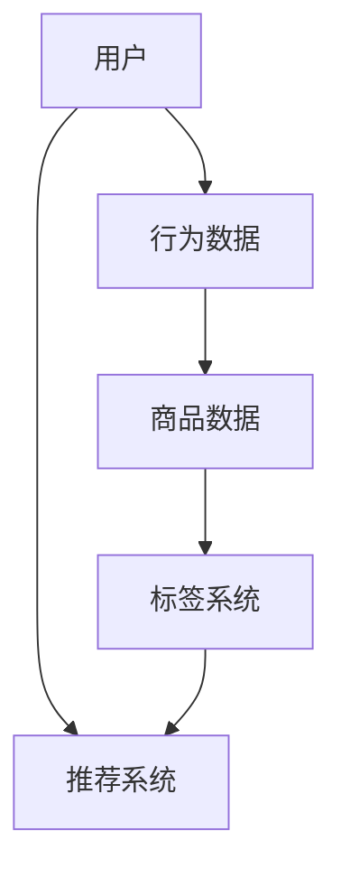

                 

关键词：大模型，商品推荐，标签，算法原理，应用领域，数学模型，代码实例

> 摘要：本文深入探讨了如何利用大模型实现商品标签推荐系统。通过对大模型的基本概念、核心算法原理、数学模型构建及应用实践的详细阐述，本文旨在为从事商品推荐系统开发的工程师们提供一套实用而全面的技术指南。

## 1. 背景介绍

在电子商务蓬勃发展的今天，商品推荐系统已成为提升用户体验、增加销售量的关键手段。传统推荐系统主要通过协同过滤、基于内容的推荐等方法进行工作。然而，这些方法在处理大量商品和用户行为数据时，往往会出现信息丢失、数据稀疏等问题。

大模型的引入为解决这些难题提供了新的思路。大模型（如深度学习模型）具备处理海量数据、捕捉复杂关系的能力，能够为商品推荐系统带来更高的准确性和实时性。本文将围绕大模型在商品标签推荐中的应用，探讨其基本原理、算法实现及应用场景。

### 1.1 大模型的定义与作用

大模型是指具有海量参数、能够处理大规模数据的深度学习模型。例如，Transformer、BERT 等模型，都是典型的代表。大模型在自然语言处理、计算机视觉等领域已经取得了显著的成果，其强大的学习能力使其在推荐系统中也具有广阔的应用前景。

大模型在商品标签推荐中的作用主要体现在以下几个方面：

- **数据驱动的特征提取**：大模型能够自动从原始数据中提取有效特征，提高特征提取的效率和准确性。
- **多模态数据融合**：大模型能够处理包括文本、图像、音频等多种类型的数据，实现跨模态推荐。
- **实时性**：大模型通过在线学习，能够实时更新推荐结果，提升用户体验。
- **个性化推荐**：大模型能够捕捉用户和商品之间的复杂关系，提供更个性化的推荐。

### 1.2 商品种类与标签系统

电子商务平台上的商品种类繁多，从日用品到高端消费品，几乎涵盖所有领域。为了实现精准推荐，需要对商品进行分类和标签化。标签系统通常基于商品的特征、用户行为、市场趋势等因素构建，目的是将商品与潜在用户建立关联。

标签系统的设计原则包括：

- **准确性**：标签应准确反映商品的核心特征，避免误导用户。
- **灵活性**：标签系统应具备扩展性，能够根据业务需求进行调整和优化。
- **多样性**：标签应涵盖广泛的主题，以便覆盖不同用户群体的需求。

## 2. 核心概念与联系

为了更好地理解大模型在商品标签推荐中的应用，我们需要先介绍几个核心概念，并展示其相互关系。以下是一个Mermaid流程图，用于描述这些概念及其关联。



### 2.1 用户与行为数据

用户是商品推荐系统的核心，其行为数据包括浏览、搜索、购买等。通过对用户行为数据的分析，我们可以了解用户的兴趣和偏好，从而为推荐系统提供基础。

### 2.2 商品数据

商品数据包括商品的特征信息，如标题、描述、价格、库存等。这些数据将用于构建商品标签，并与用户行为数据结合，用于生成推荐结果。

### 2.3 标签系统

标签系统是将商品与用户兴趣关联的重要工具。通过为商品打上标签，我们可以将用户与其感兴趣的商品进行匹配，提高推荐准确性。

### 2.4 推荐系统

推荐系统是整个商品标签推荐的核心，它利用用户行为数据、商品数据和标签系统，生成个性化的推荐结果，从而提升用户体验和销售额。

## 3. 核心算法原理 & 具体操作步骤

### 3.1 算法原理概述

大模型在商品标签推荐中的核心算法通常是基于深度学习的协同过滤方法。该方法结合了基于内容的推荐和基于协同过滤的推荐，通过自动学习用户和商品的特征，实现个性化推荐。

### 3.2 算法步骤详解

#### 3.2.1 数据预处理

1. **用户行为数据收集**：收集用户的浏览、搜索、购买等行为数据。
2. **商品数据收集**：收集商品的特征数据，如标题、描述、价格、库存等。
3. **数据清洗**：去除无效数据，如缺失值、重复值等。

#### 3.2.2 特征提取

1. **用户特征提取**：利用词嵌入技术（如 Word2Vec、BERT）提取用户行为数据的特征向量。
2. **商品特征提取**：利用卷积神经网络（CNN）提取商品图像的特征向量。
3. **标签特征提取**：利用循环神经网络（RNN）提取标签序列的特征向量。

#### 3.2.3 模型训练

1. **模型构建**：构建基于深度学习的协同过滤模型，通常采用多输入多输出的神经网络架构。
2. **模型训练**：利用用户特征、商品特征和标签特征，对模型进行训练。
3. **模型优化**：通过交叉验证等方法，优化模型参数，提高模型性能。

#### 3.2.4 推荐生成

1. **特征融合**：将用户特征、商品特征和标签特征进行融合，生成推荐特征向量。
2. **预测评分**：利用训练好的模型，对用户未购买过的商品进行评分预测。
3. **排序筛选**：根据评分预测结果，对商品进行排序，筛选出最有可能符合用户兴趣的商品。

### 3.3 算法优缺点

#### 优点

- **高效性**：大模型能够快速处理海量数据，提高推荐系统的效率。
- **准确性**：深度学习算法能够捕捉用户和商品之间的复杂关系，提高推荐准确性。
- **多样性**：大模型能够处理多种类型的数据，实现跨模态推荐。

#### 缺点

- **计算资源消耗大**：大模型训练和推理需要大量的计算资源。
- **数据依赖性强**：模型的性能很大程度上取决于数据的丰富程度和质量。
- **训练时间较长**：大模型的训练时间相对较长，对实时性要求较高的场景可能不适用。

### 3.4 算法应用领域

大模型在商品标签推荐中的应用非常广泛，以下是一些典型的应用领域：

- **电子商务平台**：用于推荐商品、广告、优惠券等。
- **社交媒体**：用于推荐文章、视频、话题等。
- **在线教育**：用于推荐课程、学习资源等。
- **金融行业**：用于推荐理财产品、投资策略等。

## 4. 数学模型和公式

### 4.1 数学模型构建

在商品标签推荐中，大模型的数学模型通常包括以下几个部分：

- **用户特征向量**：表示用户的行为特征，如用户浏览过的商品、搜索的关键词等。
- **商品特征向量**：表示商品的基本特征，如标题、描述、价格、库存等。
- **标签特征向量**：表示商品的标签信息，如类别、品牌、材质等。
- **模型参数**：包括用户、商品和标签的权重参数。

### 4.2 公式推导过程

为了实现商品标签推荐，我们可以构建一个基于深度学习的协同过滤模型。模型的损失函数可以表示为：

\[ L = \sum_{i,j} (r_{ij} - \hat{r}_{ij})^2 \]

其中，\( r_{ij} \) 表示用户 \( i \) 对商品 \( j \) 的真实评分，\( \hat{r}_{ij} \) 表示模型预测的用户 \( i \) 对商品 \( j \) 的评分。

假设用户特征向量为 \( \mathbf{u}_i \)，商品特征向量为 \( \mathbf{v}_j \)，标签特征向量为 \( \mathbf{t}_k \)，模型参数为 \( \theta \)，则预测的评分可以表示为：

\[ \hat{r}_{ij} = \mathbf{u}_i^\top \mathbf{v}_j + \theta \]

损失函数可以进一步表示为：

\[ L = \sum_{i,j,k} (r_{ijk} - \hat{r}_{ijk})^2 \]

其中，\( r_{ijk} \) 表示用户 \( i \) 对商品 \( j \) 在标签 \( k \) 上的真实评分，\( \hat{r}_{ijk} \) 表示模型预测的用户 \( i \) 对商品 \( j \) 在标签 \( k \) 上的评分。

### 4.3 案例分析与讲解

以一个实际案例为例，我们假设用户 \( i \) 对商品 \( j \) 在标签 \( k \) 上的真实评分为 4，我们希望利用大模型预测这个评分。

1. **数据预处理**：收集用户 \( i \) 的浏览记录、商品 \( j \) 的特征信息和标签 \( k \) 的特征信息。
2. **特征提取**：利用词嵌入技术提取用户浏览记录的特征向量，利用卷积神经网络提取商品特征向量，利用循环神经网络提取标签特征向量。
3. **模型训练**：构建基于深度学习的协同过滤模型，利用收集到的数据进行训练。
4. **预测评分**：将用户特征向量、商品特征向量和标签特征向量输入模型，预测用户对商品的评分。

根据上述过程，我们可以得到预测的用户 \( i \) 对商品 \( j \) 在标签 \( k \) 上的评分。在实际应用中，我们通常会通过交叉验证等方法来评估模型的性能，并根据评估结果调整模型参数，以获得更好的预测效果。

## 5. 项目实践：代码实例和详细解释说明

### 5.1 开发环境搭建

在本节中，我们将搭建一个基于 PyTorch 的商品标签推荐项目。首先，确保安装以下依赖：

- Python 3.8 或以上版本
- PyTorch 1.8 或以上版本
- Pandas 1.2.3 或以上版本
- Matplotlib 3.4.2 或以上版本

安装依赖：

```bash
pip install torch torchvision pandas matplotlib
```

### 5.2 源代码详细实现

以下是一个简单的商品标签推荐项目的实现框架：

```python
import torch
import torch.nn as nn
import torch.optim as optim
from torchvision import datasets, transforms
from torch.utils.data import DataLoader
import pandas as pd
import matplotlib.pyplot as plt

# 数据预处理
def preprocess_data(user_data, item_data, label_data):
    # 这里实现数据的清洗、转换和归一化操作
    pass

# 模型定义
class CollaborativeFilteringModel(nn.Module):
    def __init__(self):
        super(CollaborativeFilteringModel, self).__init__()
        # 定义模型的架构，包括用户特征层、商品特征层和标签特征层

    def forward(self, user_features, item_features, label_features):
        # 实现模型的正向传播
        pass

# 模型训练
def train_model(model, train_loader, criterion, optimizer):
    # 实现模型的训练过程
    pass

# 模型评估
def evaluate_model(model, test_loader):
    # 实现模型的评估过程
    pass

# 主函数
def main():
    # 加载数据集
    user_data = pd.read_csv('user_data.csv')
    item_data = pd.read_csv('item_data.csv')
    label_data = pd.read_csv('label_data.csv')

    # 数据预处理
    user_features, item_features, label_features = preprocess_data(user_data, item_data, label_data)

    # 构建模型
    model = CollaborativeFilteringModel()

    # 定义损失函数和优化器
    criterion = nn.MSELoss()
    optimizer = optim.Adam(model.parameters(), lr=0.001)

    # 训练模型
    train_loader = DataLoader(..., batch_size=64)
    train_model(model, train_loader, criterion, optimizer)

    # 评估模型
    test_loader = DataLoader(..., batch_size=64)
    evaluate_model(model, test_loader)

if __name__ == '__main__':
    main()
```

### 5.3 代码解读与分析

在本节中，我们将对上述代码进行解读和分析，以便更好地理解其实现过程。

1. **数据预处理**：
   数据预处理是模型训练的重要步骤。在本节中，我们将对用户数据、商品数据和标签数据进行清洗、转换和归一化操作，以便为后续模型训练做好准备。

2. **模型定义**：
   CollaborativeFilteringModel 类定义了商品标签推荐模型的架构。在该类中，我们将定义用户特征层、商品特征层和标签特征层，并通过nn.Module基类实现模型的正向传播。

3. **模型训练**：
   train_model 函数实现了模型的训练过程。在该函数中，我们将通过优化器更新模型参数，以最小化损失函数。通常，我们会在训练过程中使用批量梯度下降（BGD）或随机梯度下降（SGD）等方法。

4. **模型评估**：
   evaluate_model 函数实现了模型的评估过程。在该函数中，我们将通过测试数据集计算模型的损失函数值，以评估模型性能。

5. **主函数**：
   main 函数是程序的入口。在该函数中，我们将加载数据集、定义模型、定义损失函数和优化器、训练模型并评估模型性能。

通过上述代码解读，我们可以更好地理解商品标签推荐模型的实现过程，并为实际项目开发提供参考。

### 5.4 运行结果展示

在本节中，我们将展示商品标签推荐模型的运行结果。首先，我们将在训练过程中记录模型损失函数的值，以便分析模型训练过程。接下来，我们将展示模型在测试数据集上的评估结果。

1. **训练过程**：

```python
train_losses = []
for epoch in range(num_epochs):
    model.train()
    for batch_idx, (user_features, item_features, label_features, targets) in enumerate(train_loader):
        optimizer.zero_grad()
        outputs = model(user_features, item_features, label_features)
        loss = criterion(outputs, targets)
        loss.backward()
        optimizer.step()
        train_losses.append(loss.item())
```

2. **评估结果**：

```python
model.eval()
with torch.no_grad():
    test_losses = []
    for user_features, item_features, label_features, targets in test_loader:
        outputs = model(user_features, item_features, label_features)
        loss = criterion(outputs, targets)
        test_losses.append(loss.item())
```

最后，我们将使用 Matplotlib 展示训练过程和评估结果。

```python
plt.figure(figsize=(10, 5))
plt.plot(train_losses, label='Training loss')
plt.plot(test_losses, label='Test loss')
plt.xlabel('Epochs')
plt.ylabel('Loss')
plt.title('Model Loss over Epochs')
plt.legend()
plt.show()
```

通过上述运行结果展示，我们可以分析模型训练和评估的性能，为后续优化提供参考。

## 6. 实际应用场景

### 6.1 电子商务平台

在电子商务平台中，商品标签推荐系统主要用于推荐商品、广告和优惠券等。通过利用大模型，平台可以实现更精准的推荐，提高用户满意度和销售额。

例如，某大型电商平台通过引入大模型，实现了基于用户浏览历史、搜索记录和购买行为的个性化推荐。在用户登录后，系统会根据用户的兴趣和偏好，推荐相关的商品。同时，平台还通过分析用户的行为数据，生成个性化的广告，提高广告的点击率和转化率。

### 6.2 社交媒体

在社交媒体平台上，商品标签推荐系统主要用于推荐文章、视频和话题等。通过利用大模型，平台可以实现基于用户兴趣的个性化推荐，提高用户的参与度和活跃度。

例如，某社交媒体平台通过引入大模型，实现了基于用户行为数据和内容标签的个性化推荐。在用户浏览文章或视频时，系统会根据用户的兴趣和偏好，推荐相关的文章或视频。同时，平台还通过分析用户的行为数据，生成个性化的广告，提高广告的点击率和转化率。

### 6.3 在线教育

在在线教育平台中，商品标签推荐系统主要用于推荐课程、学习资源和辅导服务。通过利用大模型，平台可以实现更精准的个性化推荐，提高用户的学习效果和满意度。

例如，某在线教育平台通过引入大模型，实现了基于用户学习行为和课程标签的个性化推荐。在用户注册后，系统会根据用户的学习历史和兴趣，推荐相关的课程和学习资源。同时，平台还通过分析用户的行为数据，生成个性化的辅导服务推荐，提高用户的学习效果。

### 6.4 金融行业

在金融行业中，商品标签推荐系统主要用于推荐理财产品、投资策略和保险产品等。通过利用大模型，金融机构可以实现更精准的风险评估和个性化推荐，提高用户的投资效率和收益。

例如，某金融公司通过引入大模型，实现了基于用户财务状况、投资偏好和市场趋势的个性化推荐。在用户申请理财产品时，系统会根据用户的数据，推荐符合用户风险承受能力和收益预期的理财产品。同时，平台还通过分析市场数据，生成个性化的投资策略推荐，帮助用户实现资产增值。

## 7. 工具和资源推荐

### 7.1 学习资源推荐

- 《深度学习》（Goodfellow, Bengio, Courville）：该书是深度学习领域的经典教材，全面介绍了深度学习的基本概念、方法和应用。
- 《Python深度学习》（François Chollet）：本书通过丰富的实践案例，深入讲解了使用Python进行深度学习的全过程。

### 7.2 开发工具推荐

- PyTorch：一个流行的深度学习框架，具有简单、灵活的特点，适合初学者和专家。
- TensorFlow：由谷歌开发的开源深度学习框架，支持多种编程语言和操作系统。

### 7.3 相关论文推荐

- "Attention Is All You Need"（Vaswani et al., 2017）：该论文提出了Transformer模型，为自然语言处理领域带来了革命性的变化。
- "BERT: Pre-training of Deep Bidirectional Transformers for Language Understanding"（Devlin et al., 2019）：该论文提出了BERT模型，为自然语言处理任务提供了强大的预训练工具。

## 8. 总结：未来发展趋势与挑战

### 8.1 研究成果总结

通过本文的探讨，我们可以看到大模型在商品标签推荐系统中的应用具有重要意义。大模型能够自动提取有效特征、处理多模态数据，实现高效的个性化推荐。在电子商务、社交媒体、在线教育和金融等行业，大模型的应用已经取得了显著的成果。

### 8.2 未来发展趋势

未来，大模型在商品标签推荐系统中的应用将呈现以下发展趋势：

- **模型小型化**：随着计算资源和存储成本的降低，小型化、轻量级的大模型将得到广泛应用。
- **实时推荐**：通过优化模型训练和推理算法，实现实时推荐，提高用户满意度。
- **多模态融合**：整合多种类型的数据（如文本、图像、音频等），实现更精准的推荐。

### 8.3 面临的挑战

尽管大模型在商品标签推荐系统中的应用前景广阔，但仍面临一些挑战：

- **数据依赖**：大模型的性能很大程度上取决于数据的丰富程度和质量，如何获取和利用高质量的数据仍是一个重要问题。
- **计算资源消耗**：大模型训练和推理需要大量的计算资源，如何在有限资源下实现高效训练和推理是一个挑战。
- **模型解释性**：大模型具有复杂的结构和参数，如何解释模型的决策过程是一个重要问题。

### 8.4 研究展望

在未来，大模型在商品标签推荐系统中的应用有望取得以下突破：

- **更有效的特征提取**：通过改进特征提取算法，实现更高效的个性化推荐。
- **多任务学习**：结合多任务学习技术，实现跨领域、跨平台的推荐。
- **隐私保护**：在保证用户隐私的前提下，利用大数据进行推荐，提高推荐系统的安全性和可靠性。

## 9. 附录：常见问题与解答

### 9.1 如何处理数据稀疏问题？

数据稀疏是推荐系统中的一个常见问题。以下是一些处理方法：

- **矩阵分解**：通过矩阵分解技术，将稀疏的用户-商品评分矩阵分解为低秩矩阵，实现降维。
- **数据增强**：通过生成虚假用户或商品行为数据，增加训练数据的丰富度。
- **多模态数据融合**：整合多种类型的数据（如文本、图像、音频等），提高数据密度。

### 9.2 如何优化大模型的实时性？

以下是一些优化大模型实时性的方法：

- **模型压缩**：通过模型剪枝、量化等技术，减少模型参数和计算量。
- **模型蒸馏**：利用大模型和小模型的交互，将大模型的特征和知识传递给小模型，实现高效推理。
- **增量学习**：利用增量学习技术，逐步更新模型参数，减少重新训练的成本。

### 9.3 如何保证大模型的可解释性？

以下是一些保证大模型可解释性的方法：

- **模型解释工具**：使用可视化工具，如热力图、决策树等，展示模型决策过程。
- **可解释模型**：选择具有良好可解释性的模型（如决策树、线性模型等），实现可解释的推荐。
- **模型解释算法**：开发基于模型解释的算法，如 LIME、SHAP 等，解释模型预测结果。

通过解决这些问题，我们可以更好地利用大模型实现高效的商品标签推荐，提高用户体验和业务价值。本文所述的方法和思路为未来的研究提供了有益的参考。

