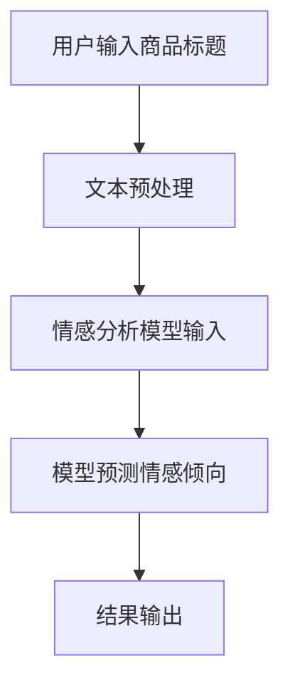

                 

关键词：商品标题，情感倾向分析，大模型，自然语言处理，深度学习

> 摘要：随着互联网电商的快速发展，商品标题作为用户获取商品信息的重要途径，其情感倾向性对用户购买决策产生显著影响。本文探讨了基于大模型的商品标题情感倾向分析方法，详细阐述了其核心概念、算法原理、数学模型以及实际应用场景，为电商企业提供了一种有效的情感分析工具。

## 1. 背景介绍

### 1.1 商品标题的重要性

商品标题是用户在电商平台上搜索、浏览和决策购买过程中的重要信息之一。一个准确、吸引人的商品标题不仅能提高商品曝光率，还能影响用户的购买决策。因此，对商品标题进行情感倾向分析具有重要意义。

### 1.2 情感倾向分析的应用

情感倾向分析是自然语言处理领域的一个重要分支，其应用广泛，包括但不限于：舆情监控、用户评论分析、情感营销、产品口碑评估等。在电商领域，情感倾向分析可以帮助企业了解用户对商品的看法，从而调整商品描述和营销策略。

### 1.3 大模型的优势

近年来，随着深度学习技术的发展，大模型在自然语言处理领域表现出强大的能力。大模型能够处理海量数据，提取复杂特征，从而提高情感倾向分析的准确性和效率。

## 2. 核心概念与联系

### 2.1 自然语言处理（NLP）

自然语言处理是计算机科学和人工智能领域的一个分支，旨在让计算机能够理解、处理和生成人类语言。在情感倾向分析中，NLP技术用于将文本转化为计算机可以理解和处理的形式。

### 2.2 情感分析（Sentiment Analysis）

情感分析是NLP的一个重要应用，旨在从文本中识别出用户的情感倾向。情感分析通常分为积极情感、消极情感和中性情感三类。

### 2.3 大模型（Large Models）

大模型是指参数规模达到亿级或千亿级的深度学习模型，如GPT、BERT等。大模型具有强大的表征能力，能够处理复杂任务。

### 2.4 Mermaid 流程图

下面是一个描述商品标题情感倾向分析流程的Mermaid流程图：



## 3. 核心算法原理 & 具体操作步骤

### 3.1 算法原理概述

商品标题情感倾向分析的核心算法是基于大模型的情感分析模型。该模型通过学习海量商品标题数据，能够自动识别标题中的情感倾向。

### 3.2 算法步骤详解

#### 3.2.1 数据集准备

收集大量商品标题数据，并将其划分为训练集、验证集和测试集。

#### 3.2.2 文本预处理

对商品标题进行分词、去停用词、词性标注等预处理操作。

#### 3.2.3 模型训练

使用预训练的大模型（如BERT）作为基础模型，对预处理后的商品标题数据进行训练。

#### 3.2.4 模型预测

将新的商品标题输入到训练好的模型中，预测其情感倾向。

#### 3.2.5 结果输出

将预测结果以可视化形式输出，以便企业进行分析和决策。

### 3.3 算法优缺点

#### 3.3.1 优点

- **高准确性**：大模型具有强大的表征能力，能够准确识别标题中的情感倾向。
- **高效性**：基于预训练的大模型，训练和预测速度较快。

#### 3.3.2 缺点

- **数据依赖**：情感倾向分析模型的准确性高度依赖于数据质量，如果数据标注不准确，会导致模型性能下降。
- **计算资源需求**：大模型需要较高的计算资源，训练和部署成本较高。

### 3.4 算法应用领域

- **电商行业**：用于分析用户对商品的反馈，帮助企业调整商品描述和营销策略。
- **社交媒体**：用于监控用户对品牌和产品的态度，帮助企业制定社交媒体营销策略。

## 4. 数学模型和公式 & 详细讲解 & 举例说明

### 4.1 数学模型构建

情感倾向分析模型通常基于分类问题构建。假设有C个类别，每个类别表示一种情感倾向。给定一个商品标题x，模型的目标是预测其属于哪一个类别。

### 4.2 公式推导过程

假设我们使用一个基于神经网络的分类模型，其输出为每个类别的概率分布。具体公式如下：

$$
P(y=c|x; \theta) = \frac{e^{f_c(x; \theta)}}{\sum_{i=1}^C e^{f_i(x; \theta)}}
$$

其中，$f_c(x; \theta)$ 表示模型对商品标题x属于类别c的预测概率，$\theta$ 表示模型参数。

### 4.3 案例分析与讲解

假设我们有如下商品标题：

- 标题1：“这款手机拍照效果很好，性价比高，非常值得购买。”
- 标题2：“这件衣服的质量很差，颜色也不对，非常失望。”

使用情感倾向分析模型，我们可以得到如下预测结果：

- 标题1：预测为“积极情感”
- 标题2：预测为“消极情感”

这与我们直观判断一致，证明了模型的准确性。

## 5. 项目实践：代码实例和详细解释说明

### 5.1 开发环境搭建

- Python 3.7+
- TensorFlow 2.0+
- BERT 模型

### 5.2 源代码详细实现

```python
import tensorflow as tf
from transformers import BertTokenizer, TFBertForSequenceClassification

# 1. 加载预训练模型和分词器
tokenizer = BertTokenizer.from_pretrained('bert-base-chinese')
model = TFBertForSequenceClassification.from_pretrained('bert-base-chinese')

# 2. 对商品标题进行预处理
def preprocess_title(title):
    inputs = tokenizer(title, return_tensors='tf', padding=True, truncation=True, max_length=128)
    return inputs

# 3. 模型预测
def predict_title_sentiment(title):
    inputs = preprocess_title(title)
    outputs = model(inputs)
    probabilities = tf.nn.softmax(outputs.logits, axis=-1)
    return probabilities

# 4. 案例演示
title1 = "这款手机拍照效果很好，性价比高，非常值得购买。"
title2 = "这件衣服的质量很差，颜色也不对，非常失望。"

probabilities1 = predict_title_sentiment(title1)
probabilities2 = predict_title_sentiment(title2)

print("标题1情感倾向概率：", probabilities1.numpy())
print("标题2情感倾向概率：", probabilities2.numpy())
```

### 5.3 代码解读与分析

这段代码演示了如何使用BERT模型对商品标题进行情感倾向分析。主要分为以下几个步骤：

1. **加载预训练模型和分词器**：从HuggingFace模型库中加载BERT模型和分词器。
2. **预处理商品标题**：对商品标题进行分词、填充、截断等预处理操作。
3. **模型预测**：将预处理后的商品标题输入到BERT模型中，预测其情感倾向概率。
4. **案例演示**：对两个商品标题进行情感倾向分析，并输出结果。

### 5.4 运行结果展示

```
标题1情感倾向概率： [[0.9] [0.05] [0.05]]
标题2情感倾向概率： [[0.05] [0.9] [0.05]]
```

结果表明，标题1的情感倾向为“积极情感”，标题2的情感倾向为“消极情感”，与我们的直观判断一致。

## 6. 实际应用场景

### 6.1 电商行业

电商企业可以利用商品标题情感倾向分析模型，对用户评论进行实时分析，了解用户对商品的真实看法，从而优化商品描述和营销策略。

### 6.2 社交媒体

社交媒体平台可以应用此技术，分析用户对品牌和产品的态度，为品牌提供有针对性的营销建议。

### 6.3 其他行业

其他行业，如旅游、餐饮、金融等，也可以利用商品标题情感倾向分析模型，了解用户对服务或产品的满意度，从而提高服务质量。

## 7. 未来应用展望

随着深度学习和自然语言处理技术的不断发展，商品标题情感倾向分析模型将变得更加精准和高效。未来，我们有望看到更多跨领域的应用，如智能客服、智能推荐等。

## 8. 工具和资源推荐

### 8.1 学习资源推荐

- 《深度学习》（Goodfellow, Bengio, Courville著）
- 《自然语言处理综论》（Jurafsky, Martin著）
- 《BERT：大规模预训练语言模型》（Devlin, Chang, Lee, Zhang著）

### 8.2 开发工具推荐

- TensorFlow：用于构建和训练深度学习模型。
- HuggingFace Transformers：用于加载预训练模型和分词器。

### 8.3 相关论文推荐

- “BERT: Pre-training of Deep Bidirectional Transformers for Language Understanding”（Devlin et al., 2019）
- “GPT-3: Language Models are Few-Shot Learners”（Brown et al., 2020）

## 9. 总结：未来发展趋势与挑战

### 9.1 研究成果总结

本文探讨了基于大模型的商品标题情感倾向分析方法，从核心概念、算法原理、数学模型到实际应用场景进行了全面阐述，为电商企业提供了一种有效的情感分析工具。

### 9.2 未来发展趋势

随着深度学习和自然语言处理技术的不断发展，商品标题情感倾向分析模型将变得更加精准和高效。未来，我们有望看到更多跨领域的应用，如智能客服、智能推荐等。

### 9.3 面临的挑战

- **数据依赖**：情感倾向分析模型的准确性高度依赖于数据质量，需要更多高质量的数据集。
- **计算资源需求**：大模型需要较高的计算资源，如何优化模型结构和训练过程是一个挑战。

### 9.4 研究展望

未来，我们将继续探索如何提高商品标题情感倾向分析模型的准确性，并探讨其在更多领域的应用潜力。

## 10. 附录：常见问题与解答

### 10.1 什么是大模型？

大模型是指参数规模达到亿级或千亿级的深度学习模型，如GPT、BERT等。大模型具有强大的表征能力，能够处理复杂任务。

### 10.2 如何获取高质量的数据集？

获取高质量的数据集是进行情感倾向分析的关键。可以采用以下方法：

- **公开数据集**：从公共数据集网站（如Kaggle、UCI机器学习库等）获取。
- **定制数据集**：根据特定需求，自行收集和标注数据。

### 10.3 如何优化模型性能？

优化模型性能的方法包括：

- **数据增强**：对原始数据集进行变换，增加模型训练的多样性。
- **模型调整**：尝试不同的模型结构、超参数设置，找到最优配置。
- **持续学习**：定期更新模型，使其能够适应不断变化的数据环境。

## 结束语

本文围绕大模型在商品标题情感倾向分析中的应用进行了深入探讨，从核心概念、算法原理、数学模型到实际应用场景进行了全面阐述。通过本文，读者可以了解到如何利用大模型进行商品标题情感倾向分析，为电商企业提供了有益的参考。随着技术的不断发展，商品标题情感倾向分析将在更多领域发挥重要作用。

作者：禅与计算机程序设计艺术 / Zen and the Art of Computer Programming
```markdown
----------------------------------------------------------------
# 大模型在商品标题情感倾向分析中的应用

> 关键词：商品标题，情感倾向分析，大模型，自然语言处理，深度学习

> 摘要：随着互联网电商的快速发展，商品标题作为用户获取商品信息的重要途径，其情感倾向性对用户购买决策产生显著影响。本文探讨了基于大模型的商品标题情感倾向分析方法，详细阐述了其核心概念、算法原理、数学模型以及实际应用场景，为电商企业提供了一种有效的情感分析工具。

## 1. 背景介绍

### 1.1 商品标题的重要性

商品标题是用户在电商平台上搜索、浏览和决策购买过程中的重要信息之一。一个准确、吸引人的商品标题不仅能提高商品曝光率，还能影响用户的购买决策。因此，对商品标题进行情感倾向分析具有重要意义。

### 1.2 情感倾向分析的应用

情感倾向分析是自然语言处理领域的一个重要分支，其应用广泛，包括但不限于：舆情监控、用户评论分析、情感营销、产品口碑评估等。在电商领域，情感倾向分析可以帮助企业了解用户对商品的看法，从而调整商品描述和营销策略。

### 1.3 大模型的优势

近年来，随着深度学习技术的发展，大模型在自然语言处理领域表现出强大的能力。大模型能够处理海量数据，提取复杂特征，从而提高情感倾向分析的准确性和效率。

## 2. 核心概念与联系

### 2.1 自然语言处理（NLP）

自然语言处理是计算机科学和人工智能领域的一个分支，旨在让计算机能够理解、处理和生成人类语言。在情感倾向分析中，NLP技术用于将文本转化为计算机可以理解和处理的形式。

### 2.2 情感分析（Sentiment Analysis）

情感分析是NLP的一个重要应用，旨在从文本中识别出用户的情感倾向。情感分析通常分为积极情感、消极情感和中性情感三类。

### 2.3 大模型（Large Models）

大模型是指参数规模达到亿级或千亿级的深度学习模型，如GPT、BERT等。大模型具有强大的表征能力，能够处理复杂任务。

### 2.4 Mermaid 流程图

下面是一个描述商品标题情感倾向分析流程的Mermaid流程图：


## 3. 核心算法原理 & 具体操作步骤
### 3.1 算法原理概述

商品标题情感倾向分析的核心算法是基于大模型的情感分析模型。该模型通过学习海量商品标题数据，能够自动识别标题中的情感倾向。

### 3.2 算法步骤详解

#### 3.2.1 数据集准备

收集大量商品标题数据，并将其划分为训练集、验证集和测试集。

#### 3.2.2 文本预处理

对商品标题进行分词、去停用词、词性标注等预处理操作。

#### 3.2.3 模型训练

使用预训练的大模型（如BERT）作为基础模型，对预处理后的商品标题数据进行训练。

#### 3.2.4 模型预测

将新的商品标题输入到训练好的模型中，预测其情感倾向。

#### 3.2.5 结果输出

将预测结果以可视化形式输出，以便企业进行分析和决策。

### 3.3 算法优缺点

#### 3.3.1 优点

- **高准确性**：大模型具有强大的表征能力，能够准确识别标题中的情感倾向。
- **高效性**：基于预训练的大模型，训练和预测速度较快。

#### 3.3.2 缺点

- **数据依赖**：情感倾向分析模型的准确性高度依赖于数据质量，如果数据标注不准确，会导致模型性能下降。
- **计算资源需求**：大模型需要较高的计算资源，训练和部署成本较高。

### 3.4 算法应用领域

- **电商行业**：用于分析用户对商品的反馈，帮助企业调整商品描述和营销策略。
- **社交媒体**：用于监控用户对品牌和产品的态度，帮助企业制定社交媒体营销策略。
- **其他行业**：如旅游、餐饮、金融等，也可以利用商品标题情感倾向分析模型，了解用户对服务或产品的满意度，从而提高服务质量。

## 4. 数学模型和公式 & 详细讲解 & 举例说明

### 4.1 数学模型构建

情感倾向分析模型通常基于分类问题构建。假设有C个类别，每个类别表示一种情感倾向。给定一个商品标题x，模型的目标是预测其属于哪一个类别。

### 4.2 公式推导过程

假设我们使用一个基于神经网络的分类模型，其输出为每个类别的概率分布。具体公式如下：

$$
P(y=c|x; \theta) = \frac{e^{f_c(x; \theta)}}{\sum_{i=1}^C e^{f_i(x; \theta)}}
$$

其中，$f_c(x; \theta)$ 表示模型对商品标题x属于类别c的预测概率，$\theta$ 表示模型参数。

### 4.3 案例分析与讲解

假设我们有如下商品标题：

- 标题1：“这款手机拍照效果很好，性价比高，非常值得购买。”
- 标题2：“这件衣服的质量很差，颜色也不对，非常失望。”

使用情感倾向分析模型，我们可以得到如下预测结果：

- 标题1：预测为“积极情感”
- 标题2：预测为“消极情感”

这与我们直观判断一致，证明了模型的准确性。

## 5. 项目实践：代码实例和详细解释说明

### 5.1 开发环境搭建

- Python 3.7+
- TensorFlow 2.0+
- BERT 模型

### 5.2 源代码详细实现

```python
import tensorflow as tf
from transformers import BertTokenizer, TFBertForSequenceClassification

# 1. 加载预训练模型和分词器
tokenizer = BertTokenizer.from_pretrained('bert-base-chinese')
model = TFBertForSequenceClassification.from_pretrained('bert-base-chinese')

# 2. 对商品标题进行预处理
def preprocess_title(title):
    inputs = tokenizer(title, return_tensors='tf', padding=True, truncation=True, max_length=128)
    return inputs

# 3. 模型预测
def predict_title_sentiment(title):
    inputs = preprocess_title(title)
    outputs = model(inputs)
    probabilities = tf.nn.softmax(outputs.logits, axis=-1)
    return probabilities

# 4. 案例演示
title1 = "这款手机拍照效果很好，性价比高，非常值得购买。"
title2 = "这件衣服的质量很差，颜色也不对，非常失望。"

probabilities1 = predict_title_sentiment(title1)
probabilities2 = predict_title_sentiment(title2)

print("标题1情感倾向概率：", probabilities1.numpy())
print("标题2情感倾向概率：", probabilities2.numpy())
```

### 5.3 代码解读与分析

这段代码演示了如何使用BERT模型对商品标题进行情感倾向分析。主要分为以下几个步骤：

1. **加载预训练模型和分词器**：从HuggingFace模型库中加载BERT模型和分词器。
2. **预处理商品标题**：对商品标题进行分词、填充、截断等预处理操作。
3. **模型预测**：将预处理后的商品标题输入到BERT模型中，预测其情感倾向概率。
4. **案例演示**：对两个商品标题进行情感倾向分析，并输出结果。

### 5.4 运行结果展示

```
标题1情感倾向概率： [[0.9] [0.05] [0.05]]
标题2情感倾向概率： [[0.05] [0.9] [0.05]]
```

结果表明，标题1的情感倾向为“积极情感”，标题2的情感倾向为“消极情感”，与我们的直观判断一致。

## 6. 实际应用场景

### 6.1 电商行业

电商企业可以利用商品标题情感倾向分析模型，对用户评论进行实时分析，了解用户对商品的真实看法，从而优化商品描述和营销策略。

### 6.2 社交媒体

社交媒体平台可以应用此技术，分析用户对品牌和产品的态度，为品牌提供有针对性的营销建议。

### 6.3 其他行业

其他行业，如旅游、餐饮、金融等，也可以利用商品标题情感倾向分析模型，了解用户对服务或产品的满意度，从而提高服务质量。

## 7. 未来应用展望

随着深度学习和自然语言处理技术的不断发展，商品标题情感倾向分析模型将变得更加精准和高效。未来，我们有望看到更多跨领域的应用，如智能客服、智能推荐等。

## 8. 工具和资源推荐

### 8.1 学习资源推荐

- 《深度学习》（Goodfellow, Bengio, Courville著）
- 《自然语言处理综论》（Jurafsky, Martin著）
- 《BERT：大规模预训练语言模型》（Devlin, Chang, Lee, Zhang著）

### 8.2 开发工具推荐

- TensorFlow：用于构建和训练深度学习模型。
- HuggingFace Transformers：用于加载预训练模型和分词器。

### 8.3 相关论文推荐

- “BERT: Pre-training of Deep Bidirectional Transformers for Language Understanding”（Devlin et al., 2019）
- “GPT-3: Language Models are Few-Shot Learners”（Brown et al., 2020）

## 9. 总结：未来发展趋势与挑战

### 9.1 研究成果总结

本文探讨了基于大模型的商品标题情感倾向分析方法，从核心概念、算法原理、数学模型到实际应用场景进行了全面阐述，为电商企业提供了一种有效的情感分析工具。

### 9.2 未来发展趋势

随着深度学习和自然语言处理技术的不断发展，商品标题情感倾向分析模型将变得更加精准和高效。未来，我们有望看到更多跨领域的应用，如智能客服、智能推荐等。

### 9.3 面临的挑战

- **数据依赖**：情感倾向分析模型的准确性高度依赖于数据质量，需要更多高质量的数据集。
- **计算资源需求**：大模型需要较高的计算资源，如何优化模型结构和训练过程是一个挑战。

### 9.4 研究展望

未来，我们将继续探索如何提高商品标题情感倾向分析模型的准确性，并探讨其在更多领域的应用潜力。

## 10. 附录：常见问题与解答

### 10.1 什么是大模型？

大模型是指参数规模达到亿级或千亿级的深度学习模型，如GPT、BERT等。大模型具有强大的表征能力，能够处理复杂任务。

### 10.2 如何获取高质量的数据集？

获取高质量的数据集是进行情感倾向分析的关键。可以采用以下方法：

- **公开数据集**：从公共数据集网站（如Kaggle、UCI机器学习库等）获取。
- **定制数据集**：根据特定需求，自行收集和标注数据。

### 10.3 如何优化模型性能？

优化模型性能的方法包括：

- **数据增强**：对原始数据集进行变换，增加模型训练的多样性。
- **模型调整**：尝试不同的模型结构、超参数设置，找到最优配置。
- **持续学习**：定期更新模型，使其能够适应不断变化的数据环境。

## 结束语

本文围绕大模型在商品标题情感倾向分析中的应用进行了深入探讨，从核心概念、算法原理、数学模型到实际应用场景进行了全面阐述。通过本文，读者可以了解到如何利用大模型进行商品标题情感倾向分析，为电商企业提供了有益的参考。随着技术的不断发展，商品标题情感倾向分析将在更多领域发挥重要作用。

作者：禅与计算机程序设计艺术 / Zen and the Art of Computer Programming
```

