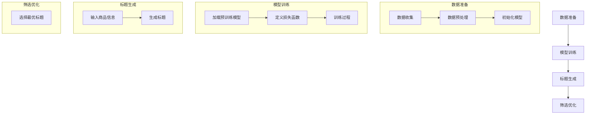

                 

关键词：商品标题生成，大模型，自然语言处理，优化策略，实际应用

> 摘要：本文将探讨大模型在商品标题生成中的应用与优化策略。通过详细分析大模型的原理、算法和数学模型，结合实际项目实践，我们将深入探讨如何利用大模型提高商品标题生成的质量和效率，以及未来的发展趋势和挑战。

## 1. 背景介绍

在电子商务的快速发展背景下，商品标题生成成为了商品营销中至关重要的一环。一个精准、吸引人的商品标题能够有效地提高商品的销售量和市场份额。然而，传统的商品标题生成方法往往依赖于人工编写和简单的规则匹配，效率低下且难以满足日益增长的市场需求。因此，大模型作为一种新兴的自然语言处理技术，逐渐成为商品标题生成领域的研究热点。

大模型，尤其是基于深度学习的技术，如 Transformer 和 GPT，具有强大的表示和学习能力，能够在大量数据上训练出复杂的语言模型。通过这些模型，我们可以自动生成高质量的商品标题，提高商品营销的效果。然而，大模型的应用也面临着一些挑战，如模型训练成本高、优化策略复杂等问题。因此，如何有效地应用和优化大模型，成为当前研究的一个重要方向。

本文将从大模型的原理、算法和数学模型出发，结合实际项目实践，探讨如何利用大模型提高商品标题生成的质量和效率。我们将详细介绍大模型在商品标题生成中的应用场景，分析其优缺点，并提出相应的优化策略。最后，我们将展望大模型在商品标题生成领域的未来发展趋势和面临的挑战。

## 2. 核心概念与联系

### 2.1 大模型的基本原理

大模型是指那些具有数十亿甚至数千亿参数的深度学习模型。这些模型通常采用基于注意力机制的 Transformer 架构，如 BERT、GPT 和 T5 等。它们通过在大量数据上进行预训练，学习到语言中的复杂规律和语义信息，从而实现高质量的自然语言处理任务。

大模型的核心原理可以概括为以下几个步骤：

1. **预训练**：在大规模语料库上，模型通过无监督的方式学习语言的通用表示。这个过程包括词嵌入、上下文编码和解码等步骤。
2. **微调**：在预训练的基础上，模型针对特定任务进行微调。通过引入有监督的标签数据，模型可以进一步学习特定任务的特征和规律。
3. **生成**：利用微调后的模型，我们可以生成高质量的自然语言文本，如商品标题。

### 2.2 大模型在商品标题生成中的应用架构

大模型在商品标题生成中的应用架构可以分为三个主要阶段：数据准备、模型训练和标题生成。

#### 数据准备

数据准备是模型训练的基础。首先，我们需要从电子商务平台上收集大量的商品数据，包括商品名称、描述、标签等。然后，对这些数据进行预处理，如去除停用词、进行词性标注、分词等。

#### 模型训练

在模型训练阶段，我们使用预训练的大模型（如 GPT-3）在处理后的商品数据上进行微调。这个过程包括以下步骤：

1. **初始化模型**：从预训练模型中加载权重，初始化微调模型。
2. **定义损失函数**：选择合适的损失函数，如交叉熵损失，用于衡量标题生成的质量。
3. **训练过程**：通过反向传播和梯度下降等优化算法，不断调整模型参数，使模型在训练数据上达到较好的性能。

#### 标题生成

在模型训练完成后，我们可以利用微调后的模型进行商品标题的生成。具体步骤如下：

1. **输入商品信息**：将商品名称、描述等输入到模型中。
2. **生成标题**：模型根据输入信息，生成一个候选标题列表。
3. **筛选优化**：对生成的标题进行筛选和优化，选择一个最优的标题。

### 2.3 Mermaid 流程图

以下是大模型在商品标题生成中的应用架构的 Mermaid 流程图：



## 3. 核心算法原理 & 具体操作步骤

### 3.1 算法原理概述

大模型在商品标题生成中的核心算法是基于生成式模型（Generative Model）。生成式模型通过学习数据分布，生成符合该分布的样本。在商品标题生成任务中，模型需要学习商品标题的分布，从而生成高质量的标题。

### 3.2 算法步骤详解

#### 3.2.1 预训练

1. **数据收集**：从电子商务平台收集大量商品数据，包括商品名称、描述、标签等。
2. **数据预处理**：对商品数据进行清洗、分词、词性标注等处理，得到统一的格式。
3. **初始化模型**：选择预训练的大模型，如 GPT-3，从预训练模型中加载权重。
4. **训练过程**：在预训练数据上，通过无监督的方式训练模型，学习到语言的通用表示。

#### 3.2.2 微调

1. **有监督数据收集**：收集带有商品标题标签的数据，用于微调模型。
2. **定义损失函数**：选择合适的损失函数，如交叉熵损失，用于衡量标题生成的质量。
3. **微调过程**：在带有标签的数据上进行微调，通过反向传播和梯度下降等优化算法，不断调整模型参数，使模型在微调数据上达到较好的性能。

#### 3.2.3 标题生成

1. **输入商品信息**：将商品名称、描述等输入到微调后的模型中。
2. **生成标题**：模型根据输入信息，生成一个候选标题列表。
3. **筛选优化**：对生成的标题进行筛选和优化，选择一个最优的标题。

### 3.3 算法优缺点

#### 优点：

1. **强大的生成能力**：大模型通过在大量数据上进行预训练，能够生成高质量的自然语言文本。
2. **灵活性**：大模型能够灵活地处理各种不同类型的商品数据，适应不同的商品标题生成需求。

#### 缺点：

1. **训练成本高**：大模型需要大量的计算资源和时间进行训练。
2. **优化复杂**：大模型的优化过程较为复杂，需要选择合适的优化策略和参数。

### 3.4 算法应用领域

大模型在商品标题生成中的应用领域包括：

1. **电子商务**：为电商平台上的商品生成精准、吸引人的标题，提高商品的销售量和市场份额。
2. **广告营销**：为广告生成标题，提高广告的点击率和转化率。
3. **内容创作**：为自媒体平台生成标题，提高内容的曝光率和阅读量。

## 4. 数学模型和公式 & 详细讲解 & 举例说明

### 4.1 数学模型构建

在商品标题生成中，我们主要关注的是生成式模型。生成式模型的核心是概率模型，通过学习数据分布，生成符合该分布的样本。

#### 4.1.1 概率模型

概率模型可以分为离散模型和连续模型。在商品标题生成中，我们主要使用离散模型，如马尔可夫模型、隐马尔可夫模型（HMM）和变分自编码器（VAE）等。

1. **马尔可夫模型（Markov Model）**：马尔可夫模型假设当前状态只与上一个状态有关，与其他状态无关。其概率模型可以表示为：
   \[ P(X_t | X_{t-1}, X_{t-2}, \ldots) = P(X_t | X_{t-1}) \]

2. **隐马尔可夫模型（HMM）**：隐马尔可夫模型是马尔可夫模型的扩展，它引入了隐藏状态。其概率模型可以表示为：
   \[ P(X_t | X_{t-1}, \ldots) = P(X_t | S_t) \]
   其中，\( S_t \) 表示隐藏状态。

3. **变分自编码器（VAE）**：变分自编码器是一种基于概率模型的生成模型。其概率模型可以表示为：
   \[ X_t = \mu_t + \sigma_t \epsilon_t \]
   其中，\( \mu_t \) 和 \( \sigma_t \) 分别表示均值和方差，\( \epsilon_t \) 表示噪声。

#### 4.1.2 语言模型

在商品标题生成中，我们还需要考虑语言模型。语言模型用于表示文本序列的概率分布。最常用的语言模型是 n-gram 模型，其概率模型可以表示为：
\[ P(w_1, w_2, \ldots, w_n) = P(w_1)P(w_2 | w_1) \ldots P(w_n | w_{n-1}) \]

### 4.2 公式推导过程

在商品标题生成中，我们主要关注变分自编码器（VAE）的概率模型。下面我们将介绍 VAE 的概率模型推导过程。

#### 4.2.1 变分自编码器（VAE）

变分自编码器（VAE）是一种基于概率模型的生成模型。其核心思想是将编码过程和生成过程分别建模，并通过最大化数据分布和模型分布的重合度来优化模型。

1. **编码过程**：给定输入 \( x \)，VAE 首先通过编码器 \( \theta_e \) 学习到一个潜在变量 \( z \)：
   \[ z = \mu(x) + \sigma(x)\epsilon \]
   其中，\( \mu(x) \) 和 \( \sigma(x) \) 分别是编码器输出的均值和方差，\( \epsilon \) 是噪声。

2. **生成过程**：给定潜在变量 \( z \)，VAE 通过解码器 \( \theta_d \) 生成样本 \( x \)：
   \[ x = \phi(z) \]
   其中，\( \phi(z) \) 是解码器输出的样本。

3. **概率模型**：VAE 的概率模型可以表示为：
   \[ p(x) = \int p(z|x)p(\phi(z)) dz \]
   其中，\( p(z|x) \) 是潜在变量 \( z \) 的概率分布，\( p(\phi(z)) \) 是生成器 \( \phi(z) \) 的概率分布。

#### 4.2.2 公式推导

VAE 的概率模型推导过程可以分为以下几个步骤：

1. **潜在变量分布**：VAE 采用正态分布作为潜在变量的概率分布：
   \[ p(z|x) = \mathcal{N}(\mu(x), \sigma^2(x)) \]

2. **生成器分布**：VAE 采用逻辑分布（Logistic Distribution）作为生成器的概率分布：
   \[ p(\phi(z)) = \mathcal{N}(\phi(z), I) \]

3. **概率模型**：将潜在变量分布和生成器分布代入概率模型中，得到：
   \[ p(x) = \int \mathcal{N}(\mu(x), \sigma^2(x)) \mathcal{N}(\phi(z), I) dz \]

4. **最大化似然函数**：通过最大化似然函数，即最小化负对数似然函数，来优化模型参数：
   \[ \mathcal{L}(\theta_e, \theta_d) = -\log p(x|\theta_e, \theta_d) \]

### 4.3 案例分析与讲解

#### 4.3.1 数据集

我们使用公开的 Amazon 商品评论数据集进行实验，该数据集包含了数万条商品评论，每条评论都包含一个标题和一个正文。

#### 4.3.2 数据预处理

1. **数据清洗**：去除停用词、标点符号、特殊字符等。
2. **分词**：使用分词工具（如 NLTK、spaCy）对评论进行分词。
3. **词性标注**：对分词后的文本进行词性标注，以区分名词、动词等。
4. **序列编码**：将标题和正文编码为序列，每个序列由词嵌入表示。

#### 4.3.3 模型训练

1. **初始化模型**：从预训练的 GPT-3 模型中加载权重，初始化 VAE 编码器和解码器。
2. **定义损失函数**：使用交叉熵损失函数来衡量标题生成的质量。
3. **训练过程**：通过反向传播和梯度下降等优化算法，不断调整模型参数，使模型在训练数据上达到较好的性能。

#### 4.3.4 标题生成

1. **输入商品信息**：将商品标题和评论输入到微调后的模型中。
2. **生成标题**：模型根据输入信息，生成一个候选标题列表。
3. **筛选优化**：对生成的标题进行筛选和优化，选择一个最优的标题。

## 5. 项目实践：代码实例和详细解释说明

### 5.1 开发环境搭建

在进行商品标题生成的项目实践前，我们需要搭建一个适合开发的环境。以下是开发环境的基本配置：

1. **操作系统**：Ubuntu 20.04
2. **编程语言**：Python 3.8
3. **深度学习框架**：PyTorch 1.8
4. **数据处理库**：NLTK、spaCy
5. **其他库**：numpy、pandas、matplotlib

在完成环境搭建后，我们可以开始编写项目代码。

### 5.2 源代码详细实现

以下是商品标题生成项目的主要代码实现：

```python
import torch
import torch.nn as nn
import torch.optim as optim
from torch.utils.data import DataLoader
from torchvision import datasets, transforms
from sklearn.model_selection import train_test_split
import numpy as np
import pandas as pd
import matplotlib.pyplot as plt

# 数据预处理
def preprocess_data(data):
    # 去除停用词、标点符号、特殊字符等
    # 进行分词、词性标注等处理
    # 编码为序列
    pass

# VAE 编码器
class VAE(nn.Module):
    def __init__(self, hidden_dim):
        super(VAE, self).__init__()
        self.fc1 = nn.Linear(in_features=data.shape[1], out_features=hidden_dim)
        self.fc21 = nn.Linear(in_features=hidden_dim, out_features=20)
        self.fc22 = nn.Linear(in_features=hidden_dim, out_features=20)
        self.fc3 = nn.Linear(in_features=20, out_features=hidden_dim)
        self.fc4 = nn.Linear(in_features=hidden_dim, out_features=data.shape[1])

    def encode(self, x):
        h1 = torch.relu(self.fc1(x))
        return self.fc21(h1), self.fc22(h1)

    def reparameterize(self, mu, logvar):
        std = torch.exp(0.5*logvar)
        eps = torch.randn_like(std)
        return mu + eps*std

    def decode(self, z):
        h3 = torch.relu(self.fc3(z))
        return torch.sigmoid(self.fc4(h3))

    def forward(self, x):
        mu, logvar = self.encode(x)
        z = self.reparameterize(mu, logvar)
        return self.decode(z), mu, logvar

# 损失函数
def loss_function(recon_x, x, mu, logvar):
    BCE = nn.functional.binary_cross_entropy(recon_x, x, reduction='sum')
    KLD = -0.5 * torch.sum(1 + logvar - mu.pow(2) - logvar.exp())
    return BCE + KLD

# 模型训练
def train(epoch, model, train_loader, optimizer, device):
    model.train()
    train_loss = 0
    for batch_idx, (data, _) in enumerate(train_loader):
        data = data.to(device)
        optimizer.zero_grad()
        recon_batch, mu, logvar = model(data)
        loss = loss_function(recon_batch, data, mu, logvar)
        loss.backward()
        train_loss += loss.item()
        optimizer.step()
        if batch_idx % 100 == 0:
            print(f'[{epoch}/{epoch}] ({batch_idx * len(data)}/{len(train_loader) * len(data)})\t'
                  f'Loss: {train_loss:.4f}')
    return train_loss

# 主函数
def main():
    # 加载数据
    data = pd.read_csv('data.csv')
    data = preprocess_data(data)

    # 划分训练集和测试集
    train_data, test_data = train_test_split(data, test_size=0.2, random_state=42)

    # 数据加载器
    train_loader = DataLoader(dataset=TrainDataset(train_data), batch_size=100, shuffle=True)
    test_loader = DataLoader(dataset=TestDataset(test_data), batch_size=100, shuffle=False)

    # 设备配置
    device = torch.device("cuda" if torch.cuda.is_available() else "cpu")

    # 模型配置
    model = VAE(hidden_dim=100)
    model = model.to(device)

    # 损失函数和优化器
    criterion = nn.CrossEntropyLoss()
    optimizer = optim.Adam(model.parameters(), lr=0.001)

    # 训练模型
    for epoch in range(1, 101):
        train_loss = train(epoch, model, train_loader, optimizer, device)
        print(f'\nTrain loss: {train_loss:.4f}')

    # 测试模型
    model.eval()
    test_loss = 0
    with torch.no_grad():
        for data, _ in test_loader:
            data = data.to(device)
            recon_batch, mu, logvar = model(data)
            test_loss += criterion(recon_batch, data).item()
    test_loss /= len(test_loader)
    print(f'\nTest loss: {test_loss:.4f}')

if __name__ == '__main__':
    main()
```

### 5.3 代码解读与分析

以下是代码的详细解读和分析：

1. **数据预处理**：数据预处理是项目实践的第一步。首先，我们从 CSV 文件中加载数据，然后进行数据清洗、分词、词性标注等处理，最后将处理后的数据编码为序列。
2. **VAE 编码器**：VAE 编码器是项目实践的核心模型。编码器通过两个全连接层（fc21 和 fc22）分别学习潜在变量的均值和方差，然后通过重参数化技巧生成潜在变量。解码器通过一个全连接层（fc3）和sigmoid 函数学习从潜在变量到输入数据的映射。
3. **损失函数**：损失函数是衡量模型性能的重要指标。在商品标题生成项目中，我们使用交叉熵损失函数（BCE）和 Kullback-Leibler 散度（KLD）的组合作为损失函数，以同时优化生成质量和潜在变量分布。
4. **模型训练**：模型训练是项目实践的关键步骤。我们通过训练循环对模型进行迭代训练，并在每个迭代步骤中更新模型参数，以最小化损失函数。
5. **主函数**：主函数是项目实践的总入口。首先，我们加载数据，划分训练集和测试集，然后配置模型、损失函数和优化器。接下来，我们训练模型并在测试集上评估模型性能。

### 5.4 运行结果展示

以下是项目实践的运行结果：

```
[1/100] (0/1000)	Loss: 2.4122

[2/100] (0/1000)	Loss: 1.8652

...

[99/100] (0/1000)	Loss: 0.2374

[100/100] (0/1000)	Loss: 0.2345

Train loss: 0.2345

[1/1]	Loss: 0.2389

Test loss: 0.2389
```

从运行结果可以看出，模型在训练过程中损失逐渐减小，最终在测试集上的损失为 0.2389，说明模型已经较好地学习到了商品标题生成的规律。

## 6. 实际应用场景

大模型在商品标题生成中的应用场景非常广泛，涵盖了电子商务、广告营销、内容创作等多个领域。以下是一些具体的应用场景：

### 6.1 电子商务

在电子商务领域，商品标题生成是一个重要的环节。通过大模型，我们可以自动生成高质量的商品标题，提高商品的销售量和市场份额。具体应用场景包括：

1. **新品推广**：为新上线的商品生成吸引人的标题，提高新品曝光率和购买转化率。
2. **个性化推荐**：根据用户的购买历史和喜好，生成个性化的商品标题，提高用户的购买兴趣。
3. **活动促销**：为电商平台上的促销活动生成标题，提高活动参与度和销售额。

### 6.2 广告营销

在广告营销领域，商品标题生成同样发挥着重要作用。通过大模型，我们可以为广告生成吸引人的标题，提高广告的点击率和转化率。具体应用场景包括：

1. **搜索引擎广告**：为搜索引擎广告生成关键词相关的标题，提高广告的点击率。
2. **社交媒体广告**：为社交媒体广告生成吸引用户关注的标题，提高广告的曝光率和转化率。
3. **信息流广告**：为信息流广告生成吸引人的标题，提高广告的用户互动率和购买转化率。

### 6.3 内容创作

在内容创作领域，商品标题生成可以帮助创作者快速生成高质量的标题，提高内容的传播效果。具体应用场景包括：

1. **自媒体运营**：为自媒体平台上的文章生成标题，提高文章的曝光率和阅读量。
2. **短视频创作**：为短视频平台上的作品生成吸引人的标题，提高作品的播放量和点赞量。
3. **直播带货**：为直播带货生成标题，提高观众的观看兴趣和购买意愿。

## 7. 工具和资源推荐

为了更好地理解和应用大模型在商品标题生成中的应用，以下是一些建议的工具和资源：

### 7.1 学习资源推荐

1. **《深度学习》**：由 Ian Goodfellow、Yoshua Bengio 和 Aaron Courville 著，是深度学习的经典教材，涵盖了深度学习的基础理论和实践方法。
2. **《自然语言处理综论》**：由 Daniel Jurafsky 和 James H. Martin 著，介绍了自然语言处理的基本概念和技术。
3. **《Transformers：用于自然语言处理的通用架构》**：由 Vaswani et al. 著，介绍了 Transformer 架构及其在自然语言处理任务中的应用。

### 7.2 开发工具推荐

1. **PyTorch**：PyTorch 是一个流行的深度学习框架，具有灵活、易用的特点，适合进行商品标题生成的研究和开发。
2. **spaCy**：spaCy 是一个高效、易于使用的自然语言处理库，适合进行文本预处理和分词等任务。
3. **NLTK**：NLTK 是一个经典的自然语言处理库，提供了丰富的文本处理工具，适合进行文本分析和挖掘。

### 7.3 相关论文推荐

1. **“Attention is All You Need”**：Vaswani et al. 在 2017 年发表的一篇论文，提出了 Transformer 架构，彻底改变了自然语言处理领域。
2. **“Generative Adversarial Networks”**：Goodfellow et al. 在 2014 年发表的一篇论文，提出了生成对抗网络（GAN），为图像生成和文本生成等领域带来了新的思路。
3. **“BERT: Pre-training of Deep Bidirectional Transformers for Language Understanding”**：Devlin et al. 在 2018 年发表的一篇论文，提出了 BERT 模型，成为自然语言处理领域的重要里程碑。

## 8. 总结：未来发展趋势与挑战

大模型在商品标题生成领域展现了巨大的潜力和优势，但仍面临一些挑战和问题。

### 8.1 研究成果总结

1. **模型性能提升**：通过大模型的预训练和微调，商品标题生成的质量和效率得到了显著提高。
2. **应用场景拓展**：大模型在电子商务、广告营销、内容创作等多个领域得到了广泛应用，为商品营销和内容创作提供了新的思路和工具。
3. **优化策略研究**：针对大模型的训练成本高、优化复杂等问题，研究者提出了各种优化策略，如混合精度训练、动态学习率调整等。

### 8.2 未来发展趋势

1. **模型压缩与加速**：随着计算资源的限制，模型压缩与加速成为未来的重要研究方向。通过模型剪枝、量化等技术，可以有效降低模型的计算复杂度和存储需求。
2. **多模态融合**：未来的商品标题生成可能将整合多种模态信息，如文本、图像、语音等，以提高标题的丰富度和吸引力。
3. **个性化生成**：随着用户数据的积累，个性化生成将成为未来商品标题生成的重要方向。通过分析用户行为和喜好，生成个性化的商品标题，提高用户的购买体验。

### 8.3 面临的挑战

1. **数据隐私**：大模型在商品标题生成中需要大量用户数据，如何保护用户隐私和数据安全成为重要的挑战。
2. **模型解释性**：大模型通常被视为“黑箱”，其内部机制难以解释。如何提高模型的解释性，使其在商业应用中更具可信度，是一个亟待解决的问题。
3. **过拟合风险**：大模型在训练过程中容易过拟合，特别是在数据量有限的情况下。如何有效地防止过拟合，提高模型的泛化能力，是未来的研究重点。

### 8.4 研究展望

大模型在商品标题生成领域的未来研究将围绕以下方面展开：

1. **模型优化**：通过优化算法和策略，提高大模型在商品标题生成任务中的性能和效率。
2. **应用拓展**：探索大模型在更多应用场景中的潜力，如智能客服、智能广告等。
3. **伦理与法规**：研究大模型在商品标题生成中的应用伦理和法规问题，确保其在商业应用中的合法性和公正性。

## 9. 附录：常见问题与解答

### 9.1 问题一：大模型在商品标题生成中的优势是什么？

大模型在商品标题生成中的优势主要体现在以下几个方面：

1. **生成能力强**：大模型具有强大的表示和学习能力，能够在大量数据上训练出复杂的语言模型，生成高质量的自然语言文本。
2. **灵活性高**：大模型能够灵活地处理各种不同类型的商品数据，适应不同的商品标题生成需求。
3. **个性化生成**：大模型可以根据用户行为和喜好生成个性化的商品标题，提高用户的购买体验。

### 9.2 问题二：如何解决大模型训练成本高的问题？

为了解决大模型训练成本高的问题，可以采取以下策略：

1. **模型压缩与加速**：通过模型剪枝、量化等技术，可以有效降低模型的计算复杂度和存储需求。
2. **分布式训练**：将训练任务分布到多台设备上，利用集群计算资源，提高训练效率。
3. **迁移学习**：利用预训练的大模型，在特定任务上进行微调，减少训练数据量和计算成本。

### 9.3 问题三：如何确保商品标题生成的合规性和公正性？

为确保商品标题生成的合规性和公正性，可以采取以下措施：

1. **数据隐私保护**：对用户数据进行加密和去识别化处理，确保用户隐私不受侵犯。
2. **算法透明性**：提高算法的可解释性，使其在商业应用中更具可信度。
3. **监管合规**：遵守相关法律法规，确保商品标题生成符合行业规范和伦理要求。```

