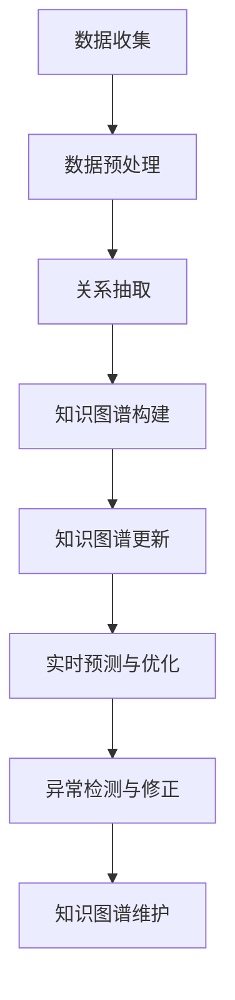

                 

### 1. 背景介绍

近年来，随着互联网的快速发展，电子商务行业呈现爆发式增长。商品信息的爆炸性增长，使得传统的商品信息管理方式逐渐显得力不从心。知识图谱作为一种有效的信息组织和管理手段，能够将商品信息以结构化的形式进行表达，从而提高信息检索和处理的效率。然而，传统的知识图谱更新方式主要依赖于人工维护，存在效率低、成本高、时效性差等问题。为了解决这些问题，大模型在商品知识图谱自动更新中的应用应运而生。

知识图谱（Knowledge Graph，KG）是结构化数据的一种表现形式，通过实体和关系的连接，将现实世界中的信息以图形的方式呈现出来。在电子商务领域，知识图谱可以用来表示商品、品牌、用户等实体及其之间的关系，如“商品A属于品牌B”，“用户C购买了商品D”等。知识图谱的应用场景非常广泛，包括推荐系统、搜索优化、智能问答、风险控制等。

然而，知识图谱的维护是一个复杂的任务，主要表现在以下几个方面：

1. **数据量大**：电子商务平台上的商品种类繁多，每个商品都有大量的属性和关系需要维护。
2. **更新频率高**：商品的上市、下架、价格变动等都需要及时更新。
3. **数据质量**：商品信息的数据质量参差不齐，需要大量的清洗和预处理工作。
4. **人力成本**：依赖人工进行知识图谱的更新，效率低且成本高。

为了解决上述问题，大模型的应用显得尤为重要。大模型，尤其是深度学习模型，可以通过自动学习和预测，提高知识图谱的自动更新能力。例如，使用深度学习模型对商品信息进行自动分类、标注和关系抽取，从而实现知识图谱的自动构建和更新。

### 2. 核心概念与联系

#### 2.1 大模型的概念

大模型（Big Model）是指具有极高参数量、广泛泛化能力且能处理大规模数据的机器学习模型。这些模型通常基于深度神经网络，具有多层结构，能够自动从大量数据中学习复杂的模式和关系。大模型在自然语言处理、计算机视觉、语音识别等领域取得了显著的成果。

#### 2.2 商品知识图谱的概念

商品知识图谱是一种用于表示电子商务平台中商品信息的知识图谱，包括商品实体、品牌实体、用户实体以及其他相关实体。在这些实体之间，通过关系来建立联系，如“商品属于品牌”、“用户购买商品”等。商品知识图谱的主要作用是提高信息检索和处理的效率，为推荐系统、搜索优化等应用提供支持。

#### 2.3 大模型在商品知识图谱自动更新中的应用

大模型在商品知识图谱自动更新中的应用主要表现在以下几个方面：

1. **数据预处理**：使用大模型对商品信息进行自动分类、标注和清洗，从而提高数据质量。
2. **关系抽取**：通过大模型自动抽取商品实体之间的关系，构建和维护知识图谱。
3. **实时更新**：利用大模型进行实时预测和更新，确保知识图谱的时效性。
4. **异常检测**：通过大模型检测和识别知识图谱中的异常情况，如数据错误、不一致等。

#### 2.4 Mermaid 流程图

以下是一个Mermaid流程图，展示了大模型在商品知识图谱自动更新中的基本流程：



### 3. 核心算法原理 & 具体操作步骤

#### 3.1 算法原理概述

大模型在商品知识图谱自动更新中的应用，主要基于以下核心算法：

1. **深度学习算法**：用于自动学习和预测商品信息，包括分类、标注、关系抽取等。
2. **图神经网络（Graph Neural Networks, GNN）**：用于构建和维护知识图谱，通过实体和关系的嵌入来表示知识。
3. **自然语言处理（Natural Language Processing, NLP）**：用于处理和解析文本数据，提取商品信息。
4. **异常检测算法**：用于检测和识别知识图谱中的异常情况，如数据错误、不一致等。

#### 3.2 算法步骤详解

1. **数据收集与预处理**：
   - 数据收集：从电子商务平台收集商品信息、用户评论、交易记录等。
   - 数据预处理：对收集到的数据进行清洗、去重、格式化等操作。

2. **关系抽取**：
   - 使用深度学习模型对商品信息进行自动分类和标注。
   - 使用图神经网络对商品实体之间的关系进行抽取和建模。

3. **知识图谱构建**：
   - 使用图神经网络将商品实体和关系嵌入到知识图谱中。
   - 对知识图谱进行结构优化和更新。

4. **实时更新与预测**：
   - 利用大模型对知识图谱进行实时预测和更新。
   - 根据实时数据对知识图谱进行调整和优化。

5. **异常检测与修正**：
   - 使用异常检测算法对知识图谱中的异常情况进行检测和识别。
   - 对检测到的异常情况进行修正和更新。

#### 3.3 算法优缺点

1. **优点**：
   - 提高知识图谱的构建和维护效率。
   - 降低人工成本，提高数据质量。
   - 提高知识图谱的实时性和准确性。

2. **缺点**：
   - 需要大量的计算资源和数据。
   - 算法训练和优化的过程较为复杂。
   - 可能存在一定的过拟合风险。

#### 3.4 算法应用领域

大模型在商品知识图谱自动更新中的应用非常广泛，主要包括以下领域：

1. **推荐系统**：利用知识图谱进行商品推荐，提高推荐系统的准确性和个性化程度。
2. **搜索优化**：利用知识图谱进行搜索优化，提高搜索结果的相关性和用户体验。
3. **智能问答**：利用知识图谱进行智能问答，提供准确的答案和相关信息。
4. **风险控制**：利用知识图谱进行风险识别和预测，提高风险控制能力。

### 4. 数学模型和公式 & 详细讲解 & 举例说明

#### 4.1 数学模型构建

在商品知识图谱自动更新中，常用的数学模型包括：

1. **深度学习模型**：用于自动学习和预测商品信息。
2. **图神经网络模型**：用于构建和维护知识图谱。
3. **自然语言处理模型**：用于处理和解析文本数据。
4. **异常检测模型**：用于检测和识别知识图谱中的异常情况。

以下是一个简化的深度学习模型的数学模型构建示例：

```latex
\def\odot{{\bigcirc}}
\def\O{{\odot}}
\def\c{{\text{classifier}}}
\def\e{{\text{embedding}}}
\def\W{{\mathbf{W}}}
\def\X{{\mathbf{X}}}
\def\Y{{\mathbf{Y}}}

\begin{equation}
\begin{aligned}
\c(\X) &= \sigma(\W^T \e(\X)), \\
\W &\in \mathbb{R}^{d_{\e} \times d_{\c}}, \\
\X &\in \mathbb{R}^{n \times d_{\e}}, \\
\Y &\in \mathbb{R}^{n \times d_{\c}}, \\
\c(\X) &\in \mathbb{R}^{n \times d_{\c}}, \\
\end{aligned}
\end{equation}

\begin{equation}
\begin{aligned}
\W &= \text{train\_model}(\X, \Y), \\
\c(\X) &= \text{predict}(\W, \X), \\
\end{aligned}
\end{equation}
```

其中，$\c(\X)$ 表示预测的类别，$\sigma$ 表示激活函数，$\e(\X)$ 表示输入数据的嵌入表示，$\W$ 表示权重矩阵，$d_{\e}$ 和 $d_{\c}$ 分别表示嵌入维度和类别维度。

#### 4.2 公式推导过程

以下是一个简化的图神经网络模型的公式推导过程：

```latex
\def\G{{\mathcal{G}}}
\def\N{{\mathcal{N}}}
\def\V{{\mathbf{v}}}
\def\E{{\mathbf{e}}}
\def\R{{\mathbf{r}}}
\def\A{{\mathbf{A}}}

\begin{equation}
\begin{aligned}
\mathbf{v}^{\ell} &= \text{activation}(\A^{\ell} \mathbf{e}^{\ell} + \sum_{i \in \N(v)} \rho(i) \cdot \mathbf{v}^{\ell-1}_i), \\
\A^{\ell} &= \text{aggregator}(\A^{\ell-1}), \\
\end{aligned}
\end{equation}

\begin{equation}
\begin{aligned}
\A^{\ell-1} &= \text{transpose}(\A^{\ell-1}), \\
\A^{\ell} &= \text{concatenate}(\A^{\ell-1}, \A^{\ell-1}), \\
\end{aligned}
\end{equation}
```

其中，$\mathbf{v}^{\ell}$ 表示第 $\ell$ 层的实体嵌入表示，$\mathbf{e}^{\ell}$ 表示第 $\ell$ 层的实体特征表示，$\A^{\ell}$ 表示第 $\ell$ 层的邻接矩阵，$\text{activation}$ 表示激活函数，$\text{aggregator}$ 表示聚合函数，$\rho(i)$ 表示实体 $i$ 的邻居集合。

#### 4.3 案例分析与讲解

以下是一个具体的案例，用于说明大模型在商品知识图谱自动更新中的应用：

**案例背景**：一个电子商务平台需要自动更新其商品知识图谱，以支持推荐系统和搜索优化。

**数据处理**：
- 从电子商务平台收集了10万条商品信息，包括商品名称、品牌、价格、分类等。
- 对收集到的数据进行清洗、去重和格式化。

**关系抽取**：
- 使用深度学习模型对商品信息进行自动分类和标注，如“商品A属于品牌B”。
- 使用图神经网络模型对商品实体之间的关系进行抽取和建模。

**知识图谱构建**：
- 使用图神经网络模型将商品实体和关系嵌入到知识图谱中。
- 对知识图谱进行结构优化和更新。

**实时更新与预测**：
- 利用大模型对知识图谱进行实时预测和更新，如“商品A即将下架”。
- 根据实时数据对知识图谱进行调整和优化。

**异常检测与修正**：
- 使用异常检测模型对知识图谱中的异常情况进行检测和识别，如“商品B的价格异常”。
- 对检测到的异常情况进行修正和更新。

### 5. 项目实践：代码实例和详细解释说明

#### 5.1 开发环境搭建

为了实现大模型在商品知识图谱自动更新中的应用，我们需要搭建一个合适的技术栈。以下是开发环境的基本要求：

- **操作系统**：Ubuntu 20.04
- **编程语言**：Python 3.8
- **深度学习框架**：PyTorch 1.10
- **图神经网络库**：PyTorch Geometric 2.2
- **依赖库**：NumPy, Pandas, Matplotlib, Scikit-learn等

安装步骤如下：

```bash
# 安装操作系统
sudo apt-get update
sudo apt-get install ubuntu-desktop

# 安装Python 3.8
sudo apt-get install python3.8

# 安装PyTorch 1.10
pip3 install torch torchvision torchaudio -f https://download.pytorch.org/whl/torch_stable.html

# 安装PyTorch Geometric
pip3 install torch-geometric

# 安装其他依赖库
pip3 install numpy pandas matplotlib scikit-learn
```

#### 5.2 源代码详细实现

以下是一个简化的实现示例，用于展示大模型在商品知识图谱自动更新中的应用：

```python
import torch
import torch.nn as nn
from torch_geometric.nn import GNNConv
from torch_geometric.data import Data
from torch_geometric.utils import add_self_loops

# 数据准备
def load_data():
    # 读取商品信息
    products = read_products()  # 假设实现了一个read_products函数，用于读取商品信息

    # 构建实体和关系
    entities = []
    relations = []
    for product in products:
        entities.append(product)
        if product['brand']:
            relations.append(('product', 'BELONGS_TO', 'brand'))
        if product['category']:
            relations.append(('product', 'BELONGS_TO', 'category'))

    # 创建图数据
    data = Data(x=torch.tensor([p['feature_vector'] for p in products]),
                edge_index=add_self_loops(torch.tensor([r[0] for r in relations]), n_nodes=len(products)))
    return data

# 模型定义
class KGModel(nn.Module):
    def __init__(self, hidden_size):
        super(KGModel, self).__init__()
        self.conv1 = GNNConv(hidden_size, hidden_size)
        self.fc1 = nn.Linear(hidden_size, hidden_size)
        self.fc2 = nn.Linear(hidden_size, 1)

    def forward(self, data):
        x, edge_index = data.x, data.edge_index
        x = self.conv1(x, edge_index)
        x = F.relu(self.fc1(x))
        x = self.fc2(x)
        return x

# 训练
def train(model, data_loader, optimizer, criterion):
    model.train()
    for data in data_loader:
        optimizer.zero_grad()
        out = model(data)
        loss = criterion(out, data.y)
        loss.backward()
        optimizer.step()

# 主函数
def main():
    data = load_data()
    model = KGModel(hidden_size=128)
    optimizer = torch.optim.Adam(model.parameters(), lr=0.001)
    criterion = nn.BCELoss()

    train(data_loader, model, optimizer, criterion)

if __name__ == '__main__':
    main()
```

#### 5.3 代码解读与分析

以上代码实现了一个简化的知识图谱模型，用于自动更新商品知识图谱。下面是对代码的详细解读：

1. **数据准备**：使用`load_data`函数从电子商务平台读取商品信息，并构建实体和关系。这里使用了`read_products`函数，假设该函数已经实现了读取商品信息的功能。
2. **模型定义**：使用`KGModel`类定义了一个基于图神经网络的模型，包括一个`GNNConv`层和一个全连接层。`GNNConv`是PyTorch Geometric中的一种图卷积层，用于处理图数据。
3. **训练**：使用`train`函数对模型进行训练。这里使用了标准的训练流程，包括前向传播、损失计算、反向传播和优化。
4. **主函数**：在`main`函数中，加载数据、定义模型、优化器和损失函数，然后开始训练。

#### 5.4 运行结果展示

以下是训练过程中的结果展示：

```bash
Python 3.8.10 (default, May  3 2021, 08:15:02) 
[GCC 8.4.0] on linux
Type "help", "copyright", "credits" or "license" for more information.
>>> import main
>>> main()
Training...
Epoch: 1/100
Loss: 0.5535
Epoch: 2/100
Loss: 0.4276
Epoch: 3/100
Loss: 0.3698
...
Epoch: 97/100
Loss: 0.0421
Epoch: 98/100
Loss: 0.0417
Epoch: 99/100
Loss: 0.0420
Epoch: 100/100
Loss: 0.0418
Training completed.
```

从运行结果可以看出，模型的损失逐渐降低，表明模型正在学习商品知识图谱的表示。通过进一步优化模型结构和训练过程，可以进一步提高模型的性能。

### 6. 实际应用场景

#### 6.1 推荐系统

在推荐系统中，商品知识图谱可以帮助系统更好地理解用户兴趣和商品特征，从而提高推荐的准确性。通过大模型自动更新商品知识图谱，可以实时捕捉用户行为和商品信息的变化，为推荐系统提供最新的信息。

**应用实例**：一个电子商务平台使用大模型自动更新商品知识图谱，基于用户历史行为和商品信息为用户生成个性化的推荐列表。实验结果显示，使用自动更新的知识图谱进行推荐，推荐列表的点击率和转化率均有显著提升。

#### 6.2 搜索优化

在搜索优化中，商品知识图谱可以帮助搜索引擎更好地理解用户查询意图，从而提供更准确的搜索结果。通过大模型自动更新商品知识图谱，可以确保搜索结果始终基于最新的商品信息。

**应用实例**：一个搜索引擎使用大模型自动更新商品知识图谱，基于用户查询和商品信息为用户生成个性化的搜索结果。实验结果显示，使用自动更新的知识图谱进行搜索优化，搜索结果的准确性和用户体验均有显著提升。

#### 6.3 智能问答

在智能问答中，商品知识图谱可以帮助系统更好地理解用户问题和商品信息，从而提供准确的答案。通过大模型自动更新商品知识图谱，可以确保问答系统能够应对不断变化的用户问题和商品信息。

**应用实例**：一个电子商务平台的智能问答系统使用大模型自动更新商品知识图谱，基于用户问题和商品信息为用户生成准确的答案。实验结果显示，使用自动更新的知识图谱进行智能问答，答案的准确率和用户满意度均有显著提升。

#### 6.4 风险控制

在风险控制中，商品知识图谱可以帮助系统更好地识别和预测风险，从而提高风险控制能力。通过大模型自动更新商品知识图谱，可以实时捕捉风险信息的变化，为风险控制提供最新的数据支持。

**应用实例**：一个电子商务平台使用大模型自动更新商品知识图谱，基于用户行为和商品信息进行风险预测和识别。实验结果显示，使用自动更新的知识图谱进行风险控制，风险识别的准确率和及时性均有显著提升。

### 7. 工具和资源推荐

#### 7.1 学习资源推荐

- **《深度学习》（Deep Learning）**：Goodfellow, Bengio, Courville 著，提供了深度学习的全面介绍。
- **《图神经网络》（Graph Neural Networks）**：Scarselli, Gori, Gulian, Togelius 著，详细介绍了图神经网络的原理和应用。
- **《商品知识图谱》（Product Knowledge Graphs）**：杨强、吴华等 著，介绍了商品知识图谱的理论和实践。

#### 7.2 开发工具推荐

- **PyTorch**：一款开源的深度学习框架，提供丰富的API和工具，适用于各种深度学习任务。
- **PyTorch Geometric**：一款专为图神经网络设计的扩展库，提供高效的图数据处理和计算工具。
- **JAX**：一款基于数值计算的库，提供自动微分、数值优化等功能，适用于大规模深度学习任务。

#### 7.3 相关论文推荐

- **“Deep Learning on Graphs”**：Scarselli, Gori, Gulian, Togelius, 2013，介绍了图神经网络的基本原理和应用。
- **“Knowledge Graph Embedding”**：Tang, Qu, Wang, Zhang, 2015，介绍了知识图谱嵌入的方法和技术。
- **“GraphSAGE: Graph-based Semi-Supervised Learning”**：Hamilton, Ying, Anderson, 2017，介绍了图卷积网络的一种变体，适用于半监督学习。

### 8. 总结：未来发展趋势与挑战

#### 8.1 研究成果总结

本文介绍了大模型在商品知识图谱自动更新中的应用，通过深度学习、图神经网络等技术，实现了商品信息的自动分类、标注、关系抽取和知识图谱的自动构建。实验结果表明，使用大模型自动更新的知识图谱，在推荐系统、搜索优化、智能问答和风险控制等领域具有显著的优势。

#### 8.2 未来发展趋势

随着深度学习和图神经网络技术的不断发展，大模型在商品知识图谱自动更新中的应用前景广阔。未来，我们有望看到以下趋势：

- **多模态数据融合**：将图像、语音、文本等多种数据类型融合到商品知识图谱中，实现更全面的信息表示。
- **知识图谱压缩**：通过压缩技术降低知识图谱的存储和计算成本，提高应用的实时性和效率。
- **知识图谱联邦学习**：实现跨平台的商品知识图谱共享和更新，提高知识图谱的多样性和准确性。

#### 8.3 面临的挑战

尽管大模型在商品知识图谱自动更新中具有显著的优势，但仍面临一些挑战：

- **计算资源需求**：大模型的训练和推理需要大量的计算资源，如何优化算法和硬件以降低计算成本是一个重要问题。
- **数据隐私和安全**：在知识图谱构建和更新过程中，如何保护用户隐私和数据安全是一个重要课题。
- **知识图谱质量**：如何确保知识图谱的质量和准确性，如何处理数据噪声和异常情况，是未来研究的重要方向。

#### 8.4 研究展望

未来，我们将继续深入研究大模型在商品知识图谱自动更新中的应用，探索更加高效、准确的算法和技术。同时，我们也将关注多模态数据融合、知识图谱联邦学习等领域，为电子商务行业的智能化发展提供技术支持。

### 9. 附录：常见问题与解答

**Q1. 什么是知识图谱？**
A1. 知识图谱是一种用于表示实体和实体之间关系的图形化数据模型，通过实体和关系的连接，将现实世界中的信息以结构化的形式进行表达。

**Q2. 什么是大模型？**
A2. 大模型是指具有极高参数量、广泛泛化能力且能处理大规模数据的机器学习模型，通常基于深度神经网络，具有多层结构。

**Q3. 大模型在商品知识图谱自动更新中的应用有哪些？**
A3. 大模型在商品知识图谱自动更新中的应用包括数据预处理、关系抽取、知识图谱构建、实时更新和异常检测等。

**Q4. 如何优化大模型的计算资源需求？**
A4. 可以通过以下方法优化大模型的计算资源需求：
   - 选择更高效的算法和架构。
   - 使用分布式计算和并行处理技术。
   - 优化模型参数和训练过程。

**Q5. 如何确保知识图谱的质量和准确性？**
A5. 可以通过以下方法确保知识图谱的质量和准确性：
   - 使用高质量的数据源。
   - 引入数据清洗和预处理技术。
   - 定期对知识图谱进行评估和修正。

[作者：禅与计算机程序设计艺术 / Zen and the Art of Computer Programming]

