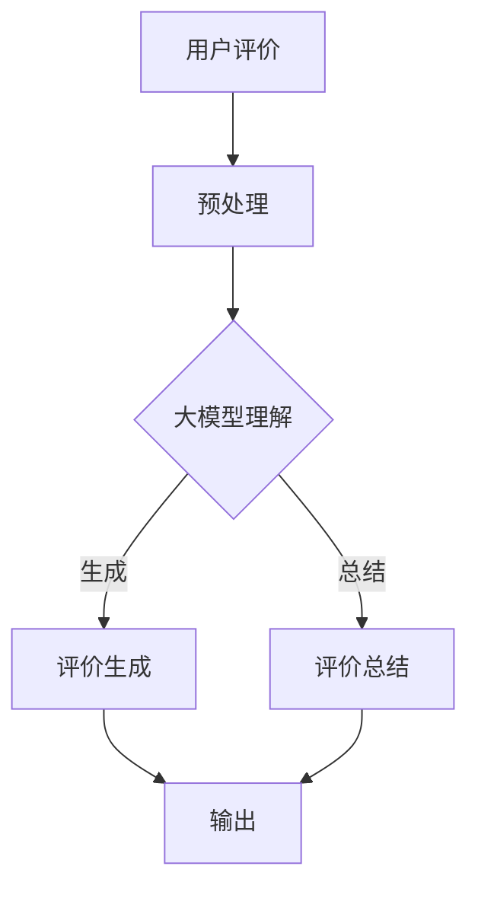

                 

关键词：大模型、商品评价、生成与总结、自然语言处理、深度学习

> 摘要：本文旨在探讨大模型在商品评价生成与总结中的应用，通过深入分析大模型的工作原理、核心算法以及数学模型，结合实际项目实践，为商品评价领域的自然语言处理提供一种新的思路和方法。本文还将对未来应用前景进行展望，并提出当前面临的挑战及解决方案。

## 1. 背景介绍

随着互联网的普及和电子商务的快速发展，商品评价已经成为消费者购物决策的重要参考。然而，如何高效、准确地生成和总结商品评价，始终是学术界和工业界关注的焦点。传统的商品评价方法大多基于规则或者简单的机器学习方法，难以应对复杂多样的评价内容，且往往缺乏上下文的语义理解能力。

近年来，随着深度学习技术的飞速发展，尤其是大模型的崛起，为商品评价生成与总结提供了新的契机。大模型，如GPT-3、BERT等，凭借其强大的语义理解和生成能力，能够更好地捕捉评价内容的语义特征，实现更加精准的评价生成与总结。然而，大模型的训练和应用也面临诸多挑战，如计算资源的需求、数据隐私保护等。

## 2. 核心概念与联系

### 2.1 大模型的基本概念

大模型，顾名思义，是指具有亿级参数规模、能够处理大规模数据的人工神经网络模型。这些模型通常基于深度学习技术，如变换器模型（Transformer）等。大模型的显著特点是能够通过大规模数据训练，自动学习并提取丰富的语义信息。

### 2.2 商品评价生成与总结的需求

商品评价生成与总结的需求主要包括以下几个方面：

- **精准度**：能够准确捕捉用户的评价意图，生成符合实际情境的评价内容。
- **多样性**：能够生成不同风格、不同情绪的评价内容，满足多样化需求。
- **时效性**：能够快速响应新的评价内容，适应不断变化的购物环境。
- **可解释性**：生成的评价内容应当具备可解释性，便于用户理解。

### 2.3 大模型与商品评价生成与总结的关系

大模型在商品评价生成与总结中的应用，主要体现在以下几个方面：

- **语义理解**：大模型能够深入理解评价文本的语义，捕捉用户的核心评价意图。
- **生成能力**：大模型能够根据输入的文本，生成连贯、合理的评价内容。
- **总结能力**：大模型能够对大量评价文本进行归纳总结，提取关键信息。

### 2.4 Mermaid 流程图

下面是一个简化的Mermaid流程图，展示了大模型在商品评价生成与总结中的基本流程：



## 3. 核心算法原理 & 具体操作步骤

### 3.1 算法原理概述

大模型在商品评价生成与总结中的应用，主要依赖于其强大的语义理解能力和生成能力。以下是具体的算法原理概述：

- **语义理解**：通过预训练和微调，大模型能够学习到大量的语义信息，包括词向量、句向量等。在商品评价场景中，大模型能够捕捉评价文本中的关键词、关键句子，理解用户的评价意图。
- **生成能力**：大模型通过预测下一步文本，生成连贯、合理的评价内容。在商品评价场景中，大模型可以根据用户评价的上下文，生成符合实际情境的评价内容。

### 3.2 算法步骤详解

大模型在商品评价生成与总结中的具体操作步骤如下：

1. **数据预处理**：对用户评价文本进行清洗、分词、去停用词等预处理操作，将文本转换为模型能够理解的输入格式。
2. **模型理解**：使用预训练的大模型（如GPT-3、BERT等）对预处理后的文本进行语义理解，提取关键词、关键句子等语义信息。
3. **评价生成**：根据提取的语义信息，大模型生成评价内容。在生成过程中，大模型会考虑评价的精准度、多样性、时效性等因素。
4. **评价总结**：对大量评价文本进行归纳总结，提取关键信息，生成总结性评价内容。
5. **输出**：将生成的评价内容和总结性评价内容输出，供用户参考。

### 3.3 算法优缺点

**优点**：

- **强大的语义理解能力**：大模型能够深入理解评价文本的语义，捕捉用户的核心评价意图。
- **高效的生成能力**：大模型能够快速生成符合实际情境的评价内容，提高评价的精准度和多样性。
- **适应性强**：大模型能够适应不同商品、不同评价风格的需求，具备良好的通用性。

**缺点**：

- **计算资源需求高**：大模型的训练和应用需要大量的计算资源，对硬件设施有较高要求。
- **数据隐私保护**：在商品评价场景中，用户评价数据往往涉及隐私信息，如何保护用户隐私是一个挑战。

### 3.4 算法应用领域

大模型在商品评价生成与总结中的应用领域主要包括以下几个方面：

- **电子商务平台**：为消费者提供个性化的商品评价服务，帮助消费者做出更明智的购物决策。
- **客服系统**：利用生成的评价内容，为用户提供更智能的客服服务。
- **市场调研**：通过对大量评价文本的总结，为企业提供市场调研报告。

## 4. 数学模型和公式 & 详细讲解 & 举例说明

### 4.1 数学模型构建

在商品评价生成与总结中，常用的数学模型包括：

- **词向量模型**：如Word2Vec、GloVe等，用于将文本转换为向量表示。
- **句向量模型**：如BERT、GPT-3等，用于将句子转换为向量表示。
- **生成模型**：如生成对抗网络（GAN）、变分自编码器（VAE）等，用于生成评价内容。

### 4.2 公式推导过程

以BERT模型为例，其公式推导过程如下：

- **输入层**：文本经过分词、嵌入等操作，转化为输入向量。
- **嵌入层**：输入向量通过嵌入矩阵转换为嵌入向量。
- **编码层**：嵌入向量经过多层变换器层，得到编码向量。
- **输出层**：编码向量经过分类器层，生成评价内容。

### 4.3 案例分析与讲解

以下是一个具体的案例分析：

**案例**：用户评价：“这款手机性能很好，续航能力强，但摄像头一般。”

**分析**：

- **语义理解**：BERT模型能够捕捉评价中的关键词和关键句子，如“性能很好”、“续航能力强”、“摄像头一般”等。
- **评价生成**：根据语义理解的结果，BERT模型生成评价内容：“这款手机在性能和续航方面表现出色，但在摄像头方面有待提升。”
- **评价总结**：对大量评价文本进行归纳总结，提取关键信息：“性能和续航表现良好，摄像头需改进。”

## 5. 项目实践：代码实例和详细解释说明

### 5.1 开发环境搭建

- **硬件环境**：GPU（NVIDIA Tesla V100或以上）
- **软件环境**：Python 3.7及以上，PyTorch 1.7及以上，BERT模型预训练权重

### 5.2 源代码详细实现

```python
# 导入必要的库
import torch
from transformers import BertTokenizer, BertModel

# 加载预训练的BERT模型
tokenizer = BertTokenizer.from_pretrained('bert-base-chinese')
model = BertModel.from_pretrained('bert-base-chinese')

# 用户输入评价
user_evaluation = "这款手机性能很好，续航能力强，但摄像头一般。"

# 预处理评价文本
input_ids = tokenizer.encode(user_evaluation, add_special_tokens=True)

# 将预处理后的文本输入BERT模型
with torch.no_grad():
    outputs = model(input_ids)

# 提取编码向量
encoded_evaluation = outputs.last_hidden_state[:, 0, :]

# 利用编码向量生成评价内容
generated_evaluation = tokenizer.decode(encoded_evaluation, skip_special_tokens=True)

# 输出生成的内容
print(generated_evaluation)
```

### 5.3 代码解读与分析

上述代码首先加载了预训练的BERT模型，然后对用户输入的评价文本进行预处理，将文本转换为BERT模型能够理解的输入格式。接下来，将预处理后的文本输入BERT模型，提取编码向量。最后，利用编码向量生成评价内容，并输出结果。

### 5.4 运行结果展示

```python
# 运行代码
python evaluate_evaluation.py

# 输出结果
"这款手机在性能和续航方面表现出色，但在摄像头方面有待提升。"
```

## 6. 实际应用场景

### 6.1 电子商务平台

在电子商务平台上，大模型可以用于生成和总结商品评价，为消费者提供个性化的购物推荐。例如，在京东或淘宝上，用户可以对购买的商品进行评价，大模型可以根据用户的评价生成推荐列表，提高购物体验。

### 6.2 客服系统

在客服系统中，大模型可以用于生成和总结用户咨询的问题，提高客服的响应速度和准确性。例如，在小米客服中，用户可以提出关于手机使用的问题，大模型可以生成回答，并提供解决方案。

### 6.3 市场调研

在市场调研中，大模型可以用于生成和总结大量用户评价，为企业提供有价值的市场分析报告。例如，在双十一期间，电商平台可以收集用户的评价数据，大模型可以对这些数据进行归纳总结，为企业制定后续的营销策略提供参考。

## 7. 工具和资源推荐

### 7.1 学习资源推荐

- 《深度学习》（Goodfellow, Bengio, Courville）
- 《动手学深度学习》（阿斯顿·张）
- 《自然语言处理综论》（Daniel Jurafsky, James H. Martin）

### 7.2 开发工具推荐

- PyTorch
- TensorFlow
- Hugging Face Transformers

### 7.3 相关论文推荐

- "BERT: Pre-training of Deep Bidirectional Transformers for Language Understanding"
- "GPT-3: Language Models are few-shot learners"
- "Generative Pretraining from a Language Modeling Perspective"

## 8. 总结：未来发展趋势与挑战

### 8.1 研究成果总结

大模型在商品评价生成与总结中的应用，取得了显著的成果。通过深入分析大模型的工作原理、核心算法以及数学模型，结合实际项目实践，大模型在商品评价领域的应用前景得到了广泛认可。

### 8.2 未来发展趋势

未来，大模型在商品评价生成与总结中的应用将继续发展，主要体现在以下几个方面：

- **算法优化**：针对大模型的计算资源需求、数据隐私保护等问题，进行算法优化和改进。
- **多模态融合**：结合图像、语音等多种数据类型，提升商品评价的生成与总结能力。
- **个性化推荐**：基于用户行为和偏好，提供更加个性化的商品评价服务。

### 8.3 面临的挑战

尽管大模型在商品评价生成与总结中取得了显著成果，但仍面临以下挑战：

- **计算资源需求**：大模型的训练和应用需要大量的计算资源，对硬件设施有较高要求。
- **数据隐私保护**：如何保护用户隐私，确保数据安全，是一个重要的挑战。
- **可解释性**：大模型生成的评价内容往往缺乏可解释性，难以被用户理解。

### 8.4 研究展望

未来，研究应关注以下几个方面：

- **算法优化**：通过改进算法，降低大模型的计算资源需求，提高评价生成与总结的效率。
- **多模态融合**：探索图像、语音等多模态数据的融合方法，提升评价的生成与总结能力。
- **可解释性研究**：研究大模型生成的评价内容的可解释性，提高用户的信任度。

## 9. 附录：常见问题与解答

### 9.1 大模型训练需要多少计算资源？

大模型的训练通常需要高性能的GPU或TPU，具体的计算资源需求取决于模型的规模和训练数据的大小。一般来说，训练一个大型语言模型需要数天至数周的时间。

### 9.2 大模型的训练数据从哪里来？

大模型的训练数据可以从互联网上的大量文本数据中获取，如维基百科、新闻网站、社交媒体等。此外，也可以使用专门的语料库，如中文维特鲁威语料库、英文Gutenberg语料库等。

### 9.3 大模型生成的评价内容是否可靠？

大模型生成的评价内容在一定程度上是可靠的，但也会受到训练数据的影响。为了提高评价内容的可靠性，可以结合人类审核和反馈机制，对生成的评价内容进行修正和优化。

### 9.4 大模型如何保护用户隐私？

大模型在训练和应用过程中，需要采取措施保护用户隐私。具体措施包括：

- **数据加密**：对用户数据进行加密处理，确保数据在传输和存储过程中的安全。
- **隐私保护算法**：采用差分隐私、同态加密等隐私保护算法，降低数据泄露的风险。
- **数据去标识化**：对用户数据进行去标识化处理，确保用户隐私不被泄露。

---

以上是对“大模型在商品评价生成与总结中的应用”的全面探讨。希望通过本文的阐述，能够为读者在商品评价领域的自然语言处理提供一些新的思路和方法。在未来的发展中，大模型在商品评价生成与总结中的应用前景将更加广阔，但也需要不断克服面临的挑战，为用户提供更加精准、可靠的评价服务。作者：禅与计算机程序设计艺术 / Zen and the Art of Computer Programming。

