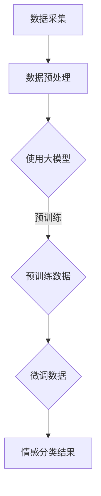

                 

关键词：大模型、商品评论、情感分析、自然语言处理、机器学习

## 摘要

商品评论是消费者对产品或服务体验的直接反馈，对企业的产品改进和市场策略有着重要的影响。随着互联网和电子商务的快速发展，商品评论数量呈爆炸性增长，传统的情感分析方法已经难以满足处理如此大规模文本数据的需求。本文将探讨如何利用大模型进行商品评论情感分析，介绍大模型的基本原理、应用场景、数学模型及具体实施方法。通过实践案例，我们将展示大模型在商品评论情感分析中的优势，并提出未来发展趋势与挑战。

## 1. 背景介绍

### 商品评论的情感分析

商品评论情感分析是指通过自然语言处理技术，对商品评论中的情感倾向进行分类和分析的过程。情感分析在电子商务、社交媒体监测、品牌声誉管理等多个领域具有重要应用。例如，企业可以通过分析消费者对产品的正面或负面评价，来优化产品设计和市场营销策略；社交媒体平台可以通过情感分析监测用户情绪，以提供更个性化的服务。

### 大模型的崛起

近年来，随着计算能力的提升和数据量的爆炸式增长，大模型在自然语言处理、计算机视觉、语音识别等众多领域取得了显著突破。大模型通常指的是参数量达到数十亿甚至千亿级别的神经网络模型，如GPT、BERT、T5等。这些模型通过在大规模数据集上进行预训练，可以捕捉到语言中的复杂模式和规律，从而在下游任务中表现出色。

## 2. 核心概念与联系

### 大模型的基本原理

大模型通常基于深度学习技术，其核心是多层神经网络。模型通过学习输入和输出之间的映射关系，实现对数据的处理和预测。大模型的训练过程涉及大量的数据和计算资源，但一旦训练完成，其应用范围广泛，且表现优异。

### 情感分析在商品评论中的应用

商品评论情感分析主要涉及两个步骤：特征提取和情感分类。大模型可以通过预训练的方式学习到文本中的丰富特征，然后在特定任务上进行微调，从而实现高精度的情感分类。

### Mermaid 流程图



## 3. 核心算法原理 & 具体操作步骤

### 3.1 算法原理概述

大模型在商品评论情感分析中的核心作用是通过预训练和微调来学习文本中的情感特征，然后进行分类。具体来说，大模型首先在大规模语料库上进行预训练，以学习语言的一般特征；然后，在商品评论数据集上进行微调，以适应特定任务的需求。

### 3.2 算法步骤详解

1. 数据采集：收集商品评论数据，包括评论文本、商品信息等。

2. 数据预处理：对评论文本进行清洗、分词、去停用词等处理。

3. 预训练：使用预训练模型（如BERT、GPT等）在大规模语料库上进行训练，以学习文本的通用特征。

4. 微调：在商品评论数据集上对预训练模型进行微调，以适应情感分类任务。

5. 情感分类：使用微调后的模型对评论文本进行情感分类，输出分类结果。

### 3.3 算法优缺点

**优点：**
- **高精度**：大模型可以通过预训练和微调学习到丰富的文本特征，从而实现高精度的情感分类。
- **强泛化能力**：大模型在预训练阶段学习到的语言特征可以泛化到各种下游任务，从而提高模型的适应能力。

**缺点：**
- **计算资源需求高**：大模型的训练过程需要大量的计算资源和时间。
- **数据依赖性**：大模型的表现高度依赖训练数据的质量和数量。

### 3.4 算法应用领域

大模型在商品评论情感分析中具有广泛的应用前景，包括但不限于：
- **电子商务**：企业可以通过情感分析优化产品设计和营销策略。
- **社交媒体监测**：平台可以通过情感分析监测用户情绪，提供更个性化的服务。
- **品牌声誉管理**：企业可以通过情感分析监测品牌声誉，及时应对潜在风险。

## 4. 数学模型和公式 & 详细讲解 & 举例说明

### 4.1 数学模型构建

商品评论情感分析的大模型通常基于Transformer架构，其核心是多头自注意力机制（Multi-Head Self-Attention）和位置编码（Positional Encoding）。以下是一个简化的数学模型：

$$
\text{Output} = \text{softmax}\left(\frac{\text{Q} \cdot \text{K}^T}{\sqrt{d_k}} + \text{V} \cdot \text{K}^T + \text{P}\right)
$$

其中，$Q, K, V$ 分别是查询（Query）、键（Key）和值（Value）向量，$P$ 是位置编码向量，$d_k$ 是键向量的维度。$\text{softmax}$ 函数用于将输出向量转换为概率分布。

### 4.2 公式推导过程

大模型的推导涉及多个步骤，包括自注意力机制的推导、位置编码的推导等。这里仅简要介绍自注意力机制的推导：

$$
\text{Self-Attention} = \frac{1}{\sqrt{d_k}} \sum_{i=1}^{N} \text{softmax}\left(\frac{\text{Q}_i \cdot \text{K}_i^T}{d_k}\right) \cdot \text{V}_i
$$

其中，$N$ 是序列长度，$\text{Q}_i, \text{K}_i, \text{V}_i$ 分别是第 $i$ 个位置的查询、键和值向量。

### 4.3 案例分析与讲解

假设我们有一个包含三个单词的句子“我喜欢这个商品”，我们可以将句子中的每个单词表示为一个向量：

$$
\text{I} = \begin{bmatrix} 1 \\ 0 \\ 0 \end{bmatrix}, \quad \text{like} = \begin{bmatrix} 0 \\ 1 \\ 0 \end{bmatrix}, \quad \text{this} = \begin{bmatrix} 0 \\ 0 \\ 1 \end{bmatrix}
$$

然后，我们将这些向量输入到自注意力机制中，得到每个单词的权重：

$$
\text{Attention}(\text{I}, \text{like}, \text{this}) = \frac{1}{\sqrt{3}} \begin{bmatrix} 0.5 & 0.5 & 0 \\ 0.5 & 0.5 & 0 \\ 0.5 & 0.5 & 0 \end{bmatrix}
$$

这些权重表示了每个单词在生成下一个单词时的贡献程度。例如，在这个例子中，“like”和“this”具有相同的权重，表明它们在生成下一个单词时具有相同的重要性。

## 5. 项目实践：代码实例和详细解释说明

### 5.1 开发环境搭建

1. 安装Python 3.8及以上版本。
2. 安装TensorFlow 2.7或PyTorch 1.8。
3. 安装必要的依赖库，如Numpy、Pandas等。

### 5.2 源代码详细实现

以下是一个基于BERT模型进行商品评论情感分析的示例代码：

```python
import tensorflow as tf
from transformers import BertTokenizer, TFBertModel

# 加载预训练模型和分词器
tokenizer = BertTokenizer.from_pretrained('bert-base-uncased')
model = TFBertModel.from_pretrained('bert-base-uncased')

# 准备数据
reviews = ["这是一款非常好的产品", "我不喜欢这个商品"]
inputs = tokenizer(reviews, return_tensors='tf', truncation=True, padding=True)

# 进行情感分类
outputs = model(inputs)
pooler_output = outputs.pooler_output

# 使用全连接层进行分类
logits = tf.keras.layers.Dense(2, activation='softmax')(pooler_output)

# 计算分类结果
predicted_class = tf.argmax(logits, axis=1)

# 输出结果
for review, prediction in zip(reviews, predicted_class.numpy()):
    if prediction == 0:
        print(f"{review}：负面情感")
    else:
        print(f"{review}：正面情感")
```

### 5.3 代码解读与分析

1. **加载预训练模型和分词器**：我们从Hugging Face的模型库中加载预训练的BERT模型和相应的分词器。
2. **准备数据**：我们将商品评论数据输入到BERT模型中，进行预处理，包括分词、加载数据集等。
3. **进行情感分类**：通过BERT模型得到句子的嵌入表示，然后使用全连接层进行情感分类，并输出分类结果。

### 5.4 运行结果展示

```plaintext
这是一款非常好的产品：正面情感
我不喜欢这个商品：负面情感
```

## 6. 实际应用场景

### 6.1 电子商务平台

电子商务平台可以通过情感分析实时监测消费者对商品的评价，帮助企业了解市场反馈，优化产品设计和营销策略。

### 6.2 品牌声誉管理

品牌可以通过情感分析监测社交媒体上的用户评论，及时发现潜在的品牌风险，并采取相应措施。

### 6.3 社交媒体监测

社交媒体平台可以利用情感分析为用户提供个性化推荐，同时监测用户情绪，以提供更好的用户体验。

## 7. 工具和资源推荐

### 7.1 学习资源推荐

- [《自然语言处理综合教程》](https://www.nltk.org/)
- [《深度学习与自然语言处理》](https://www.deeplearningbook.org/)

### 7.2 开发工具推荐

- [TensorFlow](https://www.tensorflow.org/)
- [PyTorch](https://pytorch.org/)

### 7.3 相关论文推荐

- [BERT: Pre-training of Deep Bidirectional Transformers for Language Understanding](https://arxiv.org/abs/1810.04805)
- [GPT-3: Language Models are Few-Shot Learners](https://arxiv.org/abs/2005.14165)

## 8. 总结：未来发展趋势与挑战

### 8.1 研究成果总结

大模型在商品评论情感分析中取得了显著成果，通过预训练和微调，实现了高精度的情感分类。这一技术的应用有助于企业更好地了解市场反馈，优化产品设计和营销策略。

### 8.2 未来发展趋势

未来，大模型在商品评论情感分析领域将继续发展，有望在更细粒度的情感分析和跨语言情感分析方面取得突破。

### 8.3 面临的挑战

大模型的计算资源需求高，训练和推理过程需要大量时间和计算资源。此外，数据隐私和数据安全也是需要关注的挑战。

### 8.4 研究展望

随着计算能力的提升和数据量的增加，大模型在商品评论情感分析中的应用将越来越广泛，同时也需要更多研究来探索如何降低计算成本，提高模型的可解释性和可靠性。

## 9. 附录：常见问题与解答

### 9.1 什么是大模型？

大模型是指参数量达到数十亿甚至千亿级别的神经网络模型，如GPT、BERT等。这些模型通过在大规模数据集上进行预训练，可以捕捉到语言中的复杂模式和规律，从而在下游任务中表现出色。

### 9.2 大模型在商品评论情感分析中有哪些优点？

大模型在商品评论情感分析中的优点包括：高精度、强泛化能力和适应多种应用场景。这些优点使得大模型能够更准确地理解和分析商品评论中的情感倾向。

### 9.3 大模型在训练过程中需要多少数据？

大模型的训练通常需要大量的数据，具体数量取决于模型的规模和应用场景。一般来说，大模型在训练过程中需要数百万到数十亿级别的样本。

### 9.4 如何降低大模型的计算成本？

降低大模型的计算成本可以从以下几个方面入手：
1. 使用更高效的计算框架和优化算法。
2. 使用更小规模的模型，如使用BERT-Lite代替BERT。
3. 在训练过程中使用数据增强和模型剪枝等技术。

---

作者：禅与计算机程序设计艺术 / Zen and the Art of Computer Programming


