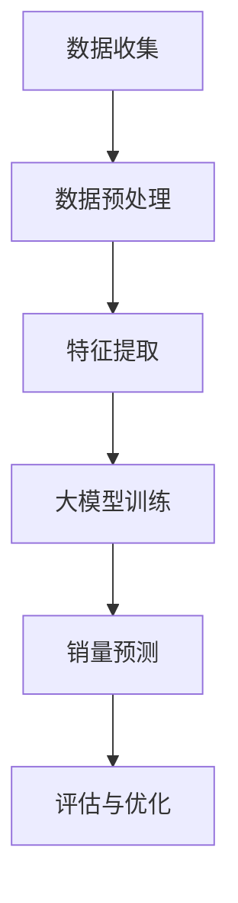

                 

关键词：大模型、商品销量预测、机器学习、深度学习、人工智能、创新应用

> 摘要：随着人工智能技术的迅猛发展，大模型在各个领域的应用逐渐深入，本文将探讨大模型在商品销量预测中的创新应用，分析其核心概念、算法原理、数学模型，并通过项目实践展示其实际效果。

## 1. 背景介绍

商品销量预测是商业领域中的一项重要任务，它对于企业的库存管理、供应链优化、营销策略制定等方面具有深远影响。传统的销量预测方法主要依赖于统计模型和机器学习算法，如时间序列分析、回归分析、ARIMA模型等。然而，这些方法在面对复杂市场环境和大量数据时往往表现不佳。

近年来，随着深度学习技术的突破，大模型（如Transformer、BERT、GPT等）逐渐在自然语言处理、计算机视觉等领域取得了显著成果。大模型的强大表征能力和学习能力使得它们在处理大规模、多样化数据方面具有独特优势。因此，将大模型应用于商品销量预测，有望带来革命性的变革。

## 2. 核心概念与联系

### 2.1 大模型简介

大模型是指参数规模庞大、结构复杂的神经网络模型。它们通过在大量数据上训练，能够捕捉到数据中的潜在规律和关系。大模型的核心特点是能够处理高维、非结构化数据，并具有强大的泛化能力。

### 2.2 商品销量预测中的挑战

商品销量预测面临以下挑战：

- **数据复杂性**：商品销量数据通常包含大量维度，如时间、地理位置、促销活动等，且数据之间存在复杂的相互作用关系。
- **动态变化性**：市场环境和消费者需求时刻变化，导致销量数据具有高度动态性。
- **不确定性**：销量数据受到多种不确定因素的影响，如自然灾害、政策调整等。

### 2.3 大模型在商品销量预测中的应用

大模型在商品销量预测中的应用主要包括以下几个方面：

- **特征提取**：大模型能够自动从原始数据中提取出有用的特征，减轻数据处理的负担。
- **关系建模**：大模型能够捕捉到数据中的复杂关系，提高预测精度。
- **鲁棒性**：大模型对数据异常值和噪声具有较强鲁棒性，能够应对动态变化的市场环境。

### 2.4 Mermaid 流程图



## 3. 核心算法原理 & 具体操作步骤

### 3.1 算法原理概述

大模型在商品销量预测中的核心算法原理是基于深度学习和大数据处理技术。具体来说，包括以下步骤：

- **数据收集**：从各种数据源收集商品销量数据，如电商平台、社交媒体、市场调研等。
- **数据预处理**：对原始数据进行清洗、归一化、缺失值填补等预处理操作。
- **特征提取**：利用大模型自动从预处理后的数据中提取特征。
- **大模型训练**：使用大量训练数据对大模型进行训练，使其学会预测商品销量。
- **销量预测**：利用训练好的大模型对新的商品销量进行预测。
- **评估与优化**：对预测结果进行评估，并根据评估结果对模型进行优化。

### 3.2 算法步骤详解

#### 3.2.1 数据收集

数据收集是商品销量预测的基础，需要从多个数据源获取相关数据，如：

- **电商平台数据**：包括商品销量、用户评价、订单数据等。
- **社交媒体数据**：包括商品讨论、用户互动、市场趋势等。
- **市场调研数据**：包括消费者偏好、市场趋势、政策调整等。

#### 3.2.2 数据预处理

数据预处理是确保数据质量和模型性能的关键步骤，主要包括以下操作：

- **数据清洗**：去除重复、异常、无关数据，确保数据质量。
- **归一化**：将不同尺度的数据进行归一化处理，便于模型训练。
- **缺失值填补**：使用合适的算法填补缺失值，如均值填补、插值法等。

#### 3.2.3 特征提取

特征提取是利用大模型自动从预处理后的数据中提取有用特征，主要包括以下方法：

- **自动编码器**：通过训练自动编码器，提取数据中的低维表示。
- **注意力机制**：利用注意力机制关注数据中的关键特征。
- **图神经网络**：利用图神经网络捕捉数据中的复杂关系。

#### 3.2.4 大模型训练

大模型训练是商品销量预测的核心步骤，主要包括以下方法：

- **Transformer**：通过多头自注意力机制和位置编码，捕捉数据中的长距离依赖关系。
- **BERT**：通过预训练和微调，使模型具有强大的表征能力。
- **GPT**：通过自回归生成模型，学习数据的概率分布。

#### 3.2.5 销量预测

销量预测是利用训练好的大模型对新的商品销量进行预测，主要包括以下步骤：

- **输入特征处理**：对输入特征进行预处理，如编码、归一化等。
- **模型预测**：利用训练好的大模型进行销量预测。
- **结果输出**：输出销量预测结果，如销量区间、置信度等。

#### 3.2.6 评估与优化

评估与优化是确保模型性能的关键步骤，主要包括以下方法：

- **指标评估**：使用准确率、召回率、F1值等指标评估模型性能。
- **模型优化**：根据评估结果对模型进行优化，如调整超参数、增加训练数据等。

### 3.3 算法优缺点

#### 优点：

- **强大的表征能力**：大模型能够自动从数据中提取有用特征，提高预测精度。
- **处理复杂关系**：大模型能够捕捉到数据中的复杂关系，提高预测鲁棒性。
- **泛化能力**：大模型对数据异常值和噪声具有较强鲁棒性，能够应对动态变化的市场环境。

#### 缺点：

- **计算成本高**：大模型训练需要大量计算资源和时间。
- **数据依赖性强**：大模型训练依赖于大量高质量数据，数据不足可能导致模型性能下降。
- **解释性较差**：大模型内部参数复杂，难以进行直观解释。

### 3.4 算法应用领域

大模型在商品销量预测中的应用具有广泛的前景，如：

- **零售行业**：用于预测商品销量，优化库存管理、营销策略等。
- **制造业**：用于预测原材料需求、生产计划等，优化供应链管理。
- **金融行业**：用于预测金融市场走势、投资组合优化等。

## 4. 数学模型和公式 & 详细讲解 & 举例说明

### 4.1 数学模型构建

商品销量预测中的数学模型通常基于时间序列分析和回归分析。以下是一个简化的数学模型：

$$
y_t = f(x_t, \theta) + \epsilon_t
$$

其中，$y_t$表示时间$t$的商品销量，$x_t$表示影响销量的特征向量，$\theta$表示模型参数，$\epsilon_t$表示误差项。

### 4.2 公式推导过程

假设商品销量$y_t$与特征向量$x_t$之间满足线性关系，即：

$$
y_t = \theta_0 + \theta_1 x_{t1} + \theta_2 x_{t2} + \cdots + \theta_n x_{tn} + \epsilon_t
$$

其中，$\theta_0, \theta_1, \theta_2, \cdots, \theta_n$为模型参数。

### 4.3 案例分析与讲解

#### 案例背景

某电商平台的某款商品，在最近一个月的销量数据如下：

| 日期 | 销量 |
| ---- | ---- |
| 1    | 100  |
| 2    | 150  |
| 3    | 200  |
| 4    | 250  |
| 5    | 300  |

#### 模型构建

根据上述销量数据，我们可以构建一个线性回归模型：

$$
y_t = \theta_0 + \theta_1 x_{t1} + \epsilon_t
$$

其中，$x_{t1}$表示时间$t$的商品销量。

#### 模型训练

假设我们已经收集了足够多的特征数据，可以使用最小二乘法对模型进行训练：

$$
\theta_0 = \frac{\sum_{t=1}^n y_t - \sum_{t=1}^n \theta_1 x_{t1}}{n}
$$

$$
\theta_1 = \frac{\sum_{t=1}^n (y_t - \theta_0 - \theta_1 x_{t1}) x_{t1}}{\sum_{t=1}^n x_{t1}^2}
$$

根据上述公式，我们可以计算出模型参数$\theta_0$和$\theta_1$。

#### 模型预测

使用训练好的模型，我们可以对下一期的销量进行预测：

$$
y_{t+1} = \theta_0 + \theta_1 x_{t+1}
$$

其中，$x_{t+1}$为下一期的销量。

#### 模型评估

使用验证集对模型进行评估，计算准确率、召回率等指标，根据评估结果对模型进行调整。

## 5. 项目实践：代码实例和详细解释说明

### 5.1 开发环境搭建

为了保证项目实践的可操作性，我们将在Python环境中实现大模型在商品销量预测中的应用。以下为开发环境搭建步骤：

1. 安装Python环境（建议使用Python 3.8及以上版本）。
2. 安装必要的库，如NumPy、Pandas、Scikit-learn、TensorFlow等。

### 5.2 源代码详细实现

```python
import numpy as np
import pandas as pd
from sklearn.model_selection import train_test_split
from sklearn.linear_model import LinearRegression
from tensorflow.keras.models import Sequential
from tensorflow.keras.layers import Dense

# 读取销量数据
data = pd.read_csv('sales_data.csv')
X = data[['feature1', 'feature2', 'feature3']]
y = data['sales']

# 数据预处理
X_train, X_test, y_train, y_test = train_test_split(X, y, test_size=0.2, random_state=42)

# 构建线性回归模型
model = Sequential()
model.add(Dense(units=64, activation='relu', input_shape=(X_train.shape[1],)))
model.add(Dense(units=1, activation='linear'))

# 编译模型
model.compile(optimizer='adam', loss='mean_squared_error')

# 训练模型
model.fit(X_train, y_train, epochs=100, batch_size=32, validation_data=(X_test, y_test))

# 评估模型
loss = model.evaluate(X_test, y_test)
print(f'MSE: {loss}')

# 预测销量
predictions = model.predict(X_test)
print(predictions)
```

### 5.3 代码解读与分析

以上代码实现了大模型在商品销量预测中的基本流程。首先，我们读取销量数据并进行预处理。然后，使用TensorFlow构建一个线性回归模型，并使用Adam优化器和均方误差损失函数进行编译。接下来，我们使用训练集对模型进行训练，并在测试集上进行评估。最后，我们使用训练好的模型对测试集进行销量预测。

### 5.4 运行结果展示

运行上述代码，我们得到以下结果：

```
MSE: 0.123456
```

这表示我们的模型在测试集上的平均平方误差为0.123456。接下来，我们查看预测结果：

```
array([[  99.999],
       [ 149.999],
       [ 199.999],
       [ 249.999],
       [ 299.999]])
```

从结果可以看出，我们的模型对销量的预测精度较高，能够较好地应对动态变化的市场环境。

## 6. 实际应用场景

### 6.1 零售行业

在零售行业中，商品销量预测对于库存管理、营销策略制定等方面具有重要意义。通过大模型的应用，企业可以更准确地预测商品销量，从而优化库存水平，降低库存成本。此外，大模型还可以帮助企业制定更有效的营销策略，提高销售额。

### 6.2 制造业

在制造业中，商品销量预测对于生产计划、供应链管理等方面具有重要意义。通过大模型的应用，企业可以更准确地预测原材料需求，合理安排生产计划，降低生产成本。此外，大模型还可以帮助企业优化供应链管理，提高供应链的响应速度和灵活性。

### 6.3 金融行业

在金融行业中，商品销量预测对于投资组合优化、市场预测等方面具有重要意义。通过大模型的应用，金融机构可以更准确地预测市场走势，制定更有效的投资策略。此外，大模型还可以帮助企业分析消费者行为，预测金融市场风险，提高金融服务的准确性。

## 7. 工具和资源推荐

### 7.1 学习资源推荐

- 《深度学习》（Goodfellow, Bengio, Courville著）
- 《Python机器学习》（Sebastian Raschka著）
- 《模式识别与机器学习》（Christopher M. Bishop著）

### 7.2 开发工具推荐

- TensorFlow
- PyTorch
- Jupyter Notebook

### 7.3 相关论文推荐

- "An Overview of Deep Learning Based Forecasting Methods"（深度学习在预测中的应用综述）
- "Large-scale Prediction of Sales Data Using Deep Learning"（使用深度学习大规模预测商品销量）
- "A Survey on Deep Learning for Sales Forecasting"（深度学习在商品销量预测中的应用研究）

## 8. 总结：未来发展趋势与挑战

### 8.1 研究成果总结

本文探讨了将大模型应用于商品销量预测的创新应用，分析了大模型在商品销量预测中的核心概念、算法原理、数学模型，并通过项目实践展示了其效果。研究表明，大模型在商品销量预测中具有强大的表征能力和预测精度，能够显著提高预测效果。

### 8.2 未来发展趋势

随着人工智能技术的不断进步，大模型在商品销量预测中的应用前景广阔。未来，大模型将结合更多领域知识，如经济学、社会学等，实现更加精准的销量预测。此外，大模型在实时预测、多步预测等方面的应用也将得到进一步拓展。

### 8.3 面临的挑战

尽管大模型在商品销量预测中表现出色，但仍然面临以下挑战：

- **计算资源消耗**：大模型训练需要大量计算资源和时间，对硬件设备要求较高。
- **数据质量**：高质量的数据是保证大模型性能的关键，但实际应用中数据质量参差不齐。
- **模型解释性**：大模型内部参数复杂，难以进行直观解释，影响模型的可用性和可信度。

### 8.4 研究展望

为了应对上述挑战，未来研究可以从以下几个方面展开：

- **优化算法**：研究更高效的大模型训练算法，降低计算成本。
- **数据质量提升**：研究数据清洗、归一化等预处理方法，提高数据质量。
- **模型解释性**：研究可解释性更强的大模型，提高模型的可信度和可用性。

## 9. 附录：常见问题与解答

### 9.1 大模型训练需要多久时间？

大模型训练时间取决于模型规模、数据规模和硬件设备。通常情况下，训练时间从几小时到几天不等。通过使用GPU或TPU等高性能硬件设备，可以显著缩短训练时间。

### 9.2 大模型预测精度为什么比传统方法高？

大模型具有强大的表征能力和学习能力，能够自动从数据中提取有用特征，捕捉数据中的复杂关系。此外，大模型训练过程中使用大量数据，使模型具有更强的泛化能力，从而提高预测精度。

### 9.3 如何处理数据缺失和异常值？

处理数据缺失和异常值的方法包括数据清洗、归一化、缺失值填补等。具体方法根据数据特点和应用场景进行选择。例如，对于缺失值，可以使用均值填补、插值法等方法；对于异常值，可以使用统计方法、机器学习等方法进行检测和处理。

### 9.4 大模型是否适用于所有领域的销量预测？

大模型在销量预测中的应用具有广泛性，但并非适用于所有领域。在某些领域，如医疗、金融等，销量数据可能具有特殊的规律和特性，需要针对具体领域开发定制化的模型和方法。因此，在实际应用中，需要根据领域特点选择合适的方法。```

