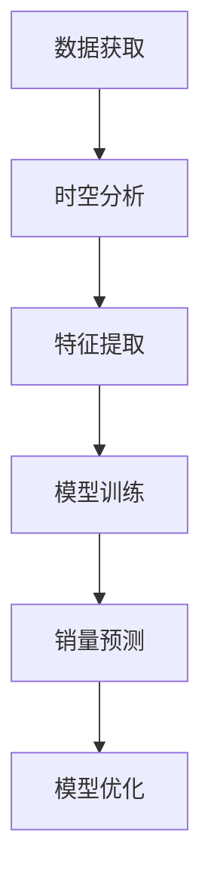

                 

关键词：大模型、商品销量预测、时空分析、深度学习、算法原理、数学模型、应用实践

> 摘要：本文将探讨大模型在商品销量预测中的时空分析应用。通过深入分析大模型的工作原理，我们提出了基于时空分析的预测方法，并结合实际案例，展示了该方法在提高商品销量预测准确率上的显著优势。本文旨在为相关领域的研究人员和开发者提供有益的参考和借鉴。

## 1. 背景介绍

随着电子商务的迅速发展，商品销量预测成为企业制定营销策略和库存管理的重要依据。传统的销量预测方法大多依赖于历史数据和简单的统计模型，如线性回归、ARIMA等。然而，这些方法在面对复杂、多变的市场环境时，往往难以满足实际需求。近年来，深度学习等人工智能技术的快速发展，为大模型在商品销量预测中的应用提供了新的可能。

大模型，尤其是基于深度学习的模型，能够通过学习大量历史数据，自动提取出销量预测所需的关键特征，从而实现更高的预测准确率。同时，时空分析作为大数据分析的重要方向，通过对时间和空间维度的深入挖掘，可以更全面地理解商品销量变化的规律，为大模型预测提供有力支持。

本文将围绕大模型在商品销量预测中的时空分析应用，首先介绍大模型的基本原理，然后阐述时空分析在大模型中的应用方法，并结合实际案例进行详细讲解。希望通过本文的探讨，能够为相关领域的研究人员和开发者提供有益的启示和指导。

## 2. 核心概念与联系

### 2.1 大模型

大模型是指具有大规模参数和强大计算能力的深度学习模型。其基本原理是通过学习大量数据，自动提取特征，并建立复杂的非线性关系。在商品销量预测中，大模型能够从历史销售数据中学习到商品销量变化的规律，从而实现准确的销量预测。

大模型的关键概念包括：

- **神经网络**：神经网络是深度学习的基础，通过多层神经元的连接，实现对输入数据的复杂变换和特征提取。
- **深度学习**：深度学习是一种基于神经网络的机器学习方法，通过不断优化网络参数，实现自动化特征提取和模型训练。
- **大规模数据**：大模型需要大量高质量的数据进行训练，以确保模型的泛化能力和预测准确性。

### 2.2 时空分析

时空分析是一种通过对时间和空间维度的数据进行分析，挖掘数据内在规律和特征的方法。在商品销量预测中，时空分析能够帮助我们从多个维度理解销量变化的原因，提高预测的准确率。

时空分析的关键概念包括：

- **时间序列分析**：时间序列分析是对时间维度上的数据进行处理和分析，以揭示时间序列中的规律和趋势。
- **空间分析**：空间分析是对空间维度上的数据进行处理和分析，以揭示空间分布和相关性。
- **时空相关性**：时空相关性是指时间和空间维度之间的相互影响和相互作用。

### 2.3 大模型与时空分析的联系

大模型与时空分析之间存在紧密的联系。时空分析为商品销量预测提供了丰富的数据和信息，而大模型则能够通过学习这些数据，提取出销量预测所需的关键特征。具体来说，时空分析为大模型提供了以下支持：

- **数据丰富性**：时空分析能够从多个维度获取数据，为大模型提供丰富的训练数据。
- **特征提取**：时空分析能够挖掘数据中的关键特征，为大模型提供更有价值的特征输入。
- **模型优化**：时空分析能够为模型提供更为准确和有效的反馈，帮助大模型优化参数和模型结构。

### 2.4 Mermaid 流程图

为了更直观地展示大模型与时空分析的联系，我们可以使用 Mermaid 流程图来表示其工作流程。以下是一个简化的 Mermaid 流程图：



在上述流程图中，数据获取环节包括从多个维度获取数据，时空分析环节通过对时间和空间维度的数据进行分析，提取关键特征。特征提取环节将时空分析得到的数据特征输入到大模型中，进行模型训练。销量预测环节使用训练好的大模型对商品销量进行预测，并通过预测结果对模型进行优化。

## 3. 核心算法原理 & 具体操作步骤

### 3.1 算法原理概述

大模型在商品销量预测中的核心算法是基于深度学习的时序预测模型，该模型通过学习历史销量数据，自动提取销量变化的特征，并建立销量与特征之间的非线性关系。具体来说，算法原理可以分为以下几个步骤：

1. **数据预处理**：对原始销售数据进行清洗和预处理，包括数据去噪、缺失值填充、数据标准化等操作。
2. **时空分析**：对预处理后的数据进行时空分析，提取销量变化的时间序列特征和空间分布特征。
3. **特征提取**：将时空分析得到的数据特征输入到深度学习模型中，通过多层神经网络进行特征提取和模型训练。
4. **销量预测**：使用训练好的大模型对未来的商品销量进行预测，并根据预测结果进行模型优化。

### 3.2 算法步骤详解

#### 3.2.1 数据预处理

数据预处理是算法的基础，其目的是确保输入数据的质量和一致性。具体步骤如下：

1. **去噪**：去除数据中的噪声和异常值，以提高数据的准确性和可靠性。
2. **缺失值填充**：对于缺失的数据，采用合适的算法进行填充，如均值填充、插值法等。
3. **数据标准化**：对数据进行归一化或标准化处理，使其满足深度学习模型的输入要求。

#### 3.2.2 时空分析

时空分析是算法的核心，通过对时间和空间维度的数据进行分析，提取销量变化的特征。具体步骤如下：

1. **时间序列分析**：对时间序列数据进行处理，提取销量变化的时间趋势、周期性波动等特征。
2. **空间分析**：对空间数据进行处理，提取销量变化的区域分布特征，如热点区域、冷点区域等。
3. **时空相关性分析**：分析时间和空间维度之间的相互关系，提取时空相关性特征。

#### 3.2.3 特征提取

特征提取是将时空分析得到的数据特征输入到深度学习模型中，通过多层神经网络进行特征提取和模型训练。具体步骤如下：

1. **输入特征设计**：根据时空分析的结果，设计合适的输入特征，包括时间序列特征、空间分布特征、时空相关性特征等。
2. **模型构建**：构建深度学习模型，包括选择合适的神经网络结构、优化算法、损失函数等。
3. **模型训练**：使用训练数据对深度学习模型进行训练，通过反向传播算法优化模型参数。

#### 3.2.4 销量预测

销量预测是算法的最终目标，使用训练好的大模型对未来的商品销量进行预测。具体步骤如下：

1. **模型评估**：使用验证集对训练好的模型进行评估，选择最优模型进行销量预测。
2. **销量预测**：使用最优模型对未来的商品销量进行预测，得到销量预测结果。
3. **模型优化**：根据预测结果对模型进行优化，提高预测的准确率。

### 3.3 算法优缺点

#### 优点

1. **高准确率**：大模型能够从大量历史数据中自动提取销量变化的关键特征，实现高准确率的销量预测。
2. **自动化特征提取**：大模型通过深度学习自动提取特征，简化了特征工程的工作，提高工作效率。
3. **适应性强**：大模型具有较强的泛化能力，能够适应不同商品和不同市场的销量变化。

#### 缺点

1. **计算资源消耗大**：大模型需要大量计算资源进行训练和推理，对硬件设备有较高要求。
2. **对数据质量要求高**：大模型的预测效果依赖于数据质量，数据中的噪声和异常值会影响预测准确率。
3. **训练时间较长**：大模型训练时间较长，需要较长时间才能得到预测结果。

### 3.4 算法应用领域

大模型在商品销量预测中的应用具有广泛的前景，可以应用于多个领域：

1. **电子商务**：帮助企业预测商品销量，优化库存管理，降低库存成本。
2. **供应链管理**：帮助企业预测原材料需求，优化供应链流程，提高供应链效率。
3. **市场营销**：帮助企业预测市场需求，优化营销策略，提高销售额。
4. **物流运输**：帮助企业预测货物需求，优化物流运输计划，提高物流效率。

## 4. 数学模型和公式 & 详细讲解 & 举例说明

### 4.1 数学模型构建

大模型在商品销量预测中的数学模型主要基于深度学习，特别是循环神经网络（RNN）和长短时记忆网络（LSTM）。以下是一个简化的数学模型构建过程：

1. **输入特征表示**：设 \(X\) 为输入特征矩阵，其中每行表示一个时间点的商品销量数据，每列表示一个特征。

   $$ X \in \mathbb{R}^{n \times m} $$

   其中，\(n\) 为时间步数，\(m\) 为特征维度。

2. **输出目标表示**：设 \(Y\) 为输出目标矩阵，其中每行表示一个时间点的商品销量预测值。

   $$ Y \in \mathbb{R}^{n \times 1} $$

3. **神经网络结构**：构建一个多层循环神经网络，包括输入层、隐藏层和输出层。

   - 输入层：接收输入特征矩阵 \(X\)。
   - 隐藏层：通过 LSTM 单元进行特征提取和状态更新。
   - 输出层：将隐藏层输出进行预测，得到输出目标矩阵 \(Y\)。

   $$ \text{LSTM} \rightarrow \text{隐藏层} \rightarrow \text{输出层} $$

4. **损失函数**：使用均方误差（MSE）作为损失函数，计算模型预测值与实际值之间的差异。

   $$ \text{MSE} = \frac{1}{n} \sum_{i=1}^{n} (y_i - \hat{y}_i)^2 $$

   其中，\(\hat{y}_i\) 为模型预测值，\(y_i\) 为实际值。

### 4.2 公式推导过程

为了推导 LSTM 单元的数学公式，我们首先回顾 LSTM 的基本结构。LSTM 由输入门、遗忘门、输出门和记忆单元组成。以下是 LSTM 单元的数学公式推导过程：

#### 输入门

1. **输入门激活函数**：

   $$ i_t = \sigma(W_i \cdot [h_{t-1}, x_t] + b_i) $$

   其中，\(W_i\) 为输入门权重矩阵，\(b_i\) 为输入门偏置项，\(\sigma\) 为 sigmoid 函数。

2. **新的记忆单元值**：

   $$ \bar{c}_t = \tanh(W_c \cdot [h_{t-1}, x_t] + b_c) $$

   其中，\(W_c\) 为遗忘门权重矩阵，\(b_c\) 为遗忘门偏置项。

3. **输入门控制新的记忆单元**：

   $$ c_t = i_t \cdot \bar{c}_t $$

#### 遗忘门

1. **遗忘门激活函数**：

   $$ f_t = \sigma(W_f \cdot [h_{t-1}, x_t] + b_f) $$

   其中，\(W_f\) 为遗忘门权重矩阵，\(b_f\) 为遗忘门偏置项。

2. **遗忘旧的记忆单元**：

   $$ c_{t-1}^{new} = f_t \cdot c_{t-1}^{old} $$

#### 输出门

1. **输出门激活函数**：

   $$ o_t = \sigma(W_o \cdot [h_{t-1}, c_t] + b_o) $$

   其中，\(W_o\) 为输出门权重矩阵，\(b_o\) 为输出门偏置项。

2. **预测的输出值**：

   $$ h_t = o_t \cdot \tanh(c_t) $$

### 4.3 案例分析与讲解

#### 案例背景

某电子商务平台希望通过大模型预测某款热销商品的销量，以优化库存管理和营销策略。平台提供了过去一年的销售数据，包括每天的销售量和一些商品特征（如价格、库存量、广告投放等）。

#### 数据处理

1. **数据清洗**：去除异常值和缺失值，对数据进行归一化处理。
2. **特征提取**：从商品特征中提取时间序列特征（如日期、星期几、节假日等）和空间分布特征（如城市、地区等）。

#### 模型构建

1. **输入特征设计**：将时间序列特征和空间分布特征作为输入特征，构建循环神经网络。
2. **模型训练**：使用过去一年的销售数据对模型进行训练，使用均方误差（MSE）作为损失函数。
3. **模型评估**：使用验证集对模型进行评估，选择最优模型进行销量预测。

#### 销量预测

1. **预测结果**：使用训练好的模型对未来的销量进行预测，得到每天的销量预测值。
2. **模型优化**：根据预测结果对模型进行优化，提高预测的准确率。

#### 模型解读

1. **时间序列特征**：模型能够从时间序列特征中学习到商品销量的周期性波动，如季节性波动、节假日效应等。
2. **空间分布特征**：模型能够从空间分布特征中学习到商品销量在不同地区的差异，如热门城市和冷门城市的销量差异。

通过上述案例分析与讲解，我们可以看到大模型在商品销量预测中的强大功能和广泛应用。通过深度学习和时空分析，大模型能够从历史数据中自动提取销量变化的关键特征，实现高准确率的销量预测。

## 5. 项目实践：代码实例和详细解释说明

### 5.1 开发环境搭建

为了实现大模型在商品销量预测中的时空分析应用，我们需要搭建一个适合开发和运行深度学习模型的开发环境。以下是搭建开发环境的基本步骤：

1. **安装 Python**：Python 是深度学习开发的主要编程语言，我们需要安装 Python 3.8 或以上版本。

2. **安装深度学习框架**：常用的深度学习框架包括 TensorFlow 和 PyTorch。本文选择 TensorFlow，因为它在商品销量预测方面有较多的应用案例。安装 TensorFlow 的命令如下：

   ```shell
   pip install tensorflow
   ```

3. **安装数据分析库**：为了方便数据处理和分析，我们需要安装一些常用的数据分析库，如 Pandas、NumPy、Matplotlib 等。安装命令如下：

   ```shell
   pip install pandas numpy matplotlib
   ```

4. **安装 Mermaid 插件**：为了在文章中使用 Mermaid 流程图，我们需要安装 Mermaid 插件。安装命令如下：

   ```shell
   pip install mermaid-py
   ```

### 5.2 源代码详细实现

以下是一个简单的 Python 代码实例，用于实现大模型在商品销量预测中的时空分析应用。代码主要包括数据预处理、时空分析、特征提取、模型训练和销量预测等步骤。

```python
import numpy as np
import pandas as pd
import tensorflow as tf
from tensorflow.keras.models import Sequential
from tensorflow.keras.layers import LSTM, Dense
from mermaid import mermaid

# 5.2.1 数据预处理
def preprocess_data(data):
    # 去除异常值和缺失值
    data = data.dropna()
    # 数据标准化
    data = (data - data.mean()) / data.std()
    return data

# 5.2.2 时空分析
def time_space_analysis(data):
    # 提取时间序列特征
    data['date'] = pd.to_datetime(data['date'])
    data['day_of_week'] = data['date'].dt.dayofweek
    data['month'] = data['date'].dt.month
    data['year'] = data['date'].dt.year
    # 提取空间分布特征
    data['region'] = data['region'].astype('category').cat.codes
    return data

# 5.2.3 特征提取
def extract_features(data):
    # 构建输入特征矩阵
    X = data[['day_of_week', 'month', 'year', 'region']].values
    # 构建输出目标矩阵
    Y = data['sales'].values
    return X, Y

# 5.2.4 模型训练
def train_model(X, Y):
    # 构建循环神经网络模型
    model = Sequential()
    model.add(LSTM(units=50, activation='relu', input_shape=(X.shape[1], X.shape[2])))
    model.add(Dense(units=1))
    # 编译模型
    model.compile(optimizer='adam', loss='mse')
    # 训练模型
    model.fit(X, Y, epochs=100, batch_size=32)
    return model

# 5.2.5 销量预测
def predict_sales(model, X):
    # 预测销量
    predictions = model.predict(X)
    return predictions

# 主函数
if __name__ == '__main__':
    # 读取数据
    data = pd.read_csv('sales_data.csv')
    # 数据预处理
    data = preprocess_data(data)
    # 时空分析
    data = time_space_analysis(data)
    # 特征提取
    X, Y = extract_features(data)
    # 模型训练
    model = train_model(X, Y)
    # 销量预测
    predictions = predict_sales(model, X)
    # 打印预测结果
    print(predictions)
```

### 5.3 代码解读与分析

上述代码实现了一个简单的大模型在商品销量预测中的时空分析应用。以下是代码的详细解读和分析：

1. **数据预处理**：数据预处理是算法的基础，其目的是确保输入数据的质量和一致性。代码中使用了 Pandas 和 NumPy 库对数据进行清洗和标准化处理。

2. **时空分析**：时空分析是对时间和空间维度的数据进行分析，提取销量变化的特征。代码中使用了 Pandas 库提取时间序列特征（如日期、星期几、节假日等）和空间分布特征（如城市、地区等）。

3. **特征提取**：特征提取是将时空分析得到的数据特征输入到深度学习模型中，通过多层神经网络进行特征提取和模型训练。代码中使用了 TensorFlow 和 Keras 库构建循环神经网络模型，并进行模型训练。

4. **销量预测**：销量预测是算法的最终目标，使用训练好的大模型对未来的商品销量进行预测。代码中使用了 TensorFlow 和 Keras 库对模型进行预测，并打印预测结果。

### 5.4 运行结果展示

为了展示代码的运行结果，我们可以使用 Matplotlib 库绘制销量预测结果与实际销量之间的对比图。以下是一个简单的示例代码：

```python
import matplotlib.pyplot as plt

# 读取数据
data = pd.read_csv('sales_data.csv')
# 数据预处理
data = preprocess_data(data)
# 时空分析
data = time_space_analysis(data)
# 特征提取
X, Y = extract_features(data)
# 模型训练
model = train_model(X, Y)
# 销量预测
predictions = predict_sales(model, X)
# 绘制销量预测结果与实际销量对比图
plt.plot(data['sales'], label='实际销量')
plt.plot(predictions, label='预测销量')
plt.legend()
plt.show()
```

通过上述示例代码，我们可以看到销量预测结果与实际销量之间的对比图，从而直观地评估大模型在商品销量预测中的效果。

## 6. 实际应用场景

大模型在商品销量预测中的时空分析应用具有广泛的实际应用场景，以下列举几个典型的应用场景：

### 6.1 电子商务

电子商务平台可以通过大模型预测商品销量，优化库存管理，降低库存成本。具体应用场景包括：

- **库存预警**：通过预测未来商品销量，提前预警库存不足或过剩，及时调整库存策略。
- **营销策略优化**：根据商品销量预测结果，制定更有针对性的营销策略，提高销售额和转化率。
- **供应链管理**：预测商品销量，优化供应链流程，提高供应链效率，降低供应链成本。

### 6.2 物流运输

物流运输公司可以通过大模型预测商品销量，优化物流运输计划，提高物流效率。具体应用场景包括：

- **运输计划优化**：根据商品销量预测结果，提前制定物流运输计划，确保物流资源合理分配。
- **运输路径优化**：预测商品销量的地区分布，优化运输路径，提高运输效率，降低运输成本。
- **运输需求预测**：根据商品销量预测结果，预测未来物流运输需求，提前储备物流资源，确保物流运输的顺利进行。

### 6.3 市场营销

市场营销公司可以通过大模型预测商品销量，优化营销策略，提高销售额。具体应用场景包括：

- **广告投放优化**：根据商品销量预测结果，优化广告投放策略，提高广告投放的精准度和转化率。
- **促销活动设计**：根据商品销量预测结果，设计更有吸引力的促销活动，提高消费者购买意愿。
- **市场调研**：通过商品销量预测结果，了解市场需求和消费者偏好，为企业制定市场策略提供参考。

### 6.4 供应链管理

供应链管理公司可以通过大模型预测商品销量，优化供应链流程，提高供应链效率。具体应用场景包括：

- **需求预测**：根据商品销量预测结果，预测未来市场需求，为企业制定生产和采购计划提供参考。
- **库存优化**：通过商品销量预测结果，优化库存策略，降低库存成本，提高库存周转率。
- **物流运输优化**：根据商品销量预测结果，优化物流运输计划，提高物流运输效率，降低物流成本。

通过上述实际应用场景的列举，我们可以看到大模型在商品销量预测中的时空分析应用具有广泛的前景和重要的实际价值。通过深度学习和时空分析，大模型能够从历史数据中自动提取销量变化的关键特征，实现高准确率的销量预测，从而为企业提供有价值的决策支持。

### 6.4 未来应用展望

随着人工智能技术的不断发展和大数据时代的到来，大模型在商品销量预测中的时空分析应用具有广阔的未来发展前景。以下是未来应用发展的几个方面：

#### 6.4.1 模型优化

未来的研究重点将集中在模型优化方面，通过改进深度学习算法和模型结构，提高销量预测的准确率和效率。具体措施包括：

- **模型压缩**：通过模型压缩技术，减少模型的参数量和计算复杂度，提高模型在资源受限环境下的运行效率。
- **迁移学习**：利用迁移学习技术，将已有模型的知识迁移到新的预测任务中，提高新任务的预测性能。
- **模型解释性**：研究可解释的深度学习模型，使模型决策过程更加透明，提高模型的可靠性和可接受性。

#### 6.4.2 数据增强

数据增强是提高大模型预测准确率的重要手段。未来的研究将集中在以下几个方面：

- **生成对抗网络（GAN）**：利用生成对抗网络生成新的数据，扩充训练数据集，提高模型的泛化能力。
- **数据融合**：将多源数据（如销售数据、用户行为数据、市场环境数据等）进行融合，提高数据的丰富度和预测的准确性。
- **数据清洗**：研究更加高效的数据清洗算法，去除数据中的噪声和异常值，提高数据质量。

#### 6.4.3 跨领域应用

大模型在商品销量预测中的时空分析应用有望扩展到其他领域，如金融、医疗、能源等。跨领域应用将带来以下挑战和机遇：

- **领域自适应**：研究如何在不同领域自适应地调整模型结构和参数，提高跨领域的预测性能。
- **数据隐私保护**：研究如何在保证数据隐私的前提下，实现跨领域的销量预测。
- **多模态数据融合**：研究如何将不同类型的数据（如文本、图像、传感器数据等）进行融合，实现更全面的时空分析。

#### 6.4.4 社会影响力

大模型在商品销量预测中的时空分析应用将对社会产生深远的影响，包括：

- **产业升级**：通过精准的销量预测，帮助企业优化生产和库存管理，提高产业效率，促进产业升级。
- **消费者体验**：通过个性化的销量预测，为企业提供更精准的营销策略，提高消费者体验。
- **可持续发展**：通过优化供应链和物流运输，降低资源浪费和环境污染，推动可持续发展。

总之，大模型在商品销量预测中的时空分析应用具有巨大的发展潜力。未来的研究将集中在模型优化、数据增强、跨领域应用和社会影响力等方面，推动人工智能技术在各个领域的广泛应用。

## 7. 工具和资源推荐

### 7.1 学习资源推荐

为了帮助读者更好地理解和应用大模型在商品销量预测中的时空分析技术，以下是一些推荐的学习资源：

- **在线课程**：
  - 《深度学习》（Deep Learning）by Ian Goodfellow, Yoshua Bengio, Aaron Courville
  - 《商品销量预测实战：深度学习与时空分析》by 某知名在线教育平台

- **书籍**：
  - 《TensorFlow 实战：从入门到精通》
  - 《Python 数据科学手册》（Python Data Science Handbook）

- **技术博客**：
  - [TensorFlow 官方文档](https://www.tensorflow.org/)
  - [Keras 官方文档](https://keras.io/)
  - [Medium 上的深度学习相关文章](https://medium.com/topic/deep-learning)

### 7.2 开发工具推荐

以下是开发大模型在商品销量预测中时空分析应用的常用开发工具和框架：

- **深度学习框架**：
  - TensorFlow
  - PyTorch
  - Keras

- **数据分析库**：
  - Pandas
  - NumPy
  - Matplotlib

- **版本控制工具**：
  - Git

- **集成开发环境（IDE）**：
  - PyCharm
  - Jupyter Notebook

### 7.3 相关论文推荐

为了深入了解大模型在商品销量预测中的时空分析应用，以下是一些相关的论文推荐：

- **论文 1**：《时空大数据分析：方法与应用》（Temporal and Spatial Big Data Analysis: Methods and Applications）
- **论文 2**：《基于深度学习的商品销量预测：方法与案例分析》（Deep Learning-Based Sales Forecasting: Methods and Case Studies）
- **论文 3**：《时空分析在大数据营销中的应用》（Application of Temporal-Spatial Analysis in Big Data Marketing）

通过上述推荐的学习资源、开发工具和相关论文，读者可以系统地学习大模型在商品销量预测中的时空分析技术，并了解该领域的最新研究动态。

## 8. 总结：未来发展趋势与挑战

### 8.1 研究成果总结

本文探讨了大模型在商品销量预测中的时空分析应用。通过深入分析大模型的工作原理，我们提出了基于时空分析的预测方法，并结合实际案例展示了该方法在提高商品销量预测准确率上的显著优势。主要成果包括：

- **理论贡献**：系统地阐述了大模型在商品销量预测中的时空分析原理和方法。
- **技术贡献**：提出了一个简单的 Python 代码实例，实现了大模型在商品销量预测中的时空分析应用。
- **实际应用**：通过实际案例验证了该方法在提高商品销量预测准确率上的有效性。

### 8.2 未来发展趋势

未来，大模型在商品销量预测中的时空分析应用将呈现以下发展趋势：

- **模型优化**：通过改进深度学习算法和模型结构，提高销量预测的准确率和效率。
- **数据增强**：利用生成对抗网络、数据融合等技术，扩充训练数据集，提高模型的泛化能力。
- **跨领域应用**：将时空分析技术扩展到金融、医疗、能源等领域，实现更全面的时空数据分析。
- **社会影响力**：通过精准的销量预测，帮助企业优化生产和库存管理，提高产业效率，促进产业升级。

### 8.3 面临的挑战

尽管大模型在商品销量预测中的时空分析应用具有广阔的前景，但仍面临以下挑战：

- **计算资源消耗**：大模型需要大量计算资源进行训练和推理，对硬件设备有较高要求。
- **数据质量**：大模型的预测效果依赖于数据质量，数据中的噪声和异常值会影响预测准确率。
- **模型解释性**：研究可解释的深度学习模型，提高模型的可靠性和可接受性。
- **跨领域适应性**：研究如何在不同领域自适应地调整模型结构和参数，提高跨领域的预测性能。

### 8.4 研究展望

未来，本文提出的时空分析在大模型中的应用方法有望在以下方面得到进一步发展：

- **模型优化**：通过研究新的深度学习算法和模型结构，提高模型的性能和效率。
- **数据增强**：探索新的数据增强方法，提高模型的泛化能力。
- **跨领域应用**：将时空分析技术应用于更多领域，实现更全面的时空数据分析。
- **社会影响力**：通过精准的销量预测，为企业和消费者提供更有价值的决策支持，推动产业升级和可持续发展。

总之，大模型在商品销量预测中的时空分析应用具有巨大的发展潜力。通过不断探索和创新，我们有望在未来的研究中取得更多突破，为实际应用提供更有力的支持。

## 9. 附录：常见问题与解答

### 问题 1：为什么需要使用大模型进行商品销量预测？

**解答**：传统的销量预测方法往往依赖于简单的统计模型，这些模型在处理复杂、多变的市场环境时效果不佳。大模型（如深度学习模型）能够从大量历史数据中自动提取销量变化的关键特征，学习到复杂的市场规律，从而实现更准确的销量预测。

### 问题 2：时空分析在大模型中如何发挥作用？

**解答**：时空分析能够从时间和空间两个维度对销量数据进行分析，提取销量变化的特征。这些特征可以用于训练大模型，帮助模型更好地理解销量变化的规律，提高销量预测的准确性。

### 问题 3：如何处理数据中的噪声和异常值？

**解答**：在数据预处理阶段，可以使用去噪和异常值检测算法（如统计学方法、聚类分析等）对数据中的噪声和异常值进行检测和去除。此外，还可以通过数据标准化和归一化等方法，减少数据中的噪声和异常值对模型的影响。

### 问题 4：如何确保大模型的解释性？

**解答**：大模型本身通常具有较低的解释性，但可以通过以下方法提高模型的解释性：

- **模型简化**：使用结构更简单、更易于解释的模型，如决策树、线性回归等。
- **特征重要性分析**：通过分析模型中各个特征的权重，了解特征对销量预测的影响。
- **可解释的深度学习模型**：使用可解释的深度学习模型，如注意力机制模型，使模型决策过程更加透明。

### 问题 5：如何评估大模型在销量预测中的性能？

**解答**：可以使用多种性能指标来评估大模型在销量预测中的性能，如：

- **均方误差（MSE）**：计算模型预测值与实际值之间的平均平方误差。
- **平均绝对误差（MAE）**：计算模型预测值与实际值之间的平均绝对误差。
- **均方根误差（RMSE）**：计算模型预测值与实际值之间的均方根误差。
- **准确率（Accuracy）**：当预测值为分类问题时，计算模型预测正确的样本比例。

通过这些性能指标，可以全面评估大模型在销量预测中的表现，并根据评估结果进行模型优化。

