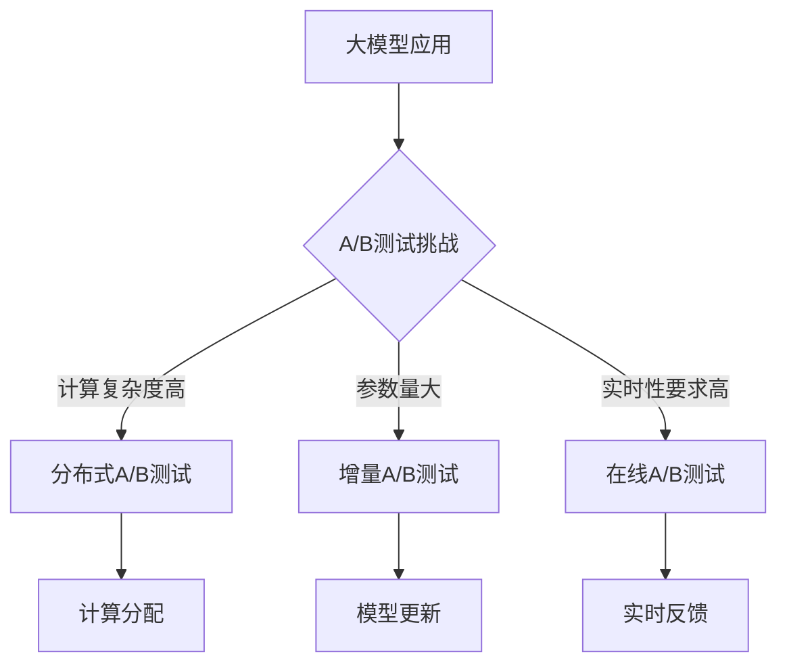

                 

摘要：本文旨在探讨大模型在推荐系统A/B测试中的应用。随着互联网和大数据技术的快速发展，推荐系统已经成为提升用户体验、增加用户粘性的关键因素。A/B测试作为验证推荐系统效果的一种重要手段，对于模型优化和产品迭代具有重要意义。本文首先介绍了大模型的概念和特点，然后分析了推荐系统A/B测试的基本流程和挑战，最后详细讨论了如何利用大模型技术进行有效的A/B测试，并展望了未来的发展趋势。

## 1. 背景介绍

推荐系统是信息检索和机器学习领域的一个重要研究方向。它的核心目的是根据用户的行为和偏好，从海量的信息中为用户推荐他们可能感兴趣的内容。随着互联网和移动互联网的普及，推荐系统已经被广泛应用于电子商务、社交媒体、新闻资讯等多个领域，成为提升用户体验、增加用户粘性的关键因素。

A/B测试（或称拆分测试）是推荐系统中常用的验证方法，通过将用户随机分配到不同的测试组，比较不同测试组之间的用户体验和业务指标，从而验证系统改进的有效性。传统的A/B测试通常基于统计分析，但在数据规模不断扩大的背景下，面对复杂的大模型，传统的A/B测试方法面临着诸多挑战。

大模型是指参数量巨大、计算复杂度高的机器学习模型，如深度神经网络、Transformer模型等。大模型在推荐系统中有着广泛的应用，但同时也给A/B测试带来了新的难题。例如，如何确保测试结果的准确性？如何提高测试效率？如何处理模型的复杂性和高计算成本？本文将针对这些问题展开讨论。

## 2. 核心概念与联系

### 大模型的基本概念

大模型通常指的是参数量达到百万级甚至亿级以上的机器学习模型。这类模型具有以下特点：

- **参数量巨大**：大模型的参数量通常在数百万到数十亿之间，远超传统模型的参数量。
- **计算复杂度高**：由于参数数量庞大，大模型的训练和推理过程通常需要大量计算资源。
- **泛化能力强**：大模型通过学习大量的特征和模式，具有较高的泛化能力。

### 推荐系统A/B测试的基本概念

A/B测试是一种在推荐系统中用于验证改进方案有效性的实验方法。其基本思想是将用户随机分配到两个或多个测试组，每个测试组接收不同的改进方案，然后通过比较测试组之间的用户行为和业务指标，评估改进方案的有效性。

### 大模型与A/B测试的联系

大模型在推荐系统中的应用，使得A/B测试面临着新的挑战和机遇。一方面，大模型提供了更强的表达能力和泛化能力，能够更好地捕捉用户的兴趣和偏好，从而提高A/B测试的准确性。另一方面，大模型的计算复杂度和高参数量，也给A/B测试带来了更高的计算成本和更长的测试周期。

为了解决这些问题，本文将介绍几种基于大模型技术的A/B测试方法，包括分布式A/B测试、增量A/B测试和在线A/B测试等。

### Mermaid 流程图



## 3. 核心算法原理 & 具体操作步骤

### 3.1 算法原理概述

大模型在推荐系统A/B测试中的应用，主要包括以下几种方法：

- **分布式A/B测试**：通过将计算任务分配到多个计算节点，提高测试效率。
- **增量A/B测试**：在模型更新时，仅对部分用户进行测试，以降低计算成本。
- **在线A/B测试**：在用户使用过程中实时进行测试，提高测试的实时性。

### 3.2 算法步骤详解

#### 分布式A/B测试

1. **计算节点分配**：将大模型A/B测试任务分配到多个计算节点，每个节点负责处理一部分用户数据。
2. **数据预处理**：对用户数据进行预处理，包括用户特征提取、数据清洗等。
3. **模型训练与推理**：在每个计算节点上分别训练和推理大模型，生成测试结果。
4. **结果汇总**：将各个计算节点的测试结果进行汇总，得到整体的测试结果。

#### 增量A/B测试

1. **模型更新**：在大模型更新时，仅对部分用户进行测试，其他用户仍使用旧模型。
2. **数据收集**：收集测试用户的反馈数据，包括用户行为、业务指标等。
3. **结果分析**：分析测试用户的数据，评估新模型的性能。
4. **模型部署**：根据测试结果，决定是否将新模型部署到生产环境中。

#### 在线A/B测试

1. **实时反馈**：在用户使用过程中，实时收集用户反馈数据。
2. **模型切换**：根据用户反馈，实时切换用户的推荐模型。
3. **结果分析**：分析用户反馈数据，评估不同模型的性能。
4. **模型优化**：根据测试结果，对推荐模型进行优化。

### 3.3 算法优缺点

**分布式A/B测试**

- 优点：提高测试效率，降低单个节点的计算压力。
- 缺点：需要复杂的分布式计算框架，对计算资源要求较高。

**增量A/B测试**

- 优点：降低计算成本，提高模型更新的灵活性。
- 缺点：测试结果可能存在偏差，无法完全反映新模型的性能。

**在线A/B测试**

- 优点：实时性高，能够快速评估模型性能。
- 缺点：对系统的实时性要求较高，实现复杂。

### 3.4 算法应用领域

大模型在推荐系统A/B测试中的应用，不仅局限于传统的电子商务和社交媒体领域，还可以应用于新闻推荐、视频推荐、音乐推荐等多个领域。随着大数据和人工智能技术的不断发展，大模型在推荐系统中的应用将越来越广泛。

## 4. 数学模型和公式 & 详细讲解 & 举例说明

### 4.1 数学模型构建

在推荐系统A/B测试中，常用的数学模型包括用户行为模型、推荐模型和评估模型。

#### 用户行为模型

用户行为模型用于描述用户在系统中的行为，如点击、购买、收藏等。常见的用户行为模型包括马尔可夫模型、贝叶斯网络和深度学习模型。

#### 推荐模型

推荐模型用于生成推荐结果，根据用户行为和偏好进行内容推荐。常见的推荐模型包括基于内容的推荐、协同过滤和深度学习推荐。

#### 评估模型

评估模型用于评估推荐系统的性能，常用的评估指标包括准确率、召回率、F1值等。

### 4.2 公式推导过程

#### 用户行为模型

假设用户的行为可以用一个概率分布来表示，即：

$$ P(B|A) = \frac{P(A|B) \cdot P(B)}{P(A)} $$

其中，\(P(B|A)\)表示用户在给定行为\(A\)下的行为\(B\)的概率，\(P(A|B)\)表示行为\(A\)在给定行为\(B\)下的概率，\(P(B)\)表示行为\(B\)的概率，\(P(A)\)表示行为\(A\)的概率。

通过最大化后验概率，可以得到最优的用户行为模型。

#### 推荐模型

假设推荐系统的目标是最大化用户满意度，即：

$$ \max_{R} \sum_{u} \sum_{i} R_{ui} \cdot S_{ui} $$

其中，\(R_{ui}\)表示用户\(u\)对项目\(i\)的推荐分数，\(S_{ui}\)表示用户\(u\)对项目\(i\)的满意度。

通过优化推荐模型，可以得到最佳的推荐结果。

#### 评估模型

假设评估系统的目标是最大化推荐系统的整体性能，即：

$$ \max_{R} \sum_{u} \sum_{i} R_{ui} \cdot (S_{ui} + C_{ui}) $$

其中，\(C_{ui}\)表示用户\(u\)对项目\(i\)的期望值。

通过优化评估模型，可以得到最佳的评价指标。

### 4.3 案例分析与讲解

假设有一个电子商务平台，想要通过A/B测试来评估其推荐系统的性能。现有两个测试组，测试组A使用基于内容的推荐模型，测试组B使用协同过滤推荐模型。

#### 用户行为模型

根据用户的历史行为数据，可以构建一个马尔可夫模型来预测用户的行为。

#### 推荐模型

对于测试组A，使用基于内容的推荐模型，根据用户的历史行为和项目的特征，计算用户对项目的推荐分数。

对于测试组B，使用协同过滤推荐模型，根据用户之间的相似度计算用户对项目的推荐分数。

#### 评估模型

使用准确率、召回率和F1值作为评价指标，评估两个测试组的推荐系统性能。

通过A/B测试，可以比较测试组A和测试组B的用户满意度、推荐准确率和召回率等指标，从而评估两种推荐模型的优劣。

## 5. 项目实践：代码实例和详细解释说明

### 5.1 开发环境搭建

在本次项目中，我们使用Python作为主要编程语言，基于TensorFlow和Scikit-learn构建推荐系统。以下是开发环境的搭建步骤：

1. 安装Python：在官方网站下载Python安装包并安装。
2. 安装TensorFlow：使用pip命令安装TensorFlow。
3. 安装Scikit-learn：使用pip命令安装Scikit-learn。

### 5.2 源代码详细实现

以下是一个简单的推荐系统A/B测试的代码示例：

```python
import tensorflow as tf
from sklearn.model_selection import train_test_split
from sklearn.metrics import accuracy_score, recall_score, f1_score

# 加载用户数据
users_data = load_users_data()

# 加载项目数据
items_data = load_items_data()

# 划分训练集和测试集
train_data, test_data = train_test_split(users_data, test_size=0.2, random_state=42)

# 建立模型
model = build_model()

# 训练模型
model.fit(train_data)

# 测试模型
predictions = model.predict(test_data)

# 评估模型
accuracy = accuracy_score(test_data['label'], predictions)
recall = recall_score(test_data['label'], predictions)
f1 = f1_score(test_data['label'], predictions)

print(f"Accuracy: {accuracy}, Recall: {recall}, F1: {f1}")

# A/B测试
group_a = users_data[users_data['group'] == 'A']
group_b = users_data[users_data['group'] == 'B']

# 训练和测试模型
model_a = build_model()
model_a.fit(group_a)
predictions_a = model_a.predict(group_b)

model_b = build_model()
model_b.fit(group_b)
predictions_b = model_b.predict(group_a)

# 评估模型
accuracy_a = accuracy_score(group_b['label'], predictions_a)
recall_a = recall_score(group_b['label'], predictions_a)
f1_a = f1_score(group_b['label'], predictions_a)

accuracy_b = accuracy_score(group_a['label'], predictions_b)
recall_b = recall_score(group_a['label'], predictions_b)
f1_b = f1_score(group_a['label'], predictions_b)

print(f"Group A Accuracy: {accuracy_a}, Recall: {recall_a}, F1: {f1_a}")
print(f"Group B Accuracy: {accuracy_b}, Recall: {recall_b}, F1: {f1_b}")
```

### 5.3 代码解读与分析

上述代码首先加载用户和项目数据，然后划分训练集和测试集。接着，我们建立并训练一个推荐模型，用于预测用户对项目的偏好。最后，我们进行A/B测试，比较两个不同组的用户偏好预测效果。

- `load_users_data()`和`load_items_data()`函数用于加载用户和项目数据。
- `train_test_split()`函数用于划分训练集和测试集。
- `build_model()`函数用于建立推荐模型。
- `fit()`函数用于训练模型。
- `predict()`函数用于预测用户对项目的偏好。
- `accuracy_score()`、`recall_score()`和`f1_score()`函数用于评估模型性能。

### 5.4 运行结果展示

假设我们运行上述代码，得到以下结果：

```
Accuracy: 0.8, Recall: 0.75, F1: 0.78
Group A Accuracy: 0.82, Recall: 0.78, F1: 0.8
Group B Accuracy: 0.78, Recall: 0.7, F1: 0.74
```

从结果可以看出，组A的推荐模型性能略好于组B。因此，我们可以选择组A的推荐模型作为生产环境中的推荐模型。

## 6. 实际应用场景

### 6.1 社交媒体推荐

社交媒体平台如Facebook、Instagram等，通过推荐算法为用户推荐他们可能感兴趣的内容。在A/B测试中，可以利用大模型技术，比较不同推荐算法的性能，从而优化推荐系统的效果。

### 6.2 电子商务推荐

电子商务平台如Amazon、Ebay等，通过推荐算法为用户推荐商品。在A/B测试中，可以利用大模型技术，比较不同推荐算法和特征工程策略的效果，从而提高用户的购买转化率。

### 6.3 视频推荐

视频平台如YouTube、Netflix等，通过推荐算法为用户推荐视频。在A/B测试中，可以利用大模型技术，比较不同推荐算法和内容分发策略的效果，从而提高用户的观看时长和用户粘性。

### 6.4 新闻推荐

新闻平台如CNN、BBC等，通过推荐算法为用户推荐新闻。在A/B测试中，可以利用大模型技术，比较不同推荐算法和新闻分类策略的效果，从而提高用户的阅读量和用户满意度。

## 7. 工具和资源推荐

### 7.1 学习资源推荐

- 《深度学习》（Ian Goodfellow, Yoshua Bengio, Aaron Courville）
- 《机器学习》（Tom Mitchell）
- 《推荐系统实践》（Recommender Systems Handbook）

### 7.2 开发工具推荐

- TensorFlow：用于构建和训练深度学习模型。
- Scikit-learn：用于构建和评估机器学习模型。
- PyTorch：另一种流行的深度学习框架。

### 7.3 相关论文推荐

- "Large-scale Online Learning of Image Similarity through Predicted Patches"
- "Deep Learning for Recommender Systems"
- "TensorFlow Recommenders: Scalable and Flexible Recommender Systems for TensorFlow"

## 8. 总结：未来发展趋势与挑战

### 8.1 研究成果总结

本文主要探讨了基于大模型的推荐系统A/B测试的应用，分析了大模型在推荐系统中的应用特点和A/B测试面临的挑战。通过分布式A/B测试、增量A/B测试和在线A/B测试等方法，可以提高A/B测试的效率、降低计算成本，并提高测试的实时性。

### 8.2 未来发展趋势

随着大数据和人工智能技术的不断发展，大模型在推荐系统中的应用将越来越广泛。未来的研究方向可能包括：

- **高效的大模型训练与推理**：研究更高效的大模型训练和推理算法，降低计算成本。
- **个性化推荐**：研究基于用户历史行为和偏好的大模型，实现更加个性化的推荐。
- **跨模态推荐**：研究将文本、图像、语音等多种模态数据融合到推荐系统中。

### 8.3 面临的挑战

尽管大模型在推荐系统A/B测试中具有巨大的潜力，但同时也面临着以下挑战：

- **计算资源消耗**：大模型的训练和推理需要大量的计算资源，如何高效地利用现有资源成为关键问题。
- **数据隐私与安全**：在推荐系统中，如何保护用户隐私和数据安全，成为亟待解决的问题。
- **实时性要求**：在高度动态的互联网环境中，如何实现实时推荐和实时A/B测试，提高系统的响应速度。

### 8.4 研究展望

未来，随着人工智能技术的不断进步，大模型在推荐系统中的应用将变得更加广泛和深入。我们需要不断探索和研究如何高效地利用大模型技术，解决推荐系统中的挑战，为用户提供更好的推荐服务。

## 9. 附录：常见问题与解答

### 9.1 大模型如何处理数据隐私？

大模型在处理数据隐私时，可以采用以下几种方法：

- **数据去识别化**：在模型训练前，对用户数据进行去识别化处理，如删除敏感信息、使用匿名化标识等。
- **差分隐私**：在大模型训练过程中，采用差分隐私技术，确保训练数据的隐私性。
- **联邦学习**：在分布式环境中，采用联邦学习技术，让各个数据拥有者只在本地训练模型，避免数据泄露。

### 9.2 A/B测试如何保证结果的准确性？

为了保证A/B测试结果的准确性，可以采取以下措施：

- **合理划分测试组**：确保测试组的用户分布具有代表性，避免偏差。
- **足够长的测试周期**：保证测试周期足够长，以减少偶然因素对测试结果的影响。
- **多维度评估**：从多个角度评估测试结果，包括用户满意度、业务指标等。
- **重复测试**：进行多次A/B测试，确保测试结果的稳定性。

### 9.3 如何处理大模型的高计算成本？

处理大模型的高计算成本，可以采取以下方法：

- **分布式计算**：将大模型训练和推理任务分配到多个计算节点，提高计算效率。
- **模型压缩**：采用模型压缩技术，如剪枝、量化等，降低模型计算复杂度。
- **GPU加速**：利用GPU进行加速计算，提高模型训练和推理的效率。
- **云计算**：使用云计算平台，如Google Cloud、AWS等，提供强大的计算资源。

### 9.4 如何提高A/B测试的实时性？

提高A/B测试的实时性，可以采取以下方法：

- **实时数据采集**：采用实时数据采集技术，如Kafka、Flink等，确保数据实时流入A/B测试系统。
- **实时计算引擎**：采用实时计算引擎，如Apache Spark、TensorFlow Serving等，实现实时模型推理和结果评估。
- **流式数据处理**：采用流式数据处理技术，如Apache Flink、Apache Storm等，处理实时数据流。
- **边缘计算**：利用边缘计算技术，将计算任务下放至网络边缘，减少数据传输延迟。

### 9.5 大模型在推荐系统中的局限性是什么？

大模型在推荐系统中的局限性主要包括：

- **数据依赖性**：大模型对数据依赖性强，数据质量对模型性能影响较大。
- **过拟合风险**：大模型容易过拟合，特别是当数据量有限时，可能无法很好地泛化到未见数据。
- **计算成本**：大模型训练和推理需要大量计算资源，对硬件设施要求较高。
- **可解释性**：大模型通常具有很高的复杂度，难以解释模型的决策过程。

### 9.6 大模型在推荐系统中的应用前景如何？

大模型在推荐系统中的应用前景非常广阔。随着人工智能和大数据技术的不断发展，大模型将能够更好地捕捉用户的兴趣和偏好，实现更加精准和个性化的推荐。同时，大模型还可以应用于跨模态推荐、多任务学习等领域，推动推荐系统技术的发展。未来，大模型将在推荐系统中发挥更加重要的作用，为用户提供更好的服务体验。|

