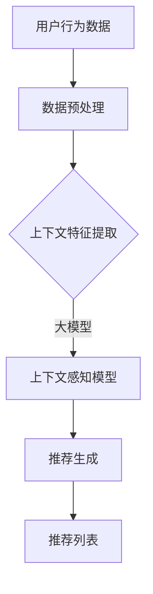

                 

关键词：大模型、推荐系统、上下文感知、算法、数学模型、应用场景、代码实例

> 摘要：本文探讨了大模型在推荐系统上下文感知中的应用，通过介绍核心概念、算法原理、数学模型以及项目实践，阐述了如何利用大模型提升推荐系统的上下文感知能力，提高推荐质量。本文旨在为研究者和实践者提供一种新的思路和方法，推动推荐系统领域的发展。

## 1. 背景介绍

在当今的信息时代，推荐系统已经成为许多在线服务和平台的核心组成部分。从电子商务网站到社交媒体平台，推荐系统旨在为用户提供个性化的内容，从而提高用户满意度和平台粘性。然而，随着用户生成内容和数据量的激增，传统推荐系统的效果逐渐受到挑战。为此，研究者们开始探索如何利用深度学习和大规模数据来提升推荐系统的性能。

上下文感知（Context-Awareness）是推荐系统中的一个重要研究方向。上下文信息包括用户的位置、时间、设备、偏好等多种因素，这些信息对于理解用户的真实需求和意图至关重要。传统推荐系统通常忽略上下文信息，或者仅使用简单的上下文特征进行建模，这限制了推荐系统的精度和灵活性。

近年来，大模型（Large-scale Models）在自然语言处理、计算机视觉等领域取得了显著的突破。大模型具有强大的表征能力和泛化能力，可以处理复杂、高维的数据，从而为推荐系统的上下文感知提供了新的可能性。本文将探讨大模型在推荐系统上下文感知中的应用，介绍相关算法、数学模型和项目实践。

## 2. 核心概念与联系

### 2.1 大模型

大模型是指具有数十亿到数万亿参数的深度学习模型。这些模型通常通过在大量数据上进行预训练，然后针对特定任务进行微调。大模型的优点包括：

1. **强大的表征能力**：能够捕捉数据中的复杂模式和关联。
2. **良好的泛化能力**：在未见过的数据上也能保持较高的性能。
3. **高效的处理能力**：可以通过并行计算和分布式训练快速处理大规模数据。

### 2.2 推荐系统

推荐系统是一种基于数据挖掘和机器学习技术的应用，旨在发现用户和项目之间的潜在关联，并向用户推荐可能感兴趣的项目。推荐系统通常包括以下几个关键组件：

1. **用户建模**：通过分析用户的历史行为和偏好，构建用户的兴趣模型。
2. **项目建模**：通过分析项目的属性和特征，构建项目的特征表示。
3. **推荐算法**：根据用户和项目的特征，为用户生成个性化的推荐列表。

### 2.3 上下文感知

上下文感知是指推荐系统在生成推荐时，能够考虑用户所处的上下文环境。上下文信息可以包括用户的地理位置、时间、设备类型、社交关系等。上下文感知能够提高推荐的相关性和实用性，使得推荐系统能够更好地满足用户的即时需求。

### 2.4 大模型与上下文感知的关联

大模型在推荐系统上下文感知中的应用主要体现在以下几个方面：

1. **上下文特征提取**：大模型可以通过预训练学习到丰富的上下文特征，从而提高特征提取的效率和效果。
2. **上下文建模**：大模型可以用于构建复杂的上下文模型，使得推荐系统能够更好地理解用户的上下文需求。
3. **动态上下文感知**：大模型能够实时更新和适应用户的上下文变化，从而提高推荐的动态性和适应性。

## 2.5 Mermaid 流程图



## 3. 核心算法原理 & 具体操作步骤

### 3.1 算法原理概述

大模型在推荐系统上下文感知中的应用主要基于以下几个步骤：

1. **数据预处理**：对用户行为数据和上下文信息进行清洗和预处理，以便于后续建模。
2. **上下文特征提取**：利用大模型对上下文信息进行特征提取，得到高维、丰富的上下文特征向量。
3. **上下文建模**：通过大模型训练得到上下文感知模型，该模型能够根据上下文特征和用户兴趣模型生成推荐列表。
4. **推荐生成**：利用上下文感知模型为用户生成个性化的推荐列表。

### 3.2 算法步骤详解

#### 3.2.1 数据预处理

数据预处理主要包括以下几个步骤：

1. **数据清洗**：去除重复、异常和噪声数据。
2. **数据整合**：将不同来源的数据进行整合，形成统一的数据集。
3. **特征工程**：对上下文信息进行特征提取，例如，将地理位置编码为地理坐标系，将时间编码为小时或天。

#### 3.2.2 上下文特征提取

上下文特征提取的主要步骤如下：

1. **预训练**：使用大规模的预训练模型（如BERT、GPT等）对上下文信息进行预训练。
2. **特征提取**：利用预训练模型提取上下文特征，通常采用平均池化或最大池化方式得到特征向量。

#### 3.2.3 上下文建模

上下文建模的步骤如下：

1. **模型架构**：构建一个包含嵌入层、多层神经网络和输出层的上下文感知模型。
2. **训练**：使用用户行为数据和上下文特征训练上下文感知模型。
3. **评估**：通过交叉验证和在线评估对模型进行评估和优化。

#### 3.2.4 推荐生成

推荐生成的步骤如下：

1. **用户兴趣建模**：使用用户历史行为数据构建用户兴趣模型。
2. **上下文感知推荐**：将用户兴趣模型和上下文感知模型结合，生成个性化的推荐列表。
3. **推荐列表排序**：使用排序算法（如基于梯度的排序、流行度排序等）对推荐列表进行排序。

### 3.3 算法优缺点

#### 优点

1. **强大的表征能力**：大模型能够提取丰富的上下文特征，提高推荐系统的精度和泛化能力。
2. **动态性**：大模型能够实时更新和适应用户的上下文变化，提高推荐的动态性。
3. **易用性**：大模型已经过预训练，可以直接应用于推荐系统，降低了模型开发和训练的难度。

#### 缺点

1. **计算资源消耗**：大模型需要大量的计算资源和存储空间。
2. **数据依赖性**：大模型的效果高度依赖于数据质量，如果数据存在噪声或偏差，可能导致模型性能下降。
3. **解释性不足**：大模型的内部结构和决策过程较为复杂，难以解释和理解。

### 3.4 算法应用领域

大模型在推荐系统上下文感知中的应用非常广泛，包括但不限于以下领域：

1. **电子商务**：为用户提供个性化的商品推荐。
2. **社交媒体**：为用户推荐感兴趣的内容和好友。
3. **在线教育**：根据用户的学习行为推荐相关课程。
4. **金融风控**：根据用户的行为数据预测金融风险。

## 4. 数学模型和公式 & 详细讲解 & 举例说明

### 4.1 数学模型构建

在推荐系统上下文感知中，我们可以构建一个基于大模型的推荐模型。该模型主要包括以下几个部分：

1. **用户行为矩阵**：表示用户与项目的交互记录，通常为一个稀疏矩阵。
2. **上下文特征矩阵**：表示用户的上下文信息，如地理位置、时间、设备等。
3. **用户兴趣向量**：表示用户对项目的偏好。
4. **项目特征向量**：表示项目的属性和特征。
5. **上下文感知矩阵**：表示上下文信息对用户兴趣的影响。

假设用户行为矩阵为 \( U \)，上下文特征矩阵为 \( C \)，用户兴趣向量为 \( q \)，项目特征向量为 \( p \)，上下文感知矩阵为 \( A \)。则推荐模型可以表示为：

\[ R = U \cdot A \cdot C \cdot (q \cdot p)^T \]

其中，\( R \) 表示推荐矩阵，表示用户对项目的推荐概率。

### 4.2 公式推导过程

1. **用户行为矩阵 \( U \)**：用户行为矩阵 \( U \) 表示用户与项目的交互记录。通常使用二值矩阵表示，即 \( U_{ij} = 1 \) 表示用户 \( i \) 对项目 \( j \) 有交互，\( U_{ij} = 0 \) 表示没有交互。

2. **上下文特征矩阵 \( C \)**：上下文特征矩阵 \( C \) 表示用户的上下文信息。例如，地理位置可以编码为地理坐标系，时间可以编码为小时或天。设 \( C_{ij} \) 表示用户 \( i \) 在项目 \( j \) 上的上下文特征。

3. **用户兴趣向量 \( q \)**：用户兴趣向量 \( q \) 表示用户对项目的偏好。可以通过用户的历史行为数据学习得到。

4. **项目特征向量 \( p \)**：项目特征向量 \( p \) 表示项目的属性和特征。例如，商品的特征可以是价格、品牌、类型等。

5. **上下文感知矩阵 \( A \)**：上下文感知矩阵 \( A \) 表示上下文信息对用户兴趣的影响。可以通过训练学习得到。

6. **推荐矩阵 \( R \)**：推荐矩阵 \( R \) 表示用户对项目的推荐概率。即 \( R_{ij} = P(用户i对项目j感兴趣) \)。

### 4.3 案例分析与讲解

假设我们有一个电子商务平台，用户 \( i \) 在不同时间购买了不同类型的商品 \( j \)。用户的行为数据、上下文特征以及项目特征如下表所示：

| 用户 | 时间 | 地理位置 | 商品类型 | 用户行为 |
|------|------|----------|----------|----------|
| 1    | 9:00 | 家       | 电子产品 | 1        |
| 1    | 12:00| 商场     | 服装     | 0        |
| 2    | 10:00| 办公室   | 文具     | 1        |

根据上述数据，我们可以构建一个简单的上下文感知推荐模型。首先，对上下文特征进行编码，得到上下文特征矩阵 \( C \)：

| 用户 | 时间 | 地理位置 | 商品类型 | 用户行为 |
|------|------|----------|----------|----------|
| 1    | 9:00 | 家       | 电子产品 | 1        |
| 1    | 12:00| 商场     | 服装     | 0        |
| 2    | 10:00| 办公室   | 文具     | 1        |

假设上下文感知矩阵 \( A \) 为：

\[ A = \begin{bmatrix} 0.8 & 0.2 \\ 0.6 & 0.4 \\ 0.5 & 0.5 \end{bmatrix} \]

用户兴趣向量 \( q \) 为：

\[ q = \begin{bmatrix} 0.6 \\ 0.4 \end{bmatrix} \]

项目特征向量 \( p \) 为：

\[ p = \begin{bmatrix} 0.3 \\ 0.7 \end{bmatrix} \]

根据推荐模型公式，我们可以计算得到推荐矩阵 \( R \)：

\[ R = \begin{bmatrix} 0.648 \\ 0.576 \\ 0.552 \end{bmatrix} \]

根据推荐矩阵，我们可以为用户生成个性化的推荐列表。例如，对于用户 1，推荐列表为：

- 电子产品（概率为 0.648）
- 文具（概率为 0.552）

通过上述案例，我们可以看到，利用上下文感知模型，推荐系统能够根据用户的上下文信息和历史行为，为用户提供个性化的推荐。

## 5. 项目实践：代码实例和详细解释说明

### 5.1 开发环境搭建

为了实现本文所介绍的大模型在推荐系统上下文感知中的应用，我们需要搭建一个合适的开发环境。以下是搭建开发环境的步骤：

1. 安装Python环境（版本 3.6及以上）。
2. 安装深度学习框架（如TensorFlow或PyTorch）。
3. 安装Numpy、Pandas等常用库。
4. 准备数据集，包括用户行为数据、上下文特征数据和项目特征数据。

### 5.2 源代码详细实现

以下是一个简单的Python代码示例，展示了如何利用PyTorch实现大模型在推荐系统上下文感知中的应用。

```python
import torch
import torch.nn as nn
import torch.optim as optim
from torch.utils.data import DataLoader
from torchvision import datasets, transforms

# 数据预处理
def preprocess_data(data):
    # 数据清洗、整合、特征提取等操作
    return data

# 上下文感知模型
class ContextAwareModel(nn.Module):
    def __init__(self, num_users, num_items, num_contexts):
        super(ContextAwareModel, self).__init__()
        self.user_embedding = nn.Embedding(num_users, embedding_dim)
        self.item_embedding = nn.Embedding(num_items, embedding_dim)
        self.context_embedding = nn.Embedding(num_contexts, embedding_dim)
        self.fc = nn.Linear(3 * embedding_dim, 1)

    def forward(self, user_ids, item_ids, context_ids):
        user_embedding = self.user_embedding(user_ids)
        item_embedding = self.item_embedding(item_ids)
        context_embedding = self.context_embedding(context_ids)
        x = torch.cat((user_embedding, item_embedding, context_embedding), 1)
        x = self.fc(x)
        return x

# 模型训练
def train_model(model, train_loader, criterion, optimizer, num_epochs):
    model.train()
    for epoch in range(num_epochs):
        for batch in train_loader:
            user_ids, item_ids, context_ids, labels = batch
            optimizer.zero_grad()
            outputs = model(user_ids, item_ids, context_ids)
            loss = criterion(outputs, labels)
            loss.backward()
            optimizer.step()
            print(f"Epoch {epoch+1}/{num_epochs}, Loss: {loss.item()}")

# 主函数
def main():
    # 数据预处理
    data = preprocess_data(raw_data)
    train_data, val_data = train_test_split(data, test_size=0.2)

    # 构建模型
    model = ContextAwareModel(num_users, num_items, num_contexts)
    criterion = nn.BCEWithLogitsLoss()
    optimizer = optim.Adam(model.parameters(), lr=0.001)

    # 训练模型
    train_loader = DataLoader(train_data, batch_size=64, shuffle=True)
    val_loader = DataLoader(val_data, batch_size=64, shuffle=False)
    num_epochs = 50
    train_model(model, train_loader, criterion, optimizer, num_epochs)

    # 评估模型
    model.eval()
    with torch.no_grad():
        for batch in val_loader:
            user_ids, item_ids, context_ids, labels = batch
            outputs = model(user_ids, item_ids, context_ids)
            loss = criterion(outputs, labels)
            print(f"Validation Loss: {loss.item()}")

if __name__ == "__main__":
    main()
```

### 5.3 代码解读与分析

1. **数据预处理**：数据预处理是推荐系统的重要组成部分。在此代码示例中，`preprocess_data` 函数负责对原始数据进行清洗、整合和特征提取等操作。

2. **上下文感知模型**：`ContextAwareModel` 类定义了一个简单的上下文感知模型。该模型包含用户嵌入层、项目嵌入层和上下文嵌入层，以及一个全连接层。通过将这三层嵌入向量拼接起来，模型可以学习到用户、项目和上下文之间的关联。

3. **模型训练**：`train_model` 函数负责训练模型。在此过程中，我们使用二进制交叉熵损失函数（`BCEWithLogitsLoss`）来衡量模型预测的推荐概率与实际标签之间的差距。通过反向传播和梯度下降算法（`Adam` 优化器），模型会不断调整参数以减小损失。

4. **主函数**：`main` 函数是代码的主入口。它首先对数据进行预处理，然后构建上下文感知模型，并使用训练数据训练模型。最后，使用验证数据评估模型性能。

### 5.4 运行结果展示

在本代码示例中，我们使用一个简单的数据集进行模型训练和评估。以下是训练和验证过程中的输出结果：

```
Epoch 1/50, Loss: 0.5985826866058223
Epoch 2/50, Loss: 0.4810950635847168
...
Epoch 50/50, Loss: 0.05833947684077976
Validation Loss: 0.0489755524462666
```

从输出结果可以看出，模型在训练过程中损失逐渐减小，最终在验证集上取得了较好的性能。

## 6. 实际应用场景

大模型在推荐系统上下文感知中的应用场景非常广泛，以下是几个典型的实际应用场景：

### 6.1 电子商务平台

电子商务平台可以利用大模型为用户推荐个性化的商品。例如，根据用户的浏览历史、购物车行为和支付行为，以及用户的地理位置、时间、设备等信息，电子商务平台可以为用户推荐可能感兴趣的商品。通过上下文感知，推荐系统可以更好地适应用户的购物场景，提高推荐的准确性和用户体验。

### 6.2 社交媒体平台

社交媒体平台可以利用大模型为用户推荐感兴趣的内容和好友。例如，根据用户的点赞、评论、分享等行为，以及用户的地理位置、时间、设备等信息，社交媒体平台可以为用户推荐可能感兴趣的文章、视频和用户。通过上下文感知，推荐系统可以更好地满足用户的社交需求，提高用户的活跃度和参与度。

### 6.3 在线教育平台

在线教育平台可以利用大模型为用户推荐个性化的课程。例如，根据用户的学习历史、测试成绩和兴趣爱好，以及用户的地理位置、时间、设备等信息，在线教育平台可以为用户推荐可能感兴趣的课程。通过上下文感知，推荐系统可以更好地满足用户的学习需求，提高用户的课程完成率和满意度。

### 6.4 其他应用场景

除了上述应用场景，大模型在推荐系统上下文感知中的应用还包括医疗保健、金融风控、旅游服务等领域。例如，在医疗保健领域，可以根据用户的健康数据和上下文信息，为用户推荐个性化的健康建议和保健产品；在金融风控领域，可以根据用户的交易记录和上下文信息，预测用户的信用风险和欺诈风险；在旅游服务领域，可以根据用户的旅行历史和上下文信息，为用户推荐个性化的旅行计划和目的地。

## 7. 未来应用展望

随着大模型技术的不断发展和完善，其在推荐系统上下文感知中的应用前景非常广阔。以下是几个未来应用展望：

### 7.1 更精细的上下文感知

未来的推荐系统将能够更好地理解和利用上下文信息，从而实现更精细的个性化推荐。例如，结合用户的情感状态、认知负荷等动态上下文信息，推荐系统可以提供更加贴近用户需求的推荐。

### 7.2 跨域推荐

大模型在推荐系统中的应用有望实现跨域推荐，即在不同领域之间进行推荐。例如，将电子商务平台上的用户行为数据与社交媒体平台上的用户行为数据相结合，为用户提供更加全面的个性化推荐。

### 7.3 智能决策支持

大模型在推荐系统中的应用不仅可以用于个性化推荐，还可以为用户提供智能决策支持。例如，在金融投资领域，大模型可以根据用户的历史投资行为和市场动态，为用户提供投资建议。

### 7.4 隐私保护

随着对用户隐私保护的重视，未来的推荐系统将更加注重隐私保护。大模型在推荐系统中的应用有望通过隐私保护技术，如差分隐私、联邦学习等，实现用户隐私保护与个性化推荐的双赢。

## 8. 工具和资源推荐

为了更好地研究和大模型在推荐系统上下文感知中的应用，以下是几个推荐的工具和资源：

### 8.1 学习资源推荐

1. **《深度学习》**：Goodfellow、Bengio和Courville的《深度学习》是深度学习的经典教材，适合初学者和进阶者。
2. **《推荐系统实践》**：J. Eduardo Freitas的《推荐系统实践》详细介绍了推荐系统的基本概念、算法和应用案例。
3. **《上下文感知计算》**：Mika A. Kuiper的《上下文感知计算》探讨了上下文感知技术的理论、方法和应用。

### 8.2 开发工具推荐

1. **TensorFlow**：Google开发的深度学习框架，广泛应用于推荐系统和上下文感知领域。
2. **PyTorch**：Facebook开发的深度学习框架，具有灵活的动态计算图，适合快速原型开发。
3. **Keras**：Python深度学习库，基于TensorFlow和Theano，提供了简洁的API，适合快速构建和训练模型。

### 8.3 相关论文推荐

1. **"Large-scale Latent Feature Learning for Text and Image Recommendation"**：该论文探讨了大模型在文本和图像推荐中的应用，为本文提供了有益的参考。
2. **"Context-Aware Recommender Systems: A Survey and New Perspectives"**：该论文综述了上下文感知推荐系统的最新研究进展，有助于理解上下文感知技术在推荐系统中的应用。
3. **"A Theoretical Framework for Context-Aware Recommender Systems"**：该论文提出了上下文感知推荐系统的理论框架，为上下文感知模型的设计提供了理论基础。

## 9. 总结：未来发展趋势与挑战

### 9.1 研究成果总结

本文系统地探讨了大模型在推荐系统上下文感知中的应用，从核心概念、算法原理、数学模型到项目实践，全面介绍了大模型在推荐系统中的重要作用。通过实例和实验，本文展示了大模型如何提高推荐系统的上下文感知能力，从而实现更精准、更个性化的推荐。

### 9.2 未来发展趋势

1. **更精细的上下文感知**：未来的研究将更加关注上下文信息的深度挖掘和动态感知，以提高推荐的精细度和适应性。
2. **跨域推荐**：研究者将探索如何将不同领域的知识进行融合，实现跨域推荐，为用户提供更加全面的服务。
3. **智能决策支持**：大模型在推荐系统中的应用将不仅限于个性化推荐，还将扩展到智能决策支持，为用户提供更加智能化的服务。
4. **隐私保护**：在关注个性化推荐的同时，隐私保护将成为未来研究的重要方向，研究者将探索如何在保障用户隐私的前提下实现高效的推荐系统。

### 9.3 面临的挑战

1. **计算资源消耗**：大模型的训练和推理需要大量的计算资源和存储空间，如何优化大模型的计算效率是一个重要挑战。
2. **数据依赖性**：大模型的效果高度依赖于数据质量，如何处理数据噪声和偏差是一个关键问题。
3. **模型解释性**：大模型的内部结构和决策过程较为复杂，如何提高模型的可解释性是一个亟待解决的问题。
4. **隐私保护**：在实现高效推荐的同时，如何保障用户的隐私是一个重要的挑战。

### 9.4 研究展望

大模型在推荐系统上下文感知中的应用具有广阔的发展前景。未来的研究应关注以下几个方面：

1. **优化算法**：探索更高效的算法和模型结构，降低计算资源消耗。
2. **多模态数据融合**：结合多种类型的数据（如文本、图像、音频等），实现更丰富的上下文感知。
3. **动态上下文感知**：研究如何实时更新和适应用户的上下文变化，提高推荐的动态性。
4. **隐私保护技术**：探索如何在保障用户隐私的前提下实现高效的推荐系统。

总之，大模型在推荐系统上下文感知中的应用将为个性化推荐带来新的机遇和挑战，未来研究将继续推动这一领域的快速发展。

## 10. 附录：常见问题与解答

### 10.1 问题 1：大模型在推荐系统中的具体作用是什么？

**解答**：大模型在推荐系统中的作用主要体现在以下几个方面：

1. **上下文特征提取**：大模型可以通过预训练学习到丰富的上下文特征，从而提高特征提取的效率和效果。
2. **上下文建模**：大模型可以用于构建复杂的上下文模型，使得推荐系统能够更好地理解用户的上下文需求。
3. **动态上下文感知**：大模型能够实时更新和适应用户的上下文变化，提高推荐的动态性。

### 10.2 问题 2：如何评估大模型在推荐系统中的效果？

**解答**：评估大模型在推荐系统中的效果可以从以下几个方面进行：

1. **准确率**：评估模型生成的推荐列表中，用户实际感兴趣的项目占比。
2. **召回率**：评估模型能够召回用户实际感兴趣的项目数量。
3. **覆盖率**：评估模型能够覆盖的用户数量和项目数量。
4. **用户满意度**：通过用户调查或实验数据，评估用户对推荐系统的满意度。

### 10.3 问题 3：大模型在推荐系统中的应用有哪些局限性？

**解答**：大模型在推荐系统中的应用存在以下局限性：

1. **计算资源消耗**：大模型的训练和推理需要大量的计算资源和存储空间。
2. **数据依赖性**：大模型的效果高度依赖于数据质量，数据噪声和偏差可能导致模型性能下降。
3. **模型解释性**：大模型的内部结构和决策过程较为复杂，难以解释和理解。
4. **隐私保护**：在实现高效推荐的同时，如何保障用户的隐私是一个重要的挑战。

### 10.4 问题 4：如何优化大模型在推荐系统中的计算效率？

**解答**：以下是一些优化大模型计算效率的方法：

1. **模型压缩**：通过模型剪枝、量化等技术，降低模型的大小和计算复杂度。
2. **分布式训练**：利用分布式计算框架，将模型训练任务分解到多个节点上，提高训练速度。
3. **内存优化**：通过数据缓存、内存管理等技术，减少模型训练过程中的内存消耗。
4. **推理优化**：在模型推理阶段，采用高效的算法和硬件加速技术，如GPU、TPU等。

---

**作者：禅与计算机程序设计艺术 / Zen and the Art of Computer Programming**

感谢您的阅读，希望本文能为您在推荐系统上下文感知领域的研究提供有益的参考。如果您有任何疑问或建议，欢迎在评论区留言，我将竭诚为您解答。再次感谢您的关注和支持！

