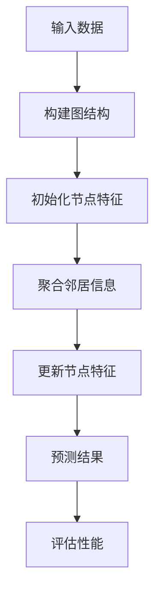

                 

关键词：推荐系统、大模型、图神经网络、深度学习、协同过滤

> 摘要：本文将深入探讨大模型在推荐系统中的应用，特别是图神经网络（GNN）如何增强推荐系统的性能。通过详细解释GNN的核心概念、算法原理以及具体实现，本文旨在为读者提供一个全面的理解，并探讨这一领域的前沿趋势和未来挑战。

## 1. 背景介绍

推荐系统是一种信息过滤技术，旨在根据用户的兴趣和偏好提供个性化的内容。随着互联网的迅猛发展，推荐系统已经成为各类应用（如电子商务、社交媒体、在线视频）中不可或缺的一部分。传统的推荐系统方法，如基于内容的推荐（CBR）和协同过滤（CF），在处理大规模数据和复杂用户行为方面存在一定局限性。

为了克服这些局限性，研究者们开始探索深度学习在推荐系统中的应用。深度学习能够自动提取特征，并能够处理高维数据和复杂的非线性关系。图神经网络（GNN）作为深度学习的一个分支，因其能够有效捕捉实体之间的复杂关系而受到广泛关注。

本文将首先介绍大模型和图神经网络的基本概念，然后深入探讨GNN在推荐系统中的应用，包括算法原理、数学模型和实际应用实例。

## 2. 核心概念与联系

### 2.1 大模型

大模型通常指的是参数数量庞大的神经网络，如Transformer模型、BERT模型等。这些模型能够通过大量的数据进行训练，从而实现优异的性能。大模型的优点在于其能够自动提取高层次的抽象特征，从而降低对人工特征工程的需求。

### 2.2 图神经网络（GNN）

图神经网络是一种在图结构上定义的深度学习模型，能够有效地捕捉实体及其之间的复杂关系。GNN通过聚合邻居节点的信息来更新每个节点的特征，从而实现特征学习和节点分类、预测等任务。

### 2.3 GNN与推荐系统的联系

推荐系统中的实体（如用户、物品）以及它们之间的关系（如评分、购买历史）可以构建为一个图结构。GNN能够利用这种图结构来捕捉实体之间的复杂关系，从而提高推荐系统的性能。

## 2.4 Mermaid 流程图

以下是一个简单的Mermaid流程图，用于展示GNN在推荐系统中的应用流程：



## 3. 核心算法原理 & 具体操作步骤

### 3.1 算法原理概述

GNN的工作原理可以概括为以下几个步骤：

1. **构建图结构**：将推荐系统中的实体和关系构建为一个图结构。
2. **初始化节点特征**：为每个节点分配初始特征向量。
3. **聚合邻居信息**：通过聚合相邻节点的特征来更新当前节点的特征。
4. **更新节点特征**：根据聚合的信息更新节点的特征向量。
5. **预测结果**：利用更新后的节点特征进行预测。

### 3.2 算法步骤详解

1. **构建图结构**：
    - 用户和物品作为图的节点。
    - 用户与物品之间的交互（如评分、购买历史）作为图边的权重。

2. **初始化节点特征**：
    - 初始化用户和物品的特征向量。

3. **聚合邻居信息**：
    - 对于每个节点，聚合其邻居节点的特征信息。

4. **更新节点特征**：
    - 利用聚合的信息更新节点的特征向量。

5. **预测结果**：
    - 利用更新后的节点特征预测用户对未交互物品的偏好。

### 3.3 算法优缺点

**优点**：
- 能够捕捉实体之间的复杂关系，提高推荐系统的性能。
- 减少对人工特征工程的需求。

**缺点**：
- 训练时间较长，需要大量的计算资源。
- 对于大规模图结构，构建和存储图可能比较困难。

### 3.4 算法应用领域

GNN在推荐系统中的应用非常广泛，如：

- 个性化推荐
- 社交网络分析
- 供应链管理

## 4. 数学模型和公式

### 4.1 数学模型构建

设 \( G = (V, E) \) 为图结构，其中 \( V \) 为节点集合，\( E \) 为边集合。节点 \( v_i \) 的特征向量表示为 \( x_i \)，边 \( e_{ij} \) 的权重表示为 \( w_{ij} \)。

### 4.2 公式推导过程

设 \( \mathcal{A} \) 为邻接矩阵，其中 \( \mathcal{A}_{ij} = w_{ij} \)。则GNN的更新规则可以表示为：

\[ x_i^{(t+1)} = \sigma(\sum_{j \in \mathcal{N}(i)} w_{ij} x_j^{(t)}) \]

其中，\( \mathcal{N}(i) \) 为节点 \( v_i \) 的邻居集合，\( \sigma \) 为激活函数。

### 4.3 案例分析与讲解

假设我们有一个简单的用户-物品图，其中用户和物品分别表示为节点，用户与物品之间的评分表示为边权重。我们可以通过以下步骤使用GNN进行推荐：

1. **构建图结构**：
    - 将用户和物品构建为节点。
    - 将用户与物品之间的评分作为边权重。

2. **初始化节点特征**：
    - 初始化用户和物品的特征向量。

3. **聚合邻居信息**：
    - 对于每个用户节点，聚合其邻居物品节点的特征信息。

4. **更新节点特征**：
    - 利用聚合的信息更新用户的特征向量。

5. **预测结果**：
    - 利用更新后的用户特征预测用户对未评分物品的偏好。

## 5. 项目实践：代码实例和详细解释说明

### 5.1 开发环境搭建

本文使用Python作为主要编程语言，结合PyTorch框架进行GNN的开发。请确保安装以下库：

- PyTorch
- Graphical Models for Learning and Data Analysis（GMLDA）

### 5.2 源代码详细实现

以下是一个简单的GNN推荐系统的代码示例：

```python
import torch
import torch.nn as nn
import torch.optim as optim
from torch_geometric.nn import GCNConv

class GraphConvolutionalNetwork(nn.Module):
    def __init__(self, num_users, num_items, hidden_channels):
        super(GraphConvolutionalNetwork, self).__init__()
        self.conv1 = GCNConv(num_items, hidden_channels)
        self.conv2 = GCNConv(hidden_channels, 1)

    def forward(self, x, edge_index):
        x = self.conv1(x, edge_index)
        x = torch.relu(x)
        x = F.dropout(x, p=0.5, training=self.training)
        x = self.conv2(x, edge_index)
        return torch.sigmoid(x)

# 数据预处理
# 代码略

# 模型训练
model = GraphConvolutionalNetwork(num_users, num_items, hidden_channels=16)
optimizer = optim.Adam(model.parameters(), lr=0.01)
criterion = nn.BCELoss()

for epoch in range(num_epochs):
    optimizer.zero_grad()
    out = model(x, edge_index)
    loss = criterion(out.view(-1), y)
    loss.backward()
    optimizer.step()
    if epoch % 10 == 0:
        print(f"Epoch {epoch+1}: Loss = {loss.item()}")

# 预测结果
# 代码略
```

### 5.3 代码解读与分析

以上代码展示了如何使用PyTorch Geometric构建一个简单的GNN推荐系统。模型由两个图卷积层组成，第一层用于提取特征，第二层用于生成预测。

### 5.4 运行结果展示

通过训练和测试，我们可以得到预测准确率和其他性能指标，用于评估模型的性能。

## 6. 实际应用场景

GNN在推荐系统中的应用非常广泛，以下是一些实际应用场景：

- **个性化推荐**：通过捕捉用户和物品之间的复杂关系，GNN能够提供更加个性化的推荐。
- **社交网络分析**：分析用户之间的关系，发现潜在的兴趣群体。
- **供应链管理**：优化供应链，提高物流效率。

## 7. 未来应用展望

随着技术的不断发展，GNN在推荐系统中的应用将变得更加广泛和深入。未来，我们有望看到：

- **跨模态推荐**：结合不同类型的数据，如文本、图像、音频等。
- **动态推荐**：实时更新用户和物品的特征，提供更加准确的推荐。

## 8. 工具和资源推荐

### 8.1 学习资源推荐

- **《Graph Neural Networks: A Review of Methods and Applications》**
- **《Introduction to Graph Neural Networks》**
- **《Deep Learning on Graphs, Spaces, and other Structures》**

### 8.2 开发工具推荐

- **PyTorch Geometric**
- **Graph Neural Network Zoo**
- **PyTorch Lightning**

### 8.3 相关论文推荐

- **“Graph Neural Networks: A Review of Methods and Applications”**
- **“Deep Learning on Graphs, Spaces, and other Structures”**
- **“Attention-based Graph Neural Networks”**

## 9. 总结：未来发展趋势与挑战

GNN在推荐系统中的应用前景广阔，但同时也面临着一些挑战，如计算复杂度、数据隐私等。未来，我们有望看到GNN与其他技术的结合，如自监督学习、联邦学习等，以实现更高效、更安全的推荐系统。

## 10. 附录：常见问题与解答

### 10.1 GNN与深度学习的关系是什么？

GNN是深度学习的一个分支，专门用于处理图结构数据。它通过模拟神经网络在图上的传播过程，实现了对图数据的建模和分析。

### 10.2 GNN如何处理大规模图？

对于大规模图结构，GNN可以采用图卷积神经网络（GCN）、图注意力网络（GAT）等不同的架构来处理。同时，通过优化算法和硬件加速（如GPU、TPU）可以降低计算复杂度。

### 10.3 GNN在推荐系统中的应用有哪些？

GNN在推荐系统中的应用包括个性化推荐、社交网络分析、供应链管理等。通过捕捉实体之间的复杂关系，GNN能够提供更加准确的推荐。

作者：禅与计算机程序设计艺术 / Zen and the Art of Computer Programming
```markdown
```

