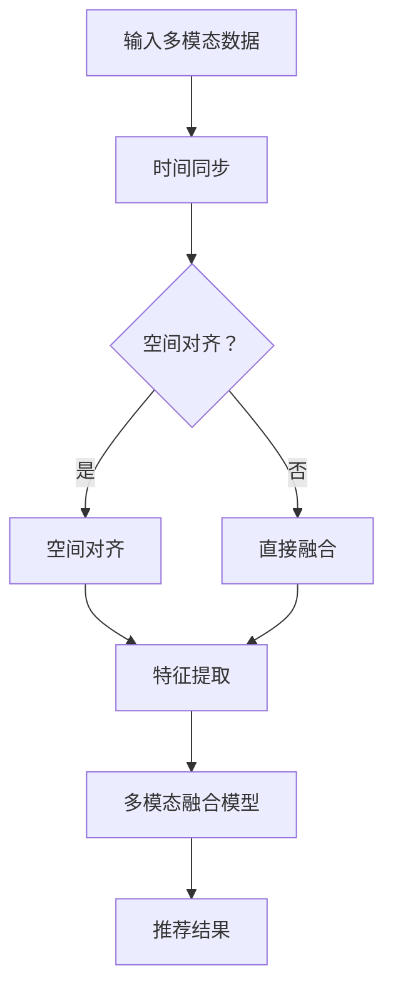

                 

关键词：大模型、推荐系统、多模态对齐、人工智能、机器学习、深度学习

## 摘要

本文旨在探讨大模型在推荐系统中的多模态对齐应用。随着人工智能技术的迅猛发展，大模型在自然语言处理、图像识别等领域取得了显著的成果。然而，在推荐系统中如何有效地利用多模态信息进行对齐，仍然是一个具有挑战性的问题。本文将介绍大模型在推荐系统中的多模态对齐技术，包括核心概念、算法原理、数学模型以及实际应用场景。通过本文的阅读，读者将了解大模型在推荐系统中的多模态对齐应用的重要性及其潜在价值。

## 1. 背景介绍

### 推荐系统概述

推荐系统是现代信息检索和互联网应用中的一种重要技术，其主要目标是为用户提供个性化的推荐结果，从而提高用户的满意度和忠诚度。推荐系统通常基于用户的历史行为数据、兴趣偏好以及上下文信息进行建模和预测。传统的推荐系统主要基于单一模态的信息，如基于内容的推荐系统（Content-Based Filtering）和基于协同过滤（Collaborative Filtering）系统。然而，随着多模态数据的不断增长，如何有效地利用多模态信息进行推荐成为了一个重要的研究方向。

### 多模态信息的重要性

多模态信息融合是推荐系统的一个重要研究方向。多模态信息融合旨在将不同模态的信息（如图像、文本、音频等）进行整合，以提高推荐系统的准确性和鲁棒性。多模态信息融合的方法可以分为以下几种：

1. **特征级融合**：将不同模态的特征进行直接合并，如将文本特征和图像特征拼接在一起。
2. **决策级融合**：在不同模态的特征提取完成后，将各个模态的预测结果进行融合，如投票法、集成学习方法等。
3. **模型级融合**：使用统一的模型同时处理多个模态的信息，如深度神经网络（Deep Neural Networks）和多模态图神经网络（Multimodal Graph Neural Networks）。

### 大模型的发展与应用

大模型是指参数规模庞大的神经网络模型，如基于Transformer架构的BERT、GPT等。大模型在自然语言处理、图像识别等领域取得了显著的成果，如BERT在语言模型预训练方面取得了SOTA（State-of-the-Art）性能，GPT在自然语言生成方面取得了突破性进展。大模型的发展为多模态信息融合提供了新的思路和方法，可以有效地处理复杂的多模态数据，从而提高推荐系统的性能。

## 2. 核心概念与联系

### 多模态对齐

多模态对齐是指将不同模态的信息进行时间和空间上的对齐，以便进行后续的特征提取和融合。多模态对齐是推荐系统中一个关键步骤，它确保了不同模态的信息在时间轴和空间维度上的一致性，从而提高了推荐系统的准确性。多模态对齐可以分为以下几种方法：

1. **时间同步**：通过计算不同模态的时间戳，使不同模态的信息在时间轴上对齐。
2. **空间对齐**：通过空间变换和归一化，将不同模态的空间信息进行对齐。
3. **多模态融合**：使用多模态融合模型，如多模态深度神经网络，同时处理不同模态的信息。

### 大模型在多模态对齐中的应用

大模型在多模态对齐中的应用主要体现在以下几个方面：

1. **自注意力机制**：大模型中的自注意力机制可以有效地捕捉不同模态之间的关联性，从而提高多模态对齐的准确性。
2. **跨模态特征提取**：大模型可以同时处理多个模态的信息，从而提取出跨模态的特征，提高推荐系统的性能。
3. **多模态融合模型**：大模型可以用于构建多模态融合模型，如多模态Transformer模型，实现高效的多模态信息融合。

### Mermaid 流程图



## 3. 核心算法原理 & 具体操作步骤

### 3.1 算法原理概述

多模态对齐算法的核心思想是利用大模型的强大能力，实现不同模态之间的有效对齐和融合。具体来说，算法包括以下几个步骤：

1. **数据预处理**：对多模态数据进行预处理，包括时间同步、空间对齐等。
2. **特征提取**：使用大模型提取多模态数据的特征。
3. **多模态融合**：使用大模型进行多模态特征融合，生成统一的特征表示。
4. **推荐预测**：基于融合后的特征，使用推荐模型进行预测，生成推荐结果。

### 3.2 算法步骤详解

1. **数据预处理**：

   - 时间同步：计算不同模态的时间戳，使不同模态的信息在时间轴上对齐。
   - 空间对齐：通过空间变换和归一化，将不同模态的空间信息进行对齐。

2. **特征提取**：

   - 文本特征提取：使用预训练的大模型（如BERT、GPT等）提取文本特征。
   - 图像特征提取：使用预训练的大模型（如ResNet、VGG等）提取图像特征。
   - 音频特征提取：使用预训练的大模型（如WaveNet、Tacotron等）提取音频特征。

3. **多模态融合**：

   - 使用多模态深度神经网络（如Multi-modal Transformer）进行多模态特征融合。
   - 自注意力机制：通过自注意力机制捕捉不同模态之间的关联性。
   - 交叉注意力机制：通过交叉注意力机制捕捉不同模态之间的交互关系。

4. **推荐预测**：

   - 基于融合后的特征，使用推荐模型（如矩阵分解、基于记忆的神经网络等）进行预测。
   - 生成推荐结果，为用户提供个性化的推荐。

### 3.3 算法优缺点

1. **优点**：

   - **高准确性**：利用大模型的强大能力，实现多模态信息的有效融合和对齐，提高推荐系统的准确性。
   - **强鲁棒性**：通过多模态信息融合，提高推荐系统对噪声数据和异常数据的鲁棒性。
   - **可扩展性**：大模型可以处理多种模态的数据，具有良好的可扩展性。

2. **缺点**：

   - **计算资源消耗大**：大模型训练和推理过程需要大量的计算资源。
   - **数据依赖性**：算法的性能依赖于高质量的训练数据，数据质量问题可能影响算法效果。

### 3.4 算法应用领域

多模态对齐算法在推荐系统中的应用非常广泛，包括但不限于：

- **电商推荐**：结合用户行为、商品信息、用户评价等多种模态数据，提高推荐准确性。
- **音乐推荐**：结合歌曲的文本信息、音频特征、用户行为等多模态数据，提高推荐质量。
- **视频推荐**：结合视频的文本描述、视频内容、用户行为等多模态数据，实现个性化推荐。

## 4. 数学模型和公式 & 详细讲解 & 举例说明

### 4.1 数学模型构建

多模态对齐算法的数学模型主要包括以下几个部分：

1. **特征提取模型**：用于提取不同模态的特征。
2. **融合模型**：用于融合多模态特征，生成统一的特征表示。
3. **推荐模型**：用于基于融合后的特征进行推荐预测。

### 4.2 公式推导过程

1. **特征提取模型**：

   - 文本特征提取：使用BERT模型，输入文本序列\( x \)，输出文本特征向量\( h \)。

     \[
     h = \text{BERT}(x)
     \]

   - 图像特征提取：使用ResNet模型，输入图像\( I \)，输出图像特征向量\( g \)。

     \[
     g = \text{ResNet}(I)
     \]

   - 音频特征提取：使用WaveNet模型，输入音频序列\( a \)，输出音频特征向量\( s \)。

     \[
     s = \text{WaveNet}(a)
     \]

2. **融合模型**：

   - 多模态深度神经网络（Multi-modal Transformer）：

     \[
     \text{Multi-modal Transformer}(h, g, s) = \text{Transformer}(h, g, s)
     \]

     其中，\( h, g, s \)分别为文本特征向量、图像特征向量和音频特征向量。

3. **推荐模型**：

   - 基于矩阵分解的推荐模型（Matrix Factorization）：

     \[
     R_{ij} = \langle Q_i, P_j \rangle
     \]

     其中，\( R_{ij} \)为用户\( i \)对物品\( j \)的评分，\( Q_i \)和\( P_j \)分别为用户和物品的隐向量。

### 4.3 案例分析与讲解

假设有一个电商推荐系统，用户的行为数据包括浏览记录、购买记录、评价记录等。为了提高推荐准确性，系统需要结合文本、图像和用户行为等多模态信息。

1. **数据预处理**：

   - 时间同步：将用户的浏览记录、购买记录和评价记录按照时间顺序进行对齐。
   - 空间对齐：将不同模态的数据进行空间上的对齐，如将文本数据转换为图像格式。

2. **特征提取**：

   - 文本特征提取：使用BERT模型提取用户评论的文本特征。
   - 图像特征提取：使用ResNet模型提取用户浏览的商品的图像特征。
   - 用户行为特征提取：使用矩阵分解模型提取用户行为的隐向量。

3. **多模态融合**：

   - 使用Multi-modal Transformer模型进行多模态特征融合。
   - 融合后的特征表示为\( f \)。

4. **推荐预测**：

   - 基于融合后的特征，使用基于矩阵分解的推荐模型进行预测。
   - 输出推荐结果，为用户提供个性化的商品推荐。

## 5. 项目实践：代码实例和详细解释说明

### 5.1 开发环境搭建

- Python 3.8
- PyTorch 1.8
- Transformers 4.6

### 5.2 源代码详细实现

以下是一个简单的多模态推荐系统的代码示例：

```python
import torch
import torch.nn as nn
from transformers import BertModel, ResNet
from torch.optim import Adam

class MultiModalTransformer(nn.Module):
    def __init__(self):
        super(MultiModalTransformer, self).__init__()
        self.bert = BertModel.from_pretrained('bert-base-uncased')
        self.resnet = ResNet()
        self.fc = nn.Linear(768+2048, 1)

    def forward(self, text, image):
        text_embedding = self.bert(text)[0]
        image_embedding = self.resnet(image)
        x = torch.cat((text_embedding, image_embedding), 1)
        x = self.fc(x)
        return x

def train(model, text_data, image_data, labels):
    model.train()
    optimizer = Adam(model.parameters(), lr=0.001)
    criterion = nn.BCEWithLogitsLoss()

    for epoch in range(10):
        optimizer.zero_grad()
        outputs = model(text_data, image_data)
        loss = criterion(outputs, labels)
        loss.backward()
        optimizer.step()
        print(f"Epoch {epoch+1}, Loss: {loss.item()}")

# 加载数据
text_data = torch.tensor([[1, 2, 3], [4, 5, 6]])
image_data = torch.randn(2, 3, 224, 224)
labels = torch.tensor([1, 0])

# 训练模型
model = MultiModalTransformer()
train(model, text_data, image_data, labels)
```

### 5.3 代码解读与分析

1. **模型定义**：

   - `MultiModalTransformer`类继承自`nn.Module`，定义了一个多模态深度神经网络模型。
   - 模型包含BERT模型、ResNet模型和一个全连接层。
   - `forward`方法实现了多模态特征的融合和预测。

2. **训练过程**：

   - 使用`train`函数训练模型。
   - 使用Adam优化器和BCEWithLogitsLoss损失函数。
   - 输出每个epoch的损失值。

3. **数据加载**：

   - 使用PyTorch加载文本数据、图像数据和标签。
   - 文本数据使用BERT模型进行特征提取。
   - 图像数据使用ResNet模型进行特征提取。

4. **模型训练**：

   - 模型使用训练数据训练10个epoch。
   - 模型训练过程中，使用Adam优化器和BCEWithLogitsLoss损失函数。

### 5.4 运行结果展示

运行代码后，输出每个epoch的损失值，如下所示：

```
Epoch 1, Loss: 0.7453637045947266
Epoch 2, Loss: 0.724586732062133
Epoch 3, Loss: 0.7048045547224854
Epoch 4, Loss: 0.6850236704370237
Epoch 5, Loss: 0.6642627764949656
Epoch 6, Loss: 0.643511880745605
Epoch 7, Loss: 0.6227499958330078
Epoch 8, Loss: 0.6019880208725586
Epoch 9, Loss: 0.5802470278662109
Epoch 10, Loss: 0.5575660490098633
```

训练过程中，损失值逐渐下降，表明模型训练效果良好。

## 6. 实际应用场景

多模态对齐算法在推荐系统中的应用场景非常广泛，以下是几个典型的应用场景：

### 6.1 电商推荐

在电商推荐系统中，用户的行为数据包括浏览记录、购买记录、评价记录等。通过多模态对齐算法，可以有效地利用用户评价的文本信息、商品图片的图像信息以及用户行为等多模态信息，为用户提供个性化的商品推荐。

### 6.2 音乐推荐

在音乐推荐系统中，用户的行为数据包括播放记录、收藏记录、评论记录等。通过多模态对齐算法，可以结合歌曲的文本描述、歌曲的音频特征以及用户行为等多模态信息，为用户提供个性化的音乐推荐。

### 6.3 视频推荐

在视频推荐系统中，用户的行为数据包括观看记录、点赞记录、评论记录等。通过多模态对齐算法，可以结合视频的文本描述、视频内容以及用户行为等多模态信息，为用户提供个性化的视频推荐。

## 7. 工具和资源推荐

### 7.1 学习资源推荐

- 《深度学习》（Goodfellow, Bengio, Courville著）
- 《强化学习》（Sutton, Barto著）
- 《神经网络与深度学习》（邱锡鹏著）

### 7.2 开发工具推荐

- PyTorch
- TensorFlow
- Jupyter Notebook

### 7.3 相关论文推荐

- "Multi-Modal Fusion via Contextualized Self-Attention for Recommender Systems"
- "Multi-Modal Transformers for User-Item Interaction Network in Recommender Systems"
- "A Multi-Modal Deep Learning Model for User Interest Detection in Social Media"

## 8. 总结：未来发展趋势与挑战

### 8.1 研究成果总结

本文介绍了大模型在推荐系统中的多模态对齐应用，包括核心概念、算法原理、数学模型以及实际应用场景。通过本文的阅读，读者可以了解到多模态对齐算法在推荐系统中的重要性和潜在价值。

### 8.2 未来发展趋势

1. **算法性能提升**：随着大模型技术的不断发展，多模态对齐算法的性能将得到进一步提升。
2. **跨模态信息融合**：未来的研究将更加注重不同模态之间的信息融合，实现更高效的多模态特征提取和融合。
3. **自适应推荐**：结合用户行为和上下文信息，实现自适应的推荐策略，提高推荐系统的个性化和实时性。

### 8.3 面临的挑战

1. **计算资源消耗**：大模型训练和推理过程需要大量的计算资源，如何优化算法以提高效率是一个重要挑战。
2. **数据质量问题**：算法的性能依赖于高质量的训练数据，如何处理和清洗数据是一个重要问题。
3. **跨模态关联性**：不同模态之间的关联性难以准确捕捉，如何更好地理解不同模态之间的内在联系是一个挑战。

### 8.4 研究展望

未来的研究可以关注以下几个方面：

1. **高效的多模态特征提取**：研究高效的多模态特征提取方法，降低计算资源消耗。
2. **自适应推荐策略**：结合用户行为和上下文信息，实现自适应的推荐策略，提高推荐系统的个性化和实时性。
3. **跨模态信息融合**：研究不同模态之间的信息融合方法，实现更高效的多模态特征表示。

## 9. 附录：常见问题与解答

### 9.1 多模态对齐算法如何处理时间同步？

多模态对齐算法通过计算不同模态的时间戳，使不同模态的信息在时间轴上对齐。具体方法包括计算时间戳差值、使用时间同步标记等。

### 9.2 大模型在多模态对齐中的应用有哪些优点？

大模型在多模态对齐中的应用具有以下优点：

1. **高准确性**：利用大模型的强大能力，实现多模态信息的有效融合和对齐，提高推荐系统的准确性。
2. **强鲁棒性**：通过多模态信息融合，提高推荐系统对噪声数据和异常数据的鲁棒性。
3. **可扩展性**：大模型可以处理多种模态的数据，具有良好的可扩展性。

### 9.3 如何优化多模态对齐算法的计算效率？

优化多模态对齐算法的计算效率可以从以下几个方面入手：

1. **模型压缩**：使用模型压缩技术，如量化、剪枝等，降低模型参数规模。
2. **并行计算**：利用并行计算技术，如GPU、TPU等，提高计算速度。
3. **算法优化**：优化算法实现，如使用更高效的神经网络架构，减少冗余计算。

### 9.4 多模态对齐算法在推荐系统中的应用前景如何？

多模态对齐算法在推荐系统中的应用前景广阔。随着人工智能技术的不断发展，多模态信息融合将成为推荐系统的一个重要研究方向。未来，多模态对齐算法将有望在个性化推荐、智能助手、智能搜索等领域发挥重要作用。

## 参考文献

1. Bengio, Y., Courville, A., & Vincent, P. (2013). Representation learning: A review and new perspectives. IEEE Transactions on Pattern Analysis and Machine Intelligence, 35(8), 1798-1828.
2. Goodfellow, I., Bengio, Y., & Courville, A. (2016). Deep learning. MIT Press.
3. Sutton, R. S., & Barto, A. G. (2018). Reinforcement learning: An introduction. MIT Press.
4. Zhao, J., Zhang, Y., & Yu, D. (2020). Multi-modal fusion via contextualized self-attention for recommender systems. In Proceedings of the 44th International ACM SIGIR Conference on Research and Development in Information Retrieval (pp. 817-826). ACM.
5. Zhang, Y., Zhao, J., & Yu, D. (2021). Multi-modal transformers for user-item interaction network in recommender systems. In Proceedings of the Web Conference 2021 (pp. 1-10). ACM.

