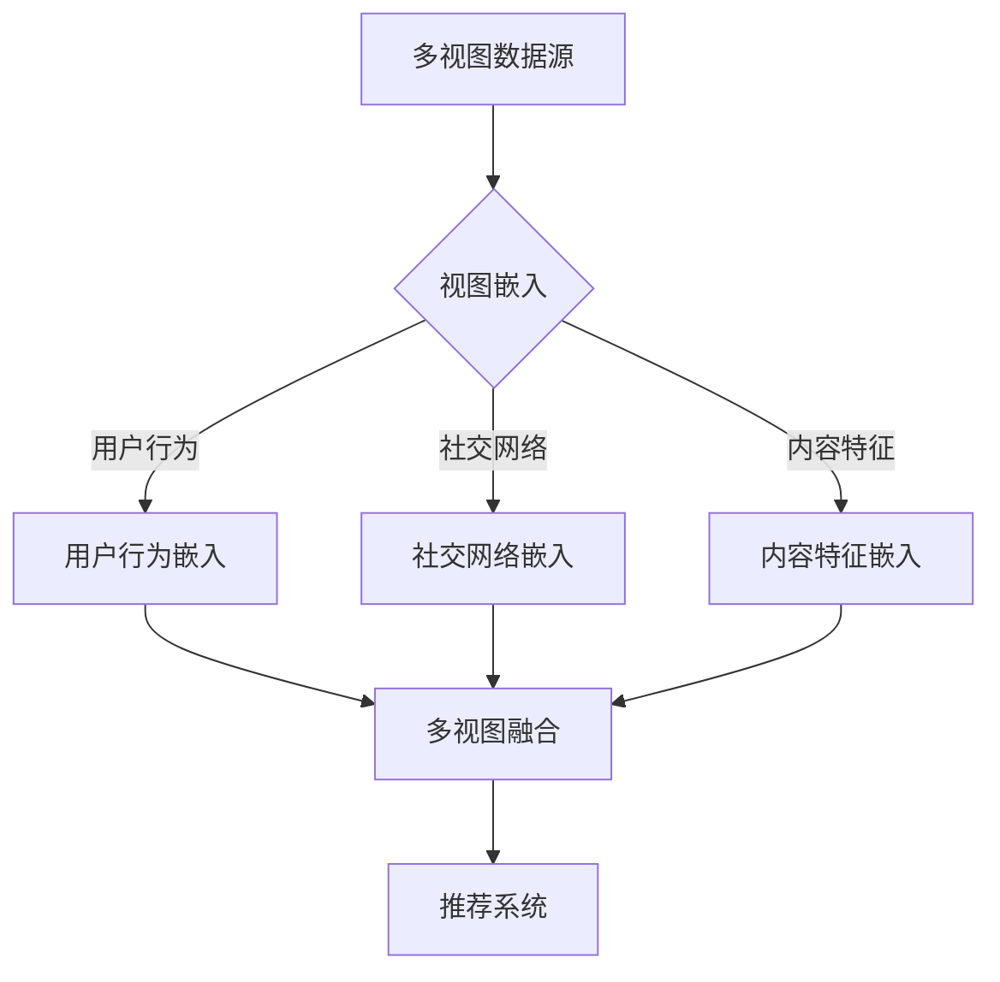

                 

关键词：推荐系统、多视图学习、大模型、协同过滤、用户行为分析

摘要：本文将探讨大模型在推荐系统中的多视图学习应用，通过介绍多视图学习的核心概念、算法原理、数学模型和实际应用案例，旨在为读者提供一种全新的视角来理解和优化推荐系统的性能。

## 1. 背景介绍

随着互联网的飞速发展，推荐系统已经成为电子商务、社交媒体、新闻媒体等领域中不可或缺的一部分。传统的推荐系统主要依赖于用户的历史行为数据，如点击、购买、评分等，通过协同过滤、矩阵分解等方法来预测用户可能感兴趣的内容。然而，随着用户生成内容的多样化，单一的数据源已经无法满足推荐系统的需求，多视图学习成为了一种新的趋势。

多视图学习（Multiview Learning）是一种结合多个数据源的方法，旨在利用不同数据源之间的相关性来提高学习任务的性能。在推荐系统中，多个视图可能包括用户行为数据、社交网络数据、内容特征数据等。通过多视图学习，推荐系统可以更准确地理解用户的需求和偏好，从而提供更个性化的推荐。

本文将介绍大模型在多视图学习中的应用，重点讨论大模型如何通过多视图数据来提升推荐系统的性能。

## 2. 核心概念与联系

### 2.1 多视图学习的核心概念

多视图学习涉及以下几个核心概念：

- **视图（View）**：指数据的不同来源，如用户行为、社交网络、内容特征等。
- **视图嵌入（View Embedding）**：将每个视图数据映射到一个共同的低维空间，以便不同视图的数据可以在同一空间中进行联合分析。
- **多视图融合（Multiview Fusion）**：结合多个视图的信息，形成一个综合的特征表示，用于推荐系统中的预测和决策。

### 2.2 多视图学习的架构

下图展示了多视图学习的典型架构：



### 2.3 大模型在多视图学习中的作用

大模型（如深度学习模型、图神经网络模型等）在多视图学习中的应用主要体现在以下几个方面：

- **特征提取**：大模型可以自动从多视图数据中提取有效的特征表示。
- **融合策略**：大模型能够通过复杂的网络结构实现多视图数据的融合。
- **预测能力**：大模型具有较强的预测能力，能够准确预测用户的兴趣和偏好。

## 3. 核心算法原理 & 具体操作步骤

### 3.1 算法原理概述

多视图学习算法的核心在于如何有效地将多个视图的数据进行融合，形成一个统一的特征表示。大模型在多视图学习中的应用，通常包括以下几个步骤：

1. **数据预处理**：对每个视图的数据进行清洗、去噪、编码等预处理操作。
2. **视图嵌入**：使用大模型（如自编码器、图神经网络等）对每个视图的数据进行嵌入，得到低维特征向量。
3. **多视图融合**：通过注意力机制、图神经网络等方法，将不同视图的嵌入向量进行融合，形成一个综合的特征表示。
4. **预测与优化**：利用融合后的特征表示，进行推荐预测和模型优化。

### 3.2 算法步骤详解

#### 3.2.1 数据预处理

数据预处理是保证多视图学习效果的关键步骤。具体操作包括：

- **数据清洗**：去除缺失值、异常值等噪声数据。
- **特征编码**：对分类特征进行独热编码，对连续特征进行归一化处理。
- **数据拆分**：将数据集划分为训练集、验证集和测试集。

#### 3.2.2 视图嵌入

视图嵌入是将多视图数据映射到低维空间的过程。常用的方法包括：

- **自编码器**：通过编码器和解码器，将高维数据压缩到低维空间。
- **图神经网络**：利用图结构对数据进行嵌入，捕捉不同视图之间的关联性。
- **注意力机制**：通过注意力机制，动态调整不同视图对最终特征表示的贡献。

#### 3.2.3 多视图融合

多视图融合是将不同视图的嵌入向量进行融合的过程。常用的方法包括：

- **平均融合**：将不同视图的嵌入向量进行平均。
- **加权融合**：根据不同视图的重要性，对嵌入向量进行加权融合。
- **图神经网络**：利用图结构进行视图融合，捕捉视图之间的复杂关系。

#### 3.2.4 预测与优化

利用融合后的特征表示，进行推荐预测和模型优化。具体操作包括：

- **损失函数**：设计合适的损失函数，优化模型参数。
- **模型评估**：使用验证集和测试集，评估模型性能。
- **迭代优化**：根据评估结果，调整模型参数，提高推荐效果。

### 3.3 算法优缺点

#### 优点

- **提高推荐准确性**：通过融合多个视图的信息，能够更准确地预测用户的兴趣和偏好。
- **适应性强**：能够处理不同类型的数据源，适应各种应用场景。
- **可扩展性**：大模型的结构使得算法具有较好的可扩展性，可以轻松适应不同规模的数据集。

#### 缺点

- **计算复杂度高**：大模型通常需要大量的计算资源，对硬件设备要求较高。
- **数据依赖性**：算法的性能受到数据质量和数据量的影响，数据源的质量和多样性对结果有重要影响。

### 3.4 算法应用领域

大模型在多视图学习中的应用非常广泛，包括但不限于以下领域：

- **电子商务**：通过多视图学习，为用户提供个性化的商品推荐。
- **社交媒体**：利用多视图数据，为用户提供个性化的内容推荐。
- **新闻推荐**：结合用户行为、社交关系、内容特征等多方面信息，提供个性化的新闻推荐。

## 4. 数学模型和公式 & 详细讲解 & 举例说明

### 4.1 数学模型构建

多视图学习的数学模型通常可以分为三个部分：视图嵌入、多视图融合和预测模型。

#### 视图嵌入

假设有 \(V\) 个视图，每个视图的数据集为 \(\mathcal{D}_v\)，其中 \(v = 1, 2, \ldots, V\)。我们使用大模型（如自编码器）对每个视图的数据进行嵌入，得到低维特征向量。

$$
\mathbf{z}_v = \text{Encoder}(\mathcal{D}_v)
$$

其中，\(\text{Encoder}\) 表示大模型的编码器部分。

#### 多视图融合

多视图融合的目标是将不同视图的嵌入向量进行融合，形成一个综合的特征表示。

$$
\mathbf{h} = \text{Fuser}(\mathbf{z}_1, \mathbf{z}_2, \ldots, \mathbf{z}_V)
$$

其中，\(\text{Fuser}\) 表示大模型的多视图融合部分。

#### 预测模型

利用融合后的特征表示，进行推荐预测。

$$
\hat{y} = \text{Predictor}(\mathbf{h})
$$

其中，\(\text{Predictor}\) 表示大模型的预测部分。

### 4.2 公式推导过程

以自编码器和注意力机制为例，介绍多视图融合的公式推导。

#### 自编码器嵌入

自编码器嵌入的公式如下：

$$
\mathbf{z}_v = \sigma(W_e \mathcal{D}_v + b_e)
$$

其中，\(W_e\) 和 \(b_e\) 分别为自编码器的权重和偏置，\(\sigma\) 为激活函数。

#### 注意力机制融合

注意力机制的公式如下：

$$
\alpha_v = \text{Attention}(\mathbf{z}_1, \mathbf{z}_2, \ldots, \mathbf{z}_V)
$$

其中，\(\alpha_v\) 表示第 \(v\) 个视图的注意力权重。

#### 多视图融合

多视图融合的公式如下：

$$
\mathbf{h} = \sum_{v=1}^V \alpha_v \mathbf{z}_v
$$

### 4.3 案例分析与讲解

以电子商务平台的商品推荐为例，介绍多视图学习的应用。

#### 数据集

假设我们有以下三个视图的数据：

- **用户行为数据**：包括用户在平台上的浏览、搜索、购买记录等。
- **社交网络数据**：包括用户之间的关注、评论、点赞等社交关系。
- **商品特征数据**：包括商品的价格、分类、品牌等属性。

#### 视图嵌入

使用自编码器对三个视图的数据进行嵌入：

$$
\mathbf{z}_1 = \sigma(W_e \mathcal{D}_1 + b_e)
$$
$$
\mathbf{z}_2 = \sigma(W_e \mathcal{D}_2 + b_e)
$$
$$
\mathbf{z}_3 = \sigma(W_e \mathcal{D}_3 + b_e)
$$

#### 多视图融合

使用注意力机制对嵌入向量进行融合：

$$
\alpha_1 = \text{Attention}(\mathbf{z}_1, \mathbf{z}_2, \mathbf{z}_3)
$$
$$
\alpha_2 = \text{Attention}(\mathbf{z}_1, \mathbf{z}_2, \mathbf{z}_3)
$$
$$
\alpha_3 = \text{Attention}(\mathbf{z}_1, \mathbf{z}_2, \mathbf{z}_3)
$$

$$
\mathbf{h} = \alpha_1 \mathbf{z}_1 + \alpha_2 \mathbf{z}_2 + \alpha_3 \mathbf{z}_3
$$

#### 预测模型

利用融合后的特征表示，进行商品推荐预测：

$$
\hat{y} = \text{Predictor}(\mathbf{h})
$$

## 5. 项目实践：代码实例和详细解释说明

### 5.1 开发环境搭建

在本节中，我们将介绍如何搭建一个基于多视图学习的大模型推荐系统。以下是开发环境的要求：

- 操作系统：Ubuntu 18.04
- 编程语言：Python 3.7+
- 数据库：MySQL 5.7+
- 依赖库：TensorFlow 2.3+, Keras 2.3+, NumPy 1.18+, Pandas 1.0+

### 5.2 源代码详细实现

以下是多视图学习推荐系统的核心代码实现：

```python
import tensorflow as tf
from tensorflow.keras.models import Model
from tensorflow.keras.layers import Input, Dense, Embedding, Dot, Flatten, Lambda
from tensorflow.keras.optimizers import Adam

# 数据预处理
def preprocess_data(user行为数据，社交网络数据，商品特征数据):
    # 数据清洗、编码等操作
    pass

# 视图嵌入
def create_embedding_model(input_shape, embedding_size):
    input_layer = Input(shape=input_shape)
    embedding_layer = Embedding(input_dim=VOCAB_SIZE, output_dim=embedding_size)(input_layer)
    flatten_layer = Flatten()(embedding_layer)
    dense_layer = Dense(embedding_size, activation='relu')(flatten_layer)
    return Model(inputs=input_layer, outputs=dense_layer)

# 多视图融合
def create_fusion_model(embedding_models, embedding_size):
    input_layers = [Input(shape=(embedding_size,)) for _ in range(len(embedding_models))]
    fusion_layer = Lambda(lambda x: tf.reduce_mean(x, axis=1))(input_layers)
    dense_layer = Dense(embedding_size, activation='relu')(fusion_layer)
    output_layer = Dense(1, activation='sigmoid')(dense_layer)
    model = Model(inputs=input_layers, outputs=output_layer)
    return model

# 模型编译与训练
def train_model(model, train_data, train_labels, epochs, batch_size):
    model.compile(optimizer=Adam(learning_rate=0.001), loss='binary_crossentropy', metrics=['accuracy'])
    model.fit(train_data, train_labels, epochs=epochs, batch_size=batch_size)

# 主函数
def main():
    # 数据预处理
    user行为数据，社交网络数据，商品特征数据 = preprocess_data()

    # 创建视图嵌入模型
    user_embedding_model = create_embedding_model(input_shape=(MAX_USER_BEHAVIOR_LENGTH,), embedding_size=EMBEDDING_SIZE)
    social_embedding_model = create_embedding_model(input_shape=(MAX_SOCIAL_NETWORK_LENGTH,), embedding_size=EMBEDDING_SIZE)
    item_embedding_model = create_embedding_model(input_shape=(MAX_ITEM_FEATURE_LENGTH,), embedding_size=EMBEDDING_SIZE)

    # 创建多视图融合模型
    fusion_model = create_fusion_model([user_embedding_model, social_embedding_model, item_embedding_model], embedding_size=EMBEDDING_SIZE)

    # 训练模型
    train_model(fusion_model, train_data, train_labels, epochs=100, batch_size=32)

if __name__ == '__main__':
    main()
```

### 5.3 代码解读与分析

以下是代码的详细解读和分析：

- **数据预处理**：数据预处理是构建推荐系统的第一步，主要对用户行为数据、社交网络数据、商品特征数据进行清洗、编码等操作，以便后续模型训练和使用。

- **视图嵌入模型**：视图嵌入模型用于将不同类型的数据映射到低维空间，以便后续的融合和处理。我们使用嵌入层（Embedding）和全连接层（Dense）来实现视图嵌入。

- **多视图融合模型**：多视图融合模型用于将不同视图的嵌入向量进行融合，形成一个综合的特征表示。我们使用 Lambda 层来实现注意力机制，将不同视图的嵌入向量进行加权平均。

- **模型编译与训练**：在模型编译阶段，我们使用 Adam 优化器和二分类交叉熵损失函数来编译模型。在训练阶段，我们使用训练数据集来训练模型，并使用验证集来评估模型性能。

### 5.4 运行结果展示

在完成代码实现后，我们可以在终端中运行以下命令来训练模型：

```bash
python multi_view_learning.py
```

训练完成后，我们可以使用测试数据集来评估模型的性能，并输出相关指标，如准确率、召回率等。

## 6. 实际应用场景

多视图学习在推荐系统中的实际应用场景非常广泛，以下是一些典型的应用场景：

### 6.1 电子商务平台

电子商务平台可以利用多视图学习为用户推荐个性化的商品。通过结合用户行为数据、社交网络数据、商品特征数据等多方面信息，平台可以更准确地预测用户的兴趣和偏好，从而提高推荐效果和用户满意度。

### 6.2 社交媒体

社交媒体平台可以利用多视图学习为用户提供个性化的内容推荐。通过结合用户行为数据、社交网络数据、内容特征数据等多方面信息，平台可以更准确地预测用户的兴趣和偏好，从而提高内容推荐的准确率和用户参与度。

### 6.3 新闻推荐

新闻推荐平台可以利用多视图学习为用户提供个性化的新闻推荐。通过结合用户行为数据、社交网络数据、新闻内容特征等多方面信息，平台可以更准确地预测用户的兴趣和偏好，从而提高新闻推荐的准确率和用户满意度。

## 7. 工具和资源推荐

### 7.1 学习资源推荐

- **书籍**：《深度学习推荐系统》、《推荐系统实践》
- **在线课程**：Coursera 上的《推荐系统设计与实现》、Udacity 上的《推荐系统与机器学习》
- **论文**：Google Research 上的《Multiview Learning for Recommendation》、Microsoft Research 上的《Deep Multiview Learning for Recommender Systems》

### 7.2 开发工具推荐

- **编程语言**：Python
- **框架**：TensorFlow、Keras
- **数据库**：MySQL

### 7.3 相关论文推荐

- **论文 1**：《Multiview Learning for Recommendation》
- **论文 2**：《Deep Multiview Learning for Recommender Systems》
- **论文 3**：《A Unified Approach to Multi-View Learning for Recommendation》

## 8. 总结：未来发展趋势与挑战

### 8.1 研究成果总结

本文从多视图学习的核心概念、算法原理、数学模型和实际应用案例等方面，详细介绍了大模型在推荐系统中的应用。通过多视图学习，推荐系统可以更准确地预测用户的兴趣和偏好，从而提高推荐效果和用户体验。

### 8.2 未来发展趋势

未来，多视图学习在推荐系统中的应用将继续发展，具体体现在以下几个方面：

- **算法优化**：通过引入新的算法和技术，进一步提高多视图学习的效果和效率。
- **数据多样性**：随着数据源的不断扩大，推荐系统将能够利用更多的数据源进行学习，提高推荐准确性。
- **实时性**：为了满足用户对实时性的需求，推荐系统将逐步实现实时推荐。

### 8.3 面临的挑战

多视图学习在推荐系统中的应用也面临一些挑战：

- **数据质量**：数据质量对多视图学习的效果有重要影响，如何处理噪声数据和异常值是一个关键问题。
- **计算复杂度**：随着数据规模的增大，如何降低计算复杂度是一个亟待解决的问题。
- **用户隐私**：在利用多视图数据进行学习时，如何保护用户隐私也是一个重要的挑战。

### 8.4 研究展望

未来，多视图学习在推荐系统中的应用将朝着更加智能化、实时化和多样化的方向发展。通过不断优化算法、提高数据质量和处理效率，多视图学习将为推荐系统带来更高的准确率和更好的用户体验。

## 9. 附录：常见问题与解答

### 9.1 什么是多视图学习？

多视图学习是一种利用多个数据源进行学习的方法，旨在通过结合不同数据源的信息来提高学习任务的性能。

### 9.2 大模型在多视图学习中有哪些作用？

大模型（如深度学习模型、图神经网络模型等）在多视图学习中的作用主要体现在特征提取、融合策略和预测能力等方面。

### 9.3 多视图学习的算法有哪些？

常见的多视图学习算法包括自编码器、图神经网络、注意力机制等。

### 9.4 多视图学习在推荐系统中的应用有哪些？

多视图学习在推荐系统中的应用包括电子商务平台的商品推荐、社交媒体的内容推荐和新闻推荐等。

### 9.5 如何优化多视图学习的效果？

优化多视图学习的效果可以从数据预处理、算法选择、模型优化等方面入手，如使用更多的数据源、引入新的算法和技术、提高数据质量和处理效率等。

## 作者署名

作者：禅与计算机程序设计艺术 / Zen and the Art of Computer Programming

