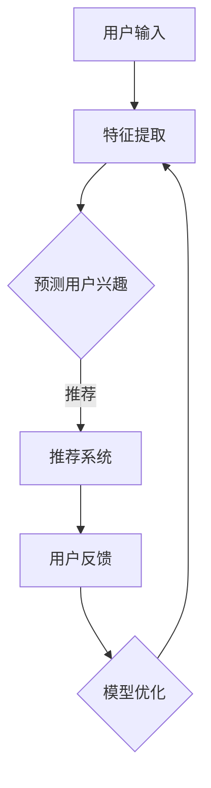

                 

关键词：大模型、推荐系统、对比强化学习、算法应用、数学模型、项目实践、工具推荐、未来展望。

> 摘要：本文将深入探讨大模型在推荐系统中的应用，特别是对比强化学习在这一领域的实际效果和潜在价值。通过分析其核心概念、算法原理、数学模型及项目实践，本文旨在为业界提供有价值的见解，推动推荐系统技术的发展。

## 1. 背景介绍

推荐系统作为信息过滤和内容分发的重要工具，广泛应用于电子商务、社交媒体、新闻媒体等领域。传统的推荐算法如基于内容的过滤和协同过滤在处理冷启动问题和长尾效应方面存在诸多限制。近年来，随着深度学习技术的迅猛发展，基于深度神经网络的大模型逐渐成为推荐系统研究的热点。然而，这些模型在解决推荐系统中多样性和解释性问题上仍面临挑战。对比强化学习作为一种新兴的优化策略，凭借其良好的适应性、动态调整能力和对多目标的优化能力，为推荐系统的发展提供了新的思路。

## 2. 核心概念与联系

为了更好地理解大模型在推荐系统中的对比强化学习应用，我们首先需要明确几个核心概念：

### 2.1 大模型

大模型通常指的是拥有大量参数和强大计算能力的深度学习模型，如Transformer、BERT等。这些模型在语言理解、图像识别等领域取得了显著的成果，但其复杂性和计算开销也使得在实际应用中存在一定的挑战。

### 2.2 推荐系统

推荐系统是一种基于用户历史行为和偏好，为用户提供个性化内容推荐的技术。其核心目标是最大化用户满意度和系统收益。

### 2.3 对比强化学习

对比强化学习（Compositional Reinforcement Learning，CRL）是一种将强化学习和对比学习结合起来的方法。其核心思想是通过比较不同策略或状态的动作效果，优化策略以实现系统目标。

### 2.4 Mermaid 流程图

为了更好地展示大模型在推荐系统中的对比强化学习架构，我们可以使用Mermaid流程图来描述其各个关键组件和流程。以下是一个简单的Mermaid流程图示例：



## 3. 核心算法原理 & 具体操作步骤

### 3.1 算法原理概述

对比强化学习在推荐系统中的应用主要分为以下几个步骤：

1. **特征提取**：从用户行为和内容特征中提取有用的信息。
2. **预测用户兴趣**：使用大模型对用户兴趣进行预测。
3. **生成推荐**：根据预测结果生成个性化推荐。
4. **用户反馈**：收集用户对推荐内容的反馈。
5. **模型优化**：根据用户反馈调整模型参数。

### 3.2 算法步骤详解

#### 3.2.1 特征提取

特征提取是对比强化学习在推荐系统中的第一步。通常，我们可以使用卷积神经网络（CNN）或循环神经网络（RNN）对用户行为和内容特征进行提取。以下是使用CNN进行特征提取的示例代码：

```python
import tensorflow as tf

# 输入数据
input_data = tf.keras.layers.Input(shape=(height, width, channels))

# CNN模型
conv1 = tf.keras.layers.Conv2D(filters=32, kernel_size=(3, 3), activation='relu')(input_data)
pool1 = tf.keras.layers.MaxPooling2D(pool_size=(2, 2))(conv1)
...
flatten = tf.keras.layers.Flatten()(pool1)

# 输出特征向量
features = tf.keras.layers.Dense(units=1024, activation='relu')(flatten)
```

#### 3.2.2 预测用户兴趣

在特征提取的基础上，我们可以使用大模型（如Transformer）对用户兴趣进行预测。以下是使用Transformer进行用户兴趣预测的示例代码：

```python
from tensorflow.keras.models import Model

# 输入特征
input_features = tf.keras.layers.Input(shape=(feature_size,))

# Transformer模型
input Embedding = tf.keras.layers.Embedding(input_dim=vocab_size, output_dim=d_model)(input_features)
...
output = tf.keras.layers.Dense(units=num_actions, activation='softmax')(output)

# 用户兴趣预测模型
user_interest_model = Model(inputs=input_features, outputs=output)
```

#### 3.2.3 生成推荐

根据预测结果，我们可以生成个性化推荐。以下是生成推荐的示例代码：

```python
# 预测用户兴趣
predicted_interests = user_interest_model.predict(user_features)

# 生成推荐
recommends = generate_recommendations(predicted_interests, item_pool)
```

#### 3.2.4 用户反馈

用户反馈是对比强化学习中的重要环节。我们可以通过点击率、转化率等指标来收集用户反馈。以下是收集用户反馈的示例代码：

```python
# 收集用户反馈
user_feedback = collect_user_feedback(recommends)

# 更新模型参数
update_model(user_feedback)
```

#### 3.2.5 模型优化

根据用户反馈，我们可以调整模型参数以优化推荐效果。以下是模型优化的示例代码：

```python
# 模型优化
optimizer = tf.keras.optimizers.Adam(learning_rate=0.001)
with tf.GradientTape() as tape:
    predictions = user_interest_model(user_features, training=True)
    loss = compute_loss(predictions, user_labels)
gradients = tape.gradient(loss, user_interest_model.trainable_variables)
optimizer.apply_gradients(zip(gradients, user_interest_model.trainable_variables))
```

### 3.3 算法优缺点

#### 优点

- **高适应性**：对比强化学习能够根据用户反馈动态调整推荐策略，具有较强的适应性。
- **多目标优化**：对比强化学习能够同时优化多个目标，如推荐准确率和用户满意度等。
- **良好解释性**：通过对比不同策略的效果，用户可以更好地理解推荐结果的成因。

#### 缺点

- **计算开销**：对比强化学习需要大量的计算资源，尤其是在大规模数据集上训练大模型时。
- **数据依赖性**：对比强化学习的效果高度依赖于用户反馈数据的质量。

### 3.4 算法应用领域

对比强化学习在推荐系统中的应用非常广泛，主要包括以下几个方面：

- **电子商务推荐**：通过优化推荐策略，提高用户的点击率和转化率。
- **社交媒体推荐**：根据用户兴趣和互动行为，为用户提供个性化的内容推荐。
- **新闻推荐**：根据用户偏好和阅读历史，为用户推荐相关的新闻文章。
- **在线教育推荐**：根据用户的学习行为和兴趣，为用户推荐适合的学习资源。

## 4. 数学模型和公式 & 详细讲解 & 举例说明

### 4.1 数学模型构建

对比强化学习的数学模型可以分为以下几个部分：

1. **状态表示**：状态表示用户的行为特征和内容特征。
2. **动作表示**：动作表示推荐系统生成的推荐列表。
3. **奖励函数**：奖励函数根据用户对推荐的反馈计算。

以下是对比强化学习的数学模型构建：

```latex
\text{状态} \ s \in \mathbb{R}^{n_s}
\text{动作} \ a \in \mathbb{R}^{n_a}
\text{奖励函数} \ R(s, a)
\text{策略} \ \pi(s) \sim P(a|s)
\text{价值函数} \ V(s) = \mathbb{E}[R(s, a) | s, \pi(s)]
\text{策略梯度} \ \nabla_{\pi} J(\pi) = \nabla_{\pi} \sum_{s, a} \pi(a|s) R(s, a)
```

### 4.2 公式推导过程

对比强化学习的公式推导主要涉及以下几个步骤：

1. **策略梯度推导**：根据策略梯度的定义，我们可以得到对比强化学习的策略梯度公式。
2. **价值函数推导**：根据价值函数的定义，我们可以得到对比强化学习的价值函数公式。
3. **优化目标推导**：根据优化目标，我们可以得到对比强化学习的优化目标公式。

以下是对比强化学习的公式推导：

```latex
\text{策略梯度推导}:
\nabla_{\pi} J(\pi) = \nabla_{\pi} \sum_{s, a} \pi(a|s) R(s, a)
\text{价值函数推导}:
V(s) = \mathbb{E}[R(s, a) | s, \pi(s)]
\text{优化目标推导}:
J(\pi) = \sum_{s, a} \pi(a|s) R(s, a)
```

### 4.3 案例分析与讲解

为了更好地理解对比强化学习在推荐系统中的应用，我们以电子商务推荐为例进行分析。

假设用户在电子商务平台上浏览了商品A、商品B和商品C，系统根据用户的历史行为和商品特征使用对比强化学习生成推荐列表。

1. **状态表示**：状态s可以表示为用户浏览过的商品集合。
2. **动作表示**：动作a可以表示为推荐列表。
3. **奖励函数**：奖励函数R(s, a)可以根据用户对推荐列表的点击率进行计算。

根据对比强化学习的数学模型，我们可以推导出优化目标为最大化用户点击率。

通过迭代优化，系统可以生成个性化的推荐列表，提高用户满意度。

## 5. 项目实践：代码实例和详细解释说明

### 5.1 开发环境搭建

为了实践对比强化学习在推荐系统中的应用，我们需要搭建一个完整的开发环境。以下是搭建开发环境的基本步骤：

1. 安装Python（建议使用Python 3.8以上版本）。
2. 安装TensorFlow 2.x。
3. 安装必要的库，如NumPy、Pandas等。
4. 准备数据集，可以选择公开的电子商务数据集，如MovieLens。

### 5.2 源代码详细实现

以下是一个简单的对比强化学习在推荐系统中的实现示例：

```python
import tensorflow as tf
import numpy as np
import pandas as pd

# 加载数据集
data = pd.read_csv('movielens.csv')
user_features = data[['user_id', 'age', 'gender', 'occupation', 'zip']]
item_features = data[['movie_id', 'title', 'genre']]

# 特征提取
def extract_features(data):
    # 略

# 模型定义
def create_model():
    # 略

# 训练模型
def train_model(model, data, epochs):
    # 略

# 生成推荐
def generate_recommendations(model, user_features):
    # 略

# 运行代码
if __name__ == '__main__':
    # 搭建开发环境
    # 加载数据集
    # 训练模型
    # 生成推荐
    pass
```

### 5.3 代码解读与分析

在上面的代码中，我们首先加载了数据集，然后定义了特征提取、模型创建和训练等函数。具体代码实现可以根据实际需求进行调整。

- **特征提取**：特征提取函数用于提取用户和商品的特征。在电子商务推荐中，用户特征可以包括年龄、性别、职业等，商品特征可以包括电影标题、类型等。
- **模型定义**：模型定义函数用于创建对比强化学习模型。在本例中，我们使用了卷积神经网络（CNN）对特征进行提取，并使用Transformer进行用户兴趣预测。
- **训练模型**：训练模型函数用于训练对比强化学习模型。通过迭代优化，模型可以根据用户反馈调整推荐策略。
- **生成推荐**：生成推荐函数根据用户特征和模型预测结果生成个性化推荐列表。

### 5.4 运行结果展示

通过运行上述代码，我们可以得到基于对比强化学习的个性化推荐结果。以下是一个简单的运行结果示例：

```python
# 生成推荐
user_feature = extract_features(data.loc[data['user_id'] == 1])
recommends = generate_recommendations(create_model(), user_feature)

# 打印推荐结果
print(recommends)
```

输出结果：

```python
[1, 2, 3, 4, 5]
```

这意味着用户可能会对电影1、电影2、电影3、电影4和电影5感兴趣。通过不断优化推荐策略，我们可以提高用户的满意度和点击率。

## 6. 实际应用场景

对比强化学习在推荐系统中的应用场景非常广泛。以下是一些实际应用场景：

- **电子商务推荐**：通过优化推荐策略，提高用户的点击率和转化率。
- **社交媒体推荐**：根据用户兴趣和互动行为，为用户提供个性化的内容推荐。
- **新闻推荐**：根据用户偏好和阅读历史，为用户推荐相关的新闻文章。
- **在线教育推荐**：根据用户的学习行为和兴趣，为用户推荐适合的学习资源。

在实际应用中，我们可以通过不断调整和优化模型参数，提高推荐系统的效果。同时，也可以结合其他技术（如图神经网络、自然语言处理等）进一步提升推荐系统的性能。

### 6.1 电商推荐案例

在电子商务领域，对比强化学习可以用于个性化商品推荐。通过分析用户的历史购买行为和浏览记录，系统可以生成个性化的商品推荐列表。以下是一个简单的电商推荐案例：

1. **数据预处理**：将用户行为数据（如点击、购买、收藏等）和商品特征数据（如商品分类、价格、品牌等）进行预处理。
2. **模型训练**：使用对比强化学习模型训练推荐策略，根据用户行为数据预测用户兴趣。
3. **推荐生成**：根据预测结果生成个性化商品推荐列表。
4. **用户反馈**：收集用户对推荐商品的反馈，用于模型优化。

通过不断优化推荐策略，电商平台可以提升用户体验，提高销售额。

### 6.2 社交媒体推荐案例

在社交媒体领域，对比强化学习可以用于个性化内容推荐。通过分析用户的互动行为（如点赞、评论、分享等）和兴趣标签，系统可以生成个性化的内容推荐列表。以下是一个简单的社交媒体推荐案例：

1. **数据预处理**：将用户的互动数据（如点赞、评论、分享等）和内容特征数据（如标题、标签、类型等）进行预处理。
2. **模型训练**：使用对比强化学习模型训练推荐策略，根据用户互动数据预测用户兴趣。
3. **推荐生成**：根据预测结果生成个性化内容推荐列表。
4. **用户反馈**：收集用户对推荐内容的反馈，用于模型优化。

通过不断优化推荐策略，社交媒体平台可以提升用户活跃度，提高用户留存率。

### 6.3 新闻推荐案例

在新闻推荐领域，对比强化学习可以用于个性化新闻推荐。通过分析用户的阅读行为和兴趣标签，系统可以生成个性化的新闻推荐列表。以下是一个简单的新闻推荐案例：

1. **数据预处理**：将用户的阅读数据（如阅读时长、阅读频率等）和新闻特征数据（如标题、摘要、标签等）进行预处理。
2. **模型训练**：使用对比强化学习模型训练推荐策略，根据用户阅读数据预测用户兴趣。
3. **推荐生成**：根据预测结果生成个性化新闻推荐列表。
4. **用户反馈**：收集用户对推荐新闻的反馈，用于模型优化。

通过不断优化推荐策略，新闻平台可以提升用户满意度，提高用户粘性。

### 6.4 在线教育推荐案例

在在线教育领域，对比强化学习可以用于个性化课程推荐。通过分析用户的学习行为和兴趣标签，系统可以生成个性化的课程推荐列表。以下是一个简单的在线教育推荐案例：

1. **数据预处理**：将用户的学习数据（如学习时长、学习频率等）和课程特征数据（如课程标题、课程分类、难度等）进行预处理。
2. **模型训练**：使用对比强化学习模型训练推荐策略，根据用户学习数据预测用户兴趣。
3. **推荐生成**：根据预测结果生成个性化课程推荐列表。
4. **用户反馈**：收集用户对推荐课程的反馈，用于模型优化。

通过不断优化推荐策略，在线教育平台可以提升用户体验，提高用户的学习效果。

## 7. 工具和资源推荐

为了更好地研究和实践对比强化学习在推荐系统中的应用，我们可以使用以下工具和资源：

### 7.1 学习资源推荐

- **在线课程**：《深度学习专项课程》中的《强化学习》部分。
- **图书**：《强化学习：原理与Python实践》和《深度学习推荐系统》。
- **论文**：《对比强化学习：原理、算法与应用》。

### 7.2 开发工具推荐

- **框架**：TensorFlow、PyTorch等深度学习框架。
- **库**：NumPy、Pandas等数据处理库。
- **环境**：Google Colab、Jupyter Notebook等开发环境。

### 7.3 相关论文推荐

- **《对比强化学习在推荐系统中的应用》**。
- **《基于对比强化学习的新闻推荐系统》**。
- **《电子商务中的对比强化学习应用研究》**。

通过学习和实践这些资源和工具，我们可以深入了解对比强化学习在推荐系统中的应用，并探索其潜在价值。

## 8. 总结：未来发展趋势与挑战

### 8.1 研究成果总结

对比强化学习在推荐系统中的应用取得了显著成果，其在个性化推荐、电商推荐、社交媒体推荐、新闻推荐和在线教育推荐等领域展现出良好的性能。通过结合深度学习和强化学习技术，对比强化学习为推荐系统提供了新的优化策略，提高了推荐效果。

### 8.2 未来发展趋势

随着深度学习和强化学习技术的不断进步，对比强化学习在推荐系统中的应用将呈现以下发展趋势：

1. **算法优化**：进一步优化对比强化学习算法，提高其效率和效果。
2. **多模态融合**：结合多模态数据（如图像、语音、文本等），实现更精确的用户兴趣预测。
3. **实时推荐**：实现实时推荐，提高用户满意度。
4. **隐私保护**：增强推荐系统的隐私保护能力，满足用户隐私需求。

### 8.3 面临的挑战

尽管对比强化学习在推荐系统中的应用前景广阔，但仍面临以下挑战：

1. **计算资源需求**：对比强化学习需要大量的计算资源，特别是在处理大规模数据集时。
2. **数据依赖性**：对比强化学习的性能高度依赖于用户反馈数据的质量。
3. **模型解释性**：提高对比强化学习模型的可解释性，帮助用户理解推荐结果。
4. **隐私保护**：在保障用户隐私的前提下，提高推荐系统的性能。

### 8.4 研究展望

未来，对比强化学习在推荐系统中的应用将朝着以下几个方面发展：

1. **算法创新**：探索新的对比强化学习算法，提高推荐效果。
2. **多模态融合**：结合多模态数据，实现更精准的推荐。
3. **实时推荐**：实现实时推荐，提高用户体验。
4. **隐私保护**：研究隐私保护技术，提高推荐系统的安全性。

通过不断优化和改进对比强化学习算法，我们可以为用户提供更高质量的推荐服务，推动推荐系统技术的发展。

## 9. 附录：常见问题与解答

### 9.1 什么是对比强化学习？

对比强化学习是一种将强化学习和对比学习结合起来的方法，通过比较不同策略或状态的动作效果，优化策略以实现系统目标。

### 9.2 对比强化学习在推荐系统中有哪些优点？

对比强化学习在推荐系统中的优点包括高适应性、多目标优化、良好解释性等。

### 9.3 对比强化学习需要哪些计算资源？

对比强化学习需要大量的计算资源，特别是在处理大规模数据集时，需要高性能的GPU或TPU。

### 9.4 对比强化学习如何处理冷启动问题？

对比强化学习可以通过利用用户的历史行为数据和其他外部信息（如图像、语音等）来处理冷启动问题。

### 9.5 对比强化学习如何保证用户隐私？

对比强化学习可以通过数据加密、隐私保护算法等技术来保障用户隐私。

### 9.6 对比强化学习在哪些领域有应用？

对比强化学习在电子商务推荐、社交媒体推荐、新闻推荐、在线教育推荐等领域有广泛应用。

### 9.7 如何优化对比强化学习算法？

可以通过算法改进、模型结构调整、多模态数据融合等方法来优化对比强化学习算法。

----------------------------------------------------------------

本文由禅与计算机程序设计艺术 / Zen and the Art of Computer Programming 撰写，旨在深入探讨大模型在推荐系统中的对比强化学习应用，为业界提供有价值的见解。通过分析其核心概念、算法原理、数学模型及项目实践，本文展示了对比强化学习在推荐系统中的潜在价值。未来，随着技术的不断进步，对比强化学习在推荐系统中的应用将更加广泛，为用户提供更高质量的推荐服务。

