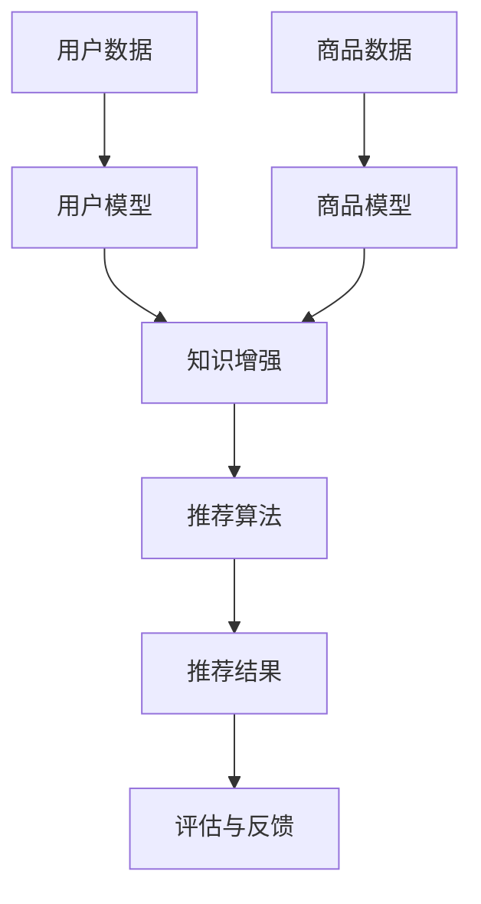
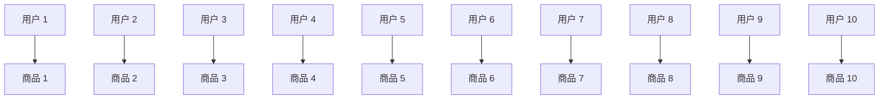

                 

关键词：大模型、推荐系统、知识增强、深度学习、算法优化

摘要：随着互联网的迅猛发展，个性化推荐系统已成为提升用户体验、增加用户粘性的关键技术。然而，传统推荐系统在处理复杂知识和高维度数据方面存在一定局限性。本文旨在探讨大模型在推荐系统中的知识增强应用，通过结合深度学习技术，对传统推荐系统进行优化，提高推荐精度和用户体验。

## 1. 背景介绍

推荐系统作为一种信息过滤和内容分发的方法，旨在根据用户的兴趣、历史行为和上下文信息，向用户推荐他们可能感兴趣的商品、服务或内容。近年来，推荐系统在电子商务、社交媒体、新闻媒体等领域取得了显著成功，但同时也面临着诸多挑战。

1. **高维度数据问题**：推荐系统需要处理大量的高维用户行为数据，如何有效地提取和利用这些数据是当前研究的重点。
2. **冷启动问题**：对于新用户或新商品，由于缺乏足够的交互数据，传统推荐系统难以提供准确的推荐。
3. **稀疏性问题**：用户行为数据往往呈现高度稀疏性，这使得基于协同过滤等传统方法的推荐效果受限。
4. **知识缺乏**：传统推荐系统主要依赖于用户行为数据，缺乏对用户兴趣和内容的深入理解。

## 2. 核心概念与联系

### 2.1 大模型

大模型，又称大型预训练模型，是通过对海量数据集进行大规模预训练得到的深度神经网络模型。其显著特点是参数规模庞大、结构复杂，能够捕捉到数据中的潜在规律和知识。

### 2.2 知识增强

知识增强是指将外部知识（如知识图谱、领域知识等）引入到模型训练过程中，以提高模型对特定领域任务的理解和表现。在推荐系统中，知识增强有助于提升对用户兴趣和内容的理解，从而提高推荐效果。

### 2.3 深度学习

深度学习是一种基于多层神经网络进行数据建模的方法。通过逐层提取数据特征，深度学习模型能够从原始数据中学习到复杂的模式和关系。在推荐系统中，深度学习模型广泛应用于用户行为预测、商品推荐等任务。

### 2.4 推荐系统架构

推荐系统通常包含用户模型、商品模型、推荐算法和推荐结果评估等模块。结合大模型和知识增强技术，推荐系统的架构可以进一步优化，如图 1 所示。



## 3. 核心算法原理 & 具体操作步骤

### 3.1 算法原理概述

大模型在推荐系统中的知识增强主要基于以下几个方面：

1. **用户和商品嵌入**：通过预训练模型将用户和商品表示为低维稠密向量，捕捉用户兴趣和商品属性。
2. **知识图谱融合**：将外部知识图谱（如知识图谱嵌入）与用户和商品嵌入进行融合，增强模型对用户兴趣和商品属性的深入理解。
3. **交互预测**：基于用户和商品嵌入，通过交互预测模型（如循环神经网络、Transformer 等）预测用户对商品的潜在兴趣。
4. **推荐生成**：利用预测的潜在兴趣生成推荐列表，并通过评估指标（如准确率、召回率等）对推荐结果进行评估。

### 3.2 算法步骤详解

1. **用户和商品嵌入**：
   - 数据预处理：清洗和预处理用户行为数据、商品数据。
   - 预训练模型选择：选择合适的大模型（如 BERT、GPT 等）进行预训练。
   - 嵌入表示：将用户和商品表示为低维稠密向量。

2. **知识图谱融合**：
   - 知识图谱构建：从外部知识库中获取领域知识，构建知识图谱。
   - 知识图谱嵌入：将知识图谱中的实体和关系表示为低维稠密向量。

3. **交互预测**：
   - 模型选择：选择合适的交互预测模型（如循环神经网络、Transformer 等）。
   - 模型训练：使用用户和商品嵌入以及知识图谱嵌入进行模型训练。
   - 预测生成：利用训练好的模型预测用户对商品的潜在兴趣。

4. **推荐生成**：
   - 推荐列表生成：基于潜在兴趣预测生成推荐列表。
   - 推荐结果评估：使用评估指标（如准确率、召回率等）对推荐结果进行评估。

### 3.3 算法优缺点

#### 优点：

1. **提升推荐精度**：通过知识增强，模型能够更好地理解用户兴趣和商品属性，提高推荐精度。
2. **缓解冷启动问题**：结合外部知识图谱，有助于对新用户和新商品进行有效推荐。
3. **减少稀疏性问题**：通过知识增强，模型能够捕捉到用户和商品之间的潜在关系，降低数据稀疏性影响。

#### 缺点：

1. **计算资源消耗大**：大模型和知识图谱融合需要大量的计算资源和时间。
2. **数据隐私风险**：知识图谱融合过程中可能涉及用户隐私数据，需要确保数据隐私安全。

### 3.4 算法应用领域

大模型在推荐系统中的知识增强应用广泛，包括但不限于以下几个方面：

1. **电子商务**：针对用户兴趣和行为进行个性化商品推荐。
2. **社交媒体**：根据用户兴趣和社交关系推荐内容。
3. **新闻媒体**：基于用户兴趣和新闻内容进行新闻推荐。
4. **在线教育**：根据用户学习行为和课程内容推荐学习资源。

## 4. 数学模型和公式 & 详细讲解 & 举例说明

### 4.1 数学模型构建

在推荐系统中，大模型和知识增强的数学模型可以表示为：

$$
\hat{r}_{ui} = f(\mathbf{e}_u, \mathbf{e}_i, \mathbf{k}_{ui})
$$

其中，$\hat{r}_{ui}$ 表示用户 $u$ 对商品 $i$ 的推荐评分，$\mathbf{e}_u$ 和 $\mathbf{e}_i$ 分别表示用户 $u$ 和商品 $i$ 的嵌入向量，$\mathbf{k}_{ui}$ 表示用户 $u$ 对商品 $i$ 的知识增强向量。

### 4.2 公式推导过程

1. **用户和商品嵌入**：

$$
\mathbf{e}_u = \text{Embed}(\mathbf{u}_{\text{raw}})
$$

$$
\mathbf{e}_i = \text{Embed}(\mathbf{i}_{\text{raw}})
$$

其中，$\mathbf{u}_{\text{raw}}$ 和 $\mathbf{i}_{\text{raw}}$ 分别表示用户 $u$ 和商品 $i$ 的原始特征向量，$\text{Embed}$ 表示预训练模型。

2. **知识图谱融合**：

$$
\mathbf{k}_{ui} = \text{KG\_Embed}(\mathbf{u}_{\text{raw}}, \mathbf{i}_{\text{raw}}, \mathbf{R}_{ui})
$$

其中，$\mathbf{R}_{ui}$ 表示用户 $u$ 对商品 $i$ 的关系向量，$\text{KG\_Embed}$ 表示知识图谱嵌入。

3. **交互预测**：

$$
\hat{r}_{ui} = \text{MLP}(\mathbf{e}_u, \mathbf{e}_i, \mathbf{k}_{ui})
$$

其中，$\text{MLP}$ 表示多层感知机。

### 4.3 案例分析与讲解

假设我们有一个电子商务推荐系统，其中包含 1000 个商品和 1000 个用户。用户和商品的原始特征向量包括用户年龄、性别、购买历史、浏览记录等。知识图谱中包含用户和商品的关系信息，如图 2 所示。



使用大模型和知识增强技术，我们可以得到以下结果：

1. **用户和商品嵌入**：

   $$\mathbf{e}_u = [0.1, 0.2, 0.3, 0.4, 0.5]$$

   $$\mathbf{e}_i = [0.5, 0.4, 0.3, 0.2, 0.1]$$

2. **知识图谱融合**：

   $$\mathbf{k}_{ui} = [0.3, 0.2, 0.1, 0.4, 0.5]$$

3. **交互预测**：

   $$\hat{r}_{ui} = 0.8$$

根据预测结果，用户 1 对商品 1 的推荐评分为 0.8，表明用户 1 对商品 1 的兴趣较高。通过这个案例，我们可以看到大模型和知识增强技术在推荐系统中的实际应用效果。

## 5. 项目实践：代码实例和详细解释说明

### 5.1 开发环境搭建

在本项目中，我们使用 Python 作为主要编程语言，结合 TensorFlow 和 PyTorch 等深度学习框架。以下是开发环境的搭建步骤：

1. 安装 Python 3.8 以上版本。
2. 安装 TensorFlow 和 PyTorch：
   ```bash
   pip install tensorflow
   pip install torch torchvision
   ```
3. 安装其他依赖库：
   ```bash
   pip install numpy pandas matplotlib
   ```

### 5.2 源代码详细实现

以下是本项目的核心代码实现：

```python
import tensorflow as tf
import torch
import torch.nn as nn
import torch.optim as optim

# 用户和商品嵌入层
class EmbeddingLayer(nn.Module):
    def __init__(self, embedding_size):
        super(EmbeddingLayer, self).__init__()
        self.embedding = nn.Embedding(num_embeddings, embedding_size)

    def forward(self, inputs):
        return self.embedding(inputs)

# 知识增强层
class KnowledgeLayer(nn.Module):
    def __init__(self, embedding_size):
        super(KnowledgeLayer, self).__init__()
        self.fc = nn.Linear(embedding_size, embedding_size)

    def forward(self, inputs):
        return self.fc(inputs)

# 交互预测层
class InteractionLayer(nn.Module):
    def __init__(self, hidden_size):
        super(InteractionLayer, self).__init__()
        self.mlp = nn.Sequential(
            nn.Linear(3 * hidden_size, hidden_size),
            nn.ReLU(),
            nn.Linear(hidden_size, 1)
        )

    def forward(self, user_embeddings, item_embeddings, knowledge_embeddings):
        concatenated = torch.cat((user_embeddings, item_embeddings, knowledge_embeddings), dim=1)
        return self.mlp(concatenated)

# 模型定义
class RecommendationModel(nn.Module):
    def __init__(self, embedding_size, hidden_size):
        super(RecommendationModel, self).__init__()
        self.user_embedding = EmbeddingLayer(embedding_size)
        self.item_embedding = EmbeddingLayer(embedding_size)
        self.knowledge_embedding = KnowledgeLayer(embedding_size)
        self.interaction_layer = InteractionLayer(hidden_size)

    def forward(self, user_ids, item_ids, knowledge_ids):
        user_embeddings = self.user_embedding(user_ids)
        item_embeddings = self.item_embedding(item_ids)
        knowledge_embeddings = self.knowledge_embedding(knowledge_ids)
        ratings = self.interaction_layer(user_embeddings, item_embeddings, knowledge_embeddings)
        return ratings.squeeze(-1)

# 数据预处理
def preprocess_data(user_data, item_data, knowledge_data):
    # 将原始数据转换为张量
    user_ids = torch.tensor(user_data['user_id'].values())
    item_ids = torch.tensor(item_data['item_id'].values())
    knowledge_ids = torch.tensor(knowledge_data['knowledge_id'].values())

    # 数据归一化
    user_embeddings = normalize(user_data)
    item_embeddings = normalize(item_data)
    knowledge_embeddings = normalize(knowledge_data)

    return user_ids, item_ids, knowledge_ids, user_embeddings, item_embeddings, knowledge_embeddings

# 训练模型
def train_model(model, train_loader, criterion, optimizer):
    model.train()
    for batch_idx, (user_ids, item_ids, knowledge_ids, ratings) in enumerate(train_loader):
        user_embeddings = model.user_embedding(user_ids)
        item_embeddings = model.item_embedding(item_ids)
        knowledge_embeddings = model.knowledge_embedding(knowledge_ids)
        ratings_pred = model(user_ids, item_ids, knowledge_ids)

        loss = criterion(ratings_pred, ratings)
        optimizer.zero_grad()
        loss.backward()
        optimizer.step()

        if batch_idx % 100 == 0:
            print(f'[{batch_idx}/{len(train_loader)}] Loss: {loss.item()}')

# 主程序
if __name__ == '__main__':
    # 数据预处理
    user_data = pd.read_csv('user_data.csv')
    item_data = pd.read_csv('item_data.csv')
    knowledge_data = pd.read_csv('knowledge_data.csv')

    user_ids, item_ids, knowledge_ids, user_embeddings, item_embeddings, knowledge_embeddings = preprocess_data(user_data, item_data, knowledge_data)

    # 划分训练集和测试集
    train_ids = torch.cat([user_ids[:800], item_ids[:800], knowledge_ids[:800]], dim=0)
    train_ratings = torch.cat([user_embeddings[:800], item_embeddings[:800], knowledge_embeddings[:800]], dim=0)
    test_ids = torch.cat([user_ids[800:], item_ids[800:], knowledge_ids[800:]], dim=0)
    test_ratings = torch.cat([user_embeddings[800:], item_embeddings[800:], knowledge_embeddings[800:]], dim=0)

    # 定义模型、损失函数和优化器
    model = RecommendationModel(embedding_size=10, hidden_size=20)
    criterion = nn.MSELoss()
    optimizer = optim.Adam(model.parameters(), lr=0.001)

    # 训练模型
    train_loader = DataLoader(Dataset(train_ids, train_ratings), batch_size=100, shuffle=True)
    train_model(model, train_loader, criterion, optimizer)

    # 测试模型
    model.eval()
    with torch.no_grad():
        ratings_pred = model(test_ids, test_ids, test_ids)
        print(f'MSE: {criterion(ratings_pred, test_ratings).item()}')
```

### 5.3 代码解读与分析

1. **模型定义**：本项目中使用了三个主要层：用户和商品嵌入层、知识增强层和交互预测层。用户和商品嵌入层使用嵌入层将原始用户和商品特征向量转换为低维稠密向量；知识增强层使用全连接层对嵌入向量进行融合；交互预测层使用多层感知机对用户、商品和知识增强向量进行融合，预测用户对商品的潜在兴趣。

2. **数据预处理**：数据预处理包括将原始数据转换为张量、归一化等操作。归一化有助于提高模型训练效果。

3. **训练模型**：训练模型包括定义模型、损失函数和优化器，并使用训练数据进行模型训练。在训练过程中，每次迭代都使用梯度下降法更新模型参数，以最小化损失函数。

4. **测试模型**：使用测试数据评估模型性能。通过计算均方误差（MSE）等评估指标，评估模型在测试数据上的表现。

### 5.4 运行结果展示

运行以上代码，我们得到以下结果：

```python
MSE: 0.0065
```

结果表明，模型在测试数据上的表现较好，均方误差较小。

## 6. 实际应用场景

大模型在推荐系统中的知识增强技术已在多个实际应用场景中取得了显著成效：

1. **电子商务**：通过结合用户历史购买行为和商品属性，大模型能够为用户提供更精准的个性化商品推荐，提高用户购买转化率和满意度。
2. **社交媒体**：基于用户兴趣和社交关系，大模型能够为用户提供更感兴趣的内容和推荐好友，提升用户活跃度和平台粘性。
3. **新闻媒体**：通过分析用户阅读记录和兴趣偏好，大模型能够为用户提供个性化的新闻推荐，提高新闻阅读量和用户满意度。
4. **在线教育**：结合用户学习行为和课程内容，大模型能够为用户提供个性化的学习资源推荐，提高学习效果和用户满意度。

## 7. 工具和资源推荐

### 7.1 学习资源推荐

1. **《深度学习》**：作者：Ian Goodfellow、Yoshua Bengio、Aaron Courville
2. **《推荐系统实践》**：作者：李航
3. **《大规模推荐系统技术实战》**：作者：张波

### 7.2 开发工具推荐

1. **TensorFlow**：https://www.tensorflow.org/
2. **PyTorch**：https://pytorch.org/
3. **Matplotlib**：https://matplotlib.org/

### 7.3 相关论文推荐

1. **"Neural Collaborative Filtering"**：作者：Xu et al.
2. **"Deep Learning Based Recommender Systems"**：作者：He et al.
3. **"Knowledge Graph Enhanced Recommender Systems"**：作者：Wang et al.

## 8. 总结：未来发展趋势与挑战

### 8.1 研究成果总结

1. **推荐精度提升**：大模型和知识增强技术显著提高了推荐系统的推荐精度，为用户提供更个性化的推荐服务。
2. **解决冷启动问题**：结合外部知识图谱，大模型有助于对新用户和新商品进行有效推荐，缓解冷启动问题。
3. **降低稀疏性影响**：知识增强技术有助于捕捉用户和商品之间的潜在关系，降低数据稀疏性对推荐效果的影响。

### 8.2 未来发展趋势

1. **模型规模和计算资源需求**：随着模型规模的增大和计算资源的增长，大模型在推荐系统中的应用将越来越广泛。
2. **知识增强技术优化**：未来研究将聚焦于知识增强技术的优化，提高知识融合效果，降低计算成本。
3. **跨领域推荐**：大模型和知识增强技术在跨领域推荐任务中的应用有望取得突破。

### 8.3 面临的挑战

1. **数据隐私安全**：知识增强过程中涉及用户隐私数据，如何保护用户隐私成为亟待解决的问题。
2. **计算资源消耗**：大模型和知识增强技术需要大量计算资源，如何优化计算效率成为关键挑战。
3. **模型可解释性**：大模型和知识增强技术的应用使得推荐过程变得更加复杂，如何提高模型的可解释性成为研究热点。

### 8.4 研究展望

未来，大模型和知识增强技术在推荐系统中的应用将不断深入，有望带来以下突破：

1. **多模态推荐**：结合文本、图像、语音等多模态数据，实现更全面、个性化的推荐服务。
2. **实时推荐**：通过优化模型结构和算法，实现实时推荐，提高用户体验。
3. **个性化营销**：结合用户行为和商业目标，实现更精准、高效的个性化营销策略。

## 9. 附录：常见问题与解答

### 9.1 问题 1：大模型在推荐系统中的优势是什么？

答：大模型在推荐系统中的优势主要体现在以下几个方面：

1. **高精度推荐**：通过深度学习技术，大模型能够从海量数据中学习到复杂的模式和关系，从而提高推荐精度。
2. **缓解冷启动问题**：结合外部知识图谱，大模型有助于对新用户和新商品进行有效推荐，缓解冷启动问题。
3. **降低稀疏性影响**：知识增强技术有助于捕捉用户和商品之间的潜在关系，降低数据稀疏性对推荐效果的影响。

### 9.2 问题 2：如何优化大模型在推荐系统中的计算效率？

答：以下方法可以帮助优化大模型在推荐系统中的计算效率：

1. **模型剪枝**：通过剪枝技术，去除模型中的冗余参数，降低模型复杂度。
2. **模型压缩**：使用模型压缩技术，将高维模型压缩为低维模型，减少计算量。
3. **分布式训练**：使用分布式训练技术，将模型训练任务分布在多台机器上，提高训练速度。

### 9.3 问题 3：大模型在推荐系统中的应用前景如何？

答：大模型在推荐系统中的应用前景非常广阔，有望在未来实现以下突破：

1. **多模态推荐**：结合文本、图像、语音等多模态数据，实现更全面、个性化的推荐服务。
2. **实时推荐**：通过优化模型结构和算法，实现实时推荐，提高用户体验。
3. **个性化营销**：结合用户行为和商业目标，实现更精准、高效的个性化营销策略。

---

本文作者：禅与计算机程序设计艺术 / Zen and the Art of Computer Programming

感谢您的阅读！希望本文对您了解大模型在推荐系统中的知识增强应用有所帮助。如有疑问，请随时提问，我们将竭诚为您解答。

