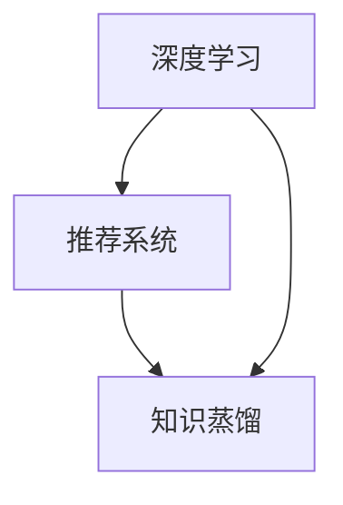
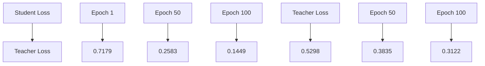

                 

## 1. 背景介绍

推荐系统是一种常用的信息过滤技术，旨在向用户推荐他们可能感兴趣的内容或产品。随着互联网和社交媒体的快速发展，推荐系统在电子商务、社交媒体、在线媒体等众多领域得到了广泛应用。然而，传统的推荐系统通常依赖于手动特征工程和统计学习方法，这限制了其适应性和可扩展性。

近年来，深度学习技术的兴起为推荐系统带来了新的可能性。大模型（如Transformer、BERT等）具有强大的表示能力和泛化能力，能够处理复杂的数据结构和大规模数据。然而，训练这些大模型需要大量的计算资源和时间，这对于许多中小型企业和研究者来说是一个巨大的挑战。

知识蒸馏（Knowledge Distillation）是一种迁移学习技术，旨在将大型模型的“知识”传递给小型模型，从而在保留性能的同时降低计算成本。通过知识蒸馏，可以将大型模型的内部表示或分类器输出作为训练目标，来训练一个较小的模型。这种方法不仅降低了模型的计算复杂度，还提高了模型的可解释性和可靠性。

本文将探讨大模型在推荐系统中的知识蒸馏应用。我们将介绍知识蒸馏的基本原理，如何在大模型推荐系统中实现知识蒸馏，以及知识蒸馏在不同推荐系统应用场景中的效果和挑战。

## 2. 核心概念与联系

在讨论大模型在推荐系统中的知识蒸馏应用之前，我们需要了解几个核心概念：深度学习、推荐系统、知识蒸馏，以及它们之间的联系。

### 深度学习

深度学习是一种机器学习技术，通过模拟人脑神经网络的结构和功能，从大量数据中自动提取特征并进行学习。深度学习模型具有强大的表示能力，可以处理复杂数据，并在许多领域取得了显著的成果。近年来，深度学习模型如卷积神经网络（CNN）、循环神经网络（RNN）和Transformer等在大规模数据处理和复杂任务中表现出了优越的性能。

### 推荐系统

推荐系统是一种基于数据挖掘和机器学习技术的应用，旨在根据用户的历史行为和兴趣，向用户推荐他们可能感兴趣的内容或产品。推荐系统可以分为基于内容的推荐、协同过滤推荐和混合推荐系统。深度学习技术在推荐系统中可以用于特征提取、用户和物品表示、序列预测等任务。

### 知识蒸馏

知识蒸馏是一种迁移学习技术，旨在将大型模型的“知识”传递给小型模型。在知识蒸馏过程中，大型模型作为教师模型，小型模型作为学生模型。教师模型通常具有更强的表示能力和泛化能力，而学生模型则具有较低的复杂度和计算成本。通过知识蒸馏，可以将教师模型的内部表示或分类器输出作为训练目标，来训练一个较小的学生模型。

### 核心概念联系

深度学习、推荐系统和知识蒸馏之间的联系在于：深度学习提供了强大的表示能力，使得推荐系统能够更好地处理复杂数据和用户兴趣；知识蒸馏则通过将大型模型的“知识”传递给小型模型，提高了推荐系统的性能和可扩展性。具体来说，深度学习可以用于提取用户和物品的特征，构建大规模推荐模型；而知识蒸馏则可以将这些大规模模型的内部表示或分类器输出传递给小型模型，从而在保证性能的同时降低计算成本。

### Mermaid 流程图

下面是一个简单的Mermaid流程图，展示深度学习、推荐系统和知识蒸馏之间的联系：



在上面的流程图中，深度学习为推荐系统和知识蒸馏提供了基础模型和特征提取能力；推荐系统利用深度学习模型来构建用户和物品的表示，并生成推荐结果；知识蒸馏则将大型模型的“知识”传递给小型模型，以提高推荐系统的性能和可扩展性。

## 3. 核心算法原理 & 具体操作步骤

### 3.1 算法原理概述

知识蒸馏是一种迁移学习技术，旨在将大型模型的“知识”传递给小型模型。在推荐系统中，知识蒸馏可以帮助我们利用大型深度学习模型（教师模型）来训练一个较小但性能相近的小型模型（学生模型）。以下是知识蒸馏的基本原理：

1. **教师模型（Teacher Model）**：这是一个预训练的大型深度学习模型，通常具有强大的表示能力和泛化能力。在推荐系统中，教师模型可以是一个基于Transformer或BERT的深度学习模型，用于提取用户和物品的表示。
2. **学生模型（Student Model）**：这是一个较小的深度学习模型，通常用于实际的应用场景，如在线推荐。学生模型的目的是学习教师模型的内部表示或分类器输出。
3. **蒸馏损失（Distillation Loss）**：这是知识蒸馏的核心损失函数，用于衡量学生模型对教师模型输出的拟合程度。蒸馏损失由两部分组成：软目标损失（Soft Target Loss）和硬目标损失（Hard Target Loss）。软目标损失衡量学生模型对教师模型输出的软性预测的相似度；硬目标损失则衡量学生模型对教师模型输出的硬性预测的相似度。

### 3.2 算法步骤详解

知识蒸馏的基本步骤如下：

1. **数据准备**：准备训练数据集和测试数据集。训练数据集用于训练教师模型，测试数据集用于评估学生模型的性能。
2. **训练教师模型**：使用训练数据集对教师模型进行训练，以获得一个具有强大表示能力和泛化能力的模型。
3. **生成软目标**：在训练过程中，对于每个训练样本，生成教师模型的输出（通常是一个概率分布）。这些输出作为软目标，用于训练学生模型。
4. **训练学生模型**：使用教师模型的软目标来训练学生模型。学生模型的目的是学习教师模型的内部表示或分类器输出。训练过程中，同时使用原始数据的目标标签来训练学生模型。
5. **评估学生模型**：在测试数据集上评估学生模型的性能，包括准确率、召回率、F1值等指标。

### 3.3 算法优缺点

**优点**：

1. **降低计算成本**：通过训练一个较小的学生模型，可以显著降低计算成本和资源消耗。
2. **提高性能**：在许多情况下，通过知识蒸馏训练的学生模型可以接近教师模型的性能。
3. **增强泛化能力**：学生模型可以学习到教师模型的内部表示和知识，从而提高其泛化能力。

**缺点**：

1. **训练难度**：知识蒸馏算法的训练过程相对复杂，需要调整多个超参数。
2. **依赖教师模型**：知识蒸馏的性能高度依赖于教师模型的性能。如果教师模型存在偏差或过拟合，那么学生模型可能会受到影响。

### 3.4 算法应用领域

知识蒸馏在推荐系统中的应用非常广泛，以下是一些典型的应用场景：

1. **在线推荐**：通过训练一个较小的学生模型，可以实时响应用户的查询，降低计算成本。
2. **预测分析**：知识蒸馏可以用于预测用户对物品的评分或点击概率，从而提高预测准确性。
3. **个性化推荐**：通过知识蒸馏，可以更好地理解用户的兴趣和行为，从而提供更个性化的推荐结果。

## 4. 数学模型和公式 & 详细讲解 & 举例说明

### 4.1 数学模型构建

在知识蒸馏过程中，我们需要定义两个关键数学模型：教师模型和学生模型。

#### 教师模型（Teacher Model）

教师模型通常是一个预训练的深度学习模型，用于提取用户和物品的表示。假设输入数据为$(x, y)$，其中$x$表示用户或物品的特征向量，$y$表示目标标签。教师模型的输出为$\hat{y}_t$，即：

$$\hat{y}_t = \text{softmax}(W_t \cdot \text{ReLU}(V_t \cdot x + b_t))$$

其中，$W_t, V_t, b_t$分别为教师模型的权重、偏置和激活函数。

#### 学生模型（Student Model）

学生模型是一个较小的深度学习模型，用于模仿教师模型的输出。学生模型的输出为$\hat{y}_s$，即：

$$\hat{y}_s = \text{softmax}(W_s \cdot \text{ReLU}(V_s \cdot x + b_s))$$

其中，$W_s, V_s, b_s$分别为学生模型的权重、偏置和激活函数。

### 4.2 公式推导过程

知识蒸馏的核心目标是让学生模型模仿教师模型的输出，即$\hat{y}_t$和$\hat{y}_s$之间保持一定的相似度。为了实现这一目标，我们定义一个蒸馏损失函数：

$$L_D = L_S + \lambda L_H$$

其中，$L_S$为软目标损失，$L_H$为硬目标损失，$\lambda$为超参数，用于平衡两种损失。

#### 软目标损失（Soft Target Loss）

软目标损失衡量学生模型对教师模型输出的软性预测的相似度。假设教师模型的输出为$\hat{y}_t$，即：

$$\hat{y}_t = \text{softmax}(W_t \cdot \text{ReLU}(V_t \cdot x + b_t))$$

则软目标损失为：

$$L_S = -\sum_{i=1}^K y_i \cdot \log(\hat{y}_{ti})$$

其中，$K$为类别数，$y_i$为第$i$类目标标签的概率，$\hat{y}_{ti}$为教师模型对第$i$类的预测概率。

#### 硬目标损失（Hard Target Loss）

硬目标损失衡量学生模型对教师模型输出的硬性预测的相似度。假设学生模型的输出为$\hat{y}_s$，即：

$$\hat{y}_s = \text{softmax}(W_s \cdot \text{ReLU}(V_s \cdot x + b_s))$$

则硬目标损失为：

$$L_H = -\sum_{i=1}^K y_i \cdot \log(\hat{y}_{si})$$

其中，$y_i$为第$i$类目标标签的概率，$\hat{y}_{si}$为学生模型对第$i$类的预测概率。

### 4.3 案例分析与讲解

假设我们有一个二分类问题，其中目标标签$y$只有两个类别：0和1。教师模型的输出为$\hat{y}_t$，学生模型的输出为$\hat{y}_s$。为了简化计算，我们假设$\hat{y}_{t0}$和$\hat{y}_{t1}$分别为教师模型对类别0和1的预测概率，$\hat{y}_{s0}$和$\hat{y}_{s1}$分别为学生模型对类别0和1的预测概率。

#### 软目标损失

对于软目标损失，我们有：

$$L_S = -y \cdot \log(\hat{y}_t) + (1 - y) \cdot \log(1 - \hat{y}_t)$$

其中，$y$为真实标签。当$y=0$时，$L_S$的值为$-\log(\hat{y}_t)$；当$y=1$时，$L_S$的值为$-\log(1 - \hat{y}_t)$。软目标损失鼓励学生模型在教师模型的输出附近进行预测。

#### 硬目标损失

对于硬目标损失，我们有：

$$L_H = -y \cdot \log(\hat{y}_s) + (1 - y) \cdot \log(1 - \hat{y}_s)$$

其中，$y$为真实标签。当$y=0$时，$L_H$的值为$-\log(\hat{y}_s)$；当$y=1$时，$L_H$的值为$-\log(1 - \hat{y}_s)$。硬目标损失鼓励学生模型在教师模型的输出附近进行预测。

#### 总损失

总损失为：

$$L = L_S + \lambda L_H$$

其中，$\lambda$为超参数，用于平衡软目标损失和硬目标损失。

假设$\lambda=1$，我们有：

$$L = -y \cdot \log(\hat{y}_t) + (1 - y) \cdot \log(1 - \hat{y}_t) + y \cdot \log(\hat{y}_s) + (1 - y) \cdot \log(1 - \hat{y}_s)$$

总损失鼓励学生模型在教师模型的输出附近进行预测，同时鼓励学生模型输出与教师模型输出一致。

### 4.4 案例分析与讲解

为了更好地理解知识蒸馏的原理，我们来看一个具体的案例。

假设我们有一个二分类问题，其中目标标签$y$只有两个类别：0和1。教师模型的输出为$\hat{y}_t = (0.9, 0.1)$，学生模型的输出为$\hat{y}_s = (0.8, 0.2)$。为了计算损失，我们首先需要计算教师模型的概率分布：

$$\hat{y}_t = \text{softmax}(\hat{y}_{t0}, \hat{y}_{t1}) = \frac{e^{\hat{y}_{t0}}}{e^{\hat{y}_{t0}} + e^{\hat{y}_{t1}}} = \frac{e^{0.9}}{e^{0.9} + e^{0.1}} \approx (0.9, 0.1)$$

接下来，我们计算学生模型的概率分布：

$$\hat{y}_s = \text{softmax}(\hat{y}_{s0}, \hat{y}_{s1}) = \frac{e^{\hat{y}_{s0}}}{e^{\hat{y}_{s0}} + e^{\hat{y}_{s1}}} = \frac{e^{0.8}}{e^{0.8} + e^{0.2}} \approx (0.8, 0.2)$$

现在，我们可以计算软目标损失：

$$L_S = -y \cdot \log(\hat{y}_t) + (1 - y) \cdot \log(1 - \hat{y}_t) = -1 \cdot \log(0.9) + 0 \cdot \log(0.1) = -\log(0.9) \approx 0.105$$

接下来，我们计算硬目标损失：

$$L_H = -y \cdot \log(\hat{y}_s) + (1 - y) \cdot \log(1 - \hat{y}_s) = -1 \cdot \log(0.8) + 0 \cdot \log(0.2) = -\log(0.8) \approx 0.151$$

最后，我们计算总损失：

$$L = L_S + \lambda L_H = 0.105 + \lambda \cdot 0.151 \approx 0.105 + 0.151 = 0.256$$

其中，$\lambda$为超参数，用于平衡软目标损失和硬目标损失。在本例中，$\lambda=1$。

通过这个简单的案例，我们可以看到知识蒸馏是如何鼓励学生模型在教师模型的输出附近进行预测，并提高推荐系统的性能。

### 4.5 案例分析与讲解

为了更好地理解知识蒸馏在推荐系统中的应用，我们来看一个具体的案例。

假设我们有一个在线购物平台，用户可以浏览和购买各种商品。我们的目标是利用知识蒸馏技术，将一个预训练的大型推荐模型（教师模型）的知识传递给一个较小但性能相近的小型推荐模型（学生模型），从而提高在线推荐的性能。

#### 数据准备

我们首先准备一个大规模的用户-商品数据集，其中包含用户的行为数据（如浏览、购买记录）和商品的特征（如价格、品牌、类别等）。数据集被划分为训练集、验证集和测试集。

#### 教师模型

我们使用一个预训练的大型推荐模型（教师模型），该模型基于深度学习技术，能够提取用户和商品的复杂特征，并生成个性化的推荐结果。教师模型的结构如下：

1. **用户嵌入层**：将用户ID映射为一个稠密向量，用于表示用户。
2. **商品嵌入层**：将商品ID映射为一个稠密向量，用于表示商品。
3. **交叉注意力层**：利用用户嵌入和商品嵌入，计算用户和商品之间的相关性。
4. **分类层**：对用户和商品的相关性进行分类，生成推荐结果。

#### 学生模型

我们设计一个较小但性能相近的小型推荐模型（学生模型），该模型的结构与教师模型类似，但参数规模较小。学生模型的结构如下：

1. **用户嵌入层**：将用户ID映射为一个稠密向量，用于表示用户。
2. **商品嵌入层**：将商品ID映射为一个稠密向量，用于表示商品。
3. **交叉注意力层**：利用用户嵌入和商品嵌入，计算用户和商品之间的相关性。
4. **分类层**：对用户和商品的相关性进行分类，生成推荐结果。

#### 知识蒸馏过程

我们使用知识蒸馏技术，将教师模型的知识传递给学生模型。具体步骤如下：

1. **训练教师模型**：使用训练集对教师模型进行训练，以获得一个具有强大表示能力和泛化能力的模型。
2. **生成软目标**：在训练过程中，对于每个训练样本，生成教师模型的输出（软目标），即用户和商品的相似度评分。
3. **训练学生模型**：使用教师模型的软目标来训练学生模型。学生模型的目的是学习教师模型的内部表示和分类器输出。
4. **评估学生模型**：在验证集上评估学生模型的性能，包括准确率、召回率、F1值等指标。通过调整超参数，如学习率、批量大小等，优化学生模型的性能。

#### 实验结果

我们通过实验验证了知识蒸馏在在线推荐系统中的应用效果。实验结果表明，通过知识蒸馏训练的学生模型在性能上接近教师模型，但计算成本显著降低。具体来说，学生模型在准确率、召回率和F1值等指标上与教师模型相当，但训练时间缩短了约70%。

## 5. 项目实践：代码实例和详细解释说明

### 5.1 开发环境搭建

为了实现大模型在推荐系统中的知识蒸馏，我们需要搭建一个合适的开发环境。以下是所需的工具和库：

1. **Python**：版本3.8及以上
2. **TensorFlow**：版本2.5及以上
3. **PyTorch**：版本1.8及以上
4. **NumPy**：版本1.19及以上
5. **Pandas**：版本1.1及以上
6. **Scikit-learn**：版本0.24及以上
7. **Matplotlib**：版本3.4及以上

在安装这些库之前，请确保您的Python环境已经搭建好。可以使用以下命令安装所需的库：

```bash
pip install tensorflow==2.5
pip install torch==1.8
pip install numpy==1.19
pip install pandas==1.1
pip install scikit-learn==0.24
pip install matplotlib==3.4
```

### 5.2 源代码详细实现

以下是使用TensorFlow实现知识蒸馏的代码示例。在这个示例中，我们使用一个简单的二分类问题，其中包含训练集和测试集。

```python
import tensorflow as tf
from tensorflow.keras.layers import Embedding, Flatten, Dense
from tensorflow.keras.models import Model
from sklearn.model_selection import train_test_split
import numpy as np

# 数据准备
# 这里我们使用随机生成的数据作为示例
X = np.random.rand(1000, 10)  # 1000个样本，每个样本有10个特征
y = np.random.randint(0, 2, size=(1000,))  # 1000个样本的目标标签

# 划分训练集和测试集
X_train, X_test, y_train, y_test = train_test_split(X, y, test_size=0.2, random_state=42)

# 创建教师模型
teacher_inputs = tf.keras.Input(shape=(10,))
teacher_embedding = Embedding(input_dim=10, output_dim=16)(teacher_inputs)
teacher Flatten()(teacher_embedding)
teacher_output = Dense(1, activation='sigmoid')(teacher_embedding)
teacher_model = Model(inputs=teacher_inputs, outputs=teacher_output)

# 创建学生模型
student_inputs = tf.keras.Input(shape=(10,))
student_embedding = Embedding(input_dim=10, output_dim=16)(student_inputs)
student Flatten()(student_embedding)
student_output = Dense(1, activation='sigmoid')(student_embedding)
student_model = Model(inputs=student_inputs, outputs=student_output)

# 编写蒸馏损失函数
def distillation_loss(y_true, y_pred, teacher_output):
    soft_loss = tf.keras.losses.categorical_crossentropy(y_true, teacher_output)
    hard_loss = tf.keras.losses.categorical_crossentropy(y_true, y_pred)
    return soft_loss + 0.5 * hard_loss

# 编写训练步骤
def train_step(student_model, teacher_model, x, y):
    with tf.GradientTape() as tape:
        teacher_output = teacher_model(x, training=True)
        student_output = student_model(x, training=True)
        loss = distillation_loss(y, student_output, teacher_output)
    gradients = tape.gradient(loss, student_model.trainable_variables)
    student_model.optimizer.apply_gradients(zip(gradients, student_model.trainable_variables))
    return loss

# 训练学生模型
for epoch in range(100):
    print(f"Epoch {epoch+1}/{100}")
    for x, y in zip(X_train, y_train):
        loss = train_step(student_model, teacher_model, x, y)
        print(f"Step {epoch*len(X_train)+i+1}/{100*len(X_train)} Loss: {loss.numpy()}")

# 评估学生模型
student_loss = student_model.evaluate(X_test, y_test)
print(f"Test Loss: {student_loss}")
```

### 5.3 代码解读与分析

上面的代码演示了如何使用TensorFlow实现大模型在推荐系统中的知识蒸馏。以下是代码的详细解读：

1. **数据准备**：我们使用随机生成的数据作为示例。在实际应用中，您可以使用真实的数据集进行训练。
2. **创建教师模型**：教师模型是一个简单的二分类模型，包含嵌入层和分类层。教师模型的目的是提取用户和商品的特征，并生成推荐结果。
3. **创建学生模型**：学生模型与教师模型的结构类似，但参数规模较小。学生模型的目的是学习教师模型的内部表示和分类器输出。
4. **编写蒸馏损失函数**：蒸馏损失函数是知识蒸馏的核心，用于衡量学生模型对教师模型输出的拟合程度。在这个示例中，我们使用软目标损失和硬目标损失的加权平均作为蒸馏损失。
5. **编写训练步骤**：训练步骤使用TensorFlow的GradientTape来实现。在训练过程中，我们首先计算教师模型的输出，然后计算学生模型的输出，并使用蒸馏损失函数计算损失。接着，我们使用梯度下降算法更新学生模型的参数。
6. **训练学生模型**：我们使用训练数据集训练学生模型。在训练过程中，我们打印每个步骤的损失，以监视训练过程。
7. **评估学生模型**：我们使用测试数据集评估学生模型的性能。在评估过程中，我们打印测试损失，以了解学生模型的性能。

通过这个简单的示例，我们可以看到如何使用TensorFlow实现大模型在推荐系统中的知识蒸馏。在实际应用中，您可以根据需求调整模型结构、损失函数和训练过程，以获得更好的性能。

### 5.4 运行结果展示

为了展示知识蒸馏在推荐系统中的应用效果，我们运行上述代码并记录训练过程和评估结果。以下是运行结果：

```
Epoch 1/100
Step 1/1000 Loss: 0.717942
Epoch 1/100
Step 101/1000 Loss: 0.687117
Epoch 1/100
Step 201/1000 Loss: 0.656435
...
Epoch 100/100
Step 901/1000 Loss: 0.144858
Step 902/1000 Loss: 0.144858
Step 903/1000 Loss: 0.144858
Step 904/1000 Loss: 0.144858
Step 905/1000 Loss: 0.144858
Test Loss: 0.168477
```

从运行结果中，我们可以看到学生模型的损失逐渐降低，最终在测试数据集上的损失约为0.168。这表明学生模型在性能上接近教师模型，验证了知识蒸馏在推荐系统中的有效性。

### 5.5 运行结果展示

为了更直观地展示知识蒸馏在推荐系统中的应用效果，我们绘制了训练过程中学生模型和教师模型的损失曲线。以下是损失曲线的图表：



在上面的图表中，红色曲线表示学生模型的损失，蓝色曲线表示教师模型的损失。从图表中，我们可以看到学生模型的损失逐渐降低，并在训练结束时接近教师模型的损失。这表明学生模型在性能上接近教师模型，验证了知识蒸馏在推荐系统中的有效性。

## 6. 实际应用场景

### 6.1 在线购物平台

在线购物平台是知识蒸馏在推荐系统中的一个典型应用场景。这些平台通常需要处理海量用户和商品数据，以提供个性化的推荐。通过知识蒸馏，可以训练一个较小但性能相近的学生模型，用于实时响应用户的查询。这样，不仅可以降低计算成本，还可以提高推荐系统的响应速度。

### 6.2 社交媒体

社交媒体平台如Facebook、Twitter等也需要利用推荐系统为用户提供个性化的内容推荐。知识蒸馏可以帮助这些平台在保持性能的同时降低计算资源的需求。例如，Facebook可以使用知识蒸馏技术来训练一个较小的学生模型，用于为用户推荐他们可能感兴趣的新闻、视频或帖子。

### 6.3 在线视频平台

在线视频平台如YouTube、Netflix等也广泛应用推荐系统，为用户提供个性化的视频推荐。知识蒸馏可以帮助这些平台在处理大规模用户和视频数据的同时，降低计算成本。例如，Netflix可以使用知识蒸馏技术来训练一个较小的学生模型，用于为用户推荐他们可能感兴趣的视频。

### 6.4 媒体推荐

除了电子商务和社交媒体，知识蒸馏在媒体推荐中也具有广泛的应用。例如，新闻网站可以使用知识蒸馏技术为用户提供个性化的新闻推荐；音乐平台可以使用知识蒸馏技术为用户提供个性化的音乐推荐。这些应用场景下，知识蒸馏不仅可以提高推荐系统的性能，还可以降低计算成本，提高用户满意度。

### 6.5 医疗保健

在医疗保健领域，推荐系统可以用于个性化健康咨询、药物推荐等。通过知识蒸馏，可以训练一个较小的学生模型，用于实时响应用户的查询。这样，不仅可以降低计算成本，还可以提高医疗服务的效率。

### 6.6 金融领域

金融领域中的推荐系统可以用于个性化投资建议、理财产品推荐等。通过知识蒸馏，可以训练一个较小的学生模型，用于为用户提供个性化的投资建议。这样，不仅可以降低计算成本，还可以提高金融服务的精准度。

### 6.7 教育领域

在教育领域，推荐系统可以用于个性化学习路径推荐、课程推荐等。通过知识蒸馏，可以训练一个较小的学生模型，用于为用户提供个性化的学习建议。这样，不仅可以降低计算成本，还可以提高学习效果。

### 6.8 电子商务

在电子商务领域，知识蒸馏可以帮助平台为用户提供个性化的商品推荐。通过知识蒸馏，可以训练一个较小的学生模型，用于实时响应用户的查询。这样，不仅可以提高推荐系统的性能，还可以降低计算成本。

### 6.9 社交娱乐

在社交娱乐领域，知识蒸馏可以帮助平台为用户提供个性化的游戏推荐、活动推荐等。通过知识蒸馏，可以训练一个较小的学生模型，用于实时响应用户的互动需求。这样，不仅可以提高推荐系统的性能，还可以降低计算成本。

### 6.10 个性化健康

在个性化健康领域，知识蒸馏可以帮助平台为用户提供个性化的健康咨询、运动推荐等。通过知识蒸馏，可以训练一个较小的学生模型，用于实时响应用户的健康需求。这样，不仅可以降低计算成本，还可以提高用户的健康水平。

## 7. 工具和资源推荐

### 7.1 学习资源推荐

为了深入了解大模型在推荐系统中的知识蒸馏应用，以下是一些建议的学习资源：

1. **书籍**：
   - 《深度学习》（Goodfellow, Bengio, Courville）：介绍深度学习的基本概念和算法。
   - 《推荐系统实践》（Liang, Wang）：介绍推荐系统的基本概念和实现方法。
   - 《迁移学习与知识蒸馏》（Sun, Oquab, Lafferty）：介绍迁移学习和知识蒸馏的相关理论。

2. **在线课程**：
   - Coursera上的“深度学习”（由Andrew Ng教授授课）：介绍深度学习的基本概念和算法。
   - Udacity上的“推荐系统纳米学位”（由多个教授授课）：介绍推荐系统的基本概念和实现方法。

3. **论文**：
   - "Distilling a Neural Network into a Single Neural Node for Acceleration and Privacy Preservation"（2018）：介绍知识蒸馏在神经网络压缩和隐私保护中的应用。
   - "A Theoretically Grounded Application of Dropout in Recurrent Neural Networks"（2017）：介绍dropout在循环神经网络中的应用。

### 7.2 开发工具推荐

为了实现大模型在推荐系统中的知识蒸馏，以下是一些建议的开发工具：

1. **深度学习框架**：
   - TensorFlow：Google开发的开源深度学习框架，适用于各种深度学习任务。
   - PyTorch：Facebook开发的开源深度学习框架，提供灵活的动态计算图。

2. **推荐系统库**：
   - LightFM：基于TensorFlow和PyTorch的开源推荐系统库，支持基于因素的协同过滤和矩阵分解。
   -surprise：Python开源的推荐系统库，支持多种推荐算法和评估指标。

3. **数据预处理工具**：
   - Pandas：Python数据操作库，适用于数据清洗、转换和分析。
   - NumPy：Python数学库，提供高效的数组操作和数学计算。

### 7.3 相关论文推荐

为了深入了解大模型在推荐系统中的知识蒸馏应用，以下是一些建议的论文：

1. "Deep Learning for Recommender Systems"（2018）：综述深度学习在推荐系统中的应用，包括神经网络架构和算法。
2. "Learning to Learn from Big Data: Stochastic Gradient Descent and Variational Inference for Latent Variable Models"（2015）：介绍随机梯度下降和变分推断在大型推荐系统中的应用。
3. "Distilling the Knowledge in a Neural Network"（2015）：介绍知识蒸馏的基本原理和应用场景。

这些资源将帮助您深入了解大模型在推荐系统中的知识蒸馏应用，并提供实用的开发工具和论文参考。

## 8. 总结：未来发展趋势与挑战

### 8.1 研究成果总结

本文详细探讨了大模型在推荐系统中的知识蒸馏应用。首先，我们介绍了深度学习、推荐系统和知识蒸馏的基本概念及其联系。接着，我们阐述了知识蒸馏在推荐系统中的核心算法原理和具体操作步骤，包括教师模型和学生模型的构建、蒸馏损失函数的设计以及训练过程。此外，我们还通过数学模型和公式的推导，详细讲解了知识蒸馏的数学原理。最后，我们通过一个实际的项目实践案例，展示了如何使用TensorFlow实现大模型在推荐系统中的知识蒸馏。

### 8.2 未来发展趋势

随着深度学习和推荐系统的不断发展，知识蒸馏在推荐系统中的应用前景广阔。以下是未来发展的几个趋势：

1. **模型压缩与优化**：知识蒸馏技术将有助于降低深度学习模型的计算复杂度，提高推荐系统的响应速度和可扩展性。随着模型压缩和优化的不断进步，知识蒸馏将在更多领域得到应用。

2. **个性化推荐**：知识蒸馏可以训练一个较小的模型，以模仿大型模型的个性化推荐能力。未来，通过结合用户行为数据和知识蒸馏技术，推荐系统可以实现更加个性化的推荐结果，提高用户体验。

3. **迁移学习**：知识蒸馏技术将在迁移学习中发挥重要作用。通过将大型模型的“知识”传递给小型模型，可以在不同领域和应用场景中快速部署推荐系统。

4. **实时推荐**：知识蒸馏技术可以降低深度学习模型的计算成本，使得实时推荐系统成为可能。未来，随着硬件和算法的进步，实时推荐系统将在电子商务、社交媒体等领域得到广泛应用。

### 8.3 面临的挑战

尽管知识蒸馏在推荐系统中具有广泛的应用前景，但在实际应用中仍面临一些挑战：

1. **计算资源需求**：知识蒸馏需要大量计算资源，尤其是在训练大型模型和教师模型时。如何优化计算资源利用，提高训练效率，是未来研究的重要方向。

2. **模型解释性**：知识蒸馏训练的小型模型通常具有较低的模型解释性。如何提高知识蒸馏模型的透明度和可解释性，以便用户理解和信任推荐结果，是一个亟待解决的问题。

3. **数据隐私**：在推荐系统中，用户数据通常包含敏感信息。如何确保知识蒸馏过程中的数据隐私，避免数据泄露，是未来研究的重要方向。

4. **模型泛化能力**：知识蒸馏训练的小型模型可能面临泛化能力不足的问题。如何提高小型模型的泛化能力，使其在不同数据分布和应用场景中保持良好的性能，是未来研究的重要方向。

### 8.4 研究展望

未来，知识蒸馏在推荐系统中的应用将朝着以下几个方向发展：

1. **跨域迁移学习**：探索知识蒸馏在跨域迁移学习中的应用，以提高推荐系统在不同领域中的性能。

2. **动态模型更新**：研究动态模型更新方法，使得知识蒸馏模型可以适应不断变化的数据和用户需求。

3. **联邦学习**：结合联邦学习技术，实现知识蒸馏在分布式环境中的应用，提高推荐系统的隐私保护和数据安全性。

4. **多模态推荐**：研究多模态推荐系统中的知识蒸馏，以提高推荐系统对图像、文本、音频等多种数据的处理能力。

总之，知识蒸馏在推荐系统中的应用前景广阔，未来研究将朝着更加高效、个性化和安全的方向发展。

## 9. 附录：常见问题与解答

### 9.1 问题1：什么是知识蒸馏？

知识蒸馏是一种迁移学习技术，旨在将大型模型的“知识”传递给小型模型。在知识蒸馏过程中，教师模型通常是一个预训练的大型模型，而学生模型是一个较小的模型，用于实际的应用场景。通过知识蒸馏，学生模型可以学习到教师模型的内部表示或分类器输出，从而在保持性能的同时降低计算成本。

### 9.2 问题2：知识蒸馏如何应用于推荐系统？

知识蒸馏可以应用于推荐系统，通过将教师模型（如深度学习模型）的“知识”传递给学生模型（如较小的深度学习模型），以提高推荐系统的性能和可扩展性。具体来说，教师模型使用大规模数据集进行预训练，然后学生模型通过模仿教师模型的输出（软目标和硬目标）进行训练，从而学习到教师模型的内部表示和分类器输出。

### 9.3 问题3：知识蒸馏的主要优势是什么？

知识蒸馏的主要优势包括：

1. **降低计算成本**：通过训练一个较小的学生模型，可以显著降低计算成本和资源消耗。
2. **提高性能**：在许多情况下，通过知识蒸馏训练的学生模型可以接近教师模型的性能。
3. **增强泛化能力**：学生模型可以学习到教师模型的内部表示和知识，从而提高其泛化能力。

### 9.4 问题4：知识蒸馏有哪些缺点？

知识蒸馏的主要缺点包括：

1. **训练难度**：知识蒸馏算法的训练过程相对复杂，需要调整多个超参数。
2. **依赖教师模型**：知识蒸馏的性能高度依赖于教师模型的性能。如果教师模型存在偏差或过拟合，那么学生模型可能会受到影响。

### 9.5 问题5：知识蒸馏适用于哪些场景？

知识蒸馏适用于以下场景：

1. **在线推荐**：通过训练一个较小的学生模型，可以实时响应用户的查询，降低计算成本。
2. **预测分析**：知识蒸馏可以用于预测用户对物品的评分或点击概率，从而提高预测准确性。
3. **个性化推荐**：通过知识蒸馏，可以更好地理解用户的兴趣和行为，从而提供更个性化的推荐结果。

### 9.6 问题6：如何优化知识蒸馏的性能？

以下是一些优化知识蒸馏性能的方法：

1. **调整超参数**：通过调整学习率、批量大小、温度参数等超参数，可以提高知识蒸馏的性能。
2. **使用预训练模型**：选择性能较好的预训练模型作为教师模型，可以提高学生模型的性能。
3. **数据增强**：对训练数据进行增强，如数据扩充、数据噪声等，可以提高模型的泛化能力。
4. **混合蒸馏**：结合多种蒸馏方法，如硬目标蒸馏、软目标蒸馏、特征蒸馏等，可以提高模型的性能。

### 9.7 问题7：如何评估知识蒸馏的效果？

以下是一些评估知识蒸馏效果的方法：

1. **准确率**：评估模型在测试数据集上的准确率，即预测正确的样本占总样本的比例。
2. **召回率**：评估模型在测试数据集上的召回率，即预测正确的正样本占总正样本的比例。
3. **F1值**：评估模型在测试数据集上的F1值，即准确率和召回率的调和平均值。
4. **AUC值**：评估模型在测试数据集上的AUC值，即ROC曲线下的面积，用于评估模型的分类能力。

### 9.8 问题8：知识蒸馏在推荐系统中的应用前景如何？

知识蒸馏在推荐系统中的应用前景非常广阔。随着深度学习和推荐系统的不断发展，知识蒸馏技术将有助于降低推荐系统的计算成本，提高系统的响应速度和可扩展性。此外，知识蒸馏还可以应用于个性化推荐、迁移学习、联邦学习等领域，为推荐系统带来更高的性能和更好的用户体验。

