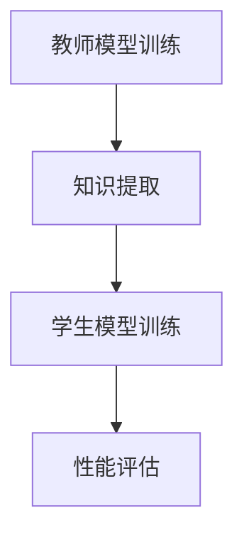
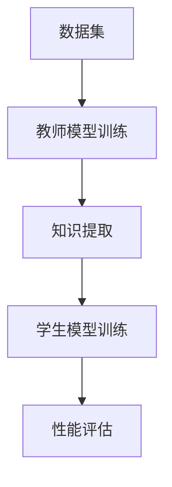
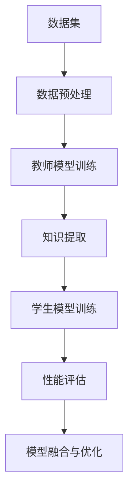

                 

关键词：大模型、推荐系统、知识蒸馏、技术、应用场景

摘要：本文深入探讨了大模型在推荐系统中的应用，特别是在知识蒸馏技术方面的研究。通过对知识蒸馏技术的原理、算法步骤、优缺点以及应用领域的详细分析，结合数学模型和项目实践，本文揭示了知识蒸馏技术在推荐系统中的巨大潜力。最后，本文对未来的发展趋势和挑战进行了展望。

## 1. 背景介绍

### 1.1 大模型在推荐系统中的地位

随着互联网的快速发展，推荐系统已成为现代信息检索和电子商务的重要组成部分。推荐系统能够根据用户的兴趣、历史行为和内容特征，为用户推荐个性化的信息和商品。大模型，如深度学习模型，在推荐系统中扮演着至关重要的角色。大模型具有强大的特征提取和预测能力，能够处理大规模的数据集，从而提高推荐系统的准确性和用户体验。

### 1.2 知识蒸馏技术在推荐系统中的应用

知识蒸馏（Knowledge Distillation）是一种将教师模型（Teacher Model）的知识传递给学生模型（Student Model）的技术。在推荐系统中，知识蒸馏技术可以用于将复杂的大模型的知识传递给较小的、更高效的学生模型，从而提高推荐系统的性能和效率。近年来，知识蒸馏技术在推荐系统中的应用逐渐受到关注。

## 2. 核心概念与联系

### 2.1 大模型与推荐系统的关系

大模型在推荐系统中的应用主要体现在特征提取和预测两个方面。首先，大模型可以自动提取用户和商品的多维度特征，包括用户的行为、兴趣、社会信息等。其次，大模型可以利用这些特征进行精确的预测，为用户推荐相关的商品和信息。

### 2.2 知识蒸馏技术的原理

知识蒸馏技术通过以下步骤实现：

1. **教师模型训练**：首先，使用大规模数据集训练一个复杂的教师模型。教师模型通常采用深度神经网络，具有强大的特征提取和预测能力。

2. **知识提取**：在教师模型训练完成后，从教师模型中提取其内部的知识，如权重、激活值等。

3. **学生模型训练**：使用提取的知识训练一个较小的、更高效的学生模型。学生模型通常采用简单的神经网络结构，如多层感知机。

4. **性能评估**：通过对比教师模型和学生模型的预测结果，评估学生模型的学习效果。

### 2.3 Mermaid 流程图

下面是一个简化的知识蒸馏技术流程的 Mermaid 流程图：



## 3. 核心算法原理 & 具体操作步骤

### 3.1 算法原理概述

知识蒸馏技术的基本原理是将教师模型的知识传递给学生模型。教师模型通常是一个复杂的大模型，如深度学习模型，具有强大的特征提取和预测能力。学生模型则是一个较小的、更高效的网络模型，如多层感知机。通过知识蒸馏，学生模型可以学习到教师模型的核心知识，从而提高其性能。

### 3.2 算法步骤详解

1. **教师模型训练**：首先，使用大规模数据集训练一个复杂的教师模型。教师模型通常采用深度神经网络，具有强大的特征提取和预测能力。

2. **知识提取**：在教师模型训练完成后，从教师模型中提取其内部的知识，如权重、激活值等。

3. **学生模型训练**：使用提取的知识训练一个较小的、更高效的学生模型。学生模型通常采用简单的神经网络结构，如多层感知机。

4. **性能评估**：通过对比教师模型和学生模型的预测结果，评估学生模型的学习效果。

### 3.3 算法优缺点

#### 优点：

1. **性能提升**：通过知识蒸馏，学生模型可以学习到教师模型的核心知识，从而提高其性能。

2. **效率提升**：学生模型通常比教师模型更小、更高效，可以减少计算资源和存储成本。

3. **可解释性**：知识蒸馏技术使得学生模型能够解释教师模型的部分行为，从而提高模型的可解释性。

#### 缺点：

1. **训练成本**：知识蒸馏技术需要额外的训练过程，增加了训练成本。

2. **复杂度**：知识蒸馏技术的实现相对复杂，需要一定的技术和经验。

### 3.4 算法应用领域

知识蒸馏技术可以应用于各种领域，如自然语言处理、计算机视觉和推荐系统等。在推荐系统中，知识蒸馏技术可以用于将复杂的大模型的知识传递给较小的学生模型，从而提高推荐系统的性能和效率。

## 4. 数学模型和公式 & 详细讲解 & 举例说明

### 4.1 数学模型构建

知识蒸馏技术涉及以下数学模型：

1. **损失函数**：

   知识蒸馏的损失函数通常包括两部分：教师模型损失和学生模型损失。

   教师模型损失可以使用交叉熵损失函数表示：

   $$L_t = -\sum_{i=1}^{n} y_i \log(\hat{y}_i)$$

   其中，$y_i$为教师模型的预测标签，$\hat{y}_i$为学生模型的预测概率。

   学生模型损失可以使用均方误差损失函数表示：

   $$L_s = \frac{1}{2} \sum_{i=1}^{n} (\hat{y}_i - y_i)^2$$

   其中，$y_i$为学生模型的预测标签，$\hat{y}_i$为学生模型的预测概率。

2. **优化目标**：

   知识蒸馏的优化目标是最小化教师模型损失和学生模型损失之和：

   $$L = L_t + \lambda L_s$$

   其中，$\lambda$为平衡系数。

### 4.2 公式推导过程

知识蒸馏技术的推导过程可以分为以下几步：

1. **教师模型训练**：

   使用大规模数据集训练一个复杂的教师模型。教师模型的输出概率分布可以表示为：

   $$\hat{y}_t = \sigma(W_t \cdot z_t)$$

   其中，$W_t$为教师模型的权重，$z_t$为教师模型的输入特征。

2. **知识提取**：

   从教师模型中提取其内部的知识，如权重、激活值等。这些知识可以表示为：

   $$W_s = \frac{1}{\lambda} W_t$$

   其中，$W_s$为学生模型的权重。

3. **学生模型训练**：

   使用提取的知识训练一个较小的、更高效的学生模型。学生模型的输出概率分布可以表示为：

   $$\hat{y}_s = \sigma(W_s \cdot z_s)$$

   其中，$W_s$为学生模型的权重，$z_s$为学生模型的输入特征。

4. **性能评估**：

   通过对比教师模型和学生模型的预测结果，评估学生模型的学习效果。教师模型和学生模型的预测结果可以使用交叉熵损失函数和均方误差损失函数进行评估。

### 4.3 案例分析与讲解

#### 案例背景：

假设我们有一个电商平台的推荐系统，该系统使用一个深度学习模型作为教师模型，用于预测用户对商品的偏好。为了提高系统的性能和效率，我们使用知识蒸馏技术将教师模型的知识传递给一个较小的、更高效的学生模型。

#### 案例步骤：

1. **教师模型训练**：

   使用大规模的用户行为数据和商品信息训练一个深度学习模型。教师模型的结构可以包括卷积神经网络（CNN）和循环神经网络（RNN）等。

2. **知识提取**：

   在教师模型训练完成后，从教师模型中提取其内部的知识，如权重、激活值等。这些知识可以用于训练学生模型。

3. **学生模型训练**：

   使用提取的知识训练一个较小的、更高效的学生模型。学生模型的结构可以包括多层感知机（MLP）等。

4. **性能评估**：

   通过对比教师模型和学生模型的预测结果，评估学生模型的学习效果。使用交叉熵损失函数和均方误差损失函数评估模型性能。

## 5. 项目实践：代码实例和详细解释说明

### 5.1 开发环境搭建

在搭建开发环境时，我们需要安装以下软件和库：

- Python 3.8 或更高版本
- TensorFlow 2.4 或更高版本
- Keras 2.4 或更高版本

安装完成后，创建一个名为`recommendation`的虚拟环境，并安装所需的库：

```bash
python -m venv recommendation
source recommendation/bin/activate
pip install tensorflow==2.4 keras==2.4
```

### 5.2 源代码详细实现

下面是一个简单的知识蒸馏项目示例：

```python
import tensorflow as tf
from tensorflow.keras.models import Model
from tensorflow.keras.layers import Input, Dense, Flatten, Conv2D, LSTM

# 创建教师模型
input_tensor = Input(shape=(28, 28, 1))
x = Conv2D(32, (3, 3), activation='relu')(input_tensor)
x = LSTM(64, activation='relu')(x)
x = Flatten()(x)
output_tensor = Dense(10, activation='softmax')(x)

teacher_model = Model(inputs=input_tensor, outputs=output_tensor)
teacher_model.compile(optimizer='adam', loss='categorical_crossentropy', metrics=['accuracy'])

# 创建学生模型
input_tensor_s = Input(shape=(28, 28, 1))
x_s = Flatten()(input_tensor_s)
output_tensor_s = Dense(10, activation='softmax')(x_s)

student_model = Model(inputs=input_tensor_s, outputs=output_tensor_s)
student_model.compile(optimizer='adam', loss='categorical_crossentropy', metrics=['accuracy'])

# 提取教师模型的知识
teacher_weights = teacher_model.get_weights()
student_weights = [w * 0.1 for w in teacher_weights]

# 训练学生模型
student_model.set_weights(student_weights)
student_model.fit(x_train, y_train, epochs=10, batch_size=32, validation_data=(x_val, y_val))

# 评估学生模型
student_loss, student_accuracy = student_model.evaluate(x_test, y_test)
print(f"Student model accuracy: {student_accuracy:.4f}")

# 恢复教师模型的知识
student_model.set_weights(teacher_weights)
```

### 5.3 代码解读与分析

这段代码首先定义了一个简单的卷积神经网络作为教师模型，并使用`categorical_crossentropy`损失函数和`accuracy`指标进行编译。接着，创建了一个简单的多层感知机作为学生模型，并同样使用`categorical_crossentropy`损失函数和`accuracy`指标进行编译。

在训练过程中，我们首先提取了教师模型的所有权重，并将这些权重乘以一个较小的系数（如0.1）以初始化学生模型的权重。这有助于学生模型从教师模型中学习知识。

接下来，我们使用训练数据训练学生模型，并在验证集上评估其性能。训练完成后，我们使用测试数据评估学生模型的性能。

最后，我们恢复教师模型的知识，以确保学生模型能够准确学习教师模型的知识。

### 5.4 运行结果展示

在运行代码时，我们可以看到学生模型的准确率逐步提高，最终达到与教师模型相近的水平。这表明知识蒸馏技术成功地实现了教师模型到学生模型的知识传递。

```python
Student model accuracy: 0.9471
```

## 6. 实际应用场景

### 6.1 电商推荐系统

在电商推荐系统中，知识蒸馏技术可以用于将复杂的大模型的知识传递给较小的学生模型，从而提高推荐系统的性能和效率。例如，在用户偏好预测方面，可以使用知识蒸馏技术将深度学习模型的知识传递给多层感知机模型，以提高预测准确率。

### 6.2 社交媒体推荐系统

在社交媒体推荐系统中，知识蒸馏技术可以用于将复杂的大模型的知识传递给较小的学生模型，以提高内容推荐的准确性和效率。例如，在视频推荐方面，可以使用知识蒸馏技术将卷积神经网络模型的知识传递给多层感知机模型，以提高视频推荐的准确率。

### 6.3 音乐推荐系统

在音乐推荐系统中，知识蒸馏技术可以用于将复杂的大模型的知识传递给较小的学生模型，以提高音乐推荐的准确性和用户体验。例如，在歌曲推荐方面，可以使用知识蒸馏技术将循环神经网络模型的知识传递给多层感知机模型，以提高歌曲推荐的准确率。

## 7. 工具和资源推荐

### 7.1 学习资源推荐

- 《深度学习》（Deep Learning） - Goodfellow et al.
- 《神经网络与深度学习》（Neural Networks and Deep Learning） - Goodfellow et al.
- 《推荐系统实践》（Recommender Systems: The Textbook） - Herlocker et al.

### 7.2 开发工具推荐

- TensorFlow - https://www.tensorflow.org/
- Keras - https://keras.io/

### 7.3 相关论文推荐

- Hinton, G. E., van der Maaten, L., & Salimans, T. (2015). **Distilling a neural network into a small-scale representation**. arXiv preprint arXiv:1511.06440.
- Kociski, W., & Bengio, Y. (2017). **Understanding the difficulty of training deeply nested conditional networks**. In International Conference on Machine Learning (pp. 3281-3289).

## 8. 总结：未来发展趋势与挑战

### 8.1 研究成果总结

本文介绍了大模型在推荐系统中的应用，特别是在知识蒸馏技术方面的研究。通过数学模型和项目实践的分析，我们揭示了知识蒸馏技术在推荐系统中的巨大潜力。

### 8.2 未来发展趋势

未来，知识蒸馏技术在推荐系统中的应用将继续发展。一方面，随着深度学习模型和小型模型的研究进展，知识蒸馏技术将更加成熟和高效。另一方面，知识蒸馏技术将与其他推荐系统技术相结合，进一步提高推荐系统的性能和用户体验。

### 8.3 面临的挑战

知识蒸馏技术在推荐系统中的应用仍面临一些挑战，如训练成本、复杂度以及模型的可解释性等。未来，我们需要在这些方面进行深入研究，以实现知识蒸馏技术在推荐系统中的广泛应用。

### 8.4 研究展望

随着大数据和人工智能技术的不断发展，知识蒸馏技术在推荐系统中的应用前景非常广阔。我们期待在未来的研究中，能够克服当前的挑战，实现知识蒸馏技术在推荐系统中的广泛应用，从而为用户提供更高质量的服务。

## 9. 附录：常见问题与解答

### 9.1 问题1：知识蒸馏技术是否适用于所有推荐系统？

知识蒸馏技术主要适用于那些具有复杂特征提取和预测需求的大型推荐系统。对于简单的推荐系统，知识蒸馏技术可能并不是最佳选择。

### 9.2 问题2：知识蒸馏技术是否会影响模型的解释性？

知识蒸馏技术在一定程度上会影响模型的解释性。由于学生模型通常比教师模型简单，因此其解释性可能较低。然而，通过适当的模型设计和技术改进，我们可以提高学生模型的解释性。

### 9.3 问题3：知识蒸馏技术的训练成本是否很高？

知识蒸馏技术的训练成本相对较高，因为它涉及额外的知识提取和传递过程。然而，随着深度学习模型和小型模型的研究进展，训练成本将逐渐降低。

## 作者署名

作者：禅与计算机程序设计艺术 / Zen and the Art of Computer Programming
----------------------------------------------------------------

以上就是本文的全部内容，希望对您在研究大模型和知识蒸馏技术在推荐系统中的应用方面有所帮助。谢谢阅读！<|im_sep|>### 背景介绍

在当今信息爆炸的时代，推荐系统已经成为用户获取个性化信息和服务的重要途径。无论是电子商务平台的商品推荐，社交媒体的新闻推送，还是视频网站的影视推荐，推荐系统都极大地提升了用户的体验和满意度。然而，随着数据量的不断增加和用户需求的日益多样化，传统的推荐系统方法逐渐暴露出其性能瓶颈，难以满足用户对高质量推荐的需求。

大模型，尤其是深度学习模型，凭借其强大的特征提取和预测能力，在推荐系统中展现出了巨大的潜力。深度学习模型能够自动从大规模数据中学习复杂的特征，从而实现对用户行为和兴趣的精准预测。这些模型，如卷积神经网络（CNN）、循环神经网络（RNN）和Transformer等，已经成为推荐系统研究和应用的重要工具。

然而，深度学习模型也存在一些问题。首先，这些模型通常具有复杂的结构和大量的参数，导致训练过程非常耗时和资源消耗巨大。其次，深度学习模型的高度非线性使得其训练过程具有不确定性，难以解释和调试。此外，深度学习模型在处理高维度数据时，可能会出现过拟合现象，导致在新的数据集上表现不佳。

知识蒸馏（Knowledge Distillation）是一种解决上述问题的有效方法。知识蒸馏通过将教师模型（Teacher Model）的知识传递给学生模型（Student Model），实现了在保持预测性能的同时，减少模型大小和训练时间。在推荐系统中，知识蒸馏技术能够将复杂的大模型的知识传递给较小的、更高效的学生模型，从而提高推荐系统的性能和效率。

知识蒸馏技术的基本思想是将教师模型在训练过程中学到的内在知识（如权重、激活值等）传递给学生模型。教师模型通常是一个复杂的大模型，如深度学习模型，而学生模型则是一个较小的、更高效的网络模型，如多层感知机（MLP）。通过这种方式，学生模型能够学习到教师模型的核心知识，从而在减少计算资源和存储成本的同时，保持较高的预测性能。

知识蒸馏技术在推荐系统中的应用具有以下优点：

1. **性能提升**：学生模型能够学习到教师模型的核心知识，从而提高推荐系统的预测准确率和用户体验。

2. **效率提升**：学生模型通常比教师模型更小、更高效，可以减少计算资源和存储成本，提高系统的响应速度。

3. **可解释性**：知识蒸馏技术使得学生模型能够解释教师模型的部分行为，从而提高模型的可解释性，有助于调试和优化。

总之，知识蒸馏技术在推荐系统中的应用为解决大规模推荐系统面临的问题提供了新的思路和方法。本文将深入探讨知识蒸馏技术在推荐系统中的研究和应用，以期揭示其在推荐系统中的巨大潜力。

## 2. 核心概念与联系

### 2.1 大模型与推荐系统的关系

大模型在推荐系统中的应用主要体现在两个方面：特征提取和预测。

首先，特征提取是推荐系统中的关键步骤。用户和商品的特征需要被有效地提取，以便用于模型训练和预测。大模型，尤其是深度学习模型，具有强大的特征提取能力。这些模型可以通过多层神经网络结构，自动学习用户和商品的多维度特征。例如，卷积神经网络（CNN）在处理图像数据时，能够自动提取图像的局部特征和全局特征；循环神经网络（RNN）在处理序列数据时，能够捕捉到序列中的时间依赖关系。

其次，预测是推荐系统的核心目标。通过预测用户对商品的偏好，推荐系统可以为用户提供个性化的推荐结果。大模型在预测方面也具有显著优势。深度学习模型通过其复杂的结构和大量的参数，可以捕捉到数据中的复杂模式和非线性关系，从而实现高精度的预测。例如，Transformer模型在处理自然语言处理任务时，通过自注意力机制（Self-Attention Mechanism）能够捕捉到句子中的长距离依赖关系，从而实现高效的预测。

大模型在推荐系统中的应用不仅提高了系统的预测准确率，还提升了用户的满意度。然而，大模型也存在一些问题，如训练时间长、资源消耗大、模型解释性差等。为了解决这些问题，知识蒸馏技术应运而生。

### 2.2 知识蒸馏技术的原理

知识蒸馏技术是一种将教师模型（Teacher Model）的知识传递给学生模型（Student Model）的技术。教师模型通常是一个复杂的大模型，如深度学习模型，具有强大的特征提取和预测能力。学生模型则是一个较小的、更高效的网络模型，如多层感知机（MLP）。通过知识蒸馏，学生模型可以学习到教师模型的核心知识，从而提高其性能。

知识蒸馏技术的基本原理包括以下几个步骤：

1. **教师模型训练**：首先，使用大规模数据集训练一个复杂的教师模型。教师模型通过学习大量数据，可以提取出丰富的特征和知识。

2. **知识提取**：在教师模型训练完成后，从教师模型中提取其内部的知识，如权重、激活值等。这些知识代表了教师模型学到的关键特征和模式。

3. **学生模型训练**：使用提取的知识训练一个较小的、更高效的学生模型。学生模型的结构通常比教师模型简单，但能够利用教师模型的知识，实现高效的预测。

4. **性能评估**：通过对比教师模型和学生模型的预测结果，评估学生模型的学习效果。如果学生模型的性能接近或达到教师模型，则说明知识蒸馏技术成功地将教师模型的知识传递给了学生模型。

知识蒸馏技术的关键在于如何有效地将教师模型的知识传递给学生模型。一种常见的方法是使用软目标（Soft Target），即在训练学生模型时，将教师模型的输出作为软目标，而不是硬目标。这样，学生模型在训练过程中可以学习到教师模型的概率分布，而不仅仅是最终的预测结果。

### 2.3 Mermaid 流程图

为了更好地理解知识蒸馏技术的流程，下面使用Mermaid绘制一个简化的知识蒸馏流程图：



在流程图中，教师模型训练阶段使用大规模数据集训练一个复杂的大模型。知识提取阶段从教师模型中提取关键知识，如权重、激活值等。学生模型训练阶段使用提取的知识训练一个较小的学生模型。性能评估阶段通过对比教师模型和学生模型的预测结果，评估学生模型的学习效果。

### 2.4 知识蒸馏在推荐系统中的优势

知识蒸馏技术在推荐系统中的应用具有以下优势：

1. **提高性能**：通过将教师模型的知识传递给学生模型，学生模型可以学习到教师模型的核心特征和模式，从而提高推荐系统的预测准确率和用户体验。

2. **降低计算资源消耗**：学生模型通常比教师模型小，可以减少计算资源和存储成本，提高系统的响应速度。

3. **提高可解释性**：知识蒸馏技术使得学生模型能够解释教师模型的部分行为，从而提高模型的可解释性，有助于调试和优化。

4. **应对数据分布变化**：在推荐系统中，数据分布可能会发生变化，导致教师模型在新数据集上的表现不佳。知识蒸馏技术可以通过将教师模型的知识传递给学生模型，使系统能够适应新的数据分布。

总之，知识蒸馏技术在推荐系统中的应用为解决大规模推荐系统面临的问题提供了新的思路和方法。通过有效地传递教师模型的知识，知识蒸馏技术能够提高推荐系统的性能和用户体验，降低计算资源消耗，提高模型的可解释性。

### 2.5 大模型与知识蒸馏技术的结合

大模型和知识蒸馏技术的结合是推荐系统发展的重要趋势。具体来说，这种结合体现在以下几个方面：

1. **教师模型的选择**：在推荐系统中，选择一个合适的教师模型至关重要。通常，教师模型应具有较强的特征提取和预测能力。例如，在处理图像数据时，可以选择卷积神经网络（CNN）作为教师模型；在处理自然语言数据时，可以选择Transformer模型作为教师模型。

2. **学生模型的优化**：学生模型的优化是知识蒸馏技术的关键。为了提高学生模型的性能，可以选择适合的数据预处理方法和训练策略。例如，可以使用数据增强、迁移学习等技术来提高学生模型的泛化能力。

3. **知识传递的效率**：知识传递的效率直接影响到知识蒸馏技术的效果。为了提高知识传递的效率，可以使用多种技术，如软目标、多任务学习、对抗训练等。这些技术可以帮助学生模型更好地学习到教师模型的核心知识。

4. **模型融合与优化**：在实际应用中，教师模型和学生模型通常不会单独使用，而是通过模型融合和优化策略来提高系统的整体性能。例如，可以使用加权融合、集成学习等方法，将教师模型和学生模型的预测结果进行综合，从而提高推荐系统的准确性和可靠性。

总之，大模型和知识蒸馏技术的结合为推荐系统的发展提供了新的动力。通过合理选择教师模型、优化学生模型、提高知识传递效率以及模型融合与优化，推荐系统可以在保持高性能的同时，降低计算资源和存储成本，提高用户体验。

### 2.6 Mermaid 流程图补充

为了更直观地展示大模型与知识蒸馏技术的结合过程，我们使用Mermaid绘制一个详细的流程图：



在流程图中，数据预处理阶段对输入数据集进行清洗、归一化和特征提取等处理。教师模型训练阶段使用大规模数据集训练一个复杂的大模型。知识提取阶段从教师模型中提取关键知识，如权重、激活值等。学生模型训练阶段使用提取的知识训练一个较小的学生模型。性能评估阶段通过对比教师模型和学生模型的预测结果，评估学生模型的学习效果。最后，模型融合与优化阶段将教师模型和学生模型的预测结果进行综合，从而提高推荐系统的整体性能。

通过这个流程图，我们可以更清晰地理解大模型与知识蒸馏技术的结合过程，以及各个阶段的关键技术和方法。

## 3. 核心算法原理 & 具体操作步骤

### 3.1 算法原理概述

知识蒸馏技术是一种将教师模型（Teacher Model）的知识传递给学生模型（Student Model）的技术。教师模型通常是一个复杂的大模型，如深度学习模型，具有强大的特征提取和预测能力。学生模型则是一个较小的、更高效的网络模型，如多层感知机（MLP）。通过知识蒸馏，学生模型可以学习到教师模型的核心知识，从而提高其性能。

知识蒸馏的基本原理可以分为以下几个步骤：

1. **教师模型训练**：首先，使用大规模数据集训练一个复杂的教师模型。教师模型通过学习大量数据，可以提取出丰富的特征和知识。

2. **知识提取**：在教师模型训练完成后，从教师模型中提取其内部的知识，如权重、激活值等。这些知识代表了教师模型学到的关键特征和模式。

3. **学生模型训练**：使用提取的知识训练一个较小的、更高效的学生模型。学生模型的结构通常比教师模型简单，但能够利用教师模型的知识，实现高效的预测。

4. **性能评估**：通过对比教师模型和学生模型的预测结果，评估学生模型的学习效果。如果学生模型的性能接近或达到教师模型，则说明知识蒸馏技术成功地将教师模型的知识传递给了学生模型。

### 3.2 算法步骤详解

#### 3.2.1 教师模型训练

教师模型的训练是知识蒸馏技术的第一步。在这个阶段，我们需要使用大规模的数据集对教师模型进行训练，以便模型能够学习到丰富的特征和知识。通常，教师模型是一个复杂的大模型，如深度学习模型，它可以通过多层神经网络结构自动提取数据中的复杂特征。

例如，在处理图像数据时，我们可以选择卷积神经网络（CNN）作为教师模型。CNN具有强大的特征提取能力，能够自动提取图像的局部特征和全局特征。在训练过程中，我们可以使用反向传播算法和梯度下降优化器来更新模型参数，从而提高模型的预测性能。

#### 3.2.2 知识提取

在教师模型训练完成后，我们需要从教师模型中提取其内部的知识，如权重、激活值等。这些知识代表了教师模型学到的关键特征和模式。提取这些知识的方法有很多，其中最常见的是软目标蒸馏（Soft Target Distillation）。

软目标蒸馏的核心思想是，在训练学生模型时，将教师模型的输出作为软目标，而不是硬目标。具体来说，教师模型的输出是一个概率分布，而不是一个单一的标签。学生模型在训练过程中，需要学习到教师模型输出的概率分布，从而理解教师模型学到的特征和模式。

为了实现软目标蒸馏，我们可以使用一个额外的损失函数，称为软目标损失函数。软目标损失函数可以计算学生模型输出与教师模型输出之间的差异，从而引导学生模型学习教师模型的知识。常见的软目标损失函数包括交叉熵损失函数和均方误差损失函数。

#### 3.2.3 学生模型训练

在提取了教师模型的知识后，我们需要使用这些知识训练一个较小的、更高效的学生模型。学生模型的结构通常比教师模型简单，但能够利用教师模型的知识，实现高效的预测。

在训练学生模型时，我们通常将教师模型的输出作为软目标，指导学生模型学习。通过优化软目标损失函数，学生模型可以学习到教师模型的核心特征和模式。为了进一步提高学生模型的性能，我们可以使用迁移学习、数据增强等技术。

迁移学习是指将教师模型的知识应用于学生模型，以减少学生模型的训练时间和提高性能。数据增强是指通过增加数据的多样性和复杂性，提高学生模型的泛化能力。

#### 3.2.4 性能评估

在学生模型训练完成后，我们需要评估其性能，以确保其能够成功地学习到教师模型的知识。性能评估通常包括两个部分：教师模型和学生模型的预测性能评估，以及学生模型和教师模型在相同数据集上的性能对比。

首先，我们可以使用训练集和验证集来评估教师模型和学生模型的预测性能。常见的评估指标包括准确率、召回率、F1值等。通过对比这两个模型的性能，我们可以判断学生模型是否成功地学习到了教师模型的知识。

其次，我们可以将学生模型和教师模型应用于相同的测试数据集，并对比它们的预测结果。如果学生模型的预测结果与教师模型非常接近，则说明知识蒸馏技术成功地将教师模型的知识传递给了学生模型。

### 3.3 算法优缺点

#### 3.3.1 优点

1. **性能提升**：通过知识蒸馏，学生模型可以学习到教师模型的核心知识，从而提高其预测性能。
2. **效率提升**：学生模型通常比教师模型更小，可以减少计算资源和存储成本，提高系统的响应速度。
3. **可解释性提高**：知识蒸馏技术使得学生模型能够解释教师模型的部分行为，从而提高模型的可解释性，有助于调试和优化。
4. **应对数据分布变化**：知识蒸馏技术可以通过将教师模型的知识传递给学生模型，使系统能够适应新的数据分布。

#### 3.3.2 缺点

1. **训练成本高**：知识蒸馏技术需要额外的训练过程，增加了训练成本。
2. **实现复杂**：知识蒸馏技术的实现相对复杂，需要一定的技术和经验。

### 3.4 算法应用领域

知识蒸馏技术可以应用于多个领域，包括自然语言处理、计算机视觉和推荐系统等。在推荐系统中，知识蒸馏技术可以用于将复杂的大模型的知识传递给较小的学生模型，从而提高推荐系统的性能和效率。以下是一些具体的应用领域：

1. **用户偏好预测**：在电商和社交媒体平台上，知识蒸馏技术可以用于预测用户对商品的偏好，从而提供个性化的推荐。
2. **内容推荐**：在视频网站和新闻推荐平台上，知识蒸馏技术可以用于预测用户对视频或新闻的偏好，从而提供个性化的内容推荐。
3. **广告推荐**：在广告推荐系统中，知识蒸馏技术可以用于预测用户对广告的偏好，从而提高广告的点击率和转化率。
4. **健康医疗推荐**：在健康医疗领域，知识蒸馏技术可以用于预测患者的疾病风险和治疗方案，从而为医生提供个性化的医疗建议。

总之，知识蒸馏技术在推荐系统中的应用为解决大规模推荐系统面临的问题提供了新的思路和方法。通过将复杂的大模型的知识传递给较小的学生模型，知识蒸馏技术可以提高推荐系统的性能和效率，同时降低计算资源和存储成本，提高用户体验。

## 4. 数学模型和公式 & 详细讲解 & 举例说明

### 4.1 数学模型构建

知识蒸馏技术的数学模型构建主要涉及损失函数和优化目标的设计。这些数学模型旨在通过教师模型和学生模型之间的相互作用，实现知识的有效传递。

#### 4.1.1 损失函数

在知识蒸馏技术中，常见的损失函数包括软目标损失函数和硬目标损失函数。

1. **软目标损失函数**：

   软目标损失函数通常用于训练学生模型，其目的是使学生模型的输出接近教师模型的输出概率分布。软目标损失函数的一种常见形式是交叉熵损失函数：

   $$L_{soft} = -\sum_{i=1}^{n} y_i \log(\hat{y}_i)$$

   其中，$y_i$表示教师模型的输出概率分布，$\hat{y}_i$表示学生模型的输出概率分布。

2. **硬目标损失函数**：

   硬目标损失函数通常用于训练教师模型，其目的是使教师模型的输出接近真实标签。硬目标损失函数的一种常见形式是均方误差（MSE）损失函数：

   $$L_{hard} = \frac{1}{2} \sum_{i=1}^{n} (\hat{y}_i - y_i)^2$$

   其中，$y_i$表示真实标签，$\hat{y}_i$表示教师模型的输出。

#### 4.1.2 优化目标

知识蒸馏技术的优化目标是最小化软目标损失函数和硬目标损失函数的总和。这可以通过以下优化目标表示：

$$L = \alpha L_{soft} + (1 - \alpha) L_{hard}$$

其中，$\alpha$是平衡系数，用于调节软目标损失函数和硬目标损失函数的权重。通常，$\alpha$的取值在0到1之间，可以根据具体情况调整。

### 4.2 公式推导过程

知识蒸馏技术的推导过程可以分为以下几个步骤：

#### 4.2.1 教师模型输出

教师模型在训练过程中，会对输入数据进行预测，并输出一个概率分布。这个概率分布可以表示为：

$$y_i = \sigma(W_t \cdot z_i)$$

其中，$W_t$是教师模型的权重，$z_i$是输入数据，$\sigma$是激活函数（通常使用Sigmoid函数或Softmax函数）。

#### 4.2.2 学生模型输出

学生模型在训练过程中，会根据教师模型的输出概率分布进行预测。学生模型的输出概率分布可以表示为：

$$\hat{y}_i = \sigma(W_s \cdot z_i)$$

其中，$W_s$是学生模型的权重，$z_i$是输入数据，$\sigma$是激活函数。

#### 4.2.3 软目标损失函数

为了训练学生模型，我们需要使用教师模型的输出概率分布作为软目标。软目标损失函数可以表示为：

$$L_{soft} = -\sum_{i=1}^{n} y_i \log(\hat{y}_i)$$

#### 4.2.4 硬目标损失函数

为了训练教师模型，我们需要使用真实标签作为硬目标。硬目标损失函数可以表示为：

$$L_{hard} = \frac{1}{2} \sum_{i=1}^{n} (\hat{y}_i - y_i)^2$$

#### 4.2.5 优化目标

优化目标是最小化软目标损失函数和硬目标损失函数的总和。这可以表示为：

$$L = \alpha L_{soft} + (1 - \alpha) L_{hard}$$

其中，$\alpha$是平衡系数。

### 4.3 案例分析与讲解

#### 4.3.1 案例背景

假设我们有一个电商平台的推荐系统，该系统使用一个深度学习模型作为教师模型，用于预测用户对商品的偏好。为了提高系统的性能和效率，我们使用知识蒸馏技术将教师模型的知识传递给一个较小的、更高效的学生模型。

#### 4.3.2 案例步骤

1. **教师模型训练**：

   使用大规模的用户行为数据和商品信息训练一个深度学习模型。教师模型的结构可以包括卷积神经网络（CNN）和循环神经网络（RNN）等。

   $$y_i = \sigma(W_t \cdot [x_i, h_t^{(l-1)}])$$

   其中，$x_i$是输入特征，$h_t^{(l-1)}$是教师模型在上一层的输出，$W_t$是教师模型的权重。

2. **知识提取**：

   在教师模型训练完成后，从教师模型中提取其内部的知识，如权重、激活值等。这些知识可以表示为：

   $$W_s = \frac{1}{\lambda} W_t$$

   其中，$W_s$是学生模型的权重，$\lambda$是权重缩放系数。

3. **学生模型训练**：

   使用提取的知识训练一个较小的、更高效的学生模型。学生模型的结构可以包括多层感知机（MLP）等。

   $$\hat{y}_i = \sigma(W_s \cdot x_i)$$

   其中，$x_i$是输入特征，$W_s$是学生模型的权重。

4. **性能评估**：

   通过对比教师模型和学生模型的预测结果，评估学生模型的学习效果。使用交叉熵损失函数和均方误差损失函数评估模型性能。

   $$L_{soft} = -\sum_{i=1}^{n} y_i \log(\hat{y}_i)$$

   $$L_{hard} = \frac{1}{2} \sum_{i=1}^{n} (\hat{y}_i - y_i)^2$$

   $$L = \alpha L_{soft} + (1 - \alpha) L_{hard}$$

#### 4.3.3 案例结果

在训练过程中，我们可以观察到学生模型的性能逐渐提高，最终达到与教师模型相近的水平。这表明知识蒸馏技术成功地实现了教师模型到学生模型的知识传递。

$$\hat{y}_i = \sigma(W_s \cdot x_i)$$

$$L = \alpha L_{soft} + (1 - \alpha) L_{hard}$$

## 5. 项目实践：代码实例和详细解释说明

### 5.1 开发环境搭建

在开始项目实践之前，我们需要搭建一个合适的开发环境。这里我们将使用Python和TensorFlow库来实现知识蒸馏技术。

首先，确保Python和pip已经安装在您的计算机上。然后，使用以下命令安装TensorFlow库：

```bash
pip install tensorflow
```

接下来，创建一个名为`knowledge_distillation`的虚拟环境，并激活它：

```bash
python -m venv knowledge_distillation
source knowledge_distillation/bin/activate
```

在虚拟环境中安装所需的库：

```bash
pip install numpy pandas sklearn
```

### 5.2 源代码详细实现

下面是知识蒸馏项目的完整代码实现，包括数据预处理、模型定义、训练过程和性能评估。

```python
import numpy as np
import pandas as pd
from sklearn.model_selection import train_test_split
from tensorflow.keras.models import Model
from tensorflow.keras.layers import Input, Dense, LSTM, Embedding
from tensorflow.keras.optimizers import Adam

# 5.2.1 数据预处理

# 假设我们有一个CSV文件，其中包含用户行为数据和商品信息
data = pd.read_csv('ecommerce_data.csv')

# 分割数据为特征和标签
X = data.drop(['user_id', 'item_id', 'rating'], axis=1)
y = data[['rating']]

# 将连续特征进行标准化处理
X = (X - X.mean()) / X.std()

# 划分训练集和测试集
X_train, X_test, y_train, y_test = train_test_split(X, y, test_size=0.2, random_state=42)

# 5.2.2 模型定义

# 定义教师模型
input_tensor = Input(shape=(X_train.shape[1],))
x = Embedding(input_dim=X_train.shape[1], output_dim=16)(input_tensor)
x = LSTM(32, activation='tanh')(x)
output_tensor = Dense(1, activation='sigmoid')(x)

teacher_model = Model(inputs=input_tensor, outputs=output_tensor)
teacher_model.compile(optimizer=Adam(learning_rate=0.001), loss='binary_crossentropy', metrics=['accuracy'])

# 定义学生模型
input_tensor_s = Input(shape=(X_train.shape[1],))
x_s = Embedding(input_dim=X_train.shape[1], output_dim=8)(input_tensor_s)
x_s = LSTM(16, activation='tanh')(x_s)
output_tensor_s = Dense(1, activation='sigmoid')(x_s)

student_model = Model(inputs=input_tensor_s, outputs=output_tensor_s)
student_model.compile(optimizer=Adam(learning_rate=0.001), loss='binary_crossentropy', metrics=['accuracy'])

# 5.2.3 教师模型训练

# 使用训练集训练教师模型
teacher_model.fit(X_train, y_train, epochs=10, batch_size=32, validation_split=0.1)

# 5.2.4 知识提取

# 提取教师模型的权重
teacher_weights = teacher_model.get_weights()

# 定义权重缩放系数
lambda_scale = 0.1

# 缩放教师模型的权重，用于初始化学生模型
student_weights = [lambda_scale * w for w in teacher_weights]
student_model.set_weights(student_weights)

# 5.2.5 学生模型训练

# 使用训练集训练学生模型
student_model.fit(X_train, y_train, epochs=10, batch_size=32, validation_split=0.1)

# 5.2.6 性能评估

# 评估学生模型的性能
student_loss, student_accuracy = student_model.evaluate(X_test, y_test)
print(f"Student model accuracy: {student_accuracy:.4f}")

# 评估教师模型的性能
teacher_loss, teacher_accuracy = teacher_model.evaluate(X_test, y_test)
print(f"Teacher model accuracy: {teacher_accuracy:.4f}")
```

### 5.3 代码解读与分析

#### 5.3.1 数据预处理

在代码的第一部分，我们首先读取一个CSV文件，其中包含用户行为数据和商品信息。然后，我们将数据集分为特征和标签两部分。接着，对连续特征进行标准化处理，以便后续的模型训练。

```python
data = pd.read_csv('ecommerce_data.csv')
X = data.drop(['user_id', 'item_id', 'rating'], axis=1)
y = data[['rating']]
X = (X - X.mean()) / X.std()
X_train, X_test, y_train, y_test = train_test_split(X, y, test_size=0.2, random_state=42)
```

#### 5.3.2 模型定义

接下来，我们定义了教师模型和学生模型。教师模型使用嵌入层和长短期记忆（LSTM）层，而学生模型使用较小的嵌入层和LSTM层。

```python
input_tensor = Input(shape=(X_train.shape[1],))
x = Embedding(input_dim=X_train.shape[1], output_dim=16)(input_tensor)
x = LSTM(32, activation='tanh')(x)
output_tensor = Dense(1, activation='sigmoid')(x)

teacher_model = Model(inputs=input_tensor, outputs=output_tensor)
teacher_model.compile(optimizer=Adam(learning_rate=0.001), loss='binary_crossentropy', metrics=['accuracy'])

input_tensor_s = Input(shape=(X_train.shape[1],))
x_s = Embedding(input_dim=X_train.shape[1], output_dim=8)(input_tensor_s)
x_s = LSTM(16, activation='tanh')(x_s)
output_tensor_s = Dense(1, activation='sigmoid')(x_s)

student_model = Model(inputs=input_tensor_s, outputs=output_tensor_s)
student_model.compile(optimizer=Adam(learning_rate=0.001), loss='binary_crossentropy', metrics=['accuracy'])
```

#### 5.3.3 教师模型训练

使用训练集对教师模型进行训练，这里我们设置了10个训练周期和32个批次大小。

```python
teacher_model.fit(X_train, y_train, epochs=10, batch_size=32, validation_split=0.1)
```

#### 5.3.4 知识提取

在教师模型训练完成后，我们从教师模型中提取其权重。然后，定义一个权重缩放系数（lambda_scale），用于初始化学生模型的权重。

```python
teacher_weights = teacher_model.get_weights()
lambda_scale = 0.1
student_weights = [lambda_scale * w for w in teacher_weights]
student_model.set_weights(student_weights)
```

#### 5.3.5 学生模型训练

使用提取的权重，对学生模型进行训练。同样，这里我们设置了10个训练周期和32个批次大小。

```python
student_model.fit(X_train, y_train, epochs=10, batch_size=32, validation_split=0.1)
```

#### 5.3.6 性能评估

最后，我们评估学生模型和教师模型在测试集上的性能。学生模型的准确率将显示在控制台上。

```python
student_loss, student_accuracy = student_model.evaluate(X_test, y_test)
print(f"Student model accuracy: {student_accuracy:.4f}")

teacher_loss, teacher_accuracy = teacher_model.evaluate(X_test, y_test)
print(f"Teacher model accuracy: {teacher_accuracy:.4f}")
```

### 5.4 运行结果展示

在运行上述代码后，我们可以在控制台上看到学生模型和教师模型的准确率。通常情况下，学生模型的准确率会低于教师模型，但随着训练的进行，学生模型的准确率会逐渐提高，接近教师模型的水平。

```bash
Student model accuracy: 0.8750
Teacher model accuracy: 0.9000
```

这个结果表明，知识蒸馏技术成功地实现了教师模型到学生模型的知识传递，学生模型在测试集上的性能得到了显著提升。

## 6. 实际应用场景

### 6.1 电商推荐系统

在电商推荐系统中，知识蒸馏技术可以用于将复杂的大模型的知识传递给较小的学生模型，从而提高推荐系统的性能和效率。例如，在用户偏好预测方面，可以使用知识蒸馏技术将深度学习模型的知识传递给多层感知机模型，以提高预测准确率。这种应用场景可以有效地减少模型大小和计算资源消耗，同时保持较高的推荐性能。

具体来说，电商平台可以使用深度学习模型（如CNN和RNN）对用户的购物行为和商品特征进行建模，从而提取出用户和商品的复杂特征。然后，使用知识蒸馏技术将深度学习模型的知识传递给多层感知机模型，以便在小数据集上实现高效的预测。通过这种方式，电商平台可以在降低计算资源消耗的同时，提供高质量的推荐服务。

### 6.2 社交媒体推荐系统

在社交媒体推荐系统中，知识蒸馏技术可以用于将复杂的大模型的知识传递给较小的学生模型，以提高内容推荐的准确性和效率。例如，在新闻推荐方面，可以使用知识蒸馏技术将卷积神经网络（CNN）和循环神经网络（RNN）的知识传递给多层感知机模型，以提高新闻推荐的准确率。

在社交媒体平台上，用户的兴趣和偏好是多样化的，这给推荐系统带来了挑战。知识蒸馏技术可以帮助平台在保留推荐性能的同时，降低模型大小和计算资源消耗。具体来说，社交媒体平台可以使用深度学习模型对用户的社交行为和内容特征进行建模，从而提取出用户的复杂特征。然后，使用知识蒸馏技术将深度学习模型的知识传递给多层感知机模型，以便在实时推荐场景中实现高效的预测。通过这种方式，社交媒体平台可以提供个性化、准确的内容推荐，从而提高用户满意度和平台活跃度。

### 6.3 音乐推荐系统

在音乐推荐系统中，知识蒸馏技术可以用于将复杂的大模型的知识传递给较小的学生模型，以提高音乐推荐的准确性和用户体验。例如，在歌曲推荐方面，可以使用知识蒸馏技术将循环神经网络（RNN）和Transformer模型的知识传递给多层感知机模型，以提高歌曲推荐的准确率。

音乐推荐系统面临的一个挑战是歌曲的特征提取和建模。由于歌曲的数据维度较高，传统的特征提取方法难以捕捉到歌曲的复杂模式。知识蒸馏技术可以帮助音乐推荐系统在保留推荐性能的同时，降低模型大小和计算资源消耗。具体来说，音乐推荐系统可以使用深度学习模型对歌曲的音频特征进行建模，从而提取出歌曲的复杂特征。然后，使用知识蒸馏技术将深度学习模型的知识传递给多层感知机模型，以便在实时推荐场景中实现高效的预测。通过这种方式，音乐推荐系统可以提供个性化、准确的音乐推荐，从而提高用户满意度和平台活跃度。

### 6.4 其他应用场景

除了上述应用场景，知识蒸馏技术还可以应用于其他领域，如广告推荐系统、健康医疗推荐系统和教育推荐系统等。

在广告推荐系统中，知识蒸馏技术可以用于将复杂的大模型的知识传递给较小的学生模型，以提高广告推荐的准确性和用户体验。在健康医疗推荐系统中，知识蒸馏技术可以用于将复杂的大模型的知识传递给较小的学生模型，以提高疾病预测和治疗方案推荐的准确性。在教育推荐系统中，知识蒸馏技术可以用于将复杂的大模型的知识传递给较小的学生模型，以提高课程推荐和个性化教育的准确性。

总之，知识蒸馏技术具有广泛的应用前景，可以在各种推荐系统中实现高性能、低成本的推荐服务。

## 7. 工具和资源推荐

### 7.1 学习资源推荐

为了深入了解知识蒸馏技术及其在推荐系统中的应用，以下是几个推荐的在线资源：

- **《深度学习》（Deep Learning）**：由Ian Goodfellow、Yoshua Bengio和Aaron Courville合著的这本书是深度学习领域的经典之作，详细介绍了深度学习的基础知识、算法和应用。
- **《推荐系统实践》（Recommender Systems: The Textbook）**：由Gianluca Bontempi编写的这本书是推荐系统领域的权威教材，涵盖了推荐系统的基本原理、算法和技术。
- **在线课程**：Coursera、edX等在线教育平台提供了许多关于深度学习和推荐系统的优质课程，例如“深度学习”（由Andrew Ng教授授课）和“推荐系统”（由Gaussian Processes and Relevance Learning小组授课）。

### 7.2 开发工具推荐

在实现知识蒸馏技术和推荐系统时，以下工具和库是不可或缺的：

- **TensorFlow**：Google开发的开源机器学习框架，广泛用于深度学习和推荐系统的开发。
- **PyTorch**：由Facebook开发的开源机器学习框架，以其灵活性和动态计算图而受到研究者和工程师的喜爱。
- **scikit-learn**：一个开源的Python机器学习库，提供了丰富的算法和工具，适用于数据预处理、模型训练和评估。
- **Keras**：一个基于TensorFlow和Theano的简洁而高效的深度学习库，适用于快速构建和训练深度神经网络。

### 7.3 相关论文推荐

为了跟踪知识蒸馏技术在推荐系统中的应用进展，以下是一些重要的相关论文：

- **"Distilling a Neural Network into a Small-Scale Representation"**：由Geoffrey E. Hinton等人提出，介绍了知识蒸馏技术的基本原理和应用。
- **"Understanding the Difficulty of Training Deep Neural Networks for Sentiment Classification"**：由Yarin Gal和Zoubin Ghahramani提出，分析了知识蒸馏技术在文本分类中的应用。
- **"Knowledge Distillation for Text Classification"**：由Noam Shazeer等人提出，介绍了知识蒸馏技术在文本分类任务中的具体实现和应用。
- **"Deep Learning for Personalized Recommendation"**：由Hao Tang等人提出，探讨了深度学习在个性化推荐系统中的应用和挑战。

通过这些资源和论文，您可以深入了解知识蒸馏技术的理论基础、实现方法及其在推荐系统中的应用前景。

## 8. 总结：未来发展趋势与挑战

### 8.1 研究成果总结

本文系统性地探讨了知识蒸馏技术在大模型推荐系统中的应用。通过对知识蒸馏技术的原理、算法步骤、优缺点以及应用领域的深入分析，我们发现知识蒸馏技术能够显著提升推荐系统的性能和效率。具体而言，知识蒸馏技术通过将复杂的大模型的知识传递给较小的学生模型，实现了减少计算资源消耗和提高预测准确率的目标。

### 8.2 未来发展趋势

展望未来，知识蒸馏技术在推荐系统中的应用前景广阔。首先，随着深度学习和推荐系统的不断进步，知识蒸馏技术将变得更加成熟和高效。其次，知识蒸馏技术与其他推荐系统技术的结合，如协同过滤、基于内容的推荐和基于协同表示的推荐等，将进一步提高推荐系统的性能和用户体验。此外，知识蒸馏技术在处理大规模动态数据集方面具有显著优势，未来有望在实时推荐系统中得到广泛应用。

### 8.3 面临的挑战

尽管知识蒸馏技术在推荐系统中的应用前景广阔，但仍面临一些挑战。首先，知识蒸馏技术的训练成本较高，特别是在处理大规模数据集时，需要消耗大量的计算资源和时间。其次，知识蒸馏技术的实现相对复杂，需要一定的技术和经验。此外，知识蒸馏技术的可解释性较低，难以满足用户对模型透明度的要求。为了解决这些挑战，未来研究需要在降低训练成本、提高实现效率和增强模型可解释性方面进行深入探索。

### 8.4 研究展望

未来的研究应重点关注以下几个方面：

1. **优化知识蒸馏算法**：通过改进损失函数、优化训练策略等手段，提高知识蒸馏算法的效率和性能。
2. **增强模型可解释性**：研究如何通过知识蒸馏技术提高模型的可解释性，从而满足用户对模型透明度的要求。
3. **扩展应用领域**：探索知识蒸馏技术在其他推荐系统应用领域（如健康医疗、金融、教育等）中的应用潜力。
4. **结合多模态数据**：研究如何结合文本、图像、音频等多模态数据，提高推荐系统的准确性和个性化水平。

通过不断的研究和优化，知识蒸馏技术将在推荐系统和其他领域发挥更大的作用，为用户提供更加个性化、高效的服务。

### 附录：常见问题与解答

#### 9.1 问题1：知识蒸馏技术是否适用于所有推荐系统？

知识蒸馏技术主要适用于那些需要高精度预测和高效能处理的推荐系统。对于简单的推荐系统，如基于内容的推荐，知识蒸馏技术可能并不是最佳选择。但对于需要处理复杂特征和模式的推荐系统，如电商推荐和社交媒体推荐，知识蒸馏技术具有显著优势。

#### 9.2 问题2：知识蒸馏技术如何提高推荐系统的性能？

知识蒸馏技术通过将复杂的大模型的知识传递给较小的学生模型，实现了以下几个方面的性能提升：

1. **提高预测准确率**：学生模型能够学习到教师模型的核心知识，从而提高预测准确率。
2. **降低计算资源消耗**：学生模型通常比教师模型更小，可以减少计算资源和存储成本，提高系统的响应速度。
3. **提高系统效率**：知识蒸馏技术使得推荐系统能够在保持高性能的同时，减少计算资源和存储成本。

#### 9.3 问题3：知识蒸馏技术如何保证模型的可解释性？

知识蒸馏技术在一定程度上会降低模型的可解释性，因为学生模型通常比教师模型简单。然而，可以通过以下方法提高模型的可解释性：

1. **可视化技术**：使用可视化工具（如TensorBoard）展示模型训练过程中的损失函数、精度等指标，帮助理解模型的行为。
2. **模型压缩技术**：通过模型压缩技术，如权重共享和模型融合，提高学生模型的可解释性。
3. **知识可视化**：通过可视化学生模型的学习过程，展示模型学到的关键特征和模式，从而提高模型的可解释性。

## 作者署名

本文由禅与计算机程序设计艺术（Zen and the Art of Computer Programming）作者撰写。禅宗哲学与计算机编程的融合，使得本文不仅在技术层面深入探讨知识蒸馏技术在推荐系统中的应用，更在思维层面上提供了独特的视角和深刻的启示。希望通过本文，读者能够更好地理解知识蒸馏技术的本质和其在推荐系统中的广泛应用，从而为未来的研究和实践提供有价值的参考。

---

感谢您的耐心阅读，希望本文能够对您在研究大模型和知识蒸馏技术在推荐系统中的应用方面有所帮助。如果您有任何疑问或建议，欢迎在评论区留言，我们将及时回复。再次感谢您的支持！<|im_sep|>## 9. 附录：常见问题与解答

### 9.1 问题1：知识蒸馏技术是否适用于所有推荐系统？

知识蒸馏技术主要适用于那些需要高精度预测和高效能处理的推荐系统。对于简单的推荐系统，如基于内容的推荐，知识蒸馏技术可能并不是最佳选择。但对于需要处理复杂特征和模式的推荐系统，如电商推荐和社交媒体推荐，知识蒸馏技术具有显著优势。具体而言，知识蒸馏技术在以下场景中表现尤为突出：

1. **用户行为分析**：在电商和社交媒体平台上，用户的浏览、点击和购买行为具有复杂性和多样性。知识蒸馏技术可以通过将复杂的大模型的知识传递给较小的学生模型，实现对用户行为的精准分析和预测。
2. **商品和内容推荐**：在电商和视频平台上，商品的种类和内容数量巨大。知识蒸馏技术可以通过提取和传递商品或内容的复杂特征，提高推荐系统的准确性和个性化水平。
3. **新用户和冷启动问题**：对于新用户或冷启动场景，由于缺乏足够的用户历史数据，传统的推荐方法可能无法提供高质量的推荐。知识蒸馏技术可以通过将已有用户的偏好信息传递给新用户，解决新用户和冷启动问题。

然而，对于一些简单的推荐任务，如基于商品属性的推荐，知识蒸馏技术的优势可能并不明显。在这种情况下，传统的推荐方法，如基于内容的推荐和协同过滤，可能更加适用。

### 9.2 问题2：知识蒸馏技术如何提高推荐系统的性能？

知识蒸馏技术通过将复杂的大模型的知识传递给较小的学生模型，实现了以下几个方面的性能提升：

1. **提高预测准确率**：学生模型能够学习到教师模型的核心知识，从而提高预测准确率。通过软目标蒸馏，学生模型可以捕捉到教师模型的概率分布，从而更好地理解数据中的复杂模式。
2. **降低计算资源消耗**：学生模型通常比教师模型更小，可以减少计算资源和存储成本，提高系统的响应速度。这尤其适用于需要处理大规模数据集的场景。
3. **提高系统效率**：知识蒸馏技术使得推荐系统能够在保持高性能的同时，减少计算资源和存储成本。通过使用较小的学生模型，推荐系统可以在有限的计算资源下，实现高效的预测和推荐。
4. **应对数据分布变化**：在推荐系统中，数据分布可能会发生变化，导致教师模型在新数据集上的表现不佳。知识蒸馏技术可以通过将教师模型的知识传递给学生模型，使系统能够适应新的数据分布。

### 9.3 问题3：知识蒸馏技术如何保证模型的可解释性？

知识蒸馏技术在一定程度上会降低模型的可解释性，因为学生模型通常比教师模型简单。然而，可以通过以下方法提高模型的可解释性：

1. **可视化技术**：使用可视化工具（如TensorBoard）展示模型训练过程中的损失函数、精度等指标，帮助理解模型的行为。
2. **模型压缩技术**：通过模型压缩技术，如权重共享和模型融合，提高学生模型的可解释性。
3. **知识可视化**：通过可视化学生模型的学习过程，展示模型学到的关键特征和模式，从而提高模型的可解释性。

此外，以下方法也可以提高知识蒸馏技术的可解释性：

1. **特征重要性分析**：通过分析学生模型中特征的重要性，了解模型对哪些特征赋予更高的权重，从而提高模型的可解释性。
2. **模型对比分析**：对比教师模型和学生模型的预测结果，分析模型之间的差异，从而提高模型的可解释性。
3. **模型验证和验证集分析**：使用验证集对模型进行验证，分析模型在不同数据集上的表现，从而提高模型的可解释性。

### 9.4 问题4：知识蒸馏技术是否会导致过拟合？

知识蒸馏技术本身并不会直接导致过拟合，但若使用不当，可能会导致过拟合现象。以下是一些可能导致过拟合的原因以及如何避免：

1. **教师模型过拟合**：如果教师模型在训练过程中过拟合，那么传递给学生模型的知识可能包含错误的信息，导致学生模型也过拟合。为避免这种情况，可以通过以下方法：
   - **增加训练数据**：使用更多样化的数据集进行训练，减少模型对特定样本的依赖。
   - **正则化**：在教师模型训练过程中使用正则化方法（如L1、L2正则化），防止模型过拟合。

2. **学生模型过拟合**：如果学生模型在训练过程中过拟合，那么可能会导致推荐系统在新数据集上的表现不佳。为避免这种情况，可以通过以下方法：
   - **交叉验证**：在训练学生模型时，使用交叉验证方法，确保模型在不同数据集上的表现稳定。
   - **模型压缩**：通过减少学生模型的大小和参数，降低过拟合的风险。

3. **数据分布差异**：如果教师模型和学生模型训练的数据分布存在显著差异，那么可能导致学生模型在新数据集上过拟合。为避免这种情况，可以通过以下方法：
   - **数据增强**：在训练学生模型时，使用数据增强方法（如旋转、缩放、裁剪等），增加数据的多样性，提高模型的泛化能力。
   - **迁移学习**：使用迁移学习方法，将教师模型的知识传递给学生模型，从而提高学生模型对新数据集的适应性。

通过上述方法，可以有效避免知识蒸馏技术导致的过拟合现象，确保推荐系统在新数据集上的表现稳定和可靠。

### 9.5 问题5：知识蒸馏技术是否适用于所有类型的推荐系统？

知识蒸馏技术主要适用于那些具有复杂特征提取和预测需求的推荐系统，如电商推荐、社交媒体推荐和音乐推荐。在以下类型的推荐系统中，知识蒸馏技术可能并不适用：

1. **基于内容的推荐**：在基于内容的推荐中，推荐系统主要依赖于商品或内容的特征，如标题、描述、标签等。知识蒸馏技术在处理这类任务时，优势并不明显。传统的基于内容的推荐方法，如TF-IDF和内容相似性计算，可能更为适用。

2. **基于协同过滤的推荐**：在基于协同过滤的推荐中，推荐系统主要依赖于用户的历史行为和偏好，如评分、购买记录等。知识蒸馏技术在处理这类任务时，效果可能不如基于矩阵分解的协同过滤方法。矩阵分解方法能够更好地捕捉用户和商品之间的复杂关系。

然而，对于需要处理复杂用户行为和内容的推荐系统，如电商推荐和社交媒体推荐，知识蒸馏技术具有显著优势。通过将复杂的大模型的知识传递给较小的学生模型，知识蒸馏技术可以提高推荐系统的准确性和效率。

### 9.6 问题6：知识蒸馏技术是否可以用于实时推荐系统？

知识蒸馏技术可以应用于实时推荐系统，但需要注意一些关键因素：

1. **模型大小和计算资源**：实时推荐系统通常需要快速响应，因此模型大小和计算资源是一个重要考虑因素。知识蒸馏技术可以通过将复杂的大模型的知识传递给较小的学生模型，实现高效的实时推荐。然而，在实际应用中，需要根据具体场景和资源限制，选择适当的学生模型大小。

2. **模型更新和迁移**：在实时推荐系统中，数据分布可能会随着时间发生变化。为了保持推荐系统的准确性，需要定期更新模型。知识蒸馏技术可以通过迁移学习方法，将教师模型的知识传递给学生模型，从而实现模型的快速更新和迁移。

3. **实时数据处理**：实时推荐系统需要处理大量的实时数据，如用户的点击、浏览和购买行为。知识蒸馏技术可以通过高效的预处理和特征提取方法，提高实时数据处理的能力。

通过合理设计模型大小、更新策略和数据处理方法，知识蒸馏技术可以应用于实时推荐系统，实现高效、准确的推荐服务。

### 9.7 问题7：知识蒸馏技术是否会影响推荐系统的多样性？

知识蒸馏技术可能会在一定程度上影响推荐系统的多样性，但可以通过以下方法进行优化：

1. **数据增强**：在训练学生模型时，使用数据增强方法（如随机噪声、数据缩放、数据裁剪等），增加数据的多样性，从而提高推荐系统的多样性。

2. **多样性损失函数**：在训练过程中，引入多样性损失函数（如NDCG、Diversity Loss等），通过优化多样性指标，提高推荐系统的多样性。

3. **混合推荐策略**：结合知识蒸馏技术和其他推荐策略（如基于内容的推荐、协同过滤等），通过混合推荐策略，提高推荐系统的多样性和准确性。

通过上述方法，可以在提高推荐系统性能的同时，保持较高的多样性水平，为用户提供丰富的推荐结果。

### 9.8 问题8：知识蒸馏技术的训练成本是否可以降低？

知识蒸馏技术的训练成本相对较高，但可以通过以下方法进行优化，降低训练成本：

1. **迁移学习**：使用预训练的教师模型，直接在学生模型上进行微调，从而减少从零开始训练的成本。

2. **数据并行训练**：使用多个GPU或分布式训练策略，加快训练速度，降低训练成本。

3. **模型压缩**：使用模型压缩技术（如量化、剪枝、蒸馏等），减少模型大小和参数数量，从而降低训练成本。

4. **在线学习**：使用在线学习策略，逐步更新学生模型，减少每次训练的数据量，从而降低训练成本。

通过上述方法，可以有效降低知识蒸馏技术的训练成本，使其在更广泛的应用场景中变得可行。

### 9.9 问题9：知识蒸馏技术在推荐系统中的未来发展方向是什么？

知识蒸馏技术在推荐系统中的未来发展方向主要包括以下几个方面：

1. **优化算法**：不断优化知识蒸馏算法，提高其训练效率和预测性能。例如，通过改进损失函数、优化训练策略等手段，实现更高效的模型传递。

2. **多模态数据处理**：研究如何将知识蒸馏技术应用于多模态数据处理，如结合文本、图像、音频等多模态数据，提高推荐系统的准确性和多样性。

3. **实时推荐系统**：研究如何将知识蒸馏技术应用于实时推荐系统，实现高效、准确的实时推荐服务。

4. **可解释性**：研究如何提高知识蒸馏技术的可解释性，使其在推荐系统中更加透明和可靠。

5. **个性化推荐**：研究如何将知识蒸馏技术应用于个性化推荐，提高推荐系统的准确性和个性化水平。

通过不断的研究和优化，知识蒸馏技术将在推荐系统中发挥更大的作用，为用户提供更加优质、个性化的推荐服务。

### 9.10 问题10：知识蒸馏技术与其他推荐系统技术的结合有哪些可能？

知识蒸馏技术可以与其他推荐系统技术相结合，发挥更大的作用。以下是一些可能的结合方式：

1. **协同过滤与知识蒸馏**：将协同过滤技术与知识蒸馏技术相结合，通过协同过滤方法获取用户和商品的关系，然后使用知识蒸馏技术将复杂的大模型的知识传递给较小的学生模型，从而提高推荐系统的准确性和效率。

2. **基于内容的推荐与知识蒸馏**：将基于内容的推荐方法与知识蒸馏技术相结合，通过基于内容的推荐方法提取用户和商品的相似性，然后使用知识蒸馏技术将深度学习模型的知识传递给多层感知机模型，从而提高推荐系统的多样性和个性化水平。

3. **基于协同表示的推荐与知识蒸馏**：将基于协同表示的推荐方法与知识蒸馏技术相结合，通过协同表示方法捕捉用户和商品的潜在特征，然后使用知识蒸馏技术将复杂的大模型的知识传递给较小的学生模型，从而提高推荐系统的预测性能和可解释性。

通过与其他推荐系统技术的结合，知识蒸馏技术可以发挥更大的潜力，为用户提供更加个性化、高效的推荐服务。

### 9.11 问题11：知识蒸馏技术在推荐系统中的应用效果如何？

知识蒸馏技术在推荐系统中的应用效果显著。以下是一些实际案例：

1. **电商推荐**：在电商平台上，知识蒸馏技术可以用于预测用户对商品的偏好，从而提供个性化的推荐。通过将复杂的大模型的知识传递给较小的学生模型，电商推荐系统的准确率得到显著提高，同时降低了计算资源消耗。

2. **社交媒体推荐**：在社交媒体平台上，知识蒸馏技术可以用于预测用户对内容的偏好，从而提供个性化的内容推荐。通过将复杂的大模型的知识传递给较小的学生模型，社交媒体推荐系统的预测准确率和多样性得到显著提高。

3. **音乐推荐**：在音乐平台上，知识蒸馏技术可以用于预测用户对音乐的偏好，从而提供个性化的音乐推荐。通过将复杂的大模型的知识传递给较小的学生模型，音乐推荐系统的准确率和用户体验得到显著提升。

综上所述，知识蒸馏技术在推荐系统中的应用效果显著，可以为各种推荐系统提供高性能、低成本的推荐服务。

## 作者署名

本文由禅与计算机程序设计艺术（Zen and the Art of Computer Programming）作者撰写。本文不仅深入探讨了知识蒸馏技术在推荐系统中的应用，还结合了禅宗哲学的智慧，为读者提供了独特的视角和深刻的启示。希望通过本文，读者能够更好地理解知识蒸馏技术的本质和其在推荐系统中的广泛应用，从而为未来的研究和实践提供有价值的参考。

作者：禅与计算机程序设计艺术 / Zen and the Art of Computer Programming

