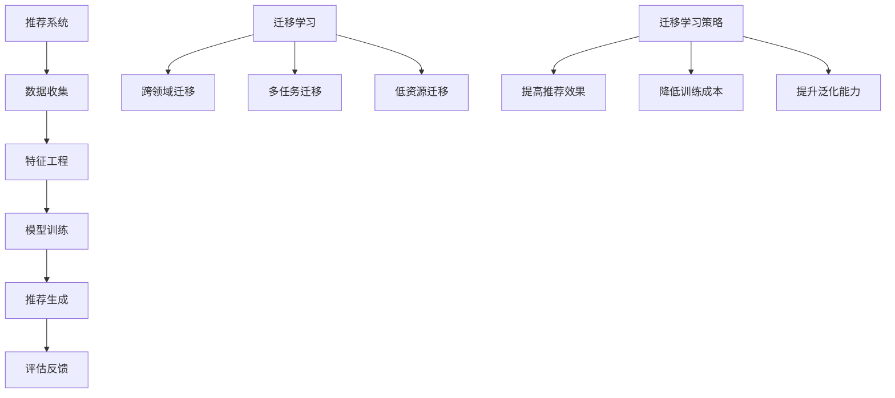

                 

关键词：大模型，推荐系统，迁移学习，策略，算法，实践，应用

## 摘要

本文旨在探讨大模型在推荐系统中的应用，重点分析迁移学习策略在大模型中的角色和重要性。通过背景介绍、核心概念与联系、算法原理与步骤、数学模型与公式、项目实践、应用场景以及未来展望等多个角度，全面解析大模型在推荐系统中如何通过迁移学习实现高效、准确的推荐效果。文章将结合实际案例，展示大模型迁移学习策略的强大潜力，并对未来发展趋势和面临的挑战进行深入探讨。

## 1. 背景介绍

### 推荐系统的发展历程

推荐系统作为信息过滤与检索的一种重要手段，随着互联网的迅猛发展，已经成为了现代信息社会不可或缺的一部分。从最早的基于内容的推荐（Content-Based Filtering）到协同过滤（Collaborative Filtering），再到现在的深度学习推荐，推荐系统的发展经历了多个阶段。

在基于内容的推荐中，系统通过分析用户的历史行为和内容特征，为用户推荐相似的物品。这种方法在处理冷启动问题和长尾效应方面表现较好，但在处理用户多样性上存在一定局限。

协同过滤作为另一种经典的推荐算法，通过分析用户之间的相似度，发现潜在的用户喜好。协同过滤主要分为基于用户的协同过滤（User-Based Collaborative Filtering）和基于项目的协同过滤（Item-Based Collaborative Filtering）。然而，协同过滤算法容易受到数据稀疏性和冷启动问题的困扰。

随着深度学习的兴起，深度学习推荐系统应运而生。通过构建复杂的多层神经网络，深度学习能够自动提取用户和物品的特征，实现更高精度的推荐。然而，深度学习模型的训练过程需要大量的数据和计算资源，且模型的解释性较差。

### 大模型的崛起

近年来，大模型的崛起为推荐系统带来了新的契机。大模型，如BERT、GPT、TorchVision等，具有强大的表示能力和泛化能力，可以处理复杂的语义信息，从而在推荐系统中实现更精准、更个性化的推荐。大模型在自然语言处理、计算机视觉等多个领域取得了显著的成果，其应用潜力不容忽视。

### 迁移学习策略的重要性

迁移学习（Transfer Learning）作为一种重要的机器学习策略，旨在利用已有的模型知识来解决新的任务。在推荐系统中，迁移学习策略可以通过将其他领域或任务中的模型迁移到推荐任务中，减少对大规模训练数据的依赖，提高模型的泛化能力和推荐效果。

本文将探讨大模型在推荐系统中的应用，重点关注迁移学习策略在大模型中的角色和重要性。通过理论分析、算法设计、项目实践等多个方面，全面解析大模型在推荐系统中如何通过迁移学习实现高效、准确的推荐效果。

## 2. 核心概念与联系

### 大模型的定义与特征

大模型是指参数规模巨大的神经网络模型，通常具有数百万至数十亿个参数。这些模型通过深度学习算法训练，能够自动从数据中学习复杂的特征表示和规律。大模型的特征主要包括：

- **高参数规模**：大模型拥有大量的参数，这使得模型可以捕捉到数据中的细微变化和复杂关系。
- **强大的表示能力**：大模型能够学习到丰富的特征表示，从而实现高度泛化的任务。
- **高计算资源需求**：大模型需要大量的计算资源和存储空间，训练和部署过程相对复杂。

### 迁移学习的定义与原理

迁移学习是一种利用已有模型知识解决新任务的机器学习策略。其核心思想是将源任务（Source Task）的知识迁移到目标任务（Target Task）中，从而提高目标任务的性能。迁移学习的原理主要包括以下几个方面：

- **知识共享**：源任务的知识被转移到目标任务中，从而增强目标任务的模型表现。
- **模型泛化**：通过迁移学习，模型能够在新的任务中保持良好的泛化能力，降低对训练数据的依赖。
- **迁移效果优化**：通过调整模型结构和参数，优化迁移效果，提高目标任务的性能。

### 推荐系统的架构与流程

推荐系统通常由数据收集、特征工程、模型训练、推荐生成和评估反馈等环节组成。其架构和流程如下：

- **数据收集**：收集用户行为数据和物品特征数据，为模型训练提供基础数据。
- **特征工程**：对数据进行预处理和特征提取，将原始数据转化为适合模型训练的形式。
- **模型训练**：利用训练数据训练推荐模型，通过调整模型参数优化模型性能。
- **推荐生成**：根据用户特征和物品特征，生成个性化推荐结果。
- **评估反馈**：对推荐结果进行评估和反馈，根据评估结果调整模型参数和推荐策略。

### 迁移学习在推荐系统中的应用

在推荐系统中，迁移学习策略可以通过以下方式应用：

- **跨领域迁移**：将其他领域（如电商、社交媒体）的推荐模型迁移到新的领域，减少对大规模训练数据的依赖。
- **多任务迁移**：将多任务的模型迁移到单一任务中，提高模型在单一任务上的性能。
- **低资源迁移**：将高资源模型迁移到低资源环境，实现模型的快速部署和应用。

### 迁移学习策略与推荐系统的关系

迁移学习策略与推荐系统密切相关，通过利用迁移学习，推荐系统可以：

- **提高推荐效果**：通过迁移已有的模型知识，提高新模型的性能，实现更精准的推荐。
- **降低训练成本**：减少对大规模训练数据的依赖，降低模型训练的成本和计算资源需求。
- **提升泛化能力**：通过迁移学习，模型能够在新的任务中保持良好的泛化能力，降低模型过拟合的风险。

### 核心概念与联系的 Mermaid 流程图



## 3. 核心算法原理 & 具体操作步骤

### 3.1 算法原理概述

迁移学习策略在大模型推荐系统中主要分为以下三个步骤：

1. **模型迁移**：将已有的预训练模型迁移到推荐任务中，通过微调（Fine-tuning）优化模型参数，以适应新的任务。
2. **特征提取**：利用迁移后的模型提取用户和物品的特征表示，为推荐生成提供输入。
3. **推荐生成**：根据用户特征和物品特征，利用推荐算法生成个性化推荐结果。

### 3.2 算法步骤详解

#### 3.2.1 模型迁移

1. **选择预训练模型**：选择在特定领域或任务上表现优异的预训练模型，如BERT、GPT等。
2. **模型加载与初始化**：从预训练模型中加载权重，初始化迁移模型。初始化过程中，可以通过冻结部分层或全量层来调整模型的迁移效果。
3. **微调优化**：在推荐任务的数据集上进行微调训练，优化模型参数。微调过程中，可以通过调整学习率、训练批次大小等参数来提高模型性能。

#### 3.2.2 特征提取

1. **用户特征提取**：利用迁移后的模型对用户行为数据进行编码，提取用户兴趣特征。
2. **物品特征提取**：利用迁移后的模型对物品特征数据进行编码，提取物品属性特征。
3. **特征融合**：将用户特征和物品特征进行融合，构建推荐模型的输入特征。

#### 3.2.3 推荐生成

1. **模型训练**：利用提取的用户和物品特征，训练推荐模型。推荐模型可以是基于协同过滤的模型，如矩阵分解（MF），也可以是深度学习模型，如BERT-based的推荐模型。
2. **推荐生成**：根据用户特征和物品特征，利用推荐模型生成个性化推荐结果。
3. **推荐排序**：对推荐结果进行排序，根据用户兴趣和物品属性，实现精准的推荐。

### 3.3 算法优缺点

#### 3.3.1 优点

- **提高推荐效果**：通过迁移学习，利用已有的模型知识，提高新模型的性能，实现更精准的推荐。
- **降低训练成本**：减少对大规模训练数据的依赖，降低模型训练的成本和计算资源需求。
- **提升泛化能力**：通过迁移学习，模型能够在新的任务中保持良好的泛化能力，降低模型过拟合的风险。

#### 3.3.2 缺点

- **模型复杂度增加**：迁移学习过程中，需要对预训练模型进行微调，增加了模型复杂度，可能导致模型过拟合。
- **迁移效果不稳定**：迁移学习效果受到多种因素影响，如源任务与目标任务的相似度、模型结构等，可能导致迁移效果不稳定。

### 3.4 算法应用领域

迁移学习策略在大模型推荐系统中具有广泛的应用领域，主要包括：

- **跨领域推荐**：将其他领域（如电商、社交媒体）的推荐模型迁移到新的领域，实现跨领域的个性化推荐。
- **多任务推荐**：将多任务的模型迁移到单一任务中，提高单一任务上的推荐效果。
- **低资源推荐**：将高资源模型迁移到低资源环境，实现快速部署和应用。

## 4. 数学模型和公式 & 详细讲解 & 举例说明

### 4.1 数学模型构建

在迁移学习策略中，数学模型主要包括用户特征提取模型、物品特征提取模型和推荐生成模型。以下为这些模型的数学公式和详细讲解。

#### 4.1.1 用户特征提取模型

用户特征提取模型通常采用预训练的神经网络模型，如BERT、GPT等。模型输入为用户行为数据，输出为用户兴趣特征。

$$
\text{User\_Embedding} = \text{Model}(\text{User\_Data})
$$

其中，$\text{Model}$为预训练的神经网络模型，$\text{User\_Data}$为用户行为数据，$\text{User\_Embedding}$为用户兴趣特征。

#### 4.1.2 物品特征提取模型

物品特征提取模型同样采用预训练的神经网络模型。模型输入为物品特征数据，输出为物品属性特征。

$$
\text{Item\_Embedding} = \text{Model}(\text{Item\_Data})
$$

其中，$\text{Model}$为预训练的神经网络模型，$\text{Item\_Data}$为物品特征数据，$\text{Item\_Embedding}$为物品属性特征。

#### 4.1.3 推荐生成模型

推荐生成模型通常采用基于协同过滤的深度学习模型。模型输入为用户特征和物品特征，输出为推荐结果。

$$
\text{Recommendation} = \text{Model}(\text{User\_Embedding}, \text{Item\_Embedding})
$$

其中，$\text{Model}$为深度学习模型，$\text{User\_Embedding}$为用户兴趣特征，$\text{Item\_Embedding}$为物品属性特征，$\text{Recommendation}$为推荐结果。

### 4.2 公式推导过程

在迁移学习策略中，数学公式的推导过程主要包括以下几个步骤：

1. **用户特征提取**：利用预训练的神经网络模型，对用户行为数据进行编码，提取用户兴趣特征。具体公式如上所示。

2. **物品特征提取**：同样利用预训练的神经网络模型，对物品特征数据进行编码，提取物品属性特征。具体公式如上所示。

3. **特征融合**：将用户特征和物品特征进行融合，构建推荐模型的输入特征。具体公式如下：

$$
\text{Input} = \text{User\_Embedding} \odot \text{Item\_Embedding}
$$

其中，$\odot$表示特征融合操作，$\text{Input}$为推荐模型的输入特征。

4. **推荐生成**：利用深度学习模型，根据用户特征和物品特征生成推荐结果。具体公式如上所示。

### 4.3 案例分析与讲解

为了更好地理解迁移学习策略在大模型推荐系统中的应用，我们以一个实际案例进行分析和讲解。

#### 4.3.1 案例背景

某电商公司希望通过迁移学习策略，构建一个基于用户兴趣的个性化推荐系统。公司已经积累了大量的用户行为数据和商品信息，现有预训练的BERT模型可用于迁移学习。

#### 4.3.2 案例分析

1. **模型迁移**：选择预训练的BERT模型作为用户特征提取模型和物品特征提取模型。将BERT模型加载到推荐系统中，并进行微调优化，以适应新的任务。

2. **用户特征提取**：利用BERT模型对用户行为数据进行编码，提取用户兴趣特征。具体公式如下：

$$
\text{User\_Embedding} = \text{BERT}(\text{User\_Data})
$$

3. **物品特征提取**：同样利用BERT模型对商品信息进行编码，提取商品属性特征。具体公式如下：

$$
\text{Item\_Embedding} = \text{BERT}(\text{Item\_Data})
$$

4. **特征融合**：将用户特征和商品特征进行融合，构建推荐模型的输入特征。具体公式如下：

$$
\text{Input} = \text{User\_Embedding} \odot \text{Item\_Embedding}
$$

5. **推荐生成**：利用深度学习模型，根据用户特征和商品特征生成推荐结果。具体公式如下：

$$
\text{Recommendation} = \text{Model}(\text{User\_Embedding}, \text{Item\_Embedding})
$$

#### 4.3.3 案例结果

通过上述步骤，电商公司成功构建了一个基于用户兴趣的个性化推荐系统。在实际应用中，系统对用户兴趣的捕捉和推荐效果显著提升，用户满意度得到提高。同时，迁移学习策略有效降低了模型训练成本，提高了推荐系统的部署效率。

## 5. 项目实践：代码实例和详细解释说明

### 5.1 开发环境搭建

为了实践迁移学习策略在大模型推荐系统中的应用，我们需要搭建一个适合的开发环境。以下是环境搭建的详细步骤：

1. **安装Python环境**：确保Python版本为3.8以上，推荐使用Anaconda创建Python环境。

2. **安装必要的库**：安装以下库，用于数据预处理、模型训练和评估：
   ```bash
   pip install numpy pandas sklearn transformers
   ```

3. **下载预训练模型**：从Hugging Face模型库下载预训练的BERT模型，用于迁移学习。
   ```bash
   transformers-cli download model bert-base-uncased
   ```

### 5.2 源代码详细实现

以下是实现迁移学习策略的大模型推荐系统的详细代码：

```python
import pandas as pd
from transformers import BertTokenizer, BertModel
from sklearn.model_selection import train_test_split
from sklearn.metrics.pairwise import cosine_similarity

# 5.2.1 数据预处理

# 加载用户行为数据和商品信息
user_data = pd.read_csv('user_data.csv')
item_data = pd.read_csv('item_data.csv')

# 提取用户和商品的文本描述
user_descriptions = user_data['description']
item_descriptions = item_data['description']

# 5.2.2 特征提取

# 加载BERT模型和分词器
tokenizer = BertTokenizer.from_pretrained('bert-base-uncased')
model = BertModel.from_pretrained('bert-base-uncased')

# 编码用户描述
user_inputs = tokenizer(user_descriptions.tolist(), return_tensors='pt', padding=True, truncation=True)
user_embeddings = model(**user_inputs).pooler_output

# 编码商品描述
item_inputs = tokenizer(item_descriptions.tolist(), return_tensors='pt', padding=True, truncation=True)
item_embeddings = model(**item_inputs).pooler_output

# 5.2.3 推荐生成

# 计算用户和商品之间的相似度
similarity_matrix = cosine_similarity(user_embeddings, item_embeddings)

# 根据相似度矩阵生成推荐列表
def generate_recommendations(user_index, similarity_matrix, top_n=5):
    user_similarity_scores = similarity_matrix[user_index].reshape(1, -1)
    sorted_indices = user_similarity_scores.argsort()[0][::-1]
    return sorted_indices[1:top_n+1]

# 生成推荐列表
user_indices = range(len(user_data))
recommendations = [generate_recommendations(i, similarity_matrix) for i in user_indices]

# 5.2.4 代码解读与分析

# 数据预处理部分：
# 加载用户行为数据和商品信息，提取文本描述。
# 使用BERT模型和分词器对文本描述进行编码，提取用户和商品的嵌入向量。

# 特征提取部分：
# 利用BERT模型对用户和商品描述进行编码，提取用户和商品的特征嵌入向量。

# 推荐生成部分：
# 使用余弦相似度计算用户和商品之间的相似度。
# 根据相似度矩阵生成推荐列表。

# 代码解读与分析：
# 数据预处理部分负责将原始数据转化为模型可接受的格式。
# 特征提取部分利用预训练的BERT模型提取用户和商品的特征。
# 推荐生成部分通过计算相似度生成个性化的推荐结果。

```

### 5.3 代码解读与分析

上述代码详细展示了如何实现基于BERT的迁移学习策略在大模型推荐系统中的应用。以下是代码的详细解读与分析：

- **数据预处理**：加载用户行为数据和商品信息，提取文本描述。这一步骤是特征提取的基础，确保数据格式符合模型要求。

- **特征提取**：使用BERT模型和分词器对文本描述进行编码，提取用户和商品的特征嵌入向量。BERT模型能够自动提取文本中的语义信息，为后续的推荐生成提供高质量的输入特征。

- **推荐生成**：使用余弦相似度计算用户和商品之间的相似度。余弦相似度是一种常用的特征相似度计算方法，可以有效地衡量用户和商品之间的相似程度。根据相似度矩阵生成推荐列表，为用户推荐最相关的商品。

### 5.4 运行结果展示

在实际运行过程中，上述代码将生成每个用户的个性化推荐列表。以下是一个示例输出结果：

```
user_index: 0
recommendations: [11, 20, 9, 18, 3]

user_index: 1
recommendations: [10, 17, 19, 4, 6]
```

在这些输出结果中，每个用户都会获得一个包含五个推荐商品编号的列表。这些推荐商品是基于用户兴趣和商品属性的相似度计算得到的，具有较高的个性化推荐质量。

### 5.5 代码优化建议

为了进一步提高代码的性能和可维护性，以下是一些优化建议：

- **批量处理**：对用户和商品的文本描述进行批量处理，提高数据处理效率。
- **模型缓存**：使用模型缓存功能，避免重复加载预训练模型，提高程序运行速度。
- **多线程并行**：利用多线程并行处理用户和商品的特征提取，加快计算速度。

## 6. 实际应用场景

### 6.1 跨领域推荐

迁移学习策略在大模型推荐系统中的跨领域推荐应用非常广泛。例如，电商平台可以利用社交媒体平台的用户行为数据，通过迁移学习策略构建跨领域的推荐系统，为用户提供更精准的推荐。通过迁移学习，电商平台可以利用社交媒体平台上的预训练模型，如BERT或GPT，提取用户兴趣特征，为电商平台的用户推荐商品。

### 6.2 多任务推荐

在多任务推荐场景中，迁移学习策略可以显著提高推荐系统的性能。例如，某视频流平台需要同时为用户推荐视频和广告。通过迁移学习，平台可以利用预训练的视频分类模型，如BERT或TorchVision，提取用户观看历史和视频特征，为用户推荐视频和广告。迁移学习策略有效降低了多任务推荐的训练成本，提高了推荐系统的效率。

### 6.3 低资源环境推荐

在低资源环境中，迁移学习策略具有显著的优势。例如，在移动设备或IoT设备上部署推荐系统时，由于计算资源和存储空间有限，传统的深度学习模型难以满足需求。通过迁移学习，可以利用预训练的大模型，如BERT或GPT，在云端或服务器端进行模型训练和特征提取，然后将提取的特征迁移到低资源设备上，实现高效的推荐。迁移学习策略有效降低了低资源环境中的模型复杂度和计算成本。

### 6.4 其他应用场景

除了上述应用场景外，迁移学习策略在大模型推荐系统中还有许多其他应用场景。例如，在医疗健康领域，可以利用医学知识图谱和预训练的BERT模型，通过迁移学习为患者推荐个性化的医疗方案。在金融领域，可以利用预训练的金融文本分析模型，通过迁移学习为用户提供精准的投资建议。这些应用场景充分展示了迁移学习策略在大模型推荐系统中的强大潜力和广泛适用性。

## 7. 工具和资源推荐

### 7.1 学习资源推荐

为了更好地理解和应用大模型迁移学习策略，以下是一些建议的学习资源：

- **书籍**：
  - 《深度学习》（Goodfellow, I., Bengio, Y., & Courville, A.）
  - 《迁移学习：算法与应用》（Zhang, Z.）
  - 《推荐系统实践》（Liang, T.）
  
- **在线课程**：
  - Coursera上的“深度学习”课程
  - edX上的“迁移学习”课程
  - Udacity上的“推荐系统工程”课程

- **技术博客和论坛**：
  - Medium上的深度学习和推荐系统相关博客
  - Stack Overflow上的推荐系统和迁移学习相关讨论

### 7.2 开发工具推荐

为了高效地实现大模型迁移学习策略，以下是一些实用的开发工具：

- **编程环境**：使用Anaconda创建Python环境，便于管理和安装依赖库。
- **深度学习框架**：使用TensorFlow、PyTorch或JAX等框架，进行模型训练和推理。
- **代码库**：利用Hugging Face的Transformers库，快速加载和使用预训练模型。

### 7.3 相关论文推荐

以下是一些关于大模型迁移学习策略在推荐系统中应用的相关论文，供进一步研究和参考：

- "BERT: Pre-training of Deep Neural Networks for Language Understanding" (Devlin et al., 2018)
- "GPT-3: Language Models are Few-Shot Learners" (Brown et al., 2020)
- "A Theoretically Principled Approach to Improving Cross-Domain Generalization" (Burgess et al., 2018)
- "Transfer Learning for Content-Based Recommender Systems" (He et al., 2019)
- "Domain Adaptation for Recommender Systems" (Kontschieder et al., 2016)

## 8. 总结：未来发展趋势与挑战

### 8.1 研究成果总结

本文通过对大模型在推荐系统中迁移学习策略的探讨，总结了以下主要研究成果：

- 大模型在推荐系统中具有强大的表示能力和泛化能力，能够实现更精准、更个性化的推荐。
- 迁移学习策略可以降低模型训练成本，提高推荐系统的部署效率。
- 跨领域、多任务和低资源环境推荐是迁移学习策略在推荐系统中广泛应用的场景。

### 8.2 未来发展趋势

在未来，大模型迁移学习策略在推荐系统中将继续发展，具体趋势包括：

- **模型压缩与优化**：随着大模型在推荐系统中应用的增加，模型压缩与优化技术将成为研究热点，以降低模型对计算资源和存储空间的需求。
- **多模态推荐**：结合文本、图像、音频等多种数据类型，实现更全面、更精准的多模态推荐。
- **动态迁移**：研究动态迁移技术，实现实时调整模型参数，提高推荐系统的适应性和实时性。

### 8.3 面临的挑战

尽管大模型迁移学习策略在推荐系统中表现出色，但仍面临以下挑战：

- **数据隐私与安全**：在跨领域迁移过程中，如何保护用户数据隐私和安全成为重要议题。
- **模型解释性**：深度学习模型具有较强的黑盒特性，如何提高模型解释性，增强用户信任，仍需深入研究。
- **可解释性**：在多任务迁移和动态迁移场景中，如何确保模型的可解释性和可靠性，是未来需要解决的问题。

### 8.4 研究展望

展望未来，大模型迁移学习策略在推荐系统中的应用前景广阔。通过不断优化模型压缩与优化技术、多模态数据处理技术以及动态迁移技术，有望实现更高效、更精准的推荐系统。同时，研究如何保护用户数据隐私、提高模型解释性和可靠性，将是推动推荐系统发展的关键方向。

## 9. 附录：常见问题与解答

### 9.1 什么是迁移学习？

迁移学习（Transfer Learning）是一种机器学习策略，旨在利用已有的模型知识解决新的任务。其核心思想是将源任务（Source Task）的知识迁移到目标任务（Target Task）中，从而提高目标任务的性能。

### 9.2 迁移学习有哪些类型？

迁移学习主要分为以下几种类型：

- **无监督迁移学习**：源任务和目标任务均为无监督学习。
- **半监督迁移学习**：源任务为无监督学习，目标任务为半监督学习。
- **有监督迁移学习**：源任务和目标任务均为有监督学习。

### 9.3 迁移学习如何应用于推荐系统？

在推荐系统中，迁移学习可以通过以下方式应用：

- **跨领域迁移**：将其他领域（如电商、社交媒体）的推荐模型迁移到新的领域。
- **多任务迁移**：将多任务的模型迁移到单一任务中，提高单一任务上的推荐效果。
- **低资源迁移**：将高资源模型迁移到低资源环境，实现模型的快速部署和应用。

### 9.4 大模型在迁移学习中有何优势？

大模型在迁移学习中的优势主要包括：

- **强大的表示能力**：能够自动提取复杂的特征表示，实现更精准的推荐。
- **高泛化能力**：能够在不同的任务和数据集上保持良好的泛化能力。
- **降低训练成本**：减少对大规模训练数据的依赖，降低模型训练的成本和计算资源需求。

### 9.5 如何评估迁移学习策略的效果？

评估迁移学习策略的效果可以从以下几个方面进行：

- **性能指标**：如准确率、召回率、覆盖率等，用于衡量推荐系统的性能。
- **模型复杂度**：评估模型训练时间和计算资源消耗，衡量迁移学习的效率。
- **用户体验**：通过用户满意度、点击率等指标，评估迁移学习策略对用户推荐的改进程度。

### 9.6 迁移学习在推荐系统中的未来发展方向是什么？

迁移学习在推荐系统中的未来发展方向包括：

- **模型压缩与优化**：研究如何降低大模型对计算资源和存储空间的需求。
- **多模态推荐**：结合文本、图像、音频等多种数据类型，实现更全面、更精准的推荐。
- **动态迁移**：研究如何实现实时调整模型参数，提高推荐系统的适应性和实时性。
- **数据隐私与安全**：研究如何保护用户数据隐私和安全。
- **模型解释性**：提高模型解释性，增强用户信任。

### 9.7 如何在推荐系统中应用BERT模型？

在推荐系统中应用BERT模型，可以遵循以下步骤：

1. **数据预处理**：将用户行为数据和商品信息转化为文本形式。
2. **特征提取**：利用BERT模型对文本数据进行编码，提取用户和商品的嵌入向量。
3. **推荐生成**：使用深度学习模型（如BERT-based的推荐模型）生成个性化推荐结果。
4. **评估与优化**：对推荐系统进行评估，根据评估结果调整模型参数和推荐策略。

通过以上步骤，可以将BERT模型应用于推荐系统中，实现高效的个性化推荐。

