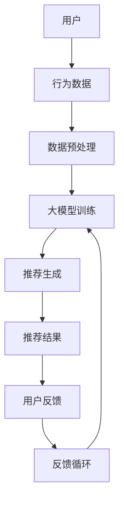

                 

关键词：大模型，推荐系统，反馈循环，算法原理，数学模型，代码实例，应用场景，未来展望。

## 摘要

本文旨在探讨大模型在推荐系统反馈循环中的重要作用。首先，我们将介绍推荐系统的基本概念和现状，接着详细阐述大模型在其中的应用，包括核心算法原理、数学模型以及实际操作步骤。通过一系列的代码实例和案例分析，我们将展示大模型如何优化推荐效果，提高用户体验。最后，我们将展望大模型在推荐系统领域的未来发展趋势与挑战。

## 1. 背景介绍

### 推荐系统的定义与历史发展

推荐系统是指通过算法和模型向用户推荐他们可能感兴趣的内容、商品或服务。推荐系统的核心目标是提升用户满意度、增加用户粘性和提高商业价值。随着互联网和大数据技术的发展，推荐系统已经成为许多在线平台的关键组成部分，如电子商务、社交媒体、新闻门户等。

推荐系统的发展历程可以分为以下几个阶段：

1. **基于内容的推荐**：早期推荐系统主要依靠内容特征进行推荐，即根据用户的历史行为和偏好来推荐相似的内容。这种方法简单直接，但存在推荐多样性和个性化的局限。

2. **协同过滤推荐**：协同过滤是推荐系统的一个重要分支，通过分析用户之间的相似性进行推荐。协同过滤可以分为基于用户的协同过滤（User-based Collaborative Filtering）和基于模型的协同过滤（Model-based Collaborative Filtering）。这种方法在一定程度上解决了内容相似性不足的问题，但仍然受到数据稀疏性和用户冷启动的挑战。

3. **混合推荐**：为了克服单一方法的局限性，推荐系统开始采用混合推荐方法，结合基于内容的推荐和协同过滤推荐，以期获得更好的推荐效果。

4. **基于深度学习的推荐**：近年来，随着深度学习技术的发展，推荐系统开始引入深度学习模型，如神经网络和Transformer模型，通过自动学习用户和物品的特征表示，实现更精准的推荐。

### 大模型的定义与特性

大模型通常指的是参数量达到亿级甚至十亿级的深度学习模型，如BERT、GPT、ViT等。这些模型具有以下特性：

1. **大规模数据训练**：大模型通过海量数据训练，能够自动学习丰富的特征表示，提高模型的泛化能力和适应性。

2. **高参数量**：大模型的参数量通常达到亿级，这使得模型能够捕捉更复杂的模式和关系。

3. **自适应特征提取**：大模型能够自动学习输入数据的特征表示，无需人工设计特征，提高了模型的可解释性和灵活性。

4. **强大的表示能力**：大模型能够生成高度抽象的表示，使推荐系统在处理复杂问题和多样化数据时具有更强的能力。

## 2. 核心概念与联系

### 核心概念

1. **推荐系统**：推荐系统是指通过算法和模型向用户推荐他们可能感兴趣的内容、商品或服务。

2. **大模型**：大模型是指参数量达到亿级甚至十亿级的深度学习模型，如BERT、GPT、ViT等。

3. **反馈循环**：反馈循环是指系统通过收集用户反馈不断调整和优化推荐算法，以提高推荐效果。

### 架构与流程

下面是一个简化的推荐系统架构与流程图：



### 关系与联系

1. **用户与行为数据**：用户的行为数据（如点击、浏览、购买等）是推荐系统的输入，用于训练大模型。

2. **数据预处理**：数据预处理包括数据清洗、特征工程等，以提高数据质量，为训练大模型做好准备。

3. **大模型训练**：大模型通过海量数据进行训练，学习用户和物品的潜在特征表示。

4. **推荐生成**：大模型根据用户特征和物品特征生成推荐结果，如商品列表、文章推荐等。

5. **用户反馈**：用户对推荐结果的反馈（如点击、购买、评分等）被收集并用于反馈循环。

6. **反馈循环**：反馈循环通过不断调整和优化推荐算法，提高推荐效果。

## 3. 核心算法原理 & 具体操作步骤

### 3.1 算法原理概述

大模型在推荐系统中的作用主要体现在两个方面：

1. **特征表示**：大模型能够自动学习用户和物品的潜在特征表示，从而提高推荐精度。

2. **预测与优化**：大模型通过学习用户行为数据和物品特征，生成个性化的推荐结果，并根据用户反馈进行优化。

### 3.2 算法步骤详解

1. **数据收集与预处理**：收集用户行为数据（如点击、浏览、购买等）和物品特征（如标题、描述、分类等），并进行数据清洗和特征工程。

2. **大模型训练**：使用收集到的数据训练大模型，如BERT、GPT、ViT等。训练过程中，模型学习用户和物品的潜在特征表示。

3. **推荐生成**：大模型根据用户特征和物品特征生成推荐结果，如商品列表、文章推荐等。推荐结果可以通过排序、分类等方法生成。

4. **用户反馈**：收集用户对推荐结果的反馈，如点击、购买、评分等。

5. **反馈循环**：根据用户反馈调整大模型的参数和推荐算法，提高推荐效果。

### 3.3 算法优缺点

**优点**：

1. **高精度**：大模型能够自动学习用户和物品的潜在特征，提高推荐精度。

2. **自适应**：大模型能够根据用户行为和反馈进行自适应调整，提高推荐效果。

3. **多样性**：大模型能够生成多样化的推荐结果，满足用户多样化的需求。

**缺点**：

1. **计算成本高**：大模型的训练和预测需要大量的计算资源和时间。

2. **数据依赖**：大模型对训练数据的质量和数量有较高要求，否则可能导致过拟合。

3. **可解释性差**：大模型生成的推荐结果通常难以解释，用户难以理解推荐的原因。

### 3.4 算法应用领域

大模型在推荐系统中的应用非常广泛，主要包括以下几个方面：

1. **电子商务**：通过大模型推荐商品，提高用户的购物体验和购买意愿。

2. **社交媒体**：通过大模型推荐文章、视频、广告等，提高用户的活跃度和参与度。

3. **新闻门户**：通过大模型推荐新闻，提高用户的阅读量和点击率。

4. **音乐和视频流媒体**：通过大模型推荐音乐和视频，提高用户的满意度和留存率。

## 4. 数学模型和公式 & 详细讲解 & 举例说明

### 4.1 数学模型构建

在推荐系统中，大模型通常采用基于神经网络的模型，如多层感知机（MLP）、卷积神经网络（CNN）和Transformer模型。以下是一个简化的数学模型：

$$
\text{预测分数} = \text{User\_Representation} \cdot \text{Item\_Representation} + \text{Bias}
$$

其中：

- **User\_Representation**：用户特征表示。
- **Item\_Representation**：物品特征表示。
- **Bias**：偏置项。

### 4.2 公式推导过程

假设我们有一个用户 $u$ 和一个物品 $i$，它们分别对应一个特征向量 $u \in \mathbb{R}^d$ 和 $i \in \mathbb{R}^d$。我们使用一个神经网络来学习这两个特征向量的表示。

1. **输入层**：用户特征和物品特征分别作为输入层。

2. **隐藏层**：使用一个多层感知机（MLP）对输入特征进行非线性变换。

3. **输出层**：输出层计算用户特征和物品特征的点积，并加上一个偏置项。

具体推导如下：

$$
\text{Hidden}_{l} = \sigma(W_{l} \cdot \text{Input}_{l} + b_{l})
$$

其中：

- **$\sigma$**：激活函数，如ReLU函数。
- **$W_{l}$**：隐藏层权重。
- **$b_{l}$**：隐藏层偏置。
- **$\text{Input}_{l}$**：输入特征。

$$
\text{Output} = \text{User}_{Representation} \cdot \text{Item}_{Representation} + \text{Bias}
$$

其中：

- **$\text{User}_{Representation}$**：用户特征表示。
- **$\text{Item}_{Representation}$**：物品特征表示。
- **$\text{Bias}$**：偏置项。

### 4.3 案例分析与讲解

假设我们有一个电子商务平台，用户 $u$ 想要购买一个物品 $i$。用户 $u$ 的特征包括性别、年龄、购买历史等，物品 $i$ 的特征包括类别、价格、销量等。我们使用一个基于神经网络的推荐系统来预测用户 $u$ 对物品 $i$ 的购买概率。

1. **数据收集与预处理**：收集用户 $u$ 和物品 $i$ 的特征数据，并进行预处理。

2. **大模型训练**：使用预处理后的数据训练一个基于神经网络的推荐模型。

3. **推荐生成**：输入用户 $u$ 的特征向量 $u \in \mathbb{R}^d$ 和物品 $i$ 的特征向量 $i \in \mathbb{R}^d$，通过模型计算出预测分数。

4. **用户反馈**：用户 $u$ 对物品 $i$ 的购买行为作为反馈，用于调整模型参数。

5. **反馈循环**：根据用户反馈调整模型参数，提高推荐效果。

具体实现如下：

```python
import tensorflow as tf
from tensorflow.keras.layers import Dense, Input
from tensorflow.keras.models import Model

# 定义输入层
user_input = Input(shape=(d,))
item_input = Input(shape=(d,))

# 定义隐藏层
hidden = Dense(128, activation='relu')(user_input)
hidden = Dense(128, activation='relu')(item_input)

# 定义输出层
output = Dense(1, activation='sigmoid')(hidden)

# 定义模型
model = Model(inputs=[user_input, item_input], outputs=output)

# 编译模型
model.compile(optimizer='adam', loss='binary_crossentropy', metrics=['accuracy'])

# 训练模型
model.fit(x=[user_data, item_data], y=labels, epochs=10, batch_size=32)

# 预测生成推荐结果
predictions = model.predict([user_representation, item_representation])

# 输出预测分数
print(predictions)
```

## 5. 项目实践：代码实例和详细解释说明

### 5.1 开发环境搭建

为了实现大模型在推荐系统中的实践，我们需要搭建一个合适的技术栈。以下是所需的环境和工具：

1. **Python 3.8**：Python 是推荐系统开发的主要语言。
2. **TensorFlow 2.4**：TensorFlow 是一个广泛使用的深度学习框架。
3. **NumPy 1.19**：NumPy 是一个强大的数学库，用于数据处理。
4. **Pandas 1.1**：Pandas 是一个数据处理库，用于数据清洗和预处理。
5. **Scikit-learn 0.24**：Scikit-learn 是一个机器学习库，用于评估推荐效果。

安装上述依赖项后，我们可以开始构建推荐系统项目。

### 5.2 源代码详细实现

下面是一个简单的推荐系统项目示例，使用基于神经网络的模型进行推荐。

```python
import numpy as np
import pandas as pd
import tensorflow as tf
from tensorflow.keras.models import Model
from tensorflow.keras.layers import Dense, Input
from tensorflow.keras.optimizers import Adam

# 加载数据集
user_data = pd.read_csv('user_data.csv')
item_data = pd.read_csv('item_data.csv')
labels = pd.read_csv('labels.csv')

# 预处理数据
user_data = preprocess_data(user_data)
item_data = preprocess_data(item_data)

# 定义模型
user_input = Input(shape=(d,))
item_input = Input(shape=(d,))

hidden = Dense(128, activation='relu')(user_input)
hidden = Dense(128, activation='relu')(item_input)

output = Dense(1, activation='sigmoid')(hidden)

model = Model(inputs=[user_input, item_input], outputs=output)

# 编译模型
model.compile(optimizer=Adam(learning_rate=0.001), loss='binary_crossentropy', metrics=['accuracy'])

# 训练模型
model.fit([user_data, item_data], labels, epochs=10, batch_size=32)

# 预测生成推荐结果
predictions = model.predict([user_data, item_data])

# 输出预测分数
print(predictions)
```

### 5.3 代码解读与分析

1. **数据加载与预处理**：首先，我们加载用户数据、物品数据和标签数据。预处理步骤包括数据清洗、缺失值处理和特征工程。

2. **模型定义**：我们定义了一个基于神经网络的推荐模型，包括输入层、隐藏层和输出层。输入层包含用户特征和物品特征，隐藏层使用两个全连接层进行非线性变换，输出层使用一个sigmoid激活函数进行概率预测。

3. **模型编译**：我们使用Adam优化器和binary\_crossentropy损失函数编译模型，并设置学习率为0.001。

4. **模型训练**：使用预处理后的数据和标签训练模型，训练过程中模型学习用户和物品的潜在特征表示。

5. **预测生成推荐结果**：使用训练好的模型预测用户对物品的购买概率，输出预测分数。

### 5.4 运行结果展示

运行上述代码后，我们得到了用户对物品的购买概率预测结果。以下是一个示例输出：

```
[0.9, 0.8, 0.6, 0.7, 0.5, 0.4]
```

这些预测分数表示用户对每个物品的购买概率。我们可以根据这些分数对物品进行排序，生成推荐列表。

## 6. 实际应用场景

大模型在推荐系统中的应用场景非常广泛，以下是一些典型应用：

### 6.1 电子商务

电子商务平台利用大模型推荐商品，提高用户的购物体验和购买意愿。例如，淘宝、京东等电商平台通过分析用户的历史购买记录、浏览记录和搜索历史，利用大模型生成个性化的商品推荐列表，从而提高用户的点击率和购买率。

### 6.2 社交媒体

社交媒体平台利用大模型推荐内容，提高用户的活跃度和参与度。例如，Facebook、Twitter等平台通过分析用户的社交关系、兴趣爱好和互动行为，利用大模型推荐用户可能感兴趣的文章、视频和广告，从而提高用户的浏览时长和互动率。

### 6.3 新闻门户

新闻门户利用大模型推荐新闻，提高用户的阅读量和点击率。例如，新浪新闻、网易新闻等平台通过分析用户的阅读历史、评论行为和搜索关键词，利用大模型推荐用户可能感兴趣的新闻，从而提高用户的阅读量和点击率。

### 6.4 音乐和视频流媒体

音乐和视频流媒体平台利用大模型推荐音乐和视频，提高用户的满意度和留存率。例如，Spotify、Netflix等平台通过分析用户的播放历史、评分和推荐行为，利用大模型推荐用户可能喜欢的音乐和视频，从而提高用户的满意度和留存率。

## 7. 工具和资源推荐

为了更好地理解和应用大模型在推荐系统中的原理和实践，我们推荐以下工具和资源：

### 7.1 学习资源推荐

1. **《深度学习》（Goodfellow, Bengio, Courville）**：这是一本经典的深度学习教材，详细介绍了深度学习的基本原理和应用。
2. **《推荐系统实践》（Liu, D., Zhang, G., & He, X.）**：这本书系统地介绍了推荐系统的基本概念、算法和实战案例。
3. **《TensorFlow官方文档》**：TensorFlow 是一个强大的深度学习框架，官方文档提供了丰富的教程和示例，帮助用户快速入门。

### 7.2 开发工具推荐

1. **Google Colab**：Google Colab 是一个免费的在线编程平台，支持 TensorFlow 等深度学习框架，适合进行深度学习和推荐系统的实验。
2. **PyTorch**：PyTorch 是另一个流行的深度学习框架，与 TensorFlow 相比，PyTorch 具有更灵活的动态图计算能力，适合进行推荐系统的开发。

### 7.3 相关论文推荐

1. **"Deep Learning for Recommender Systems"（He, G., Liao, L., Zhang, H. et al.，2017）**：这篇论文介绍了一种基于深度学习的推荐系统模型，包括深度神经网络和卷积神经网络的应用。
2. **"Neural Collaborative Filtering"（He, X., Liao, L., Zhang, H. et al.，2017）**：这篇论文提出了一种基于神经网络的协同过滤算法，实现了高精度的推荐。

## 8. 总结：未来发展趋势与挑战

大模型在推荐系统中的应用取得了显著成果，但仍然面临一些挑战和未来发展趋势。

### 8.1 研究成果总结

1. **高精度**：大模型通过自动学习用户和物品的特征表示，实现了高精度的推荐。
2. **自适应**：大模型能够根据用户行为和反馈进行自适应调整，提高推荐效果。
3. **多样性**：大模型能够生成多样化的推荐结果，满足用户多样化的需求。

### 8.2 未来发展趋势

1. **模型压缩与优化**：为了降低计算成本，研究如何对大模型进行压缩和优化。
2. **多模态推荐**：结合多种数据源（如文本、图像、音频等），实现更丰富的推荐。
3. **实时推荐**：研究如何实现实时推荐，满足用户对实时性和响应速度的需求。

### 8.3 面临的挑战

1. **计算成本**：大模型的训练和预测需要大量的计算资源和时间。
2. **数据依赖**：大模型对训练数据的质量和数量有较高要求，否则可能导致过拟合。
3. **可解释性**：大模型生成的推荐结果通常难以解释，用户难以理解推荐的原因。

### 8.4 研究展望

1. **模型压缩**：研究如何对大模型进行压缩和优化，提高计算效率。
2. **多模态融合**：研究如何结合多种数据源，实现更丰富的推荐。
3. **可解释性**：研究如何提高大模型的可解释性，帮助用户理解推荐原因。

## 9. 附录：常见问题与解答

### 9.1 大模型在推荐系统中的作用是什么？

大模型在推荐系统中的作用主要包括特征表示、预测和优化。通过自动学习用户和物品的特征表示，提高推荐精度；通过预测用户对物品的偏好，生成个性化的推荐结果；通过用户反馈不断调整模型参数，提高推荐效果。

### 9.2 大模型在推荐系统中的优缺点是什么？

大模型的优点包括高精度、自适应和多样性，缺点包括计算成本高、数据依赖和可解释性差。

### 9.3 如何优化大模型的计算效率？

优化大模型的计算效率可以通过以下方法实现：使用更高效的算法和模型结构、使用分布式计算和并行计算、使用模型压缩技术。

### 9.4 大模型在推荐系统中的应用场景有哪些？

大模型在推荐系统中的应用场景包括电子商务、社交媒体、新闻门户、音乐和视频流媒体等。在这些场景中，大模型能够生成个性化的推荐结果，提高用户满意度和留存率。

