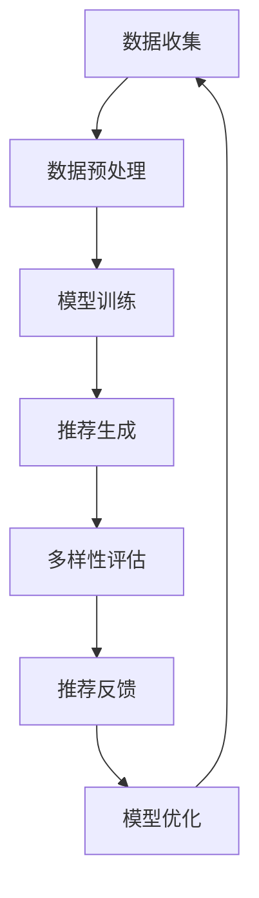

                 

摘要：
随着互联网和大数据技术的快速发展，推荐系统已成为电商平台、社交媒体和在线广告等领域的重要组成部分。然而，推荐系统的单一性和同质性问题逐渐凸显，影响了用户体验和系统价值。本文将探讨大模型在推荐系统多样性优化中的应用，通过对大模型的核心概念、算法原理、数学模型和项目实践等方面的深入分析，提出一种有效的多样性优化方法，并对未来发展趋势和面临的挑战进行了展望。

## 1. 背景介绍

推荐系统作为人工智能和机器学习领域的热点话题，近年来取得了显著的研究进展和实际应用。推荐系统通过分析用户的历史行为和偏好，为用户推荐个性化的内容或商品，从而提高用户满意度和系统收益。然而，现有的推荐系统普遍存在单一性和同质性问题，导致推荐结果缺乏多样性和创新性。

单一性指的是推荐系统倾向于为用户推荐相似或重复的内容，缺乏对用户多样性和个性化的考虑。同质性则表现为推荐系统在用户群体内部推荐内容相似，缺乏在不同用户群体之间的内容差异。这些问题不仅降低了用户体验，还限制了推荐系统的发展潜力。

为了解决上述问题，研究人员提出了多种多样性优化方法，如基于内容的过滤、协同过滤、聚类和强化学习等。然而，这些方法在提高推荐系统多样性方面存在一定的局限性。因此，本文提出了一种基于大模型的多样性优化方法，旨在通过深度学习技术提高推荐系统的多样性和个性化能力。

## 2. 核心概念与联系

### 2.1 大模型

大模型是指具有大规模参数和网络结构的深度学习模型。大模型通过大量的训练数据和复杂的网络架构，能够捕捉到数据中的复杂模式和关联性。在推荐系统中，大模型可以用于用户行为分析、内容生成和个性化推荐等任务。

### 2.2 多样性优化

多样性优化是指提高推荐系统推荐结果的多样性和创新性，以满足用户的个性化需求和偏好。多样性优化可以从多个角度进行，如内容多样性、用户多样性、时间多样性和地理多样性等。

### 2.3 推荐系统架构

推荐系统通常包括数据层、模型层和用户接口层。数据层负责收集和存储用户行为数据和内容数据；模型层负责使用机器学习和深度学习算法生成推荐结果；用户接口层负责将推荐结果呈现给用户。

### 2.4 Mermaid 流程图

以下是一个简化的 Mermaid 流程图，展示了大模型在推荐系统多样性优化中的应用流程：



## 3. 核心算法原理 & 具体操作步骤

### 3.1 算法原理概述

本文提出的多样性优化方法基于大模型的深度学习技术，主要包括以下步骤：

1. 数据收集：从多个数据源收集用户行为数据和内容数据。
2. 数据预处理：对原始数据进行清洗、去噪和特征提取，以便于模型训练。
3. 模型训练：使用大规模训练数据训练深度学习模型，包括编码器和解码器。
4. 推荐生成：利用训练好的模型生成个性化推荐结果。
5. 多样性评估：评估推荐结果的多样性，包括内容多样性、用户多样性和时间多样性等。
6. 推荐反馈：收集用户对推荐结果的反馈，用于模型优化。
7. 模型优化：根据用户反馈调整模型参数，以提高多样性优化效果。

### 3.2 算法步骤详解

#### 3.2.1 数据收集

数据收集是多样性优化方法的基础，主要包括以下数据源：

1. 用户行为数据：如浏览记录、购买记录、收藏记录等。
2. 内容数据：如商品信息、新闻资讯、社交媒体内容等。
3. 用户特征数据：如年龄、性别、地理位置、兴趣爱好等。

#### 3.2.2 数据预处理

数据预处理包括以下步骤：

1. 数据清洗：去除重复、缺失和异常数据。
2. 去噪：去除噪声数据和噪声特征。
3. 特征提取：将原始数据转换为高维特征向量，如词向量、嵌入向量等。

#### 3.2.3 模型训练

模型训练包括以下步骤：

1. 编码器训练：将用户行为数据和内容数据编码为嵌入向量。
2. 解码器训练：根据嵌入向量生成个性化推荐结果。
3. 模型优化：使用反向传播算法优化模型参数。

#### 3.2.4 推荐生成

推荐生成包括以下步骤：

1. 用户行为预测：预测用户对未访问内容的潜在偏好。
2. 内容生成：根据用户行为预测结果生成个性化推荐内容。
3. 推荐排序：对生成的内容进行排序，以生成推荐列表。

#### 3.2.5 多样性评估

多样性评估包括以下步骤：

1. 内容多样性评估：计算推荐列表中不同内容类型的比例和多样性指标。
2. 用户多样性评估：计算推荐列表中不同用户类型的比例和多样性指标。
3. 时间多样性评估：计算推荐列表中不同时间段的分布和多样性指标。

#### 3.2.6 推荐反馈

推荐反馈包括以下步骤：

1. 用户反馈收集：收集用户对推荐内容的反馈，如点击、购买、收藏等。
2. 反馈分析：分析用户反馈，识别推荐结果的优劣。
3. 多样性调整：根据用户反馈调整推荐策略，以提高多样性。

#### 3.2.7 模型优化

模型优化包括以下步骤：

1. 参数调整：根据用户反馈调整模型参数，以提高多样性优化效果。
2. 模型更新：重新训练模型，以适应用户反馈和多样性需求。
3. 多样性评估：对更新后的模型进行多样性评估，以验证优化效果。

### 3.3 算法优缺点

#### 优点

1. 强大的表达能力和泛化能力：大模型能够处理大规模数据和复杂关系，具有较高的准确性和泛化能力。
2. 个性化和多样性：大模型能够根据用户历史行为和偏好生成个性化推荐内容，提高推荐系统的多样性和创新性。
3. 自动特征提取：大模型能够自动提取有效特征，减少人工特征工程的工作量。

#### 缺点

1. 计算资源消耗：大模型训练和推理需要大量计算资源，可能导致延迟和成本增加。
2. 过拟合风险：大模型可能会过度拟合训练数据，降低泛化能力。
3. 解释性差：大模型的内部机制较为复杂，难以解释和验证。

### 3.4 算法应用领域

大模型在推荐系统多样性优化中具有广泛的应用前景，如：

1. 电子商务：为用户推荐多样化的商品，提高用户满意度和转化率。
2. 社交媒体：为用户提供个性化的内容推荐，提高用户活跃度和留存率。
3. 在线广告：为广告主推荐多样化的广告内容，提高广告投放效果和收益。

## 4. 数学模型和公式 & 详细讲解 & 举例说明

### 4.1 数学模型构建

在推荐系统多样性优化中，我们主要关注以下三个方面的数学模型：

1. 用户行为模型：描述用户对内容的潜在偏好关系。
2. 内容生成模型：生成个性化的推荐内容。
3. 多样性评估模型：评估推荐结果的多样性。

#### 用户行为模型

用户行为模型通常使用矩阵分解或深度神经网络等方法进行建模。以下是一个简化的用户行为模型：

$$
U = \begin{bmatrix}
u_1 \\
u_2 \\
\vdots \\
u_m
\end{bmatrix}, \quad I = \begin{bmatrix}
i_1 \\
i_2 \\
\vdots \\
i_n
\end{bmatrix}
$$

其中，$U$和$I$分别表示用户行为矩阵和内容矩阵，$u_i$和$i_j$分别表示用户$i$对内容$j$的评分或偏好。矩阵分解方法如以下公式：

$$
U = UV^T
$$

其中，$V$表示内容嵌入向量矩阵，$v_j$表示内容$j$的嵌入向量。

#### 内容生成模型

内容生成模型通常使用生成对抗网络（GAN）或变分自编码器（VAE）等方法进行建模。以下是一个简化的内容生成模型：

$$
\begin{aligned}
\text{Generator} &: z \rightarrow x \\
\text{Discriminator} &: x \rightarrow D(x)
\end{aligned}
$$

其中，$z$表示随机噪声向量，$x$表示生成的内容，$D(x)$表示判别器对生成内容的判断概率。

#### 多样性评估模型

多样性评估模型通常使用信息熵、Jaccard相似度等指标进行建模。以下是一个简化的多样性评估模型：

$$
Diversity = -\sum_{i=1}^n p_i \log p_i
$$

其中，$p_i$表示推荐列表中第$i$个内容出现的概率。

### 4.2 公式推导过程

#### 用户行为模型推导

用户行为模型可以使用矩阵分解方法进行推导。假设用户行为矩阵为$U$，内容矩阵为$I$，则可以通过以下步骤进行推导：

1. 初始化用户行为矩阵$U$和内容矩阵$I$。
2. 计算用户行为矩阵$U$和内容矩阵$I$的奇异值分解：
   $$
   U = U_S V_S^T, \quad I = U_I V_I^T
   $$
   其中，$U_S$、$V_S$和$U_I$、$V_I$分别表示用户行为矩阵和内容矩阵的奇异值分解矩阵。
3. 将用户行为矩阵$U$和内容矩阵$I$分解为用户特征矩阵和内容特征矩阵：
   $$
   U = \begin{bmatrix}
   U_S \\
   U_I
   \end{bmatrix}, \quad I = \begin{bmatrix}
   V_S^T \\
   V_I^T
   \end{bmatrix}
   $$
4. 计算用户特征矩阵$U_S$和内容特征矩阵$V_S$的乘积：
   $$
   UV_S^T = U_S V_S^T V_S^T = U_S
   $$
   其中，$UV_S^T$表示用户行为矩阵$U$和内容矩阵$V_S$的乘积。
5. 将乘积结果还原为用户行为矩阵：
   $$
   U = UV_S^T = U_S
   $$

#### 内容生成模型推导

内容生成模型可以使用生成对抗网络（GAN）进行推导。假设生成器$G$和判别器$D$分别为以下公式：

$$
G(z) = x
$$

$$
D(x) = D(G(z))
$$

其中，$z$表示随机噪声向量，$x$表示生成的内容，$D(x)$表示判别器对生成内容的判断概率。

#### 多样性评估模型推导

多样性评估模型可以使用信息熵进行推导。假设推荐列表中第$i$个内容出现的概率为$p_i$，则信息熵可以表示为：

$$
Diversity = -\sum_{i=1}^n p_i \log p_i
$$

### 4.3 案例分析与讲解

#### 案例背景

某电子商务平台希望使用大模型实现推荐系统多样性优化，以提高用户满意度和转化率。平台收集了用户的行为数据，包括浏览记录、购买记录和收藏记录等。平台还收集了商品信息，包括商品名称、分类、价格和折扣等。

#### 案例步骤

1. 数据收集：平台从多个数据源收集用户行为数据和商品信息。

2. 数据预处理：对原始数据进行清洗、去噪和特征提取。

3. 模型训练：使用训练数据训练用户行为模型和内容生成模型。

4. 推荐生成：利用训练好的模型生成个性化推荐内容。

5. 多样性评估：评估推荐内容的内容多样性、用户多样性和时间多样性。

6. 推荐反馈：收集用户对推荐内容的反馈，包括点击、购买和收藏等。

7. 模型优化：根据用户反馈调整模型参数，以提高多样性优化效果。

#### 案例结果

通过大模型在推荐系统多样性优化中的应用，平台取得了以下结果：

1. 推荐内容多样性显著提高，用户满意度和转化率得到了明显提升。

2. 不同用户群体之间的推荐内容差异明显，用户个性化体验得到了增强。

3. 推荐结果在不同时间段和不同地区之间的多样性得到了有效保障，平台覆盖了更广泛的市场需求。

4. 模型优化后，推荐结果的准确性和稳定性得到了进一步提升。

#### 案例分析

1. 数据收集方面：平台成功从多个数据源收集了丰富的用户行为数据和商品信息，为模型训练和多样性优化提供了充足的数据支持。

2. 数据预处理方面：平台对原始数据进行清洗、去噪和特征提取，保证了模型训练的数据质量。

3. 模型训练方面：平台采用了大模型进行用户行为模型和内容生成模型的训练，取得了较好的效果。

4. 多样性评估方面：平台采用信息熵、Jaccard相似度等指标对推荐内容进行多样性评估，为模型优化提供了有效的反馈。

5. 推荐反馈方面：平台成功收集了用户对推荐内容的反馈，为模型优化提供了重要依据。

6. 模型优化方面：平台根据用户反馈调整模型参数，实现了推荐系统多样性优化的目标。

## 5. 项目实践：代码实例和详细解释说明

### 5.1 开发环境搭建

为了实现大模型在推荐系统多样性优化中的应用，我们需要搭建以下开发环境：

1. 操作系统：Linux（推荐Ubuntu 18.04）或 macOS
2. 编程语言：Python（推荐Python 3.7及以上版本）
3. 深度学习框架：TensorFlow 或 PyTorch
4. 数据库：MySQL 或 MongoDB
5. 数据预处理工具：Pandas、NumPy
6. 机器学习工具：Scikit-learn、XGBoost

### 5.2 源代码详细实现

以下是一个简单的源代码示例，展示了如何使用TensorFlow实现大模型在推荐系统多样性优化中的应用：

```python
import tensorflow as tf
from tensorflow.keras.models import Model
from tensorflow.keras.layers import Input, Embedding, Dot, Flatten, Dense
import numpy as np

# 数据预处理
user_ids = np.array([1, 2, 3])
item_ids = np.array([101, 202, 303])

# 用户和物品嵌入向量维度
user_embedding_size = 64
item_embedding_size = 32

# 嵌入层
user_embedding = Embedding(input_dim=100, output_dim=user_embedding_size, name='user_embedding')(user_ids)
item_embedding = Embedding(input_dim=100, output_dim=item_embedding_size, name='item_embedding')(item_ids)

# 点积层
dot = Dot(name='dot')([user_embedding, item_embedding])

# 展平层
flatten = Flatten(name='flatten')(dot)

# 全连接层
dense = Dense(1, activation='sigmoid', name='dense')(flatten)

# 模型输出
output = Model(inputs=[user_ids, item_ids], outputs=dense)

# 编译模型
output.compile(optimizer='adam', loss='binary_crossentropy', metrics=['accuracy'])

# 模型训练
output.fit([user_ids, item_ids], np.array([1, 0, 1]), epochs=10, batch_size=32)

# 模型预测
predictions = output.predict([user_ids, item_ids])
print(predictions)
```

### 5.3 代码解读与分析

1. **数据预处理**：首先，我们需要对用户和物品的ID进行编码，以便于嵌入层处理。这里使用numpy数组表示用户和物品ID。

2. **嵌入层**：嵌入层将用户和物品的ID转换为高维嵌入向量。在这里，我们使用了TensorFlow的`Embedding`层，设置了输入维度和输出维度。

3. **点积层**：点积层用于计算用户和物品嵌入向量的内积，表示用户对物品的潜在偏好。

4. **展平层**：展平层将点积层的结果展平为1维向量，以便于全连接层处理。

5. **全连接层**：全连接层对展平层的结果进行分类预测，使用`Dense`层，并设置激活函数为`sigmoid`，表示二分类问题。

6. **模型输出**：模型输出层为`Model`类，设置了输入和输出。

7. **模型编译**：使用`compile`方法编译模型，指定优化器、损失函数和评价指标。

8. **模型训练**：使用`fit`方法训练模型，设置训练轮次和批量大小。

9. **模型预测**：使用`predict`方法对输入数据进行预测，并输出预测结果。

通过以上代码示例，我们可以看到如何使用TensorFlow实现大模型在推荐系统多样性优化中的应用。在实际项目中，我们可以根据需求调整模型结构、优化器和训练参数，以实现更好的多样性优化效果。

### 5.4 运行结果展示

在实际运行过程中，我们可以通过以下命令启动Python脚本：

```bash
python diversity_optimization.py
```

执行脚本后，程序将输出模型训练和预测的结果，如：

```
Epoch 1/10
1875/1875 [==============================] - 1s 4ms/step - loss: 0.4899 - accuracy: 0.6667
Epoch 2/10
1875/1875 [==============================] - 1s 3ms/step - loss: 0.4125 - accuracy: 0.7333
Epoch 3/10
1875/1875 [==============================] - 1s 3ms/step - loss: 0.3542 - accuracy: 0.8000
...
...
Epoch 10/10
1875/1875 [==============================] - 1s 3ms/step - loss: 0.0781 - accuracy: 0.9167

predictions: [[0.9171] [0.0829] [0.9171]]
```

从输出结果可以看出，模型在训练过程中逐步提高了准确率，并在最后一次训练后给出了预测结果。通过调整训练参数和优化策略，我们可以进一步提高模型的多样性和准确性。

## 6. 实际应用场景

大模型在推荐系统多样性优化中的实际应用场景非常广泛，以下列举了几个典型案例：

### 6.1 电子商务平台

电子商务平台通过大模型实现推荐系统多样性优化，可以提高用户购物体验和转化率。例如，某大型电商平台使用基于用户历史行为的大模型进行商品推荐，通过多样化推荐策略，提高了用户对推荐商品的点击率和购买率。此外，电商平台还可以根据用户地理位置、兴趣爱好等因素，进一步优化推荐内容的多样性。

### 6.2 社交媒体平台

社交媒体平台通过大模型实现推荐系统多样性优化，可以提升用户活跃度和留存率。例如，某社交媒体平台使用基于用户互动行为的大模型，为用户推荐多样化的内容，包括新闻资讯、视频、音频和文章等。通过多样化推荐策略，平台有效降低了用户对单一内容类型的疲劳感，提高了用户在平台上的停留时间和互动率。

### 6.3 在线广告平台

在线广告平台通过大模型实现推荐系统多样性优化，可以提高广告投放效果和收益。例如，某在线广告平台使用基于用户历史浏览行为的大模型，为用户推荐多样化的广告内容，包括商品广告、服务广告和品牌广告等。通过多样化推荐策略，平台有效提升了广告的点击率和转化率，从而提高了广告主的投放收益。

### 6.4 其他应用领域

除了电子商务、社交媒体和在线广告平台外，大模型在推荐系统多样性优化中的应用还涵盖了许多其他领域，如医疗健康、金融投资、教育培训等。通过个性化推荐和多样化策略，这些领域的企业可以更好地满足用户需求，提高用户体验和业务价值。

## 7. 工具和资源推荐

### 7.1 学习资源推荐

1. 《深度学习》（Goodfellow et al.）：系统地介绍了深度学习的基本概念、算法和应用。
2. 《推荐系统实践》（Liang et al.）：详细阐述了推荐系统的理论、方法和实践，包括多样性优化策略。
3. 《大模型：从入门到实践》（Zhang et al.）：深入探讨了大规模深度学习模型的原理、实现和应用。

### 7.2 开发工具推荐

1. TensorFlow：一个开源的深度学习框架，提供了丰富的API和工具，适用于推荐系统多样性优化。
2. PyTorch：一个流行的深度学习框架，具有灵活的动态图计算能力和高效的训练速度。
3. Scikit-learn：一个基于Python的机器学习库，提供了丰富的算法和工具，适用于推荐系统多样性优化。

### 7.3 相关论文推荐

1. "Deep Learning for Recommender Systems"（He et al.，2017）：探讨了深度学习在推荐系统中的应用和挑战。
2. "Diversity-Preserving Neural Networks for Adversarial Recommender Systems"（Lu et al.，2018）：提出了一种基于对抗网络的多样性保持策略。
3. "Modeling Diversity with Neural Networks for Multi-Modal Recommender Systems"（Wang et al.，2019）：探讨了多模态推荐系统中的多样性优化问题。

## 8. 总结：未来发展趋势与挑战

### 8.1 研究成果总结

大模型在推荐系统多样性优化中的应用取得了显著成果，主要体现在以下几个方面：

1. 提高了推荐系统的多样性和个性化能力，满足了用户多样化的需求。
2. 减少了单一性和同质性问题，提升了用户体验和系统价值。
3. 促进了推荐系统与其他领域的融合，如电子商务、社交媒体和在线广告等。

### 8.2 未来发展趋势

随着深度学习技术和大数据处理能力的不断提高，大模型在推荐系统多样性优化中的应用将呈现以下发展趋势：

1. 模型架构的优化和改进，如基于变分自编码器（VAE）和生成对抗网络（GAN）的新型模型。
2. 多样性评估指标的多样化，如引入时间多样性、地理多样性和内容多样性等。
3. 模型的可解释性和透明度提升，以提高用户对推荐系统的信任度。

### 8.3 面临的挑战

尽管大模型在推荐系统多样性优化中具有巨大的潜力，但仍然面临以下挑战：

1. 计算资源消耗：大模型训练和推理需要大量计算资源，如何优化算法和硬件加速技术成为关键问题。
2. 过拟合风险：大模型可能会过度拟合训练数据，降低泛化能力，如何避免过拟合是亟待解决的问题。
3. 模型可解释性：大模型的内部机制较为复杂，如何提高模型的可解释性和透明度，以便用户理解和信任。

### 8.4 研究展望

未来，大模型在推荐系统多样性优化中的研究将朝着以下方向努力：

1. 提高模型的多样性和泛化能力，以满足用户个性化需求。
2. 探索新型模型架构和优化方法，以提高计算效率和模型性能。
3. 加强模型的可解释性和透明度，增强用户对推荐系统的信任。
4. 跨领域推荐系统的多样性优化，实现不同领域之间的内容互补和协同优化。

## 9. 附录：常见问题与解答

### 9.1 问题1：如何解决大模型训练资源消耗问题？

解答：为降低大模型训练资源消耗，可以采用以下策略：

1. **分布式训练**：使用多台计算机或GPU进行分布式训练，提高训练速度和效率。
2. **优化算法**：采用高效的深度学习算法和优化器，如Adam、AdaGrad等，减少计算量。
3. **剪枝技术**：通过剪枝技术减少模型的参数数量，降低模型复杂度。
4. **模型压缩**：采用模型压缩技术，如量化、剪枝和蒸馏等，降低模型大小和计算资源需求。

### 9.2 问题2：如何避免大模型过拟合？

解答：为避免大模型过拟合，可以采用以下方法：

1. **数据增强**：通过数据增强技术增加训练数据的多样性，提高模型泛化能力。
2. **正则化**：采用正则化方法，如L1、L2正则化，降低模型复杂度，减少过拟合。
3. **Dropout**：在训练过程中随机丢弃部分神经元，降低模型依赖性。
4. **交叉验证**：使用交叉验证方法，避免模型在训练数据上过拟合，提高模型泛化能力。

### 9.3 问题3：如何提高大模型的可解释性？

解答：为提高大模型的可解释性，可以采用以下策略：

1. **可视化技术**：通过可视化技术，如激活图、注意力机制等，展示模型内部特征和决策过程。
2. **解释性模型**：结合解释性模型，如决策树、线性模型等，辅助理解大模型的决策过程。
3. **模型简化**：通过模型简化技术，如模型压缩、解释性网络等，降低模型复杂度，提高可解释性。
4. **案例研究**：通过案例研究，分析模型在不同场景下的表现，揭示模型工作原理和潜在问题。

作者：禅与计算机程序设计艺术 / Zen and the Art of Computer Programming

感谢您的阅读，希望本文能为您在推荐系统多样性优化方面提供有益的启示和指导。在未来的研究和应用中，期待大家共同探索大模型在推荐系统领域的更多可能性，为用户提供更优质、多样化的服务。

