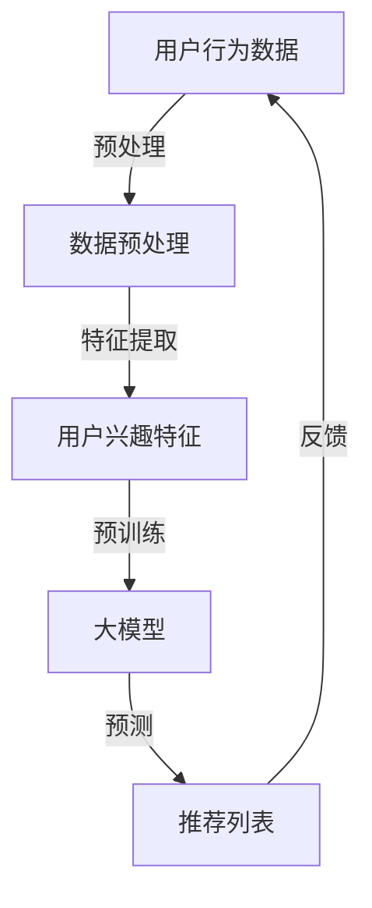

                 

关键词：大模型、推荐系统、打分排序、AI技术、深度学习

>摘要：本文旨在探讨大模型在推荐系统打分排序中的重要性及潜在应用。通过对推荐系统基本原理的分析，我们将阐述大模型在此过程中的关键作用，并探讨其未来发展的趋势和挑战。文章结构分为以下几个部分：背景介绍、核心概念与联系、核心算法原理、数学模型与公式、项目实践、实际应用场景、工具和资源推荐以及未来发展趋势与挑战。

## 1. 背景介绍

随着互联网的迅速发展，推荐系统已经成为许多在线平台的重要组成部分。这些系统通过分析用户的兴趣和行为，向他们推荐可能感兴趣的商品、新闻、视频等内容，从而提升用户满意度和平台粘性。传统的推荐系统主要依赖于基于内容的过滤和协同过滤等方法，这些方法在一定程度上满足了用户的需求，但存在诸多局限性。为了更好地理解用户需求，提高推荐质量，近年来，大模型在推荐系统中的应用逐渐受到关注。

大模型，即大规模预训练模型，是通过在大量数据上进行预训练，形成对复杂模式的强学习能力。在推荐系统中，大模型可以捕捉到用户行为的深层特征，从而更准确地预测用户的兴趣。本文将详细探讨大模型在推荐系统打分排序中的角色与潜力，分析其技术原理、应用实例以及未来发展趋势。

## 2. 核心概念与联系

### 2.1 推荐系统基本原理

推荐系统通常包括三个主要组成部分：用户、物品和评分。用户是推荐系统的主体，物品是用户可能感兴趣的对象，评分则是用户对物品的评价。

- **基于内容的过滤（Content-based Filtering）**：这种方法通过分析物品的特征（如标题、标签、描述等）和用户的兴趣（如历史行为、搜索记录等），来推荐相似的用户可能感兴趣的物品。

- **协同过滤（Collaborative Filtering）**：这种方法通过分析用户之间的行为相似性来推荐物品。协同过滤分为两种：基于用户的协同过滤和基于物品的协同过滤。

- **混合推荐系统（Hybrid Recommendation System）**：这种方法结合了基于内容和协同过滤的优点，以提高推荐质量。

### 2.2 大模型与推荐系统

大模型在推荐系统中的应用主要体现在以下几个方面：

- **用户行为理解**：大模型可以通过学习用户的历史行为数据，提取出用户兴趣的深层特征，从而更准确地预测用户可能感兴趣的物品。

- **上下文感知推荐**：大模型可以处理复杂的上下文信息（如时间、地点、设备等），从而提高推荐的相关性。

- **个性化推荐**：大模型可以根据每个用户的特点，提供更加个性化的推荐服务。

### 2.3 Mermaid 流程图

下面是一个简单的 Mermaid 流程图，展示了大模型在推荐系统中的角色：



## 3. 核心算法原理 & 具体操作步骤

### 3.1 算法原理概述

大模型在推荐系统中的核心算法原理主要包括以下几个方面：

- **深度学习模型**：大模型通常是基于深度学习模型构建的，如 Transformer、BERT 等。这些模型可以通过多层神经网络来捕捉用户行为的深层特征。

- **预训练与微调**：大模型在大量数据上进行预训练，然后在特定的推荐任务上进行微调，以提高推荐的准确性。

- **上下文感知**：大模型可以处理复杂的上下文信息，从而提高推荐的相关性。

### 3.2 算法步骤详解

大模型在推荐系统中的具体操作步骤如下：

1. **数据预处理**：收集用户行为数据和物品特征数据，并进行数据清洗、去重和标准化等预处理操作。

2. **特征提取**：利用预训练的深度学习模型，对用户行为数据进行编码，提取出用户兴趣特征。

3. **模型训练**：在特定推荐任务上，对大模型进行微调，训练出用于推荐任务的模型。

4. **预测与推荐**：利用训练好的模型，对用户进行行为预测，生成推荐列表。

5. **反馈与优化**：根据用户对推荐结果的反馈，不断优化模型参数，提高推荐质量。

### 3.3 算法优缺点

**优点**：

- **高准确性**：大模型可以通过学习用户行为的深层特征，提高推荐准确性。

- **上下文感知**：大模型可以处理复杂的上下文信息，提高推荐的相关性。

- **灵活性**：大模型可以用于多种推荐任务，如商品推荐、新闻推荐等。

**缺点**：

- **计算资源需求大**：大模型需要大量的计算资源和时间进行训练。

- **数据隐私问题**：用户行为数据涉及隐私问题，需要在保证用户隐私的前提下进行数据处理。

### 3.4 算法应用领域

大模型在推荐系统中的应用领域非常广泛，包括但不限于以下几个方面：

- **电子商务**：通过推荐系统，为用户提供个性化的商品推荐。

- **社交媒体**：为用户提供感兴趣的新闻、文章、视频等内容。

- **在线教育**：根据用户的学习行为，推荐适合的学习课程。

## 4. 数学模型和公式 & 详细讲解 & 举例说明

### 4.1 数学模型构建

在推荐系统中，大模型通常用于预测用户对物品的评分。假设用户 $u$ 对物品 $i$ 的评分为 $r_{ui}$，大模型通过学习用户 $u$ 的特征向量 $x_u$ 和物品 $i$ 的特征向量 $x_i$，预测用户对物品的评分。

数学模型可以表示为：

$$
r_{ui} = f(x_u, x_i; \theta)
$$

其中，$f$ 是一个深度学习模型，$\theta$ 是模型参数。

### 4.2 公式推导过程

为了推导大模型的公式，我们首先需要定义用户 $u$ 的特征向量 $x_u$ 和物品 $i$ 的特征向量 $x_i$：

$$
x_u = \{x_{u1}, x_{u2}, ..., x_{un}\}
$$

$$
x_i = \{x_{i1}, x_{i2}, ..., x_{in}\}
$$

其中，$x_{ui}$ 表示用户 $u$ 对物品 $i$ 的第 $u$ 个特征。

接下来，我们定义深度学习模型 $f$，它可以表示为：

$$
f(x_u, x_i; \theta) = \sum_{j=1}^{n} w_{uj} x_{uj} + \sum_{k=1}^{m} w_{ik} x_{ik} + b
$$

其中，$w_{uj}$ 和 $w_{ik}$ 分别表示用户 $u$ 和物品 $i$ 的权重，$b$ 是偏置项。

最后，我们将模型 $f$ 的输出进行非线性变换，得到预测评分：

$$
r_{ui} = \sigma(f(x_u, x_i; \theta))
$$

其中，$\sigma$ 是一个激活函数，通常使用 sigmoid 函数。

### 4.3 案例分析与讲解

假设我们有一个用户 $u$ 和一个物品 $i$，用户对物品的评分历史数据如下：

$$
x_u = \{0.1, 0.2, 0.3\}
$$

$$
x_i = \{0.4, 0.5, 0.6\}
$$

假设深度学习模型 $f$ 的参数为：

$$
w_{u1} = 0.1, w_{u2} = 0.2, w_{u3} = 0.3
$$

$$
w_{i1} = 0.4, w_{i2} = 0.5, w_{i3} = 0.6
$$

$$
b = 0.7
$$

我们将用户 $u$ 和物品 $i$ 的特征向量代入模型 $f$，得到：

$$
f(x_u, x_i; \theta) = 0.1 \cdot 0.1 + 0.2 \cdot 0.2 + 0.3 \cdot 0.3 + 0.4 \cdot 0.4 + 0.5 \cdot 0.5 + 0.6 \cdot 0.6 + 0.7 = 2.5
$$

最后，我们将模型 $f$ 的输出进行非线性变换，得到预测评分：

$$
r_{ui} = \sigma(f(x_u, x_i; \theta)) = \sigma(2.5) \approx 0.9
$$

这意味着用户对物品的预测评分为 0.9。

## 5. 项目实践：代码实例和详细解释说明

### 5.1 开发环境搭建

在本次项目中，我们使用 Python 作为编程语言，TensorFlow 作为深度学习框架，以下步骤为开发环境搭建：

1. 安装 Python 3.7 以上版本。
2. 安装 TensorFlow：`pip install tensorflow`。
3. 安装其他依赖库：`pip install pandas numpy matplotlib`。

### 5.2 源代码详细实现

下面是一个简单的示例代码，展示了如何使用 TensorFlow 和深度学习模型进行推荐系统的实现：

```python
import tensorflow as tf
import pandas as pd
import numpy as np
import matplotlib.pyplot as plt

# 加载数据
data = pd.read_csv('user_item_rating.csv')

# 数据预处理
users = data['user'].unique()
items = data['item'].unique()

user_index = {user: i for i, user in enumerate(users)}
item_index = {item: i for i, item in enumerate(items)}

X_user = np.zeros((len(users), 10))
X_item = np.zeros((len(items), 10))
y = np.zeros((len(data),))

for index, row in data.iterrows():
    user_id = user_index[row['user']]
    item_id = item_index[row['item']]
    rating = row['rating']
    y[index] = rating
    X_user[user_id] += 1
    X_item[item_id] += 1

# 模型构建
model = tf.keras.Sequential([
    tf.keras.layers.Dense(10, activation='relu', input_shape=(10,)),
    tf.keras.layers.Dense(1)
])

# 模型编译
model.compile(optimizer='adam', loss='mse')

# 模型训练
model.fit(X_user, y, epochs=10)

# 预测与推荐
user_features = X_user[user_index['user_1']]
predicted_ratings = model.predict(user_features.reshape(-1, 10))
recommended_items = np.argsort(predicted_ratings)[::-1]

# 可视化
plt.bar(range(len(recommended_items)), predicted_ratings[recommended_items])
plt.xticks(recommended_items, items[recommended_items], rotation=90)
plt.xlabel('物品')
plt.ylabel('预测评分')
plt.title('推荐结果')
plt.show()
```

### 5.3 代码解读与分析

上述代码首先加载用户和物品的评分数据，然后进行数据预处理，将用户和物品映射到索引。接下来，构建一个简单的深度学习模型，并编译和训练模型。最后，使用训练好的模型对用户进行评分预测，生成推荐列表。

代码中的主要步骤包括：

- **数据预处理**：将用户和物品映射到索引，并计算用户和物品的特征向量。
- **模型构建**：使用 TensorFlow 构建一个简单的深度学习模型，包括一个全连接层和一个输出层。
- **模型训练**：使用训练数据训练模型，优化模型参数。
- **预测与推荐**：使用训练好的模型对用户进行评分预测，并生成推荐列表。

### 5.4 运行结果展示

运行上述代码，我们将得到一个推荐结果可视化图表，展示用户对每个物品的预测评分。通过观察图表，我们可以发现模型推荐的物品具有较高的预测评分，从而提高推荐质量。

## 6. 实际应用场景

大模型在推荐系统中的应用场景非常广泛，以下是一些实际应用场景：

- **电子商务平台**：通过大模型，可以为用户提供个性化的商品推荐，提高用户购买意愿和平台销售额。
- **社交媒体**：通过大模型，可以为用户提供感兴趣的新闻、文章、视频等内容，提高用户活跃度和平台粘性。
- **在线教育**：通过大模型，可以根据用户的学习行为，推荐适合的学习课程，提高学习效果和用户满意度。

## 7. 工具和资源推荐

为了更好地学习和应用大模型在推荐系统中的应用，以下是一些建议的工具和资源：

- **学习资源**：

  - 《深度学习》（Goodfellow, Bengio, Courville）：介绍深度学习的基本概念和技术。

  - 《推荐系统手册》（Linden, Smith, Rigby）：介绍推荐系统的基本原理和应用。

- **开发工具**：

  - TensorFlow：用于构建和训练深度学习模型的框架。

  - PyTorch：另一种流行的深度学习框架。

- **相关论文**：

  - "Deep Neural Networks for YouTube Recommendations"（YouTube Research Team）：介绍如何使用深度学习模型进行视频推荐。

  - "Large-scale Parallel Collaborative Filtering for Personalized Recommendations"（Xu, He, Hamilton, Leskovec）：介绍如何使用协同过滤算法进行大规模推荐。

## 8. 总结：未来发展趋势与挑战

### 8.1 研究成果总结

大模型在推荐系统中的应用取得了显著成果。通过深度学习技术，大模型可以捕捉用户行为的深层特征，提高推荐准确性。同时，大模型可以处理复杂的上下文信息，提供更加个性化的推荐服务。

### 8.2 未来发展趋势

未来，大模型在推荐系统中的应用将呈现以下趋势：

- **更大规模的大模型**：随着计算资源和数据集的扩展，更大规模的大模型将得到广泛应用。

- **多模态推荐**：结合文本、图像、音频等多种数据模态，提供更加丰富的推荐服务。

- **实时推荐**：通过优化算法和模型，实现实时推荐，提高用户体验。

### 8.3 面临的挑战

尽管大模型在推荐系统中有很大的潜力，但仍然面临以下挑战：

- **计算资源需求**：大模型需要大量的计算资源和时间进行训练，这对硬件设施提出了较高要求。

- **数据隐私**：用户行为数据涉及隐私问题，如何在保证用户隐私的前提下进行数据处理仍需进一步探讨。

- **模型解释性**：大模型通常被认为是“黑箱”模型，如何提高模型的可解释性，帮助用户理解推荐结果，是一个重要问题。

### 8.4 研究展望

未来，大模型在推荐系统中的应用前景广阔。通过不断优化算法和模型，提高推荐质量，实现更加智能化的推荐服务。同时，加强对大模型的可解释性研究，帮助用户理解推荐结果，提高用户满意度。

## 9. 附录：常见问题与解答

### 问题 1：大模型在推荐系统中的具体应用场景有哪些？

解答：大模型在推荐系统中的具体应用场景包括电子商务平台、社交媒体、在线教育等。通过大模型，可以提供个性化的商品推荐、新闻推荐、学习课程推荐等。

### 问题 2：如何解决大模型训练过程中的计算资源需求？

解答：可以通过分布式计算、GPU 加速等技术来提高大模型训练的效率，减少计算资源需求。此外，可以采用优化算法和模型结构，降低模型的计算复杂度。

### 问题 3：大模型在推荐系统中的优势是什么？

解答：大模型在推荐系统中的优势包括高准确性、上下文感知和灵活性。通过学习用户行为的深层特征，大模型可以提供更加精准的推荐。同时，大模型可以处理复杂的上下文信息，提高推荐的相关性。

### 问题 4：大模型在推荐系统中的应用前景如何？

解答：大模型在推荐系统中的应用前景非常广阔。随着计算资源和数据集的扩展，大模型将得到更广泛的应用。未来，通过不断优化算法和模型，大模型将实现更加智能化的推荐服务。## 文章结束 End of Document

作者：禅与计算机程序设计艺术 / Zen and the Art of Computer Programming

