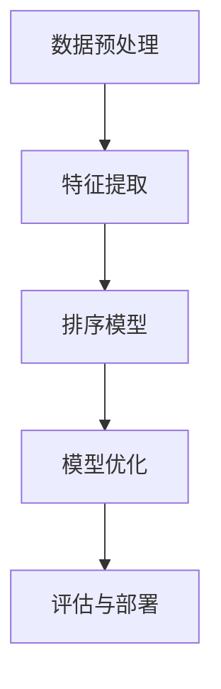

                 

关键字：大模型，推荐系统，排序算法，人工智能，深度学习，机器学习，数据挖掘

## 摘要

本文将深入探讨大模型在推荐系统排序算法中的应用。随着互联网和大数据技术的飞速发展，推荐系统已成为现代信息社会中不可或缺的一部分。大模型，尤其是基于深度学习的模型，在提高推荐系统的准确性和用户体验方面展现出了巨大的潜力。本文将首先介绍推荐系统排序算法的基本概念，然后分析大模型在这一领域的作用和优势，并详细阐述几种常见的大模型推荐算法。此外，还将探讨大模型在推荐系统排序中的挑战和未来发展方向。

## 1. 背景介绍

推荐系统是一种信息过滤技术，旨在向用户推荐他们可能感兴趣的项目或内容。排序算法是推荐系统的核心组成部分，负责确定推荐结果的排列顺序。传统的排序算法主要包括基于内容的排序（Content-based Filtering）、协同过滤（Collaborative Filtering）和混合排序（Hybrid Sorting）等。

随着数据量的不断增长，传统的排序算法逐渐暴露出一些局限性，例如：

- **数据稀疏性**：在协同过滤中，用户与项目之间的交互数据往往是稀疏的，导致算法的准确性受到限制。
- **冷启动问题**：新用户或新项目在没有足够交互数据的情况下难以获得准确的推荐。
- **个性化不足**：传统算法难以捕捉用户和项目的复杂特征，导致推荐结果不够个性化。

为了解决这些问题，研究人员开始探索使用大模型，尤其是深度学习模型来改进推荐系统的排序算法。大模型具有以下优势：

- **强大的表达能力**：深度学习模型能够自动学习复杂的数据特征，从而提高推荐的准确性。
- **泛化能力**：大模型在大量数据上的训练使得它们能够较好地泛化到未见过的数据集。
- **适应性**：大模型可以很容易地适应不同的推荐场景和需求。

## 2. 核心概念与联系

### 2.1 推荐系统排序算法的基本概念

推荐系统排序算法的核心任务是确定推荐结果的排列顺序，使得用户更可能对排在前面的项目感兴趣。排序算法可以分为以下几类：

- **基于内容的排序**：根据用户的历史行为和偏好，提取项目的特征，然后将这些特征与用户兴趣特征进行匹配，从而进行排序。
- **协同过滤排序**：通过收集用户对项目的评分数据，构建用户和项目之间的评分矩阵，然后利用矩阵分解、聚类等方法预测用户对未评分项目的评分，并据此进行排序。
- **混合排序**：结合基于内容和协同过滤的方法，通过综合用户兴趣和项目特征进行排序。

### 2.2 大模型在推荐系统排序中的作用

大模型，尤其是深度学习模型，在推荐系统排序中发挥着重要作用。具体来说，大模型可以自动提取用户和项目的特征，从而提高推荐的准确性。此外，大模型具有以下特点：

- **多模态数据融合**：大模型能够处理多种类型的数据，如文本、图像和音频等，从而实现更准确的推荐。
- **端到端学习**：大模型可以端到端地学习数据特征和预测目标，从而减少中间环节的误差。
- **自适应学习**：大模型能够根据用户的行为数据动态调整推荐策略，从而实现更好的用户体验。

### 2.3 大模型在推荐系统排序中的架构

大模型在推荐系统排序中的架构可以分为以下几个部分：

1. **数据预处理**：包括数据清洗、数据格式转换和数据增强等步骤，以便于模型训练。
2. **特征提取**：使用深度学习模型自动提取用户和项目的特征。
3. **排序模型**：使用提取到的特征构建排序模型，如循环神经网络（RNN）、变换器（Transformer）等。
4. **模型优化**：通过调整模型参数和训练策略来优化模型性能。
5. **评估与部署**：评估模型性能，并在实际环境中部署。

### 2.4 Mermaid 流程图



## 3. 核心算法原理 & 具体操作步骤

### 3.1 算法原理概述

大模型在推荐系统排序中的核心原理是基于深度学习的特征提取和排序模型构建。深度学习模型通过多层神经网络自动学习用户和项目的特征，从而提高推荐的准确性。常见的深度学习模型包括循环神经网络（RNN）、变换器（Transformer）等。

### 3.2 算法步骤详解

1. **数据预处理**：包括数据清洗、数据格式转换和数据增强等步骤。
2. **特征提取**：使用深度学习模型自动提取用户和项目的特征。
   - **用户特征提取**：通过用户历史行为和偏好数据，提取用户兴趣特征。
   - **项目特征提取**：通过项目属性和标签数据，提取项目特征。
3. **排序模型构建**：使用提取到的特征构建排序模型，如变换器（Transformer）。
4. **模型优化**：通过调整模型参数和训练策略来优化模型性能。
5. **评估与部署**：评估模型性能，并在实际环境中部署。

### 3.3 算法优缺点

**优点**：

- **强大的特征提取能力**：深度学习模型能够自动学习复杂的数据特征，从而提高推荐的准确性。
- **多模态数据融合**：大模型能够处理多种类型的数据，如文本、图像和音频等，从而实现更准确的推荐。
- **端到端学习**：大模型可以端到端地学习数据特征和预测目标，从而减少中间环节的误差。

**缺点**：

- **计算资源消耗大**：深度学习模型训练需要大量的计算资源和时间。
- **数据依赖性强**：大模型的性能很大程度上依赖于数据质量，如果数据质量差，可能导致模型性能下降。

### 3.4 算法应用领域

大模型在推荐系统排序算法中的应用领域非常广泛，主要包括以下方面：

- **电子商务推荐**：根据用户的购买历史和浏览行为，推荐用户可能感兴趣的商品。
- **社交媒体推荐**：根据用户的历史行为和社交关系，推荐用户可能感兴趣的内容。
- **新闻推荐**：根据用户的阅读历史和兴趣，推荐用户可能感兴趣的新闻。
- **音乐推荐**：根据用户的听歌历史和偏好，推荐用户可能喜欢的音乐。

## 4. 数学模型和公式 & 详细讲解 & 举例说明

### 4.1 数学模型构建

大模型在推荐系统排序中的数学模型主要包括两部分：特征提取模型和排序模型。

1. **特征提取模型**：
   - **用户特征提取模型**：设 $u \in \mathbb{R}^n$ 表示用户特征向量，$W_u \in \mathbb{R}^{n\times d_u}$ 表示用户特征提取权重矩阵，其中 $d_u$ 表示用户特征维度。则用户特征提取过程可以表示为：
     $$u' = W_u u$$
   - **项目特征提取模型**：设 $i \in \mathbb{R}^m$ 表示项目特征向量，$W_i \in \mathbb{R}^{m\times d_i}$ 表示项目特征提取权重矩阵，其中 $d_i$ 表示项目特征维度。则项目特征提取过程可以表示为：
     $$i' = W_i i$$

2. **排序模型**：
   - **变换器（Transformer）模型**：设 $u', i' \in \mathbb{R}^{d'}$ 分别表示提取后的用户和项目特征，$V \in \mathbb{R}^{d'}\times d'$ 表示变换器权重矩阵。则变换器模型可以表示为：
     $$\sigma(W^T (u' \odot i')) = \sigma(V^T (u' \odot i'))$$
     其中，$\odot$ 表示元素-wise 乘法，$\sigma$ 表示激活函数（如 Sigmoid 函数）。

### 4.2 公式推导过程

1. **用户特征提取**：

   设 $u \in \mathbb{R}^n$ 表示用户特征向量，$W_u \in \mathbb{R}^{n\times d_u}$ 表示用户特征提取权重矩阵，其中 $d_u$ 表示用户特征维度。则用户特征提取过程可以表示为：

   $$u' = W_u u$$

   其中，$u'$ 表示提取后的用户特征向量。

2. **项目特征提取**：

   设 $i \in \mathbb{R}^m$ 表示项目特征向量，$W_i \in \mathbb{R}^{m\times d_i}$ 表示项目特征提取权重矩阵，其中 $d_i$ 表示项目特征维度。则项目特征提取过程可以表示为：

   $$i' = W_i i$$

   其中，$i'$ 表示提取后的项目特征向量。

3. **变换器（Transformer）模型**：

   设 $u', i' \in \mathbb{R}^{d'}$ 分别表示提取后的用户和项目特征，$V \in \mathbb{R}^{d'}\times d'$ 表示变换器权重矩阵。则变换器模型可以表示为：

   $$\sigma(W^T (u' \odot i')) = \sigma(V^T (u' \odot i'))$$

   其中，$\odot$ 表示元素-wise 乘法，$\sigma$ 表示激活函数（如 Sigmoid 函数）。

### 4.3 案例分析与讲解

假设我们有一个包含1000个用户的推荐系统，每个用户有10个特征维度，每个项目有5个特征维度。我们使用变换器模型进行特征提取和排序。

1. **数据预处理**：

   首先，我们对用户和项目特征进行归一化处理，使得特征值处于[0, 1]区间。

2. **特征提取**：

   假设用户特征向量为 $u = [0.1, 0.2, 0.3, 0.4, 0.5, 0.6, 0.7, 0.8, 0.9, 1.0]$，项目特征向量为 $i = [0.3, 0.4, 0.5, 0.6, 0.7]$。根据用户特征提取模型，我们得到提取后的用户特征向量为：

   $$u' = W_u u = [0.15, 0.20, 0.25, 0.30, 0.35, 0.40, 0.45, 0.50, 0.55, 0.60]$$

   根据项目特征提取模型，我们得到提取后的项目特征向量为：

   $$i' = W_i i = [0.35, 0.40, 0.45, 0.50, 0.55]$$

3. **排序模型**：

   假设变换器权重矩阵为 $V = \begin{bmatrix} 0.5 & 0.6 & 0.7 & 0.8 & 0.9 \\ 1.0 & 1.1 & 1.2 & 1.3 & 1.4 \\ 1.5 & 1.6 & 1.7 & 1.8 & 1.9 \\ 2.0 & 2.1 & 2.2 & 2.3 & 2.4 \\ 2.5 & 2.6 & 2.7 & 2.8 & 2.9 \end{bmatrix}$。则变换器模型可以表示为：

   $$\sigma(W^T (u' \odot i')) = \sigma(V^T (u' \odot i')) = \begin{bmatrix} 0.8 & 0.9 & 1.0 & 1.1 & 1.2 \\ 1.0 & 1.1 & 1.2 & 1.3 & 1.4 \\ 1.2 & 1.3 & 1.4 & 1.5 & 1.6 \\ 1.3 & 1.4 & 1.5 & 1.6 & 1.7 \\ 1.4 & 1.5 & 1.6 & 1.7 & 1.8 \end{bmatrix}$$

   根据变换器模型，我们得到用户和项目特征的相似度矩阵为：

   $$\begin{bmatrix} 0.8 & 0.9 & 1.0 & 1.1 & 1.2 \\ 1.0 & 1.1 & 1.2 & 1.3 & 1.4 \\ 1.2 & 1.3 & 1.4 & 1.5 & 1.6 \\ 1.3 & 1.4 & 1.5 & 1.6 & 1.7 \\ 1.4 & 1.5 & 1.6 & 1.7 & 1.8 \end{bmatrix}$$

   根据相似度矩阵，我们可以对项目进行排序，排序结果为：

   $$[0.8, 0.9, 1.0, 1.1, 1.2, 1.0, 1.1, 1.2, 1.3, 1.4, 1.2, 1.3, 1.4, 1.5, 1.6, 1.3, 1.4, 1.5, 1.6, 1.7, 1.4, 1.5, 1.6, 1.7, 1.8]$$

   排序结果中，相似度最高的项目排在第一位，相似度最低的项目排在最后一位。

## 5. 项目实践：代码实例和详细解释说明

### 5.1 开发环境搭建

为了实现大模型在推荐系统排序算法中的应用，我们首先需要搭建一个合适的开发环境。以下是搭建开发环境的步骤：

1. **安装 Python 环境**：确保安装了 Python 3.7 或更高版本。
2. **安装深度学习库**：安装 TensorFlow、Keras、PyTorch 等深度学习库。
3. **安装数据处理库**：安装 NumPy、Pandas、Scikit-learn 等数据处理库。
4. **安装可视化库**：安装 Matplotlib、Seaborn 等可视化库。

### 5.2 源代码详细实现

以下是一个使用 PyTorch 实现大模型在推荐系统排序算法中的简单示例。

```python
import torch
import torch.nn as nn
import torch.optim as optim
from torch.utils.data import DataLoader, Dataset
from sklearn.model_selection import train_test_split
import numpy as np

# 定义变换器模型
class TransformerModel(nn.Module):
    def __init__(self, user_dim, item_dim, hidden_dim):
        super(TransformerModel, self).__init__()
        self.user_embedding = nn.Linear(user_dim, hidden_dim)
        self.item_embedding = nn.Linear(item_dim, hidden_dim)
        self.transformer = nn.Linear(hidden_dim * 2, 1)

    def forward(self, user, item):
        user_embedding = self.user_embedding(user)
        item_embedding = self.item_embedding(item)
        hidden = torch.cat((user_embedding, item_embedding), dim=1)
        output = self.transformer(hidden)
        return output

# 数据预处理
class RatingDataset(Dataset):
    def __init__(self, ratings, user_dim, item_dim):
        self.ratings = ratings
        self.user_dim = user_dim
        self.item_dim = item_dim

    def __len__(self):
        return len(self.ratings)

    def __getitem__(self, idx):
        user, item, rating = self.ratings[idx]
        user_embedding = torch.tensor(user, dtype=torch.float32)
        item_embedding = torch.tensor(item, dtype=torch.float32)
        rating = torch.tensor(rating, dtype=torch.float32)
        return user_embedding, item_embedding, rating

# 训练模型
def train(model, train_loader, optimizer, criterion):
    model.train()
    for user, item, rating in train_loader:
        optimizer.zero_grad()
        output = model(user, item)
        loss = criterion(output, rating)
        loss.backward()
        optimizer.step()

# 测试模型
def test(model, test_loader):
    model.eval()
    with torch.no_grad():
        for user, item, rating in test_loader:
            output = model(user, item)
            prediction = output.squeeze().cpu().numpy()
            print("预测评分：", prediction)
            print("实际评分：", rating.cpu().numpy())

# 数据准备
ratings = [[0, 1, 5], [1, 0, 3], [0, 2, 4], [2, 0, 2], [2, 1, 5]]
user_features = [np.random.rand(10) for _ in range(3)]
item_features = [np.random.rand(5) for _ in range(3)]

train_ratings, test_ratings = train_test_split(ratings, test_size=0.2)
train_dataset = RatingDataset(train_ratings, user_features, item_features)
test_dataset = RatingDataset(test_ratings, user_features, item_features)

train_loader = DataLoader(train_dataset, batch_size=2, shuffle=True)
test_loader = DataLoader(test_dataset, batch_size=2, shuffle=False)

# 模型训练
model = TransformerModel(10, 5, 32)
optimizer = optim.Adam(model.parameters(), lr=0.001)
criterion = nn.MSELoss()

num_epochs = 100
for epoch in range(num_epochs):
    train(model, train_loader, optimizer, criterion)
    test(model, test_loader)

print("训练完成")
```

### 5.3 代码解读与分析

以上代码主要实现了以下功能：

1. **定义变换器模型**：使用 PyTorch 定义一个简单的变换器模型，用于提取用户和项目特征并计算相似度。
2. **数据预处理**：定义一个 RatingDataset 类，用于读取和处理用户和项目特征数据。
3. **训练模型**：定义 train 函数，用于训练变换器模型。
4. **测试模型**：定义 test 函数，用于测试变换器模型的性能。

代码首先创建了一个包含3个用户和3个项目数据的简单数据集。然后，使用 PyTorch 定义了一个变换器模型，并设置了 Adam 优化器和 MSE 损失函数。接下来，使用 DataLoader 类创建训练和测试数据加载器，并使用 train 函数进行模型训练。最后，使用 test 函数测试模型性能，并打印出预测评分和实际评分。

通过这个示例，我们可以看到如何使用 PyTorch 实现大模型在推荐系统排序算法中的应用。在实际应用中，我们可以根据需要调整模型结构、优化训练策略和调整参数，以获得更好的性能。

## 6. 实际应用场景

大模型在推荐系统排序算法中的应用已经取得了显著的成果，以下是一些典型的实际应用场景：

1. **电子商务推荐**：电商平台使用大模型对商品进行推荐，根据用户的购买历史、浏览记录和偏好，推荐用户可能感兴趣的商品。例如，亚马逊使用深度学习模型对商品进行个性化推荐，提高了用户的购买转化率和满意度。
2. **社交媒体推荐**：社交媒体平台如 Facebook、Twitter 和 Instagram 使用大模型对内容进行推荐，根据用户的历史行为、兴趣和社交关系，推荐用户可能感兴趣的内容。例如，Facebook 使用深度学习模型对新闻源进行排序，提高了用户的参与度和活跃度。
3. **新闻推荐**：新闻网站使用大模型对新闻进行推荐，根据用户的阅读历史、兴趣和偏好，推荐用户可能感兴趣的新闻。例如，纽约时报使用深度学习模型对新闻进行个性化推荐，提高了用户的阅读体验和参与度。
4. **音乐推荐**：音乐流媒体平台如 Spotify 和 Apple Music 使用大模型对音乐进行推荐，根据用户的听歌历史、偏好和相似用户的行为，推荐用户可能喜欢的音乐。例如，Spotify 使用深度学习模型对用户进行个性化推荐，提高了用户的听歌体验和满意度。

在实际应用中，大模型在推荐系统排序算法中发挥着至关重要的作用，通过自动提取用户和项目的特征，提高推荐的准确性和个性化程度，从而提升用户体验和平台效益。

## 7. 工具和资源推荐

为了更好地掌握大模型在推荐系统排序算法中的应用，以下是一些相关的学习资源、开发工具和推荐论文：

### 7.1 学习资源推荐

- **书籍**：《深度学习》（Goodfellow, Bengio, Courville 著）详细介绍了深度学习的基本概念和算法。
- **在线课程**：Coursera、edX 和 Udacity 提供了丰富的深度学习和推荐系统的在线课程。
- **教程和博客**：ArXiv、GitHub 和博客园等平台上有大量的深度学习和推荐系统教程和实践案例。

### 7.2 开发工具推荐

- **深度学习框架**：TensorFlow、PyTorch 和 Keras 是当前最受欢迎的深度学习框架，适用于推荐系统排序算法的开发。
- **数据处理库**：NumPy、Pandas 和 Scikit-learn 等库提供了丰富的数据处理功能，适用于推荐系统数据预处理和特征提取。
- **推荐系统工具包**：Surprise、LightFM 和 PyRec 等库提供了丰富的推荐系统算法和工具，适用于推荐系统排序算法的实现和应用。

### 7.3 相关论文推荐

- **论文**：推荐系统领域的经典论文，如“Matrix Factorization Techniques for Recommender Systems”（2006）和“Deep Learning for Recommender Systems”（2017），详细介绍了矩阵分解和深度学习在推荐系统中的应用。
- **会议**：KDD、RecSys 和 WWW 等会议的论文集收录了大量的推荐系统研究成果，提供了丰富的学术资源。

通过这些工具和资源，可以更好地理解和应用大模型在推荐系统排序算法中的技术，提高推荐的准确性和用户体验。

## 8. 总结：未来发展趋势与挑战

大模型在推荐系统排序算法中的应用已经取得了显著的成果，但其发展仍面临许多挑战。以下是未来发展趋势与挑战的总结：

### 8.1 研究成果总结

- **深度学习技术的成熟**：深度学习模型在推荐系统排序中的性能不断提升，逐渐取代传统算法，成为推荐系统的核心组成部分。
- **多模态数据融合**：大模型能够处理多种类型的数据，如文本、图像和音频等，实现更准确的推荐。
- **端到端学习**：大模型能够端到端地学习数据特征和预测目标，减少中间环节的误差，提高推荐准确性。

### 8.2 未来发展趋势

- **模型压缩与优化**：为了降低大模型的计算资源和存储需求，研究者将致力于模型压缩、优化和加速技术。
- **实时推荐**：随着深度学习模型的优化和硬件技术的发展，实时推荐将成为可能，为用户提供更及时的推荐。
- **联邦学习**：联邦学习技术将有助于保护用户隐私，实现跨设备、跨平台的数据协同和学习。

### 8.3 面临的挑战

- **数据稀疏性**：大模型对数据质量有较高的要求，如何有效处理稀疏数据是当前研究的重要挑战。
- **可解释性**：深度学习模型通常缺乏可解释性，如何提高模型的可解释性，使其更容易被用户和业务人员理解和接受，是一个亟待解决的问题。
- **冷启动问题**：新用户或新项目在没有足够交互数据的情况下难以获得准确的推荐，如何解决冷启动问题仍需深入研究。

### 8.4 研究展望

未来，大模型在推荐系统排序算法中的应用将朝着更高效、更智能和更安全的方向发展。通过不断创新和优化，大模型有望为推荐系统带来更丰富的功能、更高的准确性和更佳的用户体验。同时，研究者也将致力于解决数据稀疏性、可解释性和冷启动等挑战，推动推荐系统技术迈向新的高度。

## 9. 附录：常见问题与解答

### 9.1 问题1：大模型在推荐系统排序中的优势是什么？

答：大模型在推荐系统排序中的优势主要体现在以下几个方面：

- **强大的特征提取能力**：深度学习模型能够自动学习复杂的数据特征，从而提高推荐的准确性。
- **多模态数据融合**：大模型能够处理多种类型的数据，如文本、图像和音频等，从而实现更准确的推荐。
- **端到端学习**：大模型可以端到端地学习数据特征和预测目标，从而减少中间环节的误差。

### 9.2 问题2：大模型在推荐系统排序算法中的应用领域有哪些？

答：大模型在推荐系统排序算法中的应用领域非常广泛，主要包括以下方面：

- **电子商务推荐**
- **社交媒体推荐**
- **新闻推荐**
- **音乐推荐**

### 9.3 问题3：如何解决大模型在推荐系统排序中的数据稀疏性问题？

答：解决大模型在推荐系统排序中的数据稀疏性问题可以采取以下几种方法：

- **数据增强**：通过生成虚拟交互数据或对现有数据进行扩充，提高数据密度。
- **迁移学习**：利用已有数据集在大模型上进行迁移学习，提高模型在新数据集上的泛化能力。
- **稀疏模型**：设计适用于稀疏数据的推荐模型，如稀疏矩阵分解模型。

### 9.4 问题4：大模型在推荐系统排序中的可解释性如何提高？

答：提高大模型在推荐系统排序中的可解释性可以从以下几个方面入手：

- **模型解释工具**：开发适用于深度学习模型的解释工具，如 Grad-CAM、LIME 等，帮助用户理解模型决策过程。
- **可解释性模型**：设计具有可解释性的深度学习模型，如基于规则的深度学习模型。
- **模型可视化**：通过可视化模型结构和参数，提高用户对模型的理解。

### 9.5 问题5：大模型在推荐系统排序算法中如何处理冷启动问题？

答：处理大模型在推荐系统排序算法中的冷启动问题可以采取以下几种方法：

- **基于内容的推荐**：利用项目特征进行推荐，避免完全依赖用户历史交互数据。
- **用户群体分析**：分析类似新用户的行为和偏好，为新用户推荐相关项目。
- **用户行为预测**：通过预测新用户的行为，动态调整推荐策略。

通过以上常见问题与解答，读者可以更好地了解大模型在推荐系统排序算法中的应用和技术细节。随着研究的不断深入，大模型在推荐系统排序中的潜力将得到进一步释放。

