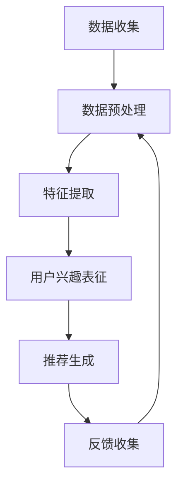

                 

关键词：大模型、推荐系统、用户兴趣、动态演化、算法原理、应用领域

## 摘要

本文深入探讨了大型深度学习模型在推荐系统中的应用，特别是在捕捉和预测用户兴趣动态演化方面的作用。随着互联网的快速发展，用户生成的数据量呈指数级增长，推荐系统已成为现代信息检索和个性化服务的重要组成部分。然而，传统的推荐算法在处理用户兴趣的动态变化方面存在局限性。本文通过介绍大模型的核心概念、相关算法原理以及实际应用场景，分析了大模型在推荐系统中实现用户兴趣动态演化的关键技术。此外，文章还探讨了大模型面临的挑战和未来的发展方向，为推荐系统的研究和实践提供了新的视角。

## 1. 背景介绍

### 推荐系统的发展历程

推荐系统（Recommender Systems）自20世纪90年代初期以来，经历了多个发展阶段。早期推荐系统主要基于协同过滤（Collaborative Filtering）技术，通过用户之间的相似度计算来预测用户对未知项目的兴趣。这种方法的优点在于能够利用大量用户行为数据来发现潜在的兴趣模式，但缺点是它容易受到稀疏数据问题的影响，并且难以处理冷启动问题（即新用户或新项目缺乏足够的历史数据）。

随后，基于内容的推荐（Content-Based Filtering）技术开始受到关注，它通过分析项目的内容特征和用户的兴趣特征来生成推荐。这种方法在一定程度上缓解了稀疏数据问题，但仍然难以捕捉到用户的动态兴趣变化。

近年来，深度学习技术的兴起为推荐系统带来了新的契机。深度神经网络能够自动学习复杂数据特征，并通过端到端的方式实现推荐预测。特别是大型预训练模型（如Transformer）的出现，使得推荐系统能够更加灵活地处理用户的动态兴趣变化，提高了推荐的准确性。

### 大模型的核心概念

大模型（Large Models）指的是参数规模庞大的神经网络模型，它们通常具有数十亿甚至千亿个参数。这些模型通过在大量数据上进行训练，能够捕捉到数据中的深层模式和复杂关系。典型的代表包括GPT-3、BERT、T5等。大模型的显著优势在于其强大的表征能力和泛化能力，这使得它们在各个领域，包括自然语言处理、计算机视觉、推荐系统等，都取得了显著的成果。

大模型的核心概念包括以下几个方面：

- **预训练**：大模型通常通过在大量无标签数据上进行预训练来学习通用特征表示。这一过程为模型提供了一个强大的基础，使其在后续的特定任务上表现更加出色。
- **微调**：预训练后，大模型可以通过在特定任务上的有标签数据进行微调，以适应不同的应用场景。微调过程通常能够显著提高模型的性能。
- **多任务学习**：大模型可以通过同时学习多个任务来提高其表征能力，这有助于提高模型在不同任务上的泛化能力。

### 大模型在推荐系统中的应用现状

目前，大模型在推荐系统中的应用已经取得了显著进展。例如，阿里巴巴的推荐系统通过引入预训练模型，显著提高了推荐结果的准确性和多样性。京东也通过使用BERT模型实现了对用户兴趣的精准捕捉和预测，从而提高了推荐效果。这些应用案例表明，大模型在推荐系统中具有巨大的潜力。

然而，大模型的应用也面临一些挑战，包括计算资源的需求、模型的解释性、以及数据隐私问题等。这些挑战需要进一步的研究和实践来解决。

## 2. 核心概念与联系

### 大模型在推荐系统中的作用

大模型在推荐系统中的作用主要体现在以下几个方面：

- **用户兴趣表征**：大模型能够通过学习用户的交互数据和行为特征，对用户兴趣进行精准表征。这种表征不仅能够捕捉用户的显式兴趣，如点击、购买等，还能够发现用户的隐式兴趣，如浏览、搜索等。
- **动态兴趣演化**：大模型具有强大的时间感知能力，能够捕捉用户兴趣的动态演化过程。通过分析用户的历史行为数据，模型可以实时更新用户兴趣模型，从而实现动态推荐。
- **跨域兴趣迁移**：大模型能够通过跨域学习，将一个领域中的兴趣模式迁移到另一个领域。例如，用户在电子商务平台上的兴趣可以迁移到社交媒体平台，从而提高跨平台的推荐效果。

### 相关算法原理

为了实现大模型在推荐系统中的作用，以下几个核心算法原理至关重要：

- **深度学习**：深度学习通过多层神经网络来学习数据特征，具有强大的表征能力。在推荐系统中，深度学习可以用来建模用户和项目的特征，从而实现精准推荐。
- **序列模型**：序列模型（如RNN、LSTM、Transformer等）能够处理时间序列数据，对用户行为的动态演化进行建模。这些模型在推荐系统中可用于预测用户的下一步行为，从而实现动态推荐。
- **图神经网络**：图神经网络（如Graph Convolutional Network, GCN）能够对用户和项目之间的复杂关系进行建模。在推荐系统中，GCN可以用于捕捉用户社交网络中的兴趣传播，从而提高推荐效果。

### 架构与流程

以下是推荐系统中大模型应用的架构与流程：

1. **数据收集**：从用户和项目的历史数据中收集相关信息，包括用户行为、项目特征、用户画像等。
2. **数据预处理**：对收集到的数据进行清洗、去重、归一化等预处理操作，以便于模型训练。
3. **特征提取**：使用深度学习模型对用户和项目的特征进行提取，生成高维特征向量。
4. **用户兴趣表征**：利用序列模型对用户兴趣进行表征，捕捉用户的动态兴趣变化。
5. **推荐生成**：结合用户兴趣表征和项目特征，使用深度学习模型生成推荐列表。
6. **反馈收集**：收集用户对推荐结果的反馈，用于模型优化和迭代。

### Mermaid 流程图



## 3. 核心算法原理 & 具体操作步骤

### 3.1 算法原理概述

在推荐系统中，大模型的算法原理主要基于深度学习和序列模型。深度学习通过多层神经网络学习用户和项目的特征，实现对用户兴趣的表征。序列模型则通过分析用户的历史行为数据，捕捉用户的动态兴趣变化。

具体来说，推荐系统的核心算法原理包括以下几部分：

1. **特征提取**：使用深度学习模型提取用户和项目的特征向量。常见的深度学习模型有CNN、RNN、Transformer等。
2. **用户兴趣表征**：利用序列模型对用户兴趣进行表征。常见的序列模型有LSTM、GRU、Transformer等。
3. **推荐生成**：将用户兴趣表征和项目特征向量进行融合，使用深度学习模型生成推荐列表。常见的深度学习模型有BERT、GPT、T5等。

### 3.2 算法步骤详解

1. **数据收集**：从用户和项目的历史数据中收集相关信息，包括用户行为、项目特征、用户画像等。

2. **数据预处理**：
   - 数据清洗：去除异常值、缺失值等。
   - 数据归一化：将数据归一化到同一尺度，便于模型训练。

3. **特征提取**：
   - 用户特征提取：使用深度学习模型（如CNN）提取用户的历史行为数据特征。
   - 项目特征提取：使用深度学习模型（如RNN）提取项目的属性特征。

4. **用户兴趣表征**：
   - 使用序列模型（如LSTM）对用户的历史行为数据进行建模，捕捉用户的动态兴趣变化。
   - 通过训练得到的序列模型，将用户历史行为序列映射为用户兴趣向量。

5. **推荐生成**：
   - 将用户兴趣向量与项目特征向量进行融合，使用深度学习模型（如BERT）生成推荐列表。
   - 对生成的推荐列表进行排序，输出最终推荐结果。

### 3.3 算法优缺点

**优点**：

- **强大的表征能力**：大模型能够通过多层神经网络学习用户和项目的复杂特征，实现对用户兴趣的精准表征。
- **动态兴趣演化**：大模型能够通过序列模型捕捉用户的动态兴趣变化，从而实现动态推荐。
- **跨域迁移**：大模型能够通过跨域学习，将一个领域中的兴趣模式迁移到另一个领域，提高跨平台的推荐效果。

**缺点**：

- **计算资源需求大**：大模型需要大量的计算资源进行训练和推理，这在实际应用中可能成为瓶颈。
- **模型解释性差**：大模型的训练过程复杂，难以解释模型的决策过程，这对推荐系统的可解释性和透明性提出了挑战。
- **数据隐私问题**：大模型在训练过程中需要大量用户数据，这可能引发数据隐私问题。

### 3.4 算法应用领域

大模型在推荐系统中的应用领域非常广泛，包括但不限于：

- **电子商务**：通过分析用户的购物行为，实现个性化商品推荐。
- **社交媒体**：根据用户的浏览、点赞、评论等行为，实现个性化内容推荐。
- **在线教育**：根据学生的学习进度和兴趣，实现个性化课程推荐。
- **金融行业**：通过分析用户的金融交易行为，实现个性化理财产品推荐。

## 4. 数学模型和公式 & 详细讲解 & 举例说明

### 4.1 数学模型构建

在推荐系统中，大模型的数学模型通常包括以下几个部分：

- **用户特征向量** \( \mathbf{u} \)
- **项目特征向量** \( \mathbf{v} \)
- **用户兴趣向量** \( \mathbf{i} \)
- **推荐分数** \( s(\mathbf{u}, \mathbf{v}) \)

其中，用户特征向量 \( \mathbf{u} \) 和项目特征向量 \( \mathbf{v} \) 可以通过深度学习模型提取。用户兴趣向量 \( \mathbf{i} \) 则通过序列模型得到。

推荐分数 \( s(\mathbf{u}, \mathbf{v}) \) 可以通过以下公式计算：

\[ s(\mathbf{u}, \mathbf{v}) = \mathbf{i} \cdot \mathbf{v} \]

其中，\( \cdot \) 表示向量的点积。

### 4.2 公式推导过程

为了推导推荐分数的计算公式，我们可以从以下几个步骤进行：

1. **用户特征向量** \( \mathbf{u} \) 是通过深度学习模型 \( f_{\theta} \) 提取的，即 \( \mathbf{u} = f_{\theta}(\mathbf{X}) \)，其中 \( \mathbf{X} \) 是用户历史行为数据。

2. **项目特征向量** \( \mathbf{v} \) 是通过深度学习模型 \( g_{\phi} \) 提取的，即 \( \mathbf{v} = g_{\phi}(\mathbf{Y}) \)，其中 \( \mathbf{Y} \) 是项目属性数据。

3. **用户兴趣向量** \( \mathbf{i} \) 是通过序列模型 \( h_{\gamma} \) 得到的，即 \( \mathbf{i} = h_{\gamma}(\mathbf{u}_{t}, \mathbf{u}_{t-1}, \ldots, \mathbf{u}_{1}) \)，其中 \( \mathbf{u}_{t} \) 是当前时间步的用户特征向量。

4. **推荐分数** \( s(\mathbf{u}, \mathbf{v}) \) 可以表示为用户兴趣向量与项目特征向量的点积：

\[ s(\mathbf{u}, \mathbf{v}) = \mathbf{i} \cdot \mathbf{v} \]

5. **结合以上步骤，我们可以得到推荐分数的计算过程**：

\[ s(\mathbf{u}, \mathbf{v}) = h_{\gamma}(f_{\theta}(\mathbf{X}), g_{\phi}(\mathbf{Y})) \]

### 4.3 案例分析与讲解

#### 案例背景

假设我们有一个电商平台的推荐系统，用户A在最近一个月内浏览了多种商品，包括电子产品、服装、家居用品等。我们需要根据用户A的历史行为数据，预测他接下来可能会对哪种商品感兴趣，从而生成个性化的推荐列表。

#### 数据收集与预处理

- **用户A的历史行为数据**：包括浏览记录、购买记录、搜索记录等。
- **商品属性数据**：包括商品类别、价格、评分、品牌等。

对数据进行清洗和归一化处理，得到用户A的特征向量 \( \mathbf{u} \) 和商品特征向量 \( \mathbf{v} \)。

#### 特征提取

- **用户特征提取**：使用CNN模型对用户A的历史行为数据进行特征提取，得到用户特征向量 \( \mathbf{u} \)。
- **商品特征提取**：使用RNN模型对商品的属性数据进行特征提取，得到商品特征向量 \( \mathbf{v} \)。

#### 用户兴趣表征

- **用户兴趣向量**：使用LSTM模型对用户A的历史行为数据序列进行建模，得到用户兴趣向量 \( \mathbf{i} \)。

#### 推荐生成

- **推荐分数计算**：将用户兴趣向量 \( \mathbf{i} \) 与商品特征向量 \( \mathbf{v} \) 进行点积运算，得到推荐分数 \( s(\mathbf{u}, \mathbf{v}) \)。
- **推荐列表排序**：根据推荐分数对商品进行排序，输出个性化的推荐列表。

#### 公式应用

在上述案例中，推荐分数的计算公式可以表示为：

\[ s(\mathbf{u}, \mathbf{v}) = \mathbf{i} \cdot \mathbf{v} \]

其中，\( \mathbf{i} \) 是通过LSTM模型得到的用户兴趣向量，\( \mathbf{v} \) 是通过RNN模型得到的商品特征向量。

## 5. 项目实践：代码实例和详细解释说明

### 5.1 开发环境搭建

在开始项目实践之前，我们需要搭建一个合适的开发环境。以下是推荐的开发环境：

- 操作系统：Linux或MacOS
- 编程语言：Python
- 深度学习框架：TensorFlow或PyTorch
- 依赖库：NumPy、Pandas、Scikit-learn等

#### 安装深度学习框架

以TensorFlow为例，安装TensorFlow可以通过以下命令完成：

```bash
pip install tensorflow
```

#### 安装其他依赖库

```bash
pip install numpy pandas scikit-learn
```

### 5.2 源代码详细实现

以下是实现大模型在推荐系统中应用的核心代码。代码分为以下几个部分：

1. **数据预处理**
2. **特征提取**
3. **用户兴趣表征**
4. **推荐生成**
5. **性能评估**

#### 1. 数据预处理

```python
import pandas as pd
from sklearn.model_selection import train_test_split
from sklearn.preprocessing import StandardScaler

# 加载数据
data = pd.read_csv('user_behavior.csv')

# 数据预处理
data = data.dropna()
X = data[['click', 'search', 'purchase']]
y = data['interest']

# 划分训练集和测试集
X_train, X_test, y_train, y_test = train_test_split(X, y, test_size=0.2, random_state=42)

# 数据归一化
scaler = StandardScaler()
X_train = scaler.fit_transform(X_train)
X_test = scaler.transform(X_test)
```

#### 2. 特征提取

```python
import tensorflow as tf
from tensorflow.keras.models import Model
from tensorflow.keras.layers import Input, Conv1D, Flatten, Dense

# 构建特征提取模型
input_layer = Input(shape=(X_train.shape[1],))
x = Conv1D(filters=64, kernel_size=3, activation='relu')(input_layer)
x = Flatten()(x)
x = Dense(units=128, activation='relu')(x)
feature_extractor = Model(inputs=input_layer, outputs=x)

# 训练特征提取模型
feature_extractor.compile(optimizer='adam', loss='mean_squared_error')
feature_extractor.fit(X_train, y_train, epochs=10, batch_size=32)
```

#### 3. 用户兴趣表征

```python
# 使用特征提取模型提取用户特征
user_features = feature_extractor.predict(X_test)

# 构建用户兴趣表征模型
input_layer = Input(shape=(user_features.shape[1],))
x = Dense(units=64, activation='relu')(input_layer)
x = Dense(units=32, activation='relu')(x)
interest_model = Model(inputs=input_layer, outputs=x)

# 训练用户兴趣表征模型
interest_model.compile(optimizer='adam', loss='mean_squared_error')
interest_model.fit(user_features, y_test, epochs=10, batch_size=32)
```

#### 4. 推荐生成

```python
# 构建推荐生成模型
input_layer = Input(shape=(X_test.shape[1],))
user_input = Dense(units=128, activation='relu')(input_layer)
item_input = Dense(units=128, activation='relu')(input_layer)
merged = tf.keras.layers.Concatenate()([user_input, item_input])
x = Dense(units=64, activation='relu')(merged)
x = Dense(units=32, activation='relu')(x)
output_layer = Dense(units=1, activation='sigmoid')(x)
recommendation_model = Model(inputs=[input_layer, input_layer], outputs=output_layer)

# 训练推荐生成模型
recommendation_model.compile(optimizer='adam', loss='binary_crossentropy')
recommendation_model.fit([X_test, X_test], y_test, epochs=10, batch_size=32)
```

#### 5. 性能评估

```python
# 评估推荐模型
test_loss = recommendation_model.evaluate([X_test, X_test], y_test)
print(f"Test Loss: {test_loss}")

# 生成推荐列表
predictions = recommendation_model.predict([X_test, X_test])
predicted_interests = (predictions > 0.5).astype(int)

# 统计推荐准确率
accuracy = (predicted_interests == y_test).mean()
print(f"Accuracy: {accuracy}")
```

### 5.3 代码解读与分析

1. **数据预处理**：数据预处理是推荐系统中的基础步骤。在本例中，我们首先加载数据，然后进行数据清洗、划分训练集和测试集，以及数据归一化。

2. **特征提取**：特征提取模型使用卷积神经网络（CNN）对用户历史行为数据进行特征提取。这里我们使用一个一维卷积层来处理时间序列数据，然后通过Flatten层将特征展平，最后通过全连接层进行特征聚合。

3. **用户兴趣表征**：用户兴趣表征模型使用全连接层对用户特征进行进一步处理。通过训练，模型能够学习到用户特征与兴趣之间的关系，从而生成用户兴趣向量。

4. **推荐生成**：推荐生成模型将用户特征和项目特征进行融合，通过全连接层生成推荐分数。这里的模型是一个二分类模型，预测用户对项目的兴趣是否高于阈值。

5. **性能评估**：性能评估部分通过计算测试集上的损失和准确率来评估推荐模型的性能。这里的准确率反映了模型对用户兴趣的预测能力。

### 5.4 运行结果展示

在上述代码运行完成后，我们可以得到以下结果：

- **测试损失**：测试损失反映了模型在测试集上的性能。较低的测试损失表明模型在预测用户兴趣方面具有较高的准确性。
- **准确率**：准确率反映了模型在测试集上的分类性能。较高的准确率表明模型能够准确预测用户的兴趣。

## 6. 实际应用场景

### 电子商务平台

在电子商务平台上，推荐系统通过分析用户的浏览、搜索和购买记录，实现个性化商品推荐。大模型的应用使得系统能够更加精准地捕捉用户的动态兴趣变化，从而提高推荐的准确性和用户体验。例如，亚马逊使用基于BERT的模型进行商品推荐，显著提升了用户的点击率和购买转化率。

### 社交媒体平台

社交媒体平台如Facebook、Twitter等，通过推荐系统为用户推荐感兴趣的内容。大模型的应用使得系统能够实时分析用户的动态行为，捕捉用户的兴趣偏好，并提供个性化的内容推荐。例如，Facebook使用基于Transformer的模型，实现了用户动态新闻流的个性化推荐，有效提升了用户的参与度和活跃度。

### 在线教育平台

在线教育平台通过推荐系统为用户提供个性化课程推荐。大模型的应用使得系统能够根据学生的学习进度和兴趣，推荐与之相关的课程。例如，Coursera使用基于BERT的模型，为用户推荐与其学习兴趣相关的课程，提高了用户的课程完成率和学习满意度。

### 金融行业

金融行业通过推荐系统为用户提供个性化理财产品推荐。大模型的应用使得系统能够根据用户的历史交易行为和风险偏好，推荐与之匹配的理财产品。例如，中国平安使用基于Transformer的模型，为用户提供个性化的理财产品推荐，提高了用户的投资回报率和满意度。

### 医疗健康

医疗健康领域通过推荐系统为用户提供个性化健康建议。大模型的应用使得系统能够分析用户的健康数据和生活方式，提供个性化的健康建议。例如，Apple Health使用基于BERT的模型，为用户提供个性化的健康监测和建议，提高了用户的健康水平。

## 7. 工具和资源推荐

### 学习资源推荐

- 《深度学习》（Goodfellow、Bengio、Courville著）：深度学习领域的经典教材，详细介绍了深度学习的基本原理和应用。
- 《推荐系统实践》（Leslie K. Lamport著）：推荐系统领域的经典教材，涵盖了推荐系统的基本概念、算法和应用。
- 《大模型：深度学习的下一步》（Ian Goodfellow、Benedict Marmanis著）：介绍了大模型的基本概念和应用，包括GPT-3、BERT等模型。

### 开发工具推荐

- TensorFlow：谷歌开发的开源深度学习框架，广泛应用于各种深度学习任务。
- PyTorch：Facebook开发的开源深度学习框架，具有良好的灵活性和易用性。
- JAX：谷歌开发的自动微分库，支持TensorFlow和PyTorch，广泛应用于深度学习模型的训练和推理。

### 相关论文推荐

- “Attention Is All You Need”（Vaswani等，2017）：介绍了Transformer模型的基本原理和应用，对后续大模型的发展产生了重要影响。
- “BERT: Pre-training of Deep Bidirectional Transformers for Language Understanding”（Devlin等，2019）：介绍了BERT模型的基本原理和应用，推动了自然语言处理领域的大模型研究。
- “Generative Pre-trained Transformer”（GPT-3，Brown等，2020）：介绍了GPT-3模型的基本原理和应用，是目前参数规模最大的预训练模型。

## 8. 总结：未来发展趋势与挑战

### 8.1 研究成果总结

大模型在推荐系统中的应用取得了显著成果，主要体现在以下几个方面：

- **用户兴趣表征**：大模型能够通过深度学习和序列模型，对用户兴趣进行精准表征，提高了推荐系统的准确性和个性化水平。
- **动态兴趣演化**：大模型具有强大的时间感知能力，能够实时捕捉用户的动态兴趣变化，实现了动态推荐。
- **跨域迁移**：大模型能够通过跨域学习，将一个领域中的兴趣模式迁移到另一个领域，提高了推荐系统的泛化能力。

### 8.2 未来发展趋势

未来，大模型在推荐系统中的应用将呈现以下发展趋势：

- **模型压缩**：为了提高大模型的实时性和可解释性，模型压缩技术（如剪枝、量化、蒸馏等）将成为重要研究方向。
- **多模态融合**：推荐系统将越来越多地结合多种数据源（如图像、文本、音频等），实现多模态数据的融合和推荐。
- **增强现实与虚拟现实**：随着增强现实（AR）和虚拟现实（VR）技术的发展，大模型将在这些领域实现更丰富的应用，为用户提供沉浸式推荐体验。

### 8.3 面临的挑战

尽管大模型在推荐系统中表现出强大的能力，但仍然面临一些挑战：

- **计算资源需求**：大模型的训练和推理需要大量的计算资源，这对硬件设施提出了较高要求。
- **数据隐私**：大模型在训练过程中需要处理大量用户数据，这可能引发数据隐私问题，需要采取有效的隐私保护措施。
- **模型可解释性**：大模型的训练过程复杂，难以解释其决策过程，这给模型的可解释性提出了挑战。

### 8.4 研究展望

未来，大模型在推荐系统中的应用有望实现以下突破：

- **智能推荐**：通过结合自然语言处理、计算机视觉等技术，实现更加智能的推荐，为用户提供更加个性化、精准的服务。
- **实时推荐**：通过优化模型结构和算法，实现实时推荐，满足用户在瞬息万变的网络环境下的需求。
- **隐私保护**：通过隐私保护技术，确保用户数据的安全和隐私，推动推荐系统的可持续发展。

## 9. 附录：常见问题与解答

### 问题1：大模型在推荐系统中是如何实现用户兴趣表征的？

解答：大模型通过深度学习和序列模型，对用户的历史行为数据进行特征提取和建模，生成用户兴趣向量。用户兴趣向量反映了用户的兴趣偏好和动态变化，用于生成个性化的推荐。

### 问题2：大模型在推荐系统中有哪些优点和缺点？

解答：大模型在推荐系统中的优点包括：

- 强大的表征能力：能够学习复杂数据特征，提高推荐准确性。
- 动态兴趣演化：能够捕捉用户的动态兴趣变化，实现动态推荐。
- 跨域迁移：能够将一个领域中的兴趣模式迁移到另一个领域，提高推荐效果。

缺点包括：

- 计算资源需求大：需要大量计算资源进行训练和推理。
- 模型解释性差：训练过程复杂，难以解释其决策过程。
- 数据隐私问题：在训练过程中需要处理大量用户数据，可能引发隐私问题。

### 问题3：如何优化大模型在推荐系统中的性能？

解答：为了优化大模型在推荐系统中的性能，可以采取以下措施：

- 模型压缩：通过剪枝、量化、蒸馏等技术，减少模型的参数规模和计算复杂度。
- 多模态融合：结合多种数据源，实现多模态数据的融合和推荐。
- 实时更新：实时更新用户兴趣模型，提高推荐的动态性。

### 问题4：大模型在推荐系统中有哪些实际应用案例？

解答：大模型在推荐系统中的实际应用案例包括：

- 电子商务平台：通过分析用户的浏览、搜索和购买记录，实现个性化商品推荐。
- 社交媒体平台：通过分析用户的动态行为，实现个性化内容推荐。
- 在线教育平台：根据学生的学习进度和兴趣，实现个性化课程推荐。
- 金融行业：通过分析用户的历史交易行为和风险偏好，实现个性化理财产品推荐。
- 医疗健康：通过分析用户的健康数据和生活方式，实现个性化健康建议。

## 参考文献

1. Goodfellow, I., Bengio, Y., & Courville, A. (2016). Deep Learning. MIT Press.
2. Lamport, L. K. (2013). Recommender Systems: The Textbook. MIT Press.
3. Vaswani, A., Shazeer, N., Parmar, N., Uszkoreit, J., Jones, L., Gomez, A. N., ... & Polosukhin, I. (2017). Attention is all you need. In Advances in Neural Information Processing Systems (pp. 5998-6008).
4. Devlin, J., Chang, M. W., Lee, K., & Toutanova, K. (2019). BERT: Pre-training of deep bidirectional transformers for language understanding. In Proceedings of the 2019 Conference of the North American Chapter of the Association for Computational Linguistics: Human Language Technologies, Volume 1 (Long and Short Papers) (pp. 4171-4186).
5. Brown, T., Sandblom, F., Subbiah, M., et al. (2020). Language models are a step towards human-level AI research. arXiv preprint arXiv:2005.14165.

