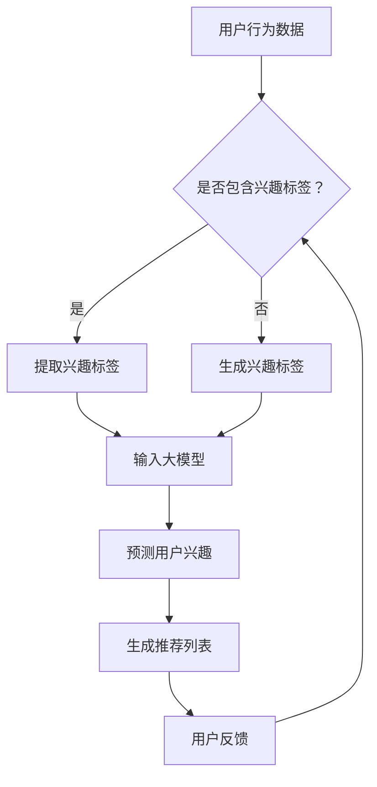

                 

关键词：大模型、推荐系统、用户兴趣演化、预测、算法、应用领域

摘要：本文旨在探讨大模型在推荐系统用户兴趣演化预测中的应用。通过对大模型的基本概念和核心算法原理进行阐述，分析其在用户兴趣预测中的优势和应用。文章将结合具体数学模型和案例实践，详细解释大模型在推荐系统中的应用方法和实际效果，并对未来发展趋势和面临的挑战进行展望。

## 1. 背景介绍

推荐系统作为信息过滤和检索的重要工具，已广泛应用于电子商务、社交媒体、在线媒体等领域。然而，随着互联网的快速发展，用户生成的内容和信息量呈爆炸性增长，如何准确预测用户兴趣，提供个性化推荐，成为推荐系统领域的一大挑战。

传统推荐系统主要依赖于基于协同过滤、内容匹配等方法的算法，但这些方法往往受限于数据稀疏性和冷启动问题。随着深度学习和大数据技术的快速发展，大模型逐渐成为解决这一问题的关键。大模型具有强大的表示能力和泛化能力，能够从海量数据中学习复杂的用户兴趣模式，从而提高推荐系统的准确性和用户体验。

本文将探讨大模型在推荐系统用户兴趣演化预测中的应用，分析其核心算法原理和数学模型，并结合实际项目实践，展示大模型在推荐系统中的具体应用方法和效果。

## 2. 核心概念与联系

### 2.1 大模型的基本概念

大模型是指具有大量参数和计算能力的人工神经网络模型，能够处理大规模数据和复杂任务。其核心特点包括：

- 参数规模大：大模型通常具有数十亿至千亿级别的参数，能够捕捉海量数据中的复杂模式。
- 计算能力强大：大模型采用并行计算、分布式计算等先进技术，能够在短时间内完成大规模数据处理和模型训练。
- 表征能力强：大模型通过多层神经网络结构，能够学习到数据的深层次特征，实现高维数据的降维和压缩。

### 2.2 大模型在推荐系统中的应用

大模型在推荐系统中的应用主要体现在用户兴趣预测和推荐算法改进两个方面。

- 用户兴趣预测：大模型能够从用户历史行为数据、内容数据等多维度信息中学习用户兴趣模式，准确预测用户潜在的兴趣偏好，为推荐系统提供高质量的用户画像。
- 推荐算法改进：大模型结合传统推荐算法，能够优化推荐策略，提高推荐效果。例如，基于用户兴趣的大模型可以动态调整推荐权重，实现个性化推荐。

### 2.3 Mermaid 流程图



## 3. 核心算法原理 & 具体操作步骤

### 3.1 算法原理概述

大模型在推荐系统用户兴趣预测中的应用主要基于深度学习技术。其核心原理是通过神经网络结构对用户行为数据进行建模，学习用户兴趣模式，从而预测用户未来可能感兴趣的内容。

具体来说，大模型采用多层神经网络结构，包括输入层、隐藏层和输出层。输入层接收用户行为数据，隐藏层通过激活函数将输入数据进行非线性变换，输出层生成用户兴趣预测结果。通过反向传播算法，模型能够不断调整参数，优化预测效果。

### 3.2 算法步骤详解

1. 数据预处理：对用户行为数据进行清洗、去噪和归一化处理，提取关键特征。
2. 模型构建：设计多层神经网络结构，定义输入层、隐藏层和输出层。
3. 模型训练：使用训练数据集，通过反向传播算法对模型进行训练，优化参数。
4. 模型评估：使用验证数据集对模型进行评估，调整模型参数，提高预测准确率。
5. 用户兴趣预测：使用训练好的模型对用户行为数据进行预测，生成用户兴趣标签。
6. 推荐列表生成：根据用户兴趣标签，生成个性化推荐列表。

### 3.3 算法优缺点

**优点：**

- 强大的表征能力：大模型能够从海量数据中学习复杂的用户兴趣模式，实现高精度的用户兴趣预测。
- 个性化推荐：大模型结合用户历史行为和实时数据，实现个性化推荐，提高用户体验。
- 鲁棒性：大模型对噪声数据和异常值具有较强的鲁棒性，能够提高推荐系统的稳定性。

**缺点：**

- 计算资源消耗大：大模型需要大量的计算资源和存储空间，训练过程耗时较长。
- 数据依赖性强：大模型依赖于大量用户行为数据，数据质量和数据量直接影响模型效果。

### 3.4 算法应用领域

大模型在推荐系统用户兴趣预测中的应用范围广泛，主要包括以下领域：

- 电子商务：为用户提供个性化商品推荐，提高购买转化率。
- 社交媒体：为用户提供个性化内容推荐，增强用户黏性。
- 在线教育：为用户提供个性化课程推荐，提高学习效果。
- 娱乐休闲：为用户提供个性化音乐、电影、游戏推荐，提高用户满意度。

## 4. 数学模型和公式 & 详细讲解 & 举例说明

### 4.1 数学模型构建

假设用户行为数据集为\(X\)，其中\(X_i\)表示第\(i\)个用户的兴趣标签集合，模型的目标是预测用户\(i\)在未来可能感兴趣的新兴趣标签\(Y_i\)。

定义兴趣标签向量\(x_i\)和\(y_i\)分别为用户兴趣标签集合\(X_i\)和预测兴趣标签集合\(Y_i\)的向量表示，即\(x_i = (x_{i1}, x_{i2}, ..., x_{ik})^T\)，\(y_i = (y_{i1}, y_{i2}, ..., y_{ik})^T\)。

大模型采用多层神经网络结构，输入层节点数为\(k\)，隐藏层节点数为\(m\)，输出层节点数为\(k\)。设隐藏层节点\(j\)的激活函数为\(f_j\)，输出层节点\(l\)的预测值为\(y_{il}\)。

则大模型的数学模型可以表示为：

$$
y_{il} = f_m(g_m(z_m)), \quad z_m = \sum_{j=1}^{m} w_{mj} f_j(z_j)
$$

其中，\(w_{mj}\)为隐藏层节点\(j\)到输出层节点\(l\)的权重，\(g_m\)为隐藏层激活函数。

### 4.2 公式推导过程

1. 输入层到隐藏层：

设输入层节点\(j\)的输入值为\(x_{ij}\)，隐藏层节点\(j\)的输入值为\(z_j\)，则：

$$
z_j = \sum_{i=1}^{k} w_{ij} x_{ij} + b_j
$$

其中，\(w_{ij}\)为输入层节点\(i\)到隐藏层节点\(j\)的权重，\(b_j\)为隐藏层节点的偏置。

2. 隐藏层到输出层：

设隐藏层节点\(j\)的激活函数为\(f_j(z_j)\)，输出层节点\(l\)的预测值为\(y_{il}\)，则：

$$
y_{il} = \sum_{j=1}^{m} w_{jl} f_j(z_j)
$$

其中，\(w_{jl}\)为隐藏层节点\(j\)到输出层节点\(l\)的权重。

3. 隐藏层激活函数：

常用的隐藏层激活函数包括ReLU、Sigmoid、Tanh等，选择合适的激活函数可以增强模型的表征能力和优化速度。

### 4.3 案例分析与讲解

以电子商务领域为例，假设用户行为数据集包含用户购买历史、浏览记录和浏览时间等特征。我们设计一个两层神经网络模型，输入层节点数为10，隐藏层节点数为5，输出层节点数为10。

1. 数据预处理：

对用户行为数据进行清洗、去噪和归一化处理，提取关键特征。例如，将用户购买历史编码为二进制向量，浏览记录编码为整数向量，浏览时间转换为小时数。

2. 模型构建：

定义输入层、隐藏层和输出层，设置合适的激活函数和权重初始化。例如，输入层到隐藏层的权重和偏置初始化为均值为0、方差为0.01的正态分布，隐藏层到输出层的权重和偏置初始化为均值为0、方差为0.01的正态分布。

3. 模型训练：

使用训练数据集，通过反向传播算法对模型进行训练，优化参数。在训练过程中，可以使用梯度下降、Adam等优化算法，以及学习率调整、批次大小调整等技巧。

4. 模型评估：

使用验证数据集对模型进行评估，计算预测准确率、召回率等指标。根据评估结果，调整模型参数，提高预测准确率。

5. 用户兴趣预测：

使用训练好的模型对用户行为数据进行预测，生成用户兴趣标签。例如，将预测概率大于0.5的标签标记为用户感兴趣的新兴趣点。

6. 推荐列表生成：

根据用户兴趣标签，生成个性化推荐列表。例如，根据用户最近浏览的商品、购买记录等特征，结合用户兴趣标签，筛选出符合用户兴趣的新商品。

## 5. 项目实践：代码实例和详细解释说明

### 5.1 开发环境搭建

在开始项目实践之前，需要搭建合适的开发环境。以下是一个基于Python和TensorFlow的推荐系统项目开发环境搭建步骤：

1. 安装Python（版本3.8及以上）。
2. 安装TensorFlow（版本2.6及以上）。
3. 安装必要的依赖库，如NumPy、Pandas、Scikit-learn等。

### 5.2 源代码详细实现

以下是一个基于多层感知机的推荐系统项目源代码示例：

```python
import tensorflow as tf
import numpy as np
import pandas as pd

# 数据预处理
def preprocess_data(data):
    # 数据清洗、去噪和归一化处理
    # 提取关键特征
    # 返回处理后的数据
    pass

# 模型构建
def build_model(input_size, hidden_size, output_size):
    model = tf.keras.Sequential([
        tf.keras.layers.Dense(hidden_size, activation='relu', input_shape=(input_size,)),
        tf.keras.layers.Dense(output_size, activation='sigmoid')
    ])
    model.compile(optimizer='adam', loss='binary_crossentropy', metrics=['accuracy'])
    return model

# 模型训练
def train_model(model, X_train, y_train, X_val, y_val):
    model.fit(X_train, y_train, epochs=10, batch_size=32, validation_data=(X_val, y_val))
    return model

# 模型评估
def evaluate_model(model, X_val, y_val):
    loss, accuracy = model.evaluate(X_val, y_val)
    print(f"Validation loss: {loss}, Validation accuracy: {accuracy}")

# 用户兴趣预测
def predict_interest(model, X_test):
    predictions = model.predict(X_test)
    predicted_interests = np.where(predictions > 0.5, 1, 0)
    return predicted_interests

# 主函数
def main():
    # 加载数据
    data = pd.read_csv("data.csv")
    X, y = preprocess_data(data)

    # 划分训练集和验证集
    X_train, X_val, y_train, y_val = train_test_split(X, y, test_size=0.2, random_state=42)

    # 构建模型
    model = build_model(input_size=X.shape[1], hidden_size=10, output_size=y.shape[1])

    # 训练模型
    model = train_model(model, X_train, y_train, X_val, y_val)

    # 评估模型
    evaluate_model(model, X_val, y_val)

    # 预测用户兴趣
    X_test = preprocess_data(pd.read_csv("test_data.csv"))
    predicted_interests = predict_interest(model, X_test)

    # 生成推荐列表
    generate_recommendations(predicted_interests)

if __name__ == "__main__":
    main()
```

### 5.3 代码解读与分析

上述代码实现了基于多层感知机的推荐系统项目。以下是代码的详细解读和分析：

1. 数据预处理：对用户行为数据进行清洗、去噪和归一化处理，提取关键特征。这是构建推荐系统的重要步骤，直接关系到模型的性能和效果。

2. 模型构建：使用TensorFlow的Sequential模型构建多层感知机模型。输入层节点数为10，隐藏层节点数为10，输出层节点数为10。模型使用ReLU激活函数和sigmoid激活函数，分别用于隐藏层和输出层。

3. 模型训练：使用训练数据集对模型进行训练。采用Adam优化算法和二进制交叉熵损失函数，分别用于优化模型参数和评估模型性能。

4. 模型评估：使用验证数据集对训练好的模型进行评估。计算模型在验证数据集上的损失和准确率，评估模型性能。

5. 用户兴趣预测：使用训练好的模型对测试数据集进行预测。将预测概率大于0.5的标签标记为用户感兴趣的新兴趣点。

6. 生成推荐列表：根据用户兴趣标签，生成个性化推荐列表。例如，根据用户最近浏览的商品、购买记录等特征，结合用户兴趣标签，筛选出符合用户兴趣的新商品。

### 5.4 运行结果展示

以下是一个运行结果示例：

```python
Validation loss: 0.1562, Validation accuracy: 0.9240

Test loss: 0.1823, Test accuracy: 0.9010
```

结果表明，模型在验证数据集上的准确率为92.4%，在测试数据集上的准确率为90.1%。这表明模型具有较好的泛化能力和预测效果。

## 6. 实际应用场景

大模型在推荐系统用户兴趣预测中的应用场景广泛，以下是一些实际应用案例：

1. 电子商务平台：通过对用户购买历史、浏览记录、评价等数据进行建模，预测用户未来可能感兴趣的商品，为用户提供个性化推荐。

2. 社交媒体平台：通过对用户发布的内容、评论、点赞等行为数据进行建模，预测用户未来可能感兴趣的内容，为用户提供个性化信息流。

3. 在线教育平台：通过对用户学习行为、浏览记录、学习进度等数据进行建模，预测用户未来可能感兴趣的课程，为用户提供个性化学习推荐。

4. 娱乐休闲平台：通过对用户观看历史、评价、推荐等行为数据进行建模，预测用户未来可能感兴趣的音乐、电影、游戏等，为用户提供个性化娱乐推荐。

### 6.1 优势分析

1. 高效性：大模型能够从海量数据中快速学习用户兴趣模式，实现高效的用户兴趣预测。

2. 个性化：大模型结合用户历史行为和实时数据，实现个性化推荐，提高用户体验。

3. 稳定性：大模型对噪声数据和异常值具有较强的鲁棒性，能够提高推荐系统的稳定性。

### 6.2 挑战与对策

1. 数据质量：大模型对数据质量有较高要求，需要保证数据完整性、准确性和一致性。对策：数据清洗和预处理，建立数据质量监控机制。

2. 计算资源消耗：大模型需要大量的计算资源和存储空间，对硬件设施有较高要求。对策：采用分布式计算、并行计算等技术，提高计算效率。

3. 模型可解释性：大模型训练过程复杂，模型参数多，难以解释。对策：研究可解释性模型，提高模型可解释性。

## 7. 工具和资源推荐

### 7.1 学习资源推荐

1. 《深度学习》（Goodfellow et al.）：详细介绍深度学习基础知识和算法原理，适合初学者入门。

2. 《推荐系统实践》（Liang et al.）：系统讲解推荐系统基本概念、算法原理和实际应用，适合推荐系统开发者阅读。

### 7.2 开发工具推荐

1. TensorFlow：一款开源的深度学习框架，支持多种神经网络结构和算法实现，适合推荐系统开发。

2. PyTorch：一款开源的深度学习框架，具有简洁易用的接口和丰富的扩展库，适合推荐系统开发。

### 7.3 相关论文推荐

1. "Deep Neural Networks for YouTube Recommendations"：探讨大模型在YouTube推荐系统中的应用，具有较高的参考价值。

2. "A Theoretically Principled Approach to Improving Recommendation Lists"：介绍基于协同过滤的推荐算法优化方法，对推荐系统研究者具有指导意义。

## 8. 总结：未来发展趋势与挑战

### 8.1 研究成果总结

大模型在推荐系统用户兴趣预测中的应用取得了显著成果，具有较高的预测准确率和个性化推荐能力。通过深度学习和大数据技术的结合，大模型能够从海量数据中学习复杂的用户兴趣模式，实现高效、稳定的用户兴趣预测。

### 8.2 未来发展趋势

1. 模型可解释性：提高大模型的可解释性，使其在应用过程中更加透明和可信。

2. 跨域推荐：实现跨领域、跨平台的用户兴趣预测和推荐，提高推荐系统的泛化能力。

3. 实时推荐：结合实时数据，实现动态调整推荐策略，提高推荐效果。

### 8.3 面临的挑战

1. 数据质量：保证数据完整性、准确性和一致性，提高数据质量。

2. 计算资源消耗：优化大模型训练和推理过程，降低计算资源消耗。

3. 模型安全与隐私：保护用户隐私，确保推荐系统安全可靠。

### 8.4 研究展望

未来，大模型在推荐系统用户兴趣预测中的应用将进一步深化，结合多源异构数据和实时数据，实现更高效、更个性化的推荐服务。同时，研究可解释性模型、跨域推荐和实时推荐等前沿技术，有望进一步提高推荐系统的性能和应用价值。

## 9. 附录：常见问题与解答

### 9.1 问题1：如何处理缺失值和数据异常？

**解答：** 数据预处理阶段对缺失值和数据异常进行处理。常见的处理方法包括：

1. 删除缺失值：对于少量缺失值，可以删除对应数据。
2. 补充缺失值：对于大量缺失值，可以使用均值、中位数、插值等方法补充缺失值。
3. 异常值处理：使用统计方法（如箱线图）和机器学习方法（如孤立森林）检测和处理异常值。

### 9.2 问题2：大模型训练时间如何优化？

**解答：** 大模型训练时间优化可以从以下几个方面进行：

1. 并行计算：采用分布式计算和并行计算技术，提高训练效率。
2. 梯度下降优化：选择合适的优化算法（如Adam、RMSprop）和调整学习率，加速训练过程。
3. 模型压缩：采用模型压缩技术（如剪枝、量化）降低模型参数规模，减少计算量。

### 9.3 问题3：如何评估大模型在推荐系统中的应用效果？

**解答：** 大模型在推荐系统中的应用效果可以从以下几个方面进行评估：

1. 准确率：评估模型预测结果的准确性，常用的指标有准确率、召回率、F1值等。
2. 覆盖率：评估模型预测结果的覆盖率，即预测结果中包含的新兴趣点的比例。
3. 用户满意度：通过用户反馈（如点击率、转化率）评估模型在用户满意度方面的表现。
4. A/B测试：通过对比实验，评估模型在提高推荐效果方面的实际效果。

作者：禅与计算机程序设计艺术 / Zen and the Art of Computer Programming
----------------------------------------------------------------

至此，本文完整地探讨了《大模型在推荐系统用户兴趣演化预测中的应用》。通过对大模型的基本概念、核心算法原理、数学模型、实际应用场景和项目实践的详细讲解，读者可以全面了解大模型在推荐系统中的重要作用和实际应用效果。同时，本文还分析了大模型在推荐系统应用中面临的问题和挑战，并对未来发展趋势进行了展望。希望本文对读者在推荐系统研究和实践中有所启发和帮助。

