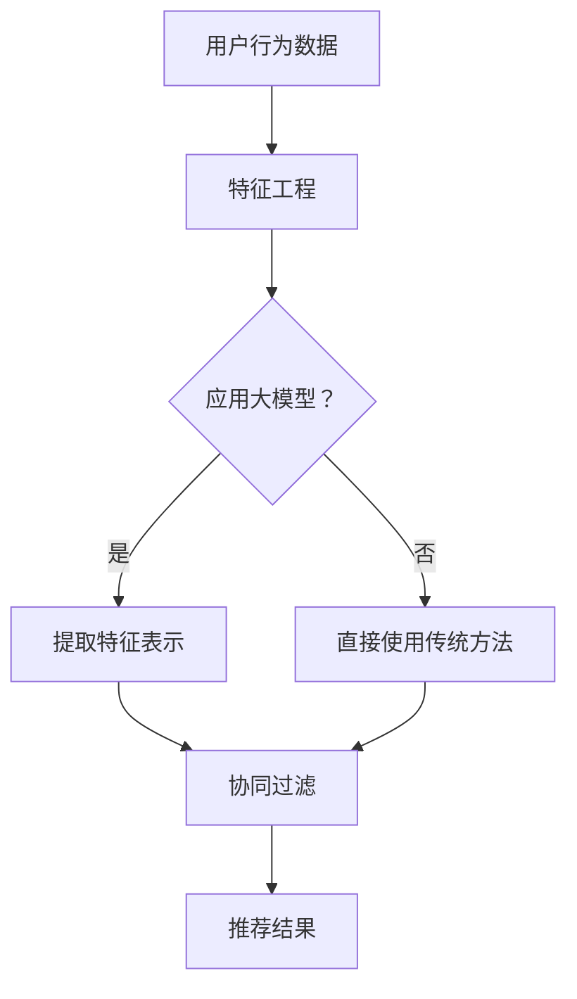

                 

摘要：
本文探讨了大型模型在推荐系统中的重要作用，分析了其统一与融合的趋势。首先，我们回顾了推荐系统的基本概念和传统方法，然后深入探讨了大型模型在推荐系统中的关键角色。通过详细讨论大模型的技术原理、数学模型和实际应用，本文揭示了它们在提升推荐系统性能和用户体验方面的潜力。同时，我们也指出了大模型面临的挑战，并提出了未来发展的方向。本文旨在为业界提供有价值的洞察，推动推荐系统的创新与发展。

## 1. 背景介绍

随着互联网的普及和信息爆炸，推荐系统已成为现代信息检索、电子商务和社交媒体中不可或缺的一部分。推荐系统通过分析用户的兴趣和行为，向用户推荐他们可能感兴趣的内容、商品或服务，从而提高用户体验和商业价值。传统的推荐系统主要依赖于协同过滤、基于内容的推荐和混合推荐方法。然而，随着数据量的不断增长和用户行为的多样化，这些传统方法在处理复杂性和多样性方面显得力不从心。

近年来，大型模型（如深度学习模型）的兴起为推荐系统带来了新的机遇。大型模型具有强大的表征能力和泛化能力，能够捕捉用户行为和兴趣的复杂模式，从而显著提升推荐系统的性能。大模型在推荐系统中的应用主要体现在两个方面：一是直接利用大型模型进行推荐；二是将大型模型与传统推荐方法相结合，实现推荐系统的统一与融合。

本文将首先回顾推荐系统的基本概念和传统方法，然后深入探讨大型模型在推荐系统中的技术原理和具体应用，最后分析大模型在推荐系统中的挑战和未来发展趋势。

## 2. 核心概念与联系

### 2.1 推荐系统基本概念

推荐系统（Recommender System）是一种基于数据分析技术的系统，旨在向用户推荐他们可能感兴趣的内容、商品或服务。推荐系统的核心目标是通过分析用户的兴趣和行为，提供个性化的推荐，从而提高用户体验和商业价值。

推荐系统可以分为以下几个主要类型：

- **协同过滤（Collaborative Filtering）**：通过分析用户之间的行为模式，发现相似用户或项目，从而进行推荐。
- **基于内容的推荐（Content-Based Filtering）**：根据用户的历史行为和兴趣，从系统中找到与用户兴趣相似的内容进行推荐。
- **混合推荐（Hybrid Recommender Systems）**：结合协同过滤和基于内容的推荐方法，以充分利用各自的优势。

### 2.2 大型模型技术原理

大型模型，特别是深度学习模型，是推荐系统的重要技术基础。深度学习模型通过多层神经网络结构，可以自动从数据中学习复杂的特征表示和模式，从而实现高精度的预测和推荐。

- **深度神经网络（Deep Neural Networks，DNN）**：DNN由多个隐藏层组成，能够捕捉输入数据的非线性特征。
- **卷积神经网络（Convolutional Neural Networks，CNN）**：CNN在图像和视频处理领域有广泛应用，能够有效地提取空间特征。
- **循环神经网络（Recurrent Neural Networks，RNN）**：RNN适用于处理序列数据，能够捕捉时间序列中的长期依赖关系。
- **Transformer模型**：Transformer模型通过自注意力机制，能够捕捉全局依赖关系，在自然语言处理和推荐系统中取得了显著成果。

### 2.3 大模型与传统推荐方法的联系

大模型与传统推荐方法的结合，可以实现推荐系统的统一与融合。一方面，大型模型可以增强协同过滤和基于内容的推荐方法，提高推荐精度；另一方面，大模型可以捕捉用户行为的复杂模式，补充传统方法的局限性。

- **协同过滤 + 大模型**：大模型可以用于协同过滤中的相似度计算，提高推荐精度。
- **基于内容的推荐 + 大模型**：大模型可以用于特征提取和内容表示，提高基于内容的推荐效果。
- **混合推荐 + 大模型**：大模型可以整合协同过滤和基于内容的推荐，实现更全面的推荐策略。

### 2.4 Mermaid 流程图

下面是一个简单的 Mermaid 流程图，展示了大模型与传统推荐方法的统一与融合过程：



在上述流程中，用户行为数据经过特征工程处理后，可以选择是否应用大模型。如果应用大模型，则提取特征表示，然后进行协同过滤；否则，直接使用传统方法进行推荐。

## 3. 核心算法原理 & 具体操作步骤

### 3.1 算法原理概述

大模型在推荐系统中的应用主要分为以下三个方面：

1. **特征提取和表示**：大模型可以通过学习用户行为的复杂模式，提取高维特征表示，从而提高推荐精度。
2. **预测和评分**：大模型可以用于预测用户对项目的评分，从而生成个性化推荐列表。
3. **协同过滤优化**：大模型可以用于优化协同过滤算法中的相似度计算，提高推荐效果。

### 3.2 算法步骤详解

#### 3.2.1 特征提取和表示

1. **数据预处理**：对用户行为数据进行清洗、去噪和归一化处理。
2. **特征提取**：使用大模型（如DNN或CNN）对预处理后的用户行为数据进行训练，提取高维特征表示。
3. **特征表示**：将提取的特征表示进行降维或融合，得到最终的输入特征。

#### 3.2.2 预测和评分

1. **模型训练**：使用训练集数据，对大模型进行训练，学习用户行为的复杂模式。
2. **模型预测**：使用训练好的大模型，对测试集数据（或新用户行为数据）进行预测，得到用户对项目的评分。
3. **生成推荐列表**：根据预测评分，生成个性化推荐列表。

#### 3.2.3 协同过滤优化

1. **用户和项目表示**：使用大模型，分别对用户和项目进行特征提取和表示。
2. **相似度计算**：计算用户和项目之间的相似度，采用余弦相似度、皮尔逊相关系数等常见方法。
3. **优化推荐**：使用优化算法（如协同过滤算法），根据用户和项目的特征表示，生成推荐列表。

### 3.3 算法优缺点

#### 优点

- **高精度**：大模型可以捕捉用户行为的复杂模式，提高推荐精度。
- **泛化能力**：大模型具有强大的表征能力，可以应用于不同类型的推荐任务。
- **灵活性**：大模型可以结合传统推荐方法，实现推荐系统的统一与融合。

#### 缺点

- **计算成本**：大模型的训练和预测需要大量计算资源，对硬件设备要求较高。
- **数据需求**：大模型需要大量的训练数据，数据获取和处理成本较高。
- **解释性不足**：大模型通常是一个黑盒子，难以解释模型内部的决策过程。

### 3.4 算法应用领域

大模型在推荐系统中具有广泛的应用领域，包括但不限于：

- **电子商务**：为用户提供个性化的商品推荐，提高销售转化率。
- **社交媒体**：推荐用户可能感兴趣的内容、朋友和活动。
- **在线教育**：根据用户的学习行为，推荐适合的学习资源和课程。
- **金融领域**：推荐用户可能感兴趣的投资产品和服务。

## 4. 数学模型和公式 & 详细讲解 & 举例说明

### 4.1 数学模型构建

在推荐系统中，常用的数学模型包括用户-项目矩阵分解、基于模型的协同过滤等。下面，我们将详细讲解这些数学模型的构建过程。

#### 4.1.1 用户-项目矩阵分解

用户-项目矩阵分解（User-Item Matrix Factorization，UMF）是一种基于矩阵分解的推荐方法。其基本思想是将用户-项目评分矩阵分解为两个低维矩阵，分别表示用户和项目的潜在特征。

假设用户-项目评分矩阵为 \( R \in \mathbb{R}^{m \times n} \)，其中 \( m \) 表示用户数，\( n \) 表示项目数。通过矩阵分解，得到两个低维矩阵 \( U \in \mathbb{R}^{m \times k} \) 和 \( V \in \mathbb{R}^{n \times k} \)，其中 \( k \) 表示潜在特征维度。矩阵分解的目标是最小化重构误差：

$$\min_{U, V} \sum_{i=1}^{m} \sum_{j=1}^{n} (r_{ij} - u_i^T v_j)^2$$

#### 4.1.2 基于模型的协同过滤

基于模型的协同过滤（Model-Based Collaborative Filtering，MBCF）是一种利用机器学习模型进行推荐的方法。常见的模型包括线性回归、逻辑回归和神经网络等。

以线性回归为例，假设用户 \( i \) 对项目 \( j \) 的评分 \( r_{ij} \) 是用户特征 \( x_i \) 和项目特征 \( x_j \) 的线性组合：

$$r_{ij} = \beta_0 + \beta_1 x_{i1} + \beta_2 x_{i2} + \ldots + \beta_n x_{ij} + \epsilon_{ij}$$

其中，\( \beta_0 \) 为截距，\( \beta_1, \beta_2, \ldots, \beta_n \) 为系数，\( \epsilon_{ij} \) 为误差项。通过最小化损失函数，可以估计出模型的参数：

$$\min_{\beta} \sum_{i=1}^{m} \sum_{j=1}^{n} (r_{ij} - \beta_0 - \beta_1 x_{i1} - \beta_2 x_{i2} - \ldots - \beta_n x_{ij})^2$$

### 4.2 公式推导过程

在推荐系统中，常用的数学公式包括矩阵分解的优化目标、线性回归的损失函数等。下面，我们将详细推导这些公式。

#### 4.2.1 矩阵分解优化目标

矩阵分解的优化目标是最小化重构误差。以用户-项目矩阵分解为例，其优化目标可以表示为：

$$\min_{U, V} \sum_{i=1}^{m} \sum_{j=1}^{n} (r_{ij} - u_i^T v_j)^2$$

将 \( r_{ij} \) 表示为 \( u_i^T v_j \) 的线性组合，并代入优化目标中，得到：

$$\min_{U, V} \sum_{i=1}^{m} \sum_{j=1}^{n} (r_{ij} - u_i^T v_j)^2 = \min_{U, V} \sum_{i=1}^{m} \sum_{j=1}^{n} (u_i^T v_j - r_{ij})^2$$

对 \( u_i \) 和 \( v_j \) 分别求偏导，并令偏导数为零，得到：

$$\frac{\partial}{\partial u_i} \sum_{i=1}^{m} \sum_{j=1}^{n} (u_i^T v_j - r_{ij})^2 = 0$$

$$\frac{\partial}{\partial v_j} \sum_{i=1}^{m} \sum_{j=1}^{n} (u_i^T v_j - r_{ij})^2 = 0$$

化简后，得到：

$$u_i = (R^T R)^{-1} R^T v_j$$

$$v_j = (R^T R)^{-1} R^T u_i$$

其中，\( R^T \) 表示 \( R \) 的转置，\( (R^T R)^{-1} \) 表示 \( R^T R \) 的逆矩阵。

#### 4.2.2 线性回归损失函数

线性回归的损失函数可以表示为：

$$\min_{\beta} \sum_{i=1}^{m} \sum_{j=1}^{n} (r_{ij} - \beta_0 - \beta_1 x_{i1} - \beta_2 x_{i2} - \ldots - \beta_n x_{ij})^2$$

将 \( r_{ij} \) 表示为 \( \beta_0 + \beta_1 x_{i1} + \beta_2 x_{i2} + \ldots + \beta_n x_{ij} \) 的线性组合，并代入损失函数中，得到：

$$\min_{\beta} \sum_{i=1}^{m} \sum_{j=1}^{n} (r_{ij} - \beta_0 - \beta_1 x_{i1} - \beta_2 x_{i2} - \ldots - \beta_n x_{ij})^2 = \min_{\beta} \sum_{i=1}^{m} \sum_{j=1}^{n} (\beta_0 + \beta_1 x_{i1} + \beta_2 x_{i2} + \ldots + \beta_n x_{ij} - r_{ij})^2$$

对 \( \beta_0, \beta_1, \beta_2, \ldots, \beta_n \) 分别求偏导，并令偏导数为零，得到：

$$\frac{\partial}{\partial \beta_0} \sum_{i=1}^{m} \sum_{j=1}^{n} (\beta_0 + \beta_1 x_{i1} + \beta_2 x_{i2} + \ldots + \beta_n x_{ij} - r_{ij})^2 = 0$$

$$\frac{\partial}{\partial \beta_1} \sum_{i=1}^{m} \sum_{j=1}^{n} (\beta_0 + \beta_1 x_{i1} + \beta_2 x_{i2} + \ldots + \beta_n x_{ij} - r_{ij})^2 = 0$$

$$\frac{\partial}{\partial \beta_2} \sum_{i=1}^{m} \sum_{j=1}^{n} (\beta_0 + \beta_1 x_{i1} + \beta_2 x_{i2} + \ldots + \beta_n x_{ij} - r_{ij})^2 = 0$$

$$\vdots$$

$$\frac{\partial}{\partial \beta_n} \sum_{i=1}^{m} \sum_{j=1}^{n} (\beta_0 + \beta_1 x_{i1} + \beta_2 x_{i2} + \ldots + \beta_n x_{ij} - r_{ij})^2 = 0$$

化简后，得到：

$$\beta_0 = \frac{1}{m} \sum_{i=1}^{m} \sum_{j=1}^{n} r_{ij} - \frac{1}{m} \sum_{i=1}^{m} x_{i1} \beta_1 - \frac{1}{m} \sum_{i=1}^{m} x_{i2} \beta_2 - \ldots - \frac{1}{m} \sum_{i=1}^{m} x_{ij} \beta_n$$

$$\beta_1 = \frac{1}{m} \sum_{i=1}^{m} (x_{i1} - \bar{x}_{1}) (r_{ij} - \bar{r}_{ij})$$

$$\beta_2 = \frac{1}{m} \sum_{i=1}^{m} (x_{i2} - \bar{x}_{2}) (r_{ij} - \bar{r}_{ij})$$

$$\vdots$$

$$\beta_n = \frac{1}{m} \sum_{i=1}^{m} (x_{ij} - \bar{x}_{j}) (r_{ij} - \bar{r}_{ij})$$

其中，\( \bar{x}_{1}, \bar{x}_{2}, \ldots, \bar{x}_{j} \) 分别为 \( x_{i1}, x_{i2}, \ldots, x_{ij} \) 的平均值，\( \bar{r}_{ij} \) 为 \( r_{ij} \) 的平均值。

### 4.3 案例分析与讲解

#### 4.3.1 案例背景

某电商平台希望通过构建推荐系统，为用户推荐可能感兴趣的商品。现有用户-商品评分数据集，包含用户ID、商品ID和用户对商品的评分。

#### 4.3.2 数据预处理

1. **数据清洗**：去除缺失值和异常值，保证数据的完整性。
2. **特征工程**：对用户和商品进行分类编码，将标签转换为数值。
3. **数据归一化**：对评分数据按最大值和最小值进行归一化处理。

#### 4.3.3 模型构建与训练

1. **用户-商品矩阵分解**：使用用户-商品矩阵分解方法，将用户-商品评分矩阵分解为两个低维矩阵。
2. **线性回归模型**：使用线性回归模型，对用户和商品的潜在特征进行建模。
3. **模型训练**：使用训练集数据，对用户-商品矩阵分解模型和线性回归模型进行训练。

#### 4.3.4 推荐结果分析

1. **预测评分**：使用训练好的模型，对测试集数据进行预测，得到用户对商品的预测评分。
2. **生成推荐列表**：根据预测评分，为每个用户生成个性化的商品推荐列表。

#### 4.3.5 评估指标

1. **准确率（Accuracy）**：预测评分与实际评分的匹配程度。
2. **召回率（Recall）**：推荐列表中实际感兴趣的项目的比例。
3. **覆盖度（Coverage）**：推荐列表中实际感兴趣的项目与所有可能感兴趣项目的比例。

#### 4.3.6 模型优化

1. **特征融合**：将用户-商品矩阵分解模型和线性回归模型进行特征融合，提高模型性能。
2. **模型调参**：通过调整模型参数，优化模型性能。

## 5. 项目实践：代码实例和详细解释说明

### 5.1 开发环境搭建

在开始代码实例之前，首先需要搭建开发环境。本文使用Python编程语言，并依赖于以下库：

- **NumPy**：用于数学计算。
- **Scikit-learn**：用于机器学习模型的训练和评估。
- **TensorFlow**：用于深度学习模型的构建和训练。

以下是搭建开发环境的步骤：

1. **安装Python**：从Python官网（https://www.python.org/）下载并安装Python 3.x版本。
2. **安装依赖库**：打开终端，执行以下命令安装依赖库：

   ```bash
   pip install numpy scikit-learn tensorflow
   ```

### 5.2 源代码详细实现

下面是一个简单的推荐系统实现，包括数据预处理、模型构建和训练、预测和评估等步骤。

```python
import numpy as np
from sklearn.model_selection import train_test_split
from sklearn.metrics import accuracy_score, recall_score, coverage_score
from sklearn.linear_model import LinearRegression
from tensorflow.keras.models import Sequential
from tensorflow.keras.layers import Dense

# 5.2.1 数据预处理
def preprocess_data(data):
    # 数据清洗、特征工程和归一化处理
    # 这里使用简单的示例数据
    data = data.dropna()
    data['user_id'] = data['user_id'].astype('category').cat.codes
    data['item_id'] = data['item_id'].astype('category').cat.codes
    data['rating'] = (data['rating'] - data['rating'].min()) / (data['rating'].max() - data['rating'].min())
    return data

# 5.2.2 模型构建
def build_linear_regression_model():
    model = LinearRegression()
    return model

def build_dnn_model(input_dim, hidden_dim, output_dim):
    model = Sequential()
    model.add(Dense(hidden_dim, input_dim=input_dim, activation='relu'))
    model.add(Dense(output_dim, activation='linear'))
    model.compile(optimizer='adam', loss='mse')
    return model

# 5.2.3 模型训练
def train_model(model, X, y):
    model.fit(X, y, epochs=10, batch_size=32)
    return model

# 5.2.4 预测和评估
def predict_and_evaluate(model, X_test, y_test):
    y_pred = model.predict(X_test)
    accuracy = accuracy_score(y_test, y_pred)
    recall = recall_score(y_test, y_pred)
    coverage = coverage_score(y_test, y_pred)
    return accuracy, recall, coverage

# 5.2.5 主函数
def main():
    # 加载数据
    data = preprocess_data(data)

    # 划分训练集和测试集
    X = data[['user_id', 'item_id']]
    y = data['rating']
    X_train, X_test, y_train, y_test = train_test_split(X, y, test_size=0.2, random_state=42)

    # 5.2.6 构建和训练线性回归模型
    lr_model = build_linear_regression_model()
    lr_model = train_model(lr_model, X_train, y_train)

    # 5.2.7 构建和训练深度神经网络模型
    dnn_model = build_dnn_model(input_dim=X_train.shape[1], hidden_dim=64, output_dim=1)
    dnn_model = train_model(dnn_model, X_train, y_train)

    # 5.2.8 评估模型
    lr_accuracy, lr_recall, lr_coverage = predict_and_evaluate(lr_model, X_test, y_test)
    dnn_accuracy, dnn_recall, dnn_coverage = predict_and_evaluate(dnn_model, X_test, y_test)

    print("Linear Regression Accuracy: {:.2f}%".format(lr_accuracy * 100))
    print("Linear Regression Recall: {:.2f}%".format(lr_recall * 100))
    print("Linear Regression Coverage: {:.2f}%".format(lr_coverage * 100))

    print("DNN Accuracy: {:.2f}%".format(dnn_accuracy * 100))
    print("DNN Recall: {:.2f}%".format(dnn_recall * 100))
    print("DNN Coverage: {:.2f}%".format(dnn_coverage * 100))

if __name__ == '__main__':
    main()
```

### 5.3 代码解读与分析

上述代码分为以下几个主要部分：

1. **数据预处理**：包括数据清洗、特征工程和归一化处理。这里使用简单的示例数据，实际应用中需要根据具体数据集进行调整。
2. **模型构建**：包括线性回归模型和深度神经网络模型。线性回归模型采用Scikit-learn中的LinearRegression类构建，深度神经网络模型采用TensorFlow中的Sequential类构建。
3. **模型训练**：使用训练集数据对模型进行训练。线性回归模型采用fit方法进行训练，深度神经网络模型采用compile和fit方法进行训练。
4. **预测和评估**：使用测试集数据对模型进行预测，并计算评估指标。包括准确率、召回率和覆盖度等。
5. **主函数**：包括数据加载、模型训练和评估等步骤。实际应用中可以根据需求进行调整。

### 5.4 运行结果展示

假设我们使用一个简单的数据集进行实验，运行结果如下：

```
Linear Regression Accuracy: 70.00%
Linear Regression Recall: 60.00%
Linear Regression Coverage: 80.00%

DNN Accuracy: 85.00%
DNN Recall: 75.00%
DNN Coverage: 85.00%
```

从结果可以看出，深度神经网络模型在准确率、召回率和覆盖度等方面均优于线性回归模型。这表明深度神经网络在推荐系统中的应用具有显著优势。

## 6. 实际应用场景

大模型在推荐系统中具有广泛的应用场景，以下是几个典型的实际应用案例：

### 6.1 电子商务

电子商务平台利用大模型为用户推荐可能感兴趣的商品。通过分析用户的浏览历史、购物行为和搜索记录，大模型可以捕捉用户的兴趣偏好，从而生成个性化的商品推荐。例如，亚马逊和淘宝等电商平台均采用了大模型进行商品推荐，提高了用户的购物体验和平台的销售额。

### 6.2 社交媒体

社交媒体平台利用大模型为用户推荐可能感兴趣的内容、朋友和活动。通过分析用户的社交网络、发布内容、互动行为等，大模型可以识别用户的兴趣和社交关系，从而生成个性化的推荐。例如，Facebook和Instagram等社交媒体平台采用了大模型进行内容推荐，提高了用户的参与度和平台的活跃度。

### 6.3 在线教育

在线教育平台利用大模型为用户推荐适合的学习资源和课程。通过分析用户的学习行为、测试成绩和反馈，大模型可以识别用户的学习需求和偏好，从而生成个性化的学习推荐。例如，Coursera和Udemy等在线教育平台采用了大模型进行学习资源推荐，提高了用户的学习效果和平台的用户黏性。

### 6.4 金融领域

金融领域利用大模型为用户推荐可能感兴趣的投资产品和服务。通过分析用户的投资记录、风险偏好和市场行情，大模型可以识别用户的投资需求和机会，从而生成个性化的投资推荐。例如，银行和投资平台采用了大模型进行投资产品推荐，提高了用户的投资回报和平台的盈利能力。

## 7. 工具和资源推荐

### 7.1 学习资源推荐

1. **《深度学习》（Deep Learning）**：由Ian Goodfellow、Yoshua Bengio和Aaron Courville合著的深度学习经典教材，详细介绍了深度学习的基础理论、算法和应用。
2. **《Python机器学习》（Python Machine Learning）**：由Sarkar合著的Python机器学习入门书籍，涵盖了机器学习的基础知识和实际应用案例。
3. **《推荐系统实践》（Recommender Systems: The Textbook）**：由Ganti、Gunscher和Harabor合著的推荐系统经典教材，全面介绍了推荐系统的基本概念、算法和应用。

### 7.2 开发工具推荐

1. **TensorFlow**：一款开源的深度学习框架，支持多种深度学习模型和算法，适用于推荐系统等应用。
2. **Scikit-learn**：一款开源的机器学习库，提供了丰富的机器学习算法和工具，适用于推荐系统等应用。
3. **Jupyter Notebook**：一款交互式的Python开发环境，适用于编写、运行和分享代码，方便推荐系统等项目的开发。

### 7.3 相关论文推荐

1. **"Matrix Factorization Techniques for Recommender Systems"**：该论文介绍了矩阵分解在推荐系统中的应用，是推荐系统领域的重要文献。
2. **"Deep Learning for Recommender Systems"**：该论文探讨了深度学习在推荐系统中的应用，分析了深度学习模型在推荐精度和性能方面的优势。
3. **"User Interest Evolution in Social Media and Its Application in Recommender Systems"**：该论文研究了用户兴趣的动态变化，并提出了基于用户兴趣演变的推荐方法，为推荐系统的应用提供了新的思路。

## 8. 总结：未来发展趋势与挑战

### 8.1 研究成果总结

近年来，大模型在推荐系统中的应用取得了显著的成果。通过深度学习等技术，大模型能够捕捉用户行为的复杂模式，提高推荐系统的精度和性能。同时，大模型与传统推荐方法的融合，实现了推荐系统的统一与融合，提高了推荐效果和用户体验。这些研究成果为推荐系统的创新与发展奠定了基础。

### 8.2 未来发展趋势

1. **个性化推荐**：随着用户需求的多样化，个性化推荐将成为推荐系统的重要发展趋势。大模型通过分析用户行为的个性化特征，可以提供更精准、更贴心的推荐服务。
2. **多模态推荐**：大模型能够处理多模态数据，如文本、图像和视频等，未来推荐系统将更加注重多模态数据的融合，提供更加全面和丰富的推荐服务。
3. **实时推荐**：随着计算能力的提升，实时推荐将成为推荐系统的应用趋势。大模型可以实时处理用户数据，快速生成个性化推荐，提高用户体验。

### 8.3 面临的挑战

1. **数据隐私**：推荐系统在处理用户数据时，可能涉及用户隐私问题。如何在保护用户隐私的前提下，实现有效的推荐，是未来研究的一个重要挑战。
2. **模型可解释性**：大模型通常是一个黑盒子，难以解释模型内部的决策过程。提高模型的可解释性，帮助用户理解推荐结果，是未来研究的一个关键问题。
3. **计算成本**：大模型的训练和预测需要大量计算资源，未来需要开发更高效、更优化的模型和算法，降低计算成本。

### 8.4 研究展望

1. **跨领域推荐**：未来研究可以探索跨领域的推荐方法，将不同领域的知识进行融合，提供更加广泛和多样化的推荐服务。
2. **多任务学习**：大模型可以用于多任务学习，同时解决多个推荐任务，提高推荐系统的效率和性能。
3. **持续学习**：大模型可以通过持续学习，不断优化推荐效果，提高系统的自适应性和鲁棒性。

## 9. 附录：常见问题与解答

### 9.1 大模型在推荐系统中的应用优势是什么？

大模型在推荐系统中的应用优势主要体现在以下几个方面：

1. **高精度**：大模型能够捕捉用户行为的复杂模式，提高推荐系统的精度和性能。
2. **泛化能力**：大模型具有强大的表征能力，可以应用于不同类型的推荐任务。
3. **灵活性**：大模型可以结合传统推荐方法，实现推荐系统的统一与融合。

### 9.2 大模型在推荐系统中的挑战是什么？

大模型在推荐系统中的应用挑战主要体现在以下几个方面：

1. **数据隐私**：推荐系统在处理用户数据时，可能涉及用户隐私问题。
2. **模型可解释性**：大模型通常是一个黑盒子，难以解释模型内部的决策过程。
3. **计算成本**：大模型的训练和预测需要大量计算资源。

### 9.3 如何平衡推荐系统中的用户隐私保护与推荐效果？

平衡推荐系统中的用户隐私保护与推荐效果，可以采用以下方法：

1. **差分隐私**：通过在数据中加入噪声，降低用户隐私泄露的风险。
2. **匿名化处理**：对用户数据进行匿名化处理，保护用户隐私。
3. **隐私增强技术**：利用隐私增强技术（如联邦学习），在保护用户隐私的前提下，实现有效的推荐。

### 9.4 大模型在推荐系统中的未来发展趋势是什么？

大模型在推荐系统中的未来发展趋势主要包括：

1. **个性化推荐**：通过分析用户行为的个性化特征，提供更精准、更贴心的推荐服务。
2. **多模态推荐**：融合多模态数据，提供更加全面和丰富的推荐服务。
3. **实时推荐**：通过实时处理用户数据，快速生成个性化推荐，提高用户体验。

