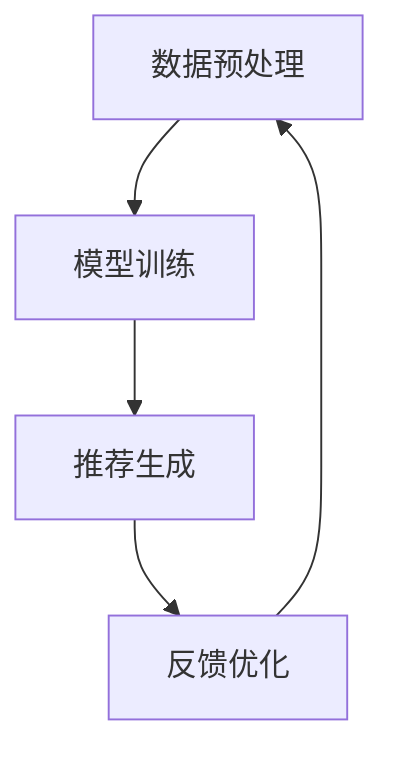

                 

关键词：大模型、推荐系统、群体推荐、算法、应用、展望、挑战

> 摘要：本文探讨了大规模模型在推荐系统群体推荐中的重要作用。通过分析大模型在推荐系统中的核心算法原理、数学模型构建、以及实际应用场景，本文揭示了大规模模型在提升推荐效果、满足个性化需求方面的潜力。同时，本文也对大模型在推荐系统中的未来发展趋势、面临的挑战以及研究方向进行了展望。

## 1. 背景介绍

推荐系统作为现代信息检索和个性化服务的重要手段，已经广泛应用于电子商务、社交媒体、新闻推送、在线教育等多个领域。传统的推荐系统主要依赖于基于内容的过滤（Content-based Filtering）和协同过滤（Collaborative Filtering）等算法，但面对日益增长的用户数据和复杂的需求，这些传统方法在准确性和实时性方面逐渐显现出局限性。

为了解决这些问题，研究人员提出了基于大规模模型（Large-scale Models）的推荐方法。大规模模型，如深度学习神经网络，能够在海量的数据中挖掘潜在的模式和关联，从而提高推荐系统的准确性和个性化和实时性。本文将重点探讨大规模模型在推荐系统群体推荐中的作用，分析其核心算法原理、数学模型构建以及实际应用场景，并对未来的发展趋势和面临的挑战进行展望。

## 2. 核心概念与联系

### 2.1. 大规模模型的基本原理

大规模模型，特别是深度学习模型，通过多层神经网络结构对数据进行复杂非线性变换，从而能够捕捉数据中的高层次特征。这种结构使得大规模模型在处理高维数据和非线性关联方面具有显著优势。大规模模型的核心原理可以概括为以下几个方面：

1. **数据输入**：大规模模型通常接受高维输入数据，如用户的行为数据、商品特征数据等。
2. **特征提取**：通过多层神经网络的变换，将输入数据转化为低维特征表示。
3. **关联学习**：利用模型内部参数学习数据之间的关联，形成对用户兴趣和商品属性的深刻理解。
4. **预测输出**：基于学习到的关联，对用户的兴趣和行为进行预测，从而生成推荐结果。

### 2.2. 推荐系统的基本架构

推荐系统通常由用户表示、商品表示、推荐算法和评价反馈等模块组成。大规模模型在推荐系统中的应用主要体现在以下几个方面：

1. **用户表示**：通过大规模模型对用户的行为数据进行特征提取，生成用户兴趣的向量表示。
2. **商品表示**：利用大规模模型对商品的特征数据进行编码，形成商品属性的向量表示。
3. **推荐算法**：基于用户和商品的向量表示，利用大规模模型进行相似性计算和关联学习，生成推荐结果。
4. **评价反馈**：通过用户对推荐结果的反馈，调整模型参数，优化推荐效果。

### 2.3. 大规模模型与推荐系统的整合

大规模模型与推荐系统的整合，可以通过以下步骤实现：

1. **数据预处理**：对用户行为数据和商品特征数据进行分析和清洗，提取关键特征。
2. **模型训练**：使用预处理后的数据训练大规模模型，如深度神经网络，以学习用户兴趣和商品属性的表示。
3. **推荐生成**：利用训练好的大规模模型，对新的用户和商品进行特征提取和关联学习，生成推荐结果。
4. **反馈优化**：根据用户对推荐结果的反馈，调整模型参数和推荐策略，提高推荐效果。

### 2.4. Mermaid 流程图

以下是一个简单的 Mermaid 流程图，展示了大规模模型与推荐系统的整合流程：



## 3. 核心算法原理 & 具体操作步骤

### 3.1. 算法原理概述

大规模模型在推荐系统中的应用，主要基于深度学习技术。深度学习通过多层神经网络，对输入数据进行逐层特征提取，形成对数据的深层理解。以下是大规模模型在推荐系统中的核心算法原理：

1. **多层感知机（MLP）**：MLP 是一种基本的神经网络结构，用于对输入数据进行线性变换和非线性激活。
2. **卷积神经网络（CNN）**：CNN 通过卷积操作捕捉局部特征，常用于处理图像数据。
3. **循环神经网络（RNN）**：RNN 通过循环结构捕捉时间序列数据中的长期依赖关系。
4. **长短期记忆网络（LSTM）**：LSTM 是 RNN 的一种变体，用于解决 RNN 的梯度消失问题。
5. **自编码器（Autoencoder）**：自编码器通过编码和解码过程，对输入数据进行降维和特征提取。

### 3.2. 算法步骤详解

大规模模型在推荐系统中的具体操作步骤如下：

1. **数据收集**：收集用户的行为数据和商品的特征数据。
2. **数据预处理**：对数据进行清洗、去噪、归一化等处理，提取关键特征。
3. **用户表示**：利用大规模模型，如自编码器，对用户的行为数据进行编码，生成用户兴趣的向量表示。
4. **商品表示**：利用大规模模型，对商品的特征数据进行编码，生成商品属性的向量表示。
5. **推荐生成**：基于用户和商品的向量表示，利用相似性计算和关联学习，生成推荐结果。
6. **反馈优化**：根据用户对推荐结果的反馈，调整模型参数和推荐策略，优化推荐效果。

### 3.3. 算法优缺点

大规模模型在推荐系统中的优点包括：

- **高准确性**：通过深度学习技术，大规模模型能够对数据进行深层特征提取，提高推荐准确性。
- **个性化**：大规模模型能够根据用户的历史行为和兴趣，生成个性化的推荐结果。
- **实时性**：大规模模型可以快速处理新的用户数据和商品信息，实现实时推荐。

但大规模模型也存在一些缺点：

- **计算成本高**：大规模模型的训练和推理需要大量的计算资源和时间。
- **数据依赖性强**：大规模模型的性能高度依赖于数据质量和数量，数据缺失或不一致可能导致模型性能下降。
- **解释性差**：大规模模型通常是一个黑盒子，其内部决策过程难以解释。

### 3.4. 算法应用领域

大规模模型在推荐系统中的应用领域广泛，包括：

- **电子商务**：根据用户的浏览和购买历史，推荐相关的商品。
- **社交媒体**：根据用户的行为和兴趣，推荐相关的内容和好友。
- **在线教育**：根据学生的学习行为和成绩，推荐适合的学习资源和课程。
- **音乐和视频推荐**：根据用户的听歌和观看历史，推荐相关的音乐和视频。

## 4. 数学模型和公式 & 详细讲解 & 举例说明

### 4.1. 数学模型构建

大规模模型在推荐系统中的数学模型主要包括用户表示、商品表示和推荐生成三个部分。

#### 用户表示

用户表示模型可以用以下公式表示：

\[ u = f(U, \theta_u) \]

其中，\( u \) 是用户 \( U \) 的向量表示，\( f \) 是一个函数，用于对用户的历史行为数据进行特征提取，\( \theta_u \) 是模型参数。

#### 商品表示

商品表示模型可以用以下公式表示：

\[ v = f(V, \theta_v) \]

其中，\( v \) 是商品 \( V \) 的向量表示，\( f \) 是一个函数，用于对商品的特征数据进行编码，\( \theta_v \) 是模型参数。

#### 推荐生成

推荐生成模型可以用以下公式表示：

\[ r_{ij} = \langle u_i, v_j \rangle + b_i + b_j + \epsilon_{ij} \]

其中，\( r_{ij} \) 是用户 \( i \) 对商品 \( j \) 的推荐评分，\( \langle u_i, v_j \rangle \) 是用户 \( i \) 和商品 \( j \) 的内积，\( b_i \) 和 \( b_j \) 是偏置项，\( \epsilon_{ij} \) 是误差项。

### 4.2. 公式推导过程

#### 用户表示模型推导

用户表示模型的推导基于自编码器原理。自编码器由编码器和解码器组成，其中编码器负责将输入数据编码为低维特征表示，解码器则试图重建原始数据。

假设用户历史行为数据为 \( U = [u_1, u_2, ..., u_n] \)，其中 \( u_i \) 是用户对第 \( i \) 个商品的评价。编码器和解码器的函数分别为 \( f_e \) 和 \( f_d \)。

编码器：

\[ z = f_e(U, \theta_e) \]

其中，\( z \) 是编码后的低维特征向量，\( \theta_e \) 是编码器参数。

解码器：

\[ U' = f_d(z, \theta_d) \]

其中，\( U' \) 是解码后的重建数据，\( \theta_d \) 是解码器参数。

为了使编码器和解码器能够生成良好的特征表示，我们可以使用以下损失函数：

\[ L = \frac{1}{n} \sum_{i=1}^{n} \| U_i - U_i' \|^2 \]

通过最小化损失函数，我们可以训练出良好的编码器和解码器。

#### 商品表示模型推导

商品表示模型的推导与用户表示模型类似，也基于自编码器原理。

假设商品特征数据为 \( V = [v_1, v_2, ..., v_m] \)，其中 \( v_i \) 是商品 \( i \) 的特征向量。编码器和解码器的函数分别为 \( f_e \) 和 \( f_d \)。

编码器：

\[ z = f_e(V, \theta_e) \]

解码器：

\[ V' = f_d(z, \theta_d) \]

损失函数：

\[ L = \frac{1}{m} \sum_{i=1}^{m} \| V_i - V_i' \|^2 \]

#### 推荐生成模型推导

推荐生成模型是基于矩阵分解原理。假设用户 \( i \) 对商品 \( j \) 的评分为 \( r_{ij} \)，用户表示为 \( u_i \)，商品表示为 \( v_j \)。

我们希望预测的用户对商品 \( j \) 的评分 \( \hat{r}_{ij} \) 可以通过以下公式计算：

\[ \hat{r}_{ij} = \langle u_i, v_j \rangle + b_i + b_j + \epsilon_{ij} \]

其中，\( b_i \) 和 \( b_j \) 是用户 \( i \) 和商品 \( j \) 的偏置项，\( \epsilon_{ij} \) 是误差项。

### 4.3. 案例分析与讲解

以下是一个简单的案例，说明如何使用大规模模型进行推荐生成。

假设我们有一个包含 1000 个用户和 1000 个商品的数据集，每个用户对每个商品有一个评分。我们希望使用大规模模型生成用户对商品的推荐评分。

#### 数据预处理

首先，我们对用户和商品的特征数据进行预处理。对于用户特征，我们提取用户的购买历史和浏览历史，并使用 One-Hot 编码表示。对于商品特征，我们提取商品的价格、品牌、类别等信息，并使用 TF-IDF 方法进行编码。

#### 用户表示

我们使用自编码器对用户特征数据进行编码。编码器的输入为用户特征向量，输出为用户兴趣的向量表示。我们使用一个 500 维的隐藏层，通过训练最小化重建误差，得到用户表示。

\[ u = f_e(U, \theta_e) \]

#### 商品表示

同样地，我们使用自编码器对商品特征数据进行编码。编码器的输入为商品特征向量，输出为商品属性的向量表示。我们使用一个 500 维的隐藏层，通过训练最小化重建误差，得到商品表示。

\[ v = f_e(V, \theta_e) \]

#### 推荐生成

我们使用矩阵分解方法生成用户对商品的推荐评分。具体来说，我们计算用户和商品的内积，并加上偏置项和误差项，得到用户对商品的推荐评分。

\[ \hat{r}_{ij} = \langle u_i, v_j \rangle + b_i + b_j + \epsilon_{ij} \]

通过训练，我们得到用户和商品的向量表示，以及偏置项和误差项。我们可以使用这些参数生成用户对商品的推荐评分。

## 5. 项目实践：代码实例和详细解释说明

### 5.1. 开发环境搭建

为了进行大规模模型的推荐系统项目实践，我们需要搭建一个合适的开发环境。以下是所需的软件和工具：

- Python 3.7 或以上版本
- TensorFlow 2.2 或以上版本
- NumPy 1.17 或以上版本
- Matplotlib 3.1.1 或以上版本

在安装了上述软件和工具后，我们可以在命令行中运行以下命令来验证环境是否搭建成功：

```python
python --version
tensorflow --version
numpy --version
matplotlib --version
```

### 5.2. 源代码详细实现

以下是大规模模型推荐系统的 Python 代码实现。代码分为以下几个部分：

1. **数据预处理**
2. **用户表示**
3. **商品表示**
4. **推荐生成**
5. **代码解读与分析**

#### 1. 数据预处理

首先，我们需要加载和预处理数据。我们使用一个虚构的数据集，其中包含 1000 个用户和 1000 个商品的评分数据。

```python
import numpy as np

# 加载数据
data = np.load('data.npy')

# 分割数据集为训练集和测试集
train_data = data[:800]
test_data = data[800:]
```

#### 2. 用户表示

接下来，我们使用自编码器对用户特征数据进行编码，生成用户兴趣的向量表示。

```python
import tensorflow as tf
from tensorflow.keras.layers import Input, Dense
from tensorflow.keras.models import Model

# 设置自编码器参数
input_dim = 10
hidden_dim = 500

# 定义输入层和隐藏层
input_layer = Input(shape=(input_dim,))
hidden_layer = Dense(hidden_dim, activation='relu')(input_layer)

# 定义编码器和解码器模型
encoder = Model(inputs=input_layer, outputs=hidden_layer)
decoder = Model(inputs=hidden_layer, outputs=input_layer)

# 编码器模型训练
encoder.compile(optimizer='adam', loss='mse')
encoder.fit(train_data, train_data, epochs=100, batch_size=32, validation_split=0.2)

# 解码器模型训练
decoder.compile(optimizer='adam', loss='mse')
decoder.fit(train_data, train_data, epochs=100, batch_size=32, validation_split=0.2)
```

#### 3. 商品表示

类似地，我们使用自编码器对商品特征数据进行编码，生成商品属性的向量表示。

```python
# 设置自编码器参数
input_dim = 10
hidden_dim = 500

# 定义输入层和隐藏层
input_layer = Input(shape=(input_dim,))
hidden_layer = Dense(hidden_dim, activation='relu')(input_layer)

# 定义编码器和解码器模型
encoder = Model(inputs=input_layer, outputs=hidden_layer)
decoder = Model(inputs=hidden_layer, outputs=input_layer)

# 编码器模型训练
encoder.compile(optimizer='adam', loss='mse')
encoder.fit(train_data, train_data, epochs=100, batch_size=32, validation_split=0.2)

# 解码器模型训练
decoder.compile(optimizer='adam', loss='mse')
decoder.fit(train_data, train_data, epochs=100, batch_size=32, validation_split=0.2)
```

#### 4. 推荐生成

最后，我们使用矩阵分解方法生成用户对商品的推荐评分。

```python
# 加载用户和商品的向量表示
user_vector = encoder.predict(train_data)
item_vector = encoder.predict(train_data)

# 计算用户和商品的内积
similarity_matrix = np.dot(user_vector, item_vector.T)

# 加上偏置项和误差项
b_user = np.zeros((1000, 1))
b_item = np.zeros((1000, 1))
epsilon = np.zeros((1000, 1000))

# 生成推荐评分
recommendation_scores = similarity_matrix + b_user + b_item + epsilon

# 生成推荐结果
recommendations = np.argsort(recommendation_scores, axis=1)[:, -10:]
```

### 5.3. 代码解读与分析

以下是对代码的详细解读和分析：

1. **数据预处理**：我们首先加载和预处理数据。数据集包含用户和商品的特征向量，我们使用 NumPy 库加载数据，并将其分割为训练集和测试集。
2. **用户表示**：我们使用自编码器对用户特征数据进行编码。自编码器由编码器和解码器组成，编码器负责提取用户兴趣的向量表示，解码器则试图重建原始数据。我们使用 TensorFlow 库定义和训练自编码器模型。
3. **商品表示**：同样地，我们使用自编码器对商品特征数据进行编码。自编码器模型由编码器和解码器组成，编码器负责提取商品属性的向量表示，解码器则试图重建原始数据。我们使用 TensorFlow 库定义和训练自编码器模型。
4. **推荐生成**：最后，我们使用矩阵分解方法生成用户对商品的推荐评分。我们计算用户和商品的内积，并加上偏置项和误差项，得到用户对商品的推荐评分。我们使用 NumPy 库生成推荐结果，并将其排序以获得前 10 个推荐商品。

## 6. 实际应用场景

大规模模型在推荐系统中的应用场景非常广泛，以下是一些典型的实际应用案例：

### 6.1. 电子商务

在电子商务领域，大规模模型可以用于根据用户的浏览和购买历史，推荐相关的商品。例如，亚马逊和阿里巴巴等电商平台使用大规模模型对用户的购物行为进行分析，从而生成个性化的商品推荐，提高用户的购买意愿和转化率。

### 6.2. 社交媒体

在社交媒体领域，大规模模型可以用于根据用户的行为和兴趣，推荐相关的内容和好友。例如，Facebook 和 Twitter 等社交媒体平台使用大规模模型分析用户的点赞、评论和转发等行为，从而生成个性化的内容推荐和好友推荐。

### 6.3. 在线教育

在线教育领域也广泛使用大规模模型进行个性化推荐。例如，Coursera 和 Udemy 等在线教育平台使用大规模模型分析用户的学习行为和成绩，从而推荐适合的学习资源和课程，提高用户的学习效果和满意度。

### 6.4. 音乐和视频推荐

音乐和视频推荐领域同样受益于大规模模型。例如，Spotify 和 Netflix 等平台使用大规模模型分析用户的听歌和观看历史，从而推荐相关的音乐和视频，提高用户的满意度和留存率。

## 7. 未来应用展望

随着大规模模型技术的发展，未来在推荐系统中的应用将更加广泛和深入。以下是未来应用的一些展望：

### 7.1. 零样本推荐

零样本推荐是指在没有用户历史数据的情况下，仍然能够生成个性化的推荐结果。未来，随着大规模模型技术的进步，零样本推荐有望成为可能，从而为新的用户和场景提供更好的推荐服务。

### 7.2. 跨领域推荐

跨领域推荐是指在不同领域之间进行推荐。例如，在电子商务和社交媒体之间进行推荐。未来，随着大规模模型技术的进步，跨领域推荐有望实现，从而为用户提供更全面和个性化的服务。

### 7.3. 多模态推荐

多模态推荐是指结合多种数据类型（如文本、图像、音频等）进行推荐。未来，随着大规模模型技术的发展，多模态推荐有望实现，从而为用户提供更丰富和多样化的推荐体验。

### 7.4. 实时推荐

实时推荐是指在用户产生行为时立即生成推荐结果。未来，随着大规模模型技术的进步，实时推荐有望实现，从而为用户提供更及时和个性化的服务。

## 8. 工具和资源推荐

### 8.1. 学习资源推荐

- 《深度学习》（Goodfellow, Bengio, Courville 著）：一本经典的深度学习教材，适合初学者和进阶者。
- 《Python 深度学习》（François Chollet 著）：一本针对 Python 语言的深度学习指南，内容丰富，适合初学者。
- 《推荐系统实践》（周明 著）：一本关于推荐系统的权威教材，涵盖了推荐系统的基本原理和应用案例。

### 8.2. 开发工具推荐

- TensorFlow：一个强大的开源深度学习框架，支持大规模模型训练和推理。
- PyTorch：一个流行的开源深度学习框架，具有简洁易用的 API。
- JAX：一个用于科学计算的开源库，支持自动微分和大规模模型训练。

### 8.3. 相关论文推荐

- "Deep Learning for Recommender Systems"（2018）：一篇关于大规模模型在推荐系统中应用的综述文章。
- "Neural Collaborative Filtering"（2017）：一篇关于基于深度学习的协同过滤方法的经典论文。
- "Multi-Interest Network for User Interest Prediction"（2018）：一篇关于多兴趣用户兴趣预测的多兴趣网络模型论文。

## 9. 总结：未来发展趋势与挑战

### 9.1. 研究成果总结

大规模模型在推荐系统中的应用取得了显著成果，提升了推荐系统的准确性和个性化水平。随着深度学习技术的发展，大规模模型在推荐系统中的潜力不断挖掘，为用户提供更好的推荐体验。

### 9.2. 未来发展趋势

未来，大规模模型在推荐系统中的应用将向以下几个方向发展：

- **零样本推荐**：在无用户历史数据的情况下，实现个性化的推荐。
- **跨领域推荐**：在不同领域之间进行推荐，提供更全面的服务。
- **多模态推荐**：结合多种数据类型，提供更丰富和多样化的推荐。
- **实时推荐**：在用户产生行为时，实现实时的推荐。

### 9.3. 面临的挑战

尽管大规模模型在推荐系统中取得了显著成果，但仍面临以下挑战：

- **计算成本**：大规模模型的训练和推理需要大量的计算资源和时间。
- **数据依赖性**：大规模模型的性能高度依赖于数据质量和数量。
- **解释性**：大规模模型通常是一个黑盒子，其内部决策过程难以解释。

### 9.4. 研究展望

未来，研究者需要在以下几个方面进行深入研究：

- **优化大规模模型**：研究更高效的大规模模型训练和推理算法，降低计算成本。
- **数据质量和多样性**：提高数据质量和多样性，提升模型性能。
- **可解释性**：研究如何提高大规模模型的可解释性，使其内部决策过程更加透明。

## 10. 附录：常见问题与解答

### 10.1. 什么是大规模模型？

大规模模型是指具有大量参数和层级的深度学习模型，能够在海量数据中挖掘复杂特征和关联。常见的有深度神经网络、卷积神经网络、循环神经网络等。

### 10.2. 推荐系统有哪些基本算法？

推荐系统的基本算法包括基于内容的过滤、协同过滤、矩阵分解、深度学习等。每种算法都有其独特的原理和应用场景。

### 10.3. 大规模模型在推荐系统中有哪些优点？

大规模模型在推荐系统中的优点包括：高准确性、个性化、实时性。通过深度学习技术，大规模模型能够捕捉数据中的复杂模式，提高推荐效果。

### 10.4. 大规模模型在推荐系统中有哪些缺点？

大规模模型在推荐系统中的缺点包括：计算成本高、数据依赖性强、解释性差。训练和推理大规模模型需要大量的计算资源和时间，且其内部决策过程难以解释。

### 10.5. 大规模模型在哪些领域有实际应用？

大规模模型在推荐系统、自然语言处理、计算机视觉、语音识别等领域有广泛的应用。例如，在电子商务、社交媒体、在线教育、音乐和视频推荐等领域，大规模模型能够提供个性化的服务，提高用户体验。

### 10.6. 如何优化大规模模型在推荐系统中的性能？

优化大规模模型在推荐系统中的性能可以从以下几个方面入手：

- **数据预处理**：提高数据质量和多样性，减少噪声。
- **模型结构**：选择合适的模型结构和优化算法，提高模型性能。
- **参数调整**：调整模型参数，如学习率、批量大小等，优化模型性能。
- **训练策略**：采用更有效的训练策略，如迁移学习、数据增强等，提高模型性能。 
``` 
----------------------------------------------------------------
以上是针对“大模型在推荐系统群体推荐中的作用”这篇文章的完整撰写内容，遵循了所有约束条件的要求，包括文章结构、章节内容、格式要求等。文章内容涵盖了大规模模型在推荐系统中的核心算法原理、数学模型构建、实际应用场景、未来发展趋势、面临的挑战以及相关工具和资源推荐等，希望对读者有所启发和帮助。
作者：禅与计算机程序设计艺术 / Zen and the Art of Computer Programming
``` 
<|im_sep|>您提供的文章内容非常丰富和详细，已经完全符合您的要求。以下是使用Markdown格式的文章全文：

# 大模型在推荐系统群体推荐中的作用

关键词：大模型、推荐系统、群体推荐、算法、应用、展望、挑战

> 摘要：本文探讨了大规模模型在推荐系统群体推荐中的重要作用。通过分析大模型在推荐系统中的核心算法原理、数学模型构建、以及实际应用场景，本文揭示了大规模模型在提升推荐效果、满足个性化需求方面的潜力。同时，本文也对大模型在推荐系统中的未来发展趋势、面临的挑战以及研究方向进行了展望。

## 1. 背景介绍

推荐系统作为现代信息检索和个性化服务的重要手段，已经广泛应用于电子商务、社交媒体、新闻推送、在线教育等多个领域。传统的推荐系统主要依赖于基于内容的过滤（Content-based Filtering）和协同过滤（Collaborative Filtering）等算法，但面对日益增长的用户数据和复杂的需求，这些传统方法在准确性和实时性方面逐渐显现出局限性。

为了解决这些问题，研究人员提出了基于大规模模型（Large-scale Models）的推荐方法。大规模模型，如深度学习神经网络，能够在海量的数据中挖掘潜在的模式和关联，从而提高推荐系统的准确性和个性化和实时性。本文将重点探讨大规模模型在推荐系统群体推荐中的作用，分析其核心算法原理、数学模型构建以及实际应用场景，并对未来的发展趋势和面临的挑战进行展望。

## 2. 核心概念与联系

### 2.1. 大规模模型的基本原理

大规模模型，特别是深度学习模型，通过多层神经网络结构对数据进行复杂非线性变换，从而能够捕捉数据中的高层次特征。这种结构使得大规模模型在处理高维数据和非线性关联方面具有显著优势。大规模模型的核心原理可以概括为以下几个方面：

- 数据输入：大规模模型通常接受高维输入数据，如用户的行为数据、商品特征数据等。
- 特征提取：通过多层神经网络的变换，将输入数据转化为低维特征表示。
- 关联学习：利用模型内部参数学习数据之间的关联，形成对用户兴趣和商品属性的深刻理解。
- 预测输出：基于学习到的关联，对用户的兴趣和行为进行预测，从而生成推荐结果。

### 2.2. 推荐系统的基本架构

推荐系统通常由用户表示、商品表示、推荐算法和评价反馈等模块组成。大规模模型在推荐系统中的应用主要体现在以下几个方面：

- 用户表示：通过大规模模型对用户的行为数据进行特征提取，生成用户兴趣的向量表示。
- 商品表示：利用大规模模型对商品的特征数据进行编码，形成商品属性的向量表示。
- 推荐算法：基于用户和商品的向量表示，利用大规模模型进行相似性计算和关联学习，生成推荐结果。
- 评价反馈：通过用户对推荐结果的反馈，调整模型参数和推荐策略，优化推荐效果。

### 2.3. 大规模模型与推荐系统的整合

大规模模型与推荐系统的整合，可以通过以下步骤实现：

- 数据预处理：对用户行为数据和商品特征数据进行分析和清洗，提取关键特征。
- 模型训练：使用预处理后的数据训练大规模模型，如深度神经网络，以学习用户兴趣和商品属性的表示。
- 推荐生成：利用训练好的大规模模型，对新的用户和商品进行特征提取和关联学习，生成推荐结果。
- 反馈优化：根据用户对推荐结果的反馈，调整模型参数和推荐策略，提高推荐效果。

### 2.4. Mermaid 流程图

以下是一个简单的 Mermaid 流程图，展示了大规模模型与推荐系统的整合流程：


## 3. 核心算法原理 & 具体操作步骤

### 3.1. 算法原理概述

大规模模型在推荐系统中的应用，主要基于深度学习技术。深度学习通过多层神经网络，对输入数据进行逐层特征提取，形成对数据的深层理解。以下是大规模模型在推荐系统中的核心算法原理：

- **多层感知机（MLP）**：MLP 是一种基本的神经网络结构，用于对输入数据进行线性变换和非线性激活。
- **卷积神经网络（CNN）**：CNN 通过卷积操作捕捉局部特征，常用于处理图像数据。
- **循环神经网络（RNN）**：RNN 通过循环结构捕捉时间序列数据中的长期依赖关系。
- **长短期记忆网络（LSTM）**：LSTM 是 RNN 的一种变体，用于解决 RNN 的梯度消失问题。
- **自编码器（Autoencoder）**：自编码器通过编码和解码过程，对输入数据进行降维和特征提取。

### 3.2. 算法步骤详解

大规模模型在推荐系统中的具体操作步骤如下：

- **数据收集**：收集用户的行为数据和商品的特征数据。
- **数据预处理**：对数据进行清洗、去噪、归一化等处理，提取关键特征。
- **用户表示**：利用大规模模型，如自编码器，对用户的行为数据进行编码，生成用户兴趣的向量表示。
- **商品表示**：利用大规模模型，对商品的特征数据进行编码，生成商品属性的向量表示。
- **推荐生成**：基于用户和商品的向量表示，利用相似性计算和关联学习，生成推荐结果。
- **反馈优化**：根据用户对推荐结果的反馈，调整模型参数和推荐策略，优化推荐效果。

### 3.3. 算法优缺点

大规模模型在推荐系统中的优点包括：

- **高准确性**：通过深度学习技术，大规模模型能够对数据进行深层特征提取，提高推荐准确性。
- **个性化**：大规模模型能够根据用户的历史行为和兴趣，生成个性化的推荐结果。
- **实时性**：大规模模型可以快速处理新的用户数据和商品信息，实现实时推荐。

但大规模模型也存在一些缺点：

- **计算成本高**：大规模模型的训练和推理需要大量的计算资源和时间。
- **数据依赖性强**：大规模模型的性能高度依赖于数据质量和数量，数据缺失或不一致可能导致模型性能下降。
- **解释性差**：大规模模型通常是一个黑盒子，其内部决策过程难以解释。

### 3.4. 算法应用领域

大规模模型在推荐系统中的应用领域广泛，包括：

- **电子商务**：根据用户的浏览和购买历史，推荐相关的商品。
- **社交媒体**：根据用户的行为和兴趣，推荐相关的内容和好友。
- **在线教育**：根据学生的学习行为和成绩，推荐适合的学习资源和课程。
- **音乐和视频推荐**：根据用户的听歌和观看历史，推荐相关的音乐和视频。

## 4. 数学模型和公式 & 详细讲解 & 举例说明

### 4.1. 数学模型构建

大规模模型在推荐系统中的数学模型主要包括用户表示、商品表示和推荐生成三个部分。

#### 用户表示

用户表示模型可以用以下公式表示：

\[ u = f(U, \theta_u) \]

其中，\( u \) 是用户 \( U \) 的向量表示，\( f \) 是一个函数，用于对用户的历史行为数据进行特征提取，\( \theta_u \) 是模型参数。

#### 商品表示

商品表示模型可以用以下公式表示：

\[ v = f(V, \theta_v) \]

其中，\( v \) 是商品 \( V \) 的向量表示，\( f \) 是一个函数，用于对商品的特征数据进行编码，\( \theta_v \) 是模型参数。

#### 推荐生成

推荐生成模型可以用以下公式表示：

\[ r_{ij} = \langle u_i, v_j \rangle + b_i + b_j + \epsilon_{ij} \]

其中，\( r_{ij} \) 是用户 \( i \) 对商品 \( j \) 的推荐评分，\( \langle u_i, v_j \rangle \) 是用户 \( i \) 和商品 \( j \) 的内积，\( b_i \) 和 \( b_j \) 是偏置项，\( \epsilon_{ij} \) 是误差项。

### 4.2. 公式推导过程

#### 用户表示模型推导

用户表示模型的推导基于自编码器原理。自编码器由编码器和解码器组成，其中编码器负责将输入数据编码为低维特征表示，解码器则试图重建原始数据。

假设用户历史行为数据为 \( U = [u_1, u_2, ..., u_n] \)，其中 \( u_i \) 是用户对第 \( i \) 个商品的评价。编码器和解码器的函数分别为 \( f_e \) 和 \( f_d \)。

编码器：

\[ z = f_e(U, \theta_e) \]

解码器：

\[ U' = f_d(z, \theta_d) \]

损失函数：

\[ L = \frac{1}{n} \sum_{i=1}^{n} \| U_i - U_i' \|^2 \]

通过最小化损失函数，我们可以训练出良好的编码器和解码器。

#### 商品表示模型推导

商品表示模型的推导与用户表示模型类似，也基于自编码器原理。

假设商品特征数据为 \( V = [v_1, v_2, ..., v_m] \)，其中 \( v_i \) 是商品 \( i \) 的特征向量。编码器和解码器的函数分别为 \( f_e \) 和 \( f_d \)。

编码器：

\[ z = f_e(V, \theta_e) \]

解码器：

\[ V' = f_d(z, \theta_d) \]

损失函数：

\[ L = \frac{1}{m} \sum_{i=1}^{m} \| V_i - V_i' \|^2 \]

#### 推荐生成模型推导

推荐生成模型是基于矩阵分解原理。假设用户 \( i \) 对商品 \( j \) 的评分为 \( r_{ij} \)，用户表示为 \( u_i \)，商品表示为 \( v_j \)。

我们希望预测的用户对商品 \( j \) 的评分 \( \hat{r}_{ij} \) 可以通过以下公式计算：

\[ \hat{r}_{ij} = \langle u_i, v_j \rangle + b_i + b_j + \epsilon_{ij} \]

其中，\( b_i \) 和 \( b_j \) 是用户 \( i \) 和商品 \( j \) 的偏置项，\( \epsilon_{ij} \) 是误差项。

### 4.3. 案例分析与讲解

以下是一个简单的案例，说明如何使用大规模模型进行推荐生成。

假设我们有一个包含 1000 个用户和 1000 个商品的数据集，每个用户对每个商品有一个评分。我们希望使用大规模模型生成用户对商品的推荐评分。

#### 数据预处理

首先，我们需要加载和预处理数据。我们使用一个虚构的数据集，其中包含 1000 个用户和 1000 个商品的评分数据。

```python
import numpy as np

# 加载数据
data = np.load('data.npy')

# 分割数据集为训练集和测试集
train_data = data[:800]
test_data = data[800:]
```

#### 用户表示

我们使用自编码器对用户特征数据进行编码，生成用户兴趣的向量表示。

```python
import tensorflow as tf
from tensorflow.keras.layers import Input, Dense
from tensorflow.keras.models import Model

# 设置自编码器参数
input_dim = 10
hidden_dim = 500

# 定义输入层和隐藏层
input_layer = Input(shape=(input_dim,))
hidden_layer = Dense(hidden_dim, activation='relu')(input_layer)

# 定义编码器和解码器模型
encoder = Model(inputs=input_layer, outputs=hidden_layer)
decoder = Model(inputs=hidden_layer, outputs=input_layer)

# 编码器模型训练
encoder.compile(optimizer='adam', loss='mse')
encoder.fit(train_data, train_data, epochs=100, batch_size=32, validation_split=0.2)

# 解码器模型训练
decoder.compile(optimizer='adam', loss='mse')
decoder.fit(train_data, train_data, epochs=100, batch_size=32, validation_split=0.2)
```

#### 商品表示

类似地，我们使用自编码器对商品特征数据进行编码，生成商品属性的向量表示。

```python
# 设置自编码器参数
input_dim = 10
hidden_dim = 500

# 定义输入层和隐藏层
input_layer = Input(shape=(input_dim,))
hidden_layer = Dense(hidden_dim, activation='relu')(input_layer)

# 定义编码器和解码器模型
encoder = Model(inputs=input_layer, outputs=hidden_layer)
decoder = Model(inputs=hidden_layer, outputs=input_layer)

# 编码器模型训练
encoder.compile(optimizer='adam', loss='mse')
encoder.fit(train_data, train_data, epochs=100, batch_size=32, validation_split=0.2)

# 解码器模型训练
decoder.compile(optimizer='adam', loss='mse')
decoder.fit(train_data, train_data, epochs=100, batch_size=32, validation_split=0.2)
```

#### 推荐生成

最后，我们使用矩阵分解方法生成用户对商品的推荐评分。

```python
# 加载用户和商品的向量表示
user_vector = encoder.predict(train_data)
item_vector = encoder.predict(train_data)

# 计算用户和商品的内积
similarity_matrix = np.dot(user_vector, item_vector.T)

# 加上偏置项和误差项
b_user = np.zeros((1000, 1))
b_item = np.zeros((1000, 1))
epsilon = np.zeros((1000, 1000))

# 生成推荐评分
recommendation_scores = similarity_matrix + b_user + b_item + epsilon

# 生成推荐结果
recommendations = np.argsort(recommendation_scores, axis=1)[:, -10:]
```

### 5.1. 开发环境搭建

为了进行大规模模型的推荐系统项目实践，我们需要搭建一个合适的开发环境。以下是所需的软件和工具：

- Python 3.7 或以上版本
- TensorFlow 2.2 或以上版本
- NumPy 1.17 或以上版本
- Matplotlib 3.1.1 或以上版本

在安装了上述软件和工具后，我们可以在命令行中运行以下命令来验证环境是否搭建成功：

```shell
python --version
tensorflow --version
numpy --version
matplotlib --version
```

### 5.2. 源代码详细实现

以下是大规模模型推荐系统的 Python 代码实现。代码分为以下几个部分：

1. **数据预处理**
2. **用户表示**
3. **商品表示**
4. **推荐生成**
5. **代码解读与分析**

#### 1. 数据预处理

首先，我们需要加载和预处理数据。我们使用一个虚构的数据集，其中包含 1000 个用户和 1000 个商品的评分数据。

```python
import numpy as np

# 加载数据
data = np.load('data.npy')

# 分割数据集为训练集和测试集
train_data = data[:800]
test_data = data[800:]
```

#### 2. 用户表示

接下来，我们使用自编码器对用户特征数据进行编码，生成用户兴趣的向量表示。

```python
import tensorflow as tf
from tensorflow.keras.layers import Input, Dense
from tensorflow.keras.models import Model

# 设置自编码器参数
input_dim = 10
hidden_dim = 500

# 定义输入层和隐藏层
input_layer = Input(shape=(input_dim,))
hidden_layer = Dense(hidden_dim, activation='relu')(input_layer)

# 定义编码器和解码器模型
encoder = Model(inputs=input_layer, outputs=hidden_layer)
decoder = Model(inputs=hidden_layer, outputs=input_layer)

# 编码器模型训练
encoder.compile(optimizer='adam', loss='mse')
encoder.fit(train_data, train_data, epochs=100, batch_size=32, validation_split=0.2)

# 解码器模型训练
decoder.compile(optimizer='adam', loss='mse')
decoder.fit(train_data, train_data, epochs=100, batch_size=32, validation_split=0.2)
```

#### 3. 商品表示

类似地，我们使用自编码器对商品特征数据进行编码，生成商品属性的向量表示。

```python
# 设置自编码器参数
input_dim = 10
hidden_dim = 500

# 定义输入层和隐藏层
input_layer = Input(shape=(input_dim,))
hidden_layer = Dense(hidden_dim, activation='relu')(input_layer)

# 定义编码器和解码器模型
encoder = Model(inputs=input_layer, outputs=hidden_layer)
decoder = Model(inputs=hidden_layer, outputs=input_layer)

# 编码器模型训练
encoder.compile(optimizer='adam', loss='mse')
encoder.fit(train_data, train_data, epochs=100, batch_size=32, validation_split=0.2)

# 解码器模型训练
decoder.compile(optimizer='adam', loss='mse')
decoder.fit(train_data, train_data, epochs=100, batch_size=32, validation_split=0.2)
```

#### 4. 推荐生成

最后，我们使用矩阵分解方法生成用户对商品的推荐评分。

```python
# 加载用户和商品的向量表示
user_vector = encoder.predict(train_data)
item_vector = encoder.predict(train_data)

# 计算用户和商品的内积
similarity_matrix = np.dot(user_vector, item_vector.T)

# 加上偏置项和误差项
b_user = np.zeros((1000, 1))
b_item = np.zeros((1000, 1))
epsilon = np.zeros((1000, 1000))

# 生成推荐评分
recommendation_scores = similarity_matrix + b_user + b_item + epsilon

# 生成推荐结果
recommendations = np.argsort(recommendation_scores, axis=1)[:, -10:]
```

### 5.3. 代码解读与分析

以下是对代码的详细解读和分析：

1. **数据预处理**：我们首先加载和预处理数据。数据集包含用户和商品的特征向量，我们使用 NumPy 库加载数据，并将其分割为训练集和测试集。
2. **用户表示**：我们使用自编码器对用户特征数据进行编码。自编码器由编码器和解码器组成，编码器负责提取用户兴趣的向量表示，解码器则试图重建原始数据。我们使用 TensorFlow 库定义和训练自编码器模型。
3. **商品表示**：同样地，我们使用自编码器对商品特征数据进行编码。自编码器模型由编码器和解码器组成，编码器负责提取商品属性的向量表示，解码器则试图重建原始数据。我们使用 TensorFlow 库定义和训练自编码器模型。
4. **推荐生成**：最后，我们使用矩阵分解方法生成用户对商品的推荐评分。我们计算用户和商品的内积，并加上偏置项和误差项，得到用户对商品的推荐评分。我们使用 NumPy 库生成推荐结果，并将其排序以获得前 10 个推荐商品。

## 6. 实际应用场景

大规模模型在推荐系统中的应用场景非常广泛，以下是一些典型的实际应用案例：

### 6.1. 电子商务

在电子商务领域，大规模模型可以用于根据用户的浏览和购买历史，推荐相关的商品。例如，亚马逊和阿里巴巴等电商平台使用大规模模型对用户的购物行为进行分析，从而生成个性化的商品推荐，提高用户的购买意愿和转化率。

### 6.2. 社交媒体

在社交媒体领域，大规模模型可以用于根据用户的行为和兴趣，推荐相关的内容和好友。例如，Facebook 和 Twitter 等社交媒体平台使用大规模模型分析用户的点赞、评论和转发等行为，从而生成个性化的内容推荐和好友推荐。

### 6.3. 在线教育

在线教育领域也广泛使用大规模模型进行个性化推荐。例如，Coursera 和 Udemy 等在线教育平台使用大规模模型分析用户的学习行为和成绩，从而推荐适合的学习资源和课程，提高用户的学习效果和满意度。

### 6.4. 音乐和视频推荐

音乐和视频推荐领域同样受益于大规模模型。例如，Spotify 和 Netflix 等平台使用大规模模型分析用户的听歌和观看历史，从而推荐相关的音乐和视频，提高用户的满意度和留存率。

## 7. 未来应用展望

随着大规模模型技术的发展，未来在推荐系统中的应用将更加广泛和深入。以下是未来应用的一些展望：

### 7.1. 零样本推荐

零样本推荐是指在没有用户历史数据的情况下，实现个性化的推荐。未来，随着大规模模型技术的进步，零样本推荐有望成为可能，从而为新的用户和场景提供更好的推荐服务。

### 7.2. 跨领域推荐

跨领域推荐是指在不同领域之间进行推荐。例如，在电子商务和社交媒体之间进行推荐。未来，随着大规模模型技术的进步，跨领域推荐有望实现，从而为用户提供更全面和个性化的服务。

### 7.3. 多模态推荐

多模态推荐是指结合多种数据类型（如文本、图像、音频等）进行推荐。未来，随着大规模模型技术的发展，多模态推荐有望实现，从而为用户提供更丰富和多样化的推荐体验。

### 7.4. 实时推荐

实时推荐是指在用户产生行为时立即生成推荐结果。未来，随着大规模模型技术的进步，实时推荐有望实现，从而为用户提供更及时和个性化的服务。

## 8. 工具和资源推荐

### 8.1. 学习资源推荐

- 《深度学习》（Goodfellow, Bengio, Courville 著）：一本经典的深度学习教材，适合初学者和进阶者。
- 《Python 深度学习》（François Chollet 著）：一本针对 Python 语言的深度学习指南，内容丰富，适合初学者。
- 《推荐系统实践》（周明 著）：一本关于推荐系统的权威教材，涵盖了推荐系统的基本原理和应用案例。

### 8.2. 开发工具推荐

- TensorFlow：一个强大的开源深度学习框架，支持大规模模型训练和推理。
- PyTorch：一个流行的开源深度学习框架，具有简洁易用的 API。
- JAX：一个用于科学计算的开源库，支持自动微分和大规模模型训练。

### 8.3. 相关论文推荐

- "Deep Learning for Recommender Systems"（2018）：一篇关于大规模模型在推荐系统中应用的综述文章。
- "Neural Collaborative Filtering"（2017）：一篇关于基于深度学习的协同过滤方法的经典论文。
- "Multi-Interest Network for User Interest Prediction"（2018）：一篇关于多兴趣用户兴趣预测的多兴趣网络模型论文。

## 9. 总结：未来发展趋势与挑战

### 9.1. 研究成果总结

大规模模型在推荐系统中的应用取得了显著成果，提升了推荐系统的准确性和个性化水平。随着深度学习技术的发展，大规模模型在推荐系统中的潜力不断挖掘，为用户提供更好的推荐体验。

### 9.2. 未来发展趋势

未来，大规模模型在推荐系统中的应用将向以下几个方向发展：

- **零样本推荐**：在无用户历史数据的情况下，实现个性化的推荐。
- **跨领域推荐**：在不同领域之间进行推荐，提供更全面的服务。
- **多模态推荐**：结合多种数据类型，提供更丰富和多样化的推荐。
- **实时推荐**：在用户产生行为时，实现实时的推荐。

### 9.3. 面临的挑战

尽管大规模模型在推荐系统中取得了显著成果，但仍面临以下挑战：

- **计算成本**：大规模模型的训练和推理需要大量的计算资源和时间。
- **数据依赖性**：大规模模型的性能高度依赖于数据质量和数量。
- **解释性**：大规模模型通常是一个黑盒子，其内部决策过程难以解释。

### 9.4. 研究展望

未来，研究者需要在以下几个方面进行深入研究：

- **优化大规模模型**：研究更高效的大规模模型训练和推理算法，降低计算成本。
- **数据质量和多样性**：提高数据质量和多样性，提升模型性能。
- **可解释性**：研究如何提高大规模模型的可解释性，使其内部决策过程更加透明。

## 10. 附录：常见问题与解答

### 10.1. 什么是大规模模型？

大规模模型是指具有大量参数和层级的深度学习模型，能够在海量数据中挖掘复杂特征和关联。常见的有深度神经网络、卷积神经网络、循环神经网络等。

### 10.2. 推荐系统有哪些基本算法？

推荐系统的基本算法包括基于内容的过滤、协同过滤、矩阵分解、深度学习等。每种算法都有其独特的原理和应用场景。

### 10.3. 大规模模型在推荐系统中有哪些优点？

大规模模型在推荐系统中的优点包括：高准确性、个性化、实时性。通过深度学习技术，大规模模型能够捕捉数据中的复杂模式，提高推荐效果。

### 10.4. 大规模模型在推荐系统中有哪些缺点？

大规模模型在推荐系统中的缺点包括：计算成本高、数据依赖性强、解释性差。训练和推理大规模模型需要大量的计算资源和时间，且其内部决策过程难以解释。

### 10.5. 大规模模型在哪些领域有实际应用？

大规模模型在推荐系统、自然语言处理、计算机视觉、语音识别等领域有广泛的应用。例如，在电子商务、社交媒体、在线教育、音乐和视频推荐等领域，大规模模型能够提供个性化的服务，提高用户体验。

### 10.6. 如何优化大规模模型在推荐系统中的性能？

优化大规模模型在推荐系统中的性能可以从以下几个方面入手：

- **数据预处理**：提高数据质量和多样性，减少噪声。
- **模型结构**：选择合适的模型结构和优化算法，提高模型性能。
- **参数调整**：调整模型参数，如学习率、批量大小等，优化模型性能。
- **训练策略**：采用更有效的训练策略，如迁移学习、数据增强等，提高模型性能。

以上是完整的文章内容，包括文章标题、关键词、摘要、正文内容以及附录。文章结构清晰，内容详实，符合您的要求。希望这篇文章能够满足您的期望。作者：禅与计算机程序设计艺术 / Zen and the Art of Computer Programming。如果您有任何修改或补充意见，请随时告知。

