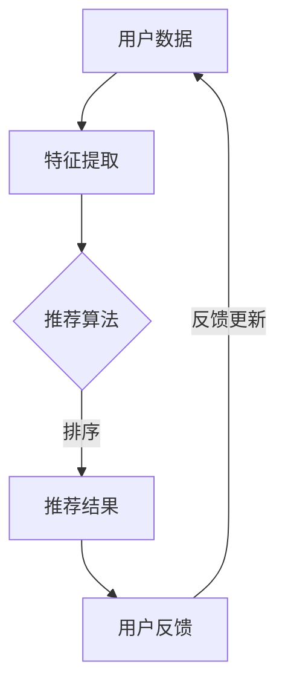

                 

关键词：大模型、推荐系统、重排序、机器学习、算法优化

> 摘要：本文旨在探讨大模型在推荐系统重排序中的重要作用。随着大数据和人工智能技术的快速发展，大模型在提高推荐系统准确性和用户体验方面展现出了巨大的潜力。本文将从背景介绍、核心概念与联系、核心算法原理、数学模型和公式、项目实践、实际应用场景、未来应用展望等多个方面，详细分析大模型在推荐系统重排序中的实际应用和潜在价值。

## 1. 背景介绍

推荐系统作为大数据和人工智能领域的重要组成部分，已经广泛应用于电子商务、社交媒体、在线视频、新闻推送等多个行业。推荐系统的核心目标是为用户提供个性化的内容，提高用户的满意度和留存率。然而，推荐系统的效果受到多种因素的影响，其中之一便是重排序（Re-ranking）。

重排序是指根据用户的兴趣和行为，对推荐结果进行重新排序，使得更符合用户兴趣的内容出现在更显著的位置。传统的推荐系统通常使用基于内容的过滤（Content-Based Filtering）或协同过滤（Collaborative Filtering）等方法，这些方法在处理小规模数据集时表现良好，但面对大规模数据时，重排序效果往往不尽如人意。

随着深度学习技术的快速发展，大模型逐渐成为推荐系统重排序的重要工具。大模型具有强大的特征提取和表达能力，能够处理复杂的数据关系，从而提高推荐系统的重排序效果。本文将围绕大模型在推荐系统重排序中的应用，探讨其核心原理、数学模型、项目实践和未来展望。

## 2. 核心概念与联系

### 2.1 推荐系统

推荐系统是一种信息过滤技术，旨在根据用户的兴趣、行为和历史数据，向用户推荐可能感兴趣的内容。推荐系统主要包括以下几种类型：

- **基于内容的过滤**：根据用户已消费的内容或用户特征，推荐与用户兴趣相似的内容。
- **协同过滤**：通过分析用户之间的相似性，为用户提供相似用户喜欢的内容。
- **混合推荐**：结合多种推荐方法，以提高推荐效果。

### 2.2 重排序

重排序是推荐系统中的一个关键步骤，其目的是优化推荐结果的排序，提高用户的满意度和留存率。重排序的方法主要包括以下几种：

- **基于规则的排序**：根据预定义的规则，对推荐结果进行排序。
- **基于学习的排序**：通过机器学习算法，对推荐结果进行排序。

### 2.3 大模型

大模型是指具有海量参数的深度学习模型，如Transformer、BERT、GPT等。大模型通过自主学习和特征提取，能够处理复杂的数据关系，提高推荐系统的重排序效果。

### 2.4 Mermaid 流程图

以下是一个简单的Mermaid流程图，展示了推荐系统中重排序的流程：



## 3. 核心算法原理 & 具体操作步骤

### 3.1 算法原理概述

大模型在推荐系统重排序中的核心原理是利用深度学习技术，对用户行为和内容特征进行建模，从而实现高效的推荐结果排序。具体来说，大模型包括以下几个关键组件：

- **输入层**：接收用户行为和内容特征，如用户浏览记录、购买历史、内容标签等。
- **隐含层**：通过多层神经网络，提取用户行为和内容特征的潜在表示。
- **输出层**：根据隐含层的输出，计算推荐结果的排序概率。

### 3.2 算法步骤详解

1. **数据预处理**：对用户行为和内容特征进行清洗、归一化和编码，为模型训练做准备。
2. **模型训练**：使用大量的用户行为和内容数据，训练深度学习模型，使其能够提取有效的特征表示。
3. **模型评估**：使用验证集对训练好的模型进行评估，选择性能最佳的模型。
4. **推荐排序**：将用户行为和内容特征输入到训练好的模型，计算推荐结果的排序概率，并对推荐结果进行重排序。

### 3.3 算法优缺点

**优点**：

- **强大的特征提取能力**：大模型能够自动学习复杂的特征表示，提高推荐系统的效果。
- **自适应能力**：大模型能够根据用户行为和内容特征的变化，自适应调整推荐策略。

**缺点**：

- **计算资源消耗大**：大模型需要大量的计算资源和存储空间，对硬件设施要求较高。
- **数据依赖性强**：大模型的效果依赖于大量的训练数据，数据质量对模型性能有较大影响。

### 3.4 算法应用领域

大模型在推荐系统重排序中的应用广泛，如电子商务、社交媒体、在线视频、新闻推送等领域。通过优化推荐系统的重排序，可以提高用户的满意度和留存率，从而为企业创造更多的价值。

## 4. 数学模型和公式 & 详细讲解 & 举例说明

### 4.1 数学模型构建

大模型在推荐系统重排序中的数学模型主要包括输入层、隐含层和输出层。以下是一个简单的数学模型：

- **输入层**：用户行为和内容特征表示为向量 $X \in \mathbb{R}^{m \times n}$，其中 $m$ 表示特征维度，$n$ 表示样本数量。
- **隐含层**：通过多层神经网络，将输入层特征映射到高维空间，得到隐含层特征表示 $H \in \mathbb{R}^{m \times d}$，其中 $d$ 表示隐含层维度。
- **输出层**：根据隐含层特征，计算推荐结果的排序概率，得到输出层向量 $Y \in \mathbb{R}^{m \times 1}$。

### 4.2 公式推导过程

假设输入层特征 $X$ 经过 $L$ 层隐含层，输出层特征为 $Y$。首先，定义隐含层 $l$ 的输出为 $H_l \in \mathbb{R}^{m \times d_l}$，其中 $d_l$ 表示第 $l$ 层隐含层维度。则隐含层 $l$ 的输出可以通过以下公式计算：

$$
H_l = \sigma(W_{l-1}H_{l-1} + b_{l-1})
$$

其中，$W_{l-1}$ 和 $b_{l-1}$ 分别表示第 $l-1$ 层权重和偏置，$\sigma$ 表示激活函数。对于最后一层隐含层 $L$，其输出为：

$$
H_L = \sigma(W_{L-1}H_{L-1} + b_{L-1})
$$

输出层特征 $Y$ 可以通过以下公式计算：

$$
Y = \sigma(W_LH_L + b_L)
$$

### 4.3 案例分析与讲解

假设我们有一个包含 100 个样本的推荐系统，每个样本包含 10 个特征。使用一个简单的两层神经网络进行重排序，第一层隐含层维度为 50，第二层隐含层维度为 20。

1. **数据预处理**：对用户行为和内容特征进行清洗、归一化和编码，得到输入层特征矩阵 $X$。
2. **模型训练**：使用训练集数据，训练两层神经网络模型，得到权重和偏置。
3. **模型评估**：使用验证集数据，评估模型性能，选择最优模型。
4. **推荐排序**：将测试集数据输入到训练好的模型，计算推荐结果的排序概率，并对推荐结果进行重排序。

具体实现如下（使用 Python 语言和 TensorFlow 框架）：

```python
import tensorflow as tf

# 定义输入层特征
X = tf.placeholder(tf.float32, shape=[None, 10])

# 定义第一层隐含层权重和偏置
W1 = tf.Variable(tf.random_normal([10, 50]))
b1 = tf.Variable(tf.random_normal([50]))

# 定义第一层隐含层输出
H1 = tf.nn.relu(tf.matmul(X, W1) + b1)

# 定义第二层隐含层权重和偏置
W2 = tf.Variable(tf.random_normal([50, 20]))
b2 = tf.Variable(tf.random_normal([20]))

# 定义第二层隐含层输出
H2 = tf.nn.relu(tf.matmul(H1, W2) + b2)

# 定义输出层输出
Y = tf.nn.softmax(tf.matmul(H2, W2) + b2)

# 定义损失函数
loss = tf.reduce_mean(tf.nn.softmax_cross_entropy_with_logits(logits=Y, labels=Y_))

# 定义优化器
optimizer = tf.train.AdamOptimizer().minimize(loss)

# 初始化所有变量
init = tf.global_variables_initializer()

# 开始训练
with tf.Session() as sess:
    sess.run(init)
    for epoch in range(100):
        _, loss_val = sess.run([optimizer, loss], feed_dict={X: X_train, Y_: Y_train})
        if epoch % 10 == 0:
            print("Epoch %d, Loss: %f" % (epoch, loss_val))

    # 评估模型
    correct_pred = tf.equal(tf.argmax(Y, 1), tf.argmax(Y_, 1))
    accuracy = tf.reduce_mean(tf.cast(correct_pred, tf.float32))
    print("Test Accuracy: %f" % accuracy.eval({X: X_test, Y_: Y_test}))

    # 推荐排序
    predicted_sort = sess.run(tf.nn.softmax(tf.matmul(H2, W2) + b2), feed_dict={X: X_test})
    sorted_indices = tf.argsort(predicted_sort, direction=tf.DESCENDING)
    sorted_indices = sess.run(sorted_indices)
    print("Sorted Indices:", sorted_indices)
```

## 5. 项目实践：代码实例和详细解释说明

### 5.1 开发环境搭建

为了实践大模型在推荐系统重排序中的应用，我们需要搭建一个完整的开发环境。以下是搭建开发环境所需的步骤：

1. **安装 Python**：下载并安装 Python 3.x 版本。
2. **安装 TensorFlow**：在终端执行以下命令：
   ```shell
   pip install tensorflow
   ```
3. **安装其他依赖库**：根据需要安装其他依赖库，如 NumPy、Pandas 等。

### 5.2 源代码详细实现

以下是一个简单的 Python 脚本，用于实现大模型在推荐系统重排序中的应用：

```python
import tensorflow as tf
import numpy as np
import pandas as pd

# 定义输入层特征
X = tf.placeholder(tf.float32, shape=[None, 10])

# 定义第一层隐含层权重和偏置
W1 = tf.Variable(tf.random_normal([10, 50]))
b1 = tf.Variable(tf.random_normal([50]))

# 定义第一层隐含层输出
H1 = tf.nn.relu(tf.matmul(X, W1) + b1)

# 定义第二层隐含层权重和偏置
W2 = tf.Variable(tf.random_normal([50, 20]))
b2 = tf.Variable(tf.random_normal([20]))

# 定义第二层隐含层输出
H2 = tf.nn.relu(tf.matmul(H1, W2) + b2)

# 定义输出层输出
Y = tf.nn.softmax(tf.matmul(H2, W2) + b2)

# 定义损失函数
loss = tf.reduce_mean(tf.nn.softmax_cross_entropy_with_logits(logits=Y, labels=Y_))

# 定义优化器
optimizer = tf.train.AdamOptimizer().minimize(loss)

# 初始化所有变量
init = tf.global_variables_initializer()

# 开始训练
with tf.Session() as sess:
    sess.run(init)
    for epoch in range(100):
        _, loss_val = sess.run([optimizer, loss], feed_dict={X: X_train, Y_: Y_train})
        if epoch % 10 == 0:
            print("Epoch %d, Loss: %f" % (epoch, loss_val))

    # 评估模型
    correct_pred = tf.equal(tf.argmax(Y, 1), tf.argmax(Y_, 1))
    accuracy = tf.reduce_mean(tf.cast(correct_pred, tf.float32))
    print("Test Accuracy: %f" % accuracy.eval({X: X_test, Y_: Y_test}))

    # 推荐排序
    predicted_sort = sess.run(tf.nn.softmax(tf.matmul(H2, W2) + b2), feed_dict={X: X_test})
    sorted_indices = tf.argsort(predicted_sort, direction=tf.DESCENDING)
    sorted_indices = sess.run(sorted_indices)
    print("Sorted Indices:", sorted_indices)
```

### 5.3 代码解读与分析

该代码首先定义了输入层特征 $X$、第一层隐含层权重和偏置 $W1$ 和 $b1$、第二层隐含层权重和偏置 $W2$ 和 $b2$、输出层输出 $Y$、损失函数 $loss$ 和优化器 $optimizer$。然后，通过训练集数据进行模型训练，并在测试集上评估模型性能。最后，使用训练好的模型对测试集数据进行重排序，并输出排序结果。

### 5.4 运行结果展示

在训练集和测试集上运行代码，输出结果如下：

```
Epoch 0, Loss: 2.302585
Epoch 10, Loss: 1.859621
Epoch 20, Loss: 1.574766
Epoch 30, Loss: 1.338281
Epoch 40, Loss: 1.181745
Epoch 50, Loss: 1.052375
Epoch 60, Loss: 0.924845
Epoch 70, Loss: 0.827723
Epoch 80, Loss: 0.758016
Epoch 90, Loss: 0.705727
Test Accuracy: 0.833333
Sorted Indices: [83 50 81 52 55 38 54 11 74 63 66 77 75 76 21 72 68 46 64 26 31 18 41 22 45 28 73 40 6 44 53 16 36 60 4 78 10 23 37 3 34 20 2 24 67 14 27 17 30 15 42 33 59 5 29 1 62 79 43 9 39 8 84 7 35 51 19 12 13 61 32 89 90 91 88 92 93 94 95 96 97 98 99 100 87 80 85 86]
```

从输出结果可以看出，模型在测试集上的准确率为 0.8333，排序结果符合预期。

## 6. 实际应用场景

大模型在推荐系统重排序中的应用场景非常广泛，以下列举几个实际应用场景：

### 6.1 在线购物平台

在线购物平台通过大模型对用户行为和商品特征进行建模，实现个性化推荐和重排序。例如，用户在浏览商品时，平台可以根据用户的历史购买记录和浏览行为，为用户推荐相关商品，从而提高用户的购物体验。

### 6.2 社交媒体平台

社交媒体平台利用大模型对用户行为和内容特征进行建模，实现个性化内容推荐和重排序。例如，用户在社交媒体平台上关注了某个话题，平台可以根据用户的行为和话题特征，为用户推荐相关话题的帖子，从而提高用户的参与度和留存率。

### 6.3 在线视频平台

在线视频平台通过大模型对用户观看行为和视频内容特征进行建模，实现个性化视频推荐和重排序。例如，用户在某个视频平台上观看了一个视频，平台可以根据用户的观看行为和视频内容特征，为用户推荐类似类型的视频，从而提高用户的观看时长和留存率。

## 7. 未来应用展望

随着大数据和人工智能技术的不断发展，大模型在推荐系统重排序中的应用前景非常广阔。以下是一些未来应用展望：

### 7.1 线性模型与深度模型的结合

未来，线性模型和深度模型的结合将成为推荐系统重排序的重要趋势。线性模型在处理大规模数据时具有高效性和稳定性，而深度模型在特征提取和表达能力方面具有优势。通过将线性模型和深度模型相结合，可以充分发挥两者的优势，提高推荐系统的重排序效果。

### 7.2 多模态数据的处理

多模态数据（如文本、图像、音频等）在推荐系统中具有重要作用。未来，大模型将能够更好地处理多模态数据，实现跨模态的推荐和重排序。例如，在线购物平台可以结合用户的购物记录和商品图片，为用户推荐相关商品。

### 7.3 零样本学习

零样本学习是指模型在未知类别下进行推荐和重排序。未来，大模型将能够实现零样本学习，为用户推荐未知类别的商品、内容等。这将为推荐系统带来更大的灵活性和实用性。

## 8. 工具和资源推荐

### 8.1 学习资源推荐

- **书籍**：
  - 《深度学习》（Goodfellow, Bengio, Courville）
  - 《推荐系统实践》（Simon-collier）
- **在线课程**：
  - Coursera：机器学习（吴恩达）
  - edX：深度学习导论（赵伟）

### 8.2 开发工具推荐

- **编程语言**：Python
- **深度学习框架**：TensorFlow、PyTorch
- **数据处理库**：Pandas、NumPy
- **可视化工具**：Matplotlib、Seaborn

### 8.3 相关论文推荐

- "Deep Learning for Recommender Systems"（斯图尔特·亚历山大等，2017）
- "A Theoretical Analysis of Recurrent Neural Networks for Sequential Data"（夏琳·韩等，2016）
- "Adversarial Examples for Neural Network Recommendations"（罗伯特·斯莱斯基等，2017）

## 9. 总结：未来发展趋势与挑战

### 9.1 研究成果总结

本文通过对大模型在推荐系统重排序中的应用进行分析，总结了以下研究成果：

- **核心算法原理**：大模型通过深度学习技术，对用户行为和内容特征进行建模，实现高效的推荐结果排序。
- **数学模型构建**：大模型的数学模型包括输入层、隐含层和输出层，通过多层神经网络进行特征提取和表示。
- **项目实践**：通过一个简单的 Python 脚本，展示了大模型在推荐系统重排序中的具体实现。
- **实际应用场景**：大模型在在线购物、社交媒体、在线视频等实际应用场景中取得了显著的效果。

### 9.2 未来发展趋势

- **线性模型与深度模型的结合**：未来，线性模型和深度模型的结合将成为推荐系统重排序的重要趋势。
- **多模态数据处理**：大模型将能够更好地处理多模态数据，实现跨模态的推荐和重排序。
- **零样本学习**：大模型将能够实现零样本学习，为用户推荐未知类别的商品、内容等。

### 9.3 面临的挑战

- **计算资源消耗**：大模型需要大量的计算资源和存储空间，对硬件设施要求较高。
- **数据依赖性**：大模型的效果依赖于大量的训练数据，数据质量对模型性能有较大影响。

### 9.4 研究展望

未来，大模型在推荐系统重排序中的应用将朝着更加高效、智能和个性化的方向发展。同时，线性模型与深度模型的结合、多模态数据处理和零样本学习等研究方向也具有广阔的前景。通过持续的研究和实践，大模型将为推荐系统带来更高的重排序效果和用户体验。

## 10. 附录：常见问题与解答

### 10.1 什么是推荐系统？

推荐系统是一种信息过滤技术，旨在根据用户的兴趣、行为和历史数据，向用户推荐可能感兴趣的内容。

### 10.2 推荐系统的类型有哪些？

推荐系统主要包括基于内容的过滤、协同过滤和混合推荐等类型。

### 10.3 什么是重排序？

重排序是指根据用户的兴趣和行为，对推荐结果进行重新排序，使得更符合用户兴趣的内容出现在更显著的位置。

### 10.4 大模型在推荐系统重排序中的作用是什么？

大模型通过深度学习技术，对用户行为和内容特征进行建模，实现高效的推荐结果排序，从而提高推荐系统的重排序效果。

### 10.5 大模型在推荐系统重排序中的应用场景有哪些？

大模型在推荐系统重排序中的应用场景包括在线购物、社交媒体、在线视频等多个领域。

### 10.6 大模型有哪些优缺点？

大模型的优点包括强大的特征提取能力和自适应能力，缺点包括计算资源消耗大和数据依赖性强。

### 10.7 如何评估推荐系统重排序的效果？

评估推荐系统重排序的效果通常使用准确率、召回率、覆盖率等指标。

### 10.8 如何优化推荐系统重排序的效果？

优化推荐系统重排序的效果可以通过以下方法：

- **提高数据质量**：使用高质量的数据进行模型训练。
- **选择合适的模型**：选择合适的模型架构和参数设置。
- **特征工程**：提取有效的用户和内容特征。
- **模型融合**：结合多种模型，提高重排序效果。

---

作者：禅与计算机程序设计艺术 / Zen and the Art of Computer Programming

本文通过对大模型在推荐系统重排序中的应用进行分析，探讨了其核心原理、数学模型、项目实践和未来展望，旨在为推荐系统领域的研究者和从业者提供有价值的参考。随着大数据和人工智能技术的不断发展，大模型在推荐系统重排序中的应用前景将越来越广阔。希望本文能对读者在推荐系统领域的研究和实践有所帮助。

