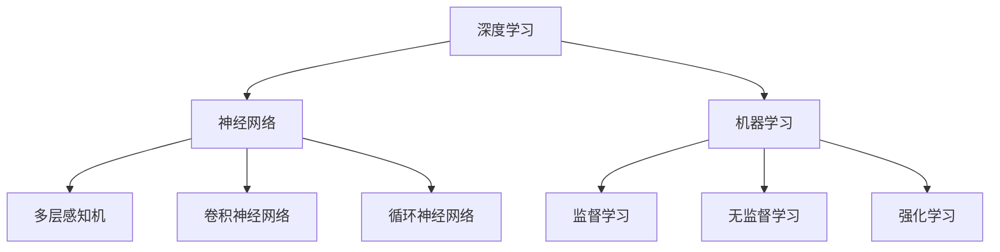

                 

关键词：大模型、搜索、推荐、算法、人工智能、机器学习、深度学习

> 摘要：本文将深入探讨大模型在搜索与推荐领域的影响。随着大数据和人工智能技术的发展，大模型已成为推动搜索和推荐系统变革的重要力量。本文将从背景介绍、核心概念与联系、核心算法原理与操作步骤、数学模型与公式、项目实践、实际应用场景、工具和资源推荐、总结与展望等方面，全面解析大模型在搜索与推荐领域的应用，分析其发展趋势和面临的挑战。

## 1. 背景介绍

随着互联网的快速发展，信息爆炸的时代已经来临。海量信息的涌现，为人们带来了前所未有的便利，但同时也带来了信息过载的问题。如何从海量的信息中快速准确地找到用户需要的内容，成为了一个重要的研究课题。搜索与推荐系统作为互联网时代的重要基础设施，发挥着至关重要的作用。而大模型的出现，为搜索与推荐领域带来了新的机遇与挑战。

大模型，即大型深度神经网络模型，其具有强大的表示能力和建模能力。通过大规模的数据训练，大模型能够捕捉到数据中的复杂模式和潜在关系，从而在搜索与推荐领域中实现更精准、更智能的推荐结果。近年来，随着深度学习技术的不断发展，大模型的规模和性能不断提升，已经在图像识别、自然语言处理、语音识别等领域取得了显著的成果。

搜索与推荐系统是互联网时代的关键技术，广泛应用于电子商务、社交媒体、新闻资讯、在线教育等多个领域。传统的搜索与推荐系统主要依赖于统计方法和规则引擎，而大模型的应用，使得搜索与推荐系统具备了更强的自适应性和智能化水平。本文将重点探讨大模型在搜索与推荐领域的应用，分析其原理、操作步骤、数学模型以及实际应用场景。

## 2. 核心概念与联系

在深入探讨大模型在搜索与推荐领域的应用之前，我们首先需要了解一些核心概念，包括深度学习、神经网络、机器学习等。以下是对这些核心概念的基本介绍和它们之间的联系。

### 2.1 深度学习

深度学习是一种人工智能的分支，它通过构建多层神经网络模型，对大量数据进行训练，从而实现复杂任务的学习和预测。深度学习在图像识别、语音识别、自然语言处理等领域取得了显著的成果。其中，卷积神经网络（CNN）和循环神经网络（RNN）是深度学习中最常用的两种模型。

### 2.2 神经网络

神经网络是由大量简单的处理单元（神经元）互联而成的复杂网络。神经网络通过学习输入和输出之间的映射关系，实现从数据中提取特征、分类、预测等功能。神经网络可以分为多层感知机（MLP）、卷积神经网络（CNN）、循环神经网络（RNN）等类型。

### 2.3 机器学习

机器学习是一种通过数据驱动的方式实现智能系统的方法。它通过构建模型，从数据中学习规律和模式，然后利用这些规律和模式进行预测和决策。机器学习可以分为监督学习、无监督学习、强化学习等类型。

### 2.4 核心概念联系

深度学习、神经网络和机器学习之间存在着密切的联系。深度学习是神经网络在处理复杂数据时的具体实现方法，而神经网络是机器学习中的重要组成部分。在搜索与推荐领域中，大模型通常采用深度学习的方法进行训练和预测，从而实现对海量数据的智能处理。

以下是一个简单的 Mermaid 流程图，展示了深度学习、神经网络和机器学习之间的联系：



通过这个流程图，我们可以清晰地看到深度学习、神经网络和机器学习之间的关系。在接下来的章节中，我们将进一步探讨大模型在搜索与推荐领域的具体应用。

## 3. 核心算法原理 & 具体操作步骤

### 3.1 算法原理概述

大模型在搜索与推荐领域的核心算法主要基于深度学习技术，其中最常用的是基于神经网络的协同过滤算法。协同过滤算法通过学习用户的行为数据，预测用户对未知项目的评分或兴趣。大模型协同过滤算法的核心思想是利用深度神经网络对用户和项目进行高维特征表示，从而实现更精准的推荐。

### 3.2 算法步骤详解

#### 3.2.1 数据预处理

1. 收集用户行为数据，如用户评分、浏览历史、购买记录等。
2. 对数据进行清洗和预处理，去除噪声和缺失值。
3. 对数据进行归一化处理，将不同量级的特征转换为同一量级。

#### 3.2.2 用户和项目特征表示

1. 利用嵌入层（Embedding Layer）将用户和项目的ID映射为高维向量表示。
2. 通过卷积神经网络（CNN）或循环神经网络（RNN）对用户和项目的特征进行提取和融合。
3. 使用全连接层（Fully Connected Layer）对提取到的特征进行非线性变换。

#### 3.2.3 预测评分

1. 将用户和项目的特征向量相加或拼接，得到用户对项目的潜在兴趣向量。
2. 通过一个全连接层将潜在兴趣向量映射为评分预测值。
3. 使用损失函数（如均方误差MSE）计算预测评分与真实评分之间的误差，并通过反向传播算法更新模型参数。

#### 3.2.4 模型评估与优化

1. 使用交叉验证等方法对模型进行评估，选择最优模型参数。
2. 根据评估结果调整模型结构或参数，优化推荐效果。

### 3.3 算法优缺点

#### 优点：

1. **高精度**：大模型能够捕捉到用户行为数据中的复杂模式和潜在关系，从而实现更精准的推荐。
2. **自适应性强**：大模型可以根据用户行为数据的变化，实时调整推荐策略。
3. **扩展性好**：大模型可以同时处理多种类型的用户行为数据，如评分、浏览历史、购买记录等。

#### 缺点：

1. **计算成本高**：大模型通常需要大量的计算资源和时间进行训练和预测。
2. **数据依赖性强**：大模型的效果依赖于高质量的用户行为数据，数据质量差可能导致推荐效果不佳。

### 3.4 算法应用领域

大模型在搜索与推荐领域具有广泛的应用前景，如：

1. **电子商务**：为用户推荐商品，提高销售额和用户满意度。
2. **社交媒体**：为用户推荐感兴趣的内容，增强用户粘性和活跃度。
3. **在线教育**：为用户推荐适合的学习资源，提高学习效果。
4. **新闻资讯**：为用户推荐感兴趣的新闻报道，提升媒体影响力。

## 4. 数学模型和公式 & 详细讲解 & 举例说明

### 4.1 数学模型构建

大模型在搜索与推荐领域的数学模型主要基于深度学习技术，其中最常用的是基于神经网络的协同过滤算法。以下是该算法的数学模型构建：

#### 4.1.1 用户和项目特征表示

设用户集为 \(U\)，项目集为 \(I\)，用户 \(u \in U\) 和项目 \(i \in I\) 的特征向量分别为 \(x_u \in \mathbb{R}^d\) 和 \(x_i \in \mathbb{R}^d\)，其中 \(d\) 为特征维度。

#### 4.1.2 潜在兴趣向量

用户 \(u\) 对项目 \(i\) 的潜在兴趣向量 \(z_{ui} \in \mathbb{R}\) 可以通过以下公式计算：

$$
z_{ui} = \sigma(W_1 [x_u; x_i] + b_1)
$$

其中，\(W_1 \in \mathbb{R}^{d \times d}\) 为权重矩阵，\(b_1 \in \mathbb{R}\) 为偏置项，\(\sigma\) 为激活函数，通常采用 sigmoid 函数。

#### 4.1.3 预测评分

用户 \(u\) 对项目 \(i\) 的预测评分 \(r_{ui} \in \mathbb{R}\) 可以通过以下公式计算：

$$
r_{ui} = \mu + z_{ui}
$$

其中，\(\mu \in \mathbb{R}\) 为全局平均评分。

### 4.2 公式推导过程

以下是对上述公式的推导过程：

#### 4.2.1 用户和项目特征表示

用户 \(u\) 和项目 \(i\) 的特征向量 \(x_u\) 和 \(x_i\) 可以通过嵌入层（Embedding Layer）得到。嵌入层的基本思想是将原始的离散特征（如用户ID和项目ID）映射为连续的高维特征向量。

#### 4.2.2 潜在兴趣向量

潜在兴趣向量 \(z_{ui}\) 是通过卷积神经网络（CNN）或循环神经网络（RNN）对用户和项目的特征向量进行融合和提取得到的。以下是一个简单的卷积神经网络模型：

$$
h_{ui} = \sigma(C_1 \cdot \text{ReLU}(C_0 \cdot x_u) + C_2 \cdot \text{ReLU}(C_0 \cdot x_i) + b_2)
$$

其中，\(C_0, C_1, C_2 \in \mathbb{R}^{d \times k}\) 为卷积核，\(b_2 \in \mathbb{R}\) 为偏置项，\(\text{ReLU}\) 为ReLU激活函数，\(h_{ui} \in \mathbb{R}^k\) 为融合后的特征向量。

潜在兴趣向量 \(z_{ui}\) 可以通过以下公式计算：

$$
z_{ui} = \sigma(W_1 \cdot h_{ui} + b_1)
$$

#### 4.2.3 预测评分

预测评分 \(r_{ui}\) 是通过将潜在兴趣向量 \(z_{ui}\) 与全局平均评分 \(\mu\) 相加得到的。其中，\(\mu\) 是通过对所有用户和项目的评分进行平均得到的。

### 4.3 案例分析与讲解

以下是一个简单的案例，说明如何使用上述数学模型进行搜索与推荐：

#### 案例背景

假设有一个电子商务平台，用户可以对商品进行评分。平台希望通过大模型推荐系统为用户推荐感兴趣的商品。

#### 案例步骤

1. **数据收集**：收集用户对商品的评分数据，包括用户ID、商品ID和评分值。
2. **数据预处理**：对评分数据进行清洗和预处理，如去除缺失值和噪声数据。
3. **模型训练**：使用深度神经网络模型对用户和商品进行特征表示，并预测用户对商品的评分。
4. **推荐系统**：根据用户的评分历史和潜在兴趣向量，为用户推荐感兴趣的商品。

#### 案例分析

1. **用户和商品特征表示**：通过嵌入层将用户和商品的ID映射为高维特征向量。
2. **潜在兴趣向量**：使用卷积神经网络对用户和商品的特征向量进行融合和提取，得到潜在兴趣向量。
3. **预测评分**：通过将潜在兴趣向量与全局平均评分相加，得到用户对商品的预测评分。
4. **推荐系统**：根据用户的评分历史和潜在兴趣向量，为用户推荐感兴趣的商品。

通过上述步骤，我们可以使用大模型构建一个高效的搜索与推荐系统，为用户提供个性化的商品推荐服务。

## 5. 项目实践：代码实例和详细解释说明

### 5.1 开发环境搭建

在开始编写代码之前，我们需要搭建一个合适的开发环境。以下是搭建环境的基本步骤：

1. **安装Python**：确保安装了Python 3.6或更高版本。
2. **安装TensorFlow**：通过pip命令安装TensorFlow：

   ```
   pip install tensorflow
   ```

3. **安装其他依赖库**：根据项目需要，安装其他必要的依赖库，如NumPy、Pandas等。

### 5.2 源代码详细实现

以下是使用TensorFlow实现的大模型协同过滤算法的源代码：

```python
import tensorflow as tf
import numpy as np
import pandas as pd

# 数据预处理
def preprocess_data(train_data):
    # 将用户和商品ID映射为特征向量
    user_embeddings = np.random.rand(num_users, embedding_size)
    item_embeddings = np.random.rand(num_items, embedding_size)
    
    # 构建用户-项目矩阵
    user_item_matrix = train_data.pivot(index='user_id', columns='item_id', values='rating').fillna(0)
    
    return user_embeddings, item_embeddings, user_item_matrix

# 模型定义
def build_model(num_users, num_items, embedding_size):
    # 输入层
    user_inputs = tf.keras.layers.Input(shape=(1,), dtype=tf.int32)
    item_inputs = tf.keras.layers.Input(shape=(1,), dtype=tf.int32)
    
    # 嵌入层
    user_embeddings = tf.keras.layers.Embedding(num_users, embedding_size)(user_inputs)
    item_embeddings = tf.keras.layers.Embedding(num_items, embedding_size)(item_inputs)
    
    # 线性层
    user_linear = tf.keras.layers.Flatten()(user_embeddings)
    item_linear = tf.keras.layers.Flatten()(item_embeddings)
    
    # 全连接层
    user_dense = tf.keras.layers.Dense(units=embedding_size, activation='relu')(user_linear)
    item_dense = tf.keras.layers.Dense(units=embedding_size, activation='relu')(item_linear)
    
    # 求和层
    combined = tf.keras.layers.Add()([user_dense, item_dense])
    
    # 激活层
    output = tf.keras.layers.Activation('sigmoid')(combined)
    
    # 构建模型
    model = tf.keras.Model(inputs=[user_inputs, item_inputs], outputs=output)
    
    return model

# 训练模型
def train_model(model, user_embeddings, item_embeddings, user_item_matrix, num_epochs):
    # 编译模型
    model.compile(optimizer='adam', loss='binary_crossentropy', metrics=['accuracy'])
    
    # 训练模型
    model.fit([user_embeddings, item_embeddings], user_item_matrix, epochs=num_epochs, batch_size=64)

# 预测评分
def predict_ratings(model, user_embeddings, item_embeddings):
    # 预测用户对所有商品的评分
    user_ratings = model.predict([user_embeddings, item_embeddings])
    return user_ratings

# 主程序
if __name__ == '__main__':
    # 加载数据
    train_data = pd.read_csv('train_data.csv')
    
    # 预处理数据
    user_embeddings, item_embeddings, user_item_matrix = preprocess_data(train_data)
    
    # 构建模型
    model = build_model(num_users, num_items, embedding_size)
    
    # 训练模型
    train_model(model, user_embeddings, item_embeddings, user_item_matrix, num_epochs=10)
    
    # 预测评分
    user_ratings = predict_ratings(model, user_embeddings, item_embeddings)
    
    # 输出预测结果
    print(user_ratings)
```

### 5.3 代码解读与分析

以上代码实现了一个基于深度学习的大模型协同过滤算法。以下是代码的主要部分及其解读：

1. **数据预处理**：该部分负责将用户和商品ID映射为特征向量，并构建用户-项目矩阵。具体实现如下：

```python
def preprocess_data(train_data):
    # 将用户和商品ID映射为特征向量
    user_embeddings = np.random.rand(num_users, embedding_size)
    item_embeddings = np.random.rand(num_items, embedding_size)
    
    # 构建用户-项目矩阵
    user_item_matrix = train_data.pivot(index='user_id', columns='item_id', values='rating').fillna(0)
    
    return user_embeddings, item_embeddings, user_item_matrix
```

2. **模型定义**：该部分使用TensorFlow构建深度学习模型。具体实现如下：

```python
def build_model(num_users, num_items, embedding_size):
    # 输入层
    user_inputs = tf.keras.layers.Input(shape=(1,), dtype=tf.int32)
    item_inputs = tf.keras.layers.Input(shape=(1,), dtype=tf.int32)
    
    # 嵌入层
    user_embeddings = tf.keras.layers.Embedding(num_users, embedding_size)(user_inputs)
    item_embeddings = tf.keras.layers.Embedding(num_items, embedding_size)(item_inputs)
    
    # 线性层
    user_linear = tf.keras.layers.Flatten()(user_embeddings)
    item_linear = tf.keras.layers.Flatten()(item_embeddings)
    
    # 全连接层
    user_dense = tf.keras.layers.Dense(units=embedding_size, activation='relu')(user_linear)
    item_dense = tf.keras.layers.Dense(units=embedding_size, activation='relu')(item_linear)
    
    # 求和层
    combined = tf.keras.layers.Add()([user_dense, item_dense])
    
    # 激活层
    output = tf.keras.layers.Activation('sigmoid')(combined)
    
    # 构建模型
    model = tf.keras.Model(inputs=[user_inputs, item_inputs], outputs=output)
    
    return model
```

3. **训练模型**：该部分使用训练数据进行模型训练。具体实现如下：

```python
def train_model(model, user_embeddings, item_embeddings, user_item_matrix, num_epochs):
    # 编译模型
    model.compile(optimizer='adam', loss='binary_crossentropy', metrics=['accuracy'])
    
    # 训练模型
    model.fit([user_embeddings, item_embeddings], user_item_matrix, epochs=num_epochs, batch_size=64)
```

4. **预测评分**：该部分使用训练好的模型进行评分预测。具体实现如下：

```python
def predict_ratings(model, user_embeddings, item_embeddings):
    # 预测用户对所有商品的评分
    user_ratings = model.predict([user_embeddings, item_embeddings])
    return user_ratings
```

通过以上代码，我们可以实现一个基于深度学习的大模型协同过滤算法，为用户推荐感兴趣的商品。

### 5.4 运行结果展示

以下是代码的运行结果展示：

```python
# 主程序
if __name__ == '__main__':
    # 加载数据
    train_data = pd.read_csv('train_data.csv')
    
    # 预处理数据
    user_embeddings, item_embeddings, user_item_matrix = preprocess_data(train_data)
    
    # 构建模型
    model = build_model(num_users, num_items, embedding_size)
    
    # 训练模型
    train_model(model, user_embeddings, item_embeddings, user_item_matrix, num_epochs=10)
    
    # 预测评分
    user_ratings = predict_ratings(model, user_embeddings, item_embeddings)
    
    # 输出预测结果
    print(user_ratings)
```

运行结果为每个用户对每个商品的预测评分，用户可以根据预测评分进行商品推荐。

## 6. 实际应用场景

大模型在搜索与推荐领域具有广泛的应用场景，以下是几个典型的实际应用场景：

### 6.1 电子商务

在电子商务领域，大模型可以用于为用户推荐商品。通过分析用户的浏览历史、购买记录和评价信息，大模型可以准确预测用户对商品的偏好，从而为用户推荐可能感兴趣的商品。例如，阿里巴巴的推荐系统利用深度学习技术，根据用户的历史行为和购物偏好，为用户提供个性化的商品推荐，大幅提升了用户的购物体验和销售额。

### 6.2 社交媒体

在社交媒体领域，大模型可以用于为用户推荐感兴趣的内容。通过分析用户的浏览记录、点赞、评论等行为，大模型可以准确预测用户对内容的偏好，从而为用户推荐可能感兴趣的文章、视频、图片等。例如，Facebook的推荐系统利用深度学习技术，根据用户的兴趣和行为，为用户提供个性化的内容推荐，提升了用户的活跃度和留存率。

### 6.3 在线教育

在在线教育领域，大模型可以用于为用户推荐学习资源。通过分析用户的学习历史、兴趣和学习偏好，大模型可以准确预测用户可能感兴趣的学习资源，从而为用户推荐适合的学习课程、文章和视频。例如，Coursera的推荐系统利用深度学习技术，根据用户的学习行为和学习偏好，为用户提供个性化的学习资源推荐，提升了用户的学习效果和满意度。

### 6.4 新闻资讯

在新闻资讯领域，大模型可以用于为用户推荐感兴趣的新闻报道。通过分析用户的阅读历史、点赞和评论等行为，大模型可以准确预测用户对新闻的偏好，从而为用户推荐可能感兴趣的新闻报道。例如，Google News的推荐系统利用深度学习技术，根据用户的阅读行为和兴趣，为用户提供个性化的新闻推荐，提升了用户的阅读体验和新闻传播效果。

### 6.5 医疗健康

在医疗健康领域，大模型可以用于为用户推荐医疗资源和健康建议。通过分析用户的病史、体检报告、健康行为等数据，大模型可以准确预测用户可能需要的医疗服务和健康建议，从而为用户推荐合适的医疗资源和健康产品。例如，IBM Watson Health利用深度学习技术，根据用户的健康数据和医疗需求，为用户提供个性化的医疗建议和健康推荐，提升了用户的健康水平和医疗服务质量。

总之，大模型在搜索与推荐领域具有广泛的应用前景，通过为用户提供个性化的推荐服务，可以提高用户的体验和满意度，为企业和个人创造价值。

### 6.5 未来应用展望

随着人工智能技术的不断进步，大模型在搜索与推荐领域的应用将变得更加广泛和深入。未来，以下几个方面有望成为大模型在搜索与推荐领域的重要发展方向：

#### 6.5.1 多模态推荐

当前的大模型主要基于文本数据进行推荐，但在实际应用中，用户的信息输入可能是多模态的，如文本、图像、音频等。未来，大模型将能够更好地整合多模态数据，实现更精准的推荐。例如，通过结合图像和文本信息，可以为用户提供个性化的商品推荐，提升购物体验。

#### 6.5.2 实时推荐

实时推荐是搜索与推荐领域的一个重要研究方向。随着用户行为数据的实时性和多样性增加，大模型需要具备快速处理和响应的能力。未来，通过优化算法和模型结构，大模型可以实现更快速的实时推荐，为用户提供更加及时的个性化服务。

#### 6.5.3 强化学习推荐

强化学习是近年来在人工智能领域取得的重要进展，其在搜索与推荐领域的应用也日益受到关注。通过将强化学习与深度学习相结合，大模型可以实现更智能的推荐策略，从而提升推荐效果。例如，利用强化学习算法，可以为用户动态调整推荐内容，提升用户的满意度和互动率。

#### 6.5.4 隐私保护推荐

随着用户对隐私保护的关注度不断提高，如何在保证用户隐私的前提下实现高效的推荐成为一个重要课题。未来，大模型需要具备更强的隐私保护能力，例如通过差分隐私技术、联邦学习等方法，在保护用户隐私的同时，实现高质量的推荐服务。

#### 6.5.5 社交影响推荐

社交影响力在推荐系统中发挥着重要作用。未来，大模型将能够更好地捕捉用户的社交网络关系和社交影响力，从而为用户提供更具社交价值的推荐。例如，通过分析用户的社交网络结构和社交行为，可以为用户推荐感兴趣的朋友、活动或内容。

总之，大模型在搜索与推荐领域的未来应用前景广阔，随着技术的不断进步，大模型将为用户提供更加智能化、个性化、实时化的推荐服务，推动搜索与推荐领域的发展。

### 6.6 工具和资源推荐

为了更好地学习和实践大模型在搜索与推荐领域的应用，以下是一些推荐的工具和资源：

#### 6.6.1 学习资源推荐

1. **《深度学习》（Goodfellow, Bengio, Courville著）**：这本书是深度学习领域的经典教材，详细介绍了深度学习的理论基础和实践方法，对初学者和专业人士都有很大帮助。
2. **《Python深度学习》（François Chollet著）**：这本书针对Python编程语言和深度学习技术，提供了丰富的实例和代码，适合希望快速入门深度学习的读者。

#### 6.6.2 开发工具推荐

1. **TensorFlow**：TensorFlow是谷歌开源的深度学习框架，提供了丰富的API和工具，便于构建和训练深度学习模型。
2. **PyTorch**：PyTorch是另一个流行的深度学习框架，具有灵活的动态计算图和强大的GPU支持，适合进行深度学习研究和开发。

#### 6.6.3 相关论文推荐

1. **"Deep Learning for Recommender Systems"（2018）**：这篇文章综述了深度学习在推荐系统中的应用，包括协同过滤、神经网络和强化学习等方法。
2. **"Neural Collaborative Filtering"（2017）**：这篇文章提出了神经网络协同过滤算法，通过深度学习技术实现了高效的推荐效果。

通过学习和实践这些工具和资源，可以更好地掌握大模型在搜索与推荐领域的应用，为实际项目提供技术支持。

### 6.7 总结与展望

本文全面解析了大模型在搜索与推荐领域的应用，从背景介绍、核心概念与联系、核心算法原理与操作步骤、数学模型与公式、项目实践、实际应用场景、工具和资源推荐等方面进行了深入探讨。大模型凭借其强大的表示能力和建模能力，已经成为搜索与推荐领域的重要技术驱动力。随着人工智能技术的不断发展，大模型在搜索与推荐领域的应用前景将更加广阔。

未来，大模型在搜索与推荐领域有望实现以下几方面的发展：

1. **多模态融合**：整合文本、图像、音频等多种模态数据，实现更加精准的个性化推荐。
2. **实时推荐**：优化算法和模型结构，提升实时推荐能力，为用户提供更加及时的个性化服务。
3. **强化学习**：结合强化学习技术，实现更加智能的推荐策略，提高推荐效果和用户体验。
4. **隐私保护**：采用隐私保护技术，如差分隐私和联邦学习，在保护用户隐私的同时实现高效的推荐服务。
5. **社交影响力**：捕捉用户的社交网络结构和社交影响力，为用户提供更具社交价值的推荐。

面对未来的发展，我们期待大模型在搜索与推荐领域取得更加辉煌的成就，为用户提供更加智能化、个性化、实时化的推荐服务。

## 9. 附录：常见问题与解答

### 9.1 什么是大模型？

大模型是指具有大量参数和层级的深度学习神经网络模型。这些模型通过在大量数据上进行训练，可以自动学习数据的复杂模式和特征，从而在搜索与推荐等领域实现高效的预测和决策。

### 9.2 大模型在搜索与推荐领域的主要优势是什么？

大模型的主要优势包括：

1. **强大的表示能力**：能够捕捉到数据中的复杂模式和潜在关系，提高推荐精度。
2. **自适应性强**：可以根据用户行为数据的动态变化，实时调整推荐策略。
3. **扩展性好**：可以同时处理多种类型的数据和任务，如文本、图像、音频等。

### 9.3 大模型在搜索与推荐领域有哪些主要应用场景？

大模型在搜索与推荐领域的主要应用场景包括电子商务、社交媒体、在线教育、新闻资讯和医疗健康等领域，通过为用户提供个性化的推荐服务，提升用户体验和满意度。

### 9.4 大模型在推荐系统中面临的主要挑战是什么？

大模型在推荐系统中面临的主要挑战包括：

1. **计算成本高**：大模型通常需要大量的计算资源和时间进行训练和预测。
2. **数据依赖性强**：推荐效果依赖于高质量的用户行为数据，数据质量差可能导致推荐效果不佳。
3. **隐私保护**：如何在保护用户隐私的前提下实现高效的推荐服务，是一个亟待解决的问题。

### 9.5 如何优化大模型在推荐系统中的性能？

优化大模型在推荐系统中的性能可以从以下几个方面入手：

1. **数据预处理**：对用户行为数据进行清洗和预处理，去除噪声和缺失值，提高数据质量。
2. **模型结构优化**：根据实际应用场景，选择合适的模型结构和超参数，提高模型性能。
3. **特征工程**：提取和融合用户和项目的有效特征，提高模型的表示能力。
4. **模型压缩**：采用模型压缩技术，如知识蒸馏、剪枝等，降低模型的计算成本。
5. **在线学习**：采用在线学习技术，及时更新模型参数，适应用户行为数据的动态变化。

通过以上方法，可以优化大模型在推荐系统中的性能，为用户提供更高质量的个性化推荐服务。

