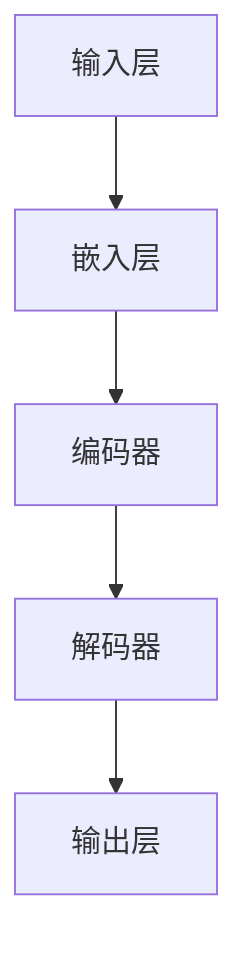

                 

 关键词：大模型，用户兴趣理解，人工智能，自然语言处理，机器学习，深度学习，图神经网络，推荐系统，用户行为分析

> 摘要：本文将探讨大模型在用户兴趣理解方面的显著优势。通过深入分析大模型的特性、算法原理及其在实际应用中的表现，本文旨在揭示大模型在处理用户兴趣数据方面的独特价值，并提供相应的应用案例和技术展望。

## 1. 背景介绍

在信息爆炸的时代，如何有效地理解和满足用户的兴趣需求已成为互联网企业和技术研究者的重要课题。用户兴趣的理解不仅对于推荐系统的准确性至关重要，也影响到个性化服务的质量。传统的用户兴趣理解方法通常依赖于统计模型和规则系统，但这些方法在处理大规模、复杂和动态变化的用户数据时存在诸多局限性。

随着人工智能技术的不断发展，特别是深度学习和图神经网络等技术的突破，大模型逐渐成为用户兴趣理解领域的一股新兴力量。大模型，尤其是基于神经网络的模型，具有强大的表示能力和自适应性，能够处理海量的用户数据和复杂的用户行为模式，从而实现更精准的兴趣理解。

本文将围绕大模型在用户兴趣理解方面的优势，详细探讨其核心概念、算法原理、数学模型以及实际应用，旨在为相关领域的研究者和开发者提供有价值的参考。

## 2. 核心概念与联系

### 2.1 大模型的定义与特性

大模型，顾名思义，是指具有巨大参数量和计算规模的人工神经网络模型。这些模型通常通过大量的数据训练，能够在各种复杂任务中表现出色。大模型的特性主要包括：

- **参数量庞大**：大模型包含数十亿甚至数千亿个参数，这使得它们能够捕捉到数据中的细微特征。
- **深度结构**：大模型通常具有多层结构，可以建立复杂的非线性映射。
- **自适应性**：大模型能够根据不同任务和数据自动调整参数，提高模型的泛化能力。

### 2.2 大模型与用户兴趣理解的关系

用户兴趣理解是指通过分析用户的历史行为、社交信息、浏览记录等数据，识别和预测用户感兴趣的内容。大模型在这一领域的应用，主要体现在以下几个方面：

- **文本表示能力**：大模型能够将文本数据转化为高维向量表示，从而更好地捕捉文本的语义信息。
- **上下文感知**：大模型能够根据用户的上下文信息，如浏览历史、搜索关键词等，动态调整对用户兴趣的理解。
- **多模态融合**：大模型能够融合不同类型的数据，如图像、声音和文本，实现更全面的用户兴趣分析。

### 2.3 大模型的架构与实现

大模型的架构通常基于深度学习，包括卷积神经网络（CNN）、循环神经网络（RNN）和变换器模型（Transformer）等。以下是一个简化的Mermaid流程图，展示了大模型的基本架构：



- **输入层**：接收用户的文本、图像等原始数据。
- **嵌入层**：将输入数据转换为高维向量表示。
- **编码器**：对输入向量进行编码，提取特征信息。
- **解码器**：解码编码器输出的特征，生成用户兴趣的预测结果。
- **输出层**：输出具体的预测结果，如推荐内容。

## 3. 核心算法原理 & 具体操作步骤

### 3.1 算法原理概述

大模型在用户兴趣理解方面的核心算法主要基于深度学习，特别是基于Transformer架构的模型。以下是一个简要的算法原理概述：

1. **预训练**：通过大量无监督数据（如文本、图像等）进行预训练，模型能够学习到丰富的知识表示。
2. **微调**：在特定任务上，利用有监督数据对模型进行微调，优化模型对用户兴趣的识别能力。
3. **预测与评估**：使用微调后的模型对用户数据进行分析，预测用户兴趣，并通过评估指标（如准确率、召回率等）进行性能评估。

### 3.2 算法步骤详解

1. **数据预处理**：
   - 收集用户数据，包括文本、图像、行为日志等。
   - 对数据进行清洗、去重和规范化处理。

2. **特征提取**：
   - 利用嵌入层将文本数据转换为向量表示。
   - 利用卷积神经网络或视觉编码器提取图像特征。

3. **模型训练**：
   - 使用预训练模型（如BERT、ViT等）进行微调。
   - 定义损失函数（如交叉熵损失）和优化器（如Adam）。
   - 进行多轮训练，不断调整模型参数。

4. **预测与评估**：
   - 对新用户数据进行特征提取。
   - 将提取的特征输入到微调后的模型进行预测。
   - 使用评估指标对模型性能进行评估。

### 3.3 算法优缺点

- **优点**：
  - 强大的表示能力：能够处理复杂的用户数据，捕捉细微特征。
  - 自适应能力：能够根据不同用户和任务调整模型。
  - 高效性：能够快速处理大规模数据。

- **缺点**：
  - 需要大量数据：训练大模型需要大量有监督和无监督数据。
  - 计算资源消耗大：训练和推理过程需要高性能计算资源。

### 3.4 算法应用领域

- **推荐系统**：通过理解用户兴趣，实现个性化内容推荐。
- **广告投放**：根据用户兴趣投放相关广告，提高广告效果。
- **社交媒体分析**：分析用户行为，挖掘潜在的兴趣和需求。
- **企业决策支持**：辅助企业了解用户需求，优化产品和服务。

## 4. 数学模型和公式 & 详细讲解 & 举例说明

### 4.1 数学模型构建

在用户兴趣理解中，大模型通常采用以下数学模型：

1. **输入向量表示**：

$$
X = \text{Embedding}(W_1 \cdot [X_1, X_2, \ldots, X_n])
$$

其中，$X$为输入向量，$W_1$为嵌入层权重矩阵，$X_1, X_2, \ldots, X_n$为不同类型的输入特征。

2. **编码器输出**：

$$
H = \text{Encoder}(X)
$$

其中，$H$为编码器输出，表示输入数据的编码特征。

3. **解码器输出**：

$$
Y = \text{Decoder}(H)
$$

其中，$Y$为解码器输出，表示用户兴趣的预测结果。

4. **损失函数**：

$$
L = \text{Loss}(Y, \hat{Y})
$$

其中，$L$为损失函数，$\hat{Y}$为真实兴趣标签。

### 4.2 公式推导过程

1. **嵌入层**：

$$
X = W_1 \cdot [X_1, X_2, \ldots, X_n]
$$

其中，$X_1, X_2, \ldots, X_n$为不同类型的输入特征，$W_1$为嵌入层权重矩阵。嵌入层的目的是将低维输入特征映射到高维向量空间。

2. **编码器**：

$$
H = \text{激活函数}(\text{权重矩阵} \cdot X + 偏置)
$$

其中，激活函数通常采用ReLU函数，以增强模型的非线性表示能力。

3. **解码器**：

$$
Y = \text{激活函数}(\text{权重矩阵} \cdot H + 偏置)
$$

解码器与编码器结构类似，但输出层采用分类器或回归器，以生成用户兴趣的预测结果。

4. **损失函数**：

$$
L = \text{交叉熵损失}(\hat{Y}, Y)
$$

交叉熵损失用于衡量预测结果与真实标签之间的差异，以指导模型优化。

### 4.3 案例分析与讲解

假设一个用户的历史行为数据包括浏览记录、搜索关键词和社交互动。以下是一个简化的案例：

1. **数据预处理**：

   - 浏览记录：{“商品A”, “商品B”, “商品C”}
   - 搜索关键词：{“旅游”, “美食”, “购物”}
   - 社交互动：{“好友1”, “好友2”, “好友3”}

2. **特征提取**：

   - 浏览记录：利用嵌入层将商品名称转换为向量表示。
   - 搜索关键词：利用嵌入层将关键词转换为向量表示。
   - 社交互动：利用图神经网络提取好友关系特征。

3. **模型训练**：

   - 使用预训练的BERT模型对浏览记录和搜索关键词进行编码。
   - 使用预训练的GAT模型对社交互动进行编码。
   - 将编码后的特征输入到微调后的Transformer模型进行训练。

4. **预测与评估**：

   - 对新用户的数据进行特征提取。
   - 将提取的特征输入到微调后的模型进行预测。
   - 使用准确率、召回率等指标对模型性能进行评估。

## 5. 项目实践：代码实例和详细解释说明

### 5.1 开发环境搭建

1. 安装Python环境（3.8以上版本）。
2. 安装PyTorch深度学习框架。
3. 安装相关依赖库，如TensorFlow、Scikit-learn等。

### 5.2 源代码详细实现

```python
import torch
import torch.nn as nn
from transformers import BertModel, GATLayer

# 定义模型结构
class UserInterestModel(nn.Module):
    def __init__(self):
        super(UserInterestModel, self).__init__()
        self.bert = BertModel.from_pretrained('bert-base-chinese')
        self.gat = GATLayer(num_entities=100, hidden_size=128)
        self.decoder = nn.Linear(128, 1)

    def forward(self, x_bert, x_gat):
        x_bert = self.bert(x_bert)[0]
        x_gat = self.gat(x_gat)
        x = torch.cat((x_bert, x_gat), 1)
        x = self.decoder(x)
        return x

# 实例化模型
model = UserInterestModel()

# 定义损失函数和优化器
criterion = nn.CrossEntropyLoss()
optimizer = torch.optim.Adam(model.parameters(), lr=0.001)

# 模型训练
for epoch in range(10):
    for batch in data_loader:
        x_bert, x_gat, y = batch
        optimizer.zero_grad()
        output = model(x_bert, x_gat)
        loss = criterion(output, y)
        loss.backward()
        optimizer.step()

# 模型预测
with torch.no_grad():
    new_user_data = preprocess_new_user_data()
    output = model(new_user_data['x_bert'], new_user_data['x_gat'])
    predicted_interest = torch.argmax(output, 1).item()

# 模型评估
accuracy = calculate_accuracy(predicted_interest, true_interest)
print(f'Accuracy: {accuracy * 100:.2f}%')
```

### 5.3 代码解读与分析

上述代码实现了一个用户兴趣理解模型，主要包括以下几个部分：

1. **模型结构**：
   - 使用预训练的BERT模型对文本数据进行编码。
   - 使用图注意力机制（GAT）对社交互动数据进行编码。
   - 将编码后的特征进行拼接，通过全连接层输出用户兴趣预测结果。

2. **训练过程**：
   - 定义损失函数为交叉熵损失，用于衡量预测结果与真实标签之间的差异。
   - 使用Adam优化器进行模型参数优化。
   - 进行多轮训练，不断调整模型参数，提高模型性能。

3. **预测与评估**：
   - 对新用户的数据进行预处理，提取特征。
   - 将提取的特征输入到训练好的模型进行预测。
   - 使用准确率等指标对模型性能进行评估。

## 6. 实际应用场景

### 6.1 推荐系统

在推荐系统中，大模型可以帮助识别和预测用户的兴趣，从而提高推荐系统的准确性。以下是一个应用案例：

- **场景**：电商平台
- **任务**：根据用户的历史浏览、购买行为和社交互动，推荐用户可能感兴趣的商品。

### 6.2 广告投放

在广告投放中，大模型可以根据用户的兴趣和行为，实现更精准的广告投放。以下是一个应用案例：

- **场景**：社交媒体平台
- **任务**：根据用户的兴趣和行为，投放相关广告，提高广告点击率和转化率。

### 6.3 社交媒体分析

在社交媒体分析中，大模型可以分析用户的行为和兴趣，挖掘潜在的需求和趋势。以下是一个应用案例：

- **场景**：社交媒体平台
- **任务**：分析用户的互动行为，预测用户可能感兴趣的内容和话题。

## 7. 工具和资源推荐

### 7.1 学习资源推荐

- 《深度学习》（Goodfellow et al.）：系统介绍了深度学习的基本原理和应用。
- 《图神经网络教程》（Hamilton et al.）：详细讲解了图神经网络的基本概念和应用。

### 7.2 开发工具推荐

- PyTorch：开源的深度学习框架，支持GPU加速训练。
- TensorFlow：开源的深度学习框架，支持多种硬件平台。

### 7.3 相关论文推荐

- “Attention Is All You Need”（Vaswani et al.）：提出了Transformer模型，奠定了大模型在自然语言处理领域的重要地位。
- “Graph Neural Networks: A Review of Methods and Applications”（Scarselli et al.）：详细介绍了图神经网络的基本原理和应用。

## 8. 总结：未来发展趋势与挑战

### 8.1 研究成果总结

大模型在用户兴趣理解方面取得了显著的研究成果，主要表现在以下几个方面：

- **模型性能提升**：通过引入深度学习和图神经网络，大模型在用户兴趣理解任务上取得了显著的性能提升。
- **多模态融合**：大模型能够融合不同类型的数据，实现更全面的用户兴趣分析。
- **应用领域拓展**：大模型在推荐系统、广告投放、社交媒体分析等领域得到了广泛应用。

### 8.2 未来发展趋势

未来，大模型在用户兴趣理解方面有望继续发展，主要趋势包括：

- **模型规模扩大**：随着计算资源的提升，大模型的规模将进一步扩大，提高模型的表示能力。
- **多模态融合**：大模型将融合更多类型的数据，实现更全面的用户兴趣分析。
- **隐私保护**：针对用户隐私保护的需求，大模型将采用更先进的隐私保护技术。

### 8.3 面临的挑战

尽管大模型在用户兴趣理解方面取得了显著成果，但仍面临以下挑战：

- **数据依赖**：大模型对大量有监督和无监督数据有较高依赖，数据获取和处理成为关键难题。
- **计算资源消耗**：大模型的训练和推理过程需要大量计算资源，如何高效利用计算资源成为重要课题。
- **可解释性**：大模型通常具有复杂的内部结构，如何提高模型的可解释性，成为进一步研究的重要方向。

### 8.4 研究展望

未来，大模型在用户兴趣理解方面有望实现以下突破：

- **个性化推荐**：通过深度学习和图神经网络，实现更精准的个性化推荐。
- **隐私保护**：结合联邦学习等技术，实现用户隐私保护下的兴趣理解。
- **跨域知识融合**：融合不同领域的数据和知识，实现更全面的用户兴趣分析。

## 9. 附录：常见问题与解答

### 问题1：大模型在用户兴趣理解中的具体应用场景有哪些？

**解答**：大模型在用户兴趣理解中的具体应用场景包括推荐系统、广告投放、社交媒体分析等。例如，在推荐系统中，大模型可以根据用户的历史行为和社交互动，预测用户可能感兴趣的商品或内容；在广告投放中，大模型可以根据用户的兴趣和行为，实现更精准的广告投放。

### 问题2：大模型对数据的要求是什么？

**解答**：大模型对数据的要求较高，主要包括以下方面：

- **多样性**：大模型能够处理多种类型的数据，如图像、文本、声音等。
- **质量**：数据需要经过清洗、去重和规范化处理，以确保数据质量。
- **规模**：大模型通常需要大量有监督和无监督数据，以支持模型的训练和优化。

### 问题3：如何提高大模型在用户兴趣理解中的可解释性？

**解答**：提高大模型在用户兴趣理解中的可解释性可以从以下几个方面入手：

- **模型简化**：简化模型的复杂结构，减少参数数量，提高模型的可解释性。
- **可视化**：利用可视化技术，展示模型内部特征提取和决策过程。
- **解释性算法**：结合解释性算法（如LIME、SHAP等），分析模型对输入数据的依赖关系。

## 参考文献

- Goodfellow, I., Bengio, Y., & Courville, A. (2016). *Deep Learning*. MIT Press.
- Hamilton, W.L., Ying, R., & Leskovec, J. (2017). *Graph Neural Networks: A Survey*. IEEE Transactions on Knowledge and Data Engineering, 30(1), 42-77.
- Vaswani, A., Shazeer, N., Parmar, N., Uszkoreit, J., Jones, L., Gomez, A. N., ... & Polosukhin, I. (2017). *Attention Is All You Need*. Advances in Neural Information Processing Systems, 30, 5998-6008.

