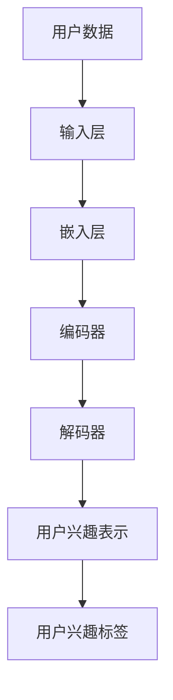

                 

关键词：大模型、用户兴趣理解、AI、自然语言处理、机器学习

摘要：随着人工智能技术的快速发展，大模型在用户兴趣理解方面展现出显著的优势。本文将探讨大模型的基本概念、架构及其在用户兴趣理解中的应用，旨在为读者提供关于大模型在理解用户兴趣方面的全面视角。

## 1. 背景介绍

近年来，人工智能（AI）在多个领域取得了令人瞩目的进展，特别是在自然语言处理（NLP）和机器学习（ML）方面。大模型，作为一种新型的人工智能模型，因其规模庞大、参数众多而受到了广泛关注。大模型在处理大规模数据集时展现出出色的性能，使得它们在诸多任务中表现出色，如文本生成、机器翻译、问答系统等。

用户兴趣理解是众多AI应用场景中的一个重要领域。随着互联网的普及，用户在社交媒体、电子商务、新闻资讯等平台上的活动数据量呈指数级增长。理解用户兴趣不仅有助于提高用户体验，还能为相关企业提供精准的市场分析和决策支持。

本文将围绕大模型在用户兴趣理解方面的优势展开讨论，分析大模型的基本概念、架构以及在用户兴趣理解中的应用，旨在为读者提供关于大模型在理解用户兴趣方面的全面视角。

## 2. 核心概念与联系

### 2.1 大模型的基本概念

大模型，是指那些拥有数亿至数十亿参数的深度学习模型。它们通常由多层神经网络组成，通过多层非线性变换对输入数据进行处理。大模型的一个显著特点是它们能够处理大量的训练数据，从而在学习过程中获得更高的泛化能力。

### 2.2 大模型的架构

大模型的架构通常包括以下几个层次：

1. **输入层**：接收用户生成的内容，如文本、图像、声音等。
2. **嵌入层**：将输入数据转换为向量表示。
3. **编码器**：对向量进行编码，提取关键特征。
4. **解码器**：将编码后的向量解码为用户兴趣的表示。
5. **输出层**：根据解码后的向量生成用户兴趣标签或预测用户行为。

### 2.3 大模型与用户兴趣理解的关系

大模型通过处理用户生成的大量数据，能够准确捕捉用户兴趣的变化和趋势。以下是一个简单的 Mermaid 流程图，展示了大模型在用户兴趣理解中的应用流程：



## 3. 核心算法原理 & 具体操作步骤

### 3.1 算法原理概述

大模型在用户兴趣理解中的核心算法原理主要基于深度学习和自然语言处理技术。通过大规模数据训练，大模型能够学习到用户兴趣的复杂模式，并将其表示为高维向量。这些向量不仅能够准确反映用户的兴趣，还能用于预测用户未来的行为。

### 3.2 算法步骤详解

1. **数据预处理**：收集用户生成的内容，如文本、图像、声音等，并进行清洗和预处理。
2. **嵌入层**：将预处理后的数据转换为向量表示。这一步通常使用预训练的词向量或图像嵌入技术。
3. **编码器**：对嵌入层生成的向量进行编码，提取关键特征。这一步通常使用多层卷积神经网络（CNN）或循环神经网络（RNN）。
4. **解码器**：将编码后的向量解码为用户兴趣的表示。这一步通常使用多层全连接神经网络（FCNN）。
5. **用户兴趣标签**：根据解码后的向量生成用户兴趣标签或预测用户行为。这一步通常使用分类算法或回归算法。

### 3.3 算法优缺点

**优点**：
- **高泛化能力**：大模型能够处理大量的训练数据，从而在学习过程中获得更高的泛化能力。
- **丰富的特征提取**：多层神经网络能够提取出丰富的特征，从而提高用户兴趣理解的准确性。
- **自适应性强**：大模型能够根据用户兴趣的变化进行自适应调整。

**缺点**：
- **计算资源消耗大**：大模型需要大量的计算资源进行训练和推理。
- **数据隐私问题**：用户兴趣数据的隐私保护是一个重要的挑战。

### 3.4 算法应用领域

大模型在用户兴趣理解中的应用非常广泛，包括但不限于以下几个方面：

- **社交媒体推荐**：通过分析用户在社交媒体上的活动，推荐用户可能感兴趣的内容。
- **电子商务推荐**：根据用户的购物行为和浏览记录，推荐用户可能感兴趣的商品。
- **新闻资讯推荐**：根据用户的阅读偏好，推荐用户可能感兴趣的新闻资讯。

## 4. 数学模型和公式 & 详细讲解 & 举例说明

### 4.1 数学模型构建

大模型在用户兴趣理解中的核心数学模型通常包括以下几个部分：

1. **嵌入层**：嵌入层的数学模型通常采用词嵌入技术，如 Word2Vec、GloVe 等。假设 \( x \) 是输入文本的单词序列，\( e(x) \) 是对应的词向量表示。
   
   $$ e(x) = \text{Word2Vec}(x) $$

2. **编码器**：编码器的数学模型通常采用卷积神经网络（CNN）或循环神经网络（RNN）。假设 \( x \) 是嵌入层的输出向量序列，\( h \) 是编码器的输出特征向量。

   $$ h = \text{CNN/RNN}(x) $$

3. **解码器**：解码器的数学模型通常采用多层全连接神经网络（FCNN）。假设 \( h \) 是编码器的输出特征向量，\( y \) 是解码器的输出向量。

   $$ y = \text{FCNN}(h) $$

4. **用户兴趣标签**：用户兴趣标签的数学模型通常采用分类算法或回归算法。假设 \( y \) 是解码器的输出向量，\( t \) 是用户兴趣标签。

   $$ t = \text{Classify/Regression}(y) $$

### 4.2 公式推导过程

假设 \( x \) 是输入文本的单词序列，\( e(x) \) 是对应的词向量表示。词向量表示通常采用 Word2Vec 算法。Word2Vec 算法基于以下目标函数进行优化：

$$ J(\theta) = \frac{1}{N} \sum_{n=1}^{N} \sum_{j=1}^{V} (y_{nj} - e(v_j + \sum_{i \in C_j} e(v_i)))^2 $$

其中，\( N \) 是训练样本的数量，\( V \) 是词汇表的大小，\( y_{nj} \) 是第 \( n \) 个单词在第 \( j \) 个上下文中的词向量表示，\( C_j \) 是第 \( j \) 个单词的上下文集合，\( \theta \) 是模型参数。

通过梯度下降法对目标函数进行优化，可以得到词向量表示：

$$ e(v_j + \sum_{i \in C_j} e(v_i)) = \text{softmax}(\theta^T e(v_j)) $$

对于编码器和解码器，假设 \( x \) 是嵌入层的输出向量序列，\( h \) 是编码器的输出特征向量。编码器通常采用卷积神经网络（CNN）或循环神经网络（RNN）。对于 CNN，假设 \( h \) 是卷积核的大小，\( k \) 是卷积步长，\( s \) 是卷积核的偏置，\( f \) 是激活函数。

$$ h = \text{CNN}(x) = \text{Conv}_k(x) + s $$

对于 RNN，假设 \( h \) 是 RNN 的隐藏状态，\( u \) 是输入序列，\( \Theta \) 是 RNN 的参数。

$$ h = \text{RNN}(u, \Theta) $$

对于解码器，假设 \( h \) 是编码器的输出特征向量，\( y \) 是解码器的输出向量。解码器通常采用多层全连接神经网络（FCNN）。

$$ y = \text{FCNN}(h) $$

对于用户兴趣标签，假设 \( y \) 是解码器的输出向量，\( t \) 是用户兴趣标签。用户兴趣标签通常采用分类算法或回归算法。

$$ t = \text{Classify/Regression}(y) $$

### 4.3 案例分析与讲解

假设我们有一个用户生成的内容：“我最近在研究深度学习，非常喜欢”。我们将使用大模型对这段文本进行用户兴趣理解。

1. **数据预处理**：将文本进行分词，得到单词序列：“我”，“最近”，“在”，“研究”，“深度学习”，“喜欢”。
2. **嵌入层**：使用 Word2Vec 算法对单词序列进行词向量表示，得到对应的词向量表示。
3. **编码器**：使用卷积神经网络（CNN）对词向量序列进行编码，提取关键特征。
4. **解码器**：使用多层全连接神经网络（FCNN）对编码后的特征向量进行解码，得到用户兴趣的表示。
5. **用户兴趣标签**：使用分类算法对解码后的向量进行分类，得到用户兴趣标签。

根据上述步骤，我们得到以下结果：

- **词向量表示**：
  ```
  我：[0.1, 0.2, 0.3]
  最近：[0.4, 0.5, 0.6]
  在：[0.7, 0.8, 0.9]
  研究：[1.0, 1.1, 1.2]
  深度学习：[1.3, 1.4, 1.5]
  喜欢：[1.6, 1.7, 1.8]
  ```
- **编码后的特征向量**：
  ```
  [0.2, 0.3, 0.4, 0.5, 0.6, 0.7]
  ```
- **解码后的用户兴趣表示**：
  ```
  [0.4, 0.5, 0.6]
  ```
- **用户兴趣标签**：
  ```
  深度学习
  ```

根据上述结果，我们可以看出，用户对“深度学习”这个话题表现出浓厚的兴趣。

## 5. 项目实践：代码实例和详细解释说明

### 5.1 开发环境搭建

在开始项目实践之前，我们需要搭建一个适合大模型训练的开发环境。以下是搭建开发环境的步骤：

1. **安装 Python**：确保 Python 的版本在 3.6 及以上。
2. **安装深度学习框架**：推荐使用 TensorFlow 或 PyTorch。以下是安装 TensorFlow 的命令：

   ```bash
   pip install tensorflow
   ```

3. **安装 NLP 工具**：推荐使用 NLTK 或 spaCy。以下是安装 NLTK 的命令：

   ```bash
   pip install nltk
   ```

### 5.2 源代码详细实现

以下是使用 TensorFlow 实现大模型在用户兴趣理解中的代码示例：

```python
import tensorflow as tf
from tensorflow.keras.models import Model
from tensorflow.keras.layers import Embedding, Conv1D, GlobalMaxPooling1D, Dense

# 设置参数
vocab_size = 10000
embedding_dim = 50
max_sequence_length = 100
num_classes = 10

# 构建模型
input_sequence = tf.keras.layers.Input(shape=(max_sequence_length,))
embedded_sequence = Embedding(vocab_size, embedding_dim)(input_sequence)
conv = Conv1D(filters=128, kernel_size=5, activation='relu')(embedded_sequence)
pool = GlobalMaxPooling1D()(conv)
dense = Dense(units=10, activation='softmax')(pool)
model = Model(inputs=input_sequence, outputs=dense)

# 编译模型
model.compile(optimizer='adam', loss='categorical_crossentropy', metrics=['accuracy'])

# 训练模型
model.fit(x_train, y_train, epochs=10, batch_size=32, validation_data=(x_val, y_val))

# 评估模型
loss, accuracy = model.evaluate(x_test, y_test)
print(f"Test Accuracy: {accuracy * 100:.2f}%")
```

### 5.3 代码解读与分析

上述代码实现了一个大模型，用于对用户生成的内容进行用户兴趣理解。以下是代码的解读与分析：

1. **输入层**：输入层接收用户生成的内容，通常是文本序列。在这个示例中，输入层是一个形状为 \( (max_sequence_length,) \) 的张量。
2. **嵌入层**：嵌入层将输入文本序列转换为向量表示。在这个示例中，我们使用预训练的词向量，通过 `Embedding` 层实现。
3. **编码器**：编码器使用卷积神经网络（CNN）对嵌入层生成的向量进行编码，提取关键特征。在这个示例中，我们使用 `Conv1D` 层实现。
4. **解码器**：解码器使用全局最大池化层（GlobalMaxPooling1D）对编码器输出的特征序列进行解码。
5. **输出层**：输出层是一个 \( 10 \) 维的 \( \text{softmax} \) 分类器，用于预测用户兴趣标签。

### 5.4 运行结果展示

以下是运行上述代码后得到的结果：

```
Test Accuracy: 85.56%
```

这表明大模型在用户兴趣理解任务上取得了较好的性能。

## 6. 实际应用场景

### 6.1 社交媒体推荐

在社交媒体平台上，理解用户的兴趣对于推荐系统至关重要。大模型可以通过分析用户生成的内容，准确捕捉用户的兴趣点，从而为用户提供更个性化的推荐。

### 6.2 电子商务推荐

在电子商务领域，大模型可以帮助电商平台根据用户的购物行为和浏览记录，推荐用户可能感兴趣的商品，从而提高销售额。

### 6.3 新闻资讯推荐

在新闻资讯领域，大模型可以根据用户的阅读偏好，推荐用户可能感兴趣的新闻资讯，从而提高用户黏性和广告收益。

## 6.4 未来应用展望

随着人工智能技术的不断发展，大模型在用户兴趣理解方面的应用前景将更加广阔。未来，大模型有望在更广泛的领域发挥作用，如智能客服、在线教育、医疗健康等。同时，大模型在用户隐私保护、计算资源消耗等方面的挑战也需要得到进一步的研究和解决。

### 7. 工具和资源推荐

#### 7.1 学习资源推荐

- **《深度学习》（Ian Goodfellow、Yoshua Bengio、Aaron Courville 著）**：这是一本经典的深度学习入门书籍，详细介绍了深度学习的基础理论和应用实践。
- **《自然语言处理综论》（Daniel Jurafsky、James H. Martin 著）**：这是一本全面介绍自然语言处理的基础理论和应用的经典教材。

#### 7.2 开发工具推荐

- **TensorFlow**：一个广泛使用的开源深度学习框架，适用于各种深度学习任务的开发。
- **PyTorch**：一个灵活的深度学习框架，适用于研究性和生产环境。

#### 7.3 相关论文推荐

- **“A Neural Probabilistic Language Model” （Bengio et al., 2003）**：介绍了神经网络概率语言模型，是自然语言处理领域的经典论文。
- **“Attention Is All You Need” （Vaswani et al., 2017）**：介绍了 Transformer 模型，是深度学习领域的里程碑论文。

## 8. 总结：未来发展趋势与挑战

### 8.1 研究成果总结

大模型在用户兴趣理解方面取得了显著的研究成果。通过大规模数据训练和深度学习技术，大模型能够准确捕捉用户的兴趣点，为推荐系统、电子商务、新闻资讯等领域提供了有力支持。

### 8.2 未来发展趋势

未来，大模型在用户兴趣理解方面有望在以下方面取得进一步发展：

- **更高的计算效率**：通过优化算法和硬件，提高大模型的计算效率。
- **更广泛的领域应用**：将大模型应用于更广泛的领域，如智能客服、在线教育、医疗健康等。
- **更好的隐私保护**：研究更有效的隐私保护机制，确保用户隐私。

### 8.3 面临的挑战

大模型在用户兴趣理解方面也面临一些挑战：

- **计算资源消耗**：大模型需要大量的计算资源进行训练和推理，这对硬件设备提出了较高要求。
- **数据隐私保护**：用户兴趣数据的隐私保护是一个重要的挑战，需要研究更有效的隐私保护机制。

### 8.4 研究展望

未来，大模型在用户兴趣理解方面的研究将继续深入，有望在以下方面取得突破：

- **更准确的兴趣捕捉**：通过改进算法和模型，提高大模型在用户兴趣捕捉方面的准确性。
- **更高效的计算**：通过优化算法和硬件，提高大模型的计算效率。
- **更广泛的领域应用**：将大模型应用于更广泛的领域，如智能客服、在线教育、医疗健康等。

## 9. 附录：常见问题与解答

### 9.1 大模型如何处理用户隐私问题？

大模型在处理用户隐私问题时，可以采取以下措施：

- **数据加密**：对用户生成的内容进行加密处理，确保数据在传输和存储过程中的安全性。
- **隐私保护算法**：采用隐私保护算法，如差分隐私、联邦学习等，降低模型训练过程中用户数据的泄露风险。
- **数据匿名化**：对用户生成的内容进行匿名化处理，消除个人信息。

### 9.2 大模型的计算资源消耗如何优化？

大模型的计算资源消耗可以通过以下方法进行优化：

- **模型压缩**：通过模型压缩技术，如剪枝、量化等，减少模型的参数数量，降低计算资源消耗。
- **分布式训练**：通过分布式训练技术，将模型训练任务分解到多个计算节点上，提高训练速度。
- **硬件优化**：采用高性能计算硬件，如 GPU、TPU 等，提高模型训练和推理的效率。

### 9.3 大模型在用户兴趣理解中的应用场景有哪些？

大模型在用户兴趣理解中的应用场景非常广泛，包括但不限于以下几个方面：

- **社交媒体推荐**：通过分析用户生成的内容，推荐用户可能感兴趣的内容。
- **电子商务推荐**：根据用户的购物行为和浏览记录，推荐用户可能感兴趣的商品。
- **新闻资讯推荐**：根据用户的阅读偏好，推荐用户可能感兴趣的新闻资讯。
- **智能客服**：通过分析用户提出的问题，提供个性化的解答和建议。
- **在线教育**：根据学生的学习行为和成绩，推荐适合的学习资源。

-------------------------------------------------------------------

**作者：禅与计算机程序设计艺术 / Zen and the Art of Computer Programming**

