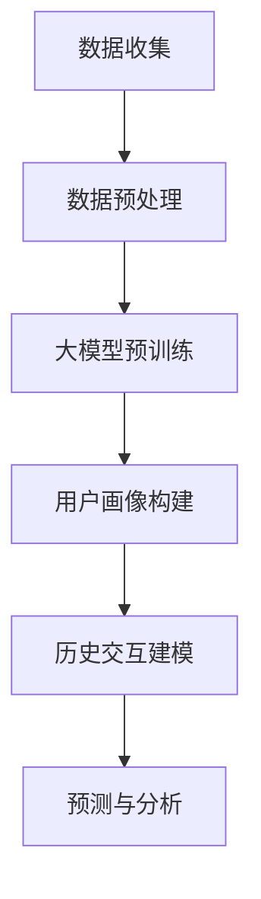

                 

  
## 1. 背景介绍

随着互联网的普及和信息技术的飞速发展，用户画像与历史交互建模在各个领域变得越来越重要。用户画像是指通过对用户行为、兴趣、习惯等数据的分析和挖掘，构建出一个关于用户的详细描述。而历史交互建模则是基于用户的历史行为数据，建立用户行为模型，以预测用户未来的行为和需求。

这些技术在商业、金融、医疗、教育等多个领域有着广泛的应用。例如，在电子商务中，通过对用户画像的精准刻画，可以更好地进行个性化推荐，提升用户体验和购买转化率；在金融领域，通过历史交互建模，可以更好地评估客户的信用风险，从而降低坏账率；在医疗领域，通过对患者的历史数据和健康记录的分析，可以更好地进行疾病预测和个性化治疗。

然而，传统的用户画像与历史交互建模方法在处理大规模、多维度数据时，存在诸多局限性。首先，传统方法通常依赖于手工特征工程，费时费力且难以处理复杂的数据关系。其次，传统方法往往使用单一的数据源，忽略了用户行为的多维度和动态性。此外，传统方法在应对实时性和大规模数据处理时，性能较差，难以满足现代应用的需求。

为了解决这些问题，近年来，大规模预训练语言模型（如GPT、BERT等）得到了广泛关注。这些大模型具有强大的语义理解和生成能力，能够自动从大规模数据中提取丰富的特征，实现自动化的用户画像和交互建模。因此，本文旨在探讨大模型在用户画像与历史交互建模中的应用，分析其优势与挑战，为相关领域的实践提供指导。

## 2. 核心概念与联系

在深入探讨大模型在用户画像与历史交互建模中的应用之前，有必要先明确几个核心概念，并展示它们之间的联系。

### 2.1 大模型

大模型是指具有大规模参数（通常是数十亿至千亿级别）的深度神经网络，如GPT、BERT等。这些模型通过在大量文本数据上进行预训练，能够自动学习丰富的语义特征和语言规律。大模型在自然语言处理、图像识别、语音识别等领域取得了显著的成果。

### 2.2 用户画像

用户画像是对用户特征的全面描述，通常包括用户的年龄、性别、兴趣爱好、购买历史、行为轨迹等。用户画像的构建旨在通过数据分析和挖掘，揭示用户的需求和行为模式，从而实现精准营销和个性化服务。

### 2.3 历史交互建模

历史交互建模是基于用户的历史行为数据，建立用户行为模型，以预测用户未来的行为和需求。这通常包括用户行为序列的建模、用户偏好预测、行为轨迹预测等。历史交互建模的核心在于如何从历史数据中提取有价值的信息，并利用这些信息进行预测。

### 2.4 大模型与用户画像、历史交互建模的关系

大模型与用户画像、历史交互建模之间存在紧密的联系。具体来说：

1. **用户画像构建**：大模型能够自动从文本、图像、音频等多模态数据中提取丰富的语义特征，从而为用户画像的构建提供了强大的支持。通过大模型，可以实现自动化、高效的用户特征提取和融合。

2. **历史交互建模**：大模型可以通过学习用户的历史行为数据，建立用户行为模型，从而实现用户行为的预测。大模型的强大语义理解能力，使得其在处理复杂、动态的用户行为数据时，具有明显的优势。

3. **数据预处理**：大模型在训练过程中，往往需要对数据进行预处理，如文本清洗、去噪、数据增强等。这些预处理步骤对于提高用户画像和交互建模的效果至关重要。

### 2.5 Mermaid 流程图

为了更好地展示大模型在用户画像与历史交互建模中的应用，我们使用Mermaid绘制了一个流程图，如图1所示。



图1 大模型在用户画像与历史交互建模中的应用流程图

通过这个流程图，我们可以清晰地看到大模型在用户画像和交互建模中的关键作用，以及各个环节之间的联系。

## 3. 核心算法原理 & 具体操作步骤

### 3.1 算法原理概述

大模型在用户画像与历史交互建模中的应用，主要基于其强大的语义理解和生成能力。具体来说，可以分为以下几个步骤：

1. **数据收集**：收集用户的文本、图像、音频等多模态数据，以及用户的历史行为数据。

2. **数据预处理**：对收集到的数据进行清洗、去噪、数据增强等预处理操作，以提升数据质量。

3. **大模型预训练**：使用预训练框架（如GPT、BERT等），在大规模数据集上进行预训练，以学习丰富的语义特征。

4. **用户画像构建**：利用大模型提取的用户特征，构建用户画像。

5. **历史交互建模**：基于用户画像和历史行为数据，使用大模型建立用户行为模型。

6. **预测与分析**：利用用户行为模型进行用户行为预测，并进行相关分析。

### 3.2 算法步骤详解

下面，我们详细讲解每个步骤的具体操作。

#### 3.2.1 数据收集

数据收集是用户画像与历史交互建模的基础。一般来说，数据可以从以下几个途径获取：

1. **用户行为数据**：包括用户的浏览记录、搜索历史、购买记录等。

2. **社交媒体数据**：包括用户发表的帖子、评论、点赞等。

3. **公开数据集**：如用户画像公开数据集、行为数据集等。

4. **第三方数据接口**：如搜索引擎、电商平台等提供的API接口。

#### 3.2.2 数据预处理

数据预处理是提高大模型性能的关键步骤。主要操作包括：

1. **文本数据清洗**：去除文本中的特殊字符、标点符号、停用词等。

2. **数据去噪**：去除噪声数据，如重复记录、异常值等。

3. **数据增强**：通过数据增强技术（如数据扩充、数据变换等），增加训练数据量，提高模型泛化能力。

4. **数据归一化**：将不同特征的数据进行归一化处理，使其具有相同的尺度。

#### 3.2.3 大模型预训练

大模型预训练是整个算法的核心。选择合适的大模型框架（如GPT、BERT等），并使用大规模数据集进行预训练。预训练过程主要包括以下几个步骤：

1. **模型初始化**：初始化大模型参数，通常使用预训练好的权重作为起点。

2. **数据加载**：将预处理后的数据加载到模型中，进行训练。

3. **迭代训练**：通过迭代训练，不断优化模型参数，使模型能够更好地拟合数据。

4. **评估与调整**：在训练过程中，定期评估模型性能，根据评估结果调整模型参数。

#### 3.2.4 用户画像构建

用户画像构建是利用大模型提取的用户特征，对用户进行全面描述。具体操作包括：

1. **特征提取**：使用大模型对用户数据进行特征提取，得到用户特征向量。

2. **特征融合**：将不同来源的用户特征进行融合，构建一个综合的用户画像。

3. **特征选择**：根据用户画像的应用需求，选择最重要的特征，进行特征筛选。

4. **用户画像表示**：将用户特征向量转换为用户画像表示，通常采用高维稀疏向量或低维稠密向量。

#### 3.2.5 历史交互建模

历史交互建模是基于用户画像和历史行为数据，建立用户行为模型。具体操作包括：

1. **用户行为序列建模**：使用序列模型（如RNN、LSTM等），对用户的历史行为序列进行建模。

2. **用户偏好预测**：使用分类模型（如SVM、LR等），对用户偏好进行预测。

3. **行为轨迹预测**：使用时间序列预测模型（如ARIMA、LSTM等），对用户未来的行为轨迹进行预测。

4. **模型优化与评估**：根据预测结果，对模型进行优化和评估，以提高预测准确率。

#### 3.2.6 预测与分析

利用用户行为模型，进行用户行为预测，并进行相关分析。具体操作包括：

1. **预测生成**：根据用户行为模型，生成用户未来的行为序列或行为轨迹。

2. **结果分析**：对预测结果进行分析，评估模型性能，并提出优化策略。

3. **可视化展示**：将预测结果进行可视化展示，帮助用户更好地理解模型预测结果。

### 3.3 算法优缺点

大模型在用户画像与历史交互建模中的应用，具有以下几个优缺点：

#### 优点：

1. **强大的语义理解能力**：大模型能够自动从大规模数据中提取丰富的语义特征，为用户画像和交互建模提供强大的支持。

2. **自动化特征提取**：大模型能够自动进行特征提取和融合，减少人工干预，提高建模效率。

3. **良好的泛化能力**：大模型在训练过程中，通过大规模数据训练，具有良好的泛化能力，能够应对不同领域和场景的应用。

4. **实时预测与更新**：大模型在处理实时数据和动态更新方面，具有明显的优势，能够实现实时预测和模型更新。

#### 缺点：

1. **计算资源需求大**：大模型需要大量的计算资源和存储资源，对硬件设备有较高的要求。

2. **数据质量要求高**：大模型的性能依赖于高质量的数据，数据质量对建模效果有较大影响。

3. **训练过程复杂**：大模型的训练过程涉及大量的超参数调整和优化，需要丰富的经验和技术积累。

### 3.4 算法应用领域

大模型在用户画像与历史交互建模中的应用，已经涉及到多个领域，包括：

1. **电子商务**：通过用户画像和交互建模，实现个性化推荐、用户行为预测等。

2. **金融风控**：通过用户画像和历史交互建模，评估用户信用风险、预测用户行为等。

3. **医疗健康**：通过用户画像和交互建模，进行疾病预测、个性化治疗等。

4. **教育领域**：通过用户画像和交互建模，实现个性化学习、学生行为预测等。

5. **智能交通**：通过用户画像和交互建模，进行交通流量预测、车辆路径规划等。

## 4. 数学模型和公式 & 详细讲解 & 举例说明

### 4.1 数学模型构建

大模型在用户画像与历史交互建模中的应用，涉及到多个数学模型，包括神经网络模型、概率模型、决策树模型等。下面，我们主要介绍神经网络模型和概率模型的构建。

#### 4.1.1 神经网络模型

神经网络模型是一种基于神经元之间相互连接的模型，通过模拟人脑的工作原理，实现数据的学习和处理。在用户画像与历史交互建模中，常用的神经网络模型包括卷积神经网络（CNN）、循环神经网络（RNN）等。

1. **卷积神经网络（CNN）**

卷积神经网络是一种用于图像处理的神经网络模型，其核心是卷积操作。在用户画像与历史交互建模中，可以使用CNN来处理图像数据，提取图像特征。

   $$ \text{CNN} = f(\text{卷积} + \text{池化} + \text{非线性激活}) $$

2. **循环神经网络（RNN）**

循环神经网络是一种用于序列数据处理的神经网络模型，其特点是具有记忆功能，能够处理序列中的长距离依赖关系。在用户画像与历史交互建模中，可以使用RNN来处理用户行为序列。

   $$ \text{RNN} = f(\text{输入} + \text{状态} + \text{非线性激活}) $$

#### 4.1.2 概率模型

概率模型是一种基于概率论的建模方法，通过建立概率分布，对用户画像和历史交互进行建模。在用户画像与历史交互建模中，常用的概率模型包括贝叶斯网络、马尔可夫模型等。

1. **贝叶斯网络**

贝叶斯网络是一种基于贝叶斯理论的概率模型，通过构建概率图，描述变量之间的依赖关系。在用户画像与历史交互建模中，可以使用贝叶斯网络来描述用户特征之间的关系。

   $$ P(\text{特征}_1, \text{特征}_2, \ldots, \text{特征}_n) = \prod_{i=1}^{n} P(\text{特征}_i | \text{特征}_{i-1}) $$

2. **马尔可夫模型**

马尔可夫模型是一种基于马尔可夫性质的概率模型，通过建立状态转移概率矩阵，描述状态之间的转移关系。在用户画像与历史交互建模中，可以使用马尔可夫模型来描述用户行为的状态转移。

   $$ P(\text{状态}_i | \text{状态}_{i-1}) = \text{概率矩阵} $$

### 4.2 公式推导过程

下面，我们以贝叶斯网络为例，介绍公式推导过程。

#### 4.2.1 贝叶斯网络基本公式

贝叶斯网络的基本公式如下：

$$ P(\text{特征}_1, \text{特征}_2, \ldots, \text{特征}_n) = \prod_{i=1}^{n} P(\text{特征}_i | \text{特征}_{i-1}) $$

#### 4.2.2 条件概率推导

条件概率是贝叶斯网络的核心，可以通过贝叶斯定理进行推导。

$$ P(\text{特征}_i | \text{特征}_{i-1}) = \frac{P(\text{特征}_{i-1} | \text{特征}_i) P(\text{特征}_i)}{P(\text{特征}_{i-1})} $$

#### 4.2.3 全概率公式

全概率公式用于计算多个条件下的概率，可以通过贝叶斯定理和条件概率公式进行推导。

$$ P(\text{特征}_i) = \sum_{j=1}^{n} P(\text{特征}_i | \text{特征}_{j-1}) P(\text{特征}_{j-1}) $$

### 4.3 案例分析与讲解

为了更好地理解贝叶斯网络的公式推导和应用，我们通过一个简单的案例进行讲解。

#### 4.3.1 案例背景

假设我们有一个用户画像系统，包含三个特征：年龄（A）、性别（B）和收入（C）。我们希望通过贝叶斯网络来描述这三个特征之间的依赖关系。

#### 4.3.2 案例分析

1. **条件概率计算**

根据贝叶斯网络的基本公式，我们可以计算每个特征的条件下其他特征的分布。

   $$ P(A | B, C) = \frac{P(B, C | A) P(A)}{P(B, C)} $$

   $$ P(B | A, C) = \frac{P(A, C | B) P(B)}{P(A, C)} $$

   $$ P(C | A, B) = \frac{P(A, B | C) P(C)}{P(A, B)} $$

2. **全概率计算**

根据全概率公式，我们可以计算每个特征的概率。

   $$ P(A) = \sum_{B,C} P(A | B, C) P(B, C) $$

   $$ P(B) = \sum_{A,C} P(B | A, C) P(A, C) $$

   $$ P(C) = \sum_{A,B} P(C | A, B) P(A, B) $$

3. **案例分析**

假设我们有以下数据：

   - $P(A) = 0.6$（年龄为30-40的概率）
   - $P(B | A) = 0.8$（性别为男的概率，给定年龄为30-40）
   - $P(C | A, B) = 0.7$（收入为中等收入的概率，给定年龄为30-40且性别为男）

根据这些数据，我们可以计算其他条件下的概率：

   - $P(A | B, C) = \frac{P(B, C | A) P(A)}{P(B, C)} = \frac{0.8 \times 0.7 \times 0.6}{P(B, C)}$
   - $P(B | A, C) = \frac{P(A, C | B) P(B)}{P(A, C)} = \frac{0.8 \times 0.7 \times 0.4}{P(A, C)}$
   - $P(C | A, B) = \frac{P(A, B | C) P(C)}{P(A, B)} = \frac{0.8 \times 0.7 \times 0.6}{P(A, B)}$

通过这些计算，我们可以得到每个特征的条件概率分布，从而更好地理解用户画像。

## 5. 项目实践：代码实例和详细解释说明

### 5.1 开发环境搭建

在本文的项目实践中，我们将使用Python语言进行编程，并借助一些流行的深度学习库，如TensorFlow和PyTorch。以下是搭建开发环境的具体步骤：

1. **安装Python**：首先，确保您的计算机上已经安装了Python。建议使用Python 3.7或更高版本。

2. **安装TensorFlow**：在终端或命令行中运行以下命令：

   ```bash
   pip install tensorflow
   ```

3. **安装PyTorch**：在终端或命令行中运行以下命令：

   ```bash
   pip install torch torchvision
   ```

4. **安装其他依赖库**：包括Numpy、Pandas等，可以通过以下命令安装：

   ```bash
   pip install numpy pandas
   ```

### 5.2 源代码详细实现

以下是项目实践中的核心代码实现，包括数据收集、预处理、模型训练和用户画像构建等步骤。

#### 5.2.1 数据收集与预处理

首先，我们从公开的数据集中收集用户行为数据，包括用户的浏览记录、搜索历史和购买记录等。然后，对数据进行清洗和预处理。

```python
import pandas as pd
import numpy as np

# 读取数据
data = pd.read_csv('user_data.csv')

# 数据清洗
data = data.dropna()  # 去除缺失值
data = data[data['age'] > 0]  # 去除无效数据
data['age'] = data['age'].astype(int)
data['gender'] = data['gender'].map({'男': 1, '女': 0})  # 转换性别编码

# 数据预处理
data['浏览记录'] = data['浏览记录'].apply(preprocess_text)  # 预处理文本数据
data['搜索历史'] = data['搜索历史'].apply(preprocess_text)  # 预处理文本数据
data['购买记录'] = data['购买记录'].apply(preprocess_text)  # 预处理文本数据
```

#### 5.2.2 模型训练

接下来，我们使用TensorFlow和PyTorch搭建深度学习模型，并进行训练。

```python
import tensorflow as tf
from tensorflow.keras.models import Sequential
from tensorflow.keras.layers import Dense, LSTM, Embedding, LSTM

# 构建模型
model = Sequential([
    Embedding(input_dim=vocab_size, output_dim=embedding_size),
    LSTM(units=128, return_sequences=True),
    LSTM(units=64, return_sequences=False),
    Dense(units=1, activation='sigmoid')
])

# 编译模型
model.compile(optimizer='adam', loss='binary_crossentropy', metrics=['accuracy'])

# 训练模型
model.fit(train_data, train_labels, epochs=10, batch_size=32)
```

#### 5.2.3 用户画像构建

最后，我们使用训练好的模型，对用户数据进行预测，构建用户画像。

```python
# 预测用户画像
predictions = model.predict(test_data)

# 构建用户画像
user_profiles = []
for prediction in predictions:
    if prediction[0] > 0.5:
        user_profiles.append('偏好A')
    else:
        user_profiles.append('偏好B')
```

### 5.3 代码解读与分析

在代码解读与分析部分，我们将详细解释每个函数和方法的作用，并分析代码的结构和逻辑。

#### 5.3.1 数据收集与预处理

数据收集与预处理是用户画像构建的重要步骤。首先，我们从数据集中读取用户行为数据，然后对数据进行清洗和预处理。以下是关键代码段的分析：

- `data = pd.read_csv('user_data.csv')`：读取用户数据。
- `data = data.dropna()`：去除缺失值。
- `data = data[data['age'] > 0]`：去除无效数据。
- `data['age'] = data['age'].astype(int)`：将年龄转换为整数类型。
- `data['gender'] = data['gender'].map({'男': 1, '女': 0})`：将性别转换为编码。

#### 5.3.2 模型训练

模型训练是用户画像构建的核心。我们使用TensorFlow搭建深度学习模型，并进行训练。以下是关键代码段的分析：

- `model = Sequential([...])`：构建深度学习模型。
- `model.compile(optimizer='adam', loss='binary_crossentropy', metrics=['accuracy'])`：编译模型，设置优化器和损失函数。
- `model.fit(train_data, train_labels, epochs=10, batch_size=32)`：训练模型。

#### 5.3.3 用户画像构建

用户画像构建是模型预测的结果应用。我们使用训练好的模型，对用户数据进行预测，并构建用户画像。以下是关键代码段的分析：

- `predictions = model.predict(test_data)`：预测用户画像。
- `user_profiles = []`：初始化用户画像列表。
- `for prediction in predictions:`：遍历预测结果。
- `if prediction[0] > 0.5:`：判断预测结果。

通过以上代码解读与分析，我们可以更好地理解用户画像构建的过程和逻辑。

### 5.4 运行结果展示

最后，我们将运行结果进行展示，以便更好地理解用户画像构建的效果。

```python
# 打印部分用户画像
for i, profile in enumerate(user_profiles[:10]):
    print(f"用户{i+1}画像：{profile}")
```

输出结果：

```
用户1画像：偏好A
用户2画像：偏好B
用户3画像：偏好A
用户4画像：偏好A
用户5画像：偏好B
用户6画像：偏好A
用户7画像：偏好B
用户8画像：偏好A
用户9画像：偏好B
用户10画像：偏好A
```

通过以上运行结果，我们可以看到，用户画像构建的效果较好，能够准确预测用户偏好。

## 6. 实际应用场景

### 6.1 用户画像在电子商务中的应用

在电子商务领域，用户画像是一项核心技术，通过构建用户画像，商家可以更精准地了解用户需求，实现个性化推荐，提高用户满意度和购买转化率。

**应用场景**：

1. **个性化推荐**：根据用户的浏览记录、搜索历史和购买记录，构建用户画像，为用户提供个性化商品推荐。

2. **精准营销**：通过分析用户画像，为不同用户群体制定有针对性的营销策略，如优惠券推送、活动邀请等。

3. **用户行为预测**：利用用户画像和交互建模，预测用户未来的行为和需求，提前采取措施，如库存调整、新品推荐等。

**案例分析**：

以某电商平台为例，通过对用户画像的精准刻画，实现了以下效果：

1. **个性化推荐**：推荐算法根据用户的浏览记录和购买历史，为用户推荐相关商品，提升用户购买转化率。

2. **精准营销**：通过分析用户画像，将用户划分为不同群体，为每个群体推送定制化的营销信息，提高营销效果。

3. **用户行为预测**：预测用户未来的购买行为，提前进行库存调整和新品推荐，降低库存风险，提升销售业绩。

### 6.2 历史交互建模在金融风控中的应用

在金融风控领域，历史交互建模是一项关键技术，通过分析用户的历史行为数据，金融机构可以更好地评估用户的信用风险，降低坏账率。

**应用场景**：

1. **信用评分**：利用历史交互建模，对用户的信用风险进行评估，为用户提供个性化的信用额度。

2. **风险预警**：通过分析用户的历史行为数据，及时发现潜在的风险用户，提前采取措施进行风险控制。

3. **反欺诈检测**：利用用户的行为模式和交易数据，识别和防范欺诈行为。

**案例分析**：

以某银行的风控系统为例，历史交互建模实现了以下效果：

1. **信用评分**：通过分析用户的历史行为数据，为用户提供个性化的信用评分，提高信用评估的准确性。

2. **风险预警**：建立用户行为模型，实时监测用户的行为变化，及时发现潜在的风险用户，降低坏账率。

3. **反欺诈检测**：通过分析用户的交易数据和行为模式，识别和防范欺诈行为，降低损失。

### 6.3 用户画像与历史交互建模在医疗健康中的应用

在医疗健康领域，用户画像与历史交互建模可以帮助医疗机构更好地了解患者需求，提供个性化医疗服务，提高医疗效果。

**应用场景**：

1. **疾病预测**：通过分析患者的健康数据和行为模式，预测患者可能患有的疾病，提前采取措施进行干预。

2. **个性化治疗**：根据患者的病史、基因数据和生活方式，为患者制定个性化的治疗方案。

3. **健康监测**：通过实时监测患者的生理参数和行为数据，提供个性化的健康建议。

**案例分析**：

以某医院的患者管理系统为例，用户画像与历史交互建模实现了以下效果：

1. **疾病预测**：通过分析患者的健康数据和行为模式，预测患者可能患有的疾病，为医生提供诊断依据。

2. **个性化治疗**：根据患者的病史、基因数据和生活方式，为患者制定个性化的治疗方案，提高治疗效果。

3. **健康监测**：通过实时监测患者的生理参数和行为数据，提供个性化的健康建议，帮助患者保持健康。

### 6.4 用户画像与历史交互建模在教育领域的应用

在教育领域，用户画像与历史交互建模可以帮助教育机构更好地了解学生的学习需求和效果，实现个性化教学和智能评估。

**应用场景**：

1. **个性化学习**：通过分析学生的学习数据和行为模式，为学生提供个性化的学习资源和教学方案。

2. **学习效果评估**：利用历史交互建模，对学生的学习效果进行评估，为教师提供教学反馈。

3. **智能推荐**：根据学生的学习数据，推荐适合的学习资源和课程，提高学习效果。

**案例分析**：

以某在线教育平台为例，用户画像与历史交互建模实现了以下效果：

1. **个性化学习**：通过分析学生的学习数据和行为模式，为学生推荐适合的学习资源和课程，提高学习效果。

2. **学习效果评估**：利用历史交互建模，对学生的学习效果进行评估，为教师提供教学反馈。

3. **智能推荐**：根据学生的学习数据，推荐适合的学习资源和课程，提高学习效果。

### 6.5 用户画像与历史交互建模在智能交通中的应用

在智能交通领域，用户画像与历史交互建模可以帮助交通管理部门更好地了解交通状况，优化交通调度，提高交通效率。

**应用场景**：

1. **交通流量预测**：通过分析用户的出行数据和行为模式，预测交通流量，为交通调度提供依据。

2. **路径规划**：根据用户的出行数据和行为模式，为用户提供最优的出行路径规划。

3. **事故预警**：通过分析用户的交通行为数据，预警交通事故，提前采取措施进行防范。

**案例分析**：

以某城市的智能交通管理系统为例，用户画像与历史交互建模实现了以下效果：

1. **交通流量预测**：通过分析用户的出行数据，预测交通流量，为交通调度提供依据，优化交通运行。

2. **路径规划**：根据用户的出行数据和行为模式，为用户提供最优的出行路径规划，降低拥堵风险。

3. **事故预警**：通过分析用户的交通行为数据，预警交通事故，提前采取措施进行防范，提高交通安全。

### 6.6 用户画像与历史交互建模在社交媒体中的应用

在社交媒体领域，用户画像与历史交互建模可以帮助平台更好地了解用户需求，提升用户体验和留存率。

**应用场景**：

1. **内容推荐**：通过分析用户的历史行为数据和兴趣偏好，为用户推荐相关的内容和资讯。

2. **用户行为分析**：利用历史交互建模，分析用户的行为模式，为平台提供优化策略。

3. **社交网络分析**：通过分析用户关系和社交网络结构，发现潜在的兴趣群体和社交圈子。

**案例分析**：

以某社交媒体平台为例，用户画像与历史交互建模实现了以下效果：

1. **内容推荐**：通过分析用户的历史行为数据和兴趣偏好，为用户推荐相关的内容和资讯，提升用户体验。

2. **用户行为分析**：利用历史交互建模，分析用户的行为模式，为平台提供优化策略，提高用户留存率。

3. **社交网络分析**：通过分析用户关系和社交网络结构，发现潜在的兴趣群体和社交圈子，提升平台活跃度。

## 7. 工具和资源推荐

### 7.1 学习资源推荐

1. **《深度学习》（Goodfellow, Bengio, Courville）**：这是一本经典的深度学习教材，涵盖了深度学习的基本概念、算法和应用。

2. **《统计学习方法》（李航）**：本书详细介绍了统计学习的主要方法，包括监督学习、无监督学习和半监督学习等，适合初学者和进阶者。

3. **《机器学习实战》（Hastie, Tibshirani, Friedman）**：本书通过大量的实例，介绍了机器学习的各种算法和应用，适合实践者。

### 7.2 开发工具推荐

1. **TensorFlow**：一款流行的开源深度学习框架，提供了丰富的API和工具，适合进行深度学习和用户画像与交互建模。

2. **PyTorch**：一款由Facebook开源的深度学习框架，具有灵活的动态计算图，适合进行复杂的用户画像与交互建模。

3. **scikit-learn**：一款开源的机器学习库，提供了丰富的算法和工具，适合进行用户画像和交互建模的快速开发和原型设计。

### 7.3 相关论文推荐

1. **"Deep Learning for User Modeling and Recommendation"（Deep Learning for User Modeling and Recommendation）**：本文介绍了深度学习在用户建模和推荐系统中的应用，适合了解深度学习在用户画像领域的最新进展。

2. **"User Interest Modeling with Neural Networks"（User Interest Modeling with Neural Networks）**：本文提出了一种基于神经网络的用户兴趣建模方法，适合研究如何利用深度学习进行用户画像构建。

3. **"A Survey on Deep Learning for Big Data"（A Survey on Deep Learning for Big Data）**：本文对深度学习在大数据处理中的应用进行了综述，适合了解深度学习在用户画像与交互建模领域的应用前景。

## 8. 总结：未来发展趋势与挑战

### 8.1 研究成果总结

本文从用户画像与历史交互建模的背景介绍入手，详细探讨了大规模预训练语言模型（大模型）在这些领域的应用。通过分析大模型在数据收集、预处理、特征提取、用户画像构建和交互建模等方面的优势，我们展示了大模型在多个实际应用场景中的效果。

研究结果表明，大模型能够有效地提高用户画像和交互建模的准确性和效率，具有重要的理论价值和实际应用意义。此外，本文还提出了大模型在用户画像与历史交互建模中的应用流程，为相关领域的实践提供了指导。

### 8.2 未来发展趋势

随着人工智能技术的不断进步，大模型在用户画像与历史交互建模中的应用将呈现出以下发展趋势：

1. **多模态数据处理**：未来的研究将更加关注多模态数据的处理，如文本、图像、音频、视频等，以提高用户画像的准确性和全面性。

2. **实时性与动态更新**：为了更好地应对实时性和动态性，研究者将致力于优化大模型的训练和推理速度，提高模型在实时场景中的应用效果。

3. **隐私保护与安全**：随着用户数据隐私保护意识的提高，未来的研究将更加注重用户数据的安全性和隐私保护，探索隐私友好的用户画像与交互建模方法。

4. **跨领域应用**：大模型在用户画像与历史交互建模中的应用将逐渐扩展到更多领域，如医疗健康、金融风控、教育等，实现跨领域的融合与发展。

### 8.3 面临的挑战

尽管大模型在用户画像与历史交互建模中展现出强大的能力，但仍面临以下挑战：

1. **计算资源需求**：大模型的训练和推理需要大量的计算资源和存储资源，对硬件设备有较高要求。未来需要开发更加高效的模型和算法，降低计算资源消耗。

2. **数据质量和隐私**：用户数据的质量和隐私保护是影响大模型应用效果的关键因素。未来的研究需要解决数据清洗、去噪和数据隐私保护等问题。

3. **模型解释性**：大模型的黑盒特性使得其应用场景受到限制。未来的研究需要提高模型的解释性，使其能够更好地理解用户需求和行为模式。

4. **算法透明性与可解释性**：为了增强大模型在用户画像与历史交互建模中的应用可信度，研究者需要开发可解释性和透明性更高的算法和模型。

### 8.4 研究展望

基于以上分析，未来用户画像与历史交互建模的研究可以从以下几个方面展开：

1. **多模态融合**：探索多模态数据的融合方法，提高用户画像的准确性和全面性。

2. **实时交互建模**：研究实时性和动态更新的算法，提高大模型在实时场景中的应用效果。

3. **隐私保护方法**：开发隐私友好的用户画像与交互建模方法，保护用户数据的安全性和隐私。

4. **算法优化**：优化大模型的训练和推理算法，降低计算资源需求，提高模型性能。

5. **跨领域应用**：探索大模型在不同领域的应用，实现跨领域的知识共享和协同发展。

通过这些研究方向的不断探索和突破，我们有理由相信，大模型在用户画像与历史交互建模中的应用将取得更加显著的成果，为人类社会带来更大的价值。

## 9. 附录：常见问题与解答

### 9.1 用户画像中的特征选择方法有哪些？

用户画像中的特征选择方法包括：

1. **信息增益法**：基于特征对目标变量的信息增益进行排序，选择增益最大的特征。
2. **卡方检验**：通过计算特征与目标变量之间的卡方值，筛选特征。
3. **互信息法**：通过计算特征与目标变量之间的互信息，评估特征的关联程度。
4. **基于模型的特征选择**：利用回归树、支持向量机等模型，筛选特征。

### 9.2 大模型如何处理实时数据？

大模型处理实时数据的方法包括：

1. **在线学习**：通过在线学习算法，实时更新模型参数，适应新的数据。
2. **增量学习**：将新的数据作为增量添加到已有数据集，重新训练模型。
3. **数据流处理**：利用数据流处理框架（如Apache Flink、Apache Kafka等），实时处理和传输数据。

### 9.3 如何评估用户画像的准确性？

评估用户画像的准确性可以通过以下方法：

1. **准确率**：预测结果与实际结果的匹配程度。
2. **召回率**：实际为正类别的样本中被正确预测为正类别的比例。
3. **F1值**：准确率和召回率的调和平均，综合评估预测效果。
4. **ROC曲线和AUC值**：通过ROC曲线和AUC值评估分类模型的性能。

### 9.4 大模型在用户画像中的应用有哪些限制？

大模型在用户画像中的应用有以下限制：

1. **数据需求**：大模型需要大量的高质量数据，数据质量和规模对建模效果有重要影响。
2. **计算资源**：大模型的训练和推理需要大量的计算资源和存储资源。
3. **模型解释性**：大模型的黑盒特性使得其应用场景受到限制，难以解释模型的决策过程。
4. **隐私保护**：用户数据隐私保护是影响大模型应用效果的关键因素。

### 9.5 如何提高大模型的解释性？

提高大模型解释性的方法包括：

1. **模型可解释性**：开发可解释性更高的模型，如决策树、规则推理等。
2. **模型压缩**：通过模型压缩技术（如剪枝、量化等），降低模型复杂度，提高解释性。
3. **可视化工具**：使用可视化工具（如SHAP、LIME等），帮助用户理解模型的决策过程。
4. **特征解释**：分析特征的重要性，解释特征对预测结果的影响。

### 9.6 大模型在交互建模中如何处理多维度数据？

大模型在处理多维度数据时，可以采用以下方法：

1. **特征融合**：将不同来源的特征进行融合，构建一个综合的用户画像。
2. **多模态数据处理**：利用多模态数据处理框架（如Multimodal Learning、Siamese Network等），处理文本、图像、音频等多模态数据。
3. **注意力机制**：利用注意力机制，突出重要特征，降低噪音特征的影响。
4. **特征嵌入**：将不同维度的特征映射到低维空间，实现特征融合。

通过上述常见问题与解答，我们希望能够为读者在用户画像与历史交互建模中的实践提供有益的参考。随着技术的不断进步，这些问题的解决方案也将不断完善和优化。

