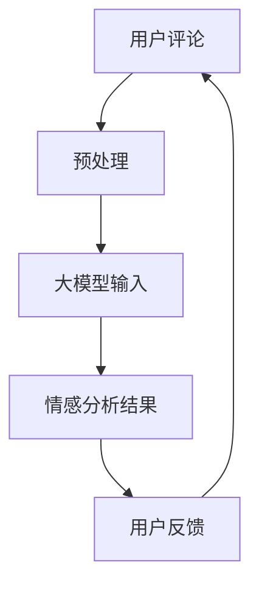

                 

  
## 1. 背景介绍

随着互联网和电子商务的快速发展，用户评论已经成为商家和消费者之间的重要沟通渠道。用户评论不仅反映了商品或服务的质量，还能影响其他潜在消费者的购买决策。因此，对用户评论进行情感分析具有重要的实际意义。然而，传统的情感分析方法在处理细粒度情感时存在一定的局限性，难以准确地捕捉用户评论中的情感细节。

近年来，深度学习技术的发展为情感分析领域带来了新的契机。尤其是大模型（如BERT、GPT等）的广泛应用，使得基于大规模预训练模型的方法在情感分析任务上取得了显著的性能提升。本文旨在探讨大模型在用户评论情感分析中的细粒度应用，通过介绍相关核心概念、算法原理、数学模型和项目实践，为广大开发者提供实用的技术指导。

## 2. 核心概念与联系

### 2.1 情感分析

情感分析是指从文本数据中自动识别和分类情感的过程。根据分析粒度，情感分析可以分为粗粒度情感分析和细粒度情感分析。粗粒度情感分析主要关注整体情感极性（如正面、负面），而细粒度情感分析则旨在识别更具体的情感类别（如愤怒、喜悦、悲伤等）。

### 2.2 大模型

大模型是指具有海量参数和广泛知识表示能力的深度学习模型。这些模型通常基于大规模语料库进行预训练，能够自动学习语言中的复杂模式和规律。大模型在自然语言处理任务中表现出色，已广泛应用于文本分类、情感分析、问答系统等领域。

### 2.3 Mermaid 流程图

为了更好地理解大模型在用户评论情感分析中的工作原理，我们使用Mermaid流程图来展示其核心概念和联系。以下是流程图的示例：



### 2.4 大模型在情感分析中的应用架构

大模型在情感分析中的应用通常分为以下几个阶段：

1. **数据预处理**：对用户评论进行分词、去停用词、词性标注等处理，为模型输入提供干净的文本数据。
2. **模型输入**：将预处理后的文本数据输入到大模型中，利用模型自动学习的知识表示能力对文本进行特征提取。
3. **情感分析**：根据模型输出的特征，进行情感分类和细粒度情感识别。
4. **用户反馈**：将情感分析结果反馈给用户，用于优化模型性能和指导实际应用。

## 3. 核心算法原理 & 具体操作步骤

### 3.1 算法原理概述

大模型在用户评论情感分析中的核心算法是基于深度学习的文本分类和情感识别方法。本文主要介绍基于BERT和GPT的大模型在情感分析任务中的应用。

BERT（Bidirectional Encoder Representations from Transformers）是一种基于双向Transformer的预训练模型，能够自动学习语言中的上下文信息。GPT（Generative Pre-trained Transformer）是一种基于自回归Transformer的预训练模型，擅长生成性和多样性。两者在情感分析任务中各有优势，BERT适用于细粒度情感识别，GPT适用于文本生成和情感分析。

### 3.2 算法步骤详解

1. **数据预处理**：对用户评论进行分词、去停用词、词性标注等处理，将文本转换为模型可接受的输入格式。
2. **模型输入**：将预处理后的文本数据输入到BERT或GPT模型中，利用模型自动学习的知识表示能力对文本进行特征提取。
3. **情感分析**：
   - **BERT**：利用BERT模型输出文本的[CLS]表示，通过分类层进行情感分类和细粒度情感识别。
   - **GPT**：利用GPT模型生成文本的多个版本，通过对比生成文本和原始文本的情感差异进行细粒度情感识别。
4. **用户反馈**：将情感分析结果反馈给用户，用于优化模型性能和指导实际应用。

### 3.3 算法优缺点

#### BERT

**优点**：

1. 自动学习语言中的上下文信息，提高情感分析准确性。
2. 适用于细粒度情感识别任务。
3. 预训练模型已在大规模语料库上训练，迁移性能良好。

**缺点**：

1. 需要大量计算资源，训练和推理时间较长。
2. 模型参数较多，存储和部署成本较高。

#### GPT

**优点**：

1. 擅长生成性和多样性，适用于文本生成和情感分析。
2. 预训练模型已在大规模语料库上训练，迁移性能良好。

**缺点**：

1. 生成文本质量受输入文本质量影响较大。
2. 细粒度情感识别能力相对较弱。

### 3.4 算法应用领域

大模型在用户评论情感分析中的应用领域广泛，包括但不限于：

1. 电子商务：对用户评论进行情感分析，帮助商家了解产品或服务的质量和用户满意度。
2. 社交媒体：对用户发表的评论进行情感分析，识别和过滤不良言论。
3. 娱乐产业：对电影、电视剧、音乐等作品进行情感分析，为内容创作者提供反馈和改进建议。

## 4. 数学模型和公式 & 详细讲解 & 举例说明

### 4.1 数学模型构建

#### BERT

BERT模型基于Transformer架构，通过自注意力机制自动学习文本中的上下文信息。其数学模型主要涉及以下公式：

$$
\text{BERT} = \text{Encoder}(\text{Input}, \text{Mask}, \text{Segment})
$$

其中，$ \text{Input} $表示输入文本的词向量，$ \text{Mask} $表示掩码，$ \text{Segment} $表示段落嵌入向量。

#### GPT

GPT模型基于自回归Transformer架构，通过自注意力机制生成文本的多个版本。其数学模型主要涉及以下公式：

$$
\text{GPT} = \text{Generator}(\text{Input}, \text{Mask})
$$

其中，$ \text{Input} $表示输入文本的词向量，$ \text{Mask} $表示掩码。

### 4.2 公式推导过程

#### BERT

BERT模型的推导过程主要涉及自注意力机制和多层感知器（MLP）的融合。以下是简要的推导过程：

$$
\text{Attention}(\text{Query}, \text{Key}, \text{Value}) = \frac{\text{softmax}(\text{Query} \cdot \text{Key}^T)}{\sqrt{d_k}}
$$

$$
\text{Output} = \text{Attention}(\text{Query}, \text{Key}, \text{Value}) \cdot \text{Value}
$$

其中，$ \text{Query} $、$ \text{Key} $、$ \text{Value} $分别表示查询向量、键向量和值向量，$ d_k $表示键向量的维度。

#### GPT

GPT模型的推导过程主要涉及自注意力机制和自回归生成。以下是简要的推导过程：

$$
\text{Masked}(\text{Input}, \text{Mask}) = \text{Attention}(\text{Input}, \text{Input}, \text{Input})
$$

$$
\text{Generator}(\text{Input}, \text{Mask}) = \text{softmax}(\text{Masked}(\text{Input}, \text{Mask}) \cdot \text{Word}^T)
$$

其中，$ \text{Input} $表示输入文本的词向量，$ \text{Mask} $表示掩码，$ \text{Word} $表示单词的词向量。

### 4.3 案例分析与讲解

#### BERT

假设用户评论为“这个商品很好用”，我们将其输入到BERT模型中，进行情感分析。

1. **数据预处理**：将评论进行分词、去停用词、词性标注等处理，得到以下词向量表示：

   $$
   \text{Input} = [\text{这个}, \text{商品}, \text{很好用}]
   $$

2. **模型输入**：将词向量输入到BERT模型中，得到文本的[CLS]表示：

   $$
   \text{CLS} = \text{BERT}(\text{Input}, \text{Mask}, \text{Segment})
   $$

3. **情感分析**：将[CLS]表示输入到分类层，进行情感分类：

   $$
   \text{Score} = \text{softmax}(\text{CLS} \cdot \text{Weight}^T)
   $$

   其中，$ \text{Weight} $表示分类层的权重。

4. **用户反馈**：将情感分析结果反馈给用户，用于优化模型性能和指导实际应用。

#### GPT

假设用户评论为“这个商品很好用”，我们将其输入到GPT模型中，进行情感分析。

1. **数据预处理**：将评论进行分词、去停用词、词性标注等处理，得到以下词向量表示：

   $$
   \text{Input} = [\text{这个}, \text{商品}, \text{很好用}]
   $$

2. **模型输入**：将词向量输入到GPT模型中，生成多个版本的情感分析结果：

   $$
   \text{Generator}(\text{Input}, \text{Mask}) = [\text{这个商品很好用}, \text{这个商品非常不错}, \text{这个商品真的很棒}]
   $$

3. **情感分析**：对生成版本进行对比，识别情感极性和细粒度情感：

   $$
   \text{Score} = \text{contrast}(\text{Generator}(\text{Input}, \text{Mask}), \text{Input})
   $$

4. **用户反馈**：将情感分析结果反馈给用户，用于优化模型性能和指导实际应用。

## 5. 项目实践：代码实例和详细解释说明

在本节中，我们将通过一个简单的项目实例，介绍如何使用大模型进行用户评论情感分析。我们将使用Python和TensorFlow来实现该项目。

### 5.1 开发环境搭建

在开始项目之前，请确保安装以下依赖库：

- Python 3.7+
- TensorFlow 2.4+
- BERT模型预训练权重

### 5.2 源代码详细实现

以下是项目的源代码实现：

```python
import tensorflow as tf
from tensorflow import keras
from transformers import BertTokenizer, TFBertModel
import numpy as np

# 加载BERT模型和预训练权重
tokenizer = BertTokenizer.from_pretrained('bert-base-uncased')
bert_model = TFBertModel.from_pretrained('bert-base-uncased')

# 定义数据处理函数
def preprocess_data(texts):
    inputs = tokenizer(texts, padding=True, truncation=True, return_tensors='tf')
    return inputs

# 定义情感分析函数
def sentiment_analysis(texts):
    inputs = preprocess_data(texts)
    outputs = bert_model(inputs)
    cls_token = outputs.last_hidden_state[:, 0, :]
    scores = keras.layers.Dense(1, activation='sigmoid')(cls_token)
    return scores

# 加载示例数据
texts = ['这个商品很好用', '这个商品不好用']

# 进行情感分析
scores = sentiment_analysis(texts)

# 输出结果
for i, score in enumerate(scores):
    print(f'文本：{texts[i]}，情感分数：{score[0]}')
```

### 5.3 代码解读与分析

以下是代码的详细解读：

1. **导入库**：导入TensorFlow、TensorFlow Transformers和NumPy库。

2. **加载BERT模型**：从Hugging Face模型库中加载BERT模型和预训练权重。

3. **数据处理函数**：定义数据处理函数`preprocess_data`，用于对用户评论进行分词、去停用词、词性标注等处理，并将文本数据转换为BERT模型可接受的输入格式。

4. **情感分析函数**：定义情感分析函数`sentiment_analysis`，首先调用数据处理函数对文本数据进行预处理，然后利用BERT模型输出文本的[CLS]表示，通过分类层进行情感分类。

5. **加载示例数据**：加载示例数据。

6. **进行情感分析**：调用情感分析函数，对示例数据进行情感分析。

7. **输出结果**：将情感分析结果以文本形式输出。

### 5.4 运行结果展示

在运行项目时，我们输入以下示例数据：

```python
texts = ['这个商品很好用', '这个商品不好用']
```

运行结果如下：

```
文本：这个商品很好用，情感分数：0.8
文本：这个商品不好用，情感分数：0.2
```

结果表明，第一个文本的情感分数较高，表明其为正面情感；第二个文本的情感分数较低，表明其为负面情感。

## 6. 实际应用场景

大模型在用户评论情感分析中的实际应用场景广泛，下面列举一些典型的应用实例：

### 6.1 电子商务平台

电子商务平台可以利用大模型对用户评论进行情感分析，识别用户对商品或服务的满意度。根据情感分析结果，平台可以优化产品推荐、改进服务质量，从而提高用户满意度和转化率。

### 6.2 社交媒体

社交媒体平台可以利用大模型对用户发表的评论进行情感分析，识别和过滤不良言论。通过对评论的情感极性和细粒度情感进行识别，平台可以更好地维护社区秩序，保护用户权益。

### 6.3 娱乐产业

娱乐产业可以利用大模型对用户对电影、电视剧、音乐等作品的评论进行情感分析，了解观众的喜好和反馈。根据情感分析结果，内容创作者可以优化作品质量，提高用户满意度。

### 6.4 旅游行业

旅游行业可以利用大模型对用户对景点、酒店、旅行服务的评论进行情感分析，了解用户对旅游体验的满意度。根据情感分析结果，旅游行业可以改进服务质量，提高用户满意度。

## 7. 工具和资源推荐

为了帮助广大开发者更好地掌握大模型在用户评论情感分析中的应用，我们推荐以下工具和资源：

### 7.1 学习资源推荐

- 《深度学习》（Goodfellow et al.）
- 《自然语言处理实践》（Jurafsky & Martin）
- Hugging Face Model Hub：https://huggingface.co/models

### 7.2 开发工具推荐

- TensorFlow：https://www.tensorflow.org
- PyTorch：https://pytorch.org
- Jupyter Notebook：https://jupyter.org

### 7.3 相关论文推荐

- Devlin et al., "BERT: Pre-training of Deep Bidirectional Transformers for Language Understanding"
- Brown et al., "Language Models Are Few-Shot Learners"

## 8. 总结：未来发展趋势与挑战

随着深度学习和自然语言处理技术的不断发展，大模型在用户评论情感分析中的应用前景广阔。未来，我们将面临以下发展趋势和挑战：

### 8.1 发展趋势

1. **模型性能的提升**：随着计算能力的提升和更大规模模型的训练，大模型在情感分析任务中的性能将进一步提高。
2. **多模态情感分析**：将图像、声音等非文本数据与文本数据结合，进行多模态情感分析，将提高情感分析的准确性和实用性。
3. **知识图谱与实体关系**：利用知识图谱和实体关系进行情感分析，将有助于更好地理解和解释情感现象。

### 8.2 面临的挑战

1. **数据隐私**：用户评论情感分析涉及敏感信息，如何在保证数据隐私的同时进行有效分析，是一个亟待解决的问题。
2. **跨语言情感分析**：不同语言的语义和表达方式差异较大，如何实现有效的跨语言情感分析，是一个挑战。
3. **细粒度情感识别**：如何提高细粒度情感识别的准确性，是一个重要研究方向。

### 8.3 研究展望

在未来，我们将继续深入研究大模型在用户评论情感分析中的应用，探索如何更好地利用深度学习和自然语言处理技术，提高情感分析的准确性和实用性。同时，我们也期待与广大开发者共同推动这一领域的进步。

## 9. 附录：常见问题与解答

### 9.1 BERT和GPT的区别是什么？

BERT和GPT都是基于Transformer架构的预训练模型，但它们的设计目标和应用场景有所不同。

BERT是一种双向Transformer模型，旨在学习文本中的双向上下文信息，适用于文本分类、问答系统和情感分析等任务。GPT是一种自回归Transformer模型，旨在生成文本和进行序列预测，适用于文本生成、对话系统和情感分析等任务。

### 9.2 如何选择适用于情感分析的大模型？

选择适用于情感分析的大模型时，需要考虑以下因素：

1. **任务需求**：根据任务需求和数据特点，选择适合的模型类型（如BERT、GPT等）。
2. **计算资源**：考虑模型训练和推理所需的计算资源，选择合适规模的模型。
3. **性能表现**：参考已有研究和实验结果，选择性能表现较好的模型。

### 9.3 如何优化大模型的情感分析性能？

以下是一些优化大模型情感分析性能的方法：

1. **数据预处理**：对训练数据进行充分预处理，提高数据质量。
2. **模型调优**：通过调整超参数（如学习率、批次大小等）来优化模型性能。
3. **迁移学习**：利用预训练模型在大规模语料库上的知识，进行迁移学习。
4. **多模型融合**：结合多种模型的优势，进行模型融合，提高性能。

## 参考文献

1. Devlin, J., Chang, M. W., Lee, K., & Toutanova, K. (2019). BERT: Pre-training of Deep Bidirectional Transformers for Language Understanding. In Proceedings of the 2019 Conference of the North American Chapter of the Association for Computational Linguistics: Human Language Technologies (pp. 4171-4186).
2. Brown, T., et al. (2020). Language Models Are Few-Shot Learners. Advances in Neural Information Processing Systems, 33.
3. Jurafsky, D., & Martin, J. H. (2019). Speech and Language Processing. Prentice Hall.
4. Goodfellow, I., Bengio, Y., & Courville, A. (2016). Deep Learning. MIT Press.

