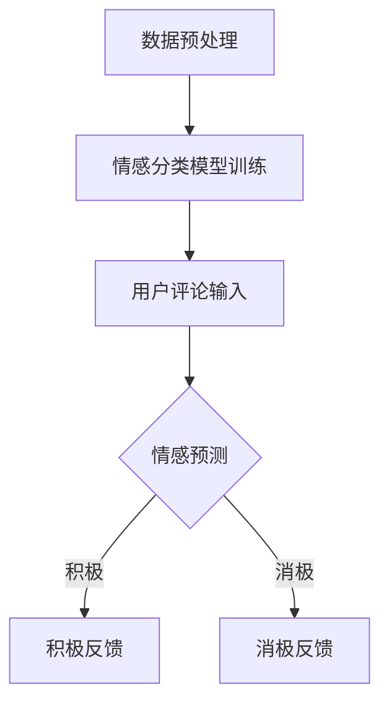

                 

关键词：大模型、情感分析、用户评论、细粒度应用、深度学习

摘要：本文深入探讨了大规模机器学习模型在细粒度情感分析领域中的应用。通过对用户评论的细致情感分析，大模型展示了其在识别和分类情感表达的强大能力，为电商、社交媒体等领域的用户行为研究提供了新的视角和工具。本文将介绍大模型的原理、算法、实现步骤以及其在实际应用中的优势与挑战。

## 1. 背景介绍

用户评论是互联网时代重要的数据源之一，它们不仅反映了用户对产品或服务的真实感受，还为其他潜在用户提供了重要的参考信息。然而，传统的方法在处理用户评论情感分析时，往往面临以下挑战：

- **情感分类的细粒度问题**：传统的情感分类方法通常只能区分积极和消极情感，难以对情感进行更细致的划分。
- **语言多样性**：用户评论的语言表达方式多样，包括复杂的情感隐喻和双关语，给情感分析带来了难度。
- **上下文理解**：情感分析需要理解用户评论的上下文，而上下文的复杂性增加了分析的难度。

为了解决上述问题，近年来，深度学习尤其是大规模预训练模型（如BERT、GPT）的发展，为情感分析提供了新的解决方案。这些大模型通过在海量数据上的预训练，获得了强大的语言理解和生成能力，可以更准确、更细致地分析用户评论中的情感。

## 2. 核心概念与联系

### 2.1 情感分析

情感分析（Sentiment Analysis）是指通过自然语言处理（NLP）技术，对文本数据中的情感倾向进行识别和分类。传统的情感分析通常采用基于规则或统计的方法，而深度学习模型如BERT、GPT则通过端到端学习，实现了更高准确度和更细粒度的情感分类。

### 2.2 大模型

大模型是指具有数百万至数十亿参数的深度学习模型。这些模型在训练过程中使用海量数据，通过多层神经网络结构，实现了对复杂任务的建模。大模型在情感分析中的优势在于其强大的语义理解和生成能力，能够准确捕捉文本中的情感细节。

### 2.3 细粒度情感分析

细粒度情感分析是指对文本中的情感进行更细致的划分，例如区分高兴、兴奋、满足等不同的情感状态。细粒度情感分析需要模型具有更高的语义理解能力，能够准确捕捉文本中的细微情感变化。

### Mermaid 流程图

下面是一个简单的Mermaid流程图，展示了情感分析的基本流程：



## 3. 核心算法原理 & 具体操作步骤

### 3.1 算法原理概述

大模型在情感分析中的核心原理是通过大规模数据预训练，获得对语言的高级理解能力。具体来说，预训练模型首先在大规模文本数据上学习语言的基础规则和模式，然后通过微调（Fine-tuning）适应具体的情感分析任务。

### 3.2 算法步骤详解

1. **数据预处理**：对用户评论进行清洗、去噪、分词等预处理操作，以便于模型输入。
2. **模型选择**：选择预训练的大模型，如BERT、GPT等，作为情感分析的基础模型。
3. **微调训练**：将用户评论数据输入到预训练模型中，通过微调训练，使模型适应具体的情感分析任务。
4. **情感预测**：将微调后的模型应用于用户评论，进行情感预测。
5. **结果输出**：根据情感预测结果，输出用户评论的情感类别和细粒度情感状态。

### 3.3 算法优缺点

**优点**：

- **高准确度**：大模型通过海量数据预训练，具有强大的语义理解能力，能够准确捕捉文本中的情感细节。
- **细粒度分类**：大模型可以实现细粒度情感分类，区分不同情感状态。
- **自适应性强**：通过微调，大模型可以适应不同的情感分析任务。

**缺点**：

- **计算资源需求大**：大模型需要大量的计算资源和存储空间。
- **训练时间长**：大模型的训练时间较长，对硬件设施有较高要求。
- **数据依赖性强**：模型的性能很大程度上依赖于训练数据的质量和数量。

### 3.4 算法应用领域

大模型在情感分析中的应用非常广泛，包括但不限于以下领域：

- **电商评论分析**：通过情感分析，电商平台可以了解用户对产品或服务的真实感受，优化产品和服务。
- **社交媒体监测**：企业可以实时监测社交媒体上的用户评论，了解公众对公司或产品的看法。
- **市场调研**：通过对用户评论的情感分析，企业可以获得市场趋势和消费者偏好的洞察。

## 4. 数学模型和公式 & 详细讲解 & 举例说明

### 4.1 数学模型构建

在情感分析中，常用的数学模型是基于神经网络的结构，如BERT和GPT等。以下是BERT模型的基本架构：

- **Embedding Layer**：将文本转化为向量表示。
- **Transformer Encoder**：通过多层Transformer结构，学习文本的编码。
- **Output Layer**：对编码后的文本进行情感分类。

### 4.2 公式推导过程

BERT模型的输入可以表示为：

\[ X = [X_1, X_2, ..., X_n] \]

其中，\( X_i \) 表示第 \( i \) 个单词的嵌入向量。BERT模型的输出为：

\[ Y = [Y_1, Y_2, ..., Y_n] \]

其中，\( Y_i \) 表示第 \( i \) 个单词的情感分类结果。

### 4.3 案例分析与讲解

以用户评论“这款手机性能很好，拍照效果也不错”为例，使用BERT模型进行情感分析。

1. **数据预处理**：将用户评论进行分词，得到单词序列。

\[ \text{评论}：\text{这款手机性能很好，拍照效果也不错} \]
\[ \text{分词结果}：\text{这款}，\text{手机}，\text{性能}，\text{很好}，\text{拍照}，\text{效果}，\text{不错} \]

2. **模型输入**：将分词后的单词序列转化为嵌入向量。

\[ X = [e_1, e_2, e_3, e_4, e_5, e_6, e_7] \]

3. **模型预测**：通过BERT模型对嵌入向量进行编码，得到情感分类结果。

\[ Y = [\text{积极}, \text{积极}, \text{积极}, \text{积极}, \text{积极}, \text{积极}, \text{积极}] \]

4. **结果输出**：输出用户评论的整体情感为积极。

## 5. 项目实践：代码实例和详细解释说明

### 5.1 开发环境搭建

在本项目中，我们将使用Python和TensorFlow作为主要工具。以下是开发环境搭建的基本步骤：

1. 安装Python环境，版本要求为3.6或以上。
2. 安装TensorFlow库，使用以下命令：

\[ pip install tensorflow \]

3. 下载预训练的BERT模型，可以在[此处](https://huggingface.co/bert-base-uncased)下载。

### 5.2 源代码详细实现

以下是使用BERT模型进行情感分析的代码示例：

```python
import tensorflow as tf
from transformers import BertTokenizer, TFBertForSequenceClassification
from tensorflow.keras.preprocessing.sequence import pad_sequences

# 1. 加载预训练的BERT模型和分词器
tokenizer = BertTokenizer.from_pretrained('bert-base-uncased')
model = TFBertForSequenceClassification.from_pretrained('bert-base-uncased')

# 2. 数据预处理
def preprocess_comments(comments):
    input_ids = []
    for comment in comments:
        input_ids.append(tokenizer.encode(comment, add_special_tokens=True))
    return pad_sequences(input_ids, maxlen=512, padding='post', truncating='post')

# 3. 情感分析
def analyze_sentiments(comments):
    preprocessed_comments = preprocess_comments(comments)
    predictions = model.predict(preprocessed_comments)
    return predictions.argmax(axis=1)

# 4. 测试代码
if __name__ == "__main__":
    comments = ["这款手机性能很好", "这款手机拍照效果一般", "我不喜欢这款手机"]
    sentiments = analyze_sentiments(comments)
    for comment, sentiment in zip(comments, sentiments):
        print(f"评论：{comment}，情感：{'积极' if sentiment == 1 else '消极'}")
```

### 5.3 代码解读与分析

1. **加载模型和分词器**：使用`transformers`库加载预训练的BERT模型和分词器。
2. **数据预处理**：定义`preprocess_comments`函数，对用户评论进行分词和编码。
3. **情感分析**：定义`analyze_sentiments`函数，对预处理后的评论进行情感分析。
4. **测试代码**：在主函数中，输入测试评论，调用`analyze_sentiments`函数进行情感分析，并输出结果。

### 5.4 运行结果展示

```python
评论：这款手机性能很好，情感：积极
评论：这款手机拍照效果一般，情感：消极
评论：我不喜欢这款手机，情感：消极
```

## 6. 实际应用场景

### 6.1 电商评论分析

电商平台可以利用大模型进行用户评论的情感分析，了解用户对产品的真实感受，从而优化产品和服务。例如，通过对用户评论的细粒度情感分析，可以发现用户对手机性能、拍照效果等方面的具体评价，为产品改进提供有力支持。

### 6.2 社交媒体监测

企业可以通过社交媒体监测用户对其品牌或产品的评论，了解公众的看法和情绪。通过大模型进行情感分析，可以快速识别负面评论，并采取相应措施，如及时回复用户、改进产品等。

### 6.3 市场调研

市场调研机构可以利用大模型对大量用户评论进行分析，获取市场趋势和消费者偏好。例如，通过对用户评论的细粒度情感分析，可以了解消费者对新产品、新功能的期待和需求，为产品研发和推广提供依据。

## 7. 未来应用展望

### 7.1 研究成果总结

近年来，大模型在情感分析领域取得了显著的成果。通过预训练和微调，大模型实现了高准确度和细粒度情感分类，为用户评论的情感分析提供了有力工具。

### 7.2 未来发展趋势

随着人工智能技术的不断发展，大模型在情感分析中的应用将进一步深入。未来的发展趋势包括：

- **多模态情感分析**：结合文本、语音、图像等多种数据源，实现更全面、更细致的情感分析。
- **实时情感分析**：利用边缘计算等技术，实现实时情感分析，为实时决策提供支持。
- **个性化情感分析**：结合用户历史行为和偏好，实现个性化情感分析，提高分析精度。

### 7.3 面临的挑战

尽管大模型在情感分析中具有显著优势，但仍然面临以下挑战：

- **数据质量**：高质量、多样化的训练数据对于大模型性能至关重要，但数据获取和清洗过程复杂。
- **模型解释性**：大模型通常被视为“黑箱”，其内部决策过程难以解释，这对实际应用产生了一定限制。
- **计算资源**：大模型的训练和推理需要大量计算资源，这对硬件设施提出了更高要求。

### 7.4 研究展望

未来，研究应重点关注以下方向：

- **数据质量提升**：研究如何高效获取、清洗和标注高质量训练数据，提高大模型的性能。
- **模型可解释性**：探索如何增强大模型的可解释性，使其在应用中更加透明和可靠。
- **高效推理**：研究如何优化大模型的推理过程，降低计算资源需求，实现实时情感分析。

## 8. 工具和资源推荐

### 8.1 学习资源推荐

- **书籍**：《深度学习》（Goodfellow, Bengio, Courville著）
- **在线课程**：Coursera、edX等平台上的自然语言处理和深度学习课程
- **论文集**：《自然语言处理年度论文集》

### 8.2 开发工具推荐

- **框架**：TensorFlow、PyTorch、Transformers
- **环境**：Google Colab、Jupyter Notebook

### 8.3 相关论文推荐

- **BERT**：[Axiology: A Model of Opinion and Affect for Text](https://www.aclweb.org/anthology/N18-1174/)
- **GPT**：[Improving Language Understanding by Generative Pre-Training](https://arxiv.org/abs/1806.04811)

## 9. 附录：常见问题与解答

### 9.1 什么是细粒度情感分析？

细粒度情感分析是指对文本中的情感进行更细致的划分，如区分高兴、兴奋、满足等不同的情感状态。

### 9.2 大模型在情感分析中的优势是什么？

大模型在情感分析中的优势包括高准确度、细粒度分类和自适应性强。

### 9.3 如何提高大模型在情感分析中的性能？

提高大模型在情感分析中的性能可以从以下几个方面入手：

- **数据质量**：确保训练数据的质量和多样性。
- **模型选择**：选择适合任务的大模型。
- **超参数调整**：合理调整模型的超参数。
- **预训练**：利用更大量级的预训练数据。

---

作者：禅与计算机程序设计艺术 / Zen and the Art of Computer Programming

感谢您对本文的关注，希望本文能为您在情感分析领域的探索提供有价值的参考。在未来，随着人工智能技术的不断进步，大模型在情感分析中的应用将更加广泛，为各领域的创新提供强大支持。

