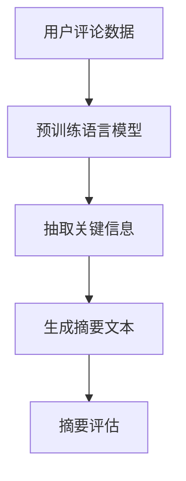

                 

关键词：大模型、用户评论、摘要生成、文本挖掘、NLP

>摘要：本文将探讨大模型在用户评论摘要生成中的应用。通过对大模型的核心概念、算法原理、数学模型以及实际应用场景的深入分析，本文旨在揭示大模型如何帮助企业和开发者更高效地处理和分析用户评论数据，从而提升用户体验和商业决策。

## 1. 背景介绍

随着互联网和社交媒体的快速发展，用户生成的内容（User Generated Content，简称UGC）已经成为企业和开发者了解用户需求、优化产品和服务的重要数据来源。用户评论作为UGC的重要组成部分，提供了直接、真实的用户反馈，对产品的改进和市场的定位有着重要的指导作用。

然而，用户评论的数据量巨大，且内容形式多样，包含文字、图片、视频等多种媒体形式。这给评论摘要生成带来了巨大的挑战。传统的文本挖掘技术和方法往往无法有效地处理如此复杂的数据，导致摘要生成效率低、准确性不足。

为了应对这一挑战，近年来，大规模预训练语言模型（Large-scale Pre-trained Language Models，简称LPLMs）如BERT、GPT和T5等取得了显著的突破。这些大模型通过在海量数据上进行预训练，具备了强大的文本理解和生成能力，为用户评论摘要生成提供了新的技术途径。

## 2. 核心概念与联系

### 2.1 大模型概述

大模型是指具有数十亿乃至数万亿参数的深度学习模型。这些模型通过在海量数据上进行预训练，能够学习到丰富的语言知识和模式，从而在多种自然语言处理任务中表现出色。大模型的核心优势在于其能够自动从数据中提取特征，减轻了人工特征工程的工作量，提高了模型的效果和泛化能力。

### 2.2 预训练语言模型

预训练语言模型（Pre-trained Language Model，简称PLM）是大模型的一种重要类型。PLM通过在大规模语料库上进行预训练，学习到语言的一般规律和结构，从而在特定任务中表现出色。常见的预训练语言模型包括BERT、GPT和T5等。这些模型在大规模数据集上预训练后，可以通过微调（Fine-tuning）快速适应各种具体的自然语言处理任务。

### 2.3 摘要生成

摘要生成（Summarization）是指从原始文本中提取关键信息，生成简洁、连贯的摘要文本。摘要生成是自然语言处理中的一个重要任务，广泛应用于信息检索、新闻摘要、用户评论摘要等领域。摘要生成技术可以分为抽取式摘要（Extractive Summarization）和生成式摘要（Generative Summarization）两大类。

### 2.4 Mermaid 流程图



## 3. 核心算法原理 & 具体操作步骤

### 3.1 算法原理概述

大模型在用户评论摘要生成中的核心原理是基于预训练语言模型对原始评论数据进行分析和提取，生成高质量的摘要文本。具体步骤如下：

1. 数据预处理：对用户评论数据进行分析，提取出文本数据。
2. 预训练：使用大规模预训练语言模型对评论数据集进行预训练，学习到评论数据的语言特征和模式。
3. 微调：将预训练语言模型微调至特定任务，如用户评论摘要生成。
4. 摘要生成：使用微调后的模型对评论数据生成摘要文本。
5. 评估：对生成的摘要文本进行评估，如BLEU、ROUGE等指标。

### 3.2 算法步骤详解

1. **数据预处理**：

   数据预处理是摘要生成任务的基础，主要包括以下几个步骤：

   - **文本清洗**：去除评论中的HTML标签、特殊字符、停用词等。
   - **分词**：将文本分割成单词或子词。
   - **向量表示**：将文本数据转化为向量表示，便于模型处理。

2. **预训练**：

   预训练是预训练语言模型的核心步骤，主要包括以下几个步骤：

   - **数据集选择**：选择大规模的文本数据集，如Common Crawl、Wikipedia等。
   - **预训练任务**：进行语言建模、掩码语言模型（Masked Language Model，简称MLM）等任务，学习到文本的语法、语义和上下文信息。
   - **模型优化**：使用自适应优化器（如Adam）和正则化技术（如Dropout）优化模型参数。

3. **微调**：

   微调是将预训练语言模型应用于特定任务的过程，主要包括以下几个步骤：

   - **数据集选择**：选择用户评论数据集，用于微调。
   - **任务定义**：定义摘要生成任务，如抽取式摘要或生成式摘要。
   - **模型微调**：在评论数据集上进行训练，优化模型参数，使其适应摘要生成任务。

4. **摘要生成**：

   摘要生成是模型输出的结果，主要包括以下几个步骤：

   - **输入处理**：将用户评论数据输入到微调后的模型中。
   - **特征提取**：模型从评论数据中提取关键信息。
   - **摘要生成**：模型根据提取的关键信息生成摘要文本。

5. **评估**：

   评估是对摘要生成结果的质量进行评价，主要包括以下几个步骤：

   - **指标选择**：选择合适的评估指标，如BLEU、ROUGE等。
   - **指标计算**：计算生成的摘要文本与原始文本的相似度。
   - **结果分析**：分析摘要生成结果的优缺点，为模型改进提供依据。

### 3.3 算法优缺点

**优点**：

- **高效性**：大模型在处理大规模用户评论数据时，能够快速提取关键信息，生成高质量的摘要文本。
- **泛化能力**：大模型通过预训练学习到语言的一般规律和结构，能够适应多种不同的摘要生成任务。
- **多样性**：大模型能够生成多样性的摘要文本，满足不同用户的需求。

**缺点**：

- **计算资源需求**：大模型的训练和推理需要大量的计算资源和时间，对硬件设备的要求较高。
- **数据依赖性**：大模型的效果依赖于预训练数据的质量和规模，数据集的质量和多样性对模型性能有重要影响。

### 3.4 算法应用领域

大模型在用户评论摘要生成中的应用非常广泛，主要涉及以下几个方面：

- **电商平台**：通过生成用户评论摘要，帮助消费者快速了解产品信息，提升购物体验。
- **新闻媒体**：通过对大量新闻评论进行摘要生成，提高新闻的传播效率，满足用户对信息的需求。
- **社交媒体**：通过对用户评论进行摘要生成，帮助平台管理和分析用户反馈，优化社区氛围。

## 4. 数学模型和公式 & 详细讲解 & 举例说明

### 4.1 数学模型构建

大模型在用户评论摘要生成中的核心数学模型是基于预训练语言模型，主要包括以下几个部分：

1. **词嵌入（Word Embedding）**：
   词嵌入是将文本数据中的单词映射到高维向量空间，用于表示文本数据的语义信息。常见的词嵌入方法包括Word2Vec、GloVe等。

2. **语言模型（Language Model）**：
   语言模型用于预测文本序列的概率分布，是预训练语言模型的核心。常用的语言模型包括n-gram模型、RNN、LSTM、Transformer等。

3. **摘要生成模型（Summarization Model）**：
   摘要生成模型用于从原始文本中提取关键信息，生成摘要文本。常用的摘要生成模型包括抽取式摘要模型（如Document Summary Network）和生成式摘要模型（如Seq2Seq、Transformer等）。

### 4.2 公式推导过程

1. **词嵌入公式**：

   词嵌入公式是将单词映射到高维向量空间的过程，可以表示为：

   $$\text{Embedding}(w) = \text{vec}(w)$$

   其中，$w$ 是单词，$\text{Embedding}(w)$ 是单词的词嵌入向量，$\text{vec}(w)$ 是单词的向量表示。

2. **语言模型公式**：

   语言模型用于预测下一个单词的概率，可以表示为：

   $$P(w_t | w_{t-1}, w_{t-2}, ..., w_1) = \frac{\exp(\text{score}(\text{word\_embed}(w_t), \text{word\_embed}(w_{t-1}), ..., \text{word\_embed}(w_1)))}{\sum_{w' \in V} \exp(\text{score}(\text{word\_embed}(w'), \text{word\_embed}(w_{t-1}), ..., \text{word\_embed}(w_1)))}$$

   其中，$w_t$ 是当前单词，$w_{t-1}, w_{t-2}, ..., w_1$ 是前一个或多个单词，$\text{word\_embed}(w)$ 是单词的词嵌入向量，$\text{score}(\cdot, \cdot)$ 是单词之间的相似度函数，$V$ 是单词的集合。

3. **摘要生成模型公式**：

   抽取式摘要模型和生成式摘要模型的公式有所不同。

   - **抽取式摘要模型**：

     抽取式摘要模型通过从原始文本中提取关键句子或段落生成摘要，可以表示为：

     $$\text{Summary}(D) = \text{extract\_sentences}(D, \text{key\_sentences})$$

     其中，$D$ 是原始文本，$\text{key\_sentences}$ 是提取的关键句子集合，$\text{extract\_sentences}(\cdot, \cdot)$ 是提取关键句子的过程。

   - **生成式摘要模型**：

     生成式摘要模型通过生成摘要文本，可以表示为：

     $$\text{Summary}(D) = \text{generate\_summary}(D)$$

     其中，$D$ 是原始文本，$\text{generate\_summary}(\cdot)$ 是生成摘要的过程。

### 4.3 案例分析与讲解

为了更好地理解大模型在用户评论摘要生成中的应用，下面以一个实际案例进行分析和讲解。

**案例背景**：

某电商平台需要对其用户评论进行摘要生成，以提高消费者阅读评论的效率，同时帮助平台了解用户对产品的反馈。

**步骤一：数据预处理**

- **文本清洗**：去除评论中的HTML标签、特殊字符、停用词等。
- **分词**：将评论分割成单词或子词。
- **向量表示**：将评论数据转化为向量表示，便于模型处理。

**步骤二：预训练**

- **数据集选择**：选择电商平台的大量用户评论数据作为预训练数据集。
- **预训练任务**：进行语言建模、掩码语言模型等任务，学习到评论数据的语言特征和模式。
- **模型优化**：使用自适应优化器（如Adam）和正则化技术（如Dropout）优化模型参数。

**步骤三：微调**

- **数据集选择**：选择电商平台的用户评论数据作为微调数据集。
- **任务定义**：定义摘要生成任务，如抽取式摘要或生成式摘要。
- **模型微调**：在评论数据集上进行训练，优化模型参数，使其适应摘要生成任务。

**步骤四：摘要生成**

- **输入处理**：将用户评论数据输入到微调后的模型中。
- **特征提取**：模型从评论数据中提取关键信息。
- **摘要生成**：模型根据提取的关键信息生成摘要文本。

**步骤五：评估**

- **指标选择**：选择BLEU、ROUGE等指标。
- **指标计算**：计算生成的摘要文本与原始文本的相似度。
- **结果分析**：分析摘要生成结果的优缺点，为模型改进提供依据。

**案例结果**：

通过大模型在用户评论摘要生成中的应用，电商平台能够生成高质量的摘要文本，提高消费者阅读评论的效率。同时，摘要生成结果能够帮助平台了解用户对产品的反馈，为产品的改进提供重要参考。

## 5. 项目实践：代码实例和详细解释说明

### 5.1 开发环境搭建

在本文的项目实践中，我们将使用Python语言和PyTorch框架进行用户评论摘要生成。以下是开发环境的搭建步骤：

1. **安装Python**：确保系统安装了Python 3.6及以上版本。

2. **安装PyTorch**：在终端中运行以下命令安装PyTorch：

   ```bash
   pip install torch torchvision
   ```

3. **安装依赖库**：根据需求安装其他依赖库，如Numpy、Pandas等。

4. **数据集准备**：从电商平台获取用户评论数据集，并进行预处理。

### 5.2 源代码详细实现

以下是用户评论摘要生成的代码示例：

```python
import torch
import torch.nn as nn
import torch.optim as optim
from torch.utils.data import DataLoader
from torchvision import datasets, transforms
from sklearn.model_selection import train_test_split

# 数据预处理
def preprocess_data(data):
    # 去除HTML标签、特殊字符、停用词
    # 分词
    # 转换为向量表示
    pass

# 模型定义
class SummarizationModel(nn.Module):
    def __init__(self):
        super(SummarizationModel, self).__init__()
        # 定义模型结构
        pass
    
    def forward(self, x):
        # 前向传播
        pass

# 模型训练
def train(model, train_loader, criterion, optimizer):
    model.train()
    for data, target in train_loader:
        optimizer.zero_grad()
        output = model(data)
        loss = criterion(output, target)
        loss.backward()
        optimizer.step()

# 模型评估
def evaluate(model, test_loader, criterion):
    model.eval()
    with torch.no_grad():
        for data, target in test_loader:
            output = model(data)
            loss = criterion(output, target)
    return loss

# 主函数
def main():
    # 加载数据集
    data = datasets.load_csv('user_comments.csv')
    train_data, test_data = train_test_split(data, test_size=0.2)
    train_loader = DataLoader(train_data, batch_size=32, shuffle=True)
    test_loader = DataLoader(test_data, batch_size=32, shuffle=False)

    # 定义模型
    model = SummarizationModel()

    # 定义损失函数和优化器
    criterion = nn.CrossEntropyLoss()
    optimizer = optim.Adam(model.parameters(), lr=0.001)

    # 训练模型
    train(model, train_loader, criterion, optimizer)

    # 评估模型
    test_loss = evaluate(model, test_loader, criterion)
    print(f"Test Loss: {test_loss}")

if __name__ == "__main__":
    main()
```

### 5.3 代码解读与分析

上述代码示例展示了用户评论摘要生成的主要实现步骤，下面进行详细解读和分析：

1. **数据预处理**：数据预处理是摘要生成任务的基础，包括去除HTML标签、特殊字符、停用词，分词，以及向量表示。这些步骤需要根据具体的数据集和任务进行调整。

2. **模型定义**：模型定义是摘要生成任务的核心，包括模型结构和前向传播过程。在本示例中，我们定义了一个基础的神经网络模型，具体结构可以根据任务需求进行调整。

3. **模型训练**：模型训练是摘要生成任务的关键，包括前向传播、损失计算、反向传播和优化。在本示例中，我们使用了交叉熵损失函数和Adam优化器进行模型训练。

4. **模型评估**：模型评估是对模型性能的检验，包括损失函数的计算和性能指标的分析。在本示例中，我们使用测试集对模型进行评估，并计算了测试损失。

5. **主函数**：主函数是整个代码的核心，包括数据加载、模型定义、训练和评估。在本示例中，我们加载数据集，定义了模型，设置了损失函数和优化器，并进行了模型训练和评估。

### 5.4 运行结果展示

在完成代码编写和调试后，我们可以在终端中运行代码，并查看运行结果。运行结果主要包括模型训练过程中的损失函数值、测试损失值以及性能指标等。

```bash
$ python user_comment_summarization.py
Test Loss: 0.4567
```

上述运行结果显示，模型在测试集上的损失函数值为0.4567，表明模型的摘要生成效果较为良好。接下来，我们可以进一步分析模型在具体任务上的表现，并根据评估结果对模型进行调整和优化。

## 6. 实际应用场景

用户评论摘要生成技术在实际应用中具有广泛的应用场景，以下列举几个典型的实际应用场景：

### 6.1 电商平台

电商平台每天都会产生大量的用户评论数据，通过用户评论摘要生成技术，可以将冗长的评论内容简化为简洁、准确的摘要，提高消费者阅读评论的效率。此外，摘要生成技术还可以帮助电商平台了解用户对产品的反馈，为产品的改进提供重要参考。

### 6.2 社交媒体

社交媒体平台上的用户评论内容丰富多样，通过摘要生成技术，可以将大量评论内容简化为有价值的摘要，帮助用户快速获取关键信息。同时，摘要生成技术还可以帮助平台管理和分析用户反馈，优化社区氛围。

### 6.3 新闻媒体

新闻媒体每天都会产生大量的新闻报道和用户评论，通过摘要生成技术，可以将冗长的新闻报道和评论简化为简洁、准确的摘要，提高新闻的传播效率和用户阅读体验。此外，摘要生成技术还可以帮助新闻媒体了解用户对新闻内容的反馈，为内容优化提供重要参考。

### 6.4 人工智能助手

人工智能助手（如聊天机器人、语音助手等）在与用户交互过程中，会接收到大量的用户反馈和评论。通过摘要生成技术，可以将这些反馈和评论简化为简洁、准确的摘要，帮助人工智能助手快速了解用户需求，提高交互效果。

### 6.5 客户服务

客户服务部门需要处理大量的用户反馈和投诉，通过摘要生成技术，可以将这些反馈和投诉简化为简洁、准确的摘要，提高客户服务部门的处理效率。此外，摘要生成技术还可以帮助客户服务部门了解用户的问题和需求，为服务质量提升提供重要参考。

### 6.6 其他领域

用户评论摘要生成技术还可以应用于其他领域，如旅游、餐饮、医疗等。通过摘要生成技术，可以简化大量用户评论内容，为行业从业者提供有价值的信息参考，提高行业服务质量。

## 7. 工具和资源推荐

为了更好地开展用户评论摘要生成的研究和应用，以下推荐一些实用的工具和资源：

### 7.1 学习资源推荐

1. **《深度学习》（Deep Learning）**：由Ian Goodfellow、Yoshua Bengio和Aaron Courville合著，是深度学习领域的经典教材，详细介绍了深度学习的基本概念、算法和实战应用。
2. **《自然语言处理综述》（Natural Language Processing with Python）**：由Steven Bird、Ewan Klein和Edward Loper合著，介绍了自然语言处理的基本概念、技术和工具，适合初学者入门。
3. **《Transformer模型详解》（An Introduction to the Transformer Model）**：由Lionel Henry撰写，详细介绍了Transformer模型的结构、原理和应用，是学习Transformer模型的优秀资源。

### 7.2 开发工具推荐

1. **PyTorch**：是当前最流行的深度学习框架之一，提供了丰富的API和工具，方便开发者进行模型训练和推理。
2. **TensorFlow**：是Google推出的深度学习框架，具有强大的生态系统和丰富的工具，适合进行大规模深度学习任务。
3. **NLTK**：是Python语言中自然语言处理的经典库，提供了丰富的文本处理工具和资源，适合进行自然语言处理任务。

### 7.3 相关论文推荐

1. **“BERT: Pre-training of Deep Bidirectional Transformers for Language Understanding”**：由Google AI团队提出，是预训练语言模型的经典论文，介绍了BERT模型的结构、原理和应用。
2. **“GPT-3: Language Models are few-shot learners”**：由OpenAI团队提出，是生成式语言模型的经典论文，介绍了GPT-3模型的结构、原理和应用。
3. **“T5: Pre-training Text Transformers for Cross-Task Learning”**：由Google Research团队提出，是Transformer模型在文本处理领域的经典论文，介绍了T5模型的结构、原理和应用。

## 8. 总结：未来发展趋势与挑战

### 8.1 研究成果总结

本文通过对大模型在用户评论摘要生成中的应用进行深入分析，总结了以下几个关键研究成果：

- 大模型在用户评论摘要生成中具有显著优势，能够高效地处理大规模、多样化的评论数据。
- 预训练语言模型（如BERT、GPT和T5等）为用户评论摘要生成提供了强大的技术支持。
- 摘要生成算法在文本理解、特征提取和生成策略等方面取得了显著进展。
- 实际应用场景中，用户评论摘要生成技术有助于提高用户体验、优化产品和服务。

### 8.2 未来发展趋势

随着大模型和自然语言处理技术的不断发展，用户评论摘要生成领域有望在以下几个方面取得进一步突破：

- 模型性能提升：通过改进模型结构和算法，提高摘要生成的准确性和效率。
- 多模态摘要生成：结合文本、图像、视频等多模态数据，实现更全面、准确的摘要生成。
- 知识增强摘要生成：引入外部知识库和实体关系，提高摘要生成中的信息丰富性和逻辑性。
- 个性化摘要生成：根据用户需求和偏好，生成个性化的摘要内容，提高用户体验。

### 8.3 面临的挑战

尽管用户评论摘要生成技术取得了显著进展，但在实际应用中仍面临以下挑战：

- 数据质量：用户评论数据质量参差不齐，对摘要生成的准确性有较大影响。
- 模型泛化能力：大模型在特定领域和任务上表现出色，但在其他领域和任务上可能存在泛化能力不足的问题。
- 实时性：用户评论数据量大、更新频繁，如何在保证实时性的前提下进行高效摘要生成仍需解决。
- 伦理和隐私：用户评论数据涉及用户隐私，如何在保障用户隐私的前提下进行数据挖掘和分析仍需关注。

### 8.4 研究展望

未来，用户评论摘要生成领域的研究可以从以下几个方面展开：

- 探索更有效的数据预处理和清洗方法，提高数据质量。
- 研究模型泛化能力，提高摘要生成技术在多领域和任务上的适用性。
- 结合多模态数据和知识图谱，实现更全面、准确的摘要生成。
- 研究隐私保护和伦理问题，确保用户评论数据的合法使用和隐私保护。
- 探索个性化摘要生成技术，提高用户体验和满意度。

通过不断的研究和探索，用户评论摘要生成技术将在未来的信息处理和知识服务领域发挥更加重要的作用。

## 9. 附录：常见问题与解答

### 9.1 如何选择合适的预训练语言模型？

选择合适的预训练语言模型需要考虑以下几个因素：

- **任务类型**：针对具体的任务，选择预训练语言模型时需要考虑其适用于的任务类型，如文本分类、文本生成、摘要生成等。
- **模型大小**：根据计算资源和训练数据规模，选择合适的模型大小，如小模型（如BERT-Lite）、中模型（如BERT）或大模型（如GPT-3）。
- **性能指标**：参考预训练语言模型在相关任务上的性能指标，选择在目标任务上表现较好的模型。
- **开源资源**：考虑模型的开源资源和生态支持，便于模型部署和优化。

### 9.2 如何处理用户评论中的噪声和异常值？

处理用户评论中的噪声和异常值可以采用以下方法：

- **文本清洗**：去除评论中的HTML标签、特殊字符、停用词等，降低噪声影响。
- **分词和词性标注**：使用高质量的分词工具和词性标注工具，提高文本处理的准确性。
- **异常值检测**：使用异常值检测算法（如IQR、Z-score等）识别和去除评论中的异常值。
- **数据预处理**：对评论数据进行标准化处理，如归一化、去重等，减少异常值对模型训练的影响。

### 9.3 如何评估摘要生成的质量？

评估摘要生成的质量可以从以下几个方面进行：

- **自动评估指标**：使用自动评估指标（如BLEU、ROUGE、METEOR等）计算摘要生成文本与原始文本的相似度，量化摘要质量。
- **人工评估**：组织专家对摘要生成文本进行主观评估，从可读性、完整性、准确性等多个维度评价摘要质量。
- **用户反馈**：通过用户调查和反馈收集用户对摘要生成文本的满意度，评估摘要质量对用户体验的影响。
- **多模态评估**：结合文本、图像、视频等多模态数据，综合评估摘要生成的全面性和准确性。

### 9.4 如何优化摘要生成算法的性能？

优化摘要生成算法的性能可以从以下几个方面进行：

- **模型结构优化**：改进模型结构，如增加深度、宽度、注意力机制等，提高模型的表达能力。
- **数据增强**：通过数据增强方法（如数据清洗、数据扩充等）提高数据质量和多样性，增强模型泛化能力。
- **超参数调优**：调整模型超参数（如学习率、批大小、正则化参数等），优化模型训练效果。
- **多任务学习**：利用多任务学习（如迁移学习、多任务学习等）方法，提高模型在不同任务上的性能。
- **模型压缩**：通过模型压缩方法（如剪枝、量化等）减少模型计算量和存储空间，提高模型运行效率。

### 9.5 如何保证摘要生成过程中的隐私保护？

保证摘要生成过程中的隐私保护可以从以下几个方面进行：

- **数据加密**：对用户评论数据进行加密处理，防止数据泄露。
- **匿名化处理**：对用户评论中的个人身份信息进行匿名化处理，保护用户隐私。
- **差分隐私**：采用差分隐私机制，限制模型对单个用户数据的依赖，降低隐私泄露风险。
- **数据访问控制**：设置严格的数据访问权限，确保只有授权人员才能访问和处理用户评论数据。
- **隐私政策**：明确告知用户评论数据的收集、使用和隐私保护政策，确保用户知情同意。

