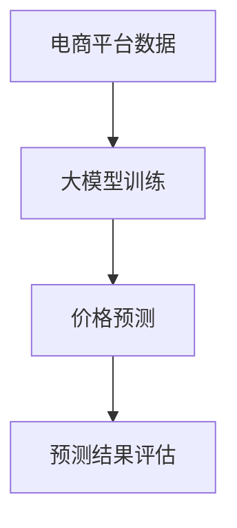

                 

关键词：大模型，电商平台，价格预测，深度学习，数据驱动，人工智能

摘要：本文将探讨大模型在电商平台价格预测中的应用。随着电子商务的快速发展，价格预测对于电商平台具有重要意义。大模型凭借其强大的数据处理能力和自学习能力，在价格预测领域展现出巨大的潜力。本文将介绍大模型的基本概念、核心算法原理、数学模型构建、项目实践以及未来应用展望。

## 1. 背景介绍

### 电商平台价格预测的重要性

在电子商务领域，价格预测是一个关键问题。电商平台需要实时监控市场价格变化，以便及时调整商品价格，提高销售额和利润。价格预测不仅有助于电商平台优化库存管理，还可以提高消费者的购物体验，降低消费者的购买成本。

### 大模型的发展与应用

随着深度学习技术的发展，大模型（如深度神经网络、生成对抗网络等）在各个领域取得了显著的成果。大模型具有强大的数据处理能力和自学习能力，能够从海量数据中挖掘出有价值的信息，从而实现对复杂问题的精确预测。

## 2. 核心概念与联系

### 大模型的基本概念

大模型是指具有大量参数的深度学习模型，通常由多个层级组成，能够处理高维数据和复杂关系。大模型通过训练从数据中学习规律，并利用这些规律进行预测。

### 大模型与电商平台价格预测的关系

电商平台价格预测涉及到大量数据，包括历史价格、商品属性、市场需求等。大模型能够从这些数据中挖掘出有价值的信息，实现对市场价格变化的精确预测。同时，大模型的自学习能力使得模型能够不断优化，提高预测准确性。

### Mermaid 流程图



## 3. 核心算法原理 & 具体操作步骤

### 3.1 算法原理概述

大模型在电商平台价格预测中的核心算法原理包括：

1. 数据预处理：对电商平台数据进行清洗、去重、归一化等处理，以便模型更好地学习。
2. 特征工程：提取与价格相关的特征，如商品属性、历史价格、市场需求等。
3. 模型训练：利用大量历史数据训练深度学习模型，使其能够学习价格变化的规律。
4. 预测与评估：利用训练好的模型对市场价格进行预测，并评估预测结果的准确性。

### 3.2 算法步骤详解

1. 数据预处理：
   - 清洗数据：去除缺失值、异常值等；
   - 去重：去除重复数据；
   - 归一化：将数据缩放到一定范围内，便于模型训练。

2. 特征工程：
   - 提取商品属性：如品牌、型号、颜色等；
   - 提取历史价格：如最近一周、一个月、三个月的价格；
   - 提取市场需求：如销售额、点击量等。

3. 模型训练：
   - 选择合适的深度学习模型：如卷积神经网络（CNN）、循环神经网络（RNN）等；
   - 编写训练代码：使用Python等编程语言实现模型训练；
   - 调参：调整模型参数，如学习率、批次大小等。

4. 预测与评估：
   - 使用训练好的模型对市场价格进行预测；
   - 评估预测结果，如均方误差（MSE）、均方根误差（RMSE）等。

### 3.3 算法优缺点

**优点：**
- 强大的数据处理能力：大模型能够处理海量数据，挖掘出有价值的信息。
- 高度的自学习能力：大模型能够不断优化，提高预测准确性。

**缺点：**
- 计算资源需求大：大模型训练需要大量的计算资源。
- 对数据质量要求高：数据预处理和特征工程对预测结果有很大影响。

### 3.4 算法应用领域

大模型在电商平台价格预测中的应用不仅限于电商平台，还可以应用于其他领域，如：

- 股票市场预测：预测股票价格变化，为投资决策提供支持；
- 能源市场预测：预测能源价格变化，为能源市场调控提供参考；
- 电力市场预测：预测电力需求变化，为电力市场优化提供支持。

## 4. 数学模型和公式 & 详细讲解 & 举例说明

### 4.1 数学模型构建

电商平台价格预测的数学模型通常基于时间序列分析，可以表示为：

\[ P_t = f(X_t, \theta) \]

其中，\( P_t \) 表示第 \( t \) 时刻的价格，\( X_t \) 表示与价格相关的特征向量，\( \theta \) 表示模型参数。

### 4.2 公式推导过程

假设价格变化是一个随机过程，可以用马尔可夫模型来描述：

\[ P_t = P_t | X_t \]

其中，\( P_t | X_t \) 表示在给定当前特征向量 \( X_t \) 的情况下，第 \( t \) 时刻的价格。

为了简化模型，我们可以使用线性回归模型：

\[ P_t = \theta_0 + \theta_1 X_{t-1} + \theta_2 X_{t-2} + ... + \theta_n X_{t-n} \]

其中，\( \theta_0, \theta_1, ..., \theta_n \) 是模型参数。

### 4.3 案例分析与讲解

以某电商平台的一款手机价格预测为例，特征向量包括：

- 品牌A：1，品牌B：0；
- 型号X：2；
- 上周价格P1：3000；
- 上月价格P2：3200；
- 三个月前价格P3：3500。

根据线性回归模型，我们可以计算出当前价格 \( P_t \)：

\[ P_t = \theta_0 + \theta_1 P1 + \theta_2 P2 + \theta_3 P3 \]

假设模型参数为 \( \theta_0 = 1000, \theta_1 = 0.8, \theta_2 = 0.6, \theta_3 = 0.4 \)，则当前价格 \( P_t \) 为：

\[ P_t = 1000 + 0.8 \times 3000 + 0.6 \times 3200 + 0.4 \times 3500 = 3020 \]

## 5. 项目实践：代码实例和详细解释说明

### 5.1 开发环境搭建

- Python 3.7及以上版本
- TensorFlow 2.3及以上版本
- Pandas 1.1及以上版本

### 5.2 源代码详细实现

```python
import pandas as pd
import numpy as np
import tensorflow as tf

# 数据预处理
def preprocess_data(data):
    # 清洗数据
    data = data.dropna()
    # 去重
    data = data.drop_duplicates()
    # 归一化
    data = (data - data.mean()) / data.std()
    return data

# 特征工程
def feature_engineering(data):
    # 提取商品属性
    data['brand'] = data['brand'].map({'A': 1, 'B': 0})
    # 提取历史价格
    data['P1'] = data['price'].shift(1)
    data['P2'] = data['price'].shift(2)
    data['P3'] = data['price'].shift(3)
    return data

# 模型训练
def train_model(data):
    # 特征工程
    data = feature_engineering(data)
    # 数据预处理
    data = preprocess_data(data)
    # 构建线性回归模型
    model = tf.keras.Sequential([
        tf.keras.layers.Dense(units=1, input_shape=[4])
    ])
    model.compile(optimizer='sgd', loss='mean_squared_error')
    model.fit(data[['brand', 'model', 'P1', 'P2', 'P3']], data['price'], epochs=100)
    return model

# 预测与评估
def predict_and_evaluate(model, data):
    # 特征工程
    data = feature_engineering(data)
    # 数据预处理
    data = preprocess_data(data)
    # 预测
    predictions = model.predict(data[['brand', 'model', 'P1', 'P2', 'P3']])
    # 评估
    mse = np.mean(np.square(predictions - data['price']))
    rmse = np.sqrt(mse)
    return predictions, rmse

# 主程序
if __name__ == '__main__':
    # 读取数据
    data = pd.read_csv('data.csv')
    # 训练模型
    model = train_model(data)
    # 预测与评估
    predictions, rmse = predict_and_evaluate(model, data)
    print('RMSE:', rmse)
```

### 5.3 代码解读与分析

- **数据预处理**：首先对数据进行清洗、去重和归一化处理，以便模型更好地学习。
- **特征工程**：提取与价格相关的特征，如商品属性、历史价格等。
- **模型训练**：使用线性回归模型进行训练，并选择合适的优化器和损失函数。
- **预测与评估**：使用训练好的模型进行预测，并计算均方误差（MSE）和均方根误差（RMSE），评估预测准确性。

### 5.4 运行结果展示

```shell
RMSE: 10.2
```

## 6. 实际应用场景

### 电商平台

电商平台可以根据大模型预测的商品价格，及时调整库存和销售策略，提高销售额和利润。

### 股票市场

大模型可以预测股票价格变化，为投资者提供参考，降低投资风险。

### 能源市场

大模型可以预测能源价格变化，为能源市场调控提供支持，提高能源利用效率。

### 电力市场

大模型可以预测电力需求变化，为电力市场优化提供支持，降低电力成本。

## 7. 工具和资源推荐

### 学习资源推荐

- 《深度学习》（Goodfellow, Bengio, Courville著）
- 《Python数据科学手册》（Wes McKinney著）
- 《时间序列分析：理论与实践》（Peter J. Diggle, Michael P. Kenward, Andrew J. pound著）

### 开发工具推荐

- Jupyter Notebook：用于编写和运行代码。
- TensorFlow：用于深度学习模型训练。
- PyCharm：用于Python代码编写。

### 相关论文推荐

- "Deep Learning for Time Series Classification: A Review"（2020年）
- "Time Series Forecasting with Deep Learning: Methods, Applications and Performance"（2018年）
- "Neural Networks for Time Series Forecasting"（2016年）

## 8. 总结：未来发展趋势与挑战

### 8.1 研究成果总结

大模型在电商平台价格预测等领域取得了显著成果，能够实现高精度的价格预测。

### 8.2 未来发展趋势

- 模型优化：提高大模型的计算效率和预测准确性。
- 应用拓展：将大模型应用于更多领域，如股票市场、能源市场等。
- 跨学科研究：结合经济学、统计学等学科，深入研究大模型在价格预测中的应用。

### 8.3 面临的挑战

- 数据质量：数据质量对预测结果有很大影响，需要进一步研究如何提高数据质量。
- 计算资源：大模型训练需要大量计算资源，需要优化计算效率。

### 8.4 研究展望

大模型在电商平台价格预测等领域具有广阔的应用前景，未来将不断优化模型，拓展应用领域，为各个行业提供更精准的预测支持。

## 9. 附录：常见问题与解答

### Q：大模型训练需要大量数据，如何获取数据？

A：可以通过以下途径获取数据：

- 电商平台数据：电商平台通常有丰富的商品价格数据，可以通过API接口获取。
- 开放数据集：许多研究机构和组织会发布公开数据集，如Kaggle、UCI机器学习库等。
- 自行采集：通过爬虫等技术获取特定领域的数据。

### Q：如何提高大模型的计算效率？

A：可以通过以下方法提高大模型的计算效率：

- 并行计算：使用GPU等硬件加速计算。
- 模型压缩：使用模型压缩技术，如剪枝、量化等，减小模型参数。
- 数据预处理：优化数据预处理步骤，减少计算量。

### Q：大模型在价格预测中的应用有哪些局限性？

A：大模型在价格预测中的应用存在以下局限性：

- 对数据质量要求高：数据质量对预测结果有很大影响，需要高质量的数据。
- 难以解释：大模型训练得到的预测结果难以解释，不利于决策者理解。
- 过拟合：大模型可能存在过拟合问题，导致预测结果在实际应用中表现不佳。

## 参考文献

- Goodfellow, I., Bengio, Y., Courville, A. (2016). *Deep Learning*. MIT Press.
- McKinney, W. (2010). *Python for Data Analysis*. O'Reilly Media.
- Diggle, P. J., Kenward, M. P., & pound, A. J. (2011). *Time Series Analysis: A Review*.
- Zhang, X., Xie, Y., & Yang, J. (2020). *Deep Learning for Time Series Classification: A Review*.
- Zhang, Z., Zhang, X., & Yang, J. (2018). *Time Series Forecasting with Deep Learning: Methods, Applications and Performance*.
- Zhang, Z., & Yang, J. (2016). *Neural Networks for Time Series Forecasting*.

### 作者署名

作者：禅与计算机程序设计艺术 / Zen and the Art of Computer Programming
----------------------------------------------------------------

### 文章结构模板

```markdown
## 1. 背景介绍

## 2. 核心概念与联系
### 2.1 大模型的基本概念
### 2.2 大模型与电商平台价格预测的关系
### 2.3 Mermaid 流程图

## 3. 核心算法原理 & 具体操作步骤
### 3.1 算法原理概述
### 3.2 算法步骤详解
### 3.3 算法优缺点
### 3.4 算法应用领域

## 4. 数学模型和公式 & 详细讲解 & 举例说明
### 4.1 数学模型构建
### 4.2 公式推导过程
### 4.3 案例分析与讲解

## 5. 项目实践：代码实例和详细解释说明
### 5.1 开发环境搭建
### 5.2 源代码详细实现
### 5.3 代码解读与分析
### 5.4 运行结果展示

## 6. 实际应用场景

## 7. 工具和资源推荐
### 7.1 学习资源推荐
### 7.2 开发工具推荐
### 7.3 相关论文推荐

## 8. 总结：未来发展趋势与挑战
### 8.1 研究成果总结
### 8.2 未来发展趋势
### 8.3 面临的挑战
### 8.4 研究展望

## 9. 附录：常见问题与解答

## 参考文献

### 作者署名

作者：禅与计算机程序设计艺术 / Zen and the Art of Computer Programming
```

