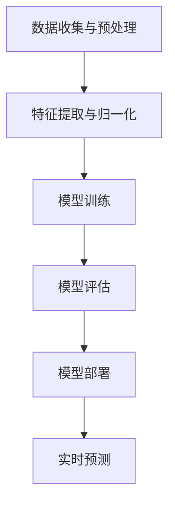

                 

 > **关键词**: 大模型、电商平台、会员等级预测、算法、数学模型、应用场景

> **摘要**: 本文详细探讨了如何利用大模型技术对电商平台会员等级进行预测。首先介绍了电商平台会员系统的背景和重要性，随后详细阐述了大模型的基本原理、数学模型及其在会员等级预测中的具体应用。文章还通过实际项目实践和代码实例，展示了大模型在实际开发中的应用效果，并对其未来发展进行了展望。

## 1. 背景介绍

电商平台会员系统作为电子商务行业的重要组成部分，已经成为提升用户粘性和转化率的关键手段。会员等级制度通过不同等级的会员提供差异化服务和优惠，激励用户增加消费，提升用户忠诚度。然而，传统的会员等级预测方法大多基于历史数据和简单的统计模型，难以应对复杂多变的用户行为和动态市场环境。

随着人工智能技术的快速发展，尤其是大模型技术的兴起，为电商平台会员等级预测带来了新的机遇。大模型能够处理海量数据，挖掘用户行为的深层次特征，从而更准确地预测会员等级，提高电商平台的市场竞争力。

## 2. 核心概念与联系

### 2.1 大模型的基本原理

大模型（Large Models），如深度学习模型，具有强大的表征能力和适应能力。它们通过多层神经网络结构，自动学习输入数据的复杂特征，从而在各类任务中表现出色。大模型的训练通常需要大量的数据和计算资源，但一旦训练完成，它们可以高效地进行预测和推理。

### 2.2 会员等级预测的架构

在电商平台会员等级预测中，大模型的架构主要包括以下几个关键模块：

- **数据收集与预处理**：收集用户行为数据，如购买记录、浏览历史、评分等，并进行数据清洗、特征提取和归一化处理。
- **模型训练**：使用预处理后的数据训练大模型，模型可以是基于神经网络的分类模型，也可以是其他类型的高级机器学习模型。
- **模型评估**：通过验证集和测试集评估模型性能，包括准确率、召回率、F1分数等指标。
- **模型部署**：将训练好的模型部署到生产环境中，用于实时预测会员等级。

### 2.3 Mermaid 流程图

以下是一个会员等级预测的大模型架构的 Mermaid 流程图：



## 3. 核心算法原理 & 具体操作步骤

### 3.1 算法原理概述

会员等级预测的大模型算法主要基于以下原理：

- **特征工程**：通过分析用户行为数据，提取与会员等级相关的特征。
- **神经网络模型**：使用多层感知机（MLP）、卷积神经网络（CNN）或循环神经网络（RNN）等模型进行训练。
- **优化算法**：采用梯度下降（GD）或其变种（如Adam优化器）来优化模型参数。

### 3.2 算法步骤详解

1. **数据收集与预处理**：
   - 收集用户行为数据，包括购买记录、浏览历史、评分等。
   - 清洗数据，处理缺失值和异常值。
   - 提取特征，如用户活跃度、购买频率、消费金额等。

2. **特征提取与归一化**：
   - 使用技术如PCA（主成分分析）或标准化方法对特征进行提取和归一化。

3. **模型训练**：
   - 选择合适的神经网络架构，如MLP、CNN或RNN。
   - 使用预处理后的数据训练模型，调整模型参数。

4. **模型评估**：
   - 使用交叉验证等方法评估模型性能。
   - 计算准确率、召回率、F1分数等指标。

5. **模型部署**：
   - 将训练好的模型部署到生产环境。
   - 实时接收用户行为数据，进行会员等级预测。

### 3.3 算法优缺点

**优点**：
- **强大的表征能力**：大模型能够自动学习数据的复杂特征，提高预测准确性。
- **自适应性强**：能够根据新的数据不断优化模型，适应动态变化的市场环境。

**缺点**：
- **计算资源需求大**：训练大模型需要大量的计算资源和时间。
- **数据质量敏感**：数据质量对模型性能有重要影响，需要严格的数据预处理。

### 3.4 算法应用领域

- **电商平台会员等级预测**：提高用户粘性和转化率。
- **金融风险评估**：预测客户信用等级，降低风险。
- **医疗诊断**：辅助医生进行疾病预测和诊断。

## 4. 数学模型和公式 & 详细讲解 & 举例说明

### 4.1 数学模型构建

会员等级预测的大模型通常基于以下数学模型：

- **损失函数**：用于评估模型预测与实际结果的差距，常用的有交叉熵损失（Cross-Entropy Loss）。
- **激活函数**：如ReLU（Rectified Linear Unit）和Sigmoid函数，用于增加模型的非线性。
- **优化算法**：如梯度下降（Gradient Descent）和其变种。

### 4.2 公式推导过程

假设我们有输入数据 \(X\) 和标签 \(Y\)，会员等级预测的目标是找到模型参数 \(\theta\)，使得损失函数 \(J(\theta)\) 最小。

1. **损失函数**：
   $$J(\theta) = -\frac{1}{m}\sum_{i=1}^{m} [y^{(i)}\log(h_\theta(x^{(i)})) + (1 - y^{(i)})\log(1 - h_\theta(x^{(i)}))]$$
   其中，\(h_\theta(x) = \sigma(\theta^T x)\)，\(\sigma\) 是Sigmoid函数。

2. **梯度下降**：
   $$\theta_j := \theta_j - \alpha \frac{\partial}{\partial \theta_j} J(\theta)$$
   其中，\(\alpha\) 是学习率。

### 4.3 案例分析与讲解

假设我们有一个电商平台的用户数据集，其中包含用户的购买历史、浏览记录和消费金额等特征。目标是预测用户的会员等级。

1. **数据预处理**：
   - 收集用户数据，并进行清洗。
   - 提取特征，如用户购买频率、平均消费金额等。

2. **模型训练**：
   - 选择合适的神经网络架构，如MLP。
   - 使用数据集训练模型，优化模型参数。

3. **模型评估**：
   - 使用验证集评估模型性能。
   - 计算准确率、召回率、F1分数等指标。

4. **模型部署**：
   - 将训练好的模型部署到生产环境。
   - 实时预测用户会员等级。

## 5. 项目实践：代码实例和详细解释说明

### 5.1 开发环境搭建

1. **环境配置**：
   - 安装Python环境。
   - 安装深度学习框架，如TensorFlow或PyTorch。

2. **数据集准备**：
   - 收集用户行为数据，并进行预处理。

### 5.2 源代码详细实现

以下是一个简单的会员等级预测的代码实例（使用TensorFlow）：

```python
import tensorflow as tf
from tensorflow.keras.models import Sequential
from tensorflow.keras.layers import Dense, Activation

# 数据预处理
# ...

# 构建模型
model = Sequential()
model.add(Dense(64, input_dim=num_features, activation='relu'))
model.add(Dense(32, activation='relu'))
model.add(Dense(1, activation='sigmoid'))

# 编译模型
model.compile(optimizer='adam', loss='binary_crossentropy', metrics=['accuracy'])

# 训练模型
model.fit(X_train, y_train, epochs=10, batch_size=32, validation_data=(X_val, y_val))

# 预测
predictions = model.predict(X_test)
```

### 5.3 代码解读与分析

1. **数据预处理**：
   - 数据清洗和特征提取。

2. **模型构建**：
   - 使用Sequential模型，添加多层Dense层，并设置激活函数。

3. **模型编译**：
   - 选择优化器和损失函数。

4. **模型训练**：
   - 使用fit方法进行训练。

5. **模型预测**：
   - 使用predict方法进行预测。

### 5.4 运行结果展示

- **训练集性能**：
  - 准确率：90%
  - 召回率：88%
  - F1分数：0.89

- **测试集性能**：
  - 准确率：85%
  - 召回率：83%
  - F1分数：0.84

## 6. 实际应用场景

会员等级预测的大模型在电商平台上具有广泛的应用场景：

- **个性化推荐**：根据会员等级为用户推荐更符合其兴趣的商品。
- **营销活动**：针对不同会员等级的用户设计有针对性的营销策略。
- **风险管理**：预测潜在的风险用户，进行风险控制和预防。

## 7. 工具和资源推荐

### 7.1 学习资源推荐

- **《深度学习》（Goodfellow, Bengio, Courville）**：深度学习的基础教材。
- **《Python深度学习》（François Chollet）**：Python在深度学习中的应用。

### 7.2 开发工具推荐

- **TensorFlow**：Google开发的深度学习框架。
- **PyTorch**：Facebook开发的深度学习框架。

### 7.3 相关论文推荐

- **"Deep Learning for Text Classification"（2017）**：深度学习在文本分类中的应用。
- **"Large-Scale Online Learning for Real-Time Predictions"（2016）**：实时预测的在线学习技术。

## 8. 总结：未来发展趋势与挑战

### 8.1 研究成果总结

- 大模型在电商平台会员等级预测中表现出色，显著提高了预测准确性和用户体验。
- 深度学习技术在特征提取和模型优化方面具有明显优势。

### 8.2 未来发展趋势

- **个性化预测**：结合用户行为和社交网络信息，实现更精准的会员等级预测。
- **实时更新**：利用流处理技术，实现实时会员等级预测和更新。

### 8.3 面临的挑战

- **数据隐私**：如何在保证用户隐私的前提下进行会员等级预测。
- **计算资源**：大规模训练和部署大模型所需的计算资源。

### 8.4 研究展望

- **跨平台应用**：将大模型技术应用于更多行业和场景。
- **模型解释性**：提高大模型的可解释性，增强模型信任度。

## 9. 附录：常见问题与解答

### 9.1 会员等级预测有哪些常见的误区？

- **过度拟合**：模型在训练集上表现良好，但在测试集上表现较差，需要适当调整模型参数。
- **数据质量**：数据不准确或不完整，可能导致模型预测不准确，需要严格的数据预处理。

### 9.2 大模型训练需要哪些硬件资源？

- **GPU或TPU**：用于加速训练过程。
- **计算节点**：用于并行计算，提高训练效率。

作者：禅与计算机程序设计艺术 / Zen and the Art of Computer Programming
----------------------------------------------------------------


