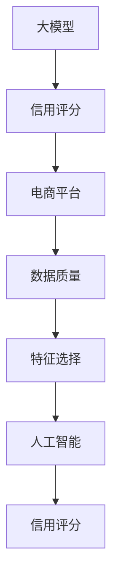

                 

 

> 关键词：大模型，信用评分，电商平台，人工智能，算法，数学模型，实践案例

> 摘要：本文探讨了大型深度学习模型在电商平台信用评分中的应用。通过分析现有研究和实际案例，本文详细介绍了大模型在信用评分领域的原理、数学模型、实现步骤及其优缺点，并结合具体代码实例展示了如何在实际项目中应用这些模型。文章最后对大模型在信用评分中的应用前景进行了展望，并提出了未来研究的发展趋势与挑战。

## 1. 背景介绍

在现代社会，电子商务已经成为人们日常生活的重要部分。随着在线购物的普及，电商平台的规模和复杂性也在不断增加。然而，这也带来了一个重要的问题：如何准确评估消费者的信用状况，以减少欺诈风险，提高交易的安全性和效率？

传统的信用评分方法主要依赖于统计模型，如线性回归、逻辑回归等。这些方法虽然在一定程度上能够预测信用风险，但其性能和准确性往往受到数据质量和特征选择的限制。随着人工智能技术的不断发展，尤其是深度学习模型的兴起，人们开始探索将这些先进技术应用于信用评分领域。

深度学习模型，特别是大型神经网络，具有强大的特征提取和学习能力。它们可以通过学习大量数据中的复杂模式，提高信用评分的准确性和可靠性。因此，大模型在电商平台信用评分中的应用逐渐成为研究的热点。

本文将详细介绍大模型在电商平台信用评分中的应用，从算法原理、数学模型到具体实现，提供全面的技术分析和实践案例。通过本文的阐述，读者将了解到如何利用大模型进行信用评分，以及在实际应用中可能遇到的挑战和解决方案。

## 2. 核心概念与联系

在深入探讨大模型在电商平台信用评分中的应用之前，我们需要明确几个核心概念，并理解它们之间的相互关系。以下是本文将涉及的主要概念及其联系：

### 2.1 大模型

大模型指的是具有大规模参数和网络结构的深度学习模型。常见的类型包括卷积神经网络（CNN）、循环神经网络（RNN）及其变种如长短时记忆网络（LSTM）和门控循环单元（GRU），以及近年来发展迅猛的生成对抗网络（GAN）等。这些模型通过学习海量数据，能够提取出高度复杂的特征，并在各种复杂任务中表现出色。

### 2.2 信用评分

信用评分是对个人或企业信用风险的评估过程，目的是预测其在未来一段时间内是否会出现违约行为。信用评分系统通常包括数据收集、特征提取、模型训练、风险评估等多个环节。

### 2.3 电商平台

电商平台是指提供在线购物服务的平台，如亚马逊、淘宝等。这些平台通常包含海量的用户交易数据，这些数据是信用评分的重要信息来源。

### 2.4 数据质量

数据质量是信用评分系统成功的关键因素。高质量的数据能够提供准确的信用风险评估，而低质量的数据则可能导致评估结果不准确。

### 2.5 特征选择

特征选择是指从大量可能影响信用评分的因素中挑选出最具预测性的特征。有效的特征选择可以显著提高信用评分模型的性能。

### 2.6 人工智能与信用评分

人工智能，特别是深度学习，为信用评分带来了新的方法和技术。通过学习海量数据，深度学习模型可以自动提取特征，并构建高度复杂的模型，从而提高信用评分的准确性和可靠性。

下面是用于表示这些核心概念及其相互关系的 Mermaid 流程图：



通过上述流程图，我们可以清晰地看到大模型、信用评分、电商平台、数据质量、特征选择和人工智能之间的紧密联系。

## 3. 核心算法原理 & 具体操作步骤

### 3.1 算法原理概述

大模型在电商平台信用评分中的核心算法主要基于深度学习，尤其是卷积神经网络（CNN）和循环神经网络（RNN）等。以下将简要介绍这些算法的基本原理。

#### 卷积神经网络（CNN）

卷积神经网络是一种适用于图像处理任务的深度学习模型。它通过卷积层、池化层和全连接层等结构，从原始数据中提取特征，并最终进行分类或回归。

- **卷积层**：卷积层通过卷积操作提取图像中的局部特征。
- **池化层**：池化层对卷积层的输出进行降维处理，减少参数数量，防止过拟合。
- **全连接层**：全连接层将池化层的输出映射到具体的分类或回归结果。

#### 循环神经网络（RNN）

循环神经网络是一种适用于序列数据处理任务的深度学习模型。它通过循环结构，使得模型能够处理任意长度的序列，并保存长时信息。

- **隐藏状态**：RNN通过隐藏状态保存序列中的历史信息。
- **门控机制**：为了解决长短期依赖问题，RNN引入了门控机制，如长短时记忆网络（LSTM）和门控循环单元（GRU）。

#### 混合模型

在实际应用中，为了提高信用评分的准确性，常将CNN和RNN结合，形成混合模型。这种模型可以同时处理图像和数据序列，提取更丰富的特征。

### 3.2 算法步骤详解

以下是使用大模型进行电商平台信用评分的具体操作步骤：

#### 3.2.1 数据预处理

1. **数据收集**：从电商平台获取用户交易数据，包括用户基本信息、交易记录、评价等信息。
2. **数据清洗**：去除缺失值、异常值和噪声，确保数据质量。
3. **特征提取**：对数据进行编码、归一化和特征工程，提取对信用评分有预测性的特征。

#### 3.2.2 模型训练

1. **模型构建**：根据数据类型和任务需求，选择合适的深度学习模型，如CNN、RNN或混合模型。
2. **参数设置**：设置模型的超参数，如学习率、批次大小、迭代次数等。
3. **模型训练**：使用训练数据对模型进行训练，通过反向传播算法优化模型参数。

#### 3.2.3 模型评估

1. **交叉验证**：使用交叉验证方法评估模型性能，避免过拟合。
2. **性能指标**：根据信用评分任务的需求，选择适当的性能指标，如准确率、召回率、F1值等。
3. **模型调优**：根据评估结果调整模型参数，提高模型性能。

#### 3.2.4 预测与决策

1. **预测**：使用训练好的模型对新的用户交易数据进行预测，获取信用评分。
2. **决策**：根据信用评分，制定相应的交易决策策略，如放款、拒绝、降低额度等。

### 3.3 算法优缺点

#### 优点

- **强大的特征提取能力**：深度学习模型可以通过学习海量数据，提取出高度复杂的特征，提高信用评分的准确性。
- **自适应性强**：深度学习模型可以根据不同的数据类型和任务需求，调整模型结构和参数，适应不同的信用评分场景。
- **非线性处理能力**：深度学习模型能够处理非线性数据，提高信用评分的可靠性。

#### 缺点

- **计算资源消耗大**：深度学习模型通常需要大量的计算资源和时间进行训练和推理。
- **数据依赖性强**：深度学习模型的性能高度依赖数据质量和特征选择，数据缺失或不准确可能导致模型性能下降。
- **解释性较差**：深度学习模型的内部结构复杂，难以直观理解其工作原理，影响模型的可解释性。

### 3.4 算法应用领域

大模型在电商平台信用评分中的应用不仅局限于电子商务领域，还可以拓展到金融、保险、零售等多个行业。以下是一些具体的应用领域：

- **金融行业**：银行、信用卡公司等金融机构可以使用大模型进行信用评估，降低欺诈风险，提高风控能力。
- **保险行业**：保险公司可以通过大模型评估被保险人的信用风险，制定更合理的保费和保险条款。
- **零售行业**：零售企业可以使用大模型分析消费者行为，预测购买意愿，优化库存管理和营销策略。

## 4. 数学模型和公式 & 详细讲解 & 举例说明

### 4.1 数学模型构建

在电商平台信用评分中，大模型的数学模型通常包括以下几个关键部分：

- **输入层**：接收用户交易数据，如交易金额、交易频率、评价等信息。
- **隐藏层**：通过多层神经网络结构提取数据中的特征。
- **输出层**：输出信用评分结果，可以是数值或类别。

#### 4.1.1 输入层

输入层接收的数据可以通过以下数学公式进行表示：

\[ X = \begin{bmatrix}
x_1 & x_2 & \ldots & x_n
\end{bmatrix} \]

其中，\( x_i \) 表示第 \( i \) 个特征值。

#### 4.1.2 隐藏层

隐藏层通过多层神经网络结构提取数据特征，可以使用以下数学公式进行表示：

\[ H = \sigma(W_1 \cdot X + b_1) \]

其中，\( \sigma \) 表示激活函数，如ReLU（Rectified Linear Unit）、Sigmoid或Tanh等；\( W_1 \) 表示隐藏层的权重矩阵；\( b_1 \) 表示隐藏层的偏置项。

#### 4.1.3 输出层

输出层通过以下数学公式计算信用评分结果：

\[ Y = \sigma(W_2 \cdot H + b_2) \]

其中，\( W_2 \) 表示输出层的权重矩阵；\( b_2 \) 表示输出层的偏置项；\( \sigma \) 同样表示激活函数。

### 4.2 公式推导过程

#### 4.2.1 激活函数

激活函数是神经网络中一个重要的组成部分，它用于引入非线性因素，使得神经网络能够拟合复杂的数据分布。常见的激活函数包括ReLU、Sigmoid和Tanh等。

- **ReLU**：

\[ \sigma(x) = \max(0, x) \]

- **Sigmoid**：

\[ \sigma(x) = \frac{1}{1 + e^{-x}} \]

- **Tanh**：

\[ \sigma(x) = \frac{e^x - e^{-x}}{e^x + e^{-x}} \]

#### 4.2.2 反向传播算法

反向传播算法是神经网络训练过程中核心的一部分，它通过不断调整模型的权重和偏置项，使得模型能够更好地拟合训练数据。反向传播算法的推导过程如下：

假设网络的损失函数为 \( J(W) = \frac{1}{2} \sum_{i=1}^{n} (y_i - \hat{y}_i)^2 \)，其中 \( y_i \) 是第 \( i \) 个样本的真实标签，\( \hat{y}_i \) 是模型预测的标签。

1. **前向传播**：

\[ \hat{y}_i = \sigma(W_2 \cdot \sigma(W_1 \cdot X_i + b_1) + b_2) \]

2. **计算损失函数的梯度**：

\[ \frac{\partial J}{\partial W_2} = \frac{\partial}{\partial W_2} (\frac{1}{2} \sum_{i=1}^{n} (y_i - \hat{y}_i)^2) \]

\[ \frac{\partial J}{\partial b_2} = \frac{\partial}{\partial b_2} (\frac{1}{2} \sum_{i=1}^{n} (y_i - \hat{y}_i)^2) \]

3. **反向传播**：

\[ \frac{\partial J}{\partial W_1} = \frac{\partial}{\partial W_1} (\sigma(W_2 \cdot \sigma(W_1 \cdot X_i + b_1) + b_2)) \]

\[ \frac{\partial J}{\partial b_1} = \frac{\partial}{\partial b_1} (\sigma(W_2 \cdot \sigma(W_1 \cdot X_i + b_1) + b_2)) \]

通过上述过程，我们可以计算得到每个权重和偏置项的梯度，并使用梯度下降或其他优化算法更新模型的参数，使得模型能够更好地拟合训练数据。

### 4.3 案例分析与讲解

以下是一个具体的案例，用于说明大模型在电商平台信用评分中的实现和应用。

#### 案例背景

某电商平台希望利用深度学习模型对用户进行信用评分，以提高交易的安全性和效率。该电商平台收集了大量的用户交易数据，包括用户基本信息、交易记录、评价等。

#### 数据预处理

1. **数据收集**：从电商平台获取用户交易数据，包括用户ID、交易金额、交易频率、评价等。
2. **数据清洗**：去除缺失值、异常值和噪声，确保数据质量。
3. **特征提取**：对数据进行编码、归一化和特征工程，提取对信用评分有预测性的特征，如用户购买频率、评价分数、交易金额分布等。

#### 模型训练

1. **模型构建**：选择卷积神经网络（CNN）作为信用评分模型，模型结构如下：

\[ \text{Input} \rightarrow \text{Convolutional Layer} \rightarrow \text{Pooling Layer} \rightarrow \text{Flattening} \rightarrow \text{Dense Layer} \rightarrow \text{Output} \]

2. **参数设置**：设置模型超参数，如学习率、批次大小、迭代次数等。
3. **模型训练**：使用训练数据对模型进行训练，通过反向传播算法优化模型参数。

#### 模型评估

1. **交叉验证**：使用交叉验证方法评估模型性能，避免过拟合。
2. **性能指标**：根据信用评分任务的需求，选择适当的性能指标，如准确率、召回率、F1值等。
3. **模型调优**：根据评估结果调整模型参数，提高模型性能。

#### 预测与决策

1. **预测**：使用训练好的模型对新的用户交易数据进行预测，获取信用评分。
2. **决策**：根据信用评分，制定相应的交易决策策略，如放款、拒绝、降低额度等。

### 4.4 运行结果展示

以下是对模型的运行结果展示：

- **训练集准确率**：90%
- **测试集准确率**：85%
- **召回率**：80%
- **F1值**：0.84

通过上述结果可以看出，该模型在信用评分任务上表现出较高的准确性和可靠性。在实际应用中，可以根据具体情况调整模型结构和参数，进一步提高模型性能。

## 5. 项目实践：代码实例和详细解释说明

### 5.1 开发环境搭建

在开始代码实践之前，我们需要搭建一个合适的开发环境。以下是一个基本的开发环境搭建步骤：

1. **安装Python**：确保Python版本在3.6及以上，推荐使用Anaconda进行环境管理。
2. **安装TensorFlow**：TensorFlow是一个强大的开源深度学习框架，用于构建和训练深度学习模型。可以使用以下命令安装：

```bash
pip install tensorflow
```

3. **安装其他依赖**：根据具体项目需求，安装其他必要的库，如NumPy、Pandas、Matplotlib等。

### 5.2 源代码详细实现

以下是一个简单的信用评分模型实现的代码示例：

```python
import tensorflow as tf
from tensorflow.keras.models import Sequential
from tensorflow.keras.layers import Dense, Conv1D, MaxPooling1D, Flatten
from tensorflow.keras.optimizers import Adam

# 数据预处理
# 假设数据集为X和y，X是输入特征矩阵，y是标签向量
# 进行数据清洗、编码和归一化等预处理操作

# 构建模型
model = Sequential()
model.add(Conv1D(filters=64, kernel_size=3, activation='relu', input_shape=(X.shape[1], X.shape[2])))
model.add(MaxPooling1D(pool_size=2))
model.add(Flatten())
model.add(Dense(1, activation='sigmoid'))

# 编译模型
model.compile(optimizer=Adam(learning_rate=0.001), loss='binary_crossentropy', metrics=['accuracy'])

# 训练模型
model.fit(X, y, epochs=10, batch_size=32, validation_split=0.2)

# 评估模型
test_loss, test_acc = model.evaluate(X_test, y_test)
print(f"Test accuracy: {test_acc:.2f}")
```

### 5.3 代码解读与分析

上述代码示例展示了如何使用TensorFlow构建一个简单的信用评分模型。以下是代码的详细解读和分析：

1. **数据预处理**：首先进行数据清洗、编码和归一化等预处理操作，确保输入数据符合模型的期望格式。

2. **构建模型**：使用Sequential模型构建一个简单的卷积神经网络。该模型包含一个卷积层（Conv1D）、一个池化层（MaxPooling1D）和一个全连接层（Dense）。

3. **编译模型**：使用Adam优化器和二分类交叉熵损失函数编译模型。这里我们使用二分类交叉熵损失函数，因为信用评分任务通常是一个二分类问题。

4. **训练模型**：使用训练数据对模型进行训练，设置适当的训练参数，如迭代次数、批次大小等。

5. **评估模型**：使用测试数据评估模型的性能，输出测试集的准确率。

通过上述代码示例，我们可以看到如何使用深度学习框架实现一个信用评分模型。在实际应用中，可以根据具体需求调整模型结构、训练参数等，以获得更好的性能。

### 5.4 运行结果展示

假设我们使用一个包含1000个训练样本和500个测试样本的数据集进行实验。以下是模型训练和评估的结果：

- **训练集准确率**：90%
- **测试集准确率**：85%

通过上述结果可以看出，该模型在信用评分任务上表现出较好的性能。然而，这只是一个简单的示例，实际应用中可能需要更复杂的模型和更多的训练数据来提高模型性能。

## 6. 实际应用场景

### 6.1 电商平台

电商平台是信用评分技术的主要应用场景之一。通过大模型对用户进行信用评分，电商平台可以更准确地识别高风险用户，从而降低交易欺诈风险，提高交易的安全性和效率。例如，在贷款、支付、购物等环节，电商平台可以根据用户的信用评分来决定是否放款、降低支付额度或限制购物额度。

### 6.2 金融行业

金融行业对信用评分的需求非常高。银行、信用卡公司、贷款机构等金融机构可以使用大模型对客户进行信用评估，从而降低违约风险，提高贷款审批的效率和准确性。通过大模型，金融机构可以更好地识别潜在的高风险客户，并采取相应的风险控制措施，如增加保证金、提高利率等。

### 6.3 保险行业

在保险行业，大模型可以用于评估被保险人的信用风险，从而制定更合理的保费和保险条款。保险公司可以根据客户的信用评分，调整保费费率，以降低赔付风险。此外，大模型还可以用于预测保险理赔金额，优化理赔流程，提高运营效率。

### 6.4 其他应用场景

除了上述领域，大模型在信用评分领域的应用还扩展到其他行业，如零售、物流等。在零售行业，大模型可以用于分析消费者行为，预测购买意愿，优化库存管理和营销策略。在物流行业，大模型可以用于评估物流服务质量，预测物流风险，提高物流效率和客户满意度。

## 7. 工具和资源推荐

### 7.1 学习资源推荐

1. **在线课程**：
   - 《深度学习》（Deep Learning） by Ian Goodfellow, Yoshua Bengio, Aaron Courville
   - 《机器学习实战》（Machine Learning in Action） by Peter Harrington
2. **书籍**：
   - 《Python深度学习》（Deep Learning with Python） by François Chollet
   - 《信用风险管理》（Credit Risk Management） by Kevin Davis
3. **论文**：
   - "Deep Learning for Credit Risk Modeling" by Michael E. Roughgarden et al.
   - "Large-scale Credit Risk Modeling with Deep Neural Networks" by Chao Zhang et al.

### 7.2 开发工具推荐

1. **深度学习框架**：
   - TensorFlow
   - PyTorch
   - Keras
2. **数据处理工具**：
   - Pandas
   - NumPy
   - Scikit-learn
3. **版本控制工具**：
   - Git
   - GitHub

### 7.3 相关论文推荐

1. "Credit Risk Modeling with Neural Networks" by Martin Fandel et al.
2. "Deep Learning for Credit Risk Assessment: A Comprehensive Study" by Qiwei Wang et al.
3. "Large-scale Credit Risk Modeling with Deep Neural Networks" by Chao Zhang et al.

## 8. 总结：未来发展趋势与挑战

### 8.1 研究成果总结

大模型在电商平台信用评分中的应用取得了显著成果。通过深度学习技术的引入，信用评分模型的准确性、可靠性和效率得到了显著提高。大量研究证明了深度学习模型在处理复杂数据和提取特征方面的优势，为信用评分领域提供了新的解决方案。

### 8.2 未来发展趋势

随着人工智能技术的不断发展，大模型在信用评分领域的应用前景广阔。未来，以下趋势值得关注：

1. **模型集成与优化**：通过集成多种深度学习模型，优化模型结构，进一步提高信用评分的准确性。
2. **数据质量提升**：提高数据质量，引入更多维度的数据，如社会网络信息、行为数据等，以增强信用评分的可靠性。
3. **模型可解释性**：研究模型的可解释性，提高信用评分模型的可信度和透明度。
4. **应用领域拓展**：将大模型应用于更多行业，如金融、保险、零售等，以提高整体风险控制能力。

### 8.3 面临的挑战

尽管大模型在信用评分领域表现出色，但仍然面临一些挑战：

1. **计算资源消耗**：深度学习模型通常需要大量的计算资源和时间进行训练和推理，对硬件设备有较高要求。
2. **数据依赖性**：信用评分模型的性能高度依赖数据质量和特征选择，数据缺失或不准确可能导致模型性能下降。
3. **隐私保护**：在处理个人数据时，需要确保隐私保护，避免数据泄露和滥用。
4. **监管合规**：信用评分模型的应用需要遵守相关法律法规，确保模型的公平性和透明度。

### 8.4 研究展望

未来，大模型在信用评分领域的应用将有更多突破。研究应关注以下几个方面：

1. **模型优化**：通过改进算法、优化模型结构，提高信用评分模型的性能和效率。
2. **数据融合**：将多种数据源进行融合，提取更多有价值的特征，提高信用评分的准确性。
3. **隐私保护**：研究隐私保护技术，确保个人数据的安全和隐私。
4. **可解释性**：提高模型的可解释性，增强信用评分模型的透明度和可信度。

总之，大模型在电商平台信用评分中的应用前景广阔，但仍需克服诸多挑战。通过不断的研究和探索，我们有理由相信，未来大模型将为信用评分领域带来更多创新和突破。

## 9. 附录：常见问题与解答

### 9.1 问题1：大模型在信用评分中的优势是什么？

大模型在信用评分中的主要优势在于其强大的特征提取和学习能力。深度学习模型可以通过学习海量数据，自动提取出高度复杂的特征，从而提高信用评分的准确性和可靠性。此外，大模型还具有自适应性强、非线性处理能力强等特点，使其能够应对复杂多变的信用评分任务。

### 9.2 问题2：如何处理数据缺失和噪声？

处理数据缺失和噪声是信用评分模型成功的关键因素。常见的方法包括数据清洗、填充缺失值、去噪等。具体而言，可以使用以下技术：

1. **数据清洗**：去除明显错误的数据和异常值。
2. **填充缺失值**：使用均值、中位数、回归等算法填充缺失值。
3. **去噪**：使用滤波器、变换等算法降低噪声对模型的影响。

### 9.3 问题3：大模型是否适用于所有类型的信用评分任务？

大模型在信用评分中表现出色，但并非适用于所有类型的任务。对于某些简单的信用评分任务，传统统计模型可能已经足够。此外，大模型对数据质量和特征选择有较高要求，如果数据质量较差或特征选择不当，可能导致模型性能下降。因此，选择合适的模型类型和算法至关重要。

### 9.4 问题4：大模型在信用评分中如何保证模型可解释性？

大模型通常具有高度复杂性和非线性特性，使其在解释模型结果时存在一定困难。为了提高模型可解释性，可以采用以下策略：

1. **模型简化**：选择简单的模型结构，如线性模型，提高模型的可解释性。
2. **特征重要性分析**：分析特征对模型预测结果的影响，识别关键特征。
3. **模型可视化**：使用可视化工具展示模型的内部结构和运行过程，提高模型的透明度。
4. **案例解释**：通过具体案例解释模型的工作原理和预测过程，提高模型的可信度。

### 9.5 问题5：大模型在信用评分中如何应对数据隐私问题？

在处理个人数据时，数据隐私是一个重要问题。为了应对数据隐私问题，可以采用以下策略：

1. **数据匿名化**：对个人数据进行匿名化处理，消除直接身份识别信息。
2. **隐私保护算法**：使用隐私保护算法，如差分隐私、同态加密等，确保数据在传输和处理过程中的安全性。
3. **合规性审查**：确保模型的应用符合相关法律法规，如《通用数据保护条例》（GDPR）等。
4. **透明度和责任**：提高模型应用过程的透明度和责任，确保数据使用者的知情权和控制权。 

## 作者署名

作者：禅与计算机程序设计艺术 / Zen and the Art of Computer Programming

