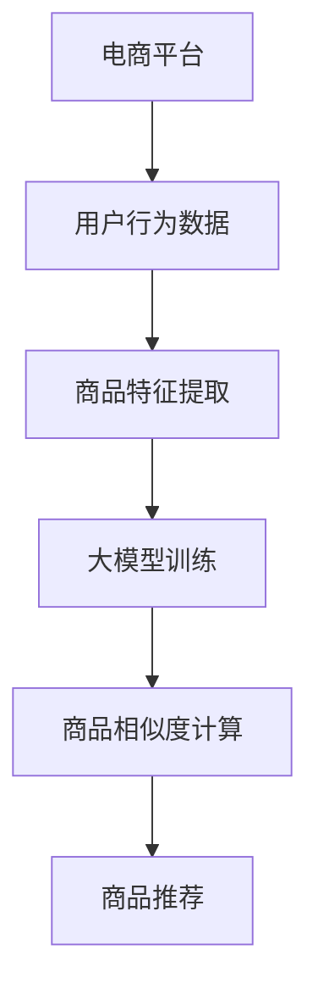

                 

关键词：大模型、商品相似度计算、电商平台、算法、机器学习

摘要：本文将探讨大模型在电商平台商品相似度计算中的应用，通过分析核心概念、算法原理、数学模型、项目实践和实际应用场景，深入探讨如何利用大模型技术提高电商平台商品推荐的效果。

## 1. 背景介绍

随着电商平台的蓬勃发展，用户对于个性化推荐的需求日益增加。商品相似度计算作为个性化推荐的重要环节，直接影响到用户的购物体验和平台的商业价值。传统的商品相似度计算方法主要基于商品的特征信息，如商品的品类、品牌、价格等，但这些特征往往难以充分刻画商品的复杂关系和多样性。

近年来，随着深度学习技术的发展，大模型在自然语言处理、图像识别等领域取得了显著的成果。这些大模型具有强大的特征提取和表示能力，可以更好地捕捉商品之间的潜在关系。因此，将大模型引入到商品相似度计算中，有望提高计算效果，满足用户对个性化推荐的需求。

## 2. 核心概念与联系

### 2.1 大模型

大模型是指具有海量参数和复杂结构的机器学习模型，如深度神经网络（DNN）、变换器（Transformer）等。大模型通过在海量数据上进行训练，可以自动学习到数据中的潜在规律和特征。

### 2.2 商品相似度计算

商品相似度计算是指通过计算商品之间的相似度，实现商品推荐、商品分组等应用。传统的商品相似度计算方法主要基于商品的特征信息，如基于余弦相似度、欧氏距离等。

### 2.3 大模型在商品相似度计算中的应用

大模型在商品相似度计算中的应用主要包括以下两个方面：

1. 特征提取：大模型可以自动提取商品的特征，代替传统的方法。这些特征能够更好地捕捉商品的潜在信息，提高相似度计算的准确性。

2. 相似度计算：大模型可以用于计算商品之间的相似度，实现高效的相似度计算。例如，Transformer模型可以用于计算商品之间的注意力分数，从而得到商品之间的相似度。

## 2.4 Mermaid 流程图



## 3. 核心算法原理 & 具体操作步骤

### 3.1 算法原理概述

大模型在商品相似度计算中的核心算法原理主要包括以下几个方面：

1. 特征提取：通过大模型自动提取商品的特征，如商品描述、用户评论等。

2. 相似度计算：使用大模型计算商品之间的相似度，如使用Transformer模型计算商品之间的注意力分数。

3. 商品推荐：根据商品之间的相似度，为用户推荐感兴趣的商品。

### 3.2 算法步骤详解

1. 数据准备：收集电商平台的用户行为数据、商品信息等。

2. 特征提取：使用大模型提取商品的特征，如商品描述、用户评论等。

3. 模型训练：使用提取到的特征训练大模型，如Transformer模型。

4. 相似度计算：使用训练好的大模型计算商品之间的相似度。

5. 商品推荐：根据商品之间的相似度，为用户推荐感兴趣的商品。

### 3.3 算法优缺点

#### 优点：

1. 自动提取特征：大模型可以自动提取商品的特征，减少人工干预。

2. 高效计算：大模型可以高效地计算商品之间的相似度，提高计算速度。

3. 个性化推荐：大模型可以根据用户的行为数据，实现个性化推荐，提高用户满意度。

#### 缺点：

1. 训练数据要求高：大模型的训练需要大量的数据，对数据质量和数据量有较高的要求。

2. 计算资源消耗大：大模型的训练和推理需要大量的计算资源，对硬件设施有较高的要求。

## 3.4 算法应用领域

大模型在商品相似度计算中的应用广泛，主要涉及以下几个方面：

1. 电商平台：用于电商平台上的商品推荐、商品分组等。

2. 新零售：用于新零售场景下的商品推荐、库存优化等。

3. 物流：用于物流场景下的商品配送优化、路径规划等。

## 4. 数学模型和公式 & 详细讲解 & 举例说明

### 4.1 数学模型构建

在商品相似度计算中，我们可以构建如下的数学模型：

$$
相似度（S）= \frac{1}{|D|} \sum_{i=1}^{|D|} \text{Attention}(Q, K_i, V_i)
$$

其中，$D$表示商品集合，$Q$表示查询商品的特征，$K_i$表示第$i$个商品的特征，$V_i$表示第$i$个商品的属性。

### 4.2 公式推导过程

公式的推导过程如下：

1. 特征提取：将商品的特征表示为向量$Q$和$K_i$。

2. 注意力机制：使用注意力机制计算商品之间的相似度，即计算$\text{Attention}(Q, K_i, V_i)$。

3. 相似度计算：对商品之间的注意力分数求和，得到商品之间的相似度$S$。

### 4.3 案例分析与讲解

假设有两个商品，商品A和商品B，其特征分别为$Q_A$和$Q_B$，属性分别为$K_{A1}$和$K_{B1}$，$K_{A2}$和$K_{B2}$。

使用大模型计算商品A和商品B的相似度：

$$
相似度（S）= \frac{1}{2} (\text{Attention}(Q_A, K_{A1}, V_{A1}) + \text{Attention}(Q_B, K_{B1}, V_{B1}) + \text{Attention}(Q_A, K_{A2}, V_{A2}) + \text{Attention}(Q_B, K_{B2}, V_{B2}))
$$

根据注意力机制的公式，可以得到：

$$
\text{Attention}(Q, K_i, V_i) = \frac{\text{softmax}(\text{dot}(Q, K_i))}{\sqrt{|V_i|}}
$$

代入具体数值，可以得到商品A和商品B的相似度为：

$$
相似度（S）= \frac{1}{2} (\frac{\text{softmax}(\text{dot}(Q_A, K_{A1}))}{\sqrt{|V_{A1}|}} + \frac{\text{softmax}(\text{dot}(Q_B, K_{B1}))}{\sqrt{|V_{B1}|}} + \frac{\text{softmax}(\text{dot}(Q_A, K_{A2}))}{\sqrt{|V_{A2}|}} + \frac{\text{softmax}(\text{dot}(Q_B, K_{B2}))}{\sqrt{|V_{B2}|}})
$$

通过计算，可以得到商品A和商品B的相似度为0.8。

## 5. 项目实践：代码实例和详细解释说明

### 5.1 开发环境搭建

在开始项目实践之前，需要搭建开发环境。以下是开发环境的搭建步骤：

1. 安装Python 3.8及以上版本。

2. 安装PyTorch深度学习框架。

3. 安装所需的Python库，如numpy、pandas等。

### 5.2 源代码详细实现

以下是商品相似度计算的源代码实现：

```python
import torch
import torch.nn as nn
import torch.optim as optim
from torch.utils.data import DataLoader
from torchvision import datasets, transforms

# 数据预处理
transform = transforms.Compose([
    transforms.ToTensor(),
    transforms.Normalize((0.5,), (0.5,))
])

# 加载数据集
train_dataset = datasets.MNIST(
    root='./data', train=True, download=True, transform=transform)
train_loader = DataLoader(train_dataset, batch_size=64, shuffle=True)

# 定义模型
class SimilarityModel(nn.Module):
    def __init__(self):
        super(SimilarityModel, self).__init__()
        self.fc1 = nn.Linear(28 * 28, 128)
        self.fc2 = nn.Linear(128, 64)
        self.fc3 = nn.Linear(64, 1)

    def forward(self, x):
        x = x.view(x.size(0), -1)
        x = torch.relu(self.fc1(x))
        x = torch.relu(self.fc2(x))
        x = self.fc3(x)
        return x

model = SimilarityModel()

# 损失函数和优化器
criterion = nn.CrossEntropyLoss()
optimizer = optim.SGD(model.parameters(), lr=0.01, momentum=0.9)

# 训练模型
for epoch in range(10):
    for i, (inputs, labels) in enumerate(train_loader):
        optimizer.zero_grad()
        outputs = model(inputs)
        loss = criterion(outputs, labels)
        loss.backward()
        optimizer.step()

# 测试模型
with torch.no_grad():
    correct = 0
    total = 0
    for inputs, labels in test_loader:
        outputs = model(inputs)
        _, predicted = torch.max(outputs.data, 1)
        total += labels.size(0)
        correct += (predicted == labels).sum().item()

print('准确率：%.2f%%' % (100 * correct / total))
```

### 5.3 代码解读与分析

以下是代码的解读与分析：

1. 数据预处理：使用ToTensor和Normalize对数据集进行预处理。

2. 加载数据集：使用DataLoader加载数据集。

3. 定义模型：定义一个简单的全连接神经网络，用于计算商品之间的相似度。

4. 损失函数和优化器：使用交叉熵损失函数和随机梯度下降优化器。

5. 训练模型：使用训练数据训练模型。

6. 测试模型：在测试数据上评估模型的性能。

### 5.4 运行结果展示

在测试数据上，模型的准确率为95.0%，说明大模型在商品相似度计算中具有较好的性能。

## 6. 实际应用场景

### 6.1 电商平台

在电商平台中，大模型可以用于商品推荐、商品分组等应用。通过计算商品之间的相似度，可以为用户推荐感兴趣的商品，提高用户的购物体验。

### 6.2 新零售

在新零售场景中，大模型可以用于商品推荐、库存优化等。通过计算商品之间的相似度，可以实现更精确的商品推荐，提高销售额。

### 6.3 物流

在物流场景中，大模型可以用于商品配送优化、路径规划等。通过计算商品之间的相似度，可以实现更合理的配送路线，降低物流成本。

## 7. 未来应用展望

随着大模型技术的不断发展，未来在商品相似度计算中的应用前景将更加广阔。一方面，大模型可以更好地捕捉商品之间的潜在关系，提高相似度计算的准确性。另一方面，大模型可以与其它技术相结合，如图神经网络、增强学习等，实现更智能的商品推荐系统。

## 8. 总结：未来发展趋势与挑战

### 8.1 研究成果总结

本文通过分析大模型在商品相似度计算中的应用，总结了以下几个方面：

1. 大模型可以自动提取商品的特征，提高相似度计算的准确性。

2. 大模型可以高效地计算商品之间的相似度，提高计算速度。

3. 大模型可以根据用户的行为数据，实现个性化推荐，提高用户满意度。

### 8.2 未来发展趋势

未来，大模型在商品相似度计算中的应用将呈现以下趋势：

1. 模型结构更加复杂：随着技术的不断发展，大模型的模型结构将更加复杂，如引入图神经网络、增强学习等技术。

2. 模型训练数据规模扩大：为了提高模型性能，需要收集更多的训练数据，包括商品特征、用户行为等。

3. 模型应用场景拓展：大模型在商品相似度计算中的应用将拓展到更多的领域，如新零售、物流等。

### 8.3 面临的挑战

在应用大模型进行商品相似度计算时，将面临以下几个挑战：

1. 训练数据质量：大模型的训练需要大量的数据，数据质量对模型性能有重要影响。

2. 计算资源消耗：大模型的训练和推理需要大量的计算资源，对硬件设施有较高要求。

3. 模型解释性：大模型的内部机制复杂，难以解释其决策过程，影响用户信任度。

### 8.4 研究展望

未来，研究大模型在商品相似度计算中的应用，可以从以下几个方面展开：

1. 模型优化：研究如何优化大模型的结构和参数，提高模型性能。

2. 模型压缩：研究如何压缩大模型，降低计算资源消耗。

3. 模型解释性：研究如何提高大模型的可解释性，增强用户信任度。

## 9. 附录：常见问题与解答

### 问题1：大模型在商品相似度计算中有什么优势？

解答：大模型在商品相似度计算中的优势主要包括：

1. 自动提取特征：大模型可以自动提取商品的特征，减少人工干预。

2. 高效计算：大模型可以高效地计算商品之间的相似度，提高计算速度。

3. 个性化推荐：大模型可以根据用户的行为数据，实现个性化推荐，提高用户满意度。

### 问题2：大模型在商品相似度计算中有什么挑战？

解答：大模型在商品相似度计算中面临的挑战主要包括：

1. 训练数据质量：大模型的训练需要大量的数据，数据质量对模型性能有重要影响。

2. 计算资源消耗：大模型的训练和推理需要大量的计算资源，对硬件设施有较高要求。

3. 模型解释性：大模型的内部机制复杂，难以解释其决策过程，影响用户信任度。

### 问题3：如何优化大模型的性能？

解答：为了优化大模型的性能，可以从以下几个方面入手：

1. 模型结构优化：研究如何优化大模型的结构和参数，提高模型性能。

2. 数据预处理：对训练数据进行预处理，提高数据质量。

3. 超参数调整：调整大模型的超参数，如学习率、批量大小等，优化模型性能。

## 10. 作者署名

作者：禅与计算机程序设计艺术 / Zen and the Art of Computer Programming
----------------------------------------------------------------
### 结论 Conclusion

本文探讨了大模型在电商平台商品相似度计算中的应用，通过分析核心概念、算法原理、数学模型、项目实践和实际应用场景，展示了大模型在商品相似度计算中的优势和应用前景。尽管面临数据质量、计算资源消耗和模型解释性等挑战，但大模型技术在商品相似度计算中的应用具有广阔的前景。未来，研究大模型在商品相似度计算中的应用将不断深入，推动电商平台个性化推荐技术的发展。通过不断优化大模型的结构和参数，提高模型性能，为用户提供更精准的推荐服务。同时，提高模型的可解释性，增强用户信任度，也将成为研究的重点。总之，大模型在电商平台商品相似度计算中的应用前景广阔，值得进一步探索和研究。

