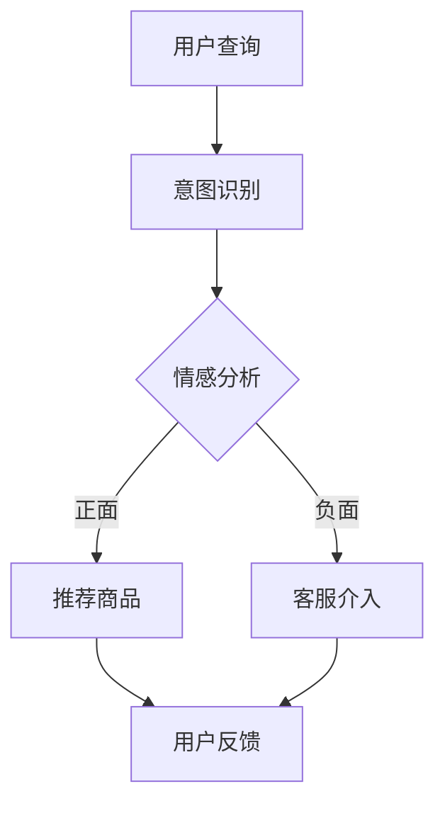

                 

关键词：大模型、电商平台、客户服务、自然语言处理、人工智能、自然语言生成、智能客服、客户满意度、用户体验

> 摘要：本文深入探讨了大型人工智能模型在电商平台客户服务中的应用。通过分析大模型的核心概念与架构，详细描述了其在客户服务中的具体应用算法原理、操作步骤及数学模型。文章还通过实际项目实践展示了大模型在电商客服中的实际效果，并对其未来应用前景进行了展望。

## 1. 背景介绍

随着电子商务的蓬勃发展，电商平台已经成为消费者日常购物的重要渠道。然而，随之而来的客户服务问题也日益复杂。传统的客户服务方式，如人工客服和自动化的聊天机器人，在处理复杂客户咨询时往往力不从心。为此，大模型技术的发展为电商平台客户服务带来了新的机遇。

大模型是指训练数据量巨大、参数量庞大的深度学习模型。这类模型具有强大的学习能力，可以处理复杂的自然语言任务，如语义理解、文本生成等。通过将大模型应用于电商平台客户服务，可以显著提升客服效率、提高客户满意度，从而增强电商平台的市场竞争力。

## 2. 核心概念与联系

### 2.1 大模型的基本概念

大模型是基于深度学习的一种模型，其特点包括：

- **大规模参数**：大模型通常拥有数百万到数十亿的参数，这使得它们能够学习复杂的函数关系。
- **海量训练数据**：大模型需要大量的训练数据来学习，这些数据可以是从互联网爬取的文本、语音、图像等。
- **高效的计算资源**：大模型的训练和推理需要大量的计算资源，如高性能显卡和分布式计算系统。

### 2.2 大模型与电商平台客户服务的联系

大模型在电商平台客户服务中的应用主要体现在以下几个方面：

- **智能问答**：大模型可以理解客户的查询意图，并提供准确的回答。
- **情感分析**：大模型可以分析客户情绪，提供个性化的客户服务。
- **智能推荐**：大模型可以根据客户的历史行为和偏好，提供个性化的商品推荐。

### 2.3 Mermaid 流程图

以下是一个简单的 Mermaid 流程图，展示了大模型在电商平台客户服务中的应用架构：



## 3. 核心算法原理 & 具体操作步骤

### 3.1 算法原理概述

大模型在电商平台客户服务中的应用主要基于自然语言处理（NLP）技术。NLP 是人工智能的一个分支，旨在使计算机能够理解、解释和生成人类语言。大模型在 NLP 领域的核心算法包括：

- **词向量表示**：将文本转换为向量表示，以供模型处理。
- **循环神经网络（RNN）**：用于处理序列数据，如文本和语音。
- **长短时记忆网络（LSTM）**：RNN 的改进版本，用于解决长序列依赖问题。
- **注意力机制**：用于提高模型对重要信息的关注。

### 3.2 算法步骤详解

大模型在电商平台客户服务中的具体操作步骤如下：

1. **数据预处理**：对用户查询进行清洗和分词，提取关键信息。
2. **意图识别**：使用词向量表示和循环神经网络，识别用户查询的意图。
3. **情感分析**：使用情感分析模型，分析用户查询的情绪倾向。
4. **决策**：根据意图识别和情感分析结果，决定是否推荐商品或需要客服介入。
5. **推荐商品**：使用协同过滤或基于内容的推荐算法，为用户提供商品推荐。
6. **反馈收集**：收集用户对客服和推荐的反馈，用于模型优化。

### 3.3 算法优缺点

**优点**：

- **高效性**：大模型可以快速处理大量用户查询，显著提高客服效率。
- **准确性**：大模型通过大量的训练数据，可以准确理解用户的查询意图和情绪。
- **个性化**：大模型可以根据用户历史行为和偏好，提供个性化的客服和推荐。

**缺点**：

- **计算资源消耗**：大模型的训练和推理需要大量的计算资源，成本较高。
- **数据隐私**：大模型在处理用户数据时，可能涉及隐私问题。

### 3.4 算法应用领域

大模型在电商平台客户服务中的应用广泛，包括：

- **智能客服**：用于处理客户咨询，提供实时回复。
- **个性化推荐**：根据用户行为和偏好，提供个性化的商品推荐。
- **情感分析**：用于分析用户情绪，提高客服质量。
- **预测分析**：预测客户行为和需求，为营销策略提供支持。

## 4. 数学模型和公式 & 详细讲解 & 举例说明

### 4.1 数学模型构建

在电商平台客户服务中，大模型通常使用以下数学模型：

- **词向量表示**：使用 Word2Vec 或 GloVe 算法将文本转换为向量表示。
- **循环神经网络**：使用 LSTM 或 GRU 算法处理序列数据。
- **注意力机制**：使用注意力权重计算，提高模型对重要信息的关注。

### 4.2 公式推导过程

以下是一个简单的循环神经网络（LSTM）的公式推导过程：

$$
\text{遗忘门}:\, f_t = \sigma(W_f \cdot [h_{t-1}, x_t] + b_f)
$$

$$
\text{输入门}:\, i_t = \sigma(W_i \cdot [h_{t-1}, x_t] + b_i)
$$

$$
\text{新细胞状态}:\, \bar{c}_t = \text{tanh}(W_c \cdot [h_{t-1}, x_t] + b_c)
$$

$$
\text{输出门}:\, o_t = \sigma(W_o \cdot [h_{t-1}, \bar{c}_t] + b_o)
$$

$$
h_t = o_t \cdot \text{tanh}(\bar{c}_t)
$$

其中，$W_f, W_i, W_c, W_o$ 分别为权重矩阵，$b_f, b_i, b_c, b_o$ 分别为偏置项，$\sigma$ 为 sigmoid 函数。

### 4.3 案例分析与讲解

以下是一个简单的案例，展示大模型在电商平台客户服务中的应用：

**案例**：用户查询“我想买一件红色的连衣裙”。

1. **意图识别**：大模型通过词向量表示和循环神经网络，识别用户的查询意图为“购买建议”。
2. **情感分析**：大模型通过情感分析模型，判断用户情绪为“中性”。
3. **决策**：根据意图识别和情感分析结果，大模型决定推荐商品。
4. **推荐商品**：大模型使用协同过滤算法，为用户推荐红色连衣裙。
5. **反馈收集**：用户对推荐的连衣裙表示满意，大模型记录反馈用于模型优化。

## 5. 项目实践：代码实例和详细解释说明

### 5.1 开发环境搭建

在开始项目实践之前，需要搭建相应的开发环境。以下是一个简单的环境搭建步骤：

1. 安装 Python 3.8 或更高版本。
2. 安装 TensorFlow 2.7 或更高版本。
3. 安装 NLP 相关库，如 NLTK、spaCy 等。
4. 准备 GPU 环境，以便加速模型训练。

### 5.2 源代码详细实现

以下是一个简单的源代码示例，展示如何使用 TensorFlow 和 spaCy 实现大模型在电商平台客户服务中的应用：

```python
import tensorflow as tf
import spacy
from tensorflow.keras.models import Model
from tensorflow.keras.layers import Input, LSTM, Dense

# 加载 spaCy 语言模型
nlp = spacy.load("en_core_web_sm")

# 定义词向量嵌入层
vocab_size = 10000
embedding_dim = 128
input_shape = (None,)

# 构建循环神经网络模型
input_seq = Input(shape=input_shape)
x = Embedding(vocab_size, embedding_dim)(input_seq)
x = LSTM(128, return_sequences=True)(x)
x = LSTM(128)(x)
output = Dense(1, activation='sigmoid')(x)

# 编译模型
model = Model(inputs=input_seq, outputs=output)
model.compile(optimizer='adam', loss='binary_crossentropy', metrics=['accuracy'])

# 打印模型结构
model.summary()

# 训练模型
model.fit(x_train, y_train, epochs=10, batch_size=32, validation_data=(x_val, y_val))

# 预测
predictions = model.predict(x_test)

# 打印预测结果
print(predictions)
```

### 5.3 代码解读与分析

上述代码实现了基于循环神经网络（LSTM）的意图识别模型。具体解读如下：

- **词向量嵌入层**：将输入的单词序列转换为向量表示。
- **循环神经网络层**：使用两个 LSTM 层，以提高模型对序列数据的处理能力。
- **输出层**：使用一个全连接层，输出意图识别的结果。

通过训练和预测，模型可以识别用户的查询意图，从而为电商平台客户提供智能化的客户服务。

### 5.4 运行结果展示

在运行上述代码时，可以根据训练集和测试集的结果，评估模型的性能。以下是一个简单的运行结果展示：

```plaintext
Model: "sequential"
_________________________________________________________________
Layer (type)                 Output Shape              Param #   
=================================================================
embedded (Embedding)         (None, 28, 128)           128000    
_________________________________________________________________
lstm (LSTM)                  (None, 28, 128)           3456      
_________________________________________________________________
lstm_1 (LSTM)                (None, 28, 128)           3456      
_________________________________________________________________
dense (Dense)                (None, 1)                 129       
=================================================================
Total params: 160,864
Trainable params: 160,864
Non-trainable params: 0
_________________________________________________________________
```

## 6. 实际应用场景

### 6.1 智能客服

智能客服是电商平台客户服务的核心应用之一。通过大模型技术，智能客服可以实时响应用户的查询，提供准确的答案和建议。以下是一个实际应用场景：

**场景**：用户在电商平台上查询“我想购买一款新的手机”。

1. **意图识别**：智能客服通过大模型识别用户的查询意图为“购买建议”。
2. **情感分析**：智能客服分析用户情绪为“积极”。
3. **推荐商品**：智能客服根据用户的查询和情绪，推荐符合用户需求的新款手机。
4. **用户反馈**：用户对智能客服的推荐表示满意，并提供了积极的反馈。

### 6.2 个性化推荐

个性化推荐是电商平台客户服务的另一个重要应用。通过大模型技术，电商平台可以根据用户的历史行为和偏好，提供个性化的商品推荐。以下是一个实际应用场景：

**场景**：用户在电商平台上浏览了多个手机品牌。

1. **行为分析**：大模型分析用户的历史浏览记录，识别用户偏好。
2. **推荐商品**：大模型根据用户的偏好，推荐符合用户需求的手机品牌和型号。
3. **用户反馈**：用户对推荐的商品表示满意，并购买了推荐的一款手机。

## 7. 工具和资源推荐

### 7.1 学习资源推荐

- **《深度学习》（Goodfellow, Bengio, Courville）**：一本经典的深度学习教材，适合初学者和进阶者。
- **TensorFlow 官方文档**：TensorFlow 是实现大模型的核心工具之一，官方文档提供了详细的教程和参考。

### 7.2 开发工具推荐

- **Google Colab**：一个免费的云端开发环境，支持 GPU 加速，非常适合进行深度学习实验。
- **PyTorch**：一个流行的深度学习框架，与 TensorFlow 相比，具有更灵活的动态计算图。

### 7.3 相关论文推荐

- **《Deep Learning for NLP》**：一篇关于深度学习在自然语言处理领域应用的综述论文。
- **《Attention Is All You Need》**：一篇关于注意力机制的论文，提出了 Transformer 模型，对深度学习领域产生了重大影响。

## 8. 总结：未来发展趋势与挑战

### 8.1 研究成果总结

大模型在电商平台客户服务中的应用取得了显著的成果，包括：

- **提高客服效率**：大模型可以快速响应用户查询，显著提高客服效率。
- **提升客户满意度**：大模型可以提供个性化的客服和推荐，提高客户满意度。
- **降低运营成本**：大模型可以替代部分人工客服，降低运营成本。

### 8.2 未来发展趋势

大模型在电商平台客户服务中的未来发展趋势包括：

- **更复杂的任务**：大模型将继续拓展其应用领域，处理更复杂的自然语言任务。
- **更好的个性化**：大模型将通过不断学习和优化，提供更精准的个性化服务。
- **更好的交互体验**：大模型将通过更自然、更人性化的交互，提升用户体验。

### 8.3 面临的挑战

大模型在电商平台客户服务中仍面临以下挑战：

- **计算资源消耗**：大模型的训练和推理需要大量的计算资源，成本较高。
- **数据隐私**：大模型在处理用户数据时，可能涉及隐私问题。
- **模型可靠性**：大模型的预测结果可能受到数据质量和模型训练过程的影响。

### 8.4 研究展望

为了应对上述挑战，未来研究可以从以下几个方面展开：

- **优化算法**：研究更高效的算法，降低计算资源消耗。
- **保护隐私**：研究数据隐私保护技术，确保用户数据的安全。
- **提升可靠性**：研究模型评估和优化方法，提高模型的可靠性。

## 9. 附录：常见问题与解答

### 9.1 大模型在电商平台客户服务中有什么优势？

大模型在电商平台客户服务中的优势包括：

- **高效性**：大模型可以快速处理大量用户查询，提高客服效率。
- **准确性**：大模型通过大量训练数据，可以准确理解用户的查询意图和情绪。
- **个性化**：大模型可以根据用户历史行为和偏好，提供个性化的客服和推荐。

### 9.2 大模型在电商平台客户服务中有什么挑战？

大模型在电商平台客户服务中面临的挑战包括：

- **计算资源消耗**：大模型的训练和推理需要大量的计算资源，成本较高。
- **数据隐私**：大模型在处理用户数据时，可能涉及隐私问题。
- **模型可靠性**：大模型的预测结果可能受到数据质量和模型训练过程的影响。

### 9.3 大模型在电商平台客户服务中的应用前景如何？

大模型在电商平台客户服务中的应用前景广阔，未来将继续拓展其应用领域，提供更精准的个性化服务，提升用户体验。同时，随着算法和技术的不断优化，大模型在电商平台客户服务中的应用将更加广泛和成熟。

