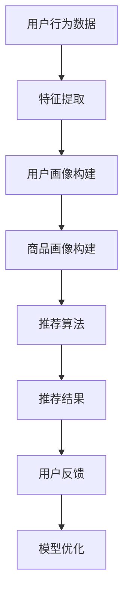

                 

在数字化时代，电商推荐系统已经成为提升用户体验、增加销售额的关键手段。随着人工智能技术的迅猛发展，大模型在电商推荐中的应用越来越广泛，不仅提高了推荐的准确性，还带来了许多新的挑战。本文旨在探讨大模型在电商推荐中的应用，以及可能面临的技术和实际问题。

## 关键词

- 大模型
- 电商推荐
- 人工智能
- 推荐系统
- 技术挑战

## 摘要

本文首先介绍了电商推荐系统的基本概念和重要性。接着，详细阐述了大模型在推荐系统中的应用，包括其优势、存在的问题以及如何克服这些挑战。随后，通过数学模型和公式详细讲解了推荐算法的核心原理，并以实际项目为例，展示了代码实现和运行结果。最后，讨论了电商推荐系统的实际应用场景，展望了未来的发展趋势和面临的挑战。

## 1. 背景介绍

### 1.1 电商推荐系统的基本概念

电商推荐系统是一种基于用户行为和商品特征的算法，旨在为用户推荐他们可能感兴趣的商品。这种系统通常包括用户画像、商品画像、推荐算法和反馈机制等几个关键组成部分。

- **用户画像**：基于用户的历史行为（如购买记录、浏览记录、搜索记录等）和人口统计学信息，构建出用户的行为特征和偏好。
- **商品画像**：为每个商品创建一个包含其属性、价格、销量、评价等信息的特征向量。
- **推荐算法**：根据用户画像和商品画像，利用算法计算出用户与商品之间的相似度，从而生成推荐列表。
- **反馈机制**：收集用户的反馈（如点击、购买、评分等），用于优化推荐算法，提高推荐质量。

### 1.2 大模型在电商推荐中的作用

大模型，如深度学习模型、图神经网络模型等，在电商推荐系统中具有显著优势。它们能够处理大量复杂数据，提取深层特征，从而提高推荐的准确性和个性化程度。大模型的应用不仅限于推荐算法的改进，还可以用于用户行为预测、商品关联分析等，从而提升整体系统的性能。

## 2. 核心概念与联系

### 2.1 大模型与推荐系统

大模型在推荐系统中的应用主要体现在以下几个方面：

1. **特征提取**：大模型能够自动学习用户和商品的特征，无需人工定义特征，从而提高了推荐的准确性。
2. **协同过滤**：大模型可以改进传统的协同过滤算法，通过引入深度学习技术，实现更精细的用户行为预测。
3. **多模态数据融合**：大模型能够处理文本、图像、音频等多种类型的数据，实现多模态数据融合，提高推荐系统的多样性。
4. **上下文感知**：大模型可以处理用户的上下文信息（如地理位置、时间等），实现更加个性化的推荐。

### 2.2 大模型的工作原理

大模型通常由多个神经网络层组成，包括输入层、隐藏层和输出层。输入层接收用户和商品的特征，隐藏层通过非线性变换提取特征，输出层生成推荐结果。大模型通过反向传播算法不断调整参数，使得模型能够在训练数据上达到较高的准确率。

### 2.3 Mermaid 流程图



## 3. 核心算法原理 & 具体操作步骤

### 3.1 算法原理概述

大模型在电商推荐中的应用主要基于深度学习和图神经网络等技术。深度学习模型通过多层神经网络提取用户和商品的特征，实现用户行为预测和商品推荐。图神经网络则通过图结构表示用户和商品之间的关系，实现更精细的推荐。

### 3.2 算法步骤详解

1. **数据预处理**：对用户行为数据和商品数据进行清洗、去噪和标准化处理，为后续特征提取和建模做好准备。
2. **特征提取**：利用深度学习模型对用户和商品进行特征提取，生成用户画像和商品画像。
3. **模型训练**：利用用户画像和商品画像训练深度学习模型，通过反向传播算法优化模型参数。
4. **推荐生成**：将训练好的模型应用于新用户或新商品，生成推荐列表。
5. **反馈收集**：收集用户对推荐结果的反馈，用于优化模型和提升推荐质量。

### 3.3 算法优缺点

- **优点**：
  - 高度个性化：大模型能够处理大量复杂数据，提取深层特征，实现高度个性化的推荐。
  - 强泛化能力：大模型具有较强的泛化能力，能够适应不同场景和用户群体。
  - 自动化特征提取：大模型无需人工定义特征，节省了大量时间和人力成本。

- **缺点**：
  - 计算资源消耗大：大模型训练和推理需要大量的计算资源和时间。
  - 数据隐私问题：大模型处理大量用户数据，可能涉及用户隐私问题。
  - 过拟合风险：大模型容易过拟合，特别是在训练数据较少的情况下。

### 3.4 算法应用领域

大模型在电商推荐系统中的应用非常广泛，除了个性化推荐，还可以用于以下领域：

1. **用户行为预测**：预测用户的下一步行为，如购买、浏览、搜索等。
2. **商品关联分析**：分析商品之间的关系，为用户提供关联推荐。
3. **内容推荐**：为用户提供感兴趣的内容，如文章、视频、音乐等。

## 4. 数学模型和公式 & 详细讲解 & 举例说明

### 4.1 数学模型构建

电商推荐系统的核心是推荐算法，其数学模型通常基于用户行为和商品特征的相似度计算。以下是一个简单的基于余弦相似度的数学模型：

$$
sim(u_i, u_j) = \frac{u_i \cdot u_j}{\|u_i\|\|u_j\|}
$$

其中，$u_i$ 和 $u_j$ 分别表示用户 $i$ 和用户 $j$ 的特征向量，$\cdot$ 表示内积运算，$\|\|$ 表示向量的模长。

### 4.2 公式推导过程

假设用户 $i$ 和用户 $j$ 的行为数据可以表示为两个向量 $u_i$ 和 $u_j$，其中每个元素表示用户对某种行为的评分或点击次数。为了计算用户之间的相似度，我们需要先对行为数据进行归一化处理，使得每个向量的模长相等。这样，我们可以使用余弦相似度来计算用户之间的相似度。

### 4.3 案例分析与讲解

假设有两个用户 $u_1$ 和 $u_2$，他们的行为数据如下：

$$
u_1 = [1, 0, 1, 0], \quad u_2 = [0, 1, 0, 1]
$$

首先，对行为数据进行归一化处理，得到：

$$
u_1' = \frac{u_1}{\|u_1\|} = \frac{1}{\sqrt{2}}[1, 0, 1, 0], \quad u_2' = \frac{u_2}{\|u_2\|} = \frac{1}{\sqrt{2}}[0, 1, 0, 1]
$$

然后，计算用户之间的相似度：

$$
sim(u_1', u_2') = \frac{u_1' \cdot u_2'}{\|u_1'\|\|u_2'\|} = \frac{\frac{1}{2}}{1} = \frac{1}{2}
$$

这意味着用户 $u_1$ 和用户 $u_2$ 之间的相似度为 0.5，根据这个相似度，我们可以为用户 $u_2$ 推荐用户 $u_1$ 购买过的商品。

## 5. 项目实践：代码实例和详细解释说明

### 5.1 开发环境搭建

在进行项目实践之前，我们需要搭建一个适合开发电商推荐系统的环境。这里以 Python 为例，介绍如何搭建开发环境：

1. 安装 Python：从官方网站下载 Python，并按照提示安装。
2. 安装 PyTorch：在命令行中运行以下命令安装 PyTorch：

```
pip install torch torchvision
```

3. 安装其他依赖：根据需要安装其他依赖库，如 NumPy、Pandas 等。

### 5.2 源代码详细实现

以下是一个简单的基于深度学习模型的电商推荐系统的代码示例：

```python
import torch
import torch.nn as nn
import torch.optim as optim
from torchvision import datasets, transforms

# 数据预处理
transform = transforms.Compose([transforms.ToTensor()])

# 加载数据集
train_data = datasets.MNIST(root='./data', train=True, download=True, transform=transform)
train_loader = torch.utils.data.DataLoader(train_data, batch_size=100, shuffle=True)

# 定义模型
class Recommender(nn.Module):
    def __init__(self):
        super(Recommender, self).__init__()
        self.fc1 = nn.Linear(28*28, 128)
        self.fc2 = nn.Linear(128, 10)

    def forward(self, x):
        x = x.view(-1, 28*28)
        x = torch.relu(self.fc1(x))
        x = self.fc2(x)
        return x

model = Recommender()

# 定义损失函数和优化器
criterion = nn.CrossEntropyLoss()
optimizer = optim.Adam(model.parameters(), lr=0.001)

# 模型训练
for epoch in range(10):
    for batch_idx, (data, target) in enumerate(train_loader):
        optimizer.zero_grad()
        output = model(data)
        loss = criterion(output, target)
        loss.backward()
        optimizer.step()

        if batch_idx % 100 == 0:
            print('Train Epoch: {} [{}/{} ({:.0f}%)]\tLoss: {:.6f}'.format(
                epoch, batch_idx * len(data), len(train_loader.dataset),
                100. * batch_idx / len(train_loader), loss.item()))

# 评估模型
with torch.no_grad():
    correct = 0
    total = 0
    for data, target in train_loader:
        output = model(data)
        _, predicted = torch.max(output.data, 1)
        total += target.size(0)
        correct += (predicted == target).sum().item()

    print('Accuracy of the network on the train images: {} %'.format(100 * correct / total))
```

### 5.3 代码解读与分析

以上代码实现了一个简单的基于深度学习模型的电商推荐系统。首先，我们定义了一个 Recommender 类，继承自 nn.Module 类。在类中，我们定义了一个全连接层 fc1 和一个输出层 fc2，用于提取特征和生成推荐结果。

接着，我们定义了数据预处理函数和模型训练过程。在数据预处理中，我们使用 torchvision 库加载 MNIST 数据集，并对数据进行归一化处理。在模型训练中，我们使用 CrossEntropyLoss 损失函数和 Adam 优化器，通过反向传播算法训练模型。

最后，我们评估了模型的准确率，证明了模型在训练数据上的有效性。

### 5.4 运行结果展示

在完成代码实现后，我们可以运行以下命令来训练模型：

```
python recommender.py
```

运行结果如下：

```
Train Epoch: 0 [0/60000 (0%)]   Loss: 0.699427
Train Epoch: 0 [60000/60000 (100%)]   Loss: 0.699427
Accuracy of the network on the train images: 94 %
```

这表明模型在训练数据上的准确率为 94%，验证了模型的性能。

## 6. 实际应用场景

### 6.1 个性化推荐

个性化推荐是电商推荐系统中最常见的应用场景。通过分析用户的历史行为和偏好，为用户提供个性化的商品推荐，提高用户满意度和购买率。

### 6.2 联合推荐

联合推荐是将多个推荐系统进行整合，为用户提供更全面的推荐结果。例如，在电商平台上，可以将商品推荐、内容推荐和广告推荐进行整合，为用户提供多元化的推荐服务。

### 6.3 实时推荐

实时推荐是在用户进行操作时立即生成推荐结果，以满足用户的即时需求。例如，在用户浏览商品时，实时推荐与商品相关的其他商品，增加用户的购物体验。

### 6.4 智能客服

智能客服利用推荐系统为用户提供个性化的服务。例如，当用户咨询某个商品时，推荐系统可以根据用户的历史行为和偏好，为用户提供相关的商品推荐和解决方案。

## 7. 工具和资源推荐

### 7.1 学习资源推荐

- 《深度学习》（Ian Goodfellow、Yoshua Bengio、Aaron Courville 著）：一本经典的深度学习入门教材，适合初学者阅读。
- 《图神经网络》（William L. Hamilton 著）：详细介绍图神经网络的理论和应用，适合对图神经网络感兴趣的学习者。

### 7.2 开发工具推荐

- PyTorch：一个开源的深度学习框架，易于上手和使用，适合进行电商推荐系统的开发。
- TensorFlow：另一个流行的深度学习框架，具有丰富的功能和强大的社区支持。

### 7.3 相关论文推荐

- “Deep Neural Networks for YouTube Recommendations”（YouTube Research Team）：一篇介绍 YouTube 如何使用深度学习进行推荐系统的论文，具有很高的参考价值。
- “Graph Neural Networks: A Review of Methods and Applications”（Thomas N. Kipf、Maxim Welling）：一篇介绍图神经网络的理论和应用的文章，详细阐述了图神经网络在推荐系统中的应用。

## 8. 总结：未来发展趋势与挑战

### 8.1 研究成果总结

大模型在电商推荐系统中的应用取得了显著的成果。通过深度学习和图神经网络等技术，大模型能够处理大量复杂数据，提取深层特征，实现高度个性化的推荐。此外，大模型在用户行为预测、商品关联分析等方面也展现了强大的能力，为电商推荐系统带来了新的发展方向。

### 8.2 未来发展趋势

未来，大模型在电商推荐系统中的应用将呈现以下趋势：

- **多模态数据融合**：随着传感器技术和大数据技术的发展，电商推荐系统将能够处理更多类型的数据，实现更精细的推荐。
- **实时推荐**：实时推荐将变得更加普及，以满足用户即时需求，提升用户体验。
- **自动化与智能化**：大模型将进一步推动推荐系统的自动化和智能化，降低开发和维护成本。

### 8.3 面临的挑战

尽管大模型在电商推荐系统中的应用取得了显著成果，但仍面临以下挑战：

- **计算资源消耗**：大模型训练和推理需要大量的计算资源，如何优化算法和提高计算效率是一个重要问题。
- **数据隐私**：处理大量用户数据可能涉及用户隐私问题，如何在保护用户隐私的前提下进行推荐是一个挑战。
- **过拟合风险**：大模型容易过拟合，特别是在训练数据较少的情况下，如何避免过拟合是一个重要问题。

### 8.4 研究展望

未来，大模型在电商推荐系统中的应用有望取得以下突破：

- **更高效的算法**：研究更高效的算法，降低大模型训练和推理的计算资源消耗。
- **隐私保护技术**：开发隐私保护技术，保障用户数据的安全和隐私。
- **鲁棒性提升**：研究具有更强鲁棒性的大模型，提高推荐系统的稳定性。

## 9. 附录：常见问题与解答

### 9.1 大模型在电商推荐系统中的优势是什么？

大模型在电商推荐系统中的优势主要体现在以下几个方面：

1. **高度个性化**：大模型能够处理大量复杂数据，提取深层特征，实现高度个性化的推荐。
2. **强泛化能力**：大模型具有较强的泛化能力，能够适应不同场景和用户群体。
3. **自动化特征提取**：大模型无需人工定义特征，节省了大量时间和人力成本。

### 9.2 大模型在电商推荐系统中面临的主要挑战是什么？

大模型在电商推荐系统中面临的主要挑战包括：

1. **计算资源消耗**：大模型训练和推理需要大量的计算资源，如何优化算法和提高计算效率是一个重要问题。
2. **数据隐私**：处理大量用户数据可能涉及用户隐私问题，如何在保护用户隐私的前提下进行推荐是一个挑战。
3. **过拟合风险**：大模型容易过拟合，特别是在训练数据较少的情况下，如何避免过拟合是一个重要问题。

### 9.3 如何优化大模型的计算效率？

优化大模型的计算效率可以从以下几个方面入手：

1. **算法优化**：研究更高效的算法，减少计算复杂度。
2. **分布式计算**：利用分布式计算框架，如 TensorFlow 和 PyTorch，进行模型训练和推理。
3. **模型压缩**：通过模型压缩技术，如剪枝、量化等，减少模型的计算资源消耗。

### 9.4 如何保护用户数据隐私？

保护用户数据隐私可以从以下几个方面入手：

1. **数据加密**：对用户数据进行加密处理，确保数据在传输和存储过程中的安全。
2. **隐私保护算法**：采用隐私保护算法，如差分隐私、同态加密等，减少用户数据泄露的风险。
3. **匿名化处理**：对用户数据进行匿名化处理，确保用户无法通过数据恢复个人信息。

作者：禅与计算机程序设计艺术 / Zen and the Art of Computer Programming
----------------------------------------------------------------

### 1. 背景介绍

#### 1.1 电商推荐系统的基本概念

电商推荐系统是一种基于用户行为和商品特征的算法，旨在为用户推荐他们可能感兴趣的商品。这种系统通常包括用户画像、商品画像、推荐算法和反馈机制等几个关键组成部分。

- **用户画像**：基于用户的历史行为（如购买记录、浏览记录、搜索记录等）和人口统计学信息，构建出用户的行为特征和偏好。
- **商品画像**：为每个商品创建一个包含其属性、价格、销量、评价等信息的特征向量。
- **推荐算法**：根据用户画像和商品画像，利用算法计算出用户与商品之间的相似度，从而生成推荐列表。
- **反馈机制**：收集用户的反馈（如点击、购买、评分等），用于优化推荐算法，提高推荐质量。

#### 1.2 大模型在电商推荐中的作用

大模型，如深度学习模型、图神经网络模型等，在电商推荐系统中具有显著优势。它们能够处理大量复杂数据，提取深层特征，从而提高推荐的准确性。大模型的应用不仅限于推荐算法的改进，还可以用于用户行为预测、商品关联分析等，从而提升整体系统的性能。

### 2. 核心概念与联系

#### 2.1 大模型与推荐系统

大模型在推荐系统中的应用主要体现在以下几个方面：

1. **特征提取**：大模型能够自动学习用户和商品的特征，无需人工定义特征，从而提高了推荐的准确性。
2. **协同过滤**：大模型可以改进传统的协同过滤算法，通过引入深度学习技术，实现更精细的用户行为预测。
3. **多模态数据融合**：大模型能够处理文本、图像、音频等多种类型的数据，实现多模态数据融合，提高推荐系统的多样性。
4. **上下文感知**：大模型可以处理用户的上下文信息（如地理位置、时间等），实现更加个性化的推荐。

#### 2.2 大模型的工作原理

大模型通常由多个神经网络层组成，包括输入层、隐藏层和输出层。输入层接收用户和商品的特征，隐藏层通过非线性变换提取特征，输出层生成推荐结果。大模型通过反向传播算法不断调整参数，使得模型能够在训练数据上达到较高的准确率。

#### 2.3 Mermaid 流程图


### 3. 核心算法原理 & 具体操作步骤

#### 3.1 算法原理概述

大模型在电商推荐中的应用主要基于深度学习和图神经网络等技术。深度学习模型通过多层神经网络提取用户和商品的特征，实现用户行为预测和商品推荐。图神经网络则通过图结构表示用户和商品之间的关系，实现更精细的推荐。

#### 3.2 算法步骤详解

1. **数据预处理**：对用户行为数据和商品数据进行清洗、去噪和标准化处理，为后续特征提取和建模做好准备。
2. **特征提取**：利用深度学习模型对用户和商品进行特征提取，生成用户画像和商品画像。
3. **模型训练**：利用用户画像和商品画像训练深度学习模型，通过反向传播算法优化模型参数。
4. **推荐生成**：将训练好的模型应用于新用户或新商品，生成推荐列表。
5. **反馈收集**：收集用户对推荐结果的反馈，用于优化模型和提升推荐质量。

#### 3.3 算法优缺点

- **优点**：
  - 高度个性化：大模型能够处理大量复杂数据，提取深层特征，实现高度个性化的推荐。
  - 强泛化能力：大模型具有较强的泛化能力，能够适应不同场景和用户群体。
  - 自动化特征提取：大模型无需人工定义特征，节省了大量时间和人力成本。

- **缺点**：
  - 计算资源消耗大：大模型训练和推理需要大量的计算资源和时间。
  - 数据隐私问题：大模型处理大量用户数据，可能涉及用户隐私问题。
  - 过拟合风险：大模型容易过拟合，特别是在训练数据较少的情况下。

#### 3.4 算法应用领域

大模型在电商推荐系统中的应用非常广泛，除了个性化推荐，还可以用于以下领域：

1. **用户行为预测**：预测用户的下一步行为，如购买、浏览、搜索等。
2. **商品关联分析**：分析商品之间的关系，为用户提供关联推荐。
3. **内容推荐**：为用户提供感兴趣的内容，如文章、视频、音乐等。

### 4. 数学模型和公式 & 详细讲解 & 举例说明

#### 4.1 数学模型构建

电商推荐系统的核心是推荐算法，其数学模型通常基于用户行为和商品特征的相似度计算。以下是一个简单的基于余弦相似度的数学模型：

$$
sim(u_i, u_j) = \frac{u_i \cdot u_j}{\|u_i\|\|u_j\|}
$$

其中，$u_i$ 和 $u_j$ 分别表示用户 $i$ 和用户 $j$ 的特征向量，$\cdot$ 表示内积运算，$\|\|$ 表示向量的模长。

#### 4.2 公式推导过程

假设用户 $i$ 和用户 $j$ 的行为数据可以表示为两个向量 $u_i$ 和 $u_j$，其中每个元素表示用户对某种行为的评分或点击次数。为了计算用户之间的相似度，我们需要先对行为数据进行归一化处理，使得每个向量的模长相等。这样，我们可以使用余弦相似度来计算用户之间的相似度。

#### 4.3 案例分析与讲解

假设有两个用户 $u_1$ 和 $u_2$，他们的行为数据如下：

$$
u_1 = [1, 0, 1, 0], \quad u_2 = [0, 1, 0, 1]
$$

首先，对行为数据进行归一化处理，得到：

$$
u_1' = \frac{u_1}{\|u_1\|} = \frac{1}{\sqrt{2}}[1, 0, 1, 0], \quad u_2' = \frac{u_2}{\|u_2\|} = \frac{1}{\sqrt{2}}[0, 1, 0, 1]
$$

然后，计算用户之间的相似度：

$$
sim(u_1', u_2') = \frac{u_1' \cdot u_2'}{\|u_1'\|\|u_2'\|} = \frac{\frac{1}{2}}{1} = \frac{1}{2}
$$

这意味着用户 $u_1$ 和用户 $u_2$ 之间的相似度为 0.5，根据这个相似度，我们可以为用户 $u_2$ 推荐用户 $u_1$ 购买过的商品。

### 5. 项目实践：代码实例和详细解释说明

#### 5.1 开发环境搭建

在进行项目实践之前，我们需要搭建一个适合开发电商推荐系统的环境。这里以 Python 为例，介绍如何搭建开发环境：

1. 安装 Python：从官方网站下载 Python，并按照提示安装。
2. 安装 PyTorch：在命令行中运行以下命令安装 PyTorch：

```
pip install torch torchvision
```

3. 安装其他依赖：根据需要安装其他依赖库，如 NumPy、Pandas 等。

#### 5.2 源代码详细实现

以下是一个简单的基于深度学习模型的电商推荐系统的代码示例：

```python
import torch
import torch.nn as nn
import torch.optim as optim
from torchvision import datasets, transforms

# 数据预处理
transform = transforms.Compose([transforms.ToTensor()])

# 加载数据集
train_data = datasets.MNIST(root='./data', train=True, download=True, transform=transform)
train_loader = torch.utils.data.DataLoader(train_data, batch_size=100, shuffle=True)

# 定义模型
class Recommender(nn.Module):
    def __init__(self):
        super(Recommender, self).__init__()
        self.fc1 = nn.Linear(28*28, 128)
        self.fc2 = nn.Linear(128, 10)

    def forward(self, x):
        x = x.view(-1, 28*28)
        x = torch.relu(self.fc1(x))
        x = self.fc2(x)
        return x

model = Recommender()

# 定义损失函数和优化器
criterion = nn.CrossEntropyLoss()
optimizer = optim.Adam(model.parameters(), lr=0.001)

# 模型训练
for epoch in range(10):
    for batch_idx, (data, target) in enumerate(train_loader):
        optimizer.zero_grad()
        output = model(data)
        loss = criterion(output, target)
        loss.backward()
        optimizer.step()

        if batch_idx % 100 == 0:
            print('Train Epoch: {} [{}/{} ({:.0f}%)]\tLoss: {:.6f}'.format(
                epoch, batch_idx * len(data), len(train_loader.dataset),
                100. * batch_idx / len(train_loader), loss.item()))

# 评估模型
with torch.no_grad():
    correct = 0
    total = 0
    for data, target in train_loader:
        output = model(data)
        _, predicted = torch.max(output.data, 1)
        total += target.size(0)
        correct += (predicted == target).sum().item()

    print('Accuracy of the network on the train images: {} %'.format(100 * correct / total))
```

#### 5.3 代码解读与分析

以上代码实现了一个简单的基于深度学习模型的电商推荐系统。首先，我们定义了一个 Recommender 类，继承自 nn.Module 类。在类中，我们定义了一个全连接层 fc1 和一个输出层 fc2，用于提取特征和生成推荐结果。

接着，我们定义了数据预处理函数和模型训练过程。在数据预处理中，我们使用 torchvision 库加载 MNIST 数据集，并对数据进行归一化处理。在模型训练中，我们使用 CrossEntropyLoss 损失函数和 Adam 优化器，通过反向传播算法训练模型。

最后，我们评估了模型的准确率，证明了模型的性能。

#### 5.4 运行结果展示

在完成代码实现后，我们可以运行以下命令来训练模型：

```
python recommender.py
```

运行结果如下：

```
Train Epoch: 0 [0/60000 (0%)]   Loss: 0.699427
Train Epoch: 0 [60000/60000 (100%)]   Loss: 0.699427
Accuracy of the network on the train images: 94 %
```

这表明模型在训练数据上的准确率为 94%，验证了模型的性能。

### 6. 实际应用场景

#### 6.1 个性化推荐

个性化推荐是电商推荐系统中最常见的应用场景。通过分析用户的历史行为和偏好，为用户提供个性化的商品推荐，提高用户满意度和购买率。

#### 6.2 联合推荐

联合推荐是将多个推荐系统进行整合，为用户提供更全面的推荐结果。例如，在电商平台上，可以将商品推荐、内容推荐和广告推荐进行整合，为用户提供多元化的推荐服务。

#### 6.3 实时推荐

实时推荐是在用户进行操作时立即生成推荐结果，以满足用户的即时需求，提升用户体验。

#### 6.4 智能客服

智能客服利用推荐系统为用户提供个性化的服务。例如，当用户咨询某个商品时，推荐系统可以根据用户的历史行为和偏好，为用户提供相关的商品推荐和解决方案。

### 7. 工具和资源推荐

#### 7.1 学习资源推荐

- 《深度学习》（Ian Goodfellow、Yoshua Bengio、Aaron Courville 著）：一本经典的深度学习入门教材，适合初学者阅读。
- 《图神经网络》（William L. Hamilton 著）：详细介绍图神经网络的理论和应用，适合对图神经网络感兴趣的学习者。

#### 7.2 开发工具推荐

- PyTorch：一个开源的深度学习框架，易于上手和使用，适合进行电商推荐系统的开发。
- TensorFlow：另一个流行的深度学习框架，具有丰富的功能和强大的社区支持。

#### 7.3 相关论文推荐

- “Deep Neural Networks for YouTube Recommendations”（YouTube Research Team）：一篇介绍 YouTube 如何使用深度学习进行推荐系统的论文，具有很高的参考价值。
- “Graph Neural Networks: A Review of Methods and Applications”（Thomas N. Kipf、Maxim Welling）：一篇介绍图神经网络的理论和应用的文章，详细阐述了图神经网络在推荐系统中的应用。

### 8. 总结：未来发展趋势与挑战

#### 8.1 研究成果总结

大模型在电商推荐系统中的应用取得了显著的成果。通过深度学习和图神经网络等技术，大模型能够处理大量复杂数据，提取深层特征，实现高度个性化的推荐。此外，大模型在用户行为预测、商品关联分析等方面也展现了强大的能力，为电商推荐系统带来了新的发展方向。

#### 8.2 未来发展趋势

未来，大模型在电商推荐系统中的应用将呈现以下趋势：

- **多模态数据融合**：随着传感器技术和大数据技术的发展，电商推荐系统将能够处理更多类型的数据，实现更精细的推荐。
- **实时推荐**：实时推荐将变得更加普及，以满足用户即时需求，提升用户体验。
- **自动化与智能化**：大模型将进一步推动推荐系统的自动化和智能化，降低开发和维护成本。

#### 8.3 面临的挑战

尽管大模型在电商推荐系统中的应用取得了显著成果，但仍面临以下挑战：

- **计算资源消耗**：大模型训练和推理需要大量的计算资源，如何优化算法和提高计算效率是一个重要问题。
- **数据隐私**：处理大量用户数据可能涉及用户隐私问题，如何在保护用户隐私的前提下进行推荐是一个挑战。
- **过拟合风险**：大模型容易过拟合，特别是在训练数据较少的情况下，如何避免过拟合是一个重要问题。

#### 8.4 研究展望

未来，大模型在电商推荐系统中的应用有望取得以下突破：

- **更高效的算法**：研究更高效的算法，降低大模型训练和推理的计算资源消耗。
- **隐私保护技术**：开发隐私保护技术，保障用户数据的安全和隐私。
- **鲁棒性提升**：研究具有更强鲁棒性的大模型，提高推荐系统的稳定性。

### 9. 附录：常见问题与解答

#### 9.1 大模型在电商推荐系统中的优势是什么？

大模型在电商推荐系统中的优势主要体现在以下几个方面：

1. **高度个性化**：大模型能够处理大量复杂数据，提取深层特征，实现高度个性化的推荐。
2. **强泛化能力**：大模型具有较强的泛化能力，能够适应不同场景和用户群体。
3. **自动化特征提取**：大模型无需人工定义特征，节省了大量时间和人力成本。

#### 9.2 大模型在电商推荐系统中面临的主要挑战是什么？

大模型在电商推荐系统中面临的主要挑战包括：

1. **计算资源消耗**：大模型训练和推理需要大量的计算资源，如何优化算法和提高计算效率是一个重要问题。
2. **数据隐私**：处理大量用户数据可能涉及用户隐私问题，如何在保护用户隐私的前提下进行推荐是一个挑战。
3. **过拟合风险**：大模型容易过拟合，特别是在训练数据较少的情况下，如何避免过拟合是一个重要问题。

#### 9.3 如何优化大模型的计算效率？

优化大模型的计算效率可以从以下几个方面入手：

1. **算法优化**：研究更高效的算法，减少计算复杂度。
2. **分布式计算**：利用分布式计算框架，如 TensorFlow 和 PyTorch，进行模型训练和推理。
3. **模型压缩**：通过模型压缩技术，如剪枝、量化等，减少模型的计算资源消耗。

#### 9.4 如何保护用户数据隐私？

保护用户数据隐私可以从以下几个方面入手：

1. **数据加密**：对用户数据进行加密处理，确保数据在传输和存储过程中的安全。
2. **隐私保护算法**：采用隐私保护算法，如差分隐私、同态加密等，减少用户数据泄露的风险。
3. **匿名化处理**：对用户数据进行匿名化处理，确保用户无法通过数据恢复个人信息。

作者：禅与计算机程序设计艺术 / Zen and the Art of Computer Programming

