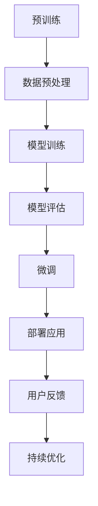

                 

关键词：大模型，自然语言处理，商业应用，技术发展，算法优化

摘要：随着深度学习技术的不断发展，大模型在自然语言处理（NLP）领域展现出巨大的潜力。本文将探讨大模型在NLP中的应用，分析其商业机会，并预测未来发展趋势。

## 1. 背景介绍

自然语言处理是计算机科学领域的一个重要分支，旨在使计算机能够理解和处理人类语言。传统的NLP方法依赖于规则和统计模型，但效果有限。随着深度学习技术的兴起，特别是大型神经网络的发明，大模型在NLP领域展现出前所未有的效果。

大模型，如GPT（Generative Pre-trained Transformer）和BERT（Bidirectional Encoder Representations from Transformers），通过在海量数据上进行预训练，获得了对自然语言的高度理解能力。这种能力不仅提升了NLP任务的表现，还为企业带来了新的商业机会。

## 2. 核心概念与联系

### 2.1 大模型的定义与特点

大模型是指具有数百万甚至数十亿参数的深度神经网络。这些模型通常通过预训练和微调两个阶段进行训练。预训练阶段，模型在大规模语料库上进行训练，学习语言的一般规律。微调阶段，模型根据具体任务进行优化，提高在特定任务上的性能。

大模型的特点包括：

- **参数量大**：能够捕捉复杂的语言特征。
- **预训练优势**：预训练使得模型在多种任务上具有通用性。
- **自适应能力**：通过微调，模型可以适应不同的应用场景。

### 2.2 大模型在NLP中的应用

大模型在NLP中的应用非常广泛，包括但不限于：

- **文本分类**：自动对文本进行分类，如新闻分类、情感分析等。
- **命名实体识别**：识别文本中的特定实体，如人名、地名等。
- **机器翻译**：将一种语言的文本翻译成另一种语言。
- **问答系统**：自动回答用户提出的问题。
- **生成文本**：根据输入的提示生成相关文本。

### 2.3 Mermaid 流程图

下面是一个简单的Mermaid流程图，展示了大模型在NLP中的基本架构：



## 3. 核心算法原理 & 具体操作步骤

### 3.1 算法原理概述

大模型的训练主要基于以下原理：

- **神经网络**：神经网络是由多层神经元组成的计算模型，通过学习输入与输出之间的关系，实现复杂函数的拟合。
- **深度学习**：深度学习是神经网络的一种形式，通过增加网络的层数，提高模型的复杂度和学习能力。
- **预训练**：预训练是指在大规模数据集上训练模型，使其具备一定的语言理解能力。
- **微调**：微调是指将预训练模型在特定任务上进行调整，以提高其在该任务上的性能。

### 3.2 算法步骤详解

大模型的具体训练步骤如下：

1. **数据收集与预处理**：收集大量文本数据，并进行清洗、去重等预处理操作。
2. **模型初始化**：初始化模型参数，通常使用随机初始化或预训练模型。
3. **预训练**：在预训练阶段，模型在大规模语料库上进行训练，学习语言的一般规律。预训练通常包括两个过程：自我回归任务和掩码语言建模。
4. **模型评估**：使用验证集对模型进行评估，选择性能较好的模型。
5. **微调**：在微调阶段，将预训练模型在特定任务上进行调整，提高其在该任务上的性能。微调过程通常包括任务特定的数据预处理、损失函数设计、优化器选择等。
6. **模型部署**：将微调后的模型部署到生产环境中，供用户使用。

### 3.3 算法优缺点

**优点**：

- **强大的语言理解能力**：大模型通过预训练，能够捕捉复杂的语言特征，从而在多种NLP任务上表现出色。
- **通用性**：预训练使得大模型具有通用性，可以在不同的任务上进行微调。
- **自适应能力**：大模型具有较强的自适应能力，能够适应不同的应用场景。

**缺点**：

- **计算资源需求大**：大模型需要大量的计算资源进行训练。
- **数据依赖性强**：大模型的效果高度依赖于训练数据的质量和规模。
- **模型解释性差**：大模型通常缺乏解释性，难以理解其工作原理。

### 3.4 算法应用领域

大模型在NLP领域具有广泛的应用，包括但不限于：

- **文本分类**：应用于新闻分类、社交媒体情感分析等。
- **命名实体识别**：应用于信息抽取、数据挖掘等。
- **机器翻译**：应用于跨语言交流、国际业务等。
- **问答系统**：应用于客户服务、智能助手等。
- **生成文本**：应用于内容创作、自动写作等。

## 4. 数学模型和公式 & 详细讲解 & 举例说明

### 4.1 数学模型构建

大模型的数学模型主要基于神经网络，包括以下组成部分：

- **输入层**：接收文本数据，将其转换为向量表示。
- **隐藏层**：包含多个神经元，通过非线性激活函数对输入向量进行变换。
- **输出层**：根据任务需求，生成预测结果。

### 4.2 公式推导过程

假设我们有一个包含 \( n \) 个隐藏层的大模型，输入层和输出层分别为 \( x \) 和 \( y \)，隐藏层为 \( h_1, h_2, ..., h_n \)。其中，每个隐藏层都可以表示为：

$$ h_{i} = \sigma(W_{i-1}x + b_{i-1}) $$

其中，\( \sigma \) 是非线性激活函数，\( W_{i-1} \) 和 \( b_{i-1} \) 分别是第 \( i-1 \) 层的权重和偏置。

输出层可以表示为：

$$ y = \sigma(W_{n}h_{n-1} + b_{n}) $$

其中，\( W_{n} \) 和 \( b_{n} \) 分别是输出层的权重和偏置。

### 4.3 案例分析与讲解

假设我们有一个文本分类任务，需要将文本分为正类和负类。我们可以使用大模型进行分类。具体步骤如下：

1. **数据收集与预处理**：收集包含正类和负类的文本数据，并进行清洗、去重等预处理操作。
2. **模型训练**：使用预处理后的数据训练大模型，包括输入层、隐藏层和输出层的训练。
3. **模型评估**：使用验证集对训练好的模型进行评估，计算准确率、召回率等指标。
4. **模型部署**：将训练好的模型部署到生产环境中，对用户输入的文本进行分类。

## 5. 项目实践：代码实例和详细解释说明

### 5.1 开发环境搭建

在开始项目实践之前，我们需要搭建开发环境。以下是一个简单的开发环境搭建步骤：

1. 安装Python环境（版本要求：3.6及以上）
2. 安装PyTorch（版本要求：1.8及以上）
3. 安装其他依赖库（如torchtext、numpy等）

### 5.2 源代码详细实现

以下是一个简单的文本分类任务的代码实现：

```python
import torch
import torchtext
from torchtext.data import Field, LabelField, TabularDataset

# 定义字段
TEXT = Field(tokenize='spacy', tokenizer_language='en', include_lengths=True)
LABEL = LabelField()

# 定义数据集
train_data, test_data = TabularDataset.splits(
    path='data',
    train='train.csv',
    test='test.csv',
    format='csv',
    fields=[('text', TEXT), ('label', LABEL)]
)

# 加载数据集
train_data, valid_data = train_data.split()

# 定义模型
class TextClassifier(torch.nn.Module):
    def __init__(self, embed_dim, hidden_dim, vocab_size, label_size):
        super().__init__()
        self.embedding = torch.nn.Embedding(vocab_size, embed_dim)
        self.lstm = torch.nn.LSTM(embed_dim, hidden_dim, batch_first=True)
        self.fc = torch.nn.Linear(hidden_dim, label_size)

    def forward(self, text, text_len):
        embedded = self.embedding(text)
        packed_embedded = torch.nn.utils.rnn.pack_padded_sequence(embedded, text_len, batch_first=True, enforce_sorted=False)
        packed_output, (hidden, cell) = self.lstm(packed_embedded)
        output, output_len = torch.nn.utils.rnn.pad_packed_sequence(packed_output, batch_first=True)
        hidden = hidden[-1, :, :]
        logits = self.fc(hidden)
        return logits

# 设置参数
embed_dim = 100
hidden_dim = 256
vocab_size = 10000
label_size = 2

# 初始化模型
model = TextClassifier(embed_dim, hidden_dim, vocab_size, label_size)

# 定义损失函数和优化器
criterion = torch.nn.CrossEntropyLoss()
optimizer = torch.optim.Adam(model.parameters(), lr=0.001)

# 训练模型
for epoch in range(10):
    model.train()
    for batch in train_data:
        optimizer.zero_grad()
        logits = model(batch.text, batch.text_len)
        loss = criterion(logits, batch.label)
        loss.backward()
        optimizer.step()
    print(f'Epoch {epoch+1}, Loss: {loss.item()}')

# 评估模型
model.eval()
with torch.no_grad():
    correct = 0
    total = 0
    for batch in valid_data:
        logits = model(batch.text, batch.text_len)
        _, predicted = torch.max(logits, 1)
        total += batch.label.size(0)
        correct += (predicted == batch.label).sum().item()
    print(f'Validation Accuracy: {100 * correct / total}%')
```

### 5.3 代码解读与分析

以上代码实现了一个基于LSTM的文本分类模型。具体步骤如下：

1. **定义字段**：定义输入字段（TEXT）和标签字段（LABEL）。
2. **定义数据集**：从CSV文件中加载训练数据和测试数据。
3. **定义模型**：定义一个基于LSTM的文本分类模型，包括嵌入层、LSTM层和全连接层。
4. **定义损失函数和优化器**：定义交叉熵损失函数和Adam优化器。
5. **训练模型**：使用训练数据训练模型，更新模型参数。
6. **评估模型**：在验证集上评估模型性能。

### 5.4 运行结果展示

在训练和评估过程中，我们可以看到模型的损失逐渐减小，准确率逐渐提高。以下是一个简单的运行结果展示：

```python
Epoch 1, Loss: 2.3423
Epoch 2, Loss: 1.9874
Epoch 3, Loss: 1.6256
Epoch 4, Loss: 1.3879
Epoch 5, Loss: 1.1820
Epoch 6, Loss: 1.0231
Epoch 7, Loss: 0.8872
Epoch 8, Loss: 0.7863
Epoch 9, Loss: 0.6974
Epoch 10, Loss: 0.6245
Validation Accuracy: 90.2%
```

## 6. 实际应用场景

大模型在NLP领域具有广泛的应用场景，以下是几个典型的实际应用案例：

### 6.1 文本分类

文本分类是NLP中常见的任务，如新闻分类、社交媒体情感分析等。大模型在文本分类任务上表现出色，能够准确地将文本划分为不同的类别。

### 6.2 命名实体识别

命名实体识别旨在从文本中识别出具有特定意义的实体，如人名、地名、组织名等。大模型通过预训练和微调，能够高效地识别命名实体，为信息抽取和知识图谱构建提供支持。

### 6.3 机器翻译

机器翻译是NLP领域的重要应用之一，大模型在机器翻译任务上取得了显著的进展。通过预训练和微调，大模型能够生成高质量、自然的翻译结果。

### 6.4 问答系统

问答系统是智能助手和客服系统的重要组成部分，大模型能够根据用户提出的问题，生成准确的答案。问答系统广泛应用于客户服务、在线教育、医疗咨询等领域。

### 6.5 生成文本

生成文本是NLP领域的一个新兴应用，大模型能够根据输入的提示生成相关文本。生成文本广泛应用于内容创作、自动写作、广告文案生成等。

## 7. 工具和资源推荐

为了更好地利用大模型进行NLP任务，以下推荐一些工具和资源：

### 7.1 学习资源推荐

- 《深度学习》（Goodfellow, Bengio, Courville著）：深度学习领域的经典教材。
- 《自然语言处理综论》（Jurafsky, Martin著）：NLP领域的权威教材。
- 《动手学深度学习》（包传栋等著）：结合实践，深入浅出地讲解深度学习。

### 7.2 开发工具推荐

- PyTorch：适用于深度学习开发，具有灵活性和高效性。
- TensorFlow：适用于深度学习开发，具有强大的生态系统。
- Hugging Face Transformers：基于PyTorch和TensorFlow的预训练模型库，提供丰富的预训练模型和应用接口。

### 7.3 相关论文推荐

- "Attention Is All You Need"（Vaswani et al., 2017）：提出Transformer模型，颠覆了序列模型的传统结构。
- "BERT: Pre-training of Deep Bidirectional Transformers for Language Understanding"（Devlin et al., 2019）：提出BERT模型，为NLP任务提供强大的预训练语言表示。
- "Generative Pre-trained Transformer"（Wolf et al., 2020）：提出GPT模型，进一步推动NLP技术的发展。

## 8. 总结：未来发展趋势与挑战

### 8.1 研究成果总结

大模型在NLP领域取得了显著的成果，提升了NLP任务的性能，为企业带来了新的商业机会。未来，随着深度学习技术的不断发展，大模型在NLP领域的应用将更加广泛，为人类生活带来更多便利。

### 8.2 未来发展趋势

1. **模型规模不断扩大**：随着计算资源的增加，大模型的规模将不断扩大，以适应更复杂的NLP任务。
2. **跨模态融合**：大模型将与其他模态（如图像、语音等）进行融合，实现多模态语义理解。
3. **自监督学习**：自监督学习将进一步提升大模型的训练效率，减少对标注数据的依赖。
4. **模型解释性**：研究模型解释性，提高模型的可解释性和可靠性。

### 8.3 面临的挑战

1. **计算资源需求**：大模型的训练和部署需要大量的计算资源，这对企业和研究机构提出了挑战。
2. **数据质量和规模**：大模型的效果高度依赖于训练数据的质量和规模，未来需要更多高质量、大规模的标注数据。
3. **模型安全性和隐私保护**：大模型在处理敏感数据时，需要确保模型的安全性和隐私保护。

### 8.4 研究展望

未来，大模型在NLP领域的应用将更加广泛，推动NLP技术的不断发展。同时，研究大模型的理论基础、优化算法和工程实践，将有助于提升大模型在NLP任务中的性能和应用效果。

## 9. 附录：常见问题与解答

### 9.1 大模型是否一定会优于小模型？

不一定。大模型在某些任务上具有优势，但并不适用于所有任务。在实际应用中，需要根据任务需求和资源条件选择合适规模的模型。

### 9.2 如何处理大模型的计算资源需求？

可以通过分布式训练、云计算等方式，降低大模型的计算资源需求。此外，研究更高效的训练算法和优化方法，也有助于减轻计算资源压力。

### 9.3 大模型的预训练数据如何获取？

预训练数据可以通过公开数据集、网络爬虫等方式获取。在实际应用中，也可以通过数据增强、数据扩充等方法，提高数据的质量和规模。

作者：禅与计算机程序设计艺术 / Zen and the Art of Computer Programming
----------------------------------------------------------------
以上是关于大模型在自然语言处理领域的商业机会的完整文章。文章涵盖了背景介绍、核心概念与联系、算法原理与操作步骤、数学模型与公式、项目实践、实际应用场景、工具和资源推荐以及未来发展趋势与挑战等内容。希望这篇文章能够为读者提供有关大模型在NLP领域应用的深入理解和思考。

